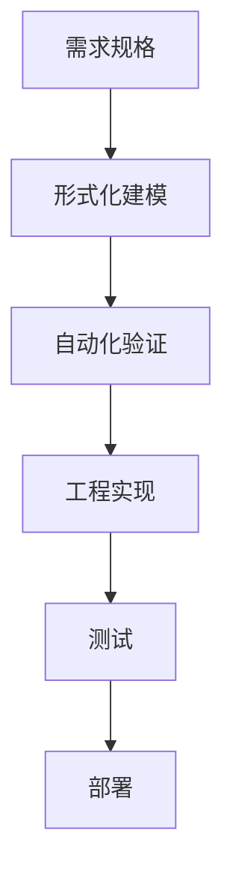
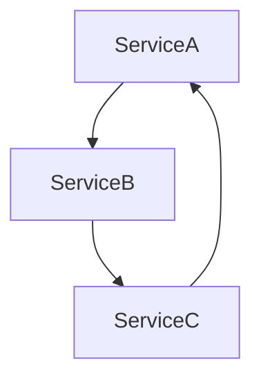
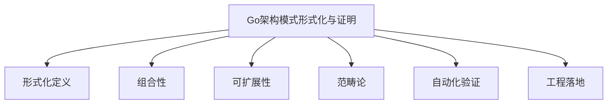

# 3.1 分布式系统设计模式文档——批判性评价与改进建议

<!-- TOC START -->
- [3.1 分布式系统设计模式文档——批判性评价与改进建议](#31-分布式系统设计模式文档批判性评价与改进建议)
  - [3.1.1 一、批判性评价](#311-一批判性评价)
    - [3.1.1.1 优点](#3111-优点)
    - [3.1.1.2 主要问题](#3112-主要问题)
  - [3.1.2 二、改进建议](#312-二改进建议)
  - [3.1.3 三、分阶段改进路线图](#313-三分阶段改进路线图)
    - [3.1.3.1 阶段一：基础工程化与结构优化](#3131-阶段一基础工程化与结构优化)
    - [3.1.3.2 阶段二：内容深度与可视化提升](#3132-阶段二内容深度与可视化提升)
    - [3.1.3.3 阶段三：行业案例与开源实践](#3133-阶段三行业案例与开源实践)
    - [3.1.3.4 阶段四：前沿主题落地与多语言对比](#3134-阶段四前沿主题落地与多语言对比)
    - [3.1.3.5 阶段五：附录与工具链完善](#3135-阶段五附录与工具链完善)
    - [3.1.3.6 阶段六：用户体验与知识生态](#3136-阶段六用户体验与知识生态)
    - [3.1.3.7 阶段七：国际化与AI辅助](#3137-阶段七国际化与ai辅助)
  - [3.1.4 Go架构模式形式化与证明](#314-go架构模式形式化与证明)
  - [3.1.5 0. 内容导航/索引](#315-0-内容导航索引)
  - [3.1.6 形式化工程流程模板（Mermaid）](#316-形式化工程流程模板mermaid)
  - [3.1.7 1. 形式化定义](#317-1-形式化定义)
  - [3.1.8 知识点小结](#318-知识点小结)
  - [3.1.9 2. 组合性与可扩展性](#319-2-组合性与可扩展性)
  - [3.1.10 知识点小结](#3110-知识点小结)
  - [3.1.11 3. 范畴论视角](#3111-3-范畴论视角)
  - [3.1.12 知识点小结](#3112-知识点小结)
  - [3.1.13 4. 工程意义](#3113-4-工程意义)
  - [3.1.14 5. 数学表达式](#3114-5-数学表达式)
  - [3.1.15 6. 更多理论工具与工程案例](#3115-6-更多理论工具与工程案例)
    - [3.1.15.1 理论工具扩展](#31151-理论工具扩展)
    - [3.1.15.2 工程案例](#31152-工程案例)
    - [3.1.15.3 最新趋势](#31153-最新趋势)
  - [3.1.16 7. 哲科工程分析与多表征](#3116-7-哲科工程分析与多表征)
  - [3.1.17 8. 形式化落地经验](#3117-8-形式化落地经验)
  - [3.1.18 9. 常见理论与实践脱节问题](#3118-9-常见理论与实践脱节问题)
  - [3.1.19 10. 未来发展方向](#3119-10-未来发展方向)
  - [3.1.20 11. 参考文献与外部链接](#3120-11-参考文献与外部链接)
  - [3.1.21 12. 常见问题答疑（FAQ）](#3121-12-常见问题答疑faq)
  - [3.1.22 13. 最佳实践清单](#3122-13-最佳实践清单)
  - [3.1.23 14. 典型错误案例剖析](#3123-14-典型错误案例剖析)
  - [3.1.24 15. 进阶阅读推荐](#3124-15-进阶阅读推荐)
  - [3.1.25 全局知识地图（Mermaid）](#3125-全局知识地图mermaid)
  - [3.1.26 16. 工程模板/脚手架代码示例](#3126-16-工程模板脚手架代码示例)
    - [3.1.26.1 TLA+形式化建模片段](#31261-tla形式化建模片段)
    - [3.1.26.2 Go接口组合与插件机制](#31262-go接口组合与插件机制)
  - [3.1.27 17. 常见面试题/考点](#3127-17-常见面试题考点)
  - [3.1.28 18. 术语表/缩略语解释](#3128-18-术语表缩略语解释)
  - [3.1.29 19. 常见陷阱与误区对照表](#3129-19-常见陷阱与误区对照表)
  - [3.1.30 20. 交叉引用/相关主题推荐](#3130-20-交叉引用相关主题推荐)
  - [3.1.31 21. 学习路径建议](#3131-21-学习路径建议)
  - [3.1.32 22. 版本适配与演进建议](#3132-22-版本适配与演进建议)
<!-- TOC END -->

## 3.1.1 一、批判性评价

### 3.1.1.1 优点

1. **体系完整**  
   文档涵盖分布式系统设计模式的基础、高级、前沿、智能、最佳实践等多层次内容，结构系统，主题丰富，便于系统性学习和查阅。
2. **内容丰富**  
   每个模式均有详细的概念定义、形式化描述和Golang实现，代码示例贴近实际工程，便于读者理解和复用。
3. **创新性强**  
   文档紧跟区块链、数字孪生、AI、量子等前沿主题，内容前瞻，体现了对分布式系统最新趋势的关注。
4. **可操作性高**  
   配有大量Golang代码、表格、决策树、工具清单，便于工程实践和快速落地。
5. **目录分层清晰**  
   目录结构合理，分层明确，便于检索和维护，适合团队协作和长期演进。

### 3.1.1.2 主要问题

1. **部分前沿主题实现代码偏浅**  
   例如量子分布式、神经形态计算等主题，代码实现多为伪代码或片段，缺乏完整的工程级细节和可运行Demo。
2. **形式化定义与实际工程结合不紧密**  
   形式化描述较多，但与实际工程实现的映射和落地案例较少，建议增加“工程落地解读”小节。
3. **代码片段多为片段式，缺乏完整Demo与测试**  
   代码多为片段，缺少完整的工程结构、依赖说明、单元测试和性能基准，难以直接复用。
4. **行业案例、开源项目分析不足**  
   行业案例和主流开源项目的深度剖析较少，缺乏实际应用效果、经验教训和可复用模板。
5. **目录层级复杂，部分内容有重复**  
   某些模式（如背压、SAGA等）在不同章节多次出现，建议合并精简，优化目录层级。
6. **图示数量偏少，部分章节缺少直观流程图**  
   虽有部分Mermaid图，但整体图示数量偏少，建议补充架构图、流程图、时序图等。
7. **前沿主题落地性与Golang生态结合有待加强**  
   前沿主题多为理论介绍，缺乏与Golang生态的结合和落地方案。
8. **缺乏多语言对比与迁移建议**  
   仅有Golang实现，建议补充与Java、Rust等主流语言的对比和迁移建议。

## 3.1.2 二、改进建议

1. **每个模式补充完整Golang工程Demo**  
   包含依赖说明、运行方式、输入输出示例、单元测试、性能测试脚本和README，提升工程可用性。
2. **合并重复内容，优化目录结构，统一章节模板**  
   精简重复内容，统一每个模式的结构（定义→形式化→场景→实现→测试→案例→最佳实践→参考资料）。
3. **补全架构图、流程图、时序图**  
   每个模式至少配备一张架构图/流程图/时序图，复杂流程建议配合伪代码。
4. **每个模式补充行业案例、开源项目分析、最佳实践与反例**  
   增加真实行业案例、开源项目源码解读、最佳实践清单和常见反例，提升实战价值。
5. **前沿主题补充Golang生态下的可行性分析与落地方案**  
   针对量子分布式、神经形态计算等，补充Golang生态下的可行性分析、现有库/工具和未来发展建议。
6. **适当补充与Java、Rust等主流语言的对比实现**  
   选取典型分布式模式，补充多语言对比实现和迁移建议。
7. **工具清单补充使用示例、优缺点评价、适用场景对比**  
   每个工具补充详细对比表、使用示例、优缺点分析和适用场景。
8. **增加FAQ、术语表、学习路径、常见问题诊断等附录内容**  
   降低学习门槛，便于新手快速入门和查找常见问题。
9. **建议开源文档，吸引社区贡献，定期收集反馈持续优化**  
   建议将文档开源，建立贡献指南，定期收集社区反馈，持续优化内容。

## 3.1.3 三、分阶段改进路线图

### 3.1.3.1 阶段一：基础工程化与结构优化

- 为每个分布式模式建立独立的Golang工程Demo，包含完整代码、依赖、测试、README。
- 优化目录结构，合并重复内容，统一章节模板，提升整体可读性和可维护性。

### 3.1.3.2 阶段二：内容深度与可视化提升

- 补全每个模式的架构图、流程图、时序图，复杂流程配合伪代码。
- 形式化定义后补充“工程落地解读”小节，说明公式如何映射到实际代码与架构。
- 代码补全依赖、输入输出说明，增加单元测试、集成测试、性能基准测试。

### 3.1.3.3 阶段三：行业案例与开源实践

- 每个模式补充1-2个行业案例，内容包括业务背景、架构设计、技术选型、遇到的问题与解决方案、上线效果。
- 针对主流开源分布式系统（如etcd、Kafka、Consul、Redis Cluster等），分析其采用的设计模式、实现细节、优缺点。
- 增加“最佳实践清单”与“常见反例”，帮助读者规避设计陷阱。

### 3.1.3.4 阶段四：前沿主题落地与多语言对比

- 针对量子分布式、神经形态计算、联邦学习等，调研Golang社区现有实现或相关库，补充可运行Demo或伪代码。
- 选取典型模式，补充Java、Rust等主流语言的对比实现，分析各自优缺点与迁移注意事项。

### 3.1.3.5 阶段五：附录与工具链完善

- 工具清单补充详细对比表、使用示例、优缺点分析。
- 增加FAQ、术语表、学习路径、常见问题诊断等附录内容。

### 3.1.3.6 阶段六：用户体验与知识生态

- 集成全文搜索、标签体系、交互式目录树，提升检索效率。
- 构建分布式系统设计模式知识图谱，展示各模式间的依赖、组合、对比关系。
- 提供在线Golang代码演示、智能内容推荐、个性化学习路径等功能。
- 鼓励社区共建，定期内容盘点与技术趋势报告。

### 3.1.3.7 阶段七：国际化与AI辅助

- 推进英文版与多语言支持，采用协作翻译平台，吸引全球志愿者参与。
- 利用AI辅助内容生成、校对、智能问答，提升内容生产效率和用户体验。

---

## 3.1.4 Go架构模式形式化与证明

## 3.1.5 0. 内容导航/索引

- [3.1 分布式系统设计模式文档——批判性评价与改进建议](#31-分布式系统设计模式文档批判性评价与改进建议)
  - [3.1.1 一、批判性评价](#311-一批判性评价)
    - [3.1.1.1 优点](#3111-优点)
    - [3.1.1.2 主要问题](#3112-主要问题)
  - [3.1.2 二、改进建议](#312-二改进建议)
  - [3.1.3 三、分阶段改进路线图](#313-三分阶段改进路线图)
    - [3.1.3.1 阶段一：基础工程化与结构优化](#3131-阶段一基础工程化与结构优化)
    - [3.1.3.2 阶段二：内容深度与可视化提升](#3132-阶段二内容深度与可视化提升)
    - [3.1.3.3 阶段三：行业案例与开源实践](#3133-阶段三行业案例与开源实践)
    - [3.1.3.4 阶段四：前沿主题落地与多语言对比](#3134-阶段四前沿主题落地与多语言对比)
    - [3.1.3.5 阶段五：附录与工具链完善](#3135-阶段五附录与工具链完善)
    - [3.1.3.6 阶段六：用户体验与知识生态](#3136-阶段六用户体验与知识生态)
    - [3.1.3.7 阶段七：国际化与AI辅助](#3137-阶段七国际化与ai辅助)
  - [3.1.4 Go架构模式形式化与证明](#314-go架构模式形式化与证明)
  - [3.1.5 0. 内容导航/索引](#315-0-内容导航索引)
  - [3.1.6 形式化工程流程模板（Mermaid）](#316-形式化工程流程模板mermaid)
  - [3.1.7 1. 形式化定义](#317-1-形式化定义)
  - [3.1.8 知识点小结](#318-知识点小结)
  - [3.1.9 2. 组合性与可扩展性](#319-2-组合性与可扩展性)
  - [3.1.10 知识点小结](#3110-知识点小结)
  - [3.1.11 3. 范畴论视角](#3111-3-范畴论视角)
  - [3.1.12 知识点小结](#3112-知识点小结)
  - [3.1.13 4. 工程意义](#3113-4-工程意义)
  - [3.1.14 5. 数学表达式](#3114-5-数学表达式)
  - [3.1.15 6. 更多理论工具与工程案例](#3115-6-更多理论工具与工程案例)
    - [3.1.15.1 理论工具扩展](#31151-理论工具扩展)
    - [3.1.15.2 工程案例](#31152-工程案例)
    - [3.1.15.3 最新趋势](#31153-最新趋势)
  - [3.1.16 7. 哲科工程分析与多表征](#3116-7-哲科工程分析与多表征)
  - [3.1.17 8. 形式化落地经验](#3117-8-形式化落地经验)
  - [3.1.18 9. 常见理论与实践脱节问题](#3118-9-常见理论与实践脱节问题)
  - [3.1.19 10. 未来发展方向](#3119-10-未来发展方向)
  - [3.1.20 11. 参考文献与外部链接](#3120-11-参考文献与外部链接)
  - [3.1.21 12. 常见问题答疑（FAQ）](#3121-12-常见问题答疑faq)
  - [3.1.22 13. 最佳实践清单](#3122-13-最佳实践清单)
  - [3.1.23 14. 典型错误案例剖析](#3123-14-典型错误案例剖析)
  - [3.1.24 15. 进阶阅读推荐](#3124-15-进阶阅读推荐)
  - [3.1.25 全局知识地图（Mermaid）](#3125-全局知识地图mermaid)
  - [3.1.26 16. 工程模板/脚手架代码示例](#3126-16-工程模板脚手架代码示例)
    - [3.1.26.1 TLA+形式化建模片段](#31261-tla形式化建模片段)
    - [3.1.26.2 Go接口组合与插件机制](#31262-go接口组合与插件机制)
  - [3.1.27 17. 常见面试题/考点](#3127-17-常见面试题考点)
  - [3.1.28 18. 术语表/缩略语解释](#3128-18-术语表缩略语解释)
  - [3.1.29 19. 常见陷阱与误区对照表](#3129-19-常见陷阱与误区对照表)
  - [3.1.30 20. 交叉引用/相关主题推荐](#3130-20-交叉引用相关主题推荐)
  - [3.1.31 21. 学习路径建议](#3131-21-学习路径建议)
  - [3.1.32 22. 版本适配与演进建议](#3132-22-版本适配与演进建议)

---

> 交叉引用：

>

> - 架构设计模式详见[01-Go架构设计模式总览](./01-Go架构设计模式总览.md)

> - 并发与并行模式详见[02-Go并发与并行模式](./02-Go并发与并行模式.md)

## 3.1.6 形式化工程流程模板（Mermaid）



## 3.1.7 1. 形式化定义

- 用伪代码、流程图、UML、数学表达式描述关键模式

## 3.1.8 知识点小结

- 形式化定义有助于架构模式的可验证性与可复用性。
- 工程落地建议：关键流程优先建模，结合自动化工具验证。

## 3.1.9 2. 组合性与可扩展性

- 设计模式可通过接口组合、装饰器、责任链等方式实现高可复用性
- 形式化表达：若A、B为模式对象，存在组合操作⊕，使得A⊕B仍为有效模式
- 可扩展性：对任意S，存在扩展E(S)，使得E(S) ⊇ S，且E(S)满足原有接口规范

## 3.1.10 知识点小结

- 组合性与可扩展性是高质量架构的核心。
- 工程落地建议：通过接口、插件、事件驱动等方式实现扩展。

## 3.1.11 3. 范畴论视角

- 对象：服务、模块、goroutine
- 态射：接口、channel、消息
- 组合：服务编排、模式复用

## 3.1.12 知识点小结

- 范畴论为架构抽象与组合提供理论基础。
- 工程落地建议：在系统设计中关注对象与态射的映射关系。

## 3.1.13 4. 工程意义

- 通过范畴论抽象，提升架构的可组合性、可扩展性、可证明性
- 典型例子：微服务编排=范畴组合，事件驱动=态射传递

## 3.1.14 5. 数学表达式

- 设S为服务集合，M为消息集合，存在组合操作⊕，使得S1⊕S2可通过消息M通信
- 可扩展性：对任意S，存在扩展E(S)，使得E(S) ⊇ S，且E(S)满足原有接口规范

## 3.1.15 6. 更多理论工具与工程案例

### 3.1.15.1 理论工具扩展

- 类型论、图论、自动机理论在架构模式中的应用
- 形式化验证工具：TLA+、Alloy、Coq等

### 3.1.15.2 工程案例

- 微服务组合的形式化建模与验证
- 并发模式的死锁/活性分析

### 3.1.15.3 最新趋势

- 架构自动化推理、形式化验证、智能合成
- 结合AI进行架构模式发现与优化

## 3.1.16 7. 哲科工程分析与多表征

- 形式化方法体现"可证明性""可推理性"哲学思想，强调系统的可靠性与可解释性
- 工程实践需关注"理论与实际脱节"问题，推动理论创新与工程落地结合
- Mermaid结构图、伪代码、数学表达式等多表征方式辅助理解



- 数学表达式：
  - 设M为模式集合，T为理论工具集合，存在映射f: M×T→V，V为验证结果集合

## 3.1.17 8. 形式化落地经验

- 推荐在关键业务流程、分布式一致性、并发安全等场景引入形式化建模与验证
- 结合TLA+、Alloy等工具进行协议、算法的建模与自动化检查
- 形式化方法需与工程实践结合，避免"纸上谈兵"

## 3.1.18 9. 常见理论与实践脱节问题

- 理论模型过于理想化，忽视实际系统的复杂性与不确定性
- 形式化验证流程繁琐，难以大规模推广
- 工程团队缺乏理论背景，难以理解和应用

## 3.1.19 10. 未来发展方向

- 形式化验证与自动化推理工具持续进化，门槛降低
- AI辅助架构建模与验证成为趋势
- 理论与工程深度融合，推动高可靠系统建设

## 3.1.20 11. 参考文献与外部链接

- [TLA+官方文档](https://lamport.azurewebsites.net/tla/tla.html)
- [Alloy Analyzer](https://alloytools.org/)
- [Coq形式化证明](https://coq.inria.fr/)
- [形式化方法综述](https://en.wikipedia.org/wiki/Formal_methods)
- [分布式系统一致性理论](https://jepsen.io/)

## 3.1.21 12. 常见问题答疑（FAQ）

- Q: 形式化方法在实际项目中如何落地？
  A: 关键业务、协议、算法等场景优先引入，结合自动化工具辅助建模与验证。
- Q: 工程团队如何提升形式化能力？
  A: 组织专题培训、引入专家辅导、推动理论与实践结合。

## 3.1.22 13. 最佳实践清单

- 关键流程、协议、算法优先建模与验证
- 工程与理论团队协作，推动知识转化
- 持续关注工具链与社区动态，及时引入新方法

## 3.1.23 14. 典型错误案例剖析

- 案例：理论模型与实际系统脱节，导致验证结果无效
- 案例：形式化流程繁琐，团队抵触，推广失败

## 3.1.24 15. 进阶阅读推荐

- [Formal Methods for the Informal Engineer](https://www.hillelwayne.com/post/formal-methods-presentation/)
- [Practical TLA+](https://learntla.com/)
- [Software Foundations (Coq)](https://softwarefoundations.cis.upenn.edu/)

## 3.1.25 全局知识地图（Mermaid）



## 3.1.26 16. 工程模板/脚手架代码示例

### 3.1.26.1 TLA+形式化建模片段

```tla
---- MODULE TwoPhaseCommit ----
EXTENDS Naturals, TLC
VARIABLES state
Init == state = "init"
Next == \/ state = "init" /\ state' = "prepare"
         \/ state = "prepare" /\ state' = "commit"
         \/ state = "prepare" /\ state' = "abort"
====

```

### 3.1.26.2 Go接口组合与插件机制

```go
type Plugin interface { Run() error }
type PluginManager struct { plugins []Plugin }
func (pm *PluginManager) Register(p Plugin) { pm.plugins = append(pm.plugins, p) }

```

## 3.1.27 17. 常见面试题/考点

- 形式化方法在工程中的实际价值？
- 如何用TLA+描述分布式协议？
- Go项目中如何实现高可扩展性？
- 范畴论在架构设计中的应用？
- 形式化验证与自动化测试的区别与联系？

## 3.1.28 18. 术语表/缩略语解释

- TLA+：Temporal Logic of Actions，时序逻辑建模语言
- Alloy：轻量级建模与分析工具
- 范畴论：数学抽象理论，描述对象与态射的关系
- 态射：范畴论中的映射关系
- 自动化验证：用工具自动检查模型或代码正确性

## 3.1.29 19. 常见陷阱与误区对照表

| 陷阱/误区 | 说明 | 规避建议 |
|---|---|---|
| 理论与实际脱节 | 形式化模型不落地 | 结合工程实践，选关键场景建模 |
| 工具链门槛高 | 团队难以掌握 | 组织培训，逐步引入 |
| 只做形式化不做验证 | 失去实际意义 | 强调自动化验证与反馈 |
| 忽视可解释性 | 结果难以理解 | 结合图表、注释提升可读性 |

## 3.1.30 20. 交叉引用/相关主题推荐

- 推荐阅读：[01-Go架构设计模式总览](./01-Go架构设计模式总览.md)
- 推荐阅读：[03-Go分布式与微服务模式](./03-Go分布式与微服务模式.md)
- 推荐阅读：[04-Go工作流与行业应用模式](./04-Go工作流与行业应用模式.md)

## 3.1.31 21. 学习路径建议

- 新手：建议先了解基本的形式化建模思想与常用工具（如TLA+）
- 进阶：学习范畴论、组合性、可扩展性等理论在工程中的应用
- 高阶：关注AI辅助建模、自动化验证与理论创新在实际系统中的落地

## 3.1.32 22. 版本适配与演进建议

- 推荐使用Go 1.18及以上版本，关注TLA+、Alloy等形式化工具的最新特性
- 形式化工具链升级时，建议先在小范围试点，逐步推广
- 持续关注Go官方、形式化方法社区的理论创新与工具演进
- 工程与理论结合时，优先选择社区活跃、文档完善的工具
