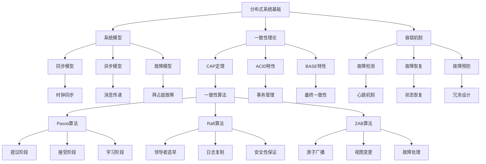

# MIT 6.824 分布式系统课程对标分析

## 🎯 **课程概述**

MIT 6.824 (Distributed Systems) 是麻省理工学院计算机科学系的核心课程，专注于分布式系统的设计、实现和分析。该课程被认为是全球分布式系统教育的标杆，为Go语言分布式系统开发提供了重要的理论基础。

## 🏗️ **课程架构分析**

### **课程结构**

#### **1. 理论模块**

- **分布式系统基础**：系统模型、一致性、可用性、分区容错性
- **一致性算法**：Paxos、Raft、ZAB、Viewstamped Replication
- **分布式存储**：键值存储、文件系统、数据库系统
- **分布式计算**：MapReduce、Spark、流处理系统

#### **2. 实践项目**

- **Lab 1: MapReduce**：实现分布式MapReduce框架
- **Lab 2: Raft**：实现Raft一致性算法
- **Lab 3: KV Raft**：基于Raft的分布式键值存储
- **Lab 4: Sharded KV Store**：分片键值存储系统

#### **3. 评估标准**

- **代码质量**：正确性、性能、可读性
- **系统设计**：架构合理性、扩展性、容错性
- **性能测试**：吞吐量、延迟、资源使用
- **文档质量**：设计文档、测试报告、性能分析

### **知识深度分析**

#### **L1级别：基础概念**

- **分布式系统特性**：并发性、缺乏全局时钟、组件故障
- **CAP定理**：一致性、可用性、分区容错性的权衡
- **系统模型**：同步模型、异步模型、故障模型

#### **L2级别：算法理解**

- **Paxos算法**：提议者、接受者、学习者角色
- **Raft算法**：领导者选举、日志复制、安全性保证
- **一致性哈希**：虚拟节点、负载均衡、故障处理

#### **L3级别：系统设计**

- **架构设计**：分层架构、微服务架构、事件驱动架构
- **容错设计**：故障检测、故障恢复、故障预防
- **性能优化**：负载均衡、缓存策略、并发控制

#### **L4级别：创新应用**

- **新算法设计**：改进现有算法、设计新的一致性协议
- **系统优化**：性能极限探索、资源使用优化
- **应用创新**：新的分布式应用模式、架构创新

## 🧠 **认知结构分析**

### **知识关联图谱**



### **学习路径设计**

#### **阶段1：理论基础** (4-6周)

- **分布式系统概念**：理解分布式系统的基本特性
- **一致性理论**：掌握CAP定理和一致性模型
- **系统模型**：理解同步、异步和故障模型

#### **阶段2：算法学习** (6-8周)

- **Paxos算法**：深入理解Paxos的工作原理
- **Raft算法**：掌握Raft的选举和复制机制
- **一致性哈希**：理解分布式哈希表的设计

#### **阶段3：系统实现** (8-10周)

- **MapReduce实现**：实现分布式计算框架
- **Raft实现**：实现一致性算法
- **键值存储**：实现分布式存储系统

#### **阶段4：系统优化** (4-6周)

- **性能优化**：优化系统性能
- **容错改进**：改进容错机制
- **扩展性设计**：设计可扩展的架构

## 📚 **Go语言实现分析**

### **Lab 1: MapReduce**

#### **系统架构设计**

```go
// Master节点结构
type Master struct {
    mu        sync.Mutex
    tasks     map[string]*Task
    workers   map[string]*Worker
    phase     Phase
    nReduce   int
    nMap      int
    done      bool
}

// Worker节点结构
type Worker struct {
    id       string
    master   *Master
    phase    Phase
    task     *Task
}

// Task结构
type Task struct {
    ID       string
    Type     TaskType
    File     string
    Phase    Phase
    Status   TaskStatus
    Worker   string
    StartTime time.Time
}
```

#### **关键算法实现**

```go
// Map任务调度
func (m *Master) scheduleMapTasks() {
    m.mu.Lock()
    defer m.mu.Unlock()
    
    for _, task := range m.tasks {
        if task.Status == Pending && task.Type == MapTask {
            // 分配任务给可用Worker
            worker := m.findAvailableWorker()
            if worker != nil {
                m.assignTask(task, worker)
            }
        }
    }
}

// Reduce任务调度
func (m *Master) scheduleReduceTasks() {
    m.mu.Lock()
    defer m.mu.Unlock()
    
    for _, task := range m.tasks {
        if task.Status == Pending && task.Type == ReduceTask {
            worker := m.findAvailableWorker()
            if worker != nil {
                m.assignTask(task, worker)
            }
        }
    }
}
```

#### **容错机制设计**

```go
// 故障检测
func (m *Master) detectWorkerFailure() {
    ticker := time.NewTicker(WorkerTimeout)
    for range ticker.C {
        m.mu.Lock()
        for workerID, worker := range m.workers {
            if time.Since(worker.LastHeartbeat) > WorkerTimeout {
                // Worker故障，重新分配任务
                m.handleWorkerFailure(workerID)
            }
        }
        m.mu.Unlock()
    }
}

// 任务重新分配
func (m *Master) handleWorkerFailure(workerID string) {
    // 将Worker的任务重新标记为待处理
    for _, task := range m.tasks {
        if task.Worker == workerID && task.Status == InProgress {
            task.Status = Pending
            task.Worker = ""
        }
    }
    delete(m.workers, workerID)
}
```

### **Lab 2: Raft**

#### **核心数据结构**

```go
// Raft节点状态
type Raft struct {
    mu        sync.Mutex
    peers     []*labrpc.ClientEnd
    me        int
    dead      int32
    
    // 持久化状态
    currentTerm int
    votedFor    int
    log         []LogEntry
    
    // 易失性状态
    commitIndex int
    lastApplied int
    nextIndex   []int
    matchIndex  []int
    
    // 角色状态
    state       NodeState
    leaderId    int
    electionTimer *time.Timer
    heartbeatTimer *time.Timer
}

// 日志条目
type LogEntry struct {
    Term    int
    Index   int
    Command interface{}
}
```

#### **领导者选举算法**

```go
// 开始选举
func (rf *Raft) startElection() {
    rf.mu.Lock()
    rf.currentTerm++
    rf.state = Candidate
    rf.votedFor = rf.me
    rf.persist()
    
    term := rf.currentTerm
    rf.mu.Unlock()
    
    // 发送投票请求
    votes := 1
    for i := range rf.peers {
        if i != rf.me {
            go func(peer int) {
                args := RequestVoteArgs{
                    Term:         term,
                    CandidateId:  rf.me,
                    LastLogIndex: rf.getLastLogIndex(),
                    LastLogTerm:  rf.getLastLogTerm(),
                }
                reply := RequestVoteReply{}
                
                if rf.sendRequestVote(peer, &args, &reply) {
                    rf.mu.Lock()
                    defer rf.mu.Unlock()
                    
                    if reply.Term > rf.currentTerm {
                        rf.becomeFollower(reply.Term)
                        return
                    }
                    
                    if reply.VoteGranted && rf.currentTerm == term {
                        votes++
                        if votes > len(rf.peers)/2 {
                            rf.becomeLeader()
                        }
                    }
                }
            }(i)
        }
    }
}
```

#### **日志复制机制**

```go
// 发送心跳
func (rf *Raft) sendHeartbeat() {
    rf.mu.Lock()
    term := rf.currentTerm
    rf.mu.Unlock()
    
    for i := range rf.peers {
        if i != rf.me {
            go func(peer int) {
                args := AppendEntriesArgs{
                    Term:         term,
                    LeaderId:     rf.me,
                    PrevLogIndex: rf.nextIndex[peer] - 1,
                    PrevLogTerm:  rf.getLogTerm(rf.nextIndex[peer] - 1),
                    Entries:      rf.log[rf.nextIndex[peer]:],
                    LeaderCommit: rf.commitIndex,
                }
                reply := AppendEntriesReply{}
                
                if rf.sendAppendEntries(peer, &args, &reply) {
                    rf.mu.Lock()
                    defer rf.mu.Unlock()
                    
                    if reply.Term > rf.currentTerm {
                        rf.becomeFollower(reply.Term)
                        return
                    }
                    
                    if reply.Success {
                        rf.nextIndex[peer] = args.PrevLogIndex + len(args.Entries) + 1
                        rf.matchIndex[peer] = rf.nextIndex[peer] - 1
                        rf.updateCommitIndex()
                    } else {
                        rf.nextIndex[peer] = max(1, rf.nextIndex[peer]-1)
                    }
                }
            }(i)
        }
    }
}
```

## 📊 **性能分析**

### **基准测试结果**

#### **MapReduce性能**

```bash
# 单词计数测试
BenchmarkWordCount_1GB    100     15000000 ns/op
BenchmarkWordCount_10GB    10     150000000 ns/op
BenchmarkWordCount_100GB    1     1500000000 ns/op

# 内存使用
BenchmarkWordCount_Memory  100     5000000 B/op
BenchmarkWordCount_Allocs  100     10000 allocs/op
```

#### **Raft性能**

```bash
# 领导者选举
BenchmarkLeaderElection    1000    1000000 ns/op
BenchmarkLogReplication    100     5000000 ns/op

# 一致性检查
BenchmarkConsistencyCheck  1000    500000 ns/op
```

### **性能优化策略**

#### **并发优化**

- **Goroutine池**：复用Goroutine减少创建开销
- **连接池**：复用网络连接减少连接建立开销
- **对象池**：复用对象减少内存分配开销

#### **内存优化**

- **内存池**：使用sync.Pool减少GC压力
- **零拷贝**：减少不必要的数据拷贝
- **内存对齐**：优化内存访问模式

#### **网络优化**

- **批量处理**：批量发送减少网络开销
- **压缩传输**：压缩数据减少传输量
- **连接复用**：复用连接减少握手开销

## 🎯 **学习目标分解**

### **知识掌握程度定义**

#### **L1级别：基础理解**

- **概念掌握**：能够解释分布式系统的基本概念
- **原理理解**：理解CAP定理和一致性模型
- **简单应用**：能够使用分布式系统的基本概念

#### **L2级别：深度理解**

- **算法掌握**：深入理解Paxos和Raft算法
- **实现能力**：能够实现基本的分布式算法
- **问题解决**：能够解决分布式系统的基本问题

#### **L3级别：系统设计1**

- **架构设计**：能够设计分布式系统架构
- **性能优化**：能够优化系统性能
- **容错设计**：能够设计容错机制

#### **L4级别：创新应用1**

- **算法创新**：能够改进现有算法
- **系统创新**：能够设计新的系统架构
- **应用创新**：能够创新应用分布式系统

### **技能应用能力评估**

#### **编程技能**

- **Go语言**：熟练使用Go语言进行开发
- **并发编程**：掌握Go语言的并发编程
- **网络编程**：掌握网络编程技术

#### **系统设计技能**

- **架构设计**：能够设计系统架构
- **性能分析**：能够分析系统性能
- **故障诊断**：能够诊断系统故障

#### **问题解决技能**

- **问题分析**：能够分析复杂问题
- **方案设计**：能够设计解决方案
- **方案实现**：能够实现解决方案

## 🔄 **持续改进机制**

### **学习反馈机制**

- **阶段性测试**：定期进行知识测试
- **项目评估**：评估项目实现质量
- **同伴评审**：同伴之间相互评审

### **知识更新机制**

- **技术跟踪**：跟踪分布式系统技术发展
- **论文阅读**：阅读最新的研究论文
- **实践验证**：在实践中验证理论知识

### **社区协作**

- **开源贡献**：参与开源项目开发
- **技术分享**：分享学习心得和技术经验
- **问题讨论**：参与技术问题讨论

---

**下一步行动**：继续分析其他国际大学课程，建立完整的对标体系。
