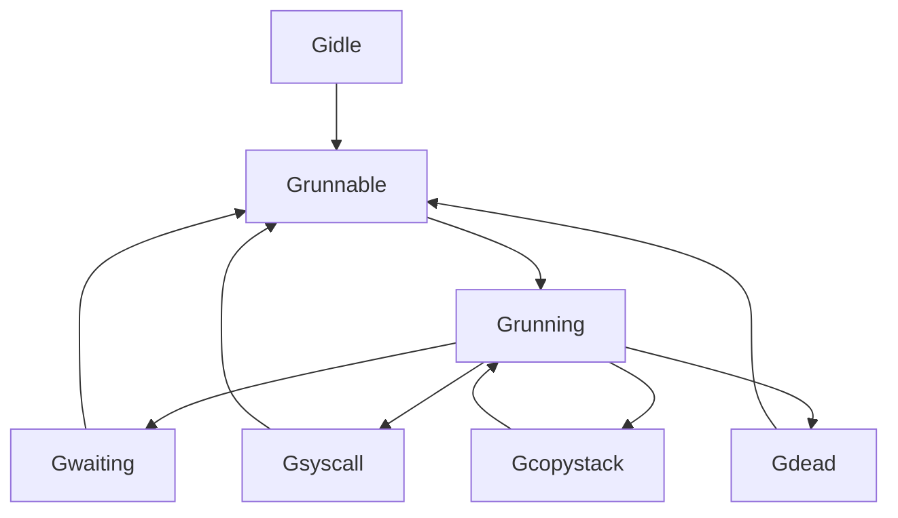

# 7.1.1 Go语言Goroutine深度解析

<!-- TOC START -->
- [7.1.1 Go语言Goroutine深度解析](#go语言goroutine深度解析)
  - [7.1.1.1 🎯 **概述**](#🎯-**概述**)
  - [7.1.1.2 🏗️ **并发模型理论基础**](#🏗️-**并发模型理论基础**)
    - [7.1.1.2.1 **并发与并行**](#**并发与并行**)
      - [7.1.1.2.1.1 **概念区分**](#**概念区分**)
      - [7.1.1.2.1.2 **数学形式化**](#**数学形式化**)
    - [7.1.1.2.2 **Go并发哲学**](#**go并发哲学**)
      - [7.1.1.2.2.1 **设计原则**](#**设计原则**)
      - [7.1.1.2.2.2 **理论基础**](#**理论基础**)
  - [7.1.1.3 🔍 **Goroutine内部机制**](#🔍-**goroutine内部机制**)
    - [7.1.1.3.1 **Goroutine结构**](#**goroutine结构**)
      - [7.1.1.3.1.1 **内部表示**](#**内部表示**)
      - [7.1.1.3.1.2 **栈管理**](#**栈管理**)
    - [7.1.1.3.2 **Goroutine生命周期**](#**goroutine生命周期**)
      - [7.1.1.3.2.1 **状态转换**](#**状态转换**)
      - [7.1.1.3.2.2 **状态定义**](#**状态定义**)
  - [7.1.1.4 🚀 **Goroutine创建与管理**](#🚀-**goroutine创建与管理**)
    - [7.1.1.4.1 **创建机制**](#**创建机制**)
      - [7.1.1.4.1.1 **基本创建**](#**基本创建**)
      - [7.1.1.4.1.2 **批量创建**](#**批量创建**)
    - [7.1.1.4.2 **生命周期管理**](#**生命周期管理**)
      - [7.1.1.4.2.1 **优雅退出**](#**优雅退出**)
      - [7.1.1.4.2.2 **资源清理**](#**资源清理**)
  - [7.1.1.5 ⚡ **Goroutine性能特征**](#⚡-**goroutine性能特征**)
    - [7.1.1.5.1 **内存开销**](#**内存开销**)
      - [7.1.1.5.1.1 **内存使用分析**](#**内存使用分析**)
      - [7.1.1.5.1.2 **内存优化策略**](#**内存优化策略**)
    - [7.1.1.5.2 **性能基准测试**](#**性能基准测试**)
      - [7.1.1.5.2.1 **创建性能**](#**创建性能**)
      - [7.1.1.5.2.2 **通信性能**](#**通信性能**)
  - [7.1.1.6 🔧 **Goroutine最佳实践**](#🔧-**goroutine最佳实践**)
    - [7.1.1.6.1 **设计模式**](#**设计模式**)
      - [7.1.1.6.1.1 **Worker Pool模式**](#**worker-pool模式**)
      - [7.1.1.6.1.2 **Pipeline模式**](#**pipeline模式**)
    - [7.1.1.6.2 **错误处理**](#**错误处理**)
      - [7.1.1.6.2.1 **错误传播机制**](#**错误传播机制**)
      - [7.1.1.6.2.2 **Panic恢复**](#**panic恢复**)
  - [7.1.1.7 📊 **性能监控与分析**](#📊-**性能监控与分析**)
    - [7.1.1.7.1 **Goroutine数量监控**](#**goroutine数量监控**)
      - [7.1.1.7.1.1 **运行时统计**](#**运行时统计**)
      - [7.1.1.7.1.2 **性能分析工具**](#**性能分析工具**)
    - [7.1.1.7.2 **竞态检测**](#**竞态检测**)
      - [7.1.1.7.2.1 **竞态检测工具**](#**竞态检测工具**)
  - [7.1.1.8 🔮 **未来发展趋势**](#🔮-**未来发展趋势**)
    - [7.1.1.8.1 **Go 1.25+新特性**](#**go-125+新特性**)
      - [7.1.1.8.1.1 **Goroutine改进**](#**goroutine改进**)
      - [7.1.1.8.1.2 **调度器优化**](#**调度器优化**)
<!-- TOC END -->


## 7.1.1.1 🎯 **概述**

本文档对Go语言的Goroutine并发模型进行深度分析，从理论基础、实现机制、性能特征、最佳实践等多个维度进行系统性研究，为Go语言开发者提供完整的并发编程知识体系。

## 7.1.1.2 🏗️ **并发模型理论基础**

### 7.1.1.2.1 **并发与并行**

#### 7.1.1.2.1.1 **概念区分**

**并发 (Concurrency)**：

- **定义**：多个任务在同一时间段内交替执行
- **特征**：任务间可以相互切换，不要求同时执行
- **目标**：提高资源利用率和响应性

**并行 (Parallelism)**：

- **定义**：多个任务在同一时刻同时执行
- **特征**：任务真正同时运行，需要多核支持
- **目标**：提高计算吞吐量

#### 7.1.1.2.1.2 **数学形式化**

```text
并发模型：对于任务集合 T = {t₁, t₂, ..., tₙ}

并发执行：∀tᵢ, tⱼ ∈ T, ∃时间点 τ，使得 tᵢ 和 tⱼ 在 τ 时刻都处于活跃状态

并行执行：∀tᵢ, tⱼ ∈ T, ∃时间点 τ，使得 tᵢ 和 tⱼ 在 τ 时刻同时执行

关系：并行 ⊂ 并发
```

### 7.1.1.2.2 **Go并发哲学**

#### 7.1.1.2.2.1 **设计原则**

1. **不要通过共享内存来通信，而要通过通信来共享内存**
2. **轻量级线程，支持大量并发**
3. **简单的并发模型，易于理解和使用**
4. **内置的并发原语，无需外部库**

#### 7.1.1.2.2.2 **理论基础**

```text
CSP (Communicating Sequential Processes) 理论：

进程间通信通过 Channel 进行
每个进程独立运行，通过消息传递协作
避免了共享内存的复杂性
```

## 7.1.1.3 🔍 **Goroutine内部机制**

### 7.1.1.3.1 **Goroutine结构**

#### 7.1.1.3.1.1 **内部表示**

```go
// Goroutine内部结构（简化版）
type g struct {
    // 栈信息
    stack       stack   // 栈描述符
    stackguard0 uintptr // 栈保护地址
    stackguard1 uintptr // 栈保护地址
    
    // 调度信息
    m            *m      // 当前绑定的M
    sched        gobuf   // 调度信息
    goid         int64   // 唯一标识符
    
    // 状态信息
    atomicstatus uint32  // 原子状态
    goid         int64   // Goroutine ID
    
    // 其他字段
    startpc      uintptr // 启动函数地址
    racectx      uintptr // 竞态检测上下文
    waiting      *sudog  // 等待队列
    selectdone   *uint32 // select完成标志
}
```

#### 7.1.1.3.1.2 **栈管理**

```go
// 栈增长机制
func StackGrowth() {
    // 初始栈大小：2KB
    // 栈增长策略：每次增长2倍
    // 最大栈大小：1GB
    
    // 栈保护机制
    // 栈溢出检测
    // 栈收缩机制
}
```

### 7.1.1.3.2 **Goroutine生命周期**

#### 7.1.1.3.2.1 **状态转换**



#### 7.1.1.3.2.2 **状态定义**

```go
// Goroutine状态常量
const (
    _Gidle        = iota // 空闲状态
    _Grunnable           // 可运行状态
    _Grunning            // 运行状态
    _Gsyscall            // 系统调用状态
    _Gwaiting            // 等待状态
    _Gdead               // 死亡状态
    _Gcopystack          // 栈复制状态
)
```

## 7.1.1.4 🚀 **Goroutine创建与管理**

### 7.1.1.4.1 **创建机制**

#### 7.1.1.4.1.1 **基本创建**

```go
// Goroutine创建示例
func GoroutineCreation() {
    // 方式1：go关键字
    go func() {
        fmt.Println("Goroutine 1")
    }()
    
    // 方式2：命名函数
    go namedFunction()
    
    // 方式3：方法调用
    obj := &MyObject{}
    go obj.method()
    
    // 等待Goroutine完成
    time.Sleep(time.Millisecond)
}

func namedFunction() {
    fmt.Println("Named function goroutine")
}

type MyObject struct{}

func (obj *MyObject) method() {
    fmt.Println("Method goroutine")
}
```

#### 7.1.1.4.1.2 **批量创建**

```go
// 批量创建Goroutine
func BatchGoroutineCreation() {
    const numGoroutines = 1000
    
    // 使用WaitGroup等待所有Goroutine完成
    var wg sync.WaitGroup
    wg.Add(numGoroutines)
    
    for i := 0; i < numGoroutines; i++ {
        go func(id int) {
            defer wg.Done()
            fmt.Printf("Goroutine %d started\n", id)
            time.Sleep(time.Millisecond)
            fmt.Printf("Goroutine %d completed\n", id)
        }(i)
    }
    
    wg.Wait()
    fmt.Println("All goroutines completed")
}
```

### 7.1.1.4.2 **生命周期管理**

#### 7.1.1.4.2.1 **优雅退出**

```go
// 优雅退出机制
func GracefulShutdown() {
    // 使用context控制生命周期
    ctx, cancel := context.WithCancel(context.Background())
    defer cancel()
    
    // 启动工作Goroutine
    go worker(ctx)
    
    // 模拟工作
    time.Sleep(2 * time.Second)
    
    // 发送退出信号
    cancel()
    
    // 等待退出
    time.Sleep(time.Millisecond)
}

func worker(ctx context.Context) {
    for {
        select {
        case <-ctx.Done():
            fmt.Println("Worker shutting down...")
            return
        default:
            // 执行工作
            fmt.Println("Working...")
            time.Sleep(500 * time.Millisecond)
        }
    }
}
```

#### 7.1.1.4.2.2 **资源清理**

```go
// 资源清理示例
func ResourceCleanup() {
    // 使用defer确保资源清理
    go func() {
        defer func() {
            if r := recover(); r != nil {
                fmt.Printf("Recovered from panic: %v\n", r)
            }
            fmt.Println("Resource cleanup completed")
        }()
        
        // 模拟工作
        time.Sleep(time.Millisecond)
        
        // 模拟panic
        panic("Something went wrong")
    }()
    
    time.Sleep(2 * time.Millisecond)
}
```

## 7.1.1.5 ⚡ **Goroutine性能特征**

### 7.1.1.5.1 **内存开销**

#### 7.1.1.5.1.1 **内存使用分析**

```go
// 内存使用基准测试
func BenchmarkGoroutineMemory(b *testing.B) {
    b.Run("SingleGoroutine", func(b *testing.B) {
        for i := 0; i < b.N; i++ {
            go func() {
                // 空函数
            }()
        }
    })
    
    b.Run("MultipleGoroutines", func(b *testing.B) {
        b.ResetTimer()
        for i := 0; i < b.N; i++ {
            var wg sync.WaitGroup
            wg.Add(1000)
            
            for j := 0; j < 1000; j++ {
                go func() {
                    defer wg.Done()
                    // 空函数
                }()
            }
            
            wg.Wait()
        }
    })
}
```

#### 7.1.1.5.1.2 **内存优化策略**

```go
// 内存优化示例
func MemoryOptimization() {
    // 1. 使用对象池减少内存分配
    pool := sync.Pool{
        New: func() interface{} {
            return make([]byte, 1024)
        },
    }
    
    // 2. 限制并发数量
    const maxConcurrency = 100
    semaphore := make(chan struct{}, maxConcurrency)
    
    for i := 0; i < 1000; i++ {
        semaphore <- struct{}{} // 获取信号量
        
        go func(id int) {
            defer func() { <-semaphore }() // 释放信号量
            
            // 从池中获取对象
            buf := pool.Get().([]byte)
            defer pool.Put(buf)
            
            // 使用缓冲区
            fmt.Printf("Goroutine %d using buffer\n", id)
        }(i)
    }
}
```

### 7.1.1.5.2 **性能基准测试**

#### 7.1.1.5.2.1 **创建性能**

```go
// Goroutine创建性能测试
func BenchmarkGoroutineCreation(b *testing.B) {
    b.Run("Sequential", func(b *testing.B) {
        for i := 0; i < b.N; i++ {
            // 顺序执行
            func() {
                // 空函数
            }()
        }
    })
    
    b.Run("Goroutine", func(b *testing.B) {
        for i := 0; i < b.N; i++ {
            var wg sync.WaitGroup
            wg.Add(1)
            
            go func() {
                defer wg.Done()
                // 空函数
            }()
            
            wg.Wait()
        }
    })
    
    b.Run("BatchGoroutine", func(b *testing.B) {
        const batchSize = 1000
        
        for i := 0; i < b.N; i++ {
            var wg sync.WaitGroup
            wg.Add(batchSize)
            
            for j := 0; j < batchSize; j++ {
                go func() {
                    defer wg.Done()
                    // 空函数
                }()
            }
            
            wg.Wait()
        }
    })
}
```

#### 7.1.1.5.2.2 **通信性能**

```go
// Channel通信性能测试
func BenchmarkChannelCommunication(b *testing.B) {
    b.Run("Unbuffered", func(b *testing.B) {
        for i := 0; i < b.N; i++ {
            ch := make(chan int)
            
            go func() {
                ch <- 42
            }()
            
            <-ch
        }
    })
    
    b.Run("Buffered", func(b *testing.B) {
        for i := 0; i < b.N; i++ {
            ch := make(chan int, 1)
            
            go func() {
                ch <- 42
            }()
            
            <-ch
        }
    })
    
    b.Run("DirectAssignment", func(b *testing.B) {
        for i := 0; i < b.N; i++ {
            var value int
            go func() {
                value = 42
            }()
            
            // 注意：这里存在竞态条件，仅用于性能测试
            _ = value
        }
    })
}
```

## 7.1.1.6 🔧 **Goroutine最佳实践**

### 7.1.1.6.1 **设计模式**

#### 7.1.1.6.1.1 **Worker Pool模式**

```go
// Worker Pool实现
type WorkerPool struct {
    workers    int
    jobQueue   chan Job
    resultChan chan Result
    wg         sync.WaitGroup
}

type Job struct {
    ID   int
    Data interface{}
}

type Result struct {
    JobID  int
    Data   interface{}
    Error  error
}

func NewWorkerPool(workers int) *WorkerPool {
    return &WorkerPool{
        workers:    workers,
        jobQueue:   make(chan Job, 1000),
        resultChan: make(chan Result, 1000),
    }
}

func (wp *WorkerPool) Start() {
    for i := 0; i < wp.workers; i++ {
        wp.wg.Add(1)
        go wp.worker(i)
    }
}

func (wp *WorkerPool) worker(id int) {
    defer wp.wg.Done()
    
    for job := range wp.jobQueue {
        // 处理任务
        result := wp.processJob(job)
        wp.resultChan <- result
    }
}

func (wp *WorkerPool) processJob(job Job) Result {
    // 模拟任务处理
    time.Sleep(time.Millisecond)
    
    return Result{
        JobID: job.ID,
        Data:  fmt.Sprintf("Processed: %v", job.Data),
        Error: nil,
    }
}

func (wp *WorkerPool) Submit(job Job) {
    wp.jobQueue <- job
}

func (wp *WorkerPool) Results() <-chan Result {
    return wp.resultChan
}

func (wp *WorkerPool) Stop() {
    close(wp.jobQueue)
    wp.wg.Wait()
    close(wp.resultChan)
}
```

#### 7.1.1.6.1.2 **Pipeline模式**

```go
// Pipeline实现
func PipelineExample() {
    // 第一阶段：生成数据
    numbers := generate(1, 100)
    
    // 第二阶段：平方
    squares := square(numbers)
    
    // 第三阶段：过滤偶数
    evenSquares := filterEven(squares)
    
    // 消费结果
    for result := range evenSquares {
        fmt.Printf("Result: %d\n", result)
    }
}

func generate(start, end int) <-chan int {
    out := make(chan int)
    
    go func() {
        defer close(out)
        for i := start; i <= end; i++ {
            out <- i
        }
    }()
    
    return out
}

func square(in <-chan int) <-chan int {
    out := make(chan int)
    
    go func() {
        defer close(out)
        for n := range in {
            out <- n * n
        }
    }()
    
    return out
}

func filterEven(in <-chan int) <-chan int {
    out := make(chan int)
    
    go func() {
        defer close(out)
        for n := range in {
            if n%2 == 0 {
                out <- n
            }
        }
    }()
    
    return out
}
```

### 7.1.1.6.2 **错误处理**

#### 7.1.1.6.2.1 **错误传播机制**

```go
// 错误处理示例
func ErrorHandling() {
    // 使用errgroup进行错误处理
    g, ctx := errgroup.WithContext(context.Background())
    
    // 启动多个Goroutine
    for i := 0; i < 5; i++ {
        i := i // 捕获循环变量
        g.Go(func() error {
            return workerWithError(ctx, i)
        })
    }
    
    // 等待所有Goroutine完成
    if err := g.Wait(); err != nil {
        fmt.Printf("Error occurred: %v\n", err)
    }
}

func workerWithError(ctx context.Context, id int) error {
    select {
    case <-ctx.Done():
        return ctx.Err()
    case <-time.After(time.Duration(id+1) * time.Second):
        if id == 2 {
            return fmt.Errorf("worker %d failed", id)
        }
        fmt.Printf("Worker %d completed\n", id)
        return nil
    }
}
```

#### 7.1.1.6.2.2 **Panic恢复**

```go
// Panic恢复机制
func PanicRecovery() {
    defer func() {
        if r := recover(); r != nil {
            fmt.Printf("Recovered from panic: %v\n", r)
        }
    }()
    
    // 启动可能panic的Goroutine
    go func() {
        defer func() {
            if r := recover(); r != nil {
                fmt.Printf("Goroutine recovered from panic: %v\n", r)
            }
        }()
        
        // 模拟panic
        panic("Something went wrong in goroutine")
    }()
    
    time.Sleep(time.Millisecond)
}
```

## 7.1.1.7 📊 **性能监控与分析**

### 7.1.1.7.1 **Goroutine数量监控**

#### 7.1.1.7.1.1 **运行时统计**

```go
// Goroutine数量监控
func GoroutineMonitoring() {
    ticker := time.NewTicker(time.Second)
    defer ticker.Stop()
    
    for range ticker.C {
        var m runtime.MemStats
        runtime.ReadMemStats(&m)
        
        numGoroutines := runtime.NumGoroutine()
        
        fmt.Printf("Goroutines: %d, Heap: %d MB, Stack: %d MB\n",
            numGoroutines,
            m.HeapAlloc/1024/1024,
            m.StackInuse/1024/1024)
        
        // 如果Goroutine数量过多，发出警告
        if numGoroutines > 1000 {
            fmt.Println("Warning: Too many goroutines!")
        }
    }
}
```

#### 7.1.1.7.1.2 **性能分析工具**

```go
// 使用pprof进行性能分析
func PerformanceProfiling() {
    // CPU分析
    cpuFile, _ := os.Create("cpu.prof")
    defer cpuFile.Close()
    pprof.StartCPUProfile(cpuFile)
    defer pprof.StopCPUProfile()
    
    // 内存分析
    memFile, _ := os.Create("mem.prof")
    defer memFile.Close()
    
    // 执行一些工作
    doWork()
    
    // 写入内存分析数据
    pprof.WriteHeapProfile(memFile)
}

func doWork() {
    // 模拟工作负载
    for i := 0; i < 1000; i++ {
        go func() {
            time.Sleep(time.Millisecond)
        }()
    }
    
    time.Sleep(2 * time.Second)
}
```

### 7.1.1.7.2 **竞态检测**

#### 7.1.1.7.2.1 **竞态检测工具**

```go
// 竞态检测示例
func RaceConditionExample() {
    var counter int
    var wg sync.WaitGroup
    
    // 启动多个Goroutine并发访问共享变量
    for i := 0; i < 1000; i++ {
        wg.Add(1)
        go func() {
            defer wg.Done()
            counter++ // 竞态条件！
        }()
    }
    
    wg.Wait()
    fmt.Printf("Final counter: %d\n", counter)
}

// 修复竞态条件
func FixedRaceCondition() {
    var counter int
    var mu sync.Mutex
    var wg sync.WaitGroup
    
    for i := 0; i < 1000; i++ {
        wg.Add(1)
        go func() {
            defer wg.Done()
            
            mu.Lock()
            counter++
            mu.Unlock()
        }()
    }
    
    wg.Wait()
    fmt.Printf("Final counter: %d\n", counter)
}
```

## 7.1.1.8 🔮 **未来发展趋势**

### 7.1.1.8.1 **Go 1.25+新特性**

#### 7.1.1.8.1.1 **Goroutine改进**

```go
// 新的Goroutine特性
func NewGoroutineFeatures() {
    // 1. 改进的栈管理
    // 2. 更好的GC集成
    // 3. 性能优化
    
    // 使用新的调度器特性
    runtime.GOMAXPROCS(runtime.NumCPU())
    
    // 启动大量Goroutine测试性能
    var wg sync.WaitGroup
    const numGoroutines = 100000
    
    wg.Add(numGoroutines)
    start := time.Now()
    
    for i := 0; i < numGoroutines; i++ {
        go func() {
            defer wg.Done()
            // 空函数
        }()
    }
    
    wg.Wait()
    duration := time.Since(start)
    
    fmt.Printf("Created %d goroutines in %v\n", numGoroutines, duration)
    fmt.Printf("Rate: %.0f goroutines/second\n", float64(numGoroutines)/duration.Seconds())
}
```

#### 7.1.1.8.1.2 **调度器优化**

```go
// 调度器优化示例
func SchedulerOptimization() {
    // 设置GOMAXPROCS
    runtime.GOMAXPROCS(runtime.NumCPU())
    
    // 使用runtime.Gosched()让出CPU
    go func() {
        for i := 0; i < 1000; i++ {
            if i%100 == 0 {
                runtime.Gosched() // 让出CPU时间片
            }
            // 执行工作
        }
    }()
    
    // 使用runtime.LockOSThread()绑定OS线程
    go func() {
        runtime.LockOSThread()
        defer runtime.UnlockOSThread()
        
        // 执行需要绑定OS线程的工作
        fmt.Println("Working on locked OS thread")
    }()
}
```

---

**下一步行动**：继续深入分析其他Go语言并发模型组件，建立完整的并发编程知识体系。
