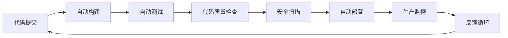

# 9.1 DevOps运维分析（DevOps Operations Analysis）

<!-- TOC START -->
- [9.1 DevOps运维分析（DevOps Operations Analysis）](#91-devops运维分析devops-operations-analysis)
  - [9.1.1 目录](#911-目录)
  - [9.1.2 1. DevOps基础理论](#912-1-devops基础理论)
    - [9.1.2.1 定义](#9121-定义)
    - [9.1.2.2 核心原则](#9122-核心原则)
    - [9.1.2.3 价值流](#9123-价值流)
  - [9.1.3 2. 持续集成/持续部署（CI/CD）](#913-2-持续集成持续部署cicd)
    - [9.1.3.1 CI/CD流水线](#9131-cicd流水线)
    - [9.1.3.2 GitHub Actions配置](#9132-github-actions配置)
    - [9.2 Golang CI/CD实践](#92-golang-cicd实践)
  - [9.2.1 3. 自动化运维与监控](#921-3-自动化运维与监控)
    - [9.2.1.1 基础设施即代码（IaC）](#9211-基础设施即代码iac)
    - [9.3 监控和可观测性](#93-监控和可观测性)
    - [9.3 Prometheus监控配置](#93-prometheus监控配置)
    - [9.4 Golang监控实现](#94-golang监控实现)
  - [9.4.1 4. Golang DevOps实践](#941-4-golang-devops实践)
    - [9.4.1.1 配置管理](#9411-配置管理)
    - [9.4.1.2 健康检查和就绪检查](#9412-健康检查和就绪检查)
    - [9.4.1.3 日志管理](#9413-日志管理)
  - [9.4.2 5. 多表征内容](#942-5-多表征内容)
    - [9.4.2.1 DevOps流水线图](#9421-devops流水线图)
    - [9.4.2.2 性能模型](#9422-性能模型)
    - [9.4.2.3 自动化程度评估](#9423-自动化程度评估)
  - [9.4.3 6. 交叉引用与目录导航](#943-6-交叉引用与目录导航)
<!-- TOC END -->

---

## 9.1.1 目录

1. DevOps基础理论
2. 持续集成/持续部署（CI/CD）
3. 自动化运维与监控
4. Golang DevOps实践
5. 多表征内容
6. 交叉引用与目录导航

---

## 9.1.2 1. DevOps基础理论

### 9.1.2.1 定义

> DevOps是一种将开发（Development）、运维（Operations）和质量保证（QA）整合在一起的文化、实践和工具集合。

### 9.1.2.2 核心原则

- **协作**: 开发与运维团队紧密协作
- **自动化**: 自动化构建、测试、部署流程
- **持续改进**: 持续监控、反馈和改进
- **快速交付**: 快速、频繁、可靠的软件交付

### 9.1.2.3 价值流

- 需求管理 → 开发 → 测试 → 部署 → 监控 → 反馈

---

## 9.1.3 2. 持续集成/持续部署（CI/CD）

### 9.1.3.1 CI/CD流水线

```latex
\textbf{定义 2.1} (CI/CD流水线): CI/CD流水线是一个自动化的软件交付流程，包括代码提交、构建、测试、部署等阶段。

\textbf{流水线阶段}:
\begin{itemize}
  \item 代码提交: 版本控制和代码审查
  \item 构建: 编译、打包、容器化
  \item 测试: 单元测试、集成测试、端到端测试
  \item 部署: 自动部署到不同环境
  \item 监控: 生产环境监控和反馈
\end{itemize}
```

### 9.1.3.2 GitHub Actions配置

```yaml
# 9.2 .github/workflows/ci-cd.yml
name: CI/CD Pipeline

on:
  push:
    branches: [ main, develop ]
  pull_request:
    branches: [ main ]

jobs:
  test:
    runs-on: ubuntu-latest
    steps:
    - uses: actions/checkout@v3
    
    - name: Set up Go
      uses: actions/setup-go@v4
      with:
        go-version: '1.21'
    
    - name: Run tests
      run: go test -v ./...
    
    - name: Run linting
      run: golangci-lint run
    
  build:
    needs: test
    runs-on: ubuntu-latest
    steps:
    - uses: actions/checkout@v3
    
    - name: Build Docker image
      run: docker build -t myapp:${{ github.sha }} .
    
    - name: Push to registry
      run: docker push myapp:${{ github.sha }}
```

### 9.2 Golang CI/CD实践

```go
// 构建脚本示例
package main

import (
    "fmt"
    "os"
    "os/exec"
)

func main() {
    // 运行测试
    if err := runTests(); err != nil {
        fmt.Printf("Tests failed: %v\n", err)
        os.Exit(1)
    }
    
    // 构建应用
    if err := buildApp(); err != nil {
        fmt.Printf("Build failed: %v\n", err)
        os.Exit(1)
    }
    
    // 运行安全检查
    if err := runSecurityScan(); err != nil {
        fmt.Printf("Security scan failed: %v\n", err)
        os.Exit(1)
    }
    
    fmt.Println("CI/CD pipeline completed successfully")
}

func runTests() error {
    cmd := exec.Command("go", "test", "-v", "./...")
    return cmd.Run()
}

func buildApp() error {
    cmd := exec.Command("go", "build", "-o", "app", ".")
    return cmd.Run()
}

func runSecurityScan() error {
    cmd := exec.Command("gosec", "./...")
    return cmd.Run()
}
```

---

## 9.2.1 3. 自动化运维与监控

### 9.2.1.1 基础设施即代码（IaC）

```hcl
# 9.3 Terraform配置示例
terraform {
  required_providers {
    aws = {
      source  = "hashicorp/aws"
      version = "~> 4.0"
    }
  }
}

resource "aws_ecs_cluster" "main" {
  name = "golang-app-cluster"
}

resource "aws_ecs_service" "app" {
  name            = "golang-app-service"
  cluster         = aws_ecs_cluster.main.id
  task_definition = aws_ecs_task_definition.app.arn
  desired_count   = 3
  
  load_balancer {
    target_group_arn = aws_lb_target_group.app.arn
    container_name   = "golang-app"
    container_port   = 8080
  }
}
```

### 9.3 监控和可观测性

```latex
\textbf{定义 3.1} (可观测性): 可观测性是系统内部状态的可推断性，通过外部输出来理解系统内部状态的能力。

\textbf{可观测性三大支柱}:
\begin{itemize}
  \item 指标(Metrics): 数值化的系统状态
  \item 日志(Logs): 事件的时间序列记录
  \item 追踪(Traces): 请求的端到端路径
\end{itemize}
```

### 9.3 Prometheus监控配置

```yaml
# 9.4 prometheus.yml
global:
  scrape_interval: 15s

scrape_configs:
  - job_name: 'golang-app'
    static_configs:
      - targets: ['localhost:8080']
    metrics_path: '/metrics'
    scrape_interval: 5s
```

### 9.4 Golang监控实现

```go
// 监控指标定义
import (
    "github.com/prometheus/client_golang/prometheus"
    "github.com/prometheus/client_golang/prometheus/promhttp"
)

var (
    httpRequestsTotal = prometheus.NewCounterVec(
        prometheus.CounterOpts{
            Name: "http_requests_total",
            Help: "Total number of HTTP requests",
        },
        []string{"method", "endpoint", "status"},
    )
    
    httpRequestDuration = prometheus.NewHistogramVec(
        prometheus.HistogramOpts{
            Name: "http_request_duration_seconds",
            Help: "HTTP request duration in seconds",
        },
        []string{"method", "endpoint"},
    )
)

func init() {
    prometheus.MustRegister(httpRequestsTotal)
    prometheus.MustRegister(httpRequestDuration)
}

// 中间件示例
func metricsMiddleware(next http.Handler) http.Handler {
    return http.HandlerFunc(func(w http.ResponseWriter, r *http.Request) {
        start := time.Now()
        
        // 包装ResponseWriter以捕获状态码
        wrapped := &responseWriter{ResponseWriter: w}
        
        next.ServeHTTP(wrapped, r)
        
        duration := time.Since(start).Seconds()
        
        httpRequestsTotal.WithLabelValues(r.Method, r.URL.Path, fmt.Sprintf("%d", wrapped.statusCode)).Inc()
        httpRequestDuration.WithLabelValues(r.Method, r.URL.Path).Observe(duration)
    })
}
```

---

## 9.4.1 4. Golang DevOps实践

### 9.4.1.1 配置管理

```go
// 环境配置管理
type Config struct {
    Environment string `env:"ENV" envDefault:"development"`
    Port        int    `env:"PORT" envDefault:"8080"`
    Database    struct {
        Host     string `env:"DB_HOST" envDefault:"localhost"`
        Port     int    `env:"DB_PORT" envDefault:"5432"`
        Name     string `env:"DB_NAME" envDefault:"myapp"`
        User     string `env:"DB_USER" envDefault:"postgres"`
        Password string `env:"DB_PASSWORD"`
    }
    Redis struct {
        Host string `env:"REDIS_HOST" envDefault:"localhost"`
        Port int    `env:"REDIS_PORT" envDefault:"6379"`
    }
}

func loadConfig() (*Config, error) {
    var cfg Config
    if err := env.Parse(&cfg); err != nil {
        return nil, fmt.Errorf("failed to parse config: %w", err)
    }
    return &cfg, nil
}
```

### 9.4.1.2 健康检查和就绪检查

```go
// 健康检查处理器
func healthCheckHandler(w http.ResponseWriter, r *http.Request) {
    checks := map[string]bool{
        "database": checkDatabase(),
        "redis":    checkRedis(),
        "disk":     checkDiskSpace(),
    }
    
    allHealthy := true
    for _, healthy := range checks {
        if !healthy {
            allHealthy = false
            break
        }
    }
    
    status := http.StatusOK
    if !allHealthy {
        status = http.StatusServiceUnavailable
    }
    
    w.WriteHeader(status)
    json.NewEncoder(w).Encode(map[string]interface{}{
        "status":  allHealthy,
        "checks":  checks,
        "time":    time.Now().Unix(),
        "version": "1.0.0",
    })
}

func checkDatabase() bool {
    // 实现数据库连接检查
    return true
}

func checkRedis() bool {
    // 实现Redis连接检查
    return true
}

func checkDiskSpace() bool {
    // 实现磁盘空间检查
    return true
}
```

### 9.4.1.3 日志管理

```go
// 结构化日志配置
import (
    "go.uber.org/zap"
    "go.uber.org/zap/zapcore"
)

func setupLogger(level string) (*zap.Logger, error) {
    var zapLevel zapcore.Level
    switch level {
    case "debug":
        zapLevel = zapcore.DebugLevel
    case "info":
        zapLevel = zapcore.InfoLevel
    case "warn":
        zapLevel = zapcore.WarnLevel
    case "error":
        zapLevel = zapcore.ErrorLevel
    default:
        zapLevel = zapcore.InfoLevel
    }
    
    config := zap.NewProductionConfig()
    config.Level = zap.NewAtomicLevelAt(zapLevel)
    config.EncoderConfig.TimeKey = "timestamp"
    config.EncoderConfig.EncodeTime = zapcore.ISO8601TimeEncoder
    
    return config.Build()
}

// 使用示例
func main() {
    logger, err := setupLogger("info")
    if err != nil {
        log.Fatal("Failed to setup logger:", err)
    }
    defer logger.Sync()
    
    logger.Info("Application started",
        zap.String("version", "1.0.0"),
        zap.String("environment", "production"),
    )
}
```

---

## 9.4.2 5. 多表征内容

### 9.4.2.1 DevOps流水线图



### 9.4.2.2 性能模型

```latex
\textbf{定理 5.1} (部署频率): 
对于DevOps实践，部署频率与系统质量的关系为：
DeploymentFrequency = \frac{1}{MTTR + BuildTime + TestTime + DeployTime}

其中：
\begin{itemize}
  \item MTTR: 平均修复时间
  \item BuildTime: 构建时间
  \item TestTime: 测试时间
  \item DeployTime: 部署时间
\end{itemize}
```

### 9.4.2.3 自动化程度评估

```latex
\textbf{定义 5.2} (自动化程度): 
自动化程度定义为：
AutomationLevel = \frac{AutomatedSteps}{TotalSteps} \times 100\%

其中AutomatedSteps是自动化步骤数，TotalSteps是总步骤数。
```

---

## 9.4.3 6. 交叉引用与目录导航

- [架构分析](../01-Architecture-Design/README.md)
- [云原生分析](../08-Cloud-Native/README.md)
- [性能优化](../06-Performance-Optimization/README.md)
- [安全实践](../07-Security-Practices/README.md)

---

> 本文档持续完善，欢迎补充与修订。
