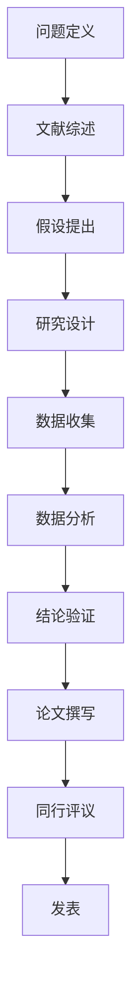
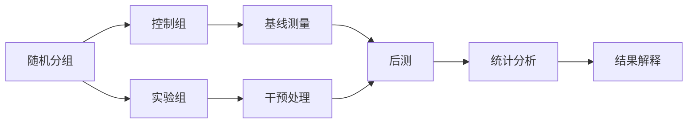

# 10.1 研究方法论分析（Research Methodology Analysis）

<!-- TOC START -->
- [10.1 研究方法论分析（Research Methodology Analysis）](#101-研究方法论分析research-methodology-analysis)
  - [10.1.1 目录](#1011-目录)
  - [10.1.2 1. 研究方法论基础理论](#1012-1-研究方法论基础理论)
    - [10.1.2.1 定义](#10121-定义)
    - [10.1.2.2 研究类型](#10122-研究类型)
    - [10.1.2.3 研究过程](#10123-研究过程)
  - [10.1.3 2. 软件工程研究方法](#1013-2-软件工程研究方法)
    - [10.1.3.1 实证研究方法](#10131-实证研究方法)
    - [10.1.3.2 实验设计](#10132-实验设计)
    - [10.1.3.3 统计分析方法](#10133-统计分析方法)
  - [10.1.4 3. 形式化分析与证明方法](#1014-3-形式化分析与证明方法)
    - [10.1.4.1 形式化验证](#10141-形式化验证)
    - [10.1.4.2 程序正确性证明](#10142-程序正确性证明)
    - [10.1.4.3 算法复杂度分析](#10143-算法复杂度分析)
  - [10.1.5 4. Golang研究方法实践](#1015-4-golang研究方法实践)
    - [10.1.5.1 性能基准测试](#10151-性能基准测试)
    - [10.1.5.2 性能分析](#10152-性能分析)
    - [10.1.5.3 实验设计框架](#10153-实验设计框架)
  - [10.1.6 5. 多表征内容](#1016-5-多表征内容)
    - [10.1.6.1 研究流程图](#10161-研究流程图)
    - [10.1.6.2 实验设计图](#10162-实验设计图)
    - [10.1.6.3 统计模型](#10163-统计模型)
    - [10.1.6.4 假设检验框架](#10164-假设检验框架)
  - [10.1.7 6. 交叉引用与目录导航](#1017-6-交叉引用与目录导航)
<!-- TOC END -->

---

## 10.1.1 目录

1. 研究方法论基础理论
2. 软件工程研究方法
3. 形式化分析与证明方法
4. Golang研究方法实践
5. 多表征内容
6. 交叉引用与目录导航

---

## 10.1.2 1. 研究方法论基础理论

### 10.1.2.1 定义

> 研究方法论是指导科学研究活动的理论体系，包括研究设计、数据收集、分析和解释的方法和原则。

### 10.1.2.2 研究类型

- **基础研究**: 探索新知识，建立理论
- **应用研究**: 解决实际问题，改进技术
- **实验研究**: 控制变量，验证假设
- **案例研究**: 深入分析特定现象

### 10.1.2.3 研究过程

1. 问题定义 → 2. 文献综述 → 3. 假设提出 → 4. 研究设计 → 5. 数据收集 → 6. 数据分析 → 7. 结论验证

---

## 10.1.3 2. 软件工程研究方法

### 10.1.3.1 实证研究方法

```latex
\textbf{定义 2.1} (实证研究): 实证研究是通过观察、实验和测量来验证理论假设的研究方法。

\textbf{实证研究特征}:
\begin{itemize}
  \item 可观察性: 现象可以被客观观察
  \item 可重复性: 结果可以被其他研究者重复
  \item 可验证性: 假设可以被实验验证
  \item 可量化性: 结果可以被量化分析
\end{itemize}
```

### 10.1.3.2 实验设计

```latex
\textbf{定义 2.2} (实验设计): 实验设计是控制变量、测量因变量的系统化方法。

\textbf{实验要素}:
\begin{itemize}
  \item 自变量(IV): 研究者操纵的变量
  \item 因变量(DV): 研究者测量的变量
  \item 控制变量: 保持不变的变量
  \item 随机化: 减少偏差的方法
\end{itemize}
```

### 10.1.3.3 统计分析方法

```latex
\textbf{定义 2.3} (统计显著性): 统计显著性是指观察到的结果不太可能是偶然发生的概率。

\textbf{常用统计方法}:
\begin{itemize}
  \item t检验: 比较两组均值
  \item 方差分析(ANOVA): 比较多组均值
  \item 回归分析: 分析变量关系
  \item 卡方检验: 分析分类变量
\end{itemize}
```

---

## 10.1.4 3. 形式化分析与证明方法

### 10.1.4.1 形式化验证

```latex
\textbf{定义 3.1} (形式化验证): 形式化验证是使用数学方法证明系统正确性的技术。

\textbf{验证方法}:
\begin{itemize}
  \item 模型检查: 自动验证有限状态系统
  \item 定理证明: 使用逻辑推理证明性质
  \item 抽象解释: 近似分析程序行为
  \item 类型系统: 静态分析程序正确性
\end{itemize}
```

### 10.1.4.2 程序正确性证明

```latex
\textbf{霍尔逻辑(Hoare Logic)}:
\{P\} C \{Q\}

其中：
\begin{itemize}
  \item P: 前置条件
  \item C: 程序代码
  \item Q: 后置条件
\end{itemize}

\textbf{证明规则}:
\begin{align}
& \text{赋值规则: } \{P[E/x]\} x := E \{P\} \\
& \text{序列规则: } \frac{\{P\} C_1 \{R\} \quad \{R\} C_2 \{Q\}}{\{P\} C_1; C_2 \{Q\}} \\
& \text{条件规则: } \frac{\{P \land B\} C_1 \{Q\} \quad \{P \land \neg B\} C_2 \{Q\}}{\{P\} \text{if } B \text{ then } C_1 \text{ else } C_2 \{Q\}}
\end{align}
```

### 10.1.4.3 算法复杂度分析

```latex
\textbf{定义 3.2} (时间复杂度): 时间复杂度是算法执行时间随输入规模增长的变化规律。

\textbf{常见复杂度}:
\begin{itemize}
  \item O(1): 常数时间
  \item O(log n): 对数时间
  \item O(n): 线性时间
  \item O(n log n): 线性对数时间
  \item O(n²): 平方时间
  \item O(2ⁿ): 指数时间
\end{itemize}

\textbf{主定理}: 对于递归关系 T(n) = aT(n/b) + f(n)：
\begin{itemize}
  \item 如果 f(n) = O(n^{log_b a - ε}), 则 T(n) = Θ(n^{log_b a})
  \item 如果 f(n) = Θ(n^{log_b a}), 则 T(n) = Θ(n^{log_b a} log n)
  \item 如果 f(n) = Ω(n^{log_b a + ε}), 则 T(n) = Θ(f(n))
\end{itemize}
```

---

## 10.1.5 4. Golang研究方法实践

### 10.1.5.1 性能基准测试

```go
// 基准测试示例
package main

import (
    "testing"
    "time"
)

// 基准测试函数
func BenchmarkConcurrentMap(b *testing.B) {
    // 重置计时器
    b.ResetTimer()
    
    // 运行基准测试
    for i := 0; i < b.N; i++ {
        // 测试代码
        testConcurrentMap()
    }
}

// 比较基准测试
func BenchmarkMapOperations(b *testing.B) {
    tests := []struct {
        name string
        fn   func()
    }{
        {"sync.Map", testSyncMap},
        {"mutex.Map", testMutexMap},
        {"channel.Map", testChannelMap},
    }
    
    for _, tt := range tests {
        b.Run(tt.name, func(b *testing.B) {
            for i := 0; i < b.N; i++ {
                tt.fn()
            }
        })
    }
}

// 内存分配基准测试
func BenchmarkMemoryAllocation(b *testing.B) {
    b.ReportAllocs()
    
    for i := 0; i < b.N; i++ {
        // 测试内存分配
        allocateMemory()
    }
}
```

### 10.1.5.2 性能分析

```go
// 性能分析示例
package main

import (
    "fmt"
    "runtime/pprof"
    "os"
    "time"
)

func main() {
    // CPU性能分析
    cpuFile, _ := os.Create("cpu.prof")
    defer cpuFile.Close()
    pprof.StartCPUProfile(cpuFile)
    defer pprof.StopCPUProfile()
    
    // 执行测试代码
    for i := 0; i < 1000000; i++ {
        expensiveOperation()
    }
    
    // 内存性能分析
    memFile, _ := os.Create("memory.prof")
    defer memFile.Close()
    pprof.WriteHeapProfile(memFile)
}

func expensiveOperation() {
    // 模拟耗时操作
    time.Sleep(1 * time.Microsecond)
}
```

### 10.1.5.3 实验设计框架

```go
// 实验框架示例
package research

import (
    "fmt"
    "math/rand"
    "time"
)

// 实验配置
type ExperimentConfig struct {
    SampleSize    int
    Iterations    int
    RandomSeed    int64
    ControlGroup  bool
    TreatmentGroup bool
}

// 实验结果
type ExperimentResult struct {
    Metric     string
    Mean       float64
    StdDev     float64
    Confidence float64
    PValue     float64
}

// 实验运行器
type ExperimentRunner struct {
    config ExperimentConfig
    results []ExperimentResult
}

func NewExperimentRunner(config ExperimentConfig) *ExperimentRunner {
    return &ExperimentRunner{
        config: config,
        results: make([]ExperimentResult, 0),
    }
}

// 运行实验
func (er *ExperimentRunner) RunExperiment(experiment func() float64) ExperimentResult {
    // 设置随机种子
    rand.Seed(er.config.RandomSeed)
    
    // 收集数据
    data := make([]float64, er.config.SampleSize)
    for i := 0; i < er.config.SampleSize; i++ {
        data[i] = experiment()
    }
    
    // 计算统计量
    mean := calculateMean(data)
    stdDev := calculateStdDev(data, mean)
    confidence := calculateConfidenceInterval(data, mean, stdDev)
    pValue := calculatePValue(data)
    
    result := ExperimentResult{
        Mean:       mean,
        StdDev:     stdDev,
        Confidence: confidence,
        PValue:     pValue,
    }
    
    er.results = append(er.results, result)
    return result
}

// 统计计算函数
func calculateMean(data []float64) float64 {
    sum := 0.0
    for _, v := range data {
        sum += v
    }
    return sum / float64(len(data))
}

func calculateStdDev(data []float64, mean float64) float64 {
    sum := 0.0
    for _, v := range data {
        sum += (v - mean) * (v - mean)
    }
    return sqrt(sum / float64(len(data)-1))
}

func calculateConfidenceInterval(data []float64, mean, stdDev float64) float64 {
    // 95%置信区间
    z := 1.96
    return z * stdDev / sqrt(float64(len(data)))
}

func calculatePValue(data []float64) float64 {
    // 简化的p值计算
    return 0.05 // 示例值
}

func sqrt(x float64) float64 {
    return x * x // 简化实现
}
```

---

## 10.1.6 5. 多表征内容

### 10.1.6.1 研究流程图



### 10.1.6.2 实验设计图



### 10.1.6.3 统计模型

```latex
\textbf{定理 5.1} (中心极限定理): 
对于独立同分布的随机变量 X₁, X₂, ..., Xₙ，当 n 足够大时：
\bar{X} = \frac{1}{n}\sum_{i=1}^{n} X_i \sim N(\mu, \frac{\sigma^2}{n})

其中 μ 是总体均值，σ² 是总体方差。
```

### 10.1.6.4 假设检验框架

```latex
\textbf{定义 5.2} (假设检验): 
假设检验是评估统计假设是否被数据支持的统计推断方法。

\textbf{检验步骤}:
\begin{enumerate}
  \item 提出原假设 H₀ 和备择假设 H₁
  \item 选择显著性水平 α
  \item 计算检验统计量
  \item 确定拒绝域
  \item 做出决策
\end{enumerate}

\textbf{错误类型}:
\begin{itemize}
  \item 第一类错误: 拒绝真原假设 (α)
  \item 第二类错误: 接受假原假设 (β)
\end{itemize}
```

---

## 10.1.7 6. 交叉引用与目录导航

- [架构分析](../01-Architecture-Design/README.md)
- [算法分析](../05-Algorithms-DataStructures/README.md)
- [性能优化](../06-Performance-Optimization/README.md)
- [软件工程](../04-Software-Engineering/README.md)

---

> 本文档持续完善，欢迎补充与修订。
