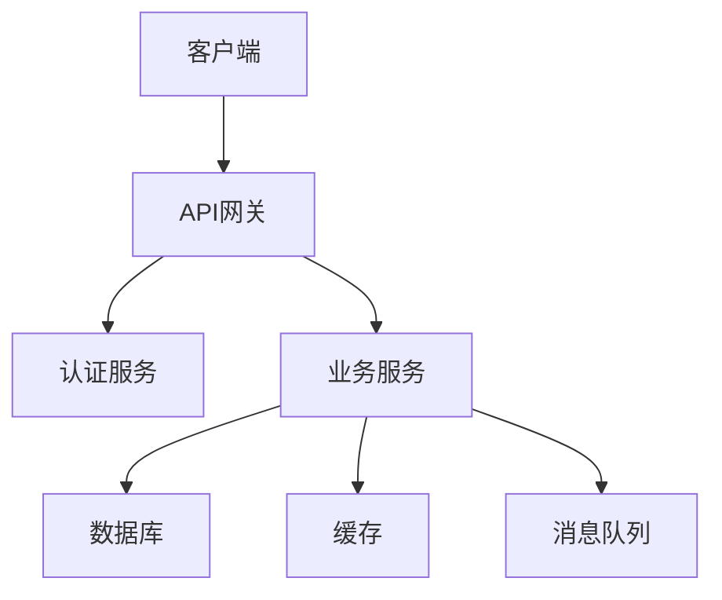
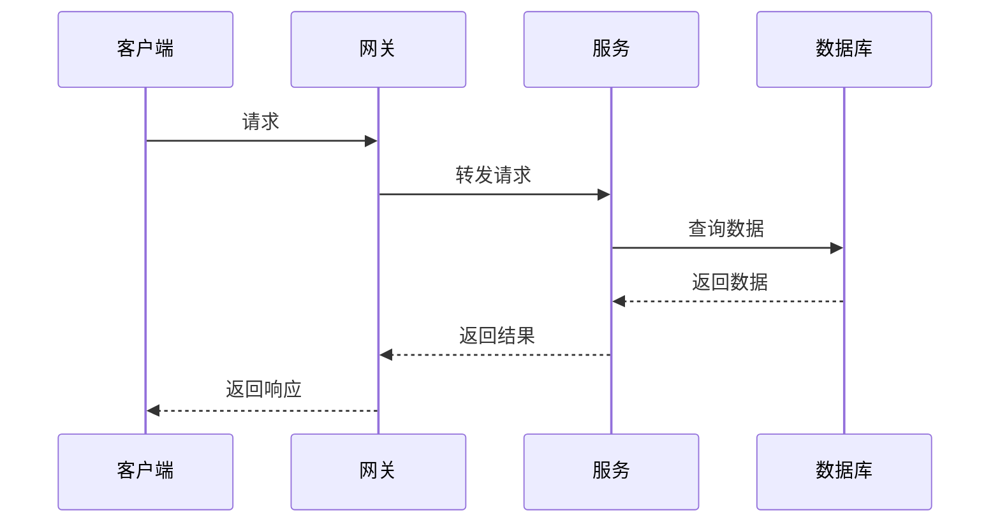
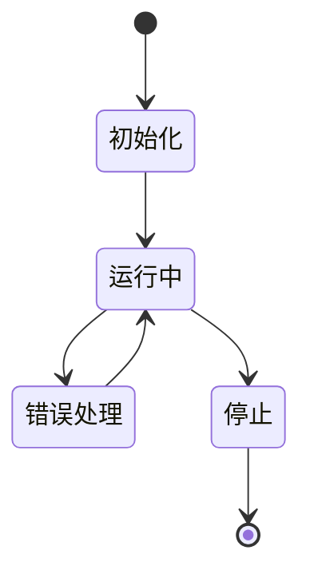

# 架构分析框架

## 概述

本文档定义了基于 `/model` 目录内容的架构分析方法论，专注于与Golang相关的软件架构、企业架构、行业架构和概念架构的分析、形式化定义和实现。

## 分析范围

### 1. 软件架构

- **微服务架构**: 服务拆分、通信、治理
- **工作流架构**: 流程编排、状态管理、事件驱动
- **事件驱动架构**: 事件流、消息队列、异步处理
- **分布式架构**: 一致性、容错、扩展性

### 2. 企业架构

- **组织架构**: 业务单元、角色定义、权限管理
- **业务流程**: 流程建模、自动化、监控
- **系统集成**: 接口设计、数据流、服务编排
- **技术架构**: 技术选型、部署策略、运维模式

### 3. 行业架构

- **金融科技**: 支付系统、风控系统、合规系统
- **物联网**: 设备管理、数据采集、边缘计算
- **Web3**: 区块链、智能合约、去中心化应用
- **企业软件**: ERP、CRM、工作流系统

### 4. 概念架构

- **设计模式**: 创建型、结构型、行为型模式
- **架构模式**: 分层、MVC、CQRS等
- **集成模式**: 网关、适配器、转换器
- **部署模式**: 容器化、服务网格、云原生

## 分析方法论

### 1. 形式化分析

#### 1.1 数学建模

- **集合论**: 使用集合定义架构组件
- **图论**: 使用图表示组件关系
- **代数**: 使用代数运算描述架构操作
- **逻辑**: 使用逻辑表达式描述约束

#### 1.2 形式化定义

```latex
\textbf{定义 1.1} (架构系统): 架构系统是一个六元组 $\mathcal{A} = (C, R, P, S, E, T)$，其中：
\begin{itemize}
    \item $C$ 是组件集合
    \item $R$ 是关系集合
    \item $P$ 是属性集合
    \item $S$ 是状态集合
    \item $E$ 是事件集合
    \item $T$ 是时间集合
\end{itemize}
```

#### 1.3 定理证明

```latex
\textbf{定理 1.1} (架构一致性): 如果架构系统 $\mathcal{A}$ 满足以下条件：
\begin{enumerate}
    \item 所有组件都有明确的接口定义
    \item 所有关系都有明确的协议定义
    \item 所有状态转换都是可追踪的
\end{enumerate}
则架构系统 $\mathcal{A}$ 是一致的。
```

### 2. 多表征分析

#### 2.1 架构图



#### 2.2 时序图



#### 2.3 状态图



### 3. 实现验证

#### 3.1 Golang实现

- **接口定义**: 使用Go接口定义组件契约
- **结构体**: 使用结构体定义组件状态
- **方法**: 使用方法实现组件行为
- **测试**: 使用单元测试验证实现

#### 3.2 性能分析

- **时间复杂度**: 分析算法的时间复杂度
- **空间复杂度**: 分析算法的空间复杂度
- **并发性能**: 分析并发场景下的性能
- **扩展性**: 分析系统的扩展能力

## 目录结构

```text
01-Architecture-Analysis/
├── README.md                           # 本框架文档
├── 01-Microservices-Architecture.md    # 微服务架构分析
├── 02-Workflow-Architecture.md         # 工作流架构分析
├── 03-Event-Driven-Architecture.md     # 事件驱动架构分析
├── 04-Distributed-Architecture.md      # 分布式架构分析
├── 05-Enterprise-Architecture.md       # 企业架构分析
└── 06-Industry-Architecture.md         # 行业架构分析
```

## 分析流程

### 阶段1: 架构识别

1. **组件识别**: 识别架构中的核心组件
2. **关系分析**: 分析组件间的关系和依赖
3. **接口定义**: 定义组件的接口和契约
4. **约束分析**: 分析架构的约束和限制

### 阶段2: 形式化建模

1. **数学定义**: 使用数学语言定义架构概念
2. **关系建模**: 建立组件关系的数学模型
3. **行为建模**: 建立组件行为的数学模型
4. **约束建模**: 建立架构约束的数学模型

### 阶段3: 实现设计

1. **接口设计**: 设计组件的Go接口
2. **结构设计**: 设计组件的Go结构体
3. **方法实现**: 实现组件的方法
4. **测试设计**: 设计测试用例

### 阶段4: 验证分析

1. **正确性验证**: 验证实现的正确性
2. **性能分析**: 分析实现的性能
3. **安全性分析**: 分析实现的安全性
4. **可扩展性分析**: 分析实现的可扩展性

## 质量标准

### 1. 理论质量

- **数学严谨性**: 所有定义和证明都必须是数学严谨的
- **逻辑一致性**: 所有逻辑推理都必须是正确的
- **完整性**: 覆盖架构的所有重要方面
- **可验证性**: 所有声明都可以验证

### 2. 实现质量

- **可运行性**: 所有代码示例都可以运行
- **性能性**: 实现具有良好的性能
- **安全性**: 实现具有良好的安全性
- **可维护性**: 实现具有良好的可维护性

### 3. 文档质量

- **清晰性**: 文档内容清晰易懂
- **完整性**: 文档内容完整全面
- **一致性**: 文档内容保持一致
- **可读性**: 文档具有良好的可读性

## 持续更新

### 1. 内容更新

- **新架构**: 添加新的架构模式
- **新实现**: 添加新的实现方法
- **新分析**: 添加新的分析方法
- **新验证**: 添加新的验证方法

### 2. 质量改进

- **理论改进**: 改进理论分析
- **实现改进**: 改进代码实现
- **文档改进**: 改进文档质量
- **工具改进**: 改进分析工具

---

*本框架文档将持续更新，确保架构分析的系统性和完整性。*
