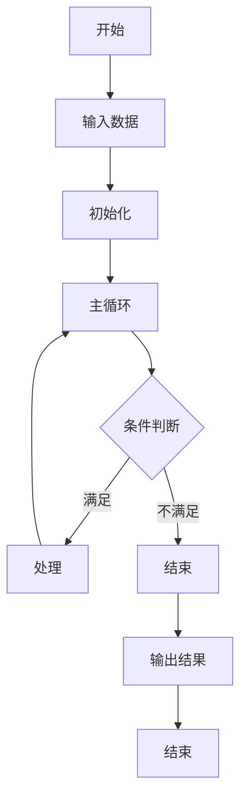
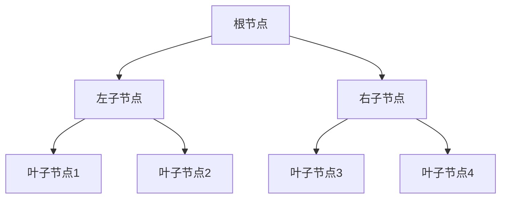
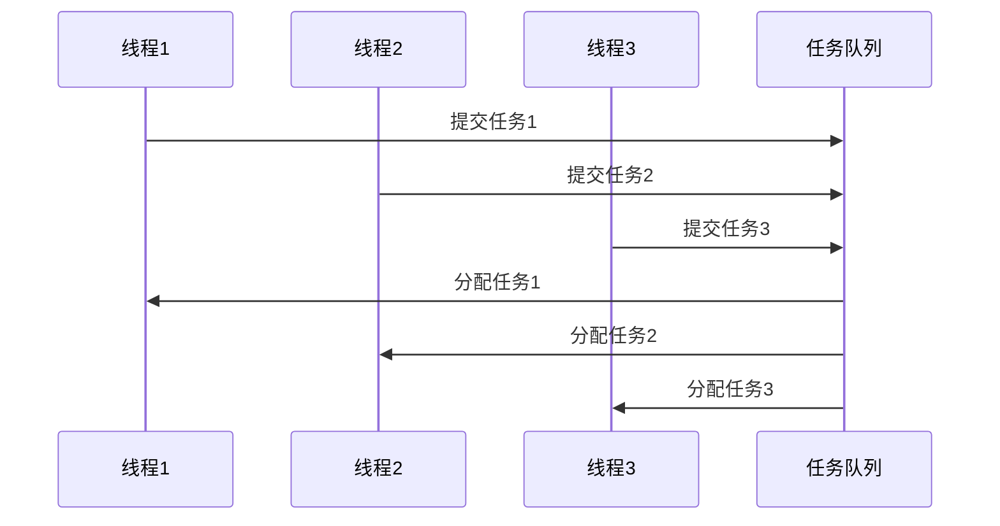

# 算法分析框架

## 概述

本文档定义了基于 `/model` 目录内容的算法分析方法论，专注于与Golang相关的基础算法、并发算法、分布式算法和图算法的分析、形式化定义和实现。

## 分析范围

### 1. 基础算法

- **排序算法**: 快速排序、归并排序、堆排序等
- **搜索算法**: 二分搜索、深度优先搜索、广度优先搜索等
- **动态规划**: 背包问题、最长公共子序列、编辑距离等
- **贪心算法**: 活动选择、霍夫曼编码、最小生成树等

### 2. 并发算法

- **同步算法**: 互斥锁、读写锁、条件变量等
- **无锁算法**: 原子操作、CAS操作、无锁数据结构等
- **并发数据结构**: 并发队列、并发映射、并发栈等
- **工作窃取**: 任务调度、负载均衡、性能优化等

### 3. 分布式算法

- **一致性算法**: Paxos、Raft、ZAB等
- **分布式排序**: 归并排序、快速排序的分布式版本
- **分布式搜索**: 分布式索引、分布式查询等
- **分布式图算法**: 分布式BFS、分布式最短路径等

### 4. 图算法

- **图遍历**: DFS、BFS、拓扑排序等
- **最短路径**: Dijkstra、Floyd-Warshall、Bellman-Ford等
- **最小生成树**: Kruskal、Prim等
- **网络流**: Ford-Fulkerson、Edmonds-Karp等

## 分析方法论

### 1. 形式化分析

#### 1.1 算法定义

```latex
\textbf{定义 1.1} (算法): 算法是一个五元组 $\mathcal{A} = (I, O, P, T, S)$，其中：

\begin{itemize}
    \item $I$ 是输入集合
    \item $O$ 是输出集合
    \item $P$ 是处理步骤集合
    \item $T$ 是时间函数 $T: I \rightarrow \mathbb{R}^+$
    \item $S$ 是空间函数 $S: I \rightarrow \mathbb{R}^+$
\end{itemize}
```

#### 1.2 复杂度分析

```latex
\textbf{定义 1.2} (时间复杂度): 算法 $\mathcal{A}$ 的时间复杂度是函数 $f(n)$，使得：

\forall n \in \mathbb{N}, \exists c > 0, \exists n_0 \in \mathbb{N}: \forall n \geq n_0, T(n) \leq c \cdot f(n)

其中 $T(n)$ 是算法在输入大小为 $n$ 时的实际运行时间。
```

#### 1.3 正确性证明

```latex
\textbf{定理 1.1} (算法正确性): 算法 $\mathcal{A}$ 是正确的，当且仅当：

\forall x \in I, \mathcal{A}(x) \in O \land \mathcal{A}(x) = expected\_output(x)

其中 $expected\_output(x)$ 是输入 $x$ 的期望输出。
```

### 2. 多表征分析

#### 2.1 算法流程图



#### 2.2 数据结构图



#### 2.3 并发执行图



### 3. 实现验证

#### 3.1 Golang实现

- **接口设计**: 使用Go接口定义算法契约
- **结构体**: 使用结构体定义数据结构
- **方法**: 使用方法实现算法逻辑
- **测试**: 使用单元测试验证实现

#### 3.2 性能基准

- **时间复杂度**: 分析算法的时间复杂度
- **空间复杂度**: 分析算法的空间复杂度
- **实际性能**: 使用基准测试测量实际性能
- **优化建议**: 提供性能优化建议

## 目录结构

```
02-Algorithm-Analysis/
├── README.md                           # 本框架文档
├── 01-Basic-Algorithms.md              # 基础算法分析
├── 02-Concurrent-Algorithms.md         # 并发算法分析
├── 03-Distributed-Algorithms.md        # 分布式算法分析
├── 04-Graph-Algorithms.md              # 图算法分析
├── 05-String-Algorithms.md             # 字符串算法分析
└── 06-Numerical-Algorithms.md          # 数值算法分析
```

## 分析流程

### 阶段1: 算法理解

1. **问题分析**: 理解算法要解决的问题
2. **思路分析**: 分析算法的设计思路
3. **步骤分析**: 分析算法的执行步骤
4. **边界分析**: 分析算法的边界条件

### 阶段2: 形式化建模

1. **数学定义**: 使用数学语言定义算法
2. **复杂度分析**: 分析时间和空间复杂度
3. **正确性证明**: 证明算法的正确性
4. **优化分析**: 分析算法的优化空间

### 阶段3: 实现设计

1. **接口设计**: 设计算法的Go接口
2. **数据结构**: 设计算法需要的数据结构
3. **方法实现**: 实现算法的Go方法
4. **测试设计**: 设计测试用例

### 阶段4: 性能验证

1. **正确性验证**: 验证实现的正确性
2. **性能测试**: 测试实现的性能
3. **基准测试**: 进行基准测试
4. **优化验证**: 验证优化效果

## 质量标准

### 1. 理论质量

- **数学严谨性**: 所有定义和证明都必须是数学严谨的
- **逻辑一致性**: 所有逻辑推理都必须是正确的
- **完整性**: 覆盖算法的所有重要方面
- **可验证性**: 所有声明都可以验证

### 2. 实现质量

- **可运行性**: 所有代码示例都可以运行
- **性能性**: 实现具有良好的性能
- **正确性**: 实现是正确的
- **可维护性**: 实现具有良好的可维护性

### 3. 文档质量

- **清晰性**: 文档内容清晰易懂
- **完整性**: 文档内容完整全面
- **一致性**: 文档内容保持一致
- **可读性**: 文档具有良好的可读性

## 持续更新

### 1. 内容更新

- **新算法**: 添加新的算法
- **新实现**: 添加新的实现方法
- **新分析**: 添加新的分析方法
- **新验证**: 添加新的验证方法

### 2. 质量改进

- **理论改进**: 改进理论分析
- **实现改进**: 改进代码实现
- **文档改进**: 改进文档质量
- **工具改进**: 改进分析工具

---

*本框架文档将持续更新，确保算法分析的系统性和完整性。*
