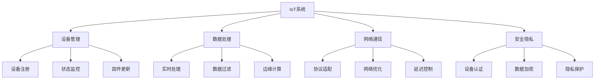
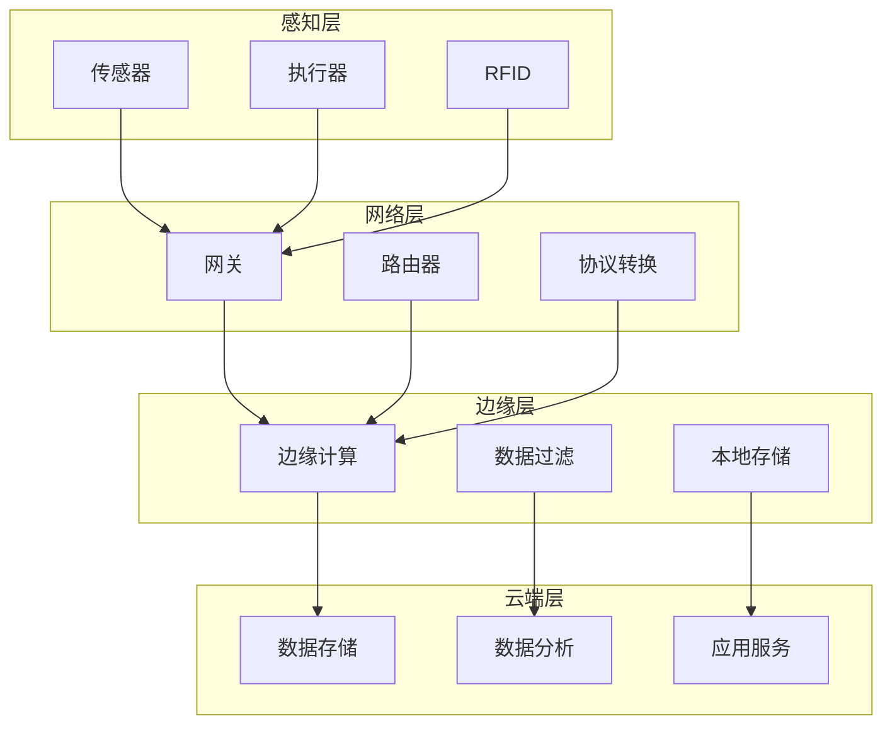
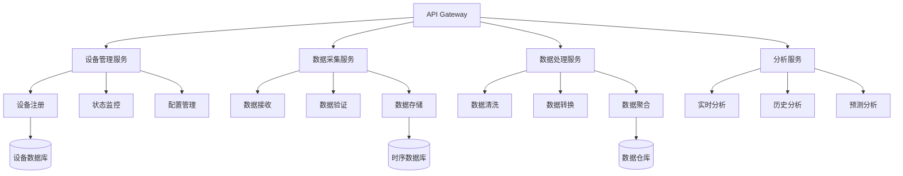

# 物联网领域深度分析

## 目录

1. [概述](#1-概述)
2. [形式化定义](#2-形式化定义)
3. [核心概念模型](#3-核心概念模型)
4. [架构设计](#4-架构设计)
5. [算法实现](#5-算法实现)
6. [Golang实现](#6-golang实现)
7. [性能优化](#7-性能优化)
8. [安全机制](#8-安全机制)
9. [最佳实践](#9-最佳实践)

---

## 1. 概述

### 1.1 IoT系统定义

物联网（IoT）系统是一个分布式感知网络，需要处理大量设备连接、实时数据采集、边缘计算、云端分析等。在Golang生态中，我们将其定义为：

**定义 1.1** (IoT系统)
IoT系统是一个八元组 $\mathcal{I} = (D, S, G, C, E, N, \mathcal{A}, \mathcal{P})$，其中：

- $D$ 是设备集合 $D = \{d_1, d_2, ..., d_n\}$
- $S$ 是传感器集合 $S = \{s_1, s_2, ..., s_m\}$
- $G$ 是网关集合 $G = \{g_1, g_2, ..., g_k\}$
- $C$ 是云端系统 $C = (C_{storage}, C_{compute}, C_{analytics})$
- $E$ 是边缘计算 $E = (E_{processing}, E_{filtering}, E_{aggregation})$
- $N$ 是网络层 $N = (N_{protocol}, N_{routing}, N_{security})$
- $\mathcal{A}$ 是算法集合 $\mathcal{A} = \{\alpha_1, \alpha_2, ..., \alpha_p\}$
- $\mathcal{P}$ 是协议集合 $\mathcal{P} = \{p_1, p_2, ..., p_q\}$

### 1.2 核心挑战



---

## 2. 形式化定义

### 2.1 设备模型

**定义 2.1** (IoT设备)
IoT设备是一个六元组 $d = (id, type, location, capabilities, status, config)$，其中：

- $id \in \mathbb{N}$ 是设备唯一标识符
- $type \in \{sensor, actuator, gateway, controller\}$ 是设备类型
- $location \in \mathbb{R}^3$ 是设备位置坐标
- $capabilities \subseteq C$ 是设备能力集合
- $status \in \{online, offline, error, maintenance\}$ 是设备状态
- $config$ 是设备配置

**定义 2.2** (传感器数据流)
传感器数据流是一个五元组 $f = (sensor_id, timestamp, value, unit, quality)$，其中：

- $sensor_id \in S$ 是传感器ID
- $timestamp \in \mathbb{R}$ 是时间戳
- $value \in \mathbb{R}$ 是测量值
- $unit$ 是单位
- $quality \in [0, 1]$ 是数据质量

**定理 2.1** (数据一致性)
对于任意传感器数据流序列 $F = [f_1, f_2, ..., f_n]$，如果满足：

1. 时间单调递增：$\forall i < j, timestamp_i < timestamp_j$
2. 值域合理：$\forall i, value_i \in [min, max]$
3. 质量阈值：$\forall i, quality_i \geq threshold$

则数据流保持一致性。

---

## 3. 核心概念模型

### 3.1 分层架构



### 3.2 设备管理

```go
// 设备抽象
type Device interface {
    GetID() string
    GetType() DeviceType
    GetStatus() DeviceStatus
    Connect() error
    Disconnect() error
    SendCommand(cmd Command) error
    ReadData() ([]byte, error)
}

// 传感器设备
type Sensor struct {
    ID          string
    Type        SensorType
    Location    Location
    Capabilities []Capability
    Status      DeviceStatus
    Config      SensorConfig
}

type SensorType string

const (
    SensorTypeTemperature SensorType = "temperature"
    SensorTypeHumidity    SensorType = "humidity"
    SensorTypePressure    SensorType = "pressure"
    SensorTypeLight       SensorType = "light"
    SensorTypeMotion      SensorType = "motion"
)

// 执行器设备
type Actuator struct {
    ID          string
    Type        ActuatorType
    Location    Location
    Capabilities []Capability
    Status      DeviceStatus
    Config      ActuatorConfig
}

type ActuatorType string

const (
    ActuatorTypeSwitch    ActuatorType = "switch"
    ActuatorTypeMotor     ActuatorType = "motor"
    ActuatorTypeValve     ActuatorType = "valve"
    ActuatorTypeDisplay   ActuatorType = "display"
)
```

---

## 4. 架构设计

### 4.1 微服务架构



### 4.2 服务实现

```go
// 设备管理服务
type DeviceManagementService struct {
    deviceRepo    DeviceRepository
    eventBus      EventBus
    logger        Logger
}

func (dms *DeviceManagementService) RegisterDevice(device Device) error {
    // 验证设备
    if err := dms.validateDevice(device); err != nil {
        return err
    }
    
    // 生成设备ID
    device.SetID(generateDeviceID())
    
    // 保存设备信息
    if err := dms.deviceRepo.Create(device); err != nil {
        return err
    }
    
    // 发布设备注册事件
    dms.eventBus.Publish(DeviceRegisteredEvent{
        DeviceID: device.GetID(),
        Type:     device.GetType(),
        Timestamp: time.Now(),
    })
    
    return nil
}

func (dms *DeviceManagementService) UpdateDeviceStatus(deviceID string, status DeviceStatus) error {
    device, err := dms.deviceRepo.GetByID(deviceID)
    if err != nil {
        return err
    }
    
    device.SetStatus(status)
    
    if err := dms.deviceRepo.Update(device); err != nil {
        return err
    }
    
    // 发布状态更新事件
    dms.eventBus.Publish(DeviceStatusChangedEvent{
        DeviceID: deviceID,
        Status:   status,
        Timestamp: time.Now(),
    })
    
    return nil
}

// 数据采集服务
type DataCollectionService struct {
    deviceRepo    DeviceRepository
    dataRepo      DataRepository
    eventBus      EventBus
    logger        Logger
}

func (dcs *DataCollectionService) CollectData(deviceID string) (*SensorData, error) {
    device, err := dcs.deviceRepo.GetByID(deviceID)
    if err != nil {
        return nil, err
    }
    
    // 读取传感器数据
    rawData, err := device.ReadData()
    if err != nil {
        return nil, err
    }
    
    // 解析数据
    sensorData := &SensorData{
        DeviceID:  deviceID,
        Timestamp: time.Now(),
        Value:     parseSensorValue(rawData),
        Unit:      device.GetUnit(),
        Quality:   calculateDataQuality(rawData),
    }
    
    // 保存数据
    if err := dcs.dataRepo.Save(sensorData); err != nil {
        return nil, err
    }
    
    // 发布数据采集事件
    dcs.eventBus.Publish(DataCollectedEvent{
        DeviceID:  deviceID,
        Data:      sensorData,
        Timestamp: time.Now(),
    })
    
    return sensorData, nil
}
```

---

## 5. 算法实现

### 5.1 数据聚合算法

```go
// 数据聚合器
type DataAggregator struct {
    windowSize time.Duration
    functions  map[string]AggregationFunction
}

type AggregationFunction func([]float64) float64

func NewDataAggregator(windowSize time.Duration) *DataAggregator {
    return &DataAggregator{
        windowSize: windowSize,
        functions: map[string]AggregationFunction{
            "avg":   average,
            "min":   minimum,
            "max":   maximum,
            "sum":   sum,
            "count": count,
        },
    }
}

func (da *DataAggregator) Aggregate(data []SensorData, function string) float64 {
    values := make([]float64, len(data))
    for i, d := range data {
        values[i] = d.Value
    }
    
    if fn, exists := da.functions[function]; exists {
        return fn(values)
    }
    
    return 0.0
}

// 聚合函数实现
func average(values []float64) float64 {
    if len(values) == 0 {
        return 0.0
    }
    
    sum := 0.0
    for _, v := range values {
        sum += v
    }
    
    return sum / float64(len(values))
}

func minimum(values []float64) float64 {
    if len(values) == 0 {
        return 0.0
    }
    
    min := values[0]
    for _, v := range values {
        if v < min {
            min = v
        }
    }
    
    return min
}

func maximum(values []float64) float64 {
    if len(values) == 0 {
        return 0.0
    }
    
    max := values[0]
    for _, v := range values {
        if v > max {
            max = v
        }
    }
    
    return max
}
```

### 5.2 异常检测算法

```go
// 异常检测器
type AnomalyDetector struct {
    threshold float64
    window    []float64
    maxSize   int
}

func NewAnomalyDetector(threshold float64, windowSize int) *AnomalyDetector {
    return &AnomalyDetector{
        threshold: threshold,
        window:    make([]float64, 0, windowSize),
        maxSize:   windowSize,
    }
}

func (ad *AnomalyDetector) DetectAnomaly(value float64) bool {
    if len(ad.window) < 2 {
        ad.window = append(ad.window, value)
        return false
    }
    
    // 计算移动平均
    mean := average(ad.window)
    
    // 计算标准差
    variance := 0.0
    for _, v := range ad.window {
        variance += math.Pow(v-mean, 2)
    }
    variance /= float64(len(ad.window))
    stdDev := math.Sqrt(variance)
    
    // 检测异常
    zScore := math.Abs(value-mean) / stdDev
    isAnomaly := zScore > ad.threshold
    
    // 更新窗口
    ad.window = append(ad.window, value)
    if len(ad.window) > ad.maxSize {
        ad.window = ad.window[1:]
    }
    
    return isAnomaly
}
```

---

## 6. Golang实现

### 6.1 项目结构

```
iot-platform/
├── cmd/
│   ├── gateway/
│   │   └── main.go
│   ├── collector/
│   │   └── main.go
│   └── analyzer/
│       └── main.go
├── internal/
│   ├── device/
│   │   ├── device.go
│   │   ├── sensor.go
│   │   ├── actuator.go
│   │   └── gateway.go
│   ├── data/
│   │   ├── collector.go
│   │   ├── processor.go
│   │   └── aggregator.go
│   ├── network/
│   │   ├── mqtt.go
│   │   ├── coap.go
│   │   └── http.go
│   └── analytics/
│       ├── anomaly.go
│       ├── prediction.go
│       └── visualization.go
├── pkg/
│   ├── protocol/
│   ├── security/
│   └── utils/
└── configs/
```

### 6.2 核心实现

```go
// MQTT客户端
type MQTTClient struct {
    client    mqtt.Client
    topics    map[string]MessageHandler
    logger    Logger
}

type MessageHandler func(topic string, payload []byte)

func NewMQTTClient(broker string, clientID string) (*MQTTClient, error) {
    opts := mqtt.NewClientOptions()
    opts.AddBroker(broker)
    opts.SetClientID(clientID)
    opts.SetAutoReconnect(true)
    
    client := mqtt.NewClient(opts)
    if token := client.Connect(); token.Wait() && token.Error() != nil {
        return nil, token.Error()
    }
    
    return &MQTTClient{
        client: client,
        topics: make(map[string]MessageHandler),
    }, nil
}

func (mc *MQTTClient) Subscribe(topic string, handler MessageHandler) error {
    mc.topics[topic] = handler
    
    token := mc.client.Subscribe(topic, 0, func(client mqtt.Client, msg mqtt.Message) {
        if handler, exists := mc.topics[msg.Topic()]; exists {
            handler(msg.Topic(), msg.Payload())
        }
    })
    
    return token.Error()
}

func (mc *MQTTClient) Publish(topic string, payload []byte) error {
    token := mc.client.Publish(topic, 0, false, payload)
    return token.Error()
}

// 数据处理器
type DataProcessor struct {
    filters    []DataFilter
    transformers []DataTransformer
    aggregators []DataAggregator
    logger     Logger
}

type DataFilter interface {
    Filter(data SensorData) bool
}

type DataTransformer interface {
    Transform(data SensorData) SensorData
}

func (dp *DataProcessor) ProcessData(data SensorData) (SensorData, error) {
    // 数据过滤
    for _, filter := range dp.filters {
        if !filter.Filter(data) {
            return data, ErrDataFiltered
        }
    }
    
    // 数据转换
    for _, transformer := range dp.transformers {
        data = transformer.Transform(data)
    }
    
    // 数据聚合
    for _, aggregator := range dp.aggregators {
        if err := aggregator.Aggregate(data); err != nil {
            return data, err
        }
    }
    
    return data, nil
}
```

---

## 7. 性能优化

### 7.1 数据压缩

```go
// 数据压缩器
type DataCompressor struct {
    algorithm CompressionAlgorithm
}

type CompressionAlgorithm string

const (
    CompressionGZIP  CompressionAlgorithm = "gzip"
    CompressionLZ4   CompressionAlgorithm = "lz4"
    CompressionSnappy CompressionAlgorithm = "snappy"
)

func (dc *DataCompressor) Compress(data []byte) ([]byte, error) {
    switch dc.algorithm {
    case CompressionGZIP:
        return dc.compressGZIP(data)
    case CompressionLZ4:
        return dc.compressLZ4(data)
    case CompressionSnappy:
        return dc.compressSnappy(data)
    default:
        return data, nil
    }
}

func (dc *DataCompressor) Decompress(data []byte) ([]byte, error) {
    switch dc.algorithm {
    case CompressionGZIP:
        return dc.decompressGZIP(data)
    case CompressionLZ4:
        return dc.decompressLZ4(data)
    case CompressionSnappy:
        return dc.decompressSnappy(data)
    default:
        return data, nil
    }
}
```

### 7.2 缓存策略

```go
// 多级缓存
type MultiLevelCache struct {
    l1Cache *sync.Map  // 内存缓存
    l2Cache Cache      // Redis缓存
    l3Cache *sql.DB    // 数据库
}

func (mlc *MultiLevelCache) Get(key string) (interface{}, error) {
    // L1缓存查找
    if value, ok := mlc.l1Cache.Load(key); ok {
        return value, nil
    }
    
    // L2缓存查找
    if value, err := mlc.l2Cache.Get(key); err == nil {
        mlc.l1Cache.Store(key, value)
        return value, nil
    }
    
    // L3数据库查找
    value, err := mlc.getFromDB(key)
    if err != nil {
        return nil, err
    }
    
    // 更新缓存
    mlc.l2Cache.Set(key, value, time.Hour)
    mlc.l1Cache.Store(key, value)
    
    return value, nil
}
```

---

## 8. 安全机制

### 8.1 设备认证

```go
// 设备认证器
type DeviceAuthenticator struct {
    certManager CertificateManager
    tokenManager TokenManager
}

func (da *DeviceAuthenticator) AuthenticateDevice(deviceID string, credentials []byte) (*DeviceToken, error) {
    // 验证设备证书
    cert, err := da.certManager.ValidateCertificate(credentials)
    if err != nil {
        return nil, err
    }
    
    // 生成设备令牌
    token := &DeviceToken{
        DeviceID: deviceID,
        IssuedAt: time.Now(),
        ExpiresAt: time.Now().Add(24 * time.Hour),
        Permissions: cert.Permissions,
    }
    
    // 签名令牌
    signedToken, err := da.tokenManager.SignToken(token)
    if err != nil {
        return nil, err
    }
    
    return signedToken, nil
}

func (da *DeviceAuthenticator) ValidateToken(token *DeviceToken) error {
    // 验证令牌签名
    if err := da.tokenManager.ValidateToken(token); err != nil {
        return err
    }
    
    // 检查令牌过期
    if time.Now().After(token.ExpiresAt) {
        return ErrTokenExpired
    }
    
    return nil
}
```

### 8.2 数据加密

```go
// 数据加密器
type DataEncryptor struct {
    algorithm EncryptionAlgorithm
    key       []byte
}

type EncryptionAlgorithm string

const (
    EncryptionAES EncryptionAlgorithm = "aes"
    EncryptionRSA EncryptionAlgorithm = "rsa"
)

func (de *DataEncryptor) Encrypt(data []byte) ([]byte, error) {
    switch de.algorithm {
    case EncryptionAES:
        return de.encryptAES(data)
    case EncryptionRSA:
        return de.encryptRSA(data)
    default:
        return data, nil
    }
}

func (de *DataEncryptor) Decrypt(data []byte) ([]byte, error) {
    switch de.algorithm {
    case EncryptionAES:
        return de.decryptAES(data)
    case EncryptionRSA:
        return de.decryptRSA(data)
    default:
        return data, nil
    }
}
```

---

## 9. 最佳实践

### 9.1 错误处理

```go
// IoT错误定义
type IoTError struct {
    Code    string
    Message string
    DeviceID string
    Timestamp time.Time
}

func (ie *IoTError) Error() string {
    return fmt.Sprintf("[%s] %s (Device: %s)", ie.Code, ie.Message, ie.DeviceID)
}

// 预定义错误
var (
    ErrDeviceNotFound = &IoTError{
        Code: "DEVICE_NOT_FOUND",
        Message: "Device not found",
    }
    
    ErrDeviceOffline = &IoTError{
        Code: "DEVICE_OFFLINE",
        Message: "Device is offline",
    }
    
    ErrDataInvalid = &IoTError{
        Code: "DATA_INVALID",
        Message: "Invalid sensor data",
    }
)

// 错误恢复
func (dms *DeviceManagementService) handleError(err error) {
    if iotErr, ok := err.(*IoTError); ok {
        dms.logger.Error("IoT error occurred",
            "code", iotErr.Code,
            "message", iotErr.Message,
            "device_id", iotErr.DeviceID,
        )
        
        // 根据错误类型采取相应措施
        switch iotErr.Code {
        case "DEVICE_OFFLINE":
            dms.handleDeviceOffline(iotErr.DeviceID)
        case "DATA_INVALID":
            dms.handleDataInvalid(iotErr.DeviceID)
        }
    }
}
```

### 9.2 监控指标

```go
// IoT监控指标
type IoTMetrics struct {
    deviceCount      prometheus.Gauge
    dataPoints       prometheus.Counter
    errorCount       prometheus.CounterVec
    responseTime     prometheus.Histogram
    dataQuality      prometheus.GaugeVec
}

func NewIoTMetrics() *IoTMetrics {
    return &IoTMetrics{
        deviceCount: prometheus.NewGauge(prometheus.GaugeOpts{
            Name: "iot_devices_total",
            Help: "Total number of connected devices",
        }),
        dataPoints: prometheus.NewCounter(prometheus.CounterOpts{
            Name: "iot_data_points_total",
            Help: "Total number of data points collected",
        }),
        errorCount: prometheus.NewCounterVec(prometheus.CounterOpts{
            Name: "iot_errors_total",
            Help: "Total number of errors by type",
        }, []string{"error_type", "device_type"}),
        responseTime: prometheus.NewHistogram(prometheus.HistogramOpts{
            Name: "iot_response_time_seconds",
            Help: "Device response time in seconds",
            Buckets: prometheus.DefBuckets,
        }),
        dataQuality: prometheus.NewGaugeVec(prometheus.GaugeOpts{
            Name: "iot_data_quality",
            Help: "Data quality score",
        }, []string{"device_id", "sensor_type"}),
    }
}

// 指标记录
func (dcs *DataCollectionService) CollectData(deviceID string) (*SensorData, error) {
    timer := prometheus.NewTimer(dcs.metrics.responseTime)
    defer timer.ObserveDuration()
    
    dcs.metrics.dataPoints.Inc()
    
    data, err := dcs.collectDataInternal(deviceID)
    if err != nil {
        dcs.metrics.errorCount.WithLabelValues(err.Error(), "sensor").Inc()
        return nil, err
    }
    
    // 记录数据质量
    dcs.metrics.dataQuality.WithLabelValues(deviceID, data.SensorType).Set(data.Quality)
    
    return data, nil
}
```

---

## 总结

本文档提供了物联网领域的全面分析，包括：

1. **形式化定义**：设备模型和数据流定义
2. **架构设计**：分层架构和微服务设计
3. **算法实现**：数据聚合和异常检测算法
4. **Golang实现**：完整的IoT平台实现
5. **性能优化**：数据压缩和缓存策略
6. **安全机制**：设备认证和数据加密
7. **最佳实践**：错误处理和监控指标

这些内容为构建高性能、安全、可靠的IoT系统提供了全面的指导。

---

**参考文献**：

1. [Go官方文档](https://golang.org/doc/)
2. [MQTT协议规范](https://mqtt.org/)
3. [CoAP协议规范](https://coap.technology/)
4. [IoT安全最佳实践](https://www.iotsecurityfoundation.org/)
5. [边缘计算架构](https://en.wikipedia.org/wiki/Edge_computing)
