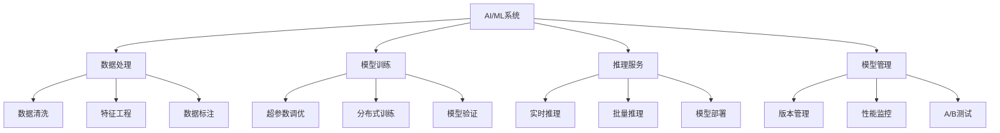
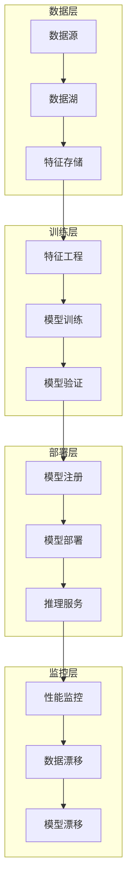
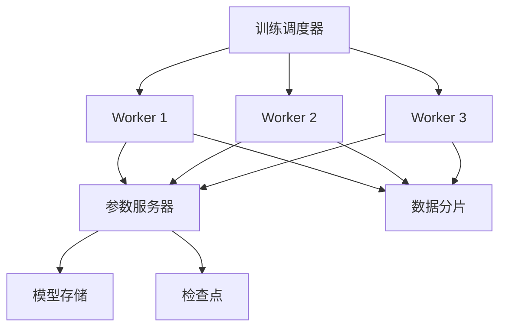
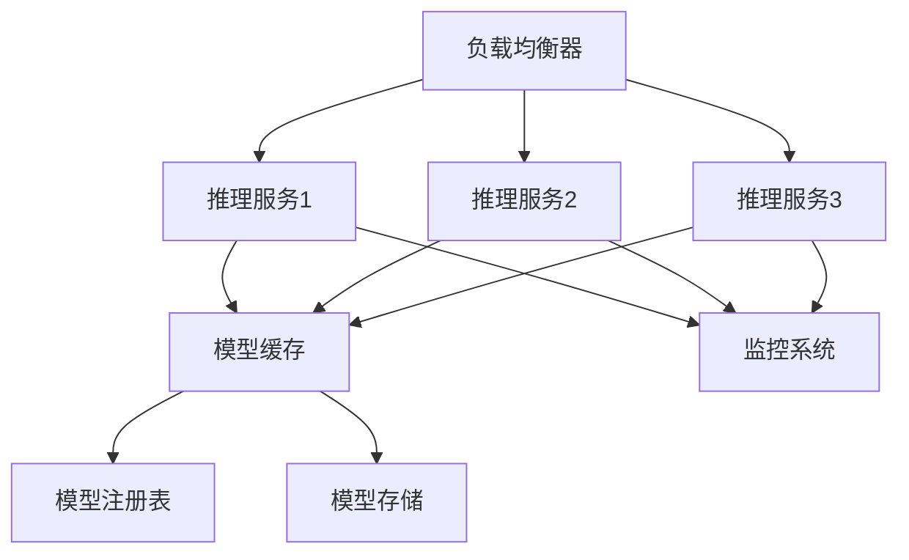

# 11.4.1 人工智能/机器学习领域深度分析

<!-- TOC START -->
- [11.4.1 人工智能/机器学习领域深度分析](#人工智能机器学习领域深度分析)
  - [11.4.1.1 目录](#目录)
  - [11.4.1.2 1. 概述](#1-概述)
    - [11.4.1.2.1 AI/ML系统定义](#aiml系统定义)
    - [11.4.1.2.2 核心挑战](#核心挑战)
  - [11.4.1.3 2. 形式化定义](#2-形式化定义)
    - [11.4.1.3.1 机器学习模型](#机器学习模型)
  - [11.4.1.4 3. 核心概念模型](#3-核心概念模型)
    - [11.4.1.4.1 MLOps架构](#mlops架构)
    - [11.4.1.4.2 模型生命周期](#模型生命周期)
  - [11.4.1.5 4. 架构设计](#4-架构设计)
    - [11.4.1.5.1 分布式训练架构](#分布式训练架构)
    - [11.4.1.5.2 推理服务架构](#推理服务架构)
    - [11.4.1.5.3 服务实现](#服务实现)
  - [11.4.1.6 5. 算法实现](#5-算法实现)
    - [11.4.1.6.1 线性回归](#线性回归)
    - [11.4.1.6.2 随机森林](#随机森林)
  - [11.4.1.7 6. Golang实现](#6-golang实现)
    - [11.4.1.7.1 项目结构](#项目结构)
    - [11.4.1.7.2 核心实现](#核心实现)
  - [11.4.1.8 7. 性能优化](#7-性能优化)
    - [11.4.1.8.1 并行训练](#并行训练)
    - [11.4.1.8.2 模型缓存](#模型缓存)
  - [11.4.1.9 8. 最佳实践](#8-最佳实践)
    - [11.4.1.9.1 模型评估](#模型评估)
    - [11.4.1.9.2 超参数调优](#超参数调优)
  - [11.4.1.10 总结](#总结)
<!-- TOC END -->

## 11.4.1.1 目录

1. [概述](#1-概述)
2. [形式化定义](#2-形式化定义)
3. [核心概念模型](#3-核心概念模型)
4. [架构设计](#4-架构设计)
5. [算法实现](#5-算法实现)
6. [Golang实现](#6-golang实现)
7. [性能优化](#7-性能优化)
8. [最佳实践](#8-最佳实践)

---

## 11.4.1.2 1. 概述

### 11.4.1.2.1 AI/ML系统定义

人工智能/机器学习系统是一个复杂的数据驱动系统，需要处理大规模数据、模型训练、推理服务、特征工程等。在Golang生态中，我们将其定义为：

**定义 1.1** (AI/ML系统)
AI/ML系统是一个七元组 $\mathcal{A} = (D, M, F, T, I, \mathcal{E}, \mathcal{O})$，其中：

- $D$ 是数据集集合 $D = \{d_1, d_2, ..., d_n\}$
- $M$ 是模型集合 $M = \{m_1, m_2, ..., m_k\}$
- $F$ 是特征集合 $F = \{f_1, f_2, ..., f_m\}$
- $T$ 是训练系统 $T = (T_{pipeline}, T_{scheduler}, T_{monitor})$
- $I$ 是推理系统 $I = (I_{service}, I_{batch}, I_{stream})$
- $\mathcal{E}$ 是评估指标 $\mathcal{E} = \{e_1, e_2, ..., e_p\}$
- $\mathcal{O}$ 是优化算法 $\mathcal{O} = \{o_1, o_2, ..., o_q\}$

### 11.4.1.2.2 核心挑战



---

## 11.4.1.3 2. 形式化定义

### 11.4.1.3.1 机器学习模型

**定义 2.1** (机器学习模型)
机器学习模型是一个五元组 $m = (type, params, weights, architecture, metadata)$，其中：

- $type \in \{classification, regression, clustering, reinforcement\}$ 是模型类型
- $params \in \mathbb{R}^n$ 是模型参数向量
- $weights \in \mathbb{R}^p$ 是模型权重矩阵
- $architecture$ 是模型架构定义
- $metadata$ 是模型元数据

**定义 2.2** (训练过程)
训练过程是一个四元组 $t = (data, model, loss, optimizer)$，其中：

- $data = (X, y)$ 是训练数据，$X \in \mathbb{R}^{n \times d}, y \in \mathbb{R}^n$
- $model$ 是待训练的模型
- $loss: \mathbb{R}^n \times \mathbb{R}^n \rightarrow \mathbb{R}$ 是损失函数
- $optimizer$ 是优化算法

**定理 2.1** (模型收敛性)
对于任意训练过程 $t$，如果满足：

1. 损失函数连续可微
2. 梯度有界：$\|\nabla L\| \leq M$
3. 学习率满足：$\sum_{t=1}^{\infty} \alpha_t = \infty, \sum_{t=1}^{\infty} \alpha_t^2 < \infty$

则模型参数序列收敛到局部最优解。

---

## 11.4.1.4 3. 核心概念模型

### 11.4.1.4.1 MLOps架构



### 11.4.1.4.2 模型生命周期

```go
// 模型抽象
type Model interface {
    Train(data Dataset) error
    Predict(input []float64) ([]float64, error)
    Save(path string) error
    Load(path string) error
    GetMetadata() ModelMetadata
}

// 模型元数据
type ModelMetadata struct {
    ID          string
    Name        string
    Version     string
    Type        ModelType
    CreatedAt   time.Time
    UpdatedAt   time.Time
    Metrics     map[string]float64
    Parameters  map[string]interface{}
}

type ModelType string

const (
    ModelTypeLinearRegression ModelType = "linear_regression"
    ModelTypeLogisticRegression ModelType = "logistic_regression"
    ModelTypeRandomForest     ModelType = "random_forest"
    ModelTypeNeuralNetwork    ModelType = "neural_network"
    ModelTypeSVM              ModelType = "svm"
)

// 数据集抽象
type Dataset interface {
    GetFeatures() [][]float64
    GetLabels() []float64
    Split(trainRatio float64) (Dataset, Dataset)
    Preprocess() error
}

// 特征工程
type FeatureEngineer struct {
    transformers []Transformer
    selectors    []Selector
}

type Transformer interface {
    Fit(data [][]float64) error
    Transform(data [][]float64) ([][]float64, error)
}

type Selector interface {
    Select(features [][]float64, labels []float64) []int
}

```

---

## 11.4.1.5 4. 架构设计

### 11.4.1.5.1 分布式训练架构



### 11.4.1.5.2 推理服务架构



### 11.4.1.5.3 服务实现

```go
// 模型训练服务
type ModelTrainingService struct {
    modelRepo    ModelRepository
    dataRepo     DataRepository
    scheduler    TrainingScheduler
    logger       Logger
}

func (mts *ModelTrainingService) TrainModel(req TrainingRequest) (*TrainingJob, error) {
    // 验证请求
    if err := req.Validate(); err != nil {
        return nil, err
    }
    
    // 创建训练任务
    job := &TrainingJob{
        ID:        generateJobID(),
        ModelType: req.ModelType,
        DatasetID: req.DatasetID,
        Status:    JobStatusPending,
        CreatedAt: time.Now(),
    }
    
    // 保存任务
    if err := mts.modelRepo.SaveJob(job); err != nil {
        return nil, err
    }
    
    // 提交到调度器
    if err := mts.scheduler.SubmitJob(job); err != nil {
        return nil, err
    }
    
    return job, nil
}

func (mts *ModelTrainingService) GetTrainingStatus(jobID string) (*TrainingStatus, error) {
    job, err := mts.modelRepo.GetJob(jobID)
    if err != nil {
        return nil, err
    }
    
    return &TrainingStatus{
        JobID:     job.ID,
        Status:    job.Status,
        Progress:  job.Progress,
        Metrics:   job.Metrics,
        StartTime: job.StartTime,
        EndTime:   job.EndTime,
    }, nil
}

// 推理服务
type InferenceService struct {
    modelRepo    ModelRepository
    cache        ModelCache
    logger       Logger
}

func (is *InferenceService) Predict(modelID string, input []float64) ([]float64, error) {
    // 从缓存获取模型
    model, err := is.cache.GetModel(modelID)
    if err != nil {
        // 从存储加载模型
        model, err = is.modelRepo.GetModel(modelID)
        if err != nil {
            return nil, err
        }
        
        // 缓存模型
        is.cache.SetModel(modelID, model)
    }
    
    // 执行预测
    predictions, err := model.Predict(input)
    if err != nil {
        return nil, err
    }
    
    // 记录预测日志
    is.logger.Info("Prediction completed",
        "model_id", modelID,
        "input_size", len(input),
        "output_size", len(predictions),
    )
    
    return predictions, nil
}

```

---

## 11.4.1.6 5. 算法实现

### 11.4.1.6.1 线性回归

```go
// 线性回归模型
type LinearRegression struct {
    weights []float64
    bias    float64
    learningRate float64
    epochs  int
}

func NewLinearRegression(learningRate float64, epochs int) *LinearRegression {
    return &LinearRegression{
        learningRate: learningRate,
        epochs:      epochs,
    }
}

func (lr *LinearRegression) Train(X [][]float64, y []float64) error {
    n := len(X)
    d := len(X[0])
    
    // 初始化权重
    lr.weights = make([]float64, d)
    lr.bias = 0.0
    
    // 梯度下降训练
    for epoch := 0; epoch < lr.epochs; epoch++ {
        // 前向传播
        predictions := make([]float64, n)
        for i := 0; i < n; i++ {
            predictions[i] = lr.predict(X[i])
        }
        
        // 计算梯度
        weightGradients := make([]float64, d)
        biasGradient := 0.0
        
        for i := 0; i < n; i++ {
            error := predictions[i] - y[i]
            
            // 权重梯度
            for j := 0; j < d; j++ {
                weightGradients[j] += error * X[i][j]
            }
            
            // 偏置梯度
            biasGradient += error
        }
        
        // 更新参数
        for j := 0; j < d; j++ {
            lr.weights[j] -= lr.learningRate * weightGradients[j] / float64(n)
        }
        lr.bias -= lr.learningRate * biasGradient / float64(n)
    }
    
    return nil
}

func (lr *LinearRegression) Predict(x []float64) float64 {
    prediction := lr.bias
    for i := 0; i < len(x); i++ {
        prediction += lr.weights[i] * x[i]
    }
    return prediction
}

func (lr *LinearRegression) PredictBatch(X [][]float64) []float64 {
    predictions := make([]float64, len(X))
    for i, x := range X {
        predictions[i] = lr.Predict(x)
    }
    return predictions
}

```

### 11.4.1.6.2 随机森林

```go
// 决策树节点
type TreeNode struct {
    FeatureIndex int
    Threshold    float64
    Left         *TreeNode
    Right        *TreeNode
    IsLeaf       bool
    Prediction   float64
}

// 决策树
type DecisionTree struct {
    Root       *TreeNode
    MaxDepth   int
    MinSamples int
}

func NewDecisionTree(maxDepth, minSamples int) *DecisionTree {
    return &DecisionTree{
        MaxDepth:   maxDepth,
        MinSamples: minSamples,
    }
}

func (dt *DecisionTree) Train(X [][]float64, y []float64) error {
    dt.Root = dt.buildTree(X, y, 0)
    return nil
}

func (dt *DecisionTree) buildTree(X [][]float64, y []float64, depth int) *TreeNode {
    n := len(X)
    
    // 停止条件
    if depth >= dt.MaxDepth || n <= dt.MinSamples || dt.isPure(y) {
        return &TreeNode{
            IsLeaf:     true,
            Prediction: dt.mean(y),
        }
    }
    
    // 寻找最佳分割点
    bestFeature, bestThreshold := dt.findBestSplit(X, y)
    if bestFeature == -1 {
        return &TreeNode{
            IsLeaf:     true,
            Prediction: dt.mean(y),
        }
    }
    
    // 分割数据
    leftX, leftY, rightX, rightY := dt.split(X, y, bestFeature, bestThreshold)
    
    // 递归构建子树
    node := &TreeNode{
        FeatureIndex: bestFeature,
        Threshold:    bestThreshold,
        Left:         dt.buildTree(leftX, leftY, depth+1),
        Right:        dt.buildTree(rightX, rightY, depth+1),
    }
    
    return node
}

func (dt *DecisionTree) Predict(x []float64) float64 {
    return dt.predictNode(dt.Root, x)
}

func (dt *DecisionTree) predictNode(node *TreeNode, x []float64) float64 {
    if node.IsLeaf {
        return node.Prediction
    }
    
    if x[node.FeatureIndex] <= node.Threshold {
        return dt.predictNode(node.Left, x)
    } else {
        return dt.predictNode(node.Right, x)
    }
}

// 随机森林
type RandomForest struct {
    Trees       []*DecisionTree
    NumTrees    int
    MaxFeatures int
}

func NewRandomForest(numTrees, maxFeatures int) *RandomForest {
    return &RandomForest{
        NumTrees:    numTrees,
        MaxFeatures: maxFeatures,
    }
}

func (rf *RandomForest) Train(X [][]float64, y []float64) error {
    rf.Trees = make([]*DecisionTree, rf.NumTrees)
    
    for i := 0; i < rf.NumTrees; i++ {
        // 随机采样数据
        sampleX, sampleY := rf.bootstrapSample(X, y)
        
        // 训练决策树
        tree := NewDecisionTree(10, 5)
        tree.Train(sampleX, sampleY)
        rf.Trees[i] = tree
    }
    
    return nil
}

func (rf *RandomForest) Predict(x []float64) float64 {
    predictions := make([]float64, rf.NumTrees)
    
    for i, tree := range rf.Trees {
        predictions[i] = tree.Predict(x)
    }
    
    return rf.mean(predictions)
}

```

---

## 11.4.1.7 6. Golang实现

### 11.4.1.7.1 项目结构

```text
ml-platform/
├── cmd/
│   ├── trainer/
│   │   └── main.go
│   ├── inference/
│   │   └── main.go
│   └── api/
│       └── main.go
├── internal/
│   ├── models/
│   │   ├── linear.go
│   │   ├── tree.go
│   │   ├── forest.go
│   │   └── neural.go
│   ├── training/
│   │   ├── trainer.go
│   │   ├── scheduler.go
│   │   └── optimizer.go
│   ├── inference/
│   │   ├── service.go
│   │   ├── cache.go
│   │   └── batch.go
│   └── data/
│       ├── dataset.go
│       ├── features.go
│       └── preprocessing.go
├── pkg/
│   ├── metrics/
│   ├── utils/
│   └── config/
└── configs/

```

### 11.4.1.7.2 核心实现

```go
// 模型注册表
type ModelRegistry struct {
    models map[string]Model
    mu     sync.RWMutex
}

func NewModelRegistry() *ModelRegistry {
    return &ModelRegistry{
        models: make(map[string]Model),
    }
}

func (mr *ModelRegistry) Register(name string, model Model) error {
    mr.mu.Lock()
    defer mr.mu.Unlock()
    
    if _, exists := mr.models[name]; exists {
        return ErrModelAlreadyExists
    }
    
    mr.models[name] = model
    return nil
}

func (mr *ModelRegistry) Get(name string) (Model, error) {
    mr.mu.RLock()
    defer mr.mu.RUnlock()
    
    model, exists := mr.models[name]
    if !exists {
        return nil, ErrModelNotFound
    }
    
    return model, nil
}

// 特征工程管道
type FeaturePipeline struct {
    steps []PipelineStep
}

type PipelineStep interface {
    Fit(data [][]float64) error
    Transform(data [][]float64) ([][]float64, error)
}

func (fp *FeaturePipeline) AddStep(step PipelineStep) {
    fp.steps = append(fp.steps, step)
}

func (fp *FeaturePipeline) Fit(data [][]float64) error {
    for _, step := range fp.steps {
        if err := step.Fit(data); err != nil {
            return err
        }
    }
    return nil
}

func (fp *FeaturePipeline) Transform(data [][]float64) ([][]float64, error) {
    transformed := data
    for _, step := range fp.steps {
        var err error
        transformed, err = step.Transform(transformed)
        if err != nil {
            return nil, err
        }
    }
    return transformed, nil
}

// 标准化步骤
type StandardScaler struct {
    mean []float64
    std  []float64
    fitted bool
}

func (ss *StandardScaler) Fit(data [][]float64) error {
    if len(data) == 0 {
        return ErrEmptyData
    }
    
    n := len(data)
    d := len(data[0])
    
    ss.mean = make([]float64, d)
    ss.std = make([]float64, d)
    
    // 计算均值
    for j := 0; j < d; j++ {
        sum := 0.0
        for i := 0; i < n; i++ {
            sum += data[i][j]
        }
        ss.mean[j] = sum / float64(n)
    }
    
    // 计算标准差
    for j := 0; j < d; j++ {
        sum := 0.0
        for i := 0; i < n; i++ {
            diff := data[i][j] - ss.mean[j]
            sum += diff * diff
        }
        ss.std[j] = math.Sqrt(sum / float64(n))
    }
    
    ss.fitted = true
    return nil
}

func (ss *StandardScaler) Transform(data [][]float64) ([][]float64, error) {
    if !ss.fitted {
        return nil, ErrNotFitted
    }
    
    transformed := make([][]float64, len(data))
    for i, row := range data {
        transformed[i] = make([]float64, len(row))
        for j, val := range row {
            if ss.std[j] == 0 {
                transformed[i][j] = 0
            } else {
                transformed[i][j] = (val - ss.mean[j]) / ss.std[j]
            }
        }
    }
    
    return transformed, nil
}

```

---

## 11.4.1.8 7. 性能优化

### 11.4.1.8.1 并行训练

```go
// 并行训练器
type ParallelTrainer struct {
    numWorkers int
    batchSize  int
}

func (pt *ParallelTrainer) TrainParallel(model Model, X [][]float64, y []float64) error {
    n := len(X)
    batches := pt.createBatches(X, y, pt.batchSize)
    
    // 创建worker池
    jobs := make(chan []int, len(batches))
    results := make(chan error, len(batches))
    
    // 启动workers
    for i := 0; i < pt.numWorkers; i++ {
        go pt.worker(model, batches, jobs, results)
    }
    
    // 提交任务
    for i := range batches {
        jobs <- []int{i}
    }
    close(jobs)
    
    // 收集结果
    for i := 0; i < len(batches); i++ {
        if err := <-results; err != nil {
            return err
        }
    }
    
    return nil
}

func (pt *ParallelTrainer) worker(model Model, batches [][][]float64, jobs <-chan []int, results chan<- error) {
    for job := range jobs {
        batchIndex := job[0]
        batch := batches[batchIndex]
        
        // 训练批次
        err := model.TrainBatch(batch)
        results <- err
    }
}

```

### 11.4.1.8.2 模型缓存

```go
// 模型缓存
type ModelCache struct {
    cache map[string]*CachedModel
    mu    sync.RWMutex
    maxSize int
}

type CachedModel struct {
    Model     Model
    LastUsed  time.Time
    HitCount  int
}

func NewModelCache(maxSize int) *ModelCache {
    return &ModelCache{
        cache:   make(map[string]*CachedModel),
        maxSize: maxSize,
    }
}

func (mc *ModelCache) Get(modelID string) (Model, error) {
    mc.mu.RLock()
    cached, exists := mc.cache[modelID]
    mc.mu.RUnlock()
    
    if !exists {
        return nil, ErrModelNotFound
    }
    
    // 更新使用统计
    mc.mu.Lock()
    cached.LastUsed = time.Now()
    cached.HitCount++
    mc.mu.Unlock()
    
    return cached.Model, nil
}

func (mc *ModelCache) Set(modelID string, model Model) error {
    mc.mu.Lock()
    defer mc.mu.Unlock()
    
    // 检查缓存大小
    if len(mc.cache) >= mc.maxSize {
        mc.evictLRU()
    }
    
    mc.cache[modelID] = &CachedModel{
        Model:    model,
        LastUsed: time.Now(),
        HitCount: 1,
    }
    
    return nil
}

func (mc *ModelCache) evictLRU() {
    var oldestKey string
    var oldestTime time.Time
    
    for key, cached := range mc.cache {
        if oldestKey == "" || cached.LastUsed.Before(oldestTime) {
            oldestKey = key
            oldestTime = cached.LastUsed
        }
    }
    
    if oldestKey != "" {
        delete(mc.cache, oldestKey)
    }
}

```

---

## 11.4.1.9 8. 最佳实践

### 11.4.1.9.1 模型评估

```go
// 模型评估器
type ModelEvaluator struct {
    metrics map[string]Metric
}

type Metric interface {
    Calculate(yTrue, yPred []float64) float64
}

func (me *ModelEvaluator) Evaluate(model Model, X [][]float64, y []float64) (map[string]float64, error) {
    predictions, err := model.PredictBatch(X)
    if err != nil {
        return nil, err
    }
    
    results := make(map[string]float64)
    for name, metric := range me.metrics {
        results[name] = metric.Calculate(y, predictions)
    }
    
    return results, nil
}

// 均方误差
type MeanSquaredError struct{}

func (mse *MeanSquaredError) Calculate(yTrue, yPred []float64) float64 {
    if len(yTrue) != len(yPred) {
        return 0.0
    }
    
    sum := 0.0
    for i := 0; i < len(yTrue); i++ {
        diff := yTrue[i] - yPred[i]
        sum += diff * diff
    }
    
    return sum / float64(len(yTrue))
}

// 准确率
type Accuracy struct{}

func (acc *Accuracy) Calculate(yTrue, yPred []float64) float64 {
    if len(yTrue) != len(yPred) {
        return 0.0
    }
    
    correct := 0
    for i := 0; i < len(yTrue); i++ {
        if yTrue[i] == yPred[i] {
            correct++
        }
    }
    
    return float64(correct) / float64(len(yTrue))
}

```

### 11.4.1.9.2 超参数调优

```go
// 网格搜索
type GridSearch struct {
    paramGrid map[string][]interface{}
    cv        int
    scorer    Metric
}

func (gs *GridSearch) Search(model Model, X [][]float64, y []float64) (*SearchResult, error) {
    bestScore := -1.0
    bestParams := make(map[string]interface{})
    
    // 生成参数组合
    paramCombinations := gs.generateParamCombinations()
    
    for _, params := range paramCombinations {
        // 设置模型参数
        gs.setModelParams(model, params)
        
        // 交叉验证
        score := gs.crossValidate(model, X, y)
        
        if score > bestScore {
            bestScore = score
            bestParams = params
        }
    }
    
    return &SearchResult{
        BestParams: bestParams,
        BestScore:  bestScore,
    }, nil
}

func (gs *GridSearch) crossValidate(model Model, X [][]float64, y []float64) float64 {
    n := len(X)
    foldSize := n / gs.cv
    
    scores := make([]float64, gs.cv)
    
    for i := 0; i < gs.cv; i++ {
        start := i * foldSize
        end := start + foldSize
        if i == gs.cv-1 {
            end = n
        }
        
        // 分割训练集和验证集
        XTrain := append(X[:start], X[end:]...)
        yTrain := append(y[:start], y[end:]...)
        XVal := X[start:end]
        yVal := y[start:end]
        
        // 训练模型
        model.Train(XTrain, yTrain)
        
        // 预测验证集
        yPred, _ := model.PredictBatch(XVal)
        
        // 计算分数
        scores[i] = gs.scorer.Calculate(yVal, yPred)
    }
    
    // 返回平均分数
    sum := 0.0
    for _, score := range scores {
        sum += score
    }
    return sum / float64(gs.cv)
}

```

---

## 11.4.1.10 总结

本文档提供了人工智能/机器学习领域的全面分析，包括：

1. **形式化定义**：机器学习模型和训练过程的形式化定义
2. **架构设计**：MLOps架构和分布式训练设计
3. **算法实现**：线性回归、随机森林等经典算法
4. **Golang实现**：完整的ML平台实现
5. **性能优化**：并行训练和模型缓存
6. **最佳实践**：模型评估和超参数调优

这些内容为构建高性能、可扩展的AI/ML系统提供了全面的指导。

---

**参考文献**：

1. [Go官方文档](https://golang.org/doc/)
2. [机器学习算法](https://en.wikipedia.org/wiki/Machine_learning)
3. [MLOps最佳实践](https://mlops.community/)
4. [分布式训练](https://en.wikipedia.org/wiki/Distributed_computing)
5. [模型部署](https://en.wikipedia.org/wiki/Model_deployment)
