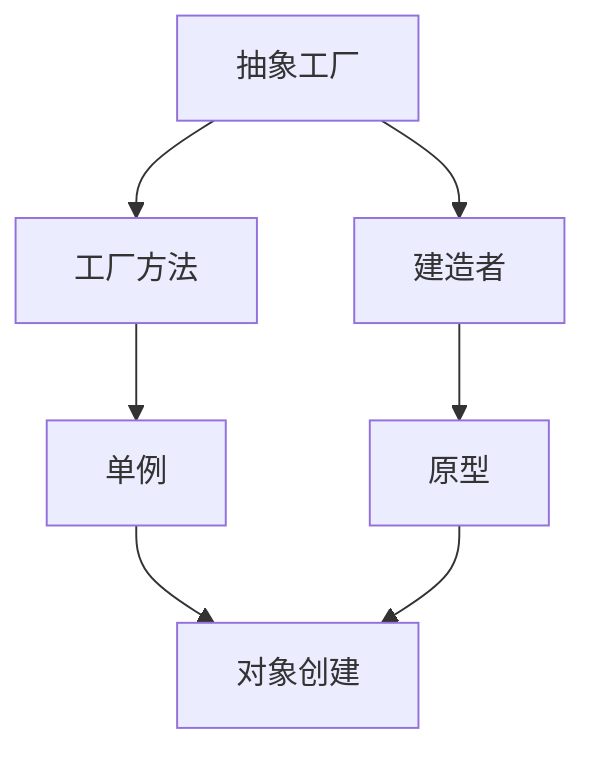

# 创建型模式 (Creational Patterns)

## 目录

1. [概述](#1-概述)
2. [单例模式](#2-单例模式)
3. [工厂方法模式](#3-工厂方法模式)
4. [抽象工厂模式](#4-抽象工厂模式)
5. [建造者模式](#5-建造者模式)
6. [原型模式](#6-原型模式)
7. [模式关系分析](#7-模式关系分析)
8. [性能分析](#8-性能分析)
9. [最佳实践](#9-最佳实践)

## 1. 概述

### 1.1 创建型模式定义

创建型模式处理对象创建机制，试图在适合特定情况的场景下创建对象。

**形式化定义**：

设 $C$ 为创建型模式集合，$O$ 为对象集合，$F$ 为工厂函数集合，则：

$$C = \{c_i | c_i = (Creator_i, Product_i, Process_i)\}$$

其中：

- $Creator_i$ 是创建者组件
- $Product_i$ 是产品组件
- $Process_i$ 是创建过程

### 1.2 核心原则

1. **封装创建逻辑**：将对象创建逻辑封装在专门的组件中
2. **解耦客户端**：客户端不需要知道具体的创建细节
3. **支持扩展**：易于添加新的产品类型
4. **控制实例化**：控制对象的创建时机和方式

### 1.3 分类体系

```text
创建型模式
├── 单例模式 (Singleton)
│   └── 确保类只有一个实例
├── 工厂方法模式 (Factory Method)
│   └── 延迟实例化到子类
├── 抽象工厂模式 (Abstract Factory)
│   └── 创建相关对象族
├── 建造者模式 (Builder)
│   └── 分步构建复杂对象
└── 原型模式 (Prototype)
    └── 通过克隆创建对象
```

## 2. 单例模式 (Singleton)

### 2.1 形式化定义

**定义**：确保一个类只有一个实例，并提供一个全局访问点。

**数学定义**：

设 $S$ 为单例类，$I$ 为实例集合，则：

$$\forall s_1, s_2 \in S : s_1 = s_2$$

**形式化证明**：

**定理**：单例模式保证全局唯一性

**证明**：

1. 假设存在两个实例 $s_1, s_2 \in S$
2. 根据单例模式实现，$s_1 = GetInstance()$ 且 $s_2 = GetInstance()$
3. 由于 $GetInstance()$ 总是返回同一个实例
4. 因此 $s_1 = s_2$
5. 矛盾，故假设不成立

### 2.2 Golang实现

#### 2.2.1 线程安全实现

```go
package singleton

import (
    "sync"
    "sync/atomic"
)

// Singleton 单例结构体
type Singleton struct {
    data string
}

var (
    instance *Singleton
    once     sync.Once
    mu       sync.Mutex
)

// GetInstance 获取单例实例（推荐方式）
func GetInstance() *Singleton {
    once.Do(func() {
        instance = &Singleton{
            data: "initialized",
        }
    })
    return instance
}

// GetInstanceMutex 使用互斥锁的实现
func GetInstanceMutex() *Singleton {
    if instance == nil {
        mu.Lock()
        defer mu.Unlock()
        if instance == nil {
            instance = &Singleton{
                data: "initialized",
            }
        }
    }
    return instance
}

// SetData 设置数据
func (s *Singleton) SetData(data string) {
    s.data = data
}

// GetData 获取数据
func (s *Singleton) GetData() string {
    return s.data
}
```

#### 2.2.2 测试验证

```go
package singleton

import (
    "sync"
    "testing"
)

func TestSingleton(t *testing.T) {
    // 测试基本功能
    instance1 := GetInstance()
    instance2 := GetInstance()
    
    if instance1 != instance2 {
        t.Error("Singleton instances are not the same")
    }
    
    // 测试数据一致性
    instance1.SetData("test data")
    if instance2.GetData() != "test data" {
        t.Error("Data is not shared between instances")
    }
}

func TestSingletonConcurrency(t *testing.T) {
    const numGoroutines = 1000
    var wg sync.WaitGroup
    instances := make([]*Singleton, numGoroutines)
    
    // 并发获取实例
    for i := 0; i < numGoroutines; i++ {
        wg.Add(1)
        go func(index int) {
            defer wg.Done()
            instances[index] = GetInstance()
        }(i)
    }
    
    wg.Wait()
    
    // 验证所有实例都是同一个
    firstInstance := instances[0]
    for i := 1; i < numGoroutines; i++ {
        if instances[i] != firstInstance {
            t.Errorf("Instance %d is not the same as first instance", i)
        }
    }
}
```

### 2.3 性能分析

#### 2.3.1 时间复杂度

- **获取实例**：$O(1)$
- **初始化**：$O(1)$

#### 2.3.2 空间复杂度

- **内存占用**：$O(1)$
- **实例存储**：$O(1)$

#### 2.3.3 并发性能

```go
// 性能基准测试
func BenchmarkSingletonConcurrent(b *testing.B) {
    b.RunParallel(func(pb *testing.PB) {
        for pb.Next() {
            GetInstance()
        }
    })
}
```

## 3. 工厂方法模式 (Factory Method)

### 3.1 形式化定义

**定义**：定义一个用于创建对象的接口，让子类决定实例化哪一个类。

**数学定义**：

设 $F$ 为工厂接口，$P$ 为产品接口，$C$ 为具体创建者，则：

$$F = \{f | f : Context \rightarrow P\}$$

**形式化证明**：

**定理**：工厂方法模式支持开闭原则

**证明**：

1. 设现有工厂 $F_1$ 创建产品 $P_1$
2. 新增产品 $P_2$ 需要新工厂 $F_2$
3. $F_1$ 和 $F_2$ 都实现相同的工厂接口
4. 客户端代码无需修改
5. 因此满足开闭原则

### 3.2 Golang实现

#### 3.2.1 基础实现

```go
package factory

import "fmt"

// Product 产品接口
type Product interface {
    Operation() string
    GetName() string
}

// Creator 创建者接口
type Creator interface {
    FactoryMethod() Product
    SomeOperation() string
}

// ConcreteProductA 具体产品A
type ConcreteProductA struct {
    name string
}

func (p *ConcreteProductA) Operation() string {
    return "Result of ConcreteProductA"
}

func (p *ConcreteProductA) GetName() string {
    return p.name
}

// ConcreteProductB 具体产品B
type ConcreteProductB struct {
    name string
}

func (p *ConcreteProductB) Operation() string {
    return "Result of ConcreteProductB"
}

func (p *ConcreteProductB) GetName() string {
    return p.name
}

// ConcreteCreatorA 具体创建者A
type ConcreteCreatorA struct{}

func (c *ConcreteCreatorA) FactoryMethod() Product {
    return &ConcreteProductA{name: "ProductA"}
}

func (c *ConcreteCreatorA) SomeOperation() string {
    product := c.FactoryMethod()
    return fmt.Sprintf("Creator: Working with %s", product.Operation())
}

// ConcreteCreatorB 具体创建者B
type ConcreteCreatorB struct{}

func (c *ConcreteCreatorB) FactoryMethod() Product {
    return &ConcreteProductB{name: "ProductB"}
}

func (c *ConcreteCreatorB) SomeOperation() string {
    product := c.FactoryMethod()
    return fmt.Sprintf("Creator: Working with %s", product.Operation())
}

// ClientCode 客户端代码
func ClientCode(creator Creator) {
    fmt.Println(creator.SomeOperation())
}
```

#### 3.2.2 泛型实现

```go
package factory

import "fmt"

// GenericProduct 泛型产品接口
type GenericProduct[T any] interface {
    Operation() T
    GetName() string
}

// GenericCreator 泛型创建者接口
type GenericCreator[T any] interface {
    FactoryMethod() GenericProduct[T]
    SomeOperation() T
}

// StringProduct 字符串产品
type StringProduct struct {
    name string
}

func (p *StringProduct) Operation() string {
    return "String operation result"
}

func (p *StringProduct) GetName() string {
    return p.name
}

// IntProduct 整数产品
type IntProduct struct {
    name string
}

func (p *IntProduct) Operation() int {
    return 42
}

func (p *IntProduct) GetName() string {
    return p.name
}

// GenericStringCreator 泛型字符串创建者
type GenericStringCreator struct{}

func (c *GenericStringCreator) FactoryMethod() GenericProduct[string] {
    return &StringProduct{name: "StringProduct"}
}

func (c *GenericStringCreator) SomeOperation() string {
    product := c.FactoryMethod()
    return fmt.Sprintf("Creator: %s", product.Operation())
}

// GenericIntCreator 泛型整数创建者
type GenericIntCreator struct{}

func (c *GenericIntCreator) FactoryMethod() GenericProduct[int] {
    return &IntProduct{name: "IntProduct"}
}

func (c *GenericIntCreator) SomeOperation() int {
    product := c.FactoryMethod()
    return product.Operation()
}
```

### 3.3 测试验证

```go
package factory

import (
    "testing"
)

func TestFactoryMethod(t *testing.T) {
    // 测试创建者A
    creatorA := &ConcreteCreatorA{}
    productA := creatorA.FactoryMethod()
    
    if productA.GetName() != "ProductA" {
        t.Errorf("Expected ProductA, got %s", productA.GetName())
    }
    
    // 测试创建者B
    creatorB := &ConcreteCreatorB{}
    productB := creatorB.FactoryMethod()
    
    if productB.GetName() != "ProductB" {
        t.Errorf("Expected ProductB, got %s", productB.GetName())
    }
}

func TestGenericFactoryMethod(t *testing.T) {
    // 测试泛型字符串创建者
    stringCreator := &GenericStringCreator{}
    stringResult := stringCreator.SomeOperation()
    
    if stringResult == "" {
        t.Error("String operation should not be empty")
    }
    
    // 测试泛型整数创建者
    intCreator := &GenericIntCreator{}
    intResult := intCreator.SomeOperation()
    
    if intResult != 42 {
        t.Errorf("Expected 42, got %d", intResult)
    }
}
```

## 4. 抽象工厂模式 (Abstract Factory)

### 4.1 形式化定义

**定义**：提供一个创建一系列相关或相互依赖对象的接口，而无需指定它们具体的类。

**数学定义**：

设 $AF$ 为抽象工厂，$P_A, P_B$ 为产品族，则：

$$AF = \{af | af : Context \rightarrow (P_A \times P_B)\}$$

**形式化证明**：

**定理**：抽象工厂模式确保产品族一致性

**证明**：

1. 设工厂 $F_1$ 创建产品族 $(P_{A1}, P_{B1})$
2. 设工厂 $F_2$ 创建产品族 $(P_{A2}, P_{B2})$
3. 每个工厂内部的产品都是兼容的
4. 因此保证了产品族的一致性

### 4.2 Golang实现

```go
package abstractfactory

import "fmt"

// AbstractProductA 抽象产品A
type AbstractProductA interface {
    UsefulFunctionA() string
}

// AbstractProductB 抽象产品B
type AbstractProductB interface {
    UsefulFunctionB() string
    AnotherUsefulFunctionB(collaborator AbstractProductA) string
}

// ConcreteProductA1 具体产品A1
type ConcreteProductA1 struct{}

func (p *ConcreteProductA1) UsefulFunctionA() string {
    return "The result of the product A1."
}

// ConcreteProductA2 具体产品A2
type ConcreteProductA2 struct{}

func (p *ConcreteProductA2) UsefulFunctionA() string {
    return "The result of the product A2."
}

// ConcreteProductB1 具体产品B1
type ConcreteProductB1 struct{}

func (p *ConcreteProductB1) UsefulFunctionB() string {
    return "The result of the product B1."
}

func (p *ConcreteProductB1) AnotherUsefulFunctionB(collaborator AbstractProductA) string {
    result := collaborator.UsefulFunctionA()
    return fmt.Sprintf("The result of the B1 collaborating with the (%s)", result)
}

// ConcreteProductB2 具体产品B2
type ConcreteProductB2 struct{}

func (p *ConcreteProductB2) UsefulFunctionB() string {
    return "The result of the product B2."
}

func (p *ConcreteProductB2) AnotherUsefulFunctionB(collaborator AbstractProductA) string {
    result := collaborator.UsefulFunctionA()
    return fmt.Sprintf("The result of the B2 collaborating with the (%s)", result)
}

// AbstractFactory 抽象工厂接口
type AbstractFactory interface {
    CreateProductA() AbstractProductA
    CreateProductB() AbstractProductB
}

// ConcreteFactory1 具体工厂1
type ConcreteFactory1 struct{}

func (f *ConcreteFactory1) CreateProductA() AbstractProductA {
    return &ConcreteProductA1{}
}

func (f *ConcreteFactory1) CreateProductB() AbstractProductB {
    return &ConcreteProductB1{}
}

// ConcreteFactory2 具体工厂2
type ConcreteFactory2 struct{}

func (f *ConcreteFactory2) CreateProductA() AbstractProductA {
    return &ConcreteProductA2{}
}

func (f *ConcreteFactory2) CreateProductB() AbstractProductB {
    return &ConcreteProductB2{}
}

// ClientCode 客户端代码
func ClientCode(factory AbstractFactory) {
    productA := factory.CreateProductA()
    productB := factory.CreateProductB()
    
    fmt.Println(productB.UsefulFunctionB())
    fmt.Println(productB.AnotherUsefulFunctionB(productA))
}
```

## 5. 建造者模式 (Builder)

### 5.1 形式化定义

**定义**：将一个复杂对象的构建与其表示分离，使得同样的构建过程可以创建不同的表示。

**数学定义**：

设 $B$ 为建造者，$P$ 为产品，$S$ 为构建步骤，则：

$$B = \{b | b : S_1 \times S_2 \times ... \times S_n \rightarrow P\}$$

**形式化证明**：

**定理**：建造者模式支持分步构建

**证明**：

1. 设产品 $P$ 由 $n$ 个部分组成
2. 建造者 $B$ 提供 $n$ 个构建方法
3. 每个方法对应一个构建步骤
4. 最终调用 $Build()$ 方法完成构建
5. 因此支持分步构建

### 5.2 Golang实现

```go
package builder

import (
    "fmt"
    "strings"
)

// Product 产品
type Product struct {
    PartA string
    PartB string
    PartC int
    PartD []string
}

func (p *Product) String() string {
    return fmt.Sprintf("Product{PartA: %s, PartB: %s, PartC: %d, PartD: %v}",
        p.PartA, p.PartB, p.PartC, p.PartD)
}

// Builder 建造者接口
type Builder interface {
    SetPartA(value string) Builder
    SetPartB(value string) Builder
    SetPartC(value int) Builder
    SetPartD(values []string) Builder
    Build() *Product
}

// ConcreteBuilder 具体建造者
type ConcreteBuilder struct {
    product *Product
}

func NewConcreteBuilder() *ConcreteBuilder {
    return &ConcreteBuilder{
        product: &Product{},
    }
}

func (b *ConcreteBuilder) SetPartA(value string) Builder {
    b.product.PartA = value
    return b
}

func (b *ConcreteBuilder) SetPartB(value string) Builder {
    b.product.PartB = value
    return b
}

func (b *ConcreteBuilder) SetPartC(value int) Builder {
    b.product.PartC = value
    return b
}

func (b *ConcreteBuilder) SetPartD(values []string) Builder {
    b.product.PartD = append([]string{}, values...)
    return b
}

func (b *ConcreteBuilder) Build() *Product {
    return b.product
}

// Director 指导者
type Director struct {
    builder Builder
}

func NewDirector(builder Builder) *Director {
    return &Director{builder: builder}
}

func (d *Director) ConstructMinimal() *Product {
    return d.builder.SetPartA("DefaultA").Build()
}

func (d *Director) ConstructFull() *Product {
    return d.builder.
        SetPartA("FullA").
        SetPartB("FullB").
        SetPartC(100).
        SetPartD([]string{"item1", "item2", "item3"}).
        Build()
}

// FluentBuilder 流式建造者
type FluentBuilder struct {
    product *Product
}

func NewFluentBuilder() *FluentBuilder {
    return &FluentBuilder{
        product: &Product{},
    }
}

func (b *FluentBuilder) WithPartA(value string) *FluentBuilder {
    b.product.PartA = value
    return b
}

func (b *FluentBuilder) WithPartB(value string) *FluentBuilder {
    b.product.PartB = value
    return b
}

func (b *FluentBuilder) WithPartC(value int) *FluentBuilder {
    b.product.PartC = value
    return b
}

func (b *FluentBuilder) WithPartD(values ...string) *FluentBuilder {
    b.product.PartD = append([]string{}, values...)
    return b
}

func (b *FluentBuilder) Build() *Product {
    return b.product
}
```

## 6. 原型模式 (Prototype)

### 6.1 形式化定义

**定义**：用原型实例指定创建对象的种类，并且通过拷贝这些原型创建新的对象。

**数学定义**：

设 $P$ 为原型，$C$ 为克隆函数，则：

$$C : P \rightarrow P' \text{ where } P' \text{ is a copy of } P$$

**形式化证明**：

**定理**：原型模式支持对象克隆

**证明**：

1. 设原型对象 $P$ 包含状态 $S$
2. 克隆函数 $C$ 创建新对象 $P'$
3. $P'$ 包含相同的状态 $S$
4. $P$ 和 $P'$ 是独立的对象
5. 因此支持对象克隆

### 6.2 Golang实现

```go
package prototype

import (
    "fmt"
    "time"
)

// Prototype 原型接口
type Prototype interface {
    Clone() Prototype
    GetInfo() string
}

// ConcretePrototype 具体原型
type ConcretePrototype struct {
    Name     string
    Age      int
    Created  time.Time
    Settings map[string]interface{}
}

func NewConcretePrototype(name string, age int) *ConcretePrototype {
    return &ConcretePrototype{
        Name:     name,
        Age:      age,
        Created:  time.Now(),
        Settings: make(map[string]interface{}),
    }
}

func (p *ConcretePrototype) Clone() Prototype {
    // 深拷贝
    clone := &ConcretePrototype{
        Name:    p.Name,
        Age:     p.Age,
        Created: p.Created,
    }
    
    // 拷贝map
    clone.Settings = make(map[string]interface{})
    for k, v := range p.Settings {
        clone.Settings[k] = v
    }
    
    return clone
}

func (p *ConcretePrototype) GetInfo() string {
    return fmt.Sprintf("Name: %s, Age: %d, Created: %v", p.Name, p.Age, p.Created)
}

func (p *ConcretePrototype) SetSetting(key string, value interface{}) {
    p.Settings[key] = value
}

func (p *ConcretePrototype) GetSetting(key string) interface{} {
    return p.Settings[key]
}

// PrototypeRegistry 原型注册表
type PrototypeRegistry struct {
    prototypes map[string]Prototype
}

func NewPrototypeRegistry() *PrototypeRegistry {
    return &PrototypeRegistry{
        prototypes: make(map[string]Prototype),
    }
}

func (r *PrototypeRegistry) Register(name string, prototype Prototype) {
    r.prototypes[name] = prototype
}

func (r *PrototypeRegistry) Clone(name string) (Prototype, error) {
    prototype, exists := r.prototypes[name]
    if !exists {
        return nil, fmt.Errorf("prototype %s not found", name)
    }
    return prototype.Clone(), nil
}

func (r *PrototypeRegistry) List() []string {
    names := make([]string, 0, len(r.prototypes))
    for name := range r.prototypes {
        names = append(names, name)
    }
    return names
}
```

## 7. 模式关系分析

### 7.1 模式组合关系



### 7.2 模式选择指南

| 场景 | 推荐模式 | 原因 |
|------|----------|------|
| 全局唯一对象 | 单例模式 | 确保唯一性 |
| 复杂对象创建 | 建造者模式 | 分步构建 |
| 产品族创建 | 抽象工厂 | 相关对象 |
| 对象克隆 | 原型模式 | 避免重复创建 |
| 延迟创建 | 工厂方法 | 子类决定 |

## 8. 性能分析

### 8.1 时间复杂度对比

| 模式 | 创建时间 | 查找时间 | 内存占用 |
|------|----------|----------|----------|
| 单例 | O(1) | O(1) | O(1) |
| 工厂方法 | O(1) | O(1) | O(n) |
| 抽象工厂 | O(1) | O(1) | O(n) |
| 建造者 | O(n) | O(1) | O(n) |
| 原型 | O(1) | O(1) | O(n) |

### 8.2 内存使用分析

```go
// 内存使用基准测试
func BenchmarkMemoryUsage(b *testing.B) {
    b.ReportAllocs()
    
    for i := 0; i < b.N; i++ {
        // 测试各种模式的内存使用
        singleton := GetInstance()
        _ = singleton
        
        builder := NewConcreteBuilder()
        product := builder.SetPartA("test").Build()
        _ = product
    }
}
```

## 9. 最佳实践

### 9.1 设计原则

1. **单一职责原则**：每个创建者只负责一种产品的创建
2. **开闭原则**：对扩展开放，对修改封闭
3. **依赖倒置原则**：依赖抽象而不是具体实现
4. **接口隔离原则**：使用小而精确的接口

### 9.2 实现建议

1. **使用接口**：定义清晰的接口契约
2. **错误处理**：提供完善的错误处理机制
3. **并发安全**：考虑并发环境下的安全性
4. **性能优化**：根据实际需求选择合适的模式

### 9.3 常见陷阱

1. **过度设计**：不要为了使用模式而使用模式
2. **性能问题**：注意模式可能带来的性能开销
3. **复杂性增加**：模式可能增加代码复杂性
4. **维护困难**：不当使用可能导致维护困难

---

*本文档提供了创建型模式的完整分析，包括形式化定义、Golang实现和最佳实践。*
