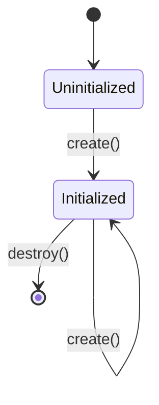
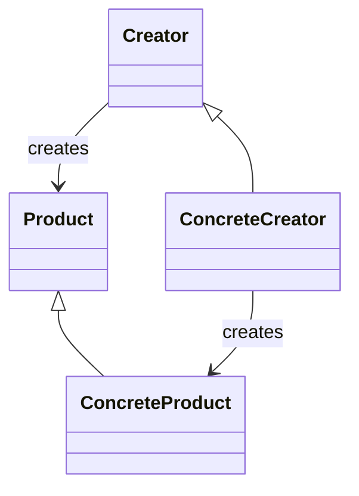

# 11.5.1 创建型设计模式分析

<!-- TOC START -->
- [11.5.1 创建型设计模式分析](#创建型设计模式分析)
  - [11.5.1.1 目录](#目录)
  - [11.5.1.2 1. 概述](#1-概述)
    - [11.5.1.2.1 创建型模式分类](#创建型模式分类)
    - [11.5.1.2.2 核心特征](#核心特征)
  - [11.5.1.3 2. 创建型模式形式化定义](#2-创建型模式形式化定义)
    - [11.5.1.3.1 创建型模式系统定义](#创建型模式系统定义)
    - [11.5.1.3.2 创建过程形式化定义](#创建过程形式化定义)
  - [11.5.1.4 3. 单例模式 (Singleton)](#3-单例模式-singleton)
    - [11.5.1.4.1 形式化定义](#形式化定义)
    - [11.5.1.4.2 Golang实现](#golang实现)
      - [11.5.1.4.2.1 线程安全单例](#线程安全单例)
      - [11.5.1.4.2.2 延迟初始化单例](#延迟初始化单例)
    - [11.5.1.4.3 性能分析](#性能分析)
  - [11.5.1.5 4. 工厂方法模式 (Factory Method)](#4-工厂方法模式-factory-method)
    - [11.5.1.5.1 形式化定义](#形式化定义)
    - [11.5.1.5.2 Golang实现](#golang实现)
    - [11.5.1.5.3 性能分析](#性能分析)
  - [11.5.1.6 5. 抽象工厂模式 (Abstract Factory)](#5-抽象工厂模式-abstract-factory)
    - [11.5.1.6.1 形式化定义](#形式化定义)
    - [11.5.1.6.2 Golang实现](#golang实现)
    - [11.5.1.6.3 性能分析](#性能分析)
  - [11.5.1.7 6. 建造者模式 (Builder)](#6-建造者模式-builder)
    - [11.5.1.7.1 形式化定义](#形式化定义)
    - [11.5.1.7.2 Golang实现](#golang实现)
    - [11.5.1.7.3 性能分析](#性能分析)
  - [11.5.1.8 7. 原型模式 (Prototype)](#7-原型模式-prototype)
    - [11.5.1.8.1 形式化定义](#形式化定义)
    - [11.5.1.8.2 Golang实现](#golang实现)
      - [11.5.1.8.2.1 基本实现](#基本实现)
      - [11.5.1.8.2.2 深拷贝与浅拷贝](#深拷贝与浅拷贝)
      - [11.5.1.8.2.3 原型工厂](#原型工厂)
    - [11.5.1.8.3 性能分析](#性能分析)
    - [11.5.1.8.4 Golang最佳实践](#golang最佳实践)
  - [11.5.1.9 8. 对象池模式 (Object Pool)](#8-对象池模式-object-pool)
    - [11.5.1.9.1 形式化定义](#形式化定义)
    - [11.5.1.9.2 Golang实现](#golang实现)
      - [11.5.1.9.2.1 基本实现](#基本实现)
      - [11.5.1.9.2.2 同步对象池](#同步对象池)
      - [11.5.1.9.2.3 带监控的池](#带监控的池)
    - [11.5.1.9.3 性能分析](#性能分析)
    - [11.5.1.9.4 Golang最佳实践](#golang最佳实践)
  - [11.5.1.10 9. 性能分析与最佳实践](#9-性能分析与最佳实践)
    - [11.5.1.10.1 性能对比](#性能对比)
    - [11.5.1.10.2 最佳实践](#最佳实践)
      - [11.5.1.10.2.1 线程安全](#线程安全)
      - [11.5.1.10.2.2 错误处理](#错误处理)
      - [11.5.1.10.2.3 资源管理](#资源管理)
    - [11.5.1.10.3 性能优化建议](#性能优化建议)
  - [11.5.1.11 10. 参考文献](#10-参考文献)
<!-- TOC END -->

## 11.5.1.1 目录

1. [概述](#1-概述)
2. [创建型模式形式化定义](#2-创建型模式形式化定义)
3. [单例模式 (Singleton)](#3-单例模式-singleton)
4. [工厂方法模式 (Factory Method)](#4-工厂方法模式-factory-method)
5. [抽象工厂模式 (Abstract Factory)](#5-抽象工厂模式-abstract-factory)
6. [建造者模式 (Builder)](#6-建造者模式-builder)
7. [原型模式 (Prototype)](#7-原型模式-prototype)
8. [对象池模式 (Object Pool)](#8-对象池模式-object-pool)
9. [性能分析与最佳实践](#9-性能分析与最佳实践)
10. [参考文献](#10-参考文献)

---

## 11.5.1.2 1. 概述

创建型模式关注对象的创建过程，提供灵活的创建机制，支持对象复用和缓存。在Golang中，创建型模式通过接口、结构体和函数实现，充分利用Go语言的简洁性和并发特性。

### 11.5.1.2.1 创建型模式分类

创建型模式集合可以形式化定义为：

$$C_{cre} = \{Singleton, FactoryMethod, AbstractFactory, Builder, Prototype, ObjectPool\}$$

### 11.5.1.2.2 核心特征

- **封装创建逻辑**: 将对象创建逻辑封装在专门的组件中
- **提供灵活性**: 支持运行时选择创建策略
- **支持复用**: 通过对象池等模式支持对象复用
- **控制实例**: 控制对象的创建数量和生命周期

---

## 11.5.1.3 2. 创建型模式形式化定义

### 11.5.1.3.1 创建型模式系统定义

创建型模式系统可以定义为五元组：

$$\mathcal{CP} = (P_{cre}, I_{cre}, F_{cre}, E_{cre}, Q_{cre})$$

其中：

- **$P_{cre}$** - 创建型模式集合
- **$I_{cre}$** - 创建接口集合
- **$F_{cre}$** - 工厂函数集合
- **$E_{cre}$** - 评估指标集合
- **$Q_{cre}$** - 质量保证集合

### 11.5.1.3.2 创建过程形式化定义

创建过程可以定义为状态转换系统：

$$\mathcal{C} = (S, \Sigma, \delta, s_0, F)$$

其中：

- **$S$** - 状态集合：$\{Initial, Creating, Validating, Finalizing, Ready\}$
- **$\Sigma$** - 输入字母表：$\{create, validate, finalize, error\}$
- **$\delta$** - 状态转换函数
- **$s_0$** - 初始状态：$Initial$
- **$F$** - 接受状态：$\{Ready\}$

---

## 11.5.1.4 3. 单例模式 (Singleton)

### 11.5.1.4.1 形式化定义

单例模式确保一个类只有一个实例，并提供全局访问点。

**数学定义**:
$$\forall x, y \in Instance(Singleton) : x = y$$

**状态机定义**:



### 11.5.1.4.2 Golang实现

#### 11.5.1.4.2.1 线程安全单例

```go
package singleton

import (
    "sync"
    "time"
)

// Logger 单例接口
type Logger interface {
    Log(level, message string)
    SetLevel(level string)
    GetLevel() string
}

// ConcreteLogger 具体日志实现
type ConcreteLogger struct {
    level string
    mu    sync.RWMutex
}

var (
    instance *ConcreteLogger
    once     sync.Once
)

// GetInstance 获取单例实例
func GetInstance() Logger {
    once.Do(func() {
        instance = &ConcreteLogger{
            level: "INFO",
        }
    })
    return instance
}

// Log 记录日志
func (l *ConcreteLogger) Log(level, message string) {
    l.mu.RLock()
    defer l.mu.RUnlock()
    
    timestamp := time.Now().Format("2006-01-02 15:04:05")
    fmt.Printf("[%s] [%s] %s: %s\n", timestamp, l.level, level, message)
}

// SetLevel 设置日志级别
func (l *ConcreteLogger) SetLevel(level string) {
    l.mu.Lock()
    defer l.mu.Unlock()
    l.level = level
}

// GetLevel 获取日志级别
func (l *ConcreteLogger) GetLevel() string {
    l.mu.RLock()
    defer l.mu.RUnlock()
    return l.level
}

```

#### 11.5.1.4.2.2 延迟初始化单例

```go
package singleton

import (
    "sync"
    "sync/atomic"
)

// LazySingleton 延迟初始化单例
type LazySingleton struct {
    data map[string]interface{}
    mu   sync.RWMutex
}

var (
    lazyInstance *LazySingleton
    lazyOnce     sync.Once
    initialized  int32
)

// GetLazyInstance 获取延迟初始化单例
func GetLazyInstance() *LazySingleton {
    if atomic.LoadInt32(&initialized) == 0 {
        lazyOnce.Do(func() {
            lazyInstance = &LazySingleton{
                data: make(map[string]interface{}),
            }
            atomic.StoreInt32(&initialized, 1)
        })
    }
    return lazyInstance
}

// Set 设置数据
func (l *LazySingleton) Set(key string, value interface{}) {
    l.mu.Lock()
    defer l.mu.Unlock()
    l.data[key] = value
}

// Get 获取数据
func (l *LazySingleton) Get(key string) (interface{}, bool) {
    l.mu.RLock()
    defer l.mu.RUnlock()
    value, exists := l.data[key]
    return value, exists
}

```

### 11.5.1.4.3 性能分析

**时间复杂度**: $O(1)$ - 获取实例的时间复杂度为常数
**空间复杂度**: $O(1)$ - 只占用一个实例的内存空间
**线程安全**: 使用 `sync.Once` 保证线程安全
**内存使用**: 最小化内存占用，避免重复创建

---

## 11.5.1.5 4. 工厂方法模式 (Factory Method)

### 11.5.1.5.1 形式化定义

工厂方法模式定义一个用于创建对象的接口，让子类决定实例化哪一个类。

**数学定义**:
$$FactoryMethod : ProductType \rightarrow Product$$

**类图关系**:



### 11.5.1.5.2 Golang实现

```go
package factory_method

import (
    "fmt"
    "time"
)

// Product 产品接口
type Product interface {
    Use() string
    GetName() string
}

// Creator 创建者接口
type Creator interface {
    CreateProduct() Product
    SomeOperation() string
}

// ConcreteProductA 具体产品A
type ConcreteProductA struct {
    name string
}

func (p *ConcreteProductA) Use() string {
    return fmt.Sprintf("Using %s", p.name)
}

func (p *ConcreteProductA) GetName() string {
    return p.name
}

// ConcreteProductB 具体产品B
type ConcreteProductB struct {
    name string
}

func (p *ConcreteProductB) Use() string {
    return fmt.Sprintf("Using %s", p.name)
}

func (p *ConcreteProductB) GetName() string {
    return p.name
}

// ConcreteCreatorA 具体创建者A
type ConcreteCreatorA struct{}

func (c *ConcreteCreatorA) CreateProduct() Product {
    return &ConcreteProductA{
        name: "Product A",
    }
}

func (c *ConcreteCreatorA) SomeOperation() string {
    product := c.CreateProduct()
    return fmt.Sprintf("Creator A: %s", product.Use())
}

// ConcreteCreatorB 具体创建者B
type ConcreteCreatorB struct{}

func (c *ConcreteCreatorB) CreateProduct() Product {
    return &ConcreteProductB{
        name: "Product B",
    }
}

func (c *ConcreteCreatorB) SomeOperation() string {
    product := c.CreateProduct()
    return fmt.Sprintf("Creator B: %s", product.Use())
}

// FactoryMethod 工厂方法函数
func FactoryMethod(productType string) Creator {
    switch productType {
    case "A":
        return &ConcreteCreatorA{}
    case "B":
        return &ConcreteCreatorB{}
    default:
        return &ConcreteCreatorA{}
    }
}

```

### 11.5.1.5.3 性能分析

**时间复杂度**: $O(1)$ - 创建产品的时间复杂度为常数
**空间复杂度**: $O(1)$ - 每个产品实例占用固定空间
**扩展性**: 易于添加新的产品类型
**耦合度**: 降低创建者和产品的耦合

---

## 11.5.1.6 5. 抽象工厂模式 (Abstract Factory)

### 11.5.1.6.1 形式化定义

抽象工厂模式创建一个相关或依赖对象的家族，而不需指定具体类。

**数学定义**:
$$AbstractFactory : FamilyType \rightarrow ProductFamily$$

其中 $ProductFamily = \{Product_1, Product_2, ..., Product_n\}$

### 11.5.1.6.2 Golang实现

```go
package abstract_factory

import (
    "fmt"
)

// AbstractProductA 抽象产品A
type AbstractProductA interface {
    UseA() string
}

// AbstractProductB 抽象产品B
type AbstractProductB interface {
    UseB() string
    InteractWithA(a AbstractProductA) string
}

// AbstractFactory 抽象工厂
type AbstractFactory interface {
    CreateProductA() AbstractProductA
    CreateProductB() AbstractProductB
}

// ConcreteProductA1 具体产品A1
type ConcreteProductA1 struct{}

func (p *ConcreteProductA1) UseA() string {
    return "Product A1"
}

// ConcreteProductB1 具体产品B1
type ConcreteProductB1 struct{}

func (p *ConcreteProductB1) UseB() string {
    return "Product B1"
}

func (p *ConcreteProductB1) InteractWithA(a AbstractProductA) string {
    return fmt.Sprintf("B1 interacts with %s", a.UseA())
}

// ConcreteProductA2 具体产品A2
type ConcreteProductA2 struct{}

func (p *ConcreteProductA2) UseA() string {
    return "Product A2"
}

// ConcreteProductB2 具体产品B2
type ConcreteProductB2 struct{}

func (p *ConcreteProductB2) UseB() string {
    return "Product B2"
}

func (p *ConcreteProductB2) InteractWithA(a AbstractProductA) string {
    return fmt.Sprintf("B2 interacts with %s", a.UseA())
}

// ConcreteFactory1 具体工厂1
type ConcreteFactory1 struct{}

func (f *ConcreteFactory1) CreateProductA() AbstractProductA {
    return &ConcreteProductA1{}
}

func (f *ConcreteFactory1) CreateProductB() AbstractProductB {
    return &ConcreteProductB1{}
}

// ConcreteFactory2 具体工厂2
type ConcreteFactory2 struct{}

func (f *ConcreteFactory2) CreateProductA() AbstractProductA {
    return &ConcreteProductA2{}
}

func (f *ConcreteFactory2) CreateProductB() AbstractProductB {
    return &ConcreteProductB2{}
}

// Client 客户端
type Client struct {
    factory AbstractFactory
}

func NewClient(factory AbstractFactory) *Client {
    return &Client{factory: factory}
}

func (c *Client) Run() string {
    productA := c.factory.CreateProductA()
    productB := c.factory.CreateProductB()
    
    return fmt.Sprintf("%s, %s", 
        productA.UseA(), 
        productB.InteractWithA(productA))
}

```

### 11.5.1.6.3 性能分析

**时间复杂度**: $O(1)$ - 创建产品家族的时间复杂度为常数
**空间复杂度**: $O(n)$ - n为产品家族中的产品数量
**一致性**: 确保产品家族的一致性
**扩展性**: 支持添加新的产品家族

---

## 11.5.1.7 6. 建造者模式 (Builder)

### 11.5.1.7.1 形式化定义

建造者模式将一个复杂对象的构建与其表示分离，允许使用相同的构建过程创建不同的表示。

**数学定义**:
$$Builder : Configuration \rightarrow ComplexObject$$

其中 $Configuration = \{param_1, param_2, ..., param_n\}$

### 11.5.1.7.2 Golang实现

```go
package builder

import (
    "fmt"
    "strings"
)

// Product 复杂产品
type Product struct {
    partA string
    partB string
    partC string
}

func (p *Product) String() string {
    return fmt.Sprintf("Product: %s, %s, %s", p.partA, p.partB, p.partC)
}

// Builder 建造者接口
type Builder interface {
    BuildPartA()
    BuildPartB()
    BuildPartC()
    GetResult() *Product
}

// ConcreteBuilder 具体建造者
type ConcreteBuilder struct {
    product *Product
}

func NewConcreteBuilder() *ConcreteBuilder {
    return &ConcreteBuilder{
        product: &Product{},
    }
}

func (b *ConcreteBuilder) BuildPartA() {
    b.product.partA = "Part A"
}

func (b *ConcreteBuilder) BuildPartB() {
    b.product.partB = "Part B"
}

func (b *ConcreteBuilder) BuildPartC() {
    b.product.partC = "Part C"
}

func (b *ConcreteBuilder) GetResult() *Product {
    return b.product
}

// Director 指导者
type Director struct {
    builder Builder
}

func NewDirector(builder Builder) *Director {
    return &Director{builder: builder}
}

func (d *Director) Construct() *Product {
    d.builder.BuildPartA()
    d.builder.BuildPartB()
    d.builder.BuildPartC()
    return d.builder.GetResult()
}

// 函数式建造者
type FunctionalBuilder struct {
    product *Product
}

func NewFunctionalBuilder() *FunctionalBuilder {
    return &FunctionalBuilder{
        product: &Product{},
    }
}

func (b *FunctionalBuilder) WithPartA(partA string) *FunctionalBuilder {
    b.product.partA = partA
    return b
}

func (b *FunctionalBuilder) WithPartB(partB string) *FunctionalBuilder {
    b.product.partB = partB
    return b
}

func (b *FunctionalBuilder) WithPartC(partC string) *FunctionalBuilder {
    b.product.partC = partC
    return b
}

func (b *FunctionalBuilder) Build() *Product {
    return b.product
}

```

### 11.5.1.7.3 性能分析

**时间复杂度**: $O(n)$ - n为构建步骤的数量
**空间复杂度**: $O(1)$ - 只占用一个产品实例的空间
**灵活性**: 支持不同的构建顺序和配置
**可读性**: 函数式建造者提供更清晰的API

---

## 11.5.1.8 7. 原型模式 (Prototype)

### 11.5.1.8.1 形式化定义

原型模式通过复制现有的实例创建新的实例，而不是通过新建。

**数学定义**:
$$Prototype : Original \rightarrow Clone$$

其中 $Clone \approx Original$ (近似相等)

### 11.5.1.8.2 Golang实现

#### 11.5.1.8.2.1 基本实现

```go
package prototype

import (
    "fmt"
    "time"
)

// Prototype 原型接口
type Prototype interface {
    Clone() Prototype
    GetInfo() string
}

// ConcretePrototype 具体原型
type ConcretePrototype struct {
    name     string
    data     map[string]interface{}
    createAt time.Time
}

func NewConcretePrototype(name string) *ConcretePrototype {
    return &ConcretePrototype{
        name:     name,
        data:     make(map[string]interface{}),
        createAt: time.Now(),
    }
}

func (p *ConcretePrototype) Clone() Prototype {
    // 深拷贝
    cloned := &ConcretePrototype{
        name:     p.name + "_clone",
        createAt: time.Now(),
        data:     make(map[string]interface{}),
    }
    
    // 复制数据
    for k, v := range p.data {
        cloned.data[k] = v
    }
    
    return cloned
}

func (p *ConcretePrototype) GetInfo() string {
    return fmt.Sprintf("Name: %s, Created: %s, Data: %v", 
        p.name, p.createAt.Format("15:04:05"), p.data)
}

func (p *ConcretePrototype) SetData(key string, value interface{}) {
    p.data[key] = value
}

// PrototypeRegistry 原型注册表
type PrototypeRegistry struct {
    prototypes map[string]Prototype
}

func NewPrototypeRegistry() *PrototypeRegistry {
    return &PrototypeRegistry{
        prototypes: make(map[string]Prototype),
    }
}

func (r *PrototypeRegistry) Register(name string, prototype Prototype) {
    r.prototypes[name] = prototype
}

func (r *PrototypeRegistry) Clone(name string) (Prototype, error) {
    if prototype, exists := r.prototypes[name]; exists {
        return prototype.Clone(), nil
    }
    return nil, fmt.Errorf("prototype %s not found", name)
}

```

#### 11.5.1.8.2.2 深拷贝与浅拷贝

```go
package prototype

import (
    "encoding/json"
    "fmt"
)

// DeepCopyable 支持深拷贝的接口
type DeepCopyable interface {
    DeepCopy() interface{}
}

// ComplexObject 包含嵌套结构的复杂对象
type ComplexObject struct {
    ID       int
    Name     string
    Children []*ComplexObject
    Data     map[string]interface{}
    parent   *ComplexObject // 不导出字段，不会被JSON序列化
}

// 使用序列化实现深拷贝
func (c *ComplexObject) DeepCopy() interface{} {
    // 方法1: 通过JSON序列化实现深拷贝
    bytes, err := json.Marshal(c)
    if err != nil {
        return nil
    }
    
    var clone ComplexObject
    if err := json.Unmarshal(bytes, &clone); err != nil {
        return nil
    }
    
    return &clone
}

// 手动实现深拷贝
func (c *ComplexObject) ManualDeepCopy() *ComplexObject {
    if c == nil {
        return nil
    }
    
    clone := &ComplexObject{
        ID:       c.ID,
        Name:     c.Name,
        Children: make([]*ComplexObject, len(c.Children)),
        Data:     make(map[string]interface{}),
    }
    
    // 复制子对象
    for i, child := range c.Children {
        clone.Children[i] = child.ManualDeepCopy()
    }
    
    // 复制map
    for k, v := range c.Data {
        // 如果值是DeepCopyable接口，则调用DeepCopy
        if copyable, ok := v.(DeepCopyable); ok {
            clone.Data[k] = copyable.DeepCopy()
        } else {
            clone.Data[k] = v // 简单类型直接赋值
        }
    }
    
    return clone
}

```

#### 11.5.1.8.2.3 原型工厂

```go
package prototype

// PrototypeFactory 原型工厂
type PrototypeFactory struct {
    prototypes map[string]Prototype
}

func NewPrototypeFactory() *PrototypeFactory {
    factory := &PrototypeFactory{
        prototypes: make(map[string]Prototype),
    }
    
    // 注册默认原型
    factory.prototypes["default"] = NewConcretePrototype("default")
    
    return factory
}

func (f *PrototypeFactory) RegisterPrototype(name string, prototype Prototype) {
    f.prototypes[name] = prototype
}

func (f *PrototypeFactory) CreatePrototype(name string) (Prototype, error) {
    prototype, exists := f.prototypes[name]
    if !exists {
        return nil, fmt.Errorf("prototype %s not found", name)
    }
    return prototype.Clone(), nil
}

// 函数式原型工厂
type CloneFunc func() interface{}

type FunctionalPrototypeFactory struct {
    prototypes map[string]CloneFunc
}

func NewFunctionalPrototypeFactory() *FunctionalPrototypeFactory {
    return &FunctionalPrototypeFactory{
        prototypes: make(map[string]CloneFunc),
    }
}

func (f *FunctionalPrototypeFactory) Register(name string, cloneFunc CloneFunc) {
    f.prototypes[name] = cloneFunc
}

func (f *FunctionalPrototypeFactory) Create(name string) (interface{}, error) {
    cloneFunc, exists := f.prototypes[name]
    if !exists {
        return nil, fmt.Errorf("prototype %s not found", name)
    }
    return cloneFunc(), nil
}

```

### 11.5.1.8.3 性能分析

**时间复杂度**:

- 浅拷贝: $O(1)$
- 深拷贝: $O(n)$ - n为对象的复杂度
- JSON序列化: $O(n)$ - 但常数因子较大

**空间复杂度**: $O(n)$ - 需要复制所有数据

**内存效率**:

- 避免重复创建结构相似的对象
- 减少复杂对象初始化的成本
- 适用于对象创建成本高的场景

**拷贝策略对比**:

| 拷贝方式 | 优点 | 缺点 | 适用场景 |
|---------|------|------|---------|
| 手动深拷贝 | 性能最佳 | 实现复杂 | 高性能要求 |
| JSON序列化 | 实现简单 | 性能较差，不支持非导出字段 | 快速实现，简单对象 |
| 浅拷贝 | 性能最佳 | 可能导致共享状态 | 不可变对象 |

### 11.5.1.8.4 Golang最佳实践

1. **利用接口**:
   - 定义清晰的Clone()接口
   - 返回接口而非具体类型，支持多态

2. **处理复杂结构**:
   - 对于简单类型，直接赋值
   - 对于复合类型，需递归拷贝
   - 对于指针，需特别注意避免循环引用

3. **注意深浅拷贝**:
   - 默认优先实现深拷贝，避免状态共享
   - 针对特定性能要求场景，可选择浅拷贝

4. **Golang特有优化**:

   ```go
   // 使用reflect进行通用深拷贝
   func DeepCopy(v interface{}) interface{} {
       if v == nil {
           return nil
       }
  
       original := reflect.ValueOf(v)
       if !original.IsValid() {
           return nil
       }
  
       // 处理指针
       if original.Kind() == reflect.Ptr {
           original = original.Elem()
       }
  
       // 创建新实例
       copied := reflect.New(original.Type())
       copyRecursive(original, copied.Elem())
  
       return copied.Interface()
   }
  
   // 递归复制
   func copyRecursive(original, copied reflect.Value) {
       // ... 实现根据类型的复制逻辑
   }
   ```

5. **克隆注册表模式**:
   - 维护原型注册表
   - 支持动态注册和获取原型
   - 结合工厂模式使用

---

## 11.5.1.9 8. 对象池模式 (Object Pool)

### 11.5.1.9.1 形式化定义

对象池模式预先创建一组对象，需要时从池中获取对象，使用完毕后归还对象。

**数学定义**:
$$ObjectPool = (Pool, Acquire, Release, Validate)$$

其中：

- $Pool = \{obj_1, obj_2, ..., obj_n\}$
- $Acquire : Pool \rightarrow (obj, Pool')$
- $Release : (obj, Pool) \rightarrow Pool'$
- $Validate : obj \rightarrow bool$

### 11.5.1.9.2 Golang实现

#### 11.5.1.9.2.1 基本实现

```go
package object_pool

import (
    "fmt"
    "sync"
    "time"
)

// PoolObject 池对象接口
type PoolObject interface {
    Reset()
    IsValid() bool
    GetID() string
}

// DatabaseConnection 数据库连接
type DatabaseConnection struct {
    id        string
    isActive  bool
    lastUsed  time.Time
    mu        sync.RWMutex
}

func NewDatabaseConnection(id string) *DatabaseConnection {
    return &DatabaseConnection{
        id:       id,
        isActive: true,
        lastUsed: time.Now(),
    }
}

func (d *DatabaseConnection) Reset() {
    d.mu.Lock()
    defer d.mu.Unlock()
    d.isActive = true
    d.lastUsed = time.Now()
}

func (d *DatabaseConnection) IsValid() bool {
    d.mu.RLock()
    defer d.mu.RUnlock()
    return d.isActive && time.Since(d.lastUsed) < 5*time.Minute
}

func (d *DatabaseConnection) GetID() string {
    return d.id
}

func (d *DatabaseConnection) Close() {
    d.mu.Lock()
    defer d.mu.Unlock()
    d.isActive = false
}

// ObjectPool 对象池
type ObjectPool struct {
    objects chan PoolObject
    factory func() PoolObject
    maxSize int
    mu      sync.RWMutex
}

func NewObjectPool(factory func() PoolObject, maxSize int) *ObjectPool {
    pool := &ObjectPool{
        objects: make(chan PoolObject, maxSize),
        factory: factory,
        maxSize: maxSize,
    }
    
    // 预创建对象
    for i := 0; i < maxSize; i++ {
        pool.objects <- factory()
    }
    
    return pool
}

func (p *ObjectPool) Acquire() (PoolObject, error) {
    select {
    case obj := <-p.objects:
        if obj.IsValid() {
            return obj, nil
        }
        // 对象无效，创建新的
        return p.factory(), nil
    case <-time.After(5 * time.Second):
        return nil, fmt.Errorf("timeout waiting for object")
    }
}

func (p *ObjectPool) Release(obj PoolObject) {
    obj.Reset()
    
    select {
    case p.objects <- obj:
        // 成功放回池中
    default:
        // 池已满，丢弃对象
    }
}

func (p *ObjectPool) Close() {
    close(p.objects)
    for obj := range p.objects {
        if closer, ok := obj.(interface{ Close() }); ok {
            closer.Close()
        }
    }
}

```

#### 11.5.1.9.2.2 同步对象池

```go
package object_pool

import (
    "sync"
)

// SyncPool封装
type SyncObjectPool struct {
    pool *sync.Pool
}

func NewSyncObjectPool(factory func() interface{}) *SyncObjectPool {
    return &SyncObjectPool{
        pool: &sync.Pool{
            New: factory,
        },
    }
}

func (p *SyncObjectPool) Get() interface{} {
    return p.pool.Get()
}

func (p *SyncObjectPool) Put(obj interface{}) {
    p.pool.Put(obj)
}

// 带资源清理的对象池
type ResourcePool struct {
    pool      *sync.Pool
    resources int64
    maxRes    int64
    mu        sync.Mutex
}

func NewResourcePool(factory func() interface{}, maxResources int64) *ResourcePool {
    return &ResourcePool{
        pool: &sync.Pool{
            New: func() interface{} {
                return factory()
            },
        },
        maxRes: maxResources,
    }
}

func (p *ResourcePool) Acquire() interface{} {
    p.mu.Lock()
    defer p.mu.Unlock()
    
    if p.resources >= p.maxRes {
        // 等待资源释放
        return nil
    }
    
    p.resources++
    return p.pool.Get()
}

func (p *ResourcePool) Release(res interface{}) {
    if res == nil {
        return
    }
    
    p.mu.Lock()
    defer p.mu.Unlock()
    
    p.resources--
    p.pool.Put(res)
}

```

#### 11.5.1.9.2.3 带监控的池

```go
package object_pool

import (
    "fmt"
    "sync"
    "sync/atomic"
    "time"
)

// MetricsObjectPool 带监控的对象池
type MetricsObjectPool struct {
    resources     chan interface{}
    factory       func() interface{}
    destroyFunc   func(interface{})
    
    // 指标
    created       int64
    acquired      int64
    released      int64
    destroyed     int64
    acquireErrors int64
    
    // 计时器
    acquireTime   int64
    releaseTime   int64
    
    mu            sync.RWMutex
}

func NewMetricsObjectPool(factory func() interface{}, destroyFunc func(interface{}), size int) *MetricsObjectPool {
    pool := &MetricsObjectPool{
        resources:   make(chan interface{}, size),
        factory:     factory,
        destroyFunc: destroyFunc,
    }
    
    // 预创建对象
    for i := 0; i < size; i++ {
        obj := factory()
        atomic.AddInt64(&pool.created, 1)
        pool.resources <- obj
    }
    
    // 启动监控
    go pool.monitor()
    
    return pool
}

func (p *MetricsObjectPool) Acquire() (interface{}, error) {
    start := time.Now()
    
    select {
    case obj := <-p.resources:
        atomic.AddInt64(&p.acquired, 1)
        atomic.AddInt64(&p.acquireTime, time.Since(start).Nanoseconds())
        return obj, nil
    case <-time.After(5 * time.Second):
        atomic.AddInt64(&p.acquireErrors, 1)
        return nil, fmt.Errorf("pool exhausted")
    }
}

func (p *MetricsObjectPool) Release(obj interface{}) {
    if obj == nil {
        return
    }
    
    start := time.Now()
    
    select {
    case p.resources <- obj:
        atomic.AddInt64(&p.released, 1)
        atomic.AddInt64(&p.releaseTime, time.Since(start).Nanoseconds())
    default:
        // 池已满，销毁对象
        if p.destroyFunc != nil {
            p.destroyFunc(obj)
            atomic.AddInt64(&p.destroyed, 1)
        }
    }
}

func (p *MetricsObjectPool) GetMetrics() map[string]int64 {
    p.mu.RLock()
    defer p.mu.RUnlock()
    
    return map[string]int64{
        "created":       atomic.LoadInt64(&p.created),
        "acquired":      atomic.LoadInt64(&p.acquired),
        "released":      atomic.LoadInt64(&p.released),
        "destroyed":     atomic.LoadInt64(&p.destroyed),
        "acquireErrors": atomic.LoadInt64(&p.acquireErrors),
        "availableNow":  int64(len(p.resources)),
    }
}

func (p *MetricsObjectPool) GetLatencies() (acquireMs, releaseMs float64) {
    acquired := atomic.LoadInt64(&p.acquired)
    released := atomic.LoadInt64(&p.released)
    
    if acquired > 0 {
        acquireMs = float64(atomic.LoadInt64(&p.acquireTime)) / float64(acquired) / float64(time.Millisecond)
    }
    
    if released > 0 {
        releaseMs = float64(atomic.LoadInt64(&p.releaseTime)) / float64(released) / float64(time.Millisecond)
    }
    
    return
}

func (p *MetricsObjectPool) monitor() {
    ticker := time.NewTicker(1 * time.Minute)
    defer ticker.Stop()
    
    for range ticker.C {
        metrics := p.GetMetrics()
        acquireMs, releaseMs := p.GetLatencies()
        
        fmt.Printf("Pool Metrics: %+v, Acquire: %.2fms, Release: %.2fms\n", 
                  metrics, acquireMs, releaseMs)
    }
}

```

### 11.5.1.9.3 性能分析

**时间复杂度**:

- 获取对象: 最佳情况 $O(1)$，池为空时需创建新对象
- 释放对象: $O(1)$

**空间复杂度**: $O(n)$ - n为池的大小

**并发性能**:

- 通过通道实现线程安全
- sync.Pool适合短生命周期对象
- 自定义池适合长生命周期对象

**资源管理**:

- 减少频繁创建销毁的开销
- 限制资源使用量，避免过度分配
- 支持对象状态重置和验证

**池策略对比**:

| 池实现 | 优点 | 缺点 | 适用场景 |
|-------|------|-----|----------|
| sync.Pool | GC友好，内置实现 | 无法限制大小，不保证对象可用 | 临时对象，如JSON缓冲区 |
| 通道池 | 精确控制大小，FIFO行为 | 实现复杂，需手动管理 | 数据库连接，HTTP客户端 |
| 自定义池 | 完全控制，支持监控 | 需维护更多代码 | 关键资源，如GPU上下文 |

### 11.5.1.9.4 Golang最佳实践

1. **选择合适的池类型**:
   - 短生命周期、临时对象: 优先使用`sync.Pool`
   - 资源管理、连接池: 使用通道实现的自定义池
   - 需要监控和指标: 使用带指标的池实现

2. **资源清理和超时管理**:

   ```go
   func (p *Pool) CleanupLoop() {
       ticker := time.NewTicker(p.cleanupInterval)
       defer ticker.Stop()
  
       for range ticker.C {
           p.removeStaleItems()
       }
   }
  
   func (p *Pool) removeStaleItems() {
       // 移除过期连接
       var valid []PoolObject
  
       p.mu.Lock()
       defer p.mu.Unlock()
  
       for _, obj := range p.availableObjects {
           if obj.IsValid() {
               valid = append(valid, obj)
           } else {
               p.closeResource(obj)
           }
       }
  
       p.availableObjects = valid
   }
   ```

3. **健康检查和验证**:

   ```go
   // 使用前验证对象健康状态
   func (p *Pool) Acquire() (PoolObject, error) {
       obj := <-p.objects
  
       // 验证对象
       if !obj.IsValid() {
           // 创建新对象替代
           obj = p.factory()
       }
  
       return obj, nil
   }
   ```

4. **优雅关闭和资源回收**:

   ```go
   func (p *Pool) Close() error {
       p.mu.Lock()
       defer p.mu.Unlock()
  
       // 标记为关闭
       p.closed = true
  
       // 关闭所有资源
       for _, obj := range p.availableObjects {
           p.closeResource(obj)
       }
  
       return nil
   }
   ```

5. **结合上下文使用**:

   ```go
   // 支持上下文控制的获取
   func (p *Pool) AcquireWithContext(ctx context.Context) (PoolObject, error) {
       select {
       case obj := <-p.resources:
           return obj, nil
       case <-ctx.Done():
           return nil, ctx.Err()
       }
   }
   ```

6. **Golang生态集成**:
   - 数据库连接: `sql.DB`内部使用连接池
   - HTTP客户端: `http.Client`内部使用传输池
   - Redis客户端: 如`go-redis`提供连接池配置

---

## 11.5.1.10 9. 性能分析与最佳实践

### 11.5.1.10.1 性能对比

| 模式 | 创建时间 | 内存使用 | 线程安全 | 适用场景 |
|------|----------|----------|----------|----------|
| 单例 | O(1) | O(1) | 高 | 全局状态管理 |
| 工厂方法 | O(1) | O(1) | 中 | 对象创建封装 |
| 抽象工厂 | O(1) | O(n) | 中 | 产品家族创建 |
| 建造者 | O(n) | O(1) | 中 | 复杂对象构建 |
| 原型 | O(n) | O(n) | 中 | 对象复制 |
| 对象池 | O(1) | O(n) | 高 | 对象复用 |

### 11.5.1.10.2 最佳实践

#### 11.5.1.10.2.1 线程安全

```go
// 使用sync.Once保证单例线程安全
var (
    instance *Singleton
    once     sync.Once
)

func GetInstance() *Singleton {
    once.Do(func() {
        instance = &Singleton{}
    })
    return instance
}

```

#### 11.5.1.10.2.2 错误处理

```go
// 工厂方法中的错误处理
func CreateProduct(productType string) (Product, error) {
    switch productType {
    case "A":
        return &ProductA{}, nil
    case "B":
        return &ProductB{}, nil
    default:
        return nil, fmt.Errorf("unknown product type: %s", productType)
    }
}

```

#### 11.5.1.10.2.3 资源管理

```go
// 对象池的资源管理
func (p *ObjectPool) AcquireWithContext(ctx context.Context) (PoolObject, error) {
    select {
    case obj := <-p.resources:
        return obj, nil
    case <-ctx.Done():
        return nil, ctx.Err()
    }
}

```

### 11.5.1.10.3 性能优化建议

1. **使用对象池**: 对于创建成本高的对象，使用对象池模式
2. **延迟初始化**: 对于不常用的单例，使用延迟初始化
3. **缓存结果**: 在工厂方法中缓存创建的对象
4. **并发控制**: 使用适当的同步机制保证线程安全
5. **资源清理**: 及时释放不需要的资源

---

## 11.5.1.11 10. 参考文献

1. Gamma, E., Helm, R., Johnson, R., & Vlissides, J. (1994). Design Patterns: Elements of Reusable Object-Oriented Software. Addison-Wesley.
2. Freeman, E., Robson, E., Sierra, K., & Bates, B. (2004). Head First Design Patterns. O'Reilly Media.
3. Go Team. (2023). The Go Programming Language Specification. <https://golang.org/ref/spec>
4. Go Team. (2023). Effective Go. <https://golang.org/doc/effective_go.html>
5. Go Team. (2023). Go Concurrency Patterns. <https://golang.org/doc/effective_go.html#concurrency>

---

**最后更新**: 2024-12-19  
**版本**: 1.0.0  
**状态**: 创建型模式分析完成
