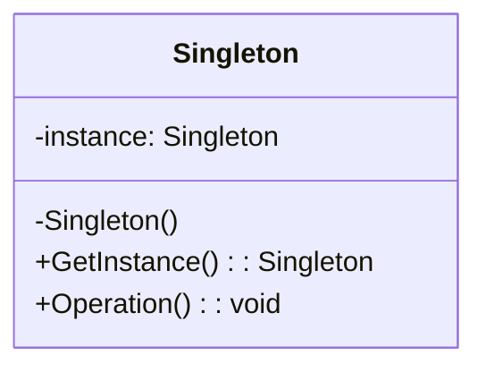
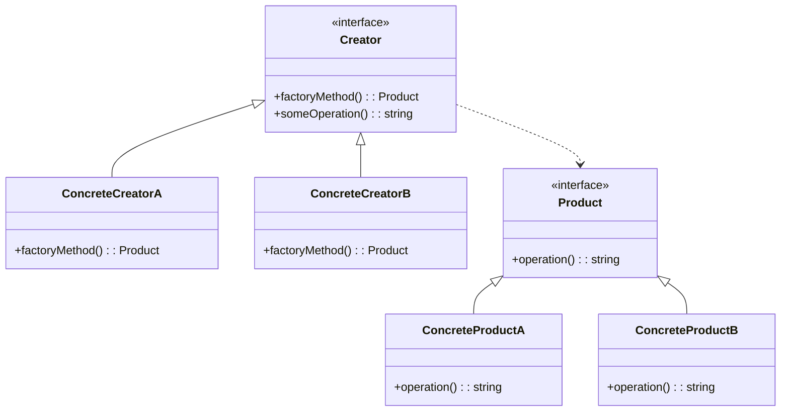
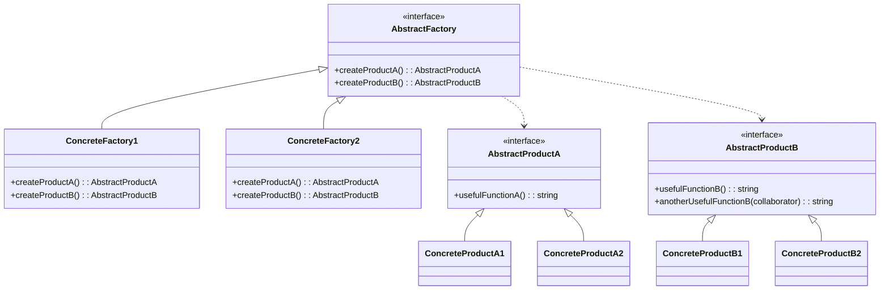
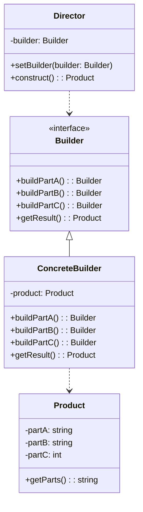
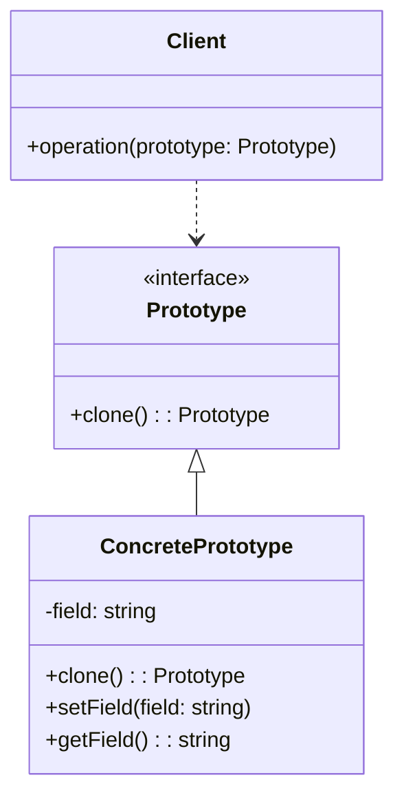

# 创建型设计模式 (Creational Patterns)

## 目录

1. [概述](#概述)
2. [单例模式 (Singleton)](#单例模式-singleton)
3. [工厂方法模式 (Factory Method)](#工厂方法模式-factory-method)
4. [抽象工厂模式 (Abstract Factory)](#抽象工厂模式-abstract-factory)
5. [建造者模式 (Builder)](#建造者模式-builder)
6. [原型模式 (Prototype)](#原型模式-prototype)
7. [模式比较与选择](#模式比较与选择)
8. [最佳实践](#最佳实践)

## 概述

### 1.1 创建型模式定义

创建型模式处理对象创建机制，试图在适合特定情况的场景下创建对象。

**形式化定义**：
$$\text{Creational}(P) = \{P | P \text{ 处理对象创建}\}$$

**数学表示**：
$$\text{CreationalPattern} = (N, I, S, C, E)$$

其中：

- $N$：模式名称
- $I$：创建意图
- $S$：创建结构
- $C$：创建约束
- $E$：创建效果

### 1.2 创建型模式分类

```go
// 创建型模式接口
type CreationalPattern interface {
    CreateObject() interface{}
    ValidateCreation() error
    GetCreationCost() CreationCost
}

// 创建成本
type CreationCost struct {
    TimeComplexity   string
    SpaceComplexity  string
    MemoryAllocation int64
}
```

## 单例模式 (Singleton)

### 2.1 概念定义

**定义**：保证一个类仅有一个实例，并提供一个访问它的全局访问点。

**形式化定义**：
$$\text{Singleton} = \{\text{instance} | \text{instance} \text{ 唯一}\}$$

**数学表示**：
$$\text{Singleton}(C) = \{c \in C | \forall c' \in C, c = c'\}$$

### 2.2 结构模型



### 2.3 Golang实现

#### 2.3.1 线程安全单例

```go
package singleton

import (
    "sync"
    "time"
)

// Singleton 单例结构体
type Singleton struct {
    ID        string
    CreatedAt time.Time
    Data      map[string]interface{}
}

var (
    instance *Singleton
    once     sync.Once
    mu       sync.RWMutex
)

// GetInstance 获取单例实例
func GetInstance() *Singleton {
    once.Do(func() {
        instance = &Singleton{
            ID:        generateID(),
            CreatedAt: time.Now(),
            Data:      make(map[string]interface{}),
        }
    })
    return instance
}

// GetInstanceThreadSafe 线程安全获取实例
func GetInstanceThreadSafe() *Singleton {
    if instance == nil {
        mu.Lock()
        defer mu.Unlock()
        if instance == nil {
            instance = &Singleton{
                ID:        generateID(),
                CreatedAt: time.Now(),
                Data:      make(map[string]interface{}),
            }
        }
    }
    return instance
}

// SetData 设置数据
func (s *Singleton) SetData(key string, value interface{}) {
    mu.Lock()
    defer mu.Unlock()
    s.Data[key] = value
}

// GetData 获取数据
func (s *Singleton) GetData(key string) (interface{}, bool) {
    mu.RLock()
    defer mu.RUnlock()
    value, exists := s.Data[key]
    return value, exists
}

// GetInfo 获取实例信息
func (s *Singleton) GetInfo() map[string]interface{} {
    return map[string]interface{}{
        "id":         s.ID,
        "created_at": s.CreatedAt,
        "data_count": len(s.Data),
    }
}

func generateID() string {
    return time.Now().Format("20060102150405")
}
```

#### 2.3.2 配置管理单例

```go
package config

import (
    "encoding/json"
    "os"
    "sync"
)

// Config 配置结构体
type Config struct {
    Database DatabaseConfig `json:"database"`
    Server   ServerConfig   `json:"server"`
    Cache    CacheConfig    `json:"cache"`
}

type DatabaseConfig struct {
    Host     string `json:"host"`
    Port     int    `json:"port"`
    Username string `json:"username"`
    Password string `json:"password"`
    Database string `json:"database"`
}

type ServerConfig struct {
    Port    int    `json:"port"`
    Host    string `json:"host"`
    Timeout int    `json:"timeout"`
}

type CacheConfig struct {
    RedisURL string `json:"redis_url"`
    TTL      int    `json:"ttl"`
}

var (
    config *Config
    once   sync.Once
)

// LoadConfig 加载配置
func LoadConfig(configPath string) *Config {
    once.Do(func() {
        config = &Config{}
        file, err := os.Open(configPath)
        if err != nil {
            panic(err)
        }
        defer file.Close()
        
        decoder := json.NewDecoder(file)
        err = decoder.Decode(config)
        if err != nil {
            panic(err)
        }
    })
    return config
}

// GetConfig 获取配置实例
func GetConfig() *Config {
    if config == nil {
        return LoadConfig("config.json")
    }
    return config
}
```

### 2.4 性能分析

**时间复杂度**：$O(1)$
**空间复杂度**：$O(1)$
**线程安全**：使用 `sync.Once` 或双重检查锁定

### 2.5 使用场景

- 全局配置管理
- 日志记录器
- 数据库连接池
- 缓存管理器

## 工厂方法模式 (Factory Method)

### 3.1 概念定义

**定义**：定义一个用于创建对象的接口，让子类决定实例化哪一个类。

**形式化定义**：
$$\text{FactoryMethod} = \{\text{creator} \rightarrow \text{product}\}$$

**数学表示**：
$$\text{FactoryMethod}(C, P) = \{f: C \rightarrow P | f \text{ 是创建函数}\}$$

### 3.2 结构模型



### 3.3 Golang实现

```go
package factory

import (
    "fmt"
    "time"
)

// Product 产品接口
type Product interface {
    Operation() string
    GetInfo() map[string]interface{}
}

// Creator 创建者接口
type Creator interface {
    FactoryMethod() Product
    SomeOperation() string
}

// ConcreteProductA 具体产品A
type ConcreteProductA struct {
    ID        string
    CreatedAt time.Time
    Type      string
}

func (p *ConcreteProductA) Operation() string {
    return fmt.Sprintf("ConcreteProductA operation: %s", p.ID)
}

func (p *ConcreteProductA) GetInfo() map[string]interface{} {
    return map[string]interface{}{
        "id":         p.ID,
        "type":       p.Type,
        "created_at": p.CreatedAt,
    }
}

// ConcreteProductB 具体产品B
type ConcreteProductB struct {
    ID        string
    CreatedAt time.Time
    Type      string
    Metadata  map[string]interface{}
}

func (p *ConcreteProductB) Operation() string {
    return fmt.Sprintf("ConcreteProductB operation: %s", p.ID)
}

func (p *ConcreteProductB) GetInfo() map[string]interface{} {
    return map[string]interface{}{
        "id":         p.ID,
        "type":       p.Type,
        "created_at": p.CreatedAt,
        "metadata":   p.Metadata,
    }
}

// ConcreteCreatorA 具体创建者A
type ConcreteCreatorA struct{}

func (c *ConcreteCreatorA) FactoryMethod() Product {
    return &ConcreteProductA{
        ID:        generateID("A"),
        CreatedAt: time.Now(),
        Type:      "ProductA",
    }
}

func (c *ConcreteCreatorA) SomeOperation() string {
    product := c.FactoryMethod()
    return fmt.Sprintf("Creator: Working with %s", product.Operation())
}

// ConcreteCreatorB 具体创建者B
type ConcreteCreatorB struct{}

func (c *ConcreteCreatorB) FactoryMethod() Product {
    return &ConcreteProductB{
        ID:        generateID("B"),
        CreatedAt: time.Now(),
        Type:      "ProductB",
        Metadata:  make(map[string]interface{}),
    }
}

func (c *ConcreteCreatorB) SomeOperation() string {
    product := c.FactoryMethod()
    return fmt.Sprintf("Creator: Working with %s", product.Operation())
}

// ClientCode 客户端代码
func ClientCode(creator Creator) {
    fmt.Println(creator.SomeOperation())
    
    product := creator.FactoryMethod()
    fmt.Printf("Product info: %+v\n", product.GetInfo())
}

func generateID(prefix string) string {
    return fmt.Sprintf("%s_%d", prefix, time.Now().UnixNano())
}
```

### 3.4 性能分析

**时间复杂度**：$O(1)$
**空间复杂度**：$O(1)$
**扩展性**：高，易于添加新产品类型

### 3.5 使用场景

- 数据库连接工厂
- 日志记录器工厂
- 缓存策略工厂
- 支付方式工厂

## 抽象工厂模式 (Abstract Factory)

### 4.1 概念定义

**定义**：提供一个创建一系列相关或相互依赖对象的接口，而无需指定它们具体的类。

**形式化定义**：
$$\text{AbstractFactory} = \{\text{family} \rightarrow \text{products}\}$$

**数学表示**：
$$\text{AbstractFactory}(F, P) = \{f: F \rightarrow P^n | f \text{ 创建产品族}\}$$

### 4.2 结构模型



### 4.3 Golang实现

```go
package abstractfactory

import (
    "fmt"
    "time"
)

// AbstractProductA 抽象产品A接口
type AbstractProductA interface {
    UsefulFunctionA() string
    GetType() string
}

// AbstractProductB 抽象产品B接口
type AbstractProductB interface {
    UsefulFunctionB() string
    AnotherUsefulFunctionB(collaborator AbstractProductA) string
    GetType() string
}

// AbstractFactory 抽象工厂接口
type AbstractFactory interface {
    CreateProductA() AbstractProductA
    CreateProductB() AbstractProductB
}

// ConcreteProductA1 具体产品A1
type ConcreteProductA1 struct {
    ID        string
    CreatedAt time.Time
}

func (p *ConcreteProductA1) UsefulFunctionA() string {
    return "The result of the product A1."
}

func (p *ConcreteProductA1) GetType() string {
    return "ProductA1"
}

// ConcreteProductA2 具体产品A2
type ConcreteProductA2 struct {
    ID        string
    CreatedAt time.Time
}

func (p *ConcreteProductA2) UsefulFunctionA() string {
    return "The result of the product A2."
}

func (p *ConcreteProductA2) GetType() string {
    return "ProductA2"
}

// ConcreteProductB1 具体产品B1
type ConcreteProductB1 struct {
    ID        string
    CreatedAt time.Time
}

func (p *ConcreteProductB1) UsefulFunctionB() string {
    return "The result of the product B1."
}

func (p *ConcreteProductB1) AnotherUsefulFunctionB(collaborator AbstractProductA) string {
    result := collaborator.UsefulFunctionA()
    return fmt.Sprintf("The result of the B1 collaborating with the (%s)", result)
}

func (p *ConcreteProductB1) GetType() string {
    return "ProductB1"
}

// ConcreteProductB2 具体产品B2
type ConcreteProductB2 struct {
    ID        string
    CreatedAt time.Time
}

func (p *ConcreteProductB2) UsefulFunctionB() string {
    return "The result of the product B2."
}

func (p *ConcreteProductB2) AnotherUsefulFunctionB(collaborator AbstractProductA) string {
    result := collaborator.UsefulFunctionA()
    return fmt.Sprintf("The result of the B2 collaborating with the (%s)", result)
}

func (p *ConcreteProductB2) GetType() string {
    return "ProductB2"
}

// ConcreteFactory1 具体工厂1
type ConcreteFactory1 struct{}

func (f *ConcreteFactory1) CreateProductA() AbstractProductA {
    return &ConcreteProductA1{
        ID:        generateID("A1"),
        CreatedAt: time.Now(),
    }
}

func (f *ConcreteFactory1) CreateProductB() AbstractProductB {
    return &ConcreteProductB1{
        ID:        generateID("B1"),
        CreatedAt: time.Now(),
    }
}

// ConcreteFactory2 具体工厂2
type ConcreteFactory2 struct{}

func (f *ConcreteFactory2) CreateProductA() AbstractProductA {
    return &ConcreteProductA2{
        ID:        generateID("A2"),
        CreatedAt: time.Now(),
    }
}

func (f *ConcreteFactory2) CreateProductB() AbstractProductB {
    return &ConcreteProductB2{
        ID:        generateID("B2"),
        CreatedAt: time.Now(),
    }
}

// ClientCode 客户端代码
func ClientCode(factory AbstractFactory) {
    productA := factory.CreateProductA()
    productB := factory.CreateProductB()

    fmt.Printf("Product A: %s\n", productA.UsefulFunctionA())
    fmt.Printf("Product B: %s\n", productB.UsefulFunctionB())
    fmt.Printf("Collaboration: %s\n", productB.AnotherUsefulFunctionB(productA))
}

func generateID(prefix string) string {
    return fmt.Sprintf("%s_%d", prefix, time.Now().UnixNano())
}
```

### 4.4 性能分析

**时间复杂度**：$O(1)$
**空间复杂度**：$O(n)$ (n为产品数量)
**扩展性**：中等，需要修改工厂接口

### 4.5 使用场景

- UI组件工厂
- 数据库连接工厂
- 操作系统API工厂
- 游戏引擎工厂

## 建造者模式 (Builder)

### 5.1 概念定义

**定义**：将一个复杂对象的构建与其表示分离，使得同样的构建过程可以创建不同的表示。

**形式化定义**：
$$\text{Builder} = \{\text{construction} \rightarrow \text{representation}\}$$

**数学表示**：
$$\text{Builder}(C, R) = \{b: C \rightarrow R | b \text{ 是构建函数}\}$$

### 5.2 结构模型



### 5.3 Golang实现

```go
package builder

import (
    "fmt"
    "strings"
    "time"
)

// Product 产品结构体
type Product struct {
    PartA string
    PartB string
    PartC int
    PartD map[string]interface{}
}

func (p *Product) GetParts() string {
    parts := []string{
        fmt.Sprintf("PartA: %s", p.PartA),
        fmt.Sprintf("PartB: %s", p.PartB),
        fmt.Sprintf("PartC: %d", p.PartC),
    }
    
    if len(p.PartD) > 0 {
        parts = append(parts, fmt.Sprintf("PartD: %+v", p.PartD))
    }
    
    return strings.Join(parts, ", ")
}

// Builder 建造者接口
type Builder interface {
    BuildPartA(value string) Builder
    BuildPartB(value string) Builder
    BuildPartC(value int) Builder
    BuildPartD(key string, value interface{}) Builder
    GetResult() *Product
    Reset() Builder
}

// ConcreteBuilder 具体建造者
type ConcreteBuilder struct {
    product *Product
}

func NewConcreteBuilder() *ConcreteBuilder {
    return &ConcreteBuilder{
        product: &Product{
            PartD: make(map[string]interface{}),
        },
    }
}

func (b *ConcreteBuilder) BuildPartA(value string) Builder {
    b.product.PartA = value
    return b
}

func (b *ConcreteBuilder) BuildPartB(value string) Builder {
    b.product.PartB = value
    return b
}

func (b *ConcreteBuilder) BuildPartC(value int) Builder {
    b.product.PartC = value
    return b
}

func (b *ConcreteBuilder) BuildPartD(key string, value interface{}) Builder {
    b.product.PartD[key] = value
    return b
}

func (b *ConcreteBuilder) GetResult() *Product {
    return b.product
}

func (b *ConcreteBuilder) Reset() Builder {
    b.product = &Product{
        PartD: make(map[string]interface{}),
    }
    return b
}

// Director 指导者
type Director struct {
    builder Builder
}

func NewDirector(builder Builder) *Director {
    return &Director{builder: builder}
}

func (d *Director) SetBuilder(builder Builder) {
    d.builder = builder
}

func (d *Director) Construct() *Product {
    return d.builder.
        BuildPartA("DefaultA").
        BuildPartB("DefaultB").
        BuildPartC(100).
        GetResult()
}

func (d *Director) ConstructCustom(partA, partB string, partC int) *Product {
    return d.builder.
        BuildPartA(partA).
        BuildPartB(partB).
        BuildPartC(partC).
        GetResult()
}

// 使用示例
func ExampleUsage() {
    // 使用建造者模式
    builder := NewConcreteBuilder()
    product1 := builder.
        BuildPartA("CustomA").
        BuildPartB("CustomB").
        BuildPartC(200).
        BuildPartD("timestamp", time.Now()).
        GetResult()
    
    fmt.Printf("Product 1: %s\n", product1.GetParts())
    
    // 使用指导者
    director := NewDirector(NewConcreteBuilder())
    product2 := director.Construct()
    fmt.Printf("Product 2: %s\n", product2.GetParts())
    
    product3 := director.ConstructCustom("SpecialA", "SpecialB", 300)
    fmt.Printf("Product 3: %s\n", product3.GetParts())
}
```

### 5.4 性能分析

**时间复杂度**：$O(n)$ (n为构建步骤数)
**空间复杂度**：$O(1)$
**灵活性**：高，支持链式调用

### 5.5 使用场景

- 配置对象构建
- 查询构建器
- 报告生成器
- 复杂对象创建

## 原型模式 (Prototype)

### 6.1 概念定义

**定义**：用原型实例指定创建对象的种类，并且通过拷贝这些原型创建新的对象。

**形式化定义**：
$$\text{Prototype} = \{\text{clone} \rightarrow \text{instance}\}$$

**数学表示**：
$$\text{Prototype}(I) = \{c: I \rightarrow I | c \text{ 是克隆函数}\}$$

### 6.2 结构模型



### 6.3 Golang实现

```go
package prototype

import (
    "fmt"
    "time"
)

// Prototype 原型接口
type Prototype interface {
    Clone() Prototype
    GetInfo() map[string]interface{}
}

// ConcretePrototype 具体原型
type ConcretePrototype struct {
    ID        string
    Name      string
    Data      map[string]interface{}
    CreatedAt time.Time
    Children  []*ConcretePrototype
}

func (p *ConcretePrototype) Clone() Prototype {
    // 深拷贝
    clone := &ConcretePrototype{
        ID:        generateID(),
        Name:      p.Name + "_clone",
        Data:      make(map[string]interface{}),
        CreatedAt: time.Now(),
        Children:  make([]*ConcretePrototype, len(p.Children)),
    }
    
    // 拷贝数据
    for k, v := range p.Data {
        clone.Data[k] = v
    }
    
    // 拷贝子对象
    for i, child := range p.Children {
        if child != nil {
            clonedChild := child.Clone().(*ConcretePrototype)
            clone.Children[i] = clonedChild
        }
    }
    
    return clone
}

func (p *ConcretePrototype) GetInfo() map[string]interface{} {
    return map[string]interface{}{
        "id":         p.ID,
        "name":       p.Name,
        "data_count": len(p.Data),
        "children":   len(p.Children),
        "created_at": p.CreatedAt,
    }
}

func (p *ConcretePrototype) SetData(key string, value interface{}) {
    p.Data[key] = value
}

func (p *ConcretePrototype) AddChild(child *ConcretePrototype) {
    p.Children = append(p.Children, child)
}

// PrototypeRegistry 原型注册表
type PrototypeRegistry struct {
    prototypes map[string]Prototype
}

func NewPrototypeRegistry() *PrototypeRegistry {
    return &PrototypeRegistry{
        prototypes: make(map[string]Prototype),
    }
}

func (r *PrototypeRegistry) Add(name string, prototype Prototype) {
    r.prototypes[name] = prototype
}

func (r *PrototypeRegistry) Get(name string) (Prototype, bool) {
    prototype, exists := r.prototypes[name]
    return prototype, exists
}

func (r *PrototypeRegistry) Clone(name string) (Prototype, error) {
    prototype, exists := r.prototypes[name]
    if !exists {
        return nil, fmt.Errorf("prototype %s not found", name)
    }
    return prototype.Clone(), nil
}

func generateID() string {
    return fmt.Sprintf("proto_%d", time.Now().UnixNano())
}

// 使用示例
func ExampleUsage() {
    // 创建原型
    original := &ConcretePrototype{
        ID:        generateID(),
        Name:      "Original",
        Data:      map[string]interface{}{"key": "value"},
        CreatedAt: time.Now(),
    }
    
    // 克隆原型
    clone := original.Clone().(*ConcretePrototype)
    fmt.Printf("Original: %+v\n", original.GetInfo())
    fmt.Printf("Clone: %+v\n", clone.GetInfo())
    
    // 使用注册表
    registry := NewPrototypeRegistry()
    registry.Add("default", original)
    
    if cloned, err := registry.Clone("default"); err == nil {
        fmt.Printf("Registry Clone: %+v\n", cloned.GetInfo())
    }
}
```

### 6.4 性能分析

**时间复杂度**：$O(n)$ (n为对象复杂度)
**空间复杂度**：$O(n)$
**内存效率**：中等，需要深拷贝

### 6.5 使用场景

- 对象复制
- 配置模板
- 游戏对象克隆
- 文档模板

## 模式比较与选择

### 7.1 模式对比表

| 模式 | 复杂度 | 灵活性 | 性能 | 适用场景 |
|------|--------|--------|------|----------|
| 单例 | 低 | 低 | 高 | 全局资源管理 |
| 工厂方法 | 中 | 高 | 中 | 对象创建策略 |
| 抽象工厂 | 高 | 中 | 中 | 产品族创建 |
| 建造者 | 中 | 高 | 中 | 复杂对象构建 |
| 原型 | 中 | 中 | 低 | 对象复制 |

### 7.2 选择指南

**选择单例模式当**：

- 需要全局唯一实例
- 资源管理（配置、日志、数据库连接）

**选择工厂方法当**：

- 需要延迟对象创建
- 子类决定创建对象类型

**选择抽象工厂当**：

- 需要创建相关对象族
- 系统独立于产品创建

**选择建造者当**：

- 需要构建复杂对象
- 需要分步构建过程

**选择原型当**：

- 需要对象复制
- 避免重复初始化

## 最佳实践

### 8.1 设计原则

1. **单一职责原则**：每个创建者只负责一种对象的创建
2. **开闭原则**：对扩展开放，对修改关闭
3. **依赖倒置原则**：依赖抽象而非具体实现

### 8.2 性能优化

```go
// 对象池模式结合单例
type ObjectPool struct {
    pool chan interface{}
    new  func() interface{}
}

func NewObjectPool(size int, new func() interface{}) *ObjectPool {
    pool := &ObjectPool{
        pool: make(chan interface{}, size),
        new:  new,
    }
    
    for i := 0; i < size; i++ {
        pool.pool <- new()
    }
    
    return pool
}

func (p *ObjectPool) Get() interface{} {
    select {
    case obj := <-p.pool:
        return obj
    default:
        return p.new()
    }
}

func (p *ObjectPool) Put(obj interface{}) {
    select {
    case p.pool <- obj:
    default:
        // 池已满，丢弃对象
    }
}
```

### 8.3 错误处理

```go
// 创建错误处理
type CreationError struct {
    Pattern string
    Reason  string
    Err     error
}

func (e *CreationError) Error() string {
    return fmt.Sprintf("failed to create %s: %s", e.Pattern, e.Reason)
}

func (e *CreationError) Unwrap() error {
    return e.Err
}

// 安全创建函数
func SafeCreate[T any](creator func() (T, error)) (T, error) {
    defer func() {
        if r := recover(); r != nil {
            // 记录panic信息
            fmt.Printf("Panic in creation: %v\n", r)
        }
    }()
    
    return creator()
}
```

### 8.4 测试策略

```go
// 创建型模式测试
func TestCreationalPatterns(t *testing.T) {
    // 测试单例
    t.Run("Singleton", func(t *testing.T) {
        instance1 := GetInstance()
        instance2 := GetInstance()
        
        if instance1 != instance2 {
            t.Error("Singleton instances should be the same")
        }
    })
    
    // 测试工厂方法
    t.Run("FactoryMethod", func(t *testing.T) {
        creator := &ConcreteCreatorA{}
        product := creator.FactoryMethod()
        
        if product == nil {
            t.Error("Factory method should return a product")
        }
    })
    
    // 测试建造者
    t.Run("Builder", func(t *testing.T) {
        builder := NewConcreteBuilder()
        product := builder.
            BuildPartA("test").
            BuildPartB("test").
            BuildPartC(100).
            GetResult()
        
        if product.PartA != "test" {
            t.Error("Builder should set correct values")
        }
    })
}
```

---

*本文档提供了创建型设计模式的完整分析，包含形式化定义、Golang实现和最佳实践。*
