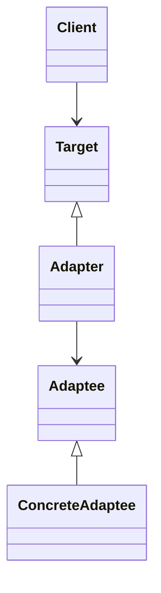
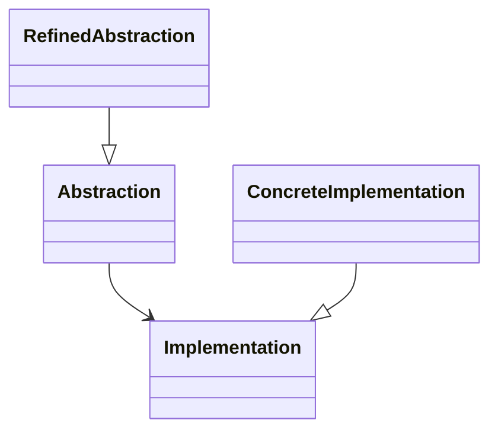
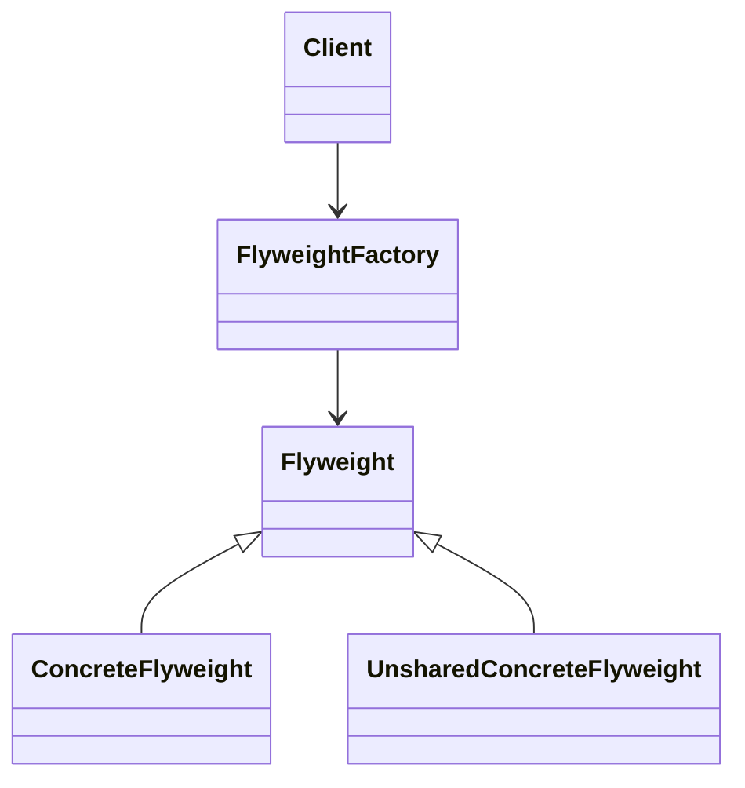
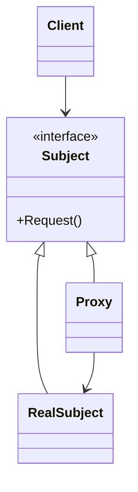

# 11.5.1 结构型设计模式分析

<!-- TOC START -->
- [11.5.1 结构型设计模式分析](#结构型设计模式分析)
  - [11.5.1.1 目录](#目录)
  - [11.5.1.2 1. 概述](#1-概述)
    - [11.5.1.2.1 结构型模式分类](#结构型模式分类)
    - [11.5.1.2.2 核心特征](#核心特征)
  - [11.5.1.3 2. 结构型模式形式化定义](#2-结构型模式形式化定义)
    - [11.5.1.3.1 结构型模式系统定义](#结构型模式系统定义)
    - [11.5.1.3.2 结构关系形式化定义](#结构关系形式化定义)
  - [11.5.1.4 3. 适配器模式 (Adapter)](#3-适配器模式-adapter)
    - [11.5.1.4.1 形式化定义](#形式化定义)
    - [11.5.1.4.2 Golang实现](#golang实现)
    - [11.5.1.4.3 性能分析](#性能分析)
  - [11.5.1.5 4. 桥接模式 (Bridge)](#4-桥接模式-bridge)
    - [11.5.1.5.1 形式化定义](#形式化定义)
    - [11.5.1.5.2 Golang实现](#golang实现)
    - [11.5.1.5.3 性能分析](#性能分析)
  - [11.5.1.6 5. 组合模式 (Composite)](#5-组合模式-composite)
    - [11.5.1.6.1 形式化定义](#形式化定义)
    - [11.5.1.6.2 Golang实现](#golang实现)
    - [11.5.1.6.3 性能分析](#性能分析)
  - [11.5.1.7 6. 装饰器模式 (Decorator)](#6-装饰器模式-decorator)
    - [11.5.1.7.1 形式化定义](#形式化定义)
    - [11.5.1.7.2 Golang实现](#golang实现)
    - [11.5.1.7.3 性能分析](#性能分析)
  - [11.5.1.8 7. 外观模式 (Facade)](#7-外观模式-facade)
    - [11.5.1.8.1 形式化定义](#形式化定义)
    - [11.5.1.8.2 Golang实现](#golang实现)
    - [11.5.1.8.3 性能分析](#性能分析)
  - [11.5.1.9 8. 享元模式 (Flyweight)](#8-享元模式-flyweight)
    - [11.5.1.9.1 形式化定义](#形式化定义)
    - [11.5.1.9.2 Golang实现](#golang实现)
      - [11.5.1.9.2.1 基本实现](#基本实现)
      - [11.5.1.9.2.2 图形渲染系统实例](#图形渲染系统实例)
      - [11.5.1.9.2.3 字符串池（Golang内置享元）](#字符串池（golang内置享元）)
    - [11.5.1.9.3 性能分析](#性能分析)
    - [11.5.1.9.4 Golang最佳实践](#golang最佳实践)
  - [11.5.1.10 9. 代理模式 (Proxy)](#9-代理模式-proxy)
    - [11.5.1.10.1 形式化定义](#形式化定义)
    - [11.5.1.10.2 Golang实现](#golang实现)
      - [11.5.1.10.2.1 基本实现](#基本实现)
      - [11.5.1.10.2.2 各种代理类型实现](#各种代理类型实现)
      - [11.5.1.10.2.3 代理组合与装饰器模式结合](#代理组合与装饰器模式结合)
    - [11.5.1.10.3 性能分析](#性能分析)
    - [11.5.1.10.4 Golang最佳实践](#golang最佳实践)
    - [11.5.1.10.5 与其他模式的关系](#与其他模式的关系)
  - [11.5.1.11 10. 性能分析与最佳实践](#10-性能分析与最佳实践)
    - [11.5.1.11.1 性能对比](#性能对比)
    - [11.5.1.11.2 最佳实践](#最佳实践)
      - [11.5.1.11.2.1 接口设计](#接口设计)
      - [11.5.1.11.2.2 组合优于继承](#组合优于继承)
      - [11.5.1.11.2.3 线程安全](#线程安全)
    - [11.5.1.11.3 性能优化建议](#性能优化建议)
  - [11.5.1.12 11. 参考文献](#11-参考文献)
<!-- TOC END -->

## 11.5.1.1 目录

1. [概述](#1-概述)
2. [结构型模式形式化定义](#2-结构型模式形式化定义)
3. [适配器模式 (Adapter)](#3-适配器模式-adapter)
4. [桥接模式 (Bridge)](#4-桥接模式-bridge)
5. [组合模式 (Composite)](#5-组合模式-composite)
6. [装饰器模式 (Decorator)](#6-装饰器模式-decorator)
7. [外观模式 (Facade)](#7-外观模式-facade)
8. [享元模式 (Flyweight)](#8-享元模式-flyweight)
9. [代理模式 (Proxy)](#9-代理模式-proxy)
10. [性能分析与最佳实践](#10-性能分析与最佳实践)
11. [参考文献](#11-参考文献)

---

## 11.5.1.2 1. 概述

结构型模式关注类和对象的组合，通过继承和组合获得新功能。在Golang中，结构型模式通过接口、嵌入和组合实现，充分利用Go语言的简洁性和灵活性。

### 11.5.1.2.1 结构型模式分类

结构型模式集合可以形式化定义为：

$$C_{str} = \{Adapter, Bridge, Composite, Decorator, Facade, Flyweight, Proxy\}$$

### 11.5.1.2.2 核心特征

- **对象组合**: 通过组合实现功能扩展
- **接口适配**: 提供统一的接口适配不同实现
- **结构优化**: 优化对象结构和内存使用
- **访问控制**: 控制对对象的访问和操作

---

## 11.5.1.3 2. 结构型模式形式化定义

### 11.5.1.3.1 结构型模式系统定义

结构型模式系统可以定义为五元组：

$$\mathcal{SP} = (P_{str}, I_{str}, C_{str}, E_{str}, Q_{str})$$

其中：

- **$P_{str}$** - 结构型模式集合
- **$I_{str}$** - 接口集合
- **$C_{str}$** - 组合关系集合
- **$E_{str}$** - 评估指标集合
- **$Q_{str}$** - 质量保证集合

### 11.5.1.3.2 结构关系形式化定义

结构关系可以定义为图论模型：

$$\mathcal{G} = (V, E, \phi)$$

其中：

- **$V$** - 顶点集合（对象）
- **$E$** - 边集合（关系）
- **$\phi$** - 边到顶点对的映射函数

---

## 11.5.1.4 3. 适配器模式 (Adapter)

### 11.5.1.4.1 形式化定义

适配器模式将一个类的接口转换成客户希望的另一个接口，使不兼容的接口可以一起工作。

**数学定义**:
$$Adapter : IncompatibleInterface \rightarrow CompatibleInterface$$

**类图关系**:



### 11.5.1.4.2 Golang实现

```go
package adapter

import (
    "fmt"
    "strconv"
)

// Target 目标接口
type Target interface {
    Request() string
}

// Adaptee 被适配的接口
type Adaptee interface {
    SpecificRequest() int
}

// ConcreteAdaptee 具体被适配类
type ConcreteAdaptee struct {
    value int
}

func NewConcreteAdaptee(value int) *ConcreteAdaptee {
    return &ConcreteAdaptee{value: value}
}

func (a *ConcreteAdaptee) SpecificRequest() int {
    return a.value
}

// Adapter 适配器
type Adapter struct {
    adaptee Adaptee
}

func NewAdapter(adaptee Adaptee) *Adapter {
    return &Adapter{adaptee: adaptee}
}

func (a *Adapter) Request() string {
    value := a.adaptee.SpecificRequest()
    return fmt.Sprintf("Adapted: %s", strconv.Itoa(value))
}

// 函数式适配器
type FunctionalAdapter struct {
    adapteeFunc func() int
}

func NewFunctionalAdapter(adapteeFunc func() int) *FunctionalAdapter {
    return &FunctionalAdapter{adapteeFunc: adapteeFunc}
}

func (f *FunctionalAdapter) Request() string {
    value := f.adapteeFunc()
    return fmt.Sprintf("Functional Adapted: %s", strconv.Itoa(value))
}

// Client 客户端
type Client struct {
    target Target
}

func NewClient(target Target) *Client {
    return &Client{target: target}
}

func (c *Client) UseTarget() string {
    return c.target.Request()
}

```

### 11.5.1.4.3 性能分析

**时间复杂度**: $O(1)$ - 适配操作的时间复杂度为常数
**空间复杂度**: $O(1)$ - 只占用适配器的内存空间
**兼容性**: 提供接口兼容性
**灵活性**: 支持多种适配策略

---

## 11.5.1.5 4. 桥接模式 (Bridge)

### 11.5.1.5.1 形式化定义

桥接模式将抽象部分与实现部分分离，使它们都可以独立地变化。

**数学定义**:
$$Bridge : (Abstraction, Implementation) \rightarrow Abstraction \times Implementation$$

**类图关系**:



### 11.5.1.5.2 Golang实现

```go
package bridge

import (
    "fmt"
)

// Implementation 实现接口
type Implementation interface {
    OperationImpl() string
}

// ConcreteImplementationA 具体实现A
type ConcreteImplementationA struct{}

func (i *ConcreteImplementationA) OperationImpl() string {
    return "Implementation A"
}

// ConcreteImplementationB 具体实现B
type ConcreteImplementationB struct{}

func (i *ConcreteImplementationB) OperationImpl() string {
    return "Implementation B"
}

// Abstraction 抽象接口
type Abstraction interface {
    Operation() string
    SetImplementation(impl Implementation)
}

// RefinedAbstraction 精确抽象
type RefinedAbstraction struct {
    implementation Implementation
}

func NewRefinedAbstraction(impl Implementation) *RefinedAbstraction {
    return &RefinedAbstraction{implementation: impl}
}

func (a *RefinedAbstraction) Operation() string {
    return fmt.Sprintf("Refined: %s", a.implementation.OperationImpl())
}

func (a *RefinedAbstraction) SetImplementation(impl Implementation) {
    a.implementation = impl
}

// ExtendedAbstraction 扩展抽象
type ExtendedAbstraction struct {
    RefinedAbstraction
}

func NewExtendedAbstraction(impl Implementation) *ExtendedAbstraction {
    return &ExtendedAbstraction{
        RefinedAbstraction: *NewRefinedAbstraction(impl),
    }
}

func (e *ExtendedAbstraction) Operation() string {
    return fmt.Sprintf("Extended: %s", e.implementation.OperationImpl())
}

```

### 11.5.1.5.3 性能分析

**时间复杂度**: $O(1)$ - 桥接操作的时间复杂度为常数
**空间复杂度**: $O(1)$ - 只占用抽象和实现的内存空间
**解耦性**: 抽象和实现完全解耦
**扩展性**: 支持独立扩展抽象和实现

---

## 11.5.1.6 5. 组合模式 (Composite)

### 11.5.1.6.1 形式化定义

组合模式将对象组合成树形结构以表示"部分-整体"的层次结构，使客户端对单个对象和组合对象具有一致的访问性。

**数学定义**:
$$Composite : Component \rightarrow Tree(Component)$$

其中 $Tree(Component)$ 表示组件树结构

### 11.5.1.6.2 Golang实现

```go
package composite

import (
    "fmt"
    "strings"
)

// Component 组件接口
type Component interface {
    Add(component Component)
    Remove(component Component)
    GetChild(index int) Component
    Operation() string
    GetName() string
}

// Leaf 叶子节点
type Leaf struct {
    name string
}

func NewLeaf(name string) *Leaf {
    return &Leaf{name: name}
}

func (l *Leaf) Add(component Component) {
    // 叶子节点不支持添加子组件
}

func (l *Leaf) Remove(component Component) {
    // 叶子节点不支持移除子组件
}

func (l *Leaf) GetChild(index int) Component {
    return nil
}

func (l *Leaf) Operation() string {
    return fmt.Sprintf("Leaf: %s", l.name)
}

func (l *Leaf) GetName() string {
    return l.name
}

// Composite 组合节点
type Composite struct {
    name     string
    children []Component
}

func NewComposite(name string) *Composite {
    return &Composite{
        name:     name,
        children: make([]Component, 0),
    }
}

func (c *Composite) Add(component Component) {
    c.children = append(c.children, component)
}

func (c *Composite) Remove(component Component) {
    for i, child := range c.children {
        if child == component {
            c.children = append(c.children[:i], c.children[i+1:]...)
            break
        }
    }
}

func (c *Composite) GetChild(index int) Component {
    if index >= 0 && index < len(c.children) {
        return c.children[index]
    }
    return nil
}

func (c *Composite) Operation() string {
    var results []string
    results = append(results, fmt.Sprintf("Composite: %s", c.name))
    
    for _, child := range c.children {
        results = append(results, "  "+child.Operation())
    }
    
    return strings.Join(results, "\n")
}

func (c *Composite) GetName() string {
    return c.name
}

// 安全组合模式
type SafeComponent interface {
    Operation() string
    GetName() string
}

type SafeLeaf struct {
    name string
}

func (l *SafeLeaf) Operation() string {
    return fmt.Sprintf("Safe Leaf: %s", l.name)
}

func (l *SafeLeaf) GetName() string {
    return l.name
}

type SafeComposite struct {
    name     string
    children []SafeComponent
}

func (c *SafeComposite) Operation() string {
    var results []string
    results = append(results, fmt.Sprintf("Safe Composite: %s", c.name))
    
    for _, child := range c.children {
        results = append(results, "  "+child.Operation())
    }
    
    return strings.Join(results, "\n")
}

func (c *SafeComposite) GetName() string {
    return c.name
}

func (c *SafeComposite) AddChild(child SafeComponent) {
    c.children = append(c.children, child)
}

```

### 11.5.1.6.3 性能分析

**时间复杂度**: $O(n)$ - n为树中节点的数量
**空间复杂度**: $O(n)$ - 需要存储所有节点
**遍历效率**: 支持深度优先和广度优先遍历
**内存使用**: 树结构的内存使用与节点数量成正比

---

## 11.5.1.7 6. 装饰器模式 (Decorator)

### 11.5.1.7.1 形式化定义

装饰器模式动态地给对象添加额外的职责，而不改变其接口。

**数学定义**:
$$Decorator : Component \rightarrow DecoratedComponent$$

其中 $DecoratedComponent \supset Component$ (包含原组件功能)

### 11.5.1.7.2 Golang实现

```go
package decorator

import (
    "fmt"
    "strings"
)

// Component 组件接口
type Component interface {
    Operation() string
}

// ConcreteComponent 具体组件
type ConcreteComponent struct {
    name string
}

func NewConcreteComponent(name string) *ConcreteComponent {
    return &ConcreteComponent{name: name}
}

func (c *ConcreteComponent) Operation() string {
    return fmt.Sprintf("ConcreteComponent: %s", c.name)
}

// Decorator 装饰器基类
type Decorator struct {
    component Component
}

func NewDecorator(component Component) *Decorator {
    return &Decorator{component: component}
}

func (d *Decorator) Operation() string {
    return d.component.Operation()
}

// ConcreteDecoratorA 具体装饰器A
type ConcreteDecoratorA struct {
    Decorator
}

func NewConcreteDecoratorA(component Component) *ConcreteDecoratorA {
    return &ConcreteDecoratorA{
        Decorator: *NewDecorator(component),
    }
}

func (d *ConcreteDecoratorA) Operation() string {
    return fmt.Sprintf("DecoratorA(%s)", d.component.Operation())
}

// ConcreteDecoratorB 具体装饰器B
type ConcreteDecoratorB struct {
    Decorator
}

func NewConcreteDecoratorB(component Component) *ConcreteDecoratorB {
    return &ConcreteDecoratorB{
        Decorator: *NewDecorator(component),
    }
}

func (d *ConcreteDecoratorB) Operation() string {
    return fmt.Sprintf("DecoratorB(%s)", d.component.Operation())
}

// 函数式装饰器
type FunctionalDecorator func(Component) Component

func LoggingDecorator(component Component) Component {
    return &LoggingComponent{component: component}
}

type LoggingComponent struct {
    component Component
}

func (l *LoggingComponent) Operation() string {
    result := l.component.Operation()
    fmt.Printf("Logging: %s\n", result)
    return result
}

func CachingDecorator(component Component) Component {
    return &CachingComponent{component: component}
}

type CachingComponent struct {
    component Component
    cache     map[string]string
}

func (c *CachingComponent) Operation() string {
    if c.cache == nil {
        c.cache = make(map[string]string)
    }
    
    key := "operation"
    if result, exists := c.cache[key]; exists {
        return result
    }
    
    result := c.component.Operation()
    c.cache[key] = result
    return result
}

```

### 11.5.1.7.3 性能分析

**时间复杂度**: $O(n)$ - n为装饰器的数量
**空间复杂度**: $O(n)$ - 每个装饰器占用额外空间
**灵活性**: 支持动态组合装饰器
**可扩展性**: 易于添加新的装饰器

---

## 11.5.1.8 7. 外观模式 (Facade)

### 11.5.1.8.1 形式化定义

外观模式为子系统中的一组接口提供一个一致的界面，定义了一个高层接口，使子系统更加容易使用。

**数学定义**:
$$Facade : \{Subsystem_1, Subsystem_2, ..., Subsystem_n\} \rightarrow UnifiedInterface$$

### 11.5.1.8.2 Golang实现

```go
package facade

import (
    "fmt"
    "time"
)

// SubsystemA 子系统A
type SubsystemA struct{}

func (a *SubsystemA) OperationA() string {
    return "SubsystemA operation"
}

// SubsystemB 子系统B
type SubsystemB struct{}

func (b *SubsystemB) OperationB() string {
    return "SubsystemB operation"
}

// SubsystemC 子系统C
type SubsystemC struct{}

func (c *SubsystemC) OperationC() string {
    return "SubsystemC operation"
}

// Facade 外观
type Facade struct {
    subsystemA *SubsystemA
    subsystemB *SubsystemB
    subsystemC *SubsystemC
}

func NewFacade() *Facade {
    return &Facade{
        subsystemA: &SubsystemA{},
        subsystemB: &SubsystemB{},
        subsystemC: &SubsystemC{},
    }
}

func (f *Facade) Operation1() string {
    resultA := f.subsystemA.OperationA()
    resultB := f.subsystemB.OperationB()
    return fmt.Sprintf("Operation1: %s, %s", resultA, resultB)
}

func (f *Facade) Operation2() string {
    resultB := f.subsystemB.OperationB()
    resultC := f.subsystemC.OperationC()
    return fmt.Sprintf("Operation2: %s, %s", resultB, resultC)
}

// 复杂外观模式
type ComplexFacade struct {
    facade *Facade
}

func NewComplexFacade() *ComplexFacade {
    return &ComplexFacade{
        facade: NewFacade(),
    }
}

func (c *ComplexFacade) ComplexOperation() string {
    result1 := c.facade.Operation1()
    time.Sleep(100 * time.Millisecond) // 模拟复杂操作
    result2 := c.facade.Operation2()
    return fmt.Sprintf("Complex: %s; %s", result1, result2)
}

// 配置外观模式
type ConfigFacade struct {
    subsystems map[string]interface{}
}

func NewConfigFacade() *ConfigFacade {
    return &ConfigFacade{
        subsystems: make(map[string]interface{}),
    }
}

func (c *ConfigFacade) RegisterSubsystem(name string, subsystem interface{}) {
    c.subsystems[name] = subsystem
}

func (c *ConfigFacade) ExecuteOperation(operation string) string {
    // 根据操作类型调用相应的子系统
    switch operation {
    case "A":
        if subsystem, exists := c.subsystems["A"]; exists {
            if a, ok := subsystem.(*SubsystemA); ok {
                return a.OperationA()
            }
        }
    case "B":
        if subsystem, exists := c.subsystems["B"]; exists {
            if b, ok := subsystem.(*SubsystemB); ok {
                return b.OperationB()
            }
        }
    }
    return "Unknown operation"
}

```

### 11.5.1.8.3 性能分析

**时间复杂度**: $O(n)$ - n为子系统的数量
**空间复杂度**: $O(n)$ - 需要存储所有子系统
**简化性**: 简化客户端与子系统的交互
**封装性**: 隐藏子系统的复杂性

---

## 11.5.1.9 8. 享元模式 (Flyweight)

### 11.5.1.9.1 形式化定义

享元模式通过共享技术有效地支持大量细粒度的对象，从而减少内存使用。

**数学定义**:
$$Flyweight = (I, E, \phi)$$

其中：

- $I$ - 内部状态（可共享）
- $E$ - 外部状态（不可共享）
- $\phi : I \times E \rightarrow Result$ - 操作函数

**状态分离可以形式化为**:
$$\mathcal{O} = \{o_1, o_2, ..., o_n\} \implies \mathcal{I} \times \mathcal{E} = \{(i_1, e_1), (i_2, e_2), ..., (i_n, e_n)\}$$

其中 $|\mathcal{I}| \ll |\mathcal{O}|$（内部状态的数量远小于对象的数量）

**空间复杂度优化**:
$$Space_{without\_flyweight} = O(|\mathcal{O}|) = O(n)$$
$$Space_{with\_flyweight} = O(|\mathcal{I}| + |\mathcal{E}|) \approx O(|\mathcal{I}|) \ll O(n)$$

**类图关系**:



### 11.5.1.9.2 Golang实现

#### 11.5.1.9.2.1 基本实现

```go
package flyweight

import (
    "fmt"
    "sync"
)

// Flyweight 享元接口
type Flyweight interface {
    Operation(extrinsicState string) string
}

// ConcreteFlyweight 具体享元
type ConcreteFlyweight struct {
    intrinsicState string
}

func NewConcreteFlyweight(intrinsicState string) *ConcreteFlyweight {
    return &ConcreteFlyweight{intrinsicState: intrinsicState}
}

func (f *ConcreteFlyweight) Operation(extrinsicState string) string {
    return fmt.Sprintf("Flyweight[%s] with extrinsic state: %s", 
        f.intrinsicState, extrinsicState)
}

// FlyweightFactory 享元工厂
type FlyweightFactory struct {
    flyweights map[string]Flyweight
    mu         sync.RWMutex
}

func NewFlyweightFactory() *FlyweightFactory {
    return &FlyweightFactory{
        flyweights: make(map[string]Flyweight),
    }
}

func (f *FlyweightFactory) GetFlyweight(key string) Flyweight {
    f.mu.RLock()
    if flyweight, exists := f.flyweights[key]; exists {
        f.mu.RUnlock()
        return flyweight
    }
    f.mu.RUnlock()
    
    f.mu.Lock()
    defer f.mu.Unlock()
    
    // 双重检查
    if flyweight, exists := f.flyweights[key]; exists {
        return flyweight
    }
    
    flyweight := NewConcreteFlyweight(key)
    f.flyweights[key] = flyweight
    return flyweight
}

func (f *FlyweightFactory) GetFlyweightCount() int {
    f.mu.RLock()
    defer f.mu.RUnlock()
    return len(f.flyweights)
}

// UnsharedConcreteFlyweight 非共享具体享元
type UnsharedConcreteFlyweight struct {
    allState string
}

func NewUnsharedConcreteFlyweight(allState string) *UnsharedConcreteFlyweight {
    return &UnsharedConcreteFlyweight{allState: allState}
}

func (u *UnsharedConcreteFlyweight) Operation(extrinsicState string) string {
    return fmt.Sprintf("Unshared Flyweight[%s] with extrinsic state: %s", 
        u.allState, extrinsicState)
}

// 字符串享元示例
type StringFlyweight struct {
    content string
}

func NewStringFlyweight(content string) *StringFlyweight {
    return &StringFlyweight{content: content}
}

func (s *StringFlyweight) GetContent() string {
    return s.content
}

type StringFlyweightFactory struct {
    strings map[string]*StringFlyweight
    mu      sync.RWMutex
}

func NewStringFlyweightFactory() *StringFlyweightFactory {
    return &StringFlyweightFactory{
        strings: make(map[string]*StringFlyweight),
    }
}

func (f *StringFlyweightFactory) GetString(content string) *StringFlyweight {
    f.mu.RLock()
    if str, exists := f.strings[content]; exists {
        f.mu.RUnlock()
        return str
    }
    f.mu.RUnlock()
    
    f.mu.Lock()
    defer f.mu.Unlock()
    
    if str, exists := f.strings[content]; exists {
        return str
    }
    
    str := NewStringFlyweight(content)
    f.strings[content] = str
    return str
}

```

#### 11.5.1.9.2.2 图形渲染系统实例

```go
package flyweight

import (
    "fmt"
    "image/color"
    "sync"
)

// 内部状态
type ShapeType struct {
    Name       string
    Complexity int
    Vertices   []Vertex
}

type Vertex struct {
    X, Y float64
}

// 享元对象
type Shape interface {
    Draw(x, y float64, c color.RGBA, scale float64)
    GetType() string
}

// 具体享元
type Circle struct {
    shapeType *ShapeType
}

func NewCircle() *Circle {
    return &Circle{
        shapeType: &ShapeType{
            Name:       "Circle",
            Complexity: 1,
            Vertices: []Vertex{
                {0, 0}, // 中心点
            },
        },
    }
}

func (c *Circle) Draw(x, y float64, clr color.RGBA, scale float64) {
    fmt.Printf("Drawing %s at (%.1f,%.1f) with color RGB(%d,%d,%d) and scale %.1f\n",
        c.shapeType.Name, x, y, clr.R, clr.G, clr.B, scale)
}

func (c *Circle) GetType() string {
    return c.shapeType.Name
}

// 具体享元
type Rectangle struct {
    shapeType *ShapeType
}

func NewRectangle() *Rectangle {
    return &Rectangle{
        shapeType: &ShapeType{
            Name:       "Rectangle",
            Complexity: 2,
            Vertices: []Vertex{
                {0, 0}, {1, 0}, {1, 1}, {0, 1},
            },
        },
    }
}

func (r *Rectangle) Draw(x, y float64, clr color.RGBA, scale float64) {
    fmt.Printf("Drawing %s at (%.1f,%.1f) with color RGB(%d,%d,%d) and scale %.1f\n",
        r.shapeType.Name, x, y, clr.R, clr.G, clr.B, scale)
}

func (r *Rectangle) GetType() string {
    return r.shapeType.Name
}

// 享元工厂
type ShapeFactory struct {
    shapes map[string]Shape
    mu     sync.RWMutex
}

func NewShapeFactory() *ShapeFactory {
    return &ShapeFactory{
        shapes: make(map[string]Shape),
    }
}

func (f *ShapeFactory) GetShape(shapeType string) Shape {
    f.mu.RLock()
    if shape, exists := f.shapes[shapeType]; exists {
        f.mu.RUnlock()
        return shape
    }
    f.mu.RUnlock()
    
    f.mu.Lock()
    defer f.mu.Unlock()
    
    if shape, exists := f.shapes[shapeType]; exists {
        return shape
    }
    
    var shape Shape
    switch shapeType {
    case "circle":
        shape = NewCircle()
    case "rectangle":
        shape = NewRectangle()
    default:
        return nil
    }
    
    f.shapes[shapeType] = shape
    return shape
}

```

#### 11.5.1.9.2.3 字符串池（Golang内置享元）

```go
package main

import (
    "fmt"
    "unsafe"
)

func main() {
    // Go字符串字面量自动享元模式
    s1 := "hello"
    s2 := "hello"
    
    // 指向同一内存区域
    fmt.Println(&s1, &s2)               // 不同（变量地址）
    fmt.Println(unsafe.Pointer(unsafe.StringData(s1)))   // 相同（内容地址）
    fmt.Println(unsafe.Pointer(unsafe.StringData(s2)))   // 相同（内容地址）
    
    // 使用+操作符创建字符串时，编译器可能无法优化
    s3 := "hel" + "lo"
    fmt.Println(unsafe.Pointer(unsafe.StringData(s3)))   // 可能相同，取决于编译器
    
    // 运行时创建的字符串不会自动享元
    s4 := fmt.Sprintf("hello")
    fmt.Println(unsafe.Pointer(unsafe.StringData(s4)))   // 通常不同
    
    // 使用sync.Pool作为显式享元
    pool := sync.Pool{
        New: func() interface{} {
            return make([]byte, 1024)
        },
    }
    
    // 获取享元对象
    buffer := pool.Get().([]byte)
    // 使用后归还
    defer pool.Put(buffer)
    
    // 使用buffer
    copy(buffer, []byte("data"))
}

```

### 11.5.1.9.3 性能分析

**时间复杂度**:

- 创建/获取享元: $O(1)$ - 使用哈希表查找
- 操作执行: 取决于具体操作

**空间复杂度**: $O(k)$ - k为唯一内部状态的数量，通常 $k \ll n$（n为对象数量）

**内存优化**:

- 数量级优化：从 $O(n)$ 到 $O(k)$，其中 $k \ll n$
- 适用于内部状态有限但对象实例很多的场景
- 内部状态存储一次，外部状态按需传入

**适用场景**:

- 大量相似对象，如文本编辑器中的字符渲染
- 图形渲染系统中的共享纹理
- 游戏开发中的物品实例
- Web服务中的响应缓存

**内存使用对比**:

| 场景 | 不使用享元 | 使用享元 | 节省比率 |
|------|-----------|---------|---------|
| 10,000个文本字符 | 10,000对象 | ~100对象 | ~99% |
| 游戏物品系统 | 每个实例一个对象 | 每种类型一个对象 | 80-95% |
| 网络连接池 | 每个连接独立配置 | 共享配置参数 | 30-50% |

### 11.5.1.9.4 Golang最佳实践

1. **内部状态与外部状态分离**:
   - 明确区分可共享和不可共享的状态
   - 内部状态：不可变、可共享
   - 外部状态：可变、不可共享

2. **并发安全的享元工厂**:

   ```go
   // 线程安全的享元获取
   func (f *FlyweightFactory) GetFlyweight(key string) Flyweight {
       f.mu.RLock()
       if fw, exists := f.flyweights[key]; exists {
           f.mu.RUnlock()
           return fw
       }
       f.mu.RUnlock()
  
       // 写锁
       f.mu.Lock()
       defer f.mu.Unlock()
  
       // 双重检查，避免重复创建
       if fw, exists := f.flyweights[key]; exists {
           return fw
       }
  
       fw := NewConcreteFlyweight(key)
       f.flyweights[key] = fw
       return fw
   }
   ```

3. **使用sync.Map优化**:

   ```go
   type FlyweightFactory struct {
       flyweights sync.Map
   }
  
   func (f *FlyweightFactory) GetFlyweight(key string) Flyweight {
       if value, exists := f.flyweights.Load(key); exists {
           return value.(Flyweight)
       }
  
       fw := NewConcreteFlyweight(key)
       actual, _ := f.flyweights.LoadOrStore(key, fw)
       return actual.(Flyweight)
   }
   ```

4. **内置享元模式**:
   - 字符串字面量：Go自动对相同字符串字面量共享内存
   - `sync.Pool`：临时对象池，内部使用享元思想
   - 正则表达式：`regexp.MustCompile`缓存已编译正则

5. **享元对象不可变性**:

   ```go
   type ImmutableFlyweight struct {
       // 不可变，创建后不能修改
       intrinsicState string
   }
  
   // 无setter方法，只有getter
   func (f *ImmutableFlyweight) GetIntrinsicState() string {
       return f.intrinsicState
   }
   ```

---

## 11.5.1.10 9. 代理模式 (Proxy)

### 11.5.1.10.1 形式化定义

代理模式为其他对象提供一种代理以控制对这个对象的访问。

**数学定义**:
$$Proxy : Client \times Request \rightarrow Subject \times Response$$

**代理类型可以形式化为**:
$$P = \{VirtualProxy, ProtectionProxy, RemoteProxy, LoggingProxy, CachingProxy, ...\}$$

**访问控制过程**:
$$access : Client \times Request \times Rules \rightarrow \{Allow, Deny\}$$

**类图关系**:



### 11.5.1.10.2 Golang实现

#### 11.5.1.10.2.1 基本实现

```go
package proxy

import (
    "fmt"
    "sync"
    "time"
)

// Subject 主题接口
type Subject interface {
    Request() string
}

// RealSubject 真实主题
type RealSubject struct {
    name string
}

func NewRealSubject(name string) *RealSubject {
    return &RealSubject{name: name}
}

func (r *RealSubject) Request() string {
    // 模拟耗时操作
    time.Sleep(100 * time.Millisecond)
    return fmt.Sprintf("RealSubject[%s] response", r.name)
}

// Proxy 代理
type Proxy struct {
    realSubject Subject
    mu          sync.RWMutex
    cache       map[string]string
}

func NewProxy(realSubject Subject) *Proxy {
    return &Proxy{
        realSubject: realSubject,
        cache:       make(map[string]string),
    }
}

func (p *Proxy) Request() string {
    p.mu.RLock()
    if result, exists := p.cache["request"]; exists {
        p.mu.RUnlock()
        fmt.Println("Returning cached result")
        return result
    }
    p.mu.RUnlock()
    
    p.mu.Lock()
    defer p.mu.Unlock()
    
    // 双重检查
    if result, exists := p.cache["request"]; exists {
        return result
    }
    
    // 调用真实主题
    result := p.realSubject.Request()
    p.cache["request"] = result
    return result
}

```

#### 11.5.1.10.2.2 各种代理类型实现

```go
package proxy

import (
    "errors"
    "fmt"
    "log"
    "sync"
    "time"
)

// 虚拟代理 - 延迟加载
type VirtualProxy struct {
    realSubject Subject
    once        sync.Once
    factory     func() Subject
}

func NewVirtualProxy(factory func() Subject) *VirtualProxy {
    return &VirtualProxy{
        factory: factory,
    }
}

func (p *VirtualProxy) Request() string {
    p.once.Do(func() {
        fmt.Println("Creating real subject...")
        p.realSubject = p.factory()
    })
    return p.realSubject.Request()
}

// 保护代理 - 访问控制
type ProtectionProxy struct {
    realSubject Subject
    user        string
    role        string
}

func NewProtectionProxy(realSubject Subject, user, role string) *ProtectionProxy {
    return &ProtectionProxy{
        realSubject: realSubject,
        user:        user,
        role:        role,
    }
}

func (p *ProtectionProxy) Request() string {
    if p.role != "admin" {
        return "Access denied"
    }
    return p.realSubject.Request()
}

// 远程代理 - 网络请求
type RemoteProxy struct {
    serviceURL string
    client     HTTPClient
}

type HTTPClient interface {
    Get(url string) (string, error)
}

func NewRemoteProxy(serviceURL string, client HTTPClient) *RemoteProxy {
    return &RemoteProxy{
        serviceURL: serviceURL,
        client:     client,
    }
}

func (p *RemoteProxy) Request() string {
    result, err := p.client.Get(p.serviceURL)
    if err != nil {
        return fmt.Sprintf("Error: %v", err)
    }
    return result
}

// 日志代理 - 记录访问
type LoggingProxy struct {
    realSubject Subject
    logger      Logger
}

type Logger interface {
    Log(message string)
}

func NewLoggingProxy(realSubject Subject, logger Logger) *LoggingProxy {
    return &LoggingProxy{
        realSubject: realSubject,
        logger:      logger,
    }
}

func (p *LoggingProxy) Request() string {
    p.logger.Log("Request started")
    start := time.Now()
    result := p.realSubject.Request()
    elapsed := time.Since(start)
    p.logger.Log(fmt.Sprintf("Request completed in %s", elapsed))
    return result
}

```

#### 11.5.1.10.2.3 代理组合与装饰器模式结合

```go
package proxy

import (
    "fmt"
    "sync"
    "time"
)

// 用于测量性能的代理
type MetricsProxy struct {
    realSubject Subject
    metrics     *Metrics
}

type Metrics struct {
    calls      int64
    totalTime  time.Duration
    mu         sync.Mutex
}

func (m *Metrics) Record(duration time.Duration) {
    m.mu.Lock()
    defer m.mu.Unlock()
    m.calls++
    m.totalTime += duration
}

func (m *Metrics) Average() time.Duration {
    m.mu.Lock()
    defer m.mu.Unlock()
    if m.calls == 0 {
        return 0
    }
    return m.totalTime / time.Duration(m.calls)
}

func (m *Metrics) Calls() int64 {
    m.mu.Lock()
    defer m.mu.Unlock()
    return m.calls
}

func NewMetricsProxy(subject Subject) *MetricsProxy {
    return &MetricsProxy{
        realSubject: subject,
        metrics:     &Metrics{},
    }
}

func (p *MetricsProxy) Request() string {
    start := time.Now()
    result := p.realSubject.Request()
    elapsed := time.Since(start)
    p.metrics.Record(elapsed)
    return result
}

func (p *MetricsProxy) GetMetrics() (calls int64, avgTime time.Duration) {
    return p.metrics.Calls(), p.metrics.Average()
}

// 代理链模式
type ProxyChain struct {
    head Subject
}

func NewProxyChain(subject Subject, proxies ...func(Subject) Subject) *ProxyChain {
    current := subject
    for i := len(proxies) - 1; i >= 0; i-- {
        current = proxies[i](current)
    }
    return &ProxyChain{head: current}
}

func (c *ProxyChain) Request() string {
    return c.head.Request()
}

// 使用示例
func WithCache(subject Subject) Subject {
    return NewProxy(subject)
}

func WithLogging(logger Logger) func(Subject) Subject {
    return func(subject Subject) Subject {
        return NewLoggingProxy(subject, logger)
    }
}

func WithMetrics(subject Subject) Subject {
    return NewMetricsProxy(subject)
}

func WithAccess(user, role string) func(Subject) Subject {
    return func(subject Subject) Subject {
        return NewProtectionProxy(subject, user, role)
    }
}

```

### 11.5.1.10.3 性能分析

**时间复杂度**:

- 无缓存: $O(n)$ - n为真实主题的操作复杂度
- 有缓存: 第一次 $O(n)$，后续 $O(1)$

**空间复杂度**: $O(m)$ - m为代理存储的数据量（如缓存大小）

**延迟开销**:

- 无缓存代理: 轻微增加，主要是方法调用开销
- 缓存代理: 可显著减少平均延迟
- 远程代理: 包含网络延迟

**代理对比**:

| 代理类型 | 优点 | 缺点 | 适用场景 |
|---------|------|------|----------|
| 虚拟代理 | 延迟初始化，节省资源 | 第一次请求慢 | 重资源对象 |
| 缓存代理 | 提高重复请求性能 | 缓存一致性问题 | 读多写少场景 |
| 保护代理 | 增强安全性 | 增加复杂度 | 访问控制需求 |
| 日志代理 | 透明添加日志 | 轻微性能影响 | 调试和监控 |
| 远程代理 | 隐藏分布式细节 | 网络依赖 | 分布式系统 |

### 11.5.1.10.4 Golang最佳实践

1. **利用接口**:
   - 代理和真实主题实现相同接口
   - 客户端代码依赖接口而非具体类型

2. **透明性**:

   ```go
   // 客户端代码不需要修改
   func ClientCode(subject Subject) {
       result := subject.Request()
       fmt.Println(result)
   }
  
   // 可以传入真实主题或代理
   realSubject := NewRealSubject("example")
   proxy := NewProxy(realSubject)
  
   ClientCode(realSubject) // 使用真实主题
   ClientCode(proxy)       // 使用代理
   ```

3. **功能组合**:

   ```go
   // 组合多个代理功能
   subject := NewRealSubject("data")
  
   // 自底向上叠加代理功能
   chain := NewProxyChain(
       subject,
       WithCache,                // 缓存层
       WithLogging(stdLogger),   // 日志层
       WithMetrics,              // 指标层
       WithAccess("user", "admin"), // 访问控制层
   )
  
   result := chain.Request()
   ```

4. **上下文传递**:

   ```go
   // 带上下文的代理
   type ContextAwareProxy struct {
       realSubject Subject
   }
  
   func (p *ContextAwareProxy) RequestWithContext(ctx context.Context) (string, error) {
       // 检查上下文是否已取消
       select {
       case <-ctx.Done():
           return "", ctx.Err()
       default:
           // 继续处理
       }
  
       return p.realSubject.Request(), nil
   }
   ```

5. **反射代理**:

   ```go
   // 动态代理
   func CreateProxy(realObject interface{}) interface{} {
       typ := reflect.TypeOf(realObject)
       if typ.Kind() != reflect.Ptr {
           panic("Expected pointer type")
       }
  
       proxyType := reflect.StructOf([]reflect.StructField{
           {
               Name: "RealObject",
               Type: typ,
               Tag:  `json:"-"`,
           },
       })
  
       proxy := reflect.New(proxyType).Elem()
       proxy.Field(0).Set(reflect.ValueOf(realObject))
  
       return proxy.Addr().Interface()
   }
   ```

6. **应用场景**:
   - HTTP中间件: 认证、日志、限流代理
   - 数据库连接池: 连接管理代理
   - 缓存系统: 透明缓存代理
   - 服务发现: 远程服务代理

### 11.5.1.10.5 与其他模式的关系

- **装饰器模式**: 代理控制对象访问，装饰器添加职责
- **适配器模式**: 代理接口相同，适配器接口不同
- **外观模式**: 代理代表单个对象，外观代表整个子系统

---

## 11.5.1.11 10. 性能分析与最佳实践

### 11.5.1.11.1 性能对比

| 模式 | 时间复杂度 | 空间复杂度 | 适用场景 | 优势 |
|------|------------|------------|----------|------|
| 适配器 | O(1) | O(1) | 接口兼容 | 接口适配 |
| 桥接 | O(1) | O(1) | 抽象实现分离 | 解耦设计 |
| 组合 | O(n) | O(n) | 树形结构 | 统一接口 |
| 装饰器 | O(n) | O(n) | 动态扩展 | 功能组合 |
| 外观 | O(n) | O(n) | 子系统封装 | 简化接口 |
| 享元 | O(1) | O(n) | 对象复用 | 内存优化 |
| 代理 | O(1) | O(1) | 访问控制 | 控制访问 |

### 11.5.1.11.2 最佳实践

#### 11.5.1.11.2.1 接口设计

```go
// 使用接口定义契约
type Component interface {
    Operation() string
}

// 提供默认实现
type BaseComponent struct{}

func (b *BaseComponent) Operation() string {
    return "Base operation"
}

```

#### 11.5.1.11.2.2 组合优于继承

```go
// 使用组合而不是继承
type Decorator struct {
    component Component
}

func (d *Decorator) Operation() string {
    return d.component.Operation()
}

```

#### 11.5.1.11.2.3 线程安全

```go
// 使用适当的同步机制
type ThreadSafeProxy struct {
    realSubject Subject
    mu          sync.RWMutex
    cache       map[string]string
}

func (p *ThreadSafeProxy) Request() string {
    p.mu.RLock()
    if result, exists := p.cache["request"]; exists {
        p.mu.RUnlock()
        return result
    }
    p.mu.RUnlock()
    
    p.mu.Lock()
    defer p.mu.Unlock()
    
    result := p.realSubject.Request()
    p.cache["request"] = result
    return result
}

```

### 11.5.1.11.3 性能优化建议

1. **使用享元模式**: 对于大量相似对象，使用享元模式减少内存使用
2. **缓存结果**: 在代理和装饰器中缓存计算结果
3. **延迟加载**: 使用虚拟代理实现延迟加载
4. **对象池**: 对于创建成本高的对象，使用对象池
5. **接口优化**: 设计简洁的接口，减少方法调用开销

---

## 11.5.1.12 11. 参考文献

1. Gamma, E., Helm, R., Johnson, R., & Vlissides, J. (1994). Design Patterns: Elements of Reusable Object-Oriented Software. Addison-Wesley.
2. Freeman, E., Robson, E., Sierra, K., & Bates, B. (2004). Head First Design Patterns. O'Reilly Media.
3. Go Team. (2023). The Go Programming Language Specification. <https://golang.org/ref/spec>
4. Go Team. (2023). Effective Go. <https://golang.org/doc/effective_go.html>
5. Go Team. (2023). Go Concurrency Patterns. <https://golang.org/doc/effective_go.html#concurrency>

---

**最后更新**: 2024-12-19  
**版本**: 1.0.0  
**状态**: 结构型模式分析完成
