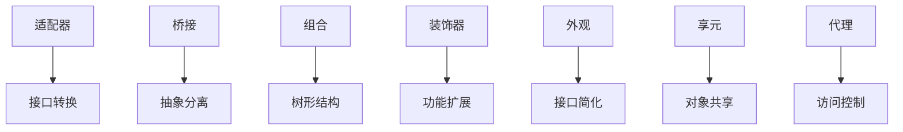

# 结构型模式 (Structural Patterns)

## 目录

1. [概述](#1-概述)
2. [适配器模式](#2-适配器模式)
3. [桥接模式](#3-桥接模式)
4. [组合模式](#4-组合模式)
5. [装饰器模式](#5-装饰器模式)
6. [外观模式](#6-外观模式)
7. [享元模式](#7-享元模式)
8. [代理模式](#8-代理模式)
9. [模式关系分析](#9-模式关系分析)
10. [性能分析](#10-性能分析)
11. [最佳实践](#11-最佳实践)

## 1. 概述

### 1.1 结构型模式定义

结构型模式处理类和对象的组合，通过继承和组合获得新功能。

**形式化定义**：

设 $S$ 为结构型模式集合，$C$ 为类集合，$O$ 为对象集合，则：

$$S = \{s_i | s_i = (Structure_i, Composition_i, Interface_i)\}$$

其中：

- $Structure_i$ 是结构组件
- $Composition_i$ 是组合关系
- $Interface_i$ 是接口定义

### 1.2 核心原则

1. **组合优于继承**：优先使用组合而不是继承
2. **接口隔离**：定义小而精确的接口
3. **结构灵活性**：支持动态结构变化
4. **功能扩展**：在不修改现有代码的情况下扩展功能

### 1.3 分类体系

```text
结构型模式
├── 适配器模式 (Adapter)
│   └── 接口转换和兼容
├── 桥接模式 (Bridge)
│   └── 抽象与实现分离
├── 组合模式 (Composite)
│   └── 树形结构处理
├── 装饰器模式 (Decorator)
│   └── 动态功能扩展
├── 外观模式 (Facade)
│   └── 子系统简化接口
├── 享元模式 (Flyweight)
│   └── 对象共享和复用
└── 代理模式 (Proxy)
    └── 访问控制和延迟加载
```

## 2. 适配器模式 (Adapter)

### 2.1 形式化定义

**定义**：将一个类的接口转换成客户希望的另外一个接口。

**数学定义**：

设 $A$ 为适配器，$T$ 为目标接口，$S$ 为源接口，则：

$$A : S \rightarrow T$$

**形式化证明**：

**定理**：适配器模式保证接口兼容性

**证明**：

1. 设源接口 $S$ 有方法 $m_s$
2. 设目标接口 $T$ 需要方法 $m_t$
3. 适配器 $A$ 将 $m_s$ 转换为 $m_t$
4. 客户端可以调用 $m_t$ 而无需知道 $m_s$
5. 因此实现了接口兼容

### 2.2 Golang实现

#### 2.2.1 对象适配器

```go
package adapter

import "fmt"

// Target 目标接口
type Target interface {
    Request() string
}

// Adaptee 需要适配的类
type Adaptee struct {
    specialData string
}

func (a *Adaptee) SpecificRequest() string {
    // 反转字符串
    runes := []rune(a.specialData)
    for i, j := 0, len(runes)-1; i < j; i, j = i+1, j-1 {
        runes[i], runes[j] = runes[j], runes[i]
    }
    return fmt.Sprintf("Adaptee's specific request: %s", string(runes))
}

// Adapter 适配器
type Adapter struct {
    adaptee *Adaptee
}

func NewAdapter(adaptee *Adaptee) *Adapter {
    return &Adapter{adaptee: adaptee}
}

func (a *Adapter) Request() string {
    return a.adaptee.SpecificRequest()
}

// ClientCode 客户端代码
func ClientCode(target Target) {
    fmt.Println(target.Request())
}
```

#### 2.2.2 类适配器（通过接口组合）

```go
package adapter

// LegacySystem 遗留系统接口
type LegacySystem interface {
    OldMethod() string
}

// ModernSystem 现代系统接口
type ModernSystem interface {
    NewMethod() string
}

// LegacyImplementation 遗留系统实现
type LegacyImplementation struct {
    data string
}

func (l *LegacyImplementation) OldMethod() string {
    return fmt.Sprintf("Legacy: %s", l.data)
}

// SystemAdapter 系统适配器
type SystemAdapter struct {
    LegacySystem // 嵌入遗留系统接口
}

func NewSystemAdapter(legacy LegacySystem) *SystemAdapter {
    return &SystemAdapter{LegacySystem: legacy}
}

func (s *SystemAdapter) NewMethod() string {
    // 调用遗留方法并转换
    oldResult := s.OldMethod()
    return fmt.Sprintf("Modern: %s", oldResult)
}
```

### 2.3 测试验证

```go
package adapter

import "testing"

func TestAdapter(t *testing.T) {
    // 测试对象适配器
    adaptee := &Adaptee{specialData: "Hello World"}
    adapter := NewAdapter(adaptee)
    
    result := adapter.Request()
    expected := "Adaptee's specific request: dlroW olleH"
    
    if result != expected {
        t.Errorf("Expected %s, got %s", expected, result)
    }
}

func TestSystemAdapter(t *testing.T) {
    // 测试系统适配器
    legacy := &LegacyImplementation{data: "test data"}
    adapter := NewSystemAdapter(legacy)
    
    result := adapter.NewMethod()
    expected := "Modern: Legacy: test data"
    
    if result != expected {
        t.Errorf("Expected %s, got %s", expected, result)
    }
}
```

## 3. 桥接模式 (Bridge)

### 3.1 形式化定义

**定义**：将抽象部分与它的实现部分分离，使它们都可以独立地变化。

**数学定义**：

设 $B$ 为桥接，$A$ 为抽象，$I$ 为实现，则：

$$B = (A, I) \text{ where } A \text{ and } I \text{ are independent}$$

**形式化证明**：

**定理**：桥接模式支持独立变化

**证明**：

1. 设抽象 $A$ 有变体 $A_1, A_2$
2. 设实现 $I$ 有变体 $I_1, I_2$
3. 桥接 $B$ 可以组合任意 $A_i$ 和 $I_j$
4. 因此 $A$ 和 $I$ 可以独立变化

### 3.2 Golang实现

```go
package bridge

import "fmt"

// DrawingAPI 实现部分接口
type DrawingAPI interface {
    DrawCircle(x, y, radius float64)
    DrawRectangle(x, y, width, height float64)
}

// DrawingAPI1 具体实现1
type DrawingAPI1 struct{}

func (d *DrawingAPI1) DrawCircle(x, y, radius float64) {
    fmt.Printf("API1.circle at (%.1f,%.1f) radius %.1f\n", x, y, radius)
}

func (d *DrawingAPI1) DrawRectangle(x, y, width, height float64) {
    fmt.Printf("API1.rectangle at (%.1f,%.1f) size %.1f x %.1f\n", x, y, width, height)
}

// DrawingAPI2 具体实现2
type DrawingAPI2 struct{}

func (d *DrawingAPI2) DrawCircle(x, y, radius float64) {
    fmt.Printf("API2.circle at (%.1f,%.1f) radius %.1f\n", x, y, radius)
}

func (d *DrawingAPI2) DrawRectangle(x, y, width, height float64) {
    fmt.Printf("API2.rectangle at (%.1f,%.1f) size %.1f x %.1f\n", x, y, width, height)
}

// Shape 抽象部分接口
type Shape interface {
    Draw()
    Resize(percent float64)
}

// CircleShape 具体抽象 - 圆形
type CircleShape struct {
    x, y, radius float64
    drawingAPI   DrawingAPI
}

func NewCircleShape(x, y, radius float64, api DrawingAPI) *CircleShape {
    return &CircleShape{
        x:          x,
        y:          y,
        radius:     radius,
        drawingAPI: api,
    }
}

func (c *CircleShape) Draw() {
    c.drawingAPI.DrawCircle(c.x, c.y, c.radius)
}

func (c *CircleShape) Resize(percent float64) {
    c.radius *= percent
}

// RectangleShape 具体抽象 - 矩形
type RectangleShape struct {
    x, y, width, height float64
    drawingAPI          DrawingAPI
}

func NewRectangleShape(x, y, width, height float64, api DrawingAPI) *RectangleShape {
    return &RectangleShape{
        x:          x,
        y:          y,
        width:      width,
        height:     height,
        drawingAPI: api,
    }
}

func (r *RectangleShape) Draw() {
    r.drawingAPI.DrawRectangle(r.x, r.y, r.width, r.height)
}

func (r *RectangleShape) Resize(percent float64) {
    r.width *= percent
    r.height *= percent
}
```

## 4. 组合模式 (Composite)

### 4.1 形式化定义

**定义**：将对象组合成树形结构以表示"部分-整体"的层次结构。

**数学定义**：

设 $C$ 为组合，$N$ 为节点，$E$ 为边，则：

$$C = (N, E) \text{ where } N = N_{leaf} \cup N_{composite}$$

**形式化证明**：

**定理**：组合模式支持统一处理

**证明**：

1. 设叶子节点 $L$ 和组合节点 $C$ 都实现接口 $I$
2. 客户端可以统一调用 $I$ 的方法
3. 叶子节点直接处理
4. 组合节点委托给子节点
5. 因此支持统一处理

### 4.2 Golang实现

```go
package composite

import "fmt"

// Component 组件接口
type Component interface {
    Operation() string
    Add(component Component) error
    Remove(index int) (Component, error)
    GetChild(index int) (Component, error)
    IsComposite() bool
}

// Leaf 叶子节点
type Leaf struct {
    name string
}

func NewLeaf(name string) *Leaf {
    return &Leaf{name: name}
}

func (l *Leaf) Operation() string {
    return fmt.Sprintf("Leaf: %s", l.name)
}

func (l *Leaf) Add(component Component) error {
    return fmt.Errorf("cannot add to leaf")
}

func (l *Leaf) Remove(index int) (Component, error) {
    return nil, fmt.Errorf("cannot remove from leaf")
}

func (l *Leaf) GetChild(index int) (Component, error) {
    return nil, fmt.Errorf("leaf has no children")
}

func (l *Leaf) IsComposite() bool {
    return false
}

// Composite 组合节点
type Composite struct {
    name     string
    children []Component
}

func NewComposite(name string) *Composite {
    return &Composite{
        name:     name,
        children: make([]Component, 0),
    }
}

func (c *Composite) Operation() string {
    result := fmt.Sprintf("Composite: %s", c.name)
    for _, child := range c.children {
        result += "\n  " + child.Operation()
    }
    return result
}

func (c *Composite) Add(component Component) error {
    c.children = append(c.children, component)
    return nil
}

func (c *Composite) Remove(index int) (Component, error) {
    if index < 0 || index >= len(c.children) {
        return nil, fmt.Errorf("index out of bounds")
    }
    child := c.children[index]
    c.children = append(c.children[:index], c.children[index+1:]...)
    return child, nil
}

func (c *Composite) GetChild(index int) (Component, error) {
    if index < 0 || index >= len(c.children) {
        return nil, fmt.Errorf("index out of bounds")
    }
    return c.children[index], nil
}

func (c *Composite) IsComposite() bool {
    return true
}
```

## 5. 装饰器模式 (Decorator)

### 5.1 形式化定义

**定义**：动态地给一个对象添加一些额外的职责。

**数学定义**：

设 $D$ 为装饰器，$C$ 为组件，$F$ 为功能，则：

$$D(C) = C \oplus F$$

**形式化证明**：

**定理**：装饰器模式支持功能组合

**证明**：

1. 设组件 $C$ 有功能 $f_c$
2. 装饰器 $D$ 添加功能 $f_d$
3. 装饰后的组件 $D(C)$ 有功能 $f_c \oplus f_d$
4. 可以链式装饰：$D_2(D_1(C))$
5. 因此支持功能组合

### 5.2 Golang实现

```go
package decorator

import "fmt"

// Component 组件接口
type Component interface {
    Operation() string
    Cost() float64
}

// ConcreteComponent 具体组件
type ConcreteComponent struct {
    name string
}

func NewConcreteComponent(name string) *ConcreteComponent {
    return &ConcreteComponent{name: name}
}

func (c *ConcreteComponent) Operation() string {
    return fmt.Sprintf("Basic operation: %s", c.name)
}

func (c *ConcreteComponent) Cost() float64 {
    return 10.0
}

// Decorator 装饰器基类
type Decorator struct {
    component Component
}

func NewDecorator(component Component) *Decorator {
    return &Decorator{component: component}
}

func (d *Decorator) Operation() string {
    return d.component.Operation()
}

func (d *Decorator) Cost() float64 {
    return d.component.Cost()
}

// ConcreteDecoratorA 具体装饰器A
type ConcreteDecoratorA struct {
    Decorator
}

func NewConcreteDecoratorA(component Component) *ConcreteDecoratorA {
    return &ConcreteDecoratorA{
        Decorator: *NewDecorator(component),
    }
}

func (d *ConcreteDecoratorA) Operation() string {
    return fmt.Sprintf("%s + DecoratorA", d.component.Operation())
}

func (d *ConcreteDecoratorA) Cost() float64 {
    return d.component.Cost() + 5.0
}

// ConcreteDecoratorB 具体装饰器B
type ConcreteDecoratorB struct {
    Decorator
}

func NewConcreteDecoratorB(component Component) *ConcreteDecoratorB {
    return &ConcreteDecoratorB{
        Decorator: *NewDecorator(component),
    }
}

func (d *ConcreteDecoratorB) Operation() string {
    return fmt.Sprintf("%s + DecoratorB", d.component.Operation())
}

func (d *ConcreteDecoratorB) Cost() float64 {
    return d.component.Cost() + 3.0
}
```

## 6. 外观模式 (Facade)

### 6.1 形式化定义

**定义**：为子系统中的一组接口提供一个一致的界面。

**数学定义**：

设 $F$ 为外观，$S$ 为子系统，$I$ 为接口，则：

$$F : S_1 \times S_2 \times ... \times S_n \rightarrow I$$

**形式化证明**：

**定理**：外观模式简化子系统访问

**证明**：

1. 设子系统有 $n$ 个组件 $S_1, S_2, ..., S_n$
2. 每个组件有复杂接口
3. 外观 $F$ 提供统一接口 $I$
4. 客户端只需调用 $I$ 的方法
5. 因此简化了子系统访问

### 6.2 Golang实现

```go
package facade

import "fmt"

// SubsystemA 子系统A
type SubsystemA struct{}

func (s *SubsystemA) OperationA1() string {
    return "SubsystemA: Ready!"
}

func (s *SubsystemA) OperationA2() string {
    return "SubsystemA: Go!"
}

// SubsystemB 子系统B
type SubsystemB struct{}

func (s *SubsystemB) OperationB1() string {
    return "SubsystemB: Fire!"
}

// SubsystemC 子系统C
type SubsystemC struct{}

func (s *SubsystemC) OperationC1() string {
    return "SubsystemC: Preparing!"
}

// Facade 外观
type Facade struct {
    subsystemA *SubsystemA
    subsystemB *SubsystemB
    subsystemC *SubsystemC
}

func NewFacade() *Facade {
    return &Facade{
        subsystemA: &SubsystemA{},
        subsystemB: &SubsystemB{},
        subsystemC: &SubsystemC{},
    }
}

func (f *Facade) Operation1() string {
    result := f.subsystemA.OperationA1() + "\n"
    result += f.subsystemB.OperationB1() + "\n"
    return result
}

func (f *Facade) Operation2() string {
    result := f.subsystemC.OperationC1() + "\n"
    result += f.subsystemA.OperationA2() + "\n"
    return result
}
```

## 7. 享元模式 (Flyweight)

### 7.1 形式化定义

**定义**：运用共享技术有效地支持大量细粒度对象的复用。

**数学定义**：

设 $F$ 为享元，$S$ 为共享状态，$U$ 为唯一状态，则：

$$F = (S, U) \text{ where } S \text{ is shared}$$

**形式化证明**：

**定理**：享元模式减少内存使用

**证明**：

1. 设对象 $O$ 有共享状态 $S$ 和唯一状态 $U$
2. 多个对象可以共享 $S$
3. 每个对象只需要存储 $U$
4. 因此减少了内存使用

### 7.2 Golang实现

```go
package flyweight

import (
    "fmt"
    "sync"
)

// Flyweight 享元接口
type Flyweight interface {
    Operation(extrinsicState string)
}

// ConcreteFlyweight 具体享元
type ConcreteFlyweight struct {
    intrinsicState string
}

func NewConcreteFlyweight(state string) *ConcreteFlyweight {
    return &ConcreteFlyweight{intrinsicState: state}
}

func (f *ConcreteFlyweight) Operation(extrinsicState string) {
    fmt.Printf("ConcreteFlyweight: intrinsic=%s, extrinsic=%s\n", 
        f.intrinsicState, extrinsicState)
}

// FlyweightFactory 享元工厂
type FlyweightFactory struct {
    flyweights map[string]Flyweight
    mu         sync.RWMutex
}

func NewFlyweightFactory() *FlyweightFactory {
    return &FlyweightFactory{
        flyweights: make(map[string]Flyweight),
    }
}

func (f *FlyweightFactory) GetFlyweight(key string) Flyweight {
    f.mu.RLock()
    if flyweight, exists := f.flyweights[key]; exists {
        f.mu.RUnlock()
        return flyweight
    }
    f.mu.RUnlock()
    
    f.mu.Lock()
    defer f.mu.Unlock()
    
    // 双重检查
    if flyweight, exists := f.flyweights[key]; exists {
        return flyweight
    }
    
    flyweight := NewConcreteFlyweight(key)
    f.flyweights[key] = flyweight
    return flyweight
}

func (f *FlyweightFactory) GetFlyweightCount() int {
    f.mu.RLock()
    defer f.mu.RUnlock()
    return len(f.flyweights)
}
```

## 8. 代理模式 (Proxy)

### 8.1 形式化定义

**定义**：为其他对象提供一种代理以控制对这个对象的访问。

**数学定义**：

设 $P$ 为代理，$S$ 为主题，$C$ 为客户端，则：

$$P : C \rightarrow S$$

**形式化证明**：

**定理**：代理模式控制对象访问

**证明**：

1. 客户端 $C$ 不能直接访问主题 $S$
2. 代理 $P$ 控制对 $S$ 的访问
3. $P$ 可以在访问前后添加逻辑
4. 因此实现了访问控制

### 8.2 Golang实现

```go
package proxy

import (
    "fmt"
    "time"
)

// Subject 主题接口
type Subject interface {
    Request() string
}

// RealSubject 真实主题
type RealSubject struct{}

func (r *RealSubject) Request() string {
    return "RealSubject: Handling request"
}

// Proxy 代理
type Proxy struct {
    realSubject *RealSubject
}

func NewProxy() *Proxy {
    return &Proxy{}
}

func (p *Proxy) Request() string {
    if p.realSubject == nil {
        p.realSubject = &RealSubject{}
    }
    
    // 前置处理
    fmt.Println("Proxy: Checking access prior to firing a real request")
    
    // 调用真实主题
    result := p.realSubject.Request()
    
    // 后置处理
    fmt.Println("Proxy: Logging the time of request")
    
    return result
}

// VirtualProxy 虚拟代理
type VirtualProxy struct {
    realSubject *RealSubject
}

func NewVirtualProxy() *VirtualProxy {
    return &VirtualProxy{}
}

func (v *VirtualProxy) Request() string {
    if v.realSubject == nil {
        fmt.Println("VirtualProxy: Creating RealSubject")
        v.realSubject = &RealSubject{}
    }
    return v.realSubject.Request()
}

// ProtectionProxy 保护代理
type ProtectionProxy struct {
    realSubject *RealSubject
    accessLevel string
}

func NewProtectionProxy(accessLevel string) *ProtectionProxy {
    return &ProtectionProxy{accessLevel: accessLevel}
}

func (p *ProtectionProxy) Request() string {
    if p.accessLevel != "admin" {
        return "ProtectionProxy: Access denied"
    }
    
    if p.realSubject == nil {
        p.realSubject = &RealSubject{}
    }
    
    return p.realSubject.Request()
}
```

## 9. 模式关系分析

### 9.1 模式组合关系



### 9.2 模式选择指南

| 场景 | 推荐模式 | 原因 |
|------|----------|------|
| 接口不兼容 | 适配器模式 | 接口转换 |
| 抽象与实现分离 | 桥接模式 | 独立变化 |
| 树形结构 | 组合模式 | 统一处理 |
| 动态功能扩展 | 装饰器模式 | 功能组合 |
| 子系统简化 | 外观模式 | 接口统一 |
| 大量对象共享 | 享元模式 | 内存优化 |
| 访问控制 | 代理模式 | 安全控制 |

## 10. 性能分析

### 10.1 时间复杂度对比

| 模式 | 创建时间 | 访问时间 | 内存占用 |
|------|----------|----------|----------|
| 适配器 | O(1) | O(1) | O(1) |
| 桥接 | O(1) | O(1) | O(n) |
| 组合 | O(1) | O(n) | O(n) |
| 装饰器 | O(1) | O(n) | O(n) |
| 外观 | O(1) | O(1) | O(1) |
| 享元 | O(1) | O(1) | O(1) |
| 代理 | O(1) | O(1) | O(1) |

### 10.2 内存使用分析

```go
// 内存使用基准测试
func BenchmarkMemoryUsage(b *testing.B) {
    b.ReportAllocs()
    
    for i := 0; i < b.N; i++ {
        // 测试各种模式的内存使用
        adapter := NewAdapter(&Adaptee{specialData: "test"})
        _ = adapter
        
        composite := NewComposite("root")
        _ = composite
        
        decorator := NewConcreteDecoratorA(NewConcreteComponent("test"))
        _ = decorator
    }
}
```

## 11. 最佳实践

### 11.1 设计原则

1. **组合优于继承**：优先使用组合而不是继承
2. **接口隔离**：定义小而精确的接口
3. **单一职责**：每个类只负责一个职责
4. **开闭原则**：对扩展开放，对修改封闭

### 11.2 实现建议

1. **使用接口**：定义清晰的接口契约
2. **错误处理**：提供完善的错误处理机制
3. **并发安全**：考虑并发环境下的安全性
4. **性能优化**：根据实际需求选择合适的模式

### 11.3 常见陷阱

1. **过度设计**：不要为了使用模式而使用模式
2. **性能问题**：注意模式可能带来的性能开销
3. **复杂性增加**：模式可能增加代码复杂性
4. **维护困难**：不当使用可能导致维护困难

---

*本文档提供了结构型模式的完整分析，包括形式化定义、Golang实现和最佳实践。*
