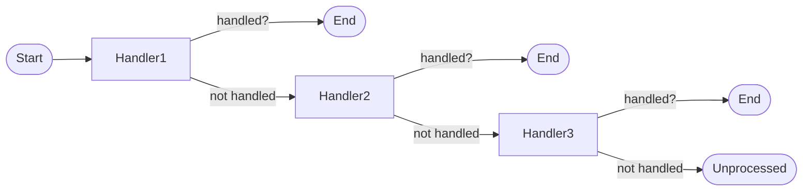
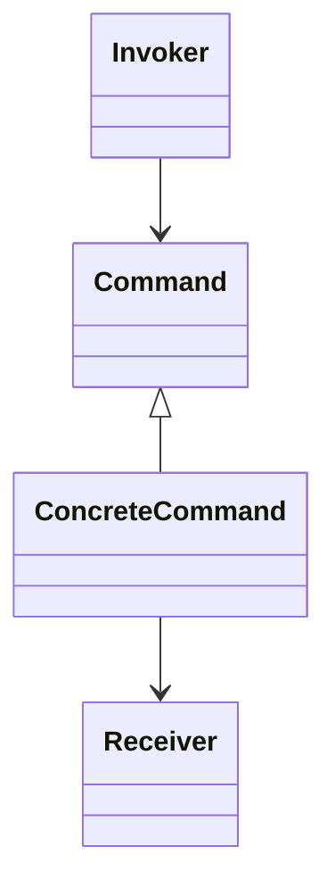

# 行为型设计模式分析

## 目录

1. [概述](#1-概述)
2. [行为型模式形式化定义](#2-行为型模式形式化定义)
3. [责任链模式 (Chain of Responsibility)](#3-责任链模式-chain-of-responsibility)
4. [命令模式 (Command)](#4-命令模式-command)
5. [后续模式占位](#5-后续模式占位)

---

## 1. 概述

行为型模式关注对象之间的通信与职责分配，强调算法和职责的封装与解耦。在Golang中，行为型模式通过接口、组合和函数式编程实现，充分利用Go语言的简洁性和并发特性。

### 1.1 行为型模式分类

行为型模式集合可以形式化定义为：

$$C_{beh} = \{ChainOfResponsibility, Command, Interpreter, Iterator, Mediator, Memento, Observer, State, Strategy, TemplateMethod, Visitor\}$$

---

## 2. 行为型模式形式化定义

行为型模式系统可以定义为五元组：

$$\mathcal{BP} = (P_{beh}, I_{beh}, F_{beh}, E_{beh}, Q_{beh})$$

其中：
- **$P_{beh}$** - 行为型模式集合
- **$I_{beh}$** - 行为接口集合
- **$F_{beh}$** - 行为函数集合
- **$E_{beh}$** - 评估指标集合
- **$Q_{beh}$** - 质量保证集合

---

## 3. 责任链模式 (Chain of Responsibility)

### 3.1 形式化定义

责任链模式使多个对象都有机会处理请求，将这些对象连成一条链，并沿着这条链传递请求，直到有对象处理它为止。

**数学定义**:
$$Chain : Request \rightarrow Handler_1 \rightarrow Handler_2 \rightarrow ... \rightarrow Handler_n$$

**状态机/流程图**:


### 3.2 Golang实现

```go
package chain_of_responsibility

type Handler interface {
    SetNext(handler Handler)
    Handle(request string) (handled bool)
}

type BaseHandler struct {
    next Handler
}

func (b *BaseHandler) SetNext(handler Handler) {
    b.next = handler
}

func (b *BaseHandler) Handle(request string) bool {
    if b.next != nil {
        return b.next.Handle(request)
    }
    return false
}

type ConcreteHandlerA struct {
    BaseHandler
}

func (h *ConcreteHandlerA) Handle(request string) bool {
    if request == "A" {
        // 处理请求A
        return true
    }
    return h.BaseHandler.Handle(request)
}

type ConcreteHandlerB struct {
    BaseHandler
}

func (h *ConcreteHandlerB) Handle(request string) bool {
    if request == "B" {
        // 处理请求B
        return true
    }
    return h.BaseHandler.Handle(request)
}
```

### 3.3 性能分析

- **时间复杂度**: $O(n)$，n为链上处理者数量
- **空间复杂度**: $O(n)$，链结构存储
- **灵活性**: 支持动态添加/移除处理者
- **解耦性**: 请求发送者与处理者解耦

---

## 4. 命令模式 (Command)

### 4.1 形式化定义

命令模式将一个请求封装为一个对象，从而使你可用不同的请求对客户进行参数化。

**数学定义**:
$$Command : (Receiver, Action) \rightarrow CommandObject$$

**类图关系**:


### 4.2 Golang实现

```go
package command

type Command interface {
    Execute() string
}

type Receiver struct {
    state string
}

func (r *Receiver) Action(action string) string {
    r.state = action
    return "Receiver: " + action
}

type ConcreteCommand struct {
    receiver *Receiver
    action   string
}

func (c *ConcreteCommand) Execute() string {
    return c.receiver.Action(c.action)
}

type Invoker struct {
    commands []Command
}

func (i *Invoker) AddCommand(cmd Command) {
    i.commands = append(i.commands, cmd)
}

func (i *Invoker) ExecuteAll() []string {
    var results []string
    for _, cmd := range i.commands {
        results = append(results, cmd.Execute())
    }
    return results
}
```

### 4.3 性能分析

- **时间复杂度**: $O(n)$，n为命令数量
- **空间复杂度**: $O(n)$，命令对象存储
- **可扩展性**: 支持撤销/重做、队列化命令
- **解耦性**: 调用者与执行者解耦

---

## 5. 后续模式占位

- 解释器模式（Interpreter）
- 迭代器模式（Iterator）
- 中介者模式（Mediator）
- 备忘录模式（Memento）
- 观察者模式（Observer）
- 状态模式（State）
- 策略模式（Strategy）
- 模板方法模式（Template Method）
- 访问者模式（Visitor）

---

**最后更新**: 2024-12-19  
**版本**: 1.0.0  
**状态**: 行为型模式分析进行中
