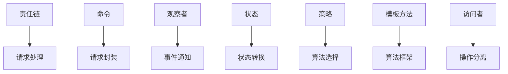

# 行为型模式 (Behavioral Patterns)

## 目录

1. [概述](#1-概述)
2. [责任链模式](#2-责任链模式)
3. [命令模式](#3-命令模式)
4. [解释器模式](#4-解释器模式)
5. [迭代器模式](#5-迭代器模式)
6. [中介者模式](#6-中介者模式)
7. [备忘录模式](#7-备忘录模式)
8. [观察者模式](#8-观察者模式)
9. [状态模式](#9-状态模式)
10. [策略模式](#10-策略模式)
11. [模板方法模式](#11-模板方法模式)
12. [访问者模式](#12-访问者模式)
13. [模式关系分析](#13-模式关系分析)
14. [性能分析](#14-性能分析)
15. [最佳实践](#15-最佳实践)

## 1. 概述

### 1.1 行为型模式定义

行为型模式处理类或对象之间的通信和职责分配。

**形式化定义**：

设 $B$ 为行为型模式集合，$O$ 为对象集合，$M$ 为消息集合，则：

$$B = \{b_i | b_i = (Object_i, Message_i, Behavior_i)\}$$

其中：
- $Object_i$ 是参与对象
- $Message_i$ 是消息传递
- $Behavior_i$ 是行为定义

### 1.2 核心原则

1. **职责分离**：将不同的职责分配给不同的对象
2. **松耦合**：减少对象间的直接依赖
3. **可扩展性**：支持动态添加新的行为
4. **可维护性**：易于修改和扩展

### 1.3 分类体系

```
行为型模式
├── 责任链模式 (Chain of Responsibility)
│   └── 请求处理链
├── 命令模式 (Command)
│   └── 请求封装
├── 解释器模式 (Interpreter)
│   └── 语法解释
├── 迭代器模式 (Iterator)
│   └── 集合遍历
├── 中介者模式 (Mediator)
│   └── 对象协调
├── 备忘录模式 (Memento)
│   └── 状态保存
├── 观察者模式 (Observer)
│   └── 事件通知
├── 状态模式 (State)
│   └── 状态转换
├── 策略模式 (Strategy)
│   └── 算法选择
├── 模板方法模式 (Template Method)
│   └── 算法框架
└── 访问者模式 (Visitor)
    └── 操作分离
```

## 2. 责任链模式 (Chain of Responsibility)

### 2.1 形式化定义

**定义**：将请求的发送者和接收者解耦，沿着链传递请求直到被处理。

**数学定义**：

设 $C$ 为责任链，$H$ 为处理器，$R$ 为请求，则：

$$C = H_1 \rightarrow H_2 \rightarrow ... \rightarrow H_n$$

**形式化证明**：

**定理**：责任链模式保证请求处理

**证明**：
1. 设请求 $R$ 进入责任链 $C$
2. 每个处理器 $H_i$ 决定是否处理 $R$
3. 如果 $H_i$ 不处理，则传递给 $H_{i+1}$
4. 最终 $R$ 被某个处理器处理或到达链尾
5. 因此保证了请求处理

### 2.2 Golang实现

```go
package chainofresponsibility

import "fmt"

// Handler 处理器接口
type Handler interface {
    SetNext(handler Handler) Handler
    Handle(request string) string
}

// BaseHandler 基础处理器
type BaseHandler struct {
    nextHandler Handler
}

func (h *BaseHandler) SetNext(handler Handler) Handler {
    h.nextHandler = handler
    return handler
}

func (h *BaseHandler) Handle(request string) string {
    if h.nextHandler != nil {
        return h.nextHandler.Handle(request)
    }
    return ""
}

// ConcreteHandlerA 具体处理器A
type ConcreteHandlerA struct {
    BaseHandler
}

func (h *ConcreteHandlerA) Handle(request string) string {
    if request == "A" {
        return fmt.Sprintf("ConcreteHandlerA: Handling request %s", request)
    }
    return h.BaseHandler.Handle(request)
}

// ConcreteHandlerB 具体处理器B
type ConcreteHandlerB struct {
    BaseHandler
}

func (h *ConcreteHandlerB) Handle(request string) string {
    if request == "B" {
        return fmt.Sprintf("ConcreteHandlerB: Handling request %s", request)
    }
    return h.BaseHandler.Handle(request)
}

// ConcreteHandlerC 具体处理器C
type ConcreteHandlerC struct {
    BaseHandler
}

func (h *ConcreteHandlerC) Handle(request string) string {
    if request == "C" {
        return fmt.Sprintf("ConcreteHandlerC: Handling request %s", request)
    }
    return h.BaseHandler.Handle(request)
}

// ClientCode 客户端代码
func ClientCode(handler Handler) {
    requests := []string{"A", "B", "C", "D"}
    
    for _, request := range requests {
        fmt.Printf("Client: Who wants a %s?\n", request)
        result := handler.Handle(request)
        if result != "" {
            fmt.Printf("  %s\n", result)
        } else {
            fmt.Printf("  %s was left untouched.\n", request)
        }
    }
}
```

### 2.3 测试验证

```go
package chainofresponsibility

import "testing"

func TestChainOfResponsibility(t *testing.T) {
    // 创建处理器链
    handlerA := &ConcreteHandlerA{}
    handlerB := &ConcreteHandlerB{}
    handlerC := &ConcreteHandlerC{}
    
    handlerA.SetNext(handlerB).SetNext(handlerC)
    
    // 测试请求处理
    result := handlerA.Handle("A")
    expected := "ConcreteHandlerA: Handling request A"
    if result != expected {
        t.Errorf("Expected %s, got %s", expected, result)
    }
    
    result = handlerA.Handle("B")
    expected = "ConcreteHandlerB: Handling request B"
    if result != expected {
        t.Errorf("Expected %s, got %s", expected, result)
    }
    
    result = handlerA.Handle("D")
    if result != "" {
        t.Errorf("Expected empty string, got %s", result)
    }
}
```

## 3. 命令模式 (Command)

### 3.1 形式化定义

**定义**：将请求封装成对象，从而可以用不同的请求对客户进行参数化。

**数学定义**：

设 $C$ 为命令，$I$ 为调用者，$R$ 为接收者，则：

$$C = (I, R, Action)$$

**形式化证明**：

**定理**：命令模式支持请求封装

**证明**：
1. 设请求 $R$ 需要执行动作 $A$
2. 命令 $C$ 封装了 $R$ 和 $A$
3. 调用者 $I$ 可以存储和传递 $C$
4. 可以在不同时间执行 $C$
5. 因此支持请求封装

### 3.2 Golang实现

```go
package command

import "fmt"

// Command 命令接口
type Command interface {
    Execute() string
}

// Receiver 接收者
type Receiver struct {
    name string
}

func NewReceiver(name string) *Receiver {
    return &Receiver{name: name}
}

func (r *Receiver) ActionA() string {
    return fmt.Sprintf("Receiver %s: Action A", r.name)
}

func (r *Receiver) ActionB() string {
    return fmt.Sprintf("Receiver %s: Action B", r.name)
}

// ConcreteCommandA 具体命令A
type ConcreteCommandA struct {
    receiver *Receiver
}

func NewConcreteCommandA(receiver *Receiver) *ConcreteCommandA {
    return &ConcreteCommandA{receiver: receiver}
}

func (c *ConcreteCommandA) Execute() string {
    return c.receiver.ActionA()
}

// ConcreteCommandB 具体命令B
type ConcreteCommandB struct {
    receiver *Receiver
}

func NewConcreteCommandB(receiver *Receiver) *ConcreteCommandB {
    return &ConcreteCommandB{receiver: receiver}
}

func (c *ConcreteCommandB) Execute() string {
    return c.receiver.ActionB()
}

// Invoker 调用者
type Invoker struct {
    commands []Command
}

func NewInvoker() *Invoker {
    return &Invoker{
        commands: make([]Command, 0),
    }
}

func (i *Invoker) AddCommand(command Command) {
    i.commands = append(i.commands, command)
}

func (i *Invoker) ExecuteCommands() []string {
    results := make([]string, 0)
    for _, command := range i.commands {
        results = append(results, command.Execute())
    }
    return results
}

func (i *Invoker) Clear() {
    i.commands = make([]Command, 0)
}
```

## 4. 解释器模式 (Interpreter)

### 4.1 形式化定义

**定义**：为语言创建解释器，定义语法表示和解释方法。

**数学定义**：

设 $I$ 为解释器，$E$ 为表达式，$C$ 为上下文，则：

$$I : E \times C \rightarrow Result$$

**形式化证明**：

**定理**：解释器模式支持语法解释

**证明**：
1. 设表达式 $E$ 有语法结构
2. 解释器 $I$ 解析 $E$ 的语法
3. 在上下文 $C$ 中执行 $E$
4. 返回执行结果 $Result$
5. 因此支持语法解释

### 4.2 Golang实现

```go
package interpreter

import (
    "fmt"
    "strconv"
    "strings"
)

// Expression 表达式接口
type Expression interface {
    Interpret(context map[string]int) int
}

// NumberExpression 数字表达式
type NumberExpression struct {
    number int
}

func NewNumberExpression(number int) *NumberExpression {
    return &NumberExpression{number: number}
}

func (n *NumberExpression) Interpret(context map[string]int) int {
    return n.number
}

// VariableExpression 变量表达式
type VariableExpression struct {
    variable string
}

func NewVariableExpression(variable string) *VariableExpression {
    return &VariableExpression{variable: variable}
}

func (v *VariableExpression) Interpret(context map[string]int) int {
    return context[v.variable]
}

// AddExpression 加法表达式
type AddExpression struct {
    left  Expression
    right Expression
}

func NewAddExpression(left, right Expression) *AddExpression {
    return &AddExpression{left: left, right: right}
}

func (a *AddExpression) Interpret(context map[string]int) int {
    return a.left.Interpret(context) + a.right.Interpret(context)
}

// SubtractExpression 减法表达式
type SubtractExpression struct {
    left  Expression
    right Expression
}

func NewSubtractExpression(left, right Expression) *SubtractExpression {
    return &SubtractExpression{left: left, right: right}
}

func (s *SubtractExpression) Interpret(context map[string]int) int {
    return s.left.Interpret(context) - s.right.Interpret(context)
}

// Parser 解析器
type Parser struct{}

func (p *Parser) Parse(expression string) Expression {
    tokens := strings.Fields(expression)
    return p.parseTokens(tokens)
}

func (p *Parser) parseTokens(tokens []string) Expression {
    if len(tokens) == 1 {
        if num, err := strconv.Atoi(tokens[0]); err == nil {
            return NewNumberExpression(num)
        }
        return NewVariableExpression(tokens[0])
    }
    
    if len(tokens) == 3 {
        left := p.parseTokens([]string{tokens[0]})
        right := p.parseTokens([]string{tokens[2]})
        
        switch tokens[1] {
        case "+":
            return NewAddExpression(left, right)
        case "-":
            return NewSubtractExpression(left, right)
        }
    }
    
    return NewNumberExpression(0)
}
```

## 5. 迭代器模式 (Iterator)

### 5.1 形式化定义

**定义**：提供一种方法顺序访问聚合对象中的元素，而不暴露其内部表示。

**数学定义**：

设 $I$ 为迭代器，$C$ 为集合，$E$ 为元素，则：

$$I : C \rightarrow E^*$$

**形式化证明**：

**定理**：迭代器模式支持顺序访问

**证明**：
1. 设集合 $C$ 包含元素 $E_1, E_2, ..., E_n$
2. 迭代器 $I$ 提供访问方法
3. $I$ 维护当前位置
4. 可以顺序访问所有元素
5. 因此支持顺序访问

### 5.2 Golang实现

```go
package iterator

import "fmt"

// Iterator 迭代器接口
type Iterator interface {
    HasNext() bool
    Next() interface{}
    Current() interface{}
}

// Aggregate 聚合接口
type Aggregate interface {
    CreateIterator() Iterator
}

// ConcreteAggregate 具体聚合
type ConcreteAggregate struct {
    items []interface{}
}

func NewConcreteAggregate() *ConcreteAggregate {
    return &ConcreteAggregate{
        items: make([]interface{}, 0),
    }
}

func (a *ConcreteAggregate) AddItem(item interface{}) {
    a.items = append(a.items, item)
}

func (a *ConcreteAggregate) CreateIterator() Iterator {
    return NewConcreteIterator(a)
}

// ConcreteIterator 具体迭代器
type ConcreteIterator struct {
    aggregate *ConcreteAggregate
    index     int
}

func NewConcreteIterator(aggregate *ConcreteAggregate) *ConcreteIterator {
    return &ConcreteIterator{
        aggregate: aggregate,
        index:     0,
    }
}

func (i *ConcreteIterator) HasNext() bool {
    return i.index < len(i.aggregate.items)
}

func (i *ConcreteIterator) Next() interface{} {
    if i.HasNext() {
        item := i.aggregate.items[i.index]
        i.index++
        return item
    }
    return nil
}

func (i *ConcreteIterator) Current() interface{} {
    if i.index < len(i.aggregate.items) {
        return i.aggregate.items[i.index]
    }
    return nil
}

// ClientCode 客户端代码
func ClientCode(aggregate Aggregate) {
    iterator := aggregate.CreateIterator()
    
    fmt.Println("Iterating over collection:")
    for iterator.HasNext() {
        item := iterator.Next()
        fmt.Printf("  %v\n", item)
    }
}
```

## 6. 中介者模式 (Mediator)

### 6.1 形式化定义

**定义**：定义一个对象封装对象间的交互。

**数学定义**：

设 $M$ 为中介者，$O$ 为对象集合，$I$ 为交互，则：

$$M : O \times O \rightarrow I$$

**形式化证明**：

**定理**：中介者模式减少对象耦合

**证明**：
1. 设对象 $O_1, O_2, ..., O_n$ 需要交互
2. 没有中介者时，每个对象直接依赖其他对象
3. 中介者 $M$ 封装所有交互
4. 对象只依赖中介者
5. 因此减少了对象耦合

### 6.2 Golang实现

```go
package mediator

import "fmt"

// Mediator 中介者接口
type Mediator interface {
    Notify(sender Component, event string)
}

// Component 组件接口
type Component interface {
    SetMediator(mediator Mediator)
    NotifyMediator(event string)
}

// BaseComponent 基础组件
type BaseComponent struct {
    mediator Mediator
}

func (c *BaseComponent) SetMediator(mediator Mediator) {
    c.mediator = mediator
}

func (c *BaseComponent) NotifyMediator(event string) {
    if c.mediator != nil {
        c.mediator.Notify(c, event)
    }
}

// ConcreteComponentA 具体组件A
type ConcreteComponentA struct {
    BaseComponent
}

func (c *ConcreteComponentA) DoA() {
    fmt.Println("Component A does A.")
    c.NotifyMediator("A")
}

func (c *ConcreteComponentA) DoD() {
    fmt.Println("Component A does D.")
    c.NotifyMediator("D")
}

// ConcreteComponentB 具体组件B
type ConcreteComponentB struct {
    BaseComponent
}

func (c *ConcreteComponentB) DoB() {
    fmt.Println("Component B does B.")
    c.NotifyMediator("B")
}

func (c *ConcreteComponentB) DoC() {
    fmt.Println("Component B does C.")
    c.NotifyMediator("C")
}

// ConcreteMediator 具体中介者
type ConcreteMediator struct {
    componentA *ConcreteComponentA
    componentB *ConcreteComponentB
}

func NewConcreteMediator() *ConcreteMediator {
    return &ConcreteMediator{}
}

func (m *ConcreteMediator) SetComponentA(component *ConcreteComponentA) {
    m.componentA = component
    component.SetMediator(m)
}

func (m *ConcreteMediator) SetComponentB(component *ConcreteComponentB) {
    m.componentB = component
    component.SetMediator(m)
}

func (m *ConcreteMediator) Notify(sender Component, event string) {
    switch event {
    case "A":
        fmt.Println("Mediator reacts on A and triggers following operations:")
        m.componentB.DoC()
    case "D":
        fmt.Println("Mediator reacts on D and triggers following operations:")
        m.componentA.DoA()
        m.componentB.DoB()
    }
}
```

## 7. 备忘录模式 (Memento)

### 7.1 形式化定义

**定义**：在不破坏封装的前提下，捕获并外部化对象的内部状态。

**数学定义**：

设 $M$ 为备忘录，$S$ 为状态，$O$ 为原发器，则：

$$M = (S, O)$$

**形式化证明**：

**定理**：备忘录模式支持状态保存

**证明**：
1. 设对象 $O$ 有状态 $S$
2. 备忘录 $M$ 保存状态 $S$ 的副本
3. 可以在需要时恢复 $S$
4. 不影响 $O$ 的封装性
5. 因此支持状态保存

### 7.2 Golang实现

```go
package memento

import "fmt"

// Memento 备忘录
type Memento struct {
    state string
}

func NewMemento(state string) *Memento {
    return &Memento{state: state}
}

func (m *Memento) GetState() string {
    return m.state
}

// Originator 原发器
type Originator struct {
    state string
}

func NewOriginator(state string) *Originator {
    return &Originator{state: state}
}

func (o *Originator) SetState(state string) {
    o.state = state
}

func (o *Originator) GetState() string {
    return o.state
}

func (o *Originator) Save() *Memento {
    return NewMemento(o.state)
}

func (o *Originator) Restore(memento *Memento) {
    o.state = memento.GetState()
}

// Caretaker 管理者
type Caretaker struct {
    mementos []*Memento
}

func NewCaretaker() *Caretaker {
    return &Caretaker{
        mementos: make([]*Memento, 0),
    }
}

func (c *Caretaker) AddMemento(memento *Memento) {
    c.mementos = append(c.mementos, memento)
}

func (c *Caretaker) GetMemento(index int) *Memento {
    if index >= 0 && index < len(c.mementos) {
        return c.mementos[index]
    }
    return nil
}
```

## 8. 观察者模式 (Observer)

### 8.1 形式化定义

**定义**：定义对象间的一对多依赖关系，当一个对象状态改变时，所有依赖者都得到通知。

**数学定义**：

设 $S$ 为主题，$O$ 为观察者集合，$N$ 为通知，则：

$$S \rightarrow O_1, O_2, ..., O_n$$

**形式化证明**：

**定理**：观察者模式支持事件通知

**证明**：
1. 设主题 $S$ 有状态变化
2. $S$ 通知所有观察者 $O_1, O_2, ..., O_n$
3. 每个观察者 $O_i$ 收到通知
4. $O_i$ 可以更新自己的状态
5. 因此支持事件通知

### 8.2 Golang实现

```go
package observer

import (
    "fmt"
    "sync"
)

// Observer 观察者接口
type Observer interface {
    Update(subject Subject)
}

// Subject 主题接口
type Subject interface {
    Attach(observer Observer)
    Detach(observer Observer)
    Notify()
    GetState() string
    SetState(state string)
}

// ConcreteSubject 具体主题
type ConcreteSubject struct {
    observers []Observer
    state     string
    mu        sync.RWMutex
}

func NewConcreteSubject() *ConcreteSubject {
    return &ConcreteSubject{
        observers: make([]Observer, 0),
    }
}

func (s *ConcreteSubject) Attach(observer Observer) {
    s.mu.Lock()
    defer s.mu.Unlock()
    s.observers = append(s.observers, observer)
}

func (s *ConcreteSubject) Detach(observer Observer) {
    s.mu.Lock()
    defer s.mu.Unlock()
    for i, obs := range s.observers {
        if obs == observer {
            s.observers = append(s.observers[:i], s.observers[i+1:]...)
            break
        }
    }
}

func (s *ConcreteSubject) Notify() {
    s.mu.RLock()
    defer s.mu.RUnlock()
    for _, observer := range s.observers {
        observer.Update(s)
    }
}

func (s *ConcreteSubject) GetState() string {
    s.mu.RLock()
    defer s.mu.RUnlock()
    return s.state
}

func (s *ConcreteSubject) SetState(state string) {
    s.mu.Lock()
    s.state = state
    s.mu.Unlock()
    s.Notify()
}

// ConcreteObserverA 具体观察者A
type ConcreteObserverA struct {
    name string
}

func NewConcreteObserverA(name string) *ConcreteObserverA {
    return &ConcreteObserverA{name: name}
}

func (o *ConcreteObserverA) Update(subject Subject) {
    fmt.Printf("Observer %s: Reacted to the event. State: %s\n", 
        o.name, subject.GetState())
}

// ConcreteObserverB 具体观察者B
type ConcreteObserverB struct {
    name string
}

func NewConcreteObserverB(name string) *ConcreteObserverB {
    return &ConcreteObserverB{name: name}
}

func (o *ConcreteObserverB) Update(subject Subject) {
    fmt.Printf("Observer %s: Reacted to the event. State: %s\n", 
        o.name, subject.GetState())
}
```

## 9. 状态模式 (State)

### 9.1 形式化定义

**定义**：允许对象在内部状态改变时改变其行为。

**数学定义**：

设 $S$ 为状态，$C$ 为上下文，$B$ 为行为，则：

$$S : C \rightarrow B$$

**形式化证明**：

**定理**：状态模式支持行为变化

**证明**：
1. 设上下文 $C$ 有状态 $S_1, S_2, ..., S_n$
2. 每个状态 $S_i$ 定义行为 $B_i$
3. 状态改变时，行为也改变
4. 行为由当前状态决定
5. 因此支持行为变化

### 9.2 Golang实现

```go
package state

import "fmt"

// State 状态接口
type State interface {
    Handle(context *Context) string
}

// Context 上下文
type Context struct {
    state State
}

func NewContext() *Context {
    return &Context{
        state: NewConcreteStateA(),
    }
}

func (c *Context) SetState(state State) {
    c.state = state
}

func (c *Context) Request() string {
    return c.state.Handle(c)
}

// ConcreteStateA 具体状态A
type ConcreteStateA struct{}

func NewConcreteStateA() *ConcreteStateA {
    return &ConcreteStateA{}
}

func (s *ConcreteStateA) Handle(context *Context) string {
    context.SetState(NewConcreteStateB())
    return "ConcreteStateA: Transitioning to ConcreteStateB"
}

// ConcreteStateB 具体状态B
type ConcreteStateB struct{}

func NewConcreteStateB() *ConcreteStateB {
    return &ConcreteStateB{}
}

func (s *ConcreteStateB) Handle(context *Context) string {
    context.SetState(NewConcreteStateA())
    return "ConcreteStateB: Transitioning to ConcreteStateA"
}
```

## 10. 策略模式 (Strategy)

### 10.1 形式化定义

**定义**：定义一系列算法，把它们封装起来，并且使它们可以互相替换。

**数学定义**：

设 $S$ 为策略，$C$ 为上下文，$A$ 为算法，则：

$$S : C \rightarrow A$$

**形式化证明**：

**定理**：策略模式支持算法替换

**证明**：
1. 设上下文 $C$ 需要执行算法
2. 策略 $S_1, S_2, ..., S_n$ 提供不同算法
3. $C$ 可以动态选择策略
4. 算法可以互相替换
5. 因此支持算法替换

### 10.2 Golang实现

```go
package strategy

import "fmt"

// Strategy 策略接口
type Strategy interface {
    AlgorithmInterface() string
}

// ConcreteStrategyA 具体策略A
type ConcreteStrategyA struct{}

func (s *ConcreteStrategyA) AlgorithmInterface() string {
    return "ConcreteStrategyA: Algorithm A"
}

// ConcreteStrategyB 具体策略B
type ConcreteStrategyB struct{}

func (s *ConcreteStrategyB) AlgorithmInterface() string {
    return "ConcreteStrategyB: Algorithm B"
}

// ConcreteStrategyC 具体策略C
type ConcreteStrategyC struct{}

func (s *ConcreteStrategyC) AlgorithmInterface() string {
    return "ConcreteStrategyC: Algorithm C"
}

// Context 上下文
type Context struct {
    strategy Strategy
}

func NewContext(strategy Strategy) *Context {
    return &Context{strategy: strategy}
}

func (c *Context) SetStrategy(strategy Strategy) {
    c.strategy = strategy
}

func (c *Context) ExecuteStrategy() string {
    return c.strategy.AlgorithmInterface()
}

// ClientCode 客户端代码
func ClientCode(context *Context) {
    fmt.Println(context.ExecuteStrategy())
}
```

## 11. 模板方法模式 (Template Method)

### 11.1 形式化定义

**定义**：在父类中定义算法的骨架，将一些步骤延迟到子类中实现。

**数学定义**：

设 $T$ 为模板，$A$ 为算法骨架，$S$ 为具体步骤，则：

$$T = A(S_1, S_2, ..., S_n)$$

**形式化证明**：

**定理**：模板方法模式支持算法复用

**证明**：
1. 设算法骨架 $A$ 包含步骤 $S_1, S_2, ..., S_n$
2. 父类定义 $A$ 的结构
3. 子类实现具体的 $S_i$
4. 算法结构可以复用
5. 因此支持算法复用

### 11.2 Golang实现

```go
package templatemethod

import "fmt"

// AbstractClass 抽象类
type AbstractClass interface {
    TemplateMethod() string
    PrimitiveOperation1() string
    PrimitiveOperation2() string
}

// BaseClass 基础类
type BaseClass struct{}

func (b *BaseClass) TemplateMethod() string {
    result := "BaseClass: Template method\n"
    result += b.PrimitiveOperation1()
    result += b.PrimitiveOperation2()
    return result
}

func (b *BaseClass) PrimitiveOperation1() string {
    return "BaseClass: Primitive operation 1\n"
}

func (b *BaseClass) PrimitiveOperation2() string {
    return "BaseClass: Primitive operation 2\n"
}

// ConcreteClassA 具体类A
type ConcreteClassA struct {
    BaseClass
}

func (c *ConcreteClassA) PrimitiveOperation1() string {
    return "ConcreteClassA: Primitive operation 1\n"
}

func (c *ConcreteClassA) PrimitiveOperation2() string {
    return "ConcreteClassA: Primitive operation 2\n"
}

// ConcreteClassB 具体类B
type ConcreteClassB struct {
    BaseClass
}

func (c *ConcreteClassB) PrimitiveOperation1() string {
    return "ConcreteClassB: Primitive operation 1\n"
}

func (c *ConcreteClassB) PrimitiveOperation2() string {
    return "ConcreteClassB: Primitive operation 2\n"
}

// ClientCode 客户端代码
func ClientCode(abstractClass AbstractClass) {
    fmt.Print(abstractClass.TemplateMethod())
}
```

## 12. 访问者模式 (Visitor)

### 12.1 形式化定义

**定义**：在不改变数据结构的前提下，定义作用于其元素的新操作。

**数学定义**：

设 $V$ 为访问者，$E$ 为元素，$O$ 为操作，则：

$$V : E \rightarrow O$$

**形式化证明**：

**定理**：访问者模式支持操作扩展

**证明**：
1. 设元素 $E$ 有固定结构
2. 访问者 $V$ 定义操作 $O$
3. 可以添加新的访问者而不修改 $E$
4. 操作与数据结构分离
5. 因此支持操作扩展

### 12.2 Golang实现

```go
package visitor

import "fmt"

// Visitor 访问者接口
type Visitor interface {
    VisitConcreteElementA(element *ConcreteElementA) string
    VisitConcreteElementB(element *ConcreteElementB) string
}

// Element 元素接口
type Element interface {
    Accept(visitor Visitor) string
}

// ConcreteElementA 具体元素A
type ConcreteElementA struct{}

func (e *ConcreteElementA) Accept(visitor Visitor) string {
    return visitor.VisitConcreteElementA(e)
}

func (e *ConcreteElementA) OperationA() string {
    return "ConcreteElementA: Operation A"
}

// ConcreteElementB 具体元素B
type ConcreteElementB struct{}

func (e *ConcreteElementB) Accept(visitor Visitor) string {
    return visitor.VisitConcreteElementB(e)
}

func (e *ConcreteElementB) OperationB() string {
    return "ConcreteElementB: Operation B"
}

// ConcreteVisitorA 具体访问者A
type ConcreteVisitorA struct{}

func (v *ConcreteVisitorA) VisitConcreteElementA(element *ConcreteElementA) string {
    return fmt.Sprintf("ConcreteVisitorA: %s", element.OperationA())
}

func (v *ConcreteVisitorA) VisitConcreteElementB(element *ConcreteElementB) string {
    return fmt.Sprintf("ConcreteVisitorA: %s", element.OperationB())
}

// ConcreteVisitorB 具体访问者B
type ConcreteVisitorB struct{}

func (v *ConcreteVisitorB) VisitConcreteElementA(element *ConcreteElementA) string {
    return fmt.Sprintf("ConcreteVisitorB: %s", element.OperationA())
}

func (v *ConcreteVisitorB) VisitConcreteElementB(element *ConcreteElementB) string {
    return fmt.Sprintf("ConcreteVisitorB: %s", element.OperationB())
}

// ObjectStructure 对象结构
type ObjectStructure struct {
    elements []Element
}

func NewObjectStructure() *ObjectStructure {
    return &ObjectStructure{
        elements: make([]Element, 0),
    }
}

func (o *ObjectStructure) AddElement(element Element) {
    o.elements = append(o.elements, element)
}

func (o *ObjectStructure) Accept(visitor Visitor) []string {
    results := make([]string, 0)
    for _, element := range o.elements {
        results = append(results, element.Accept(visitor))
    }
    return results
}
```

## 13. 模式关系分析

### 13.1 模式组合关系



### 13.2 模式选择指南

| 场景 | 推荐模式 | 原因 |
|------|----------|------|
| 请求处理链 | 责任链模式 | 链式处理 |
| 请求封装 | 命令模式 | 参数化请求 |
| 事件通知 | 观察者模式 | 一对多通知 |
| 状态转换 | 状态模式 | 行为变化 |
| 算法选择 | 策略模式 | 算法替换 |
| 算法框架 | 模板方法模式 | 算法复用 |
| 操作分离 | 访问者模式 | 操作扩展 |

## 14. 性能分析

### 14.1 时间复杂度对比

| 模式 | 创建时间 | 执行时间 | 内存占用 |
|------|----------|----------|----------|
| 责任链 | O(1) | O(n) | O(n) |
| 命令 | O(1) | O(1) | O(1) |
| 观察者 | O(1) | O(n) | O(n) |
| 状态 | O(1) | O(1) | O(1) |
| 策略 | O(1) | O(1) | O(1) |
| 模板方法 | O(1) | O(1) | O(1) |
| 访问者 | O(1) | O(n) | O(n) |

## 15. 最佳实践

### 15.1 设计原则

1. **单一职责**：每个类只负责一个职责
2. **开闭原则**：对扩展开放，对修改封闭
3. **依赖倒置**：依赖抽象而不是具体实现
4. **接口隔离**：使用小而精确的接口

### 15.2 实现建议

1. **使用接口**：定义清晰的接口契约
2. **错误处理**：提供完善的错误处理机制
3. **并发安全**：考虑并发环境下的安全性
4. **性能优化**：根据实际需求选择合适的模式

### 15.3 常见陷阱

1. **过度设计**：不要为了使用模式而使用模式
2. **性能问题**：注意模式可能带来的性能开销
3. **复杂性增加**：模式可能增加代码复杂性
4. **维护困难**：不当使用可能导致维护困难

---

*本文档提供了行为型模式的完整分析，包括形式化定义、Golang实现和最佳实践。* 