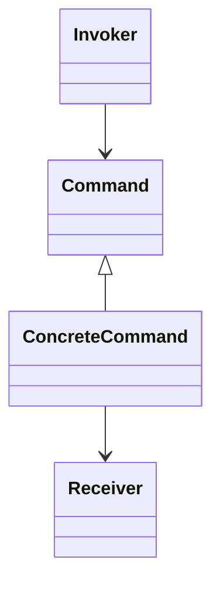
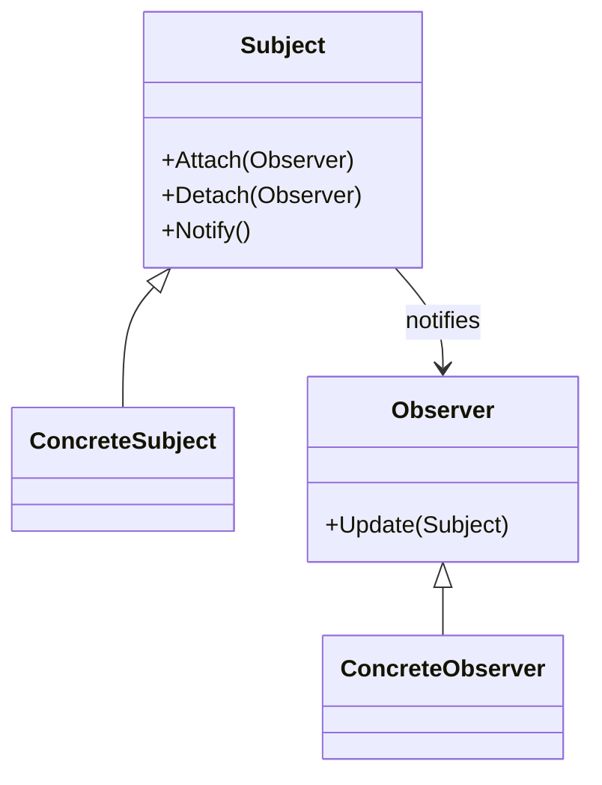
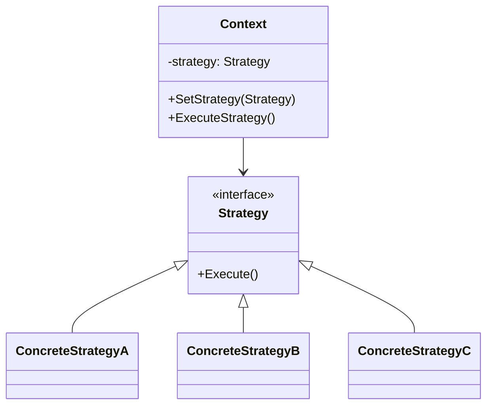
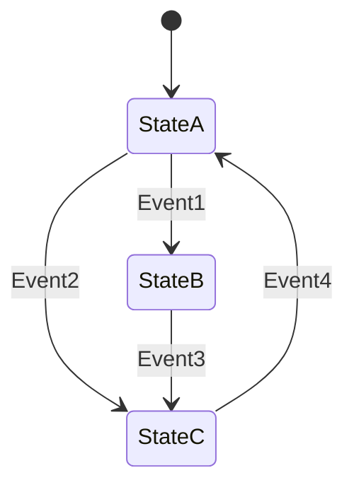
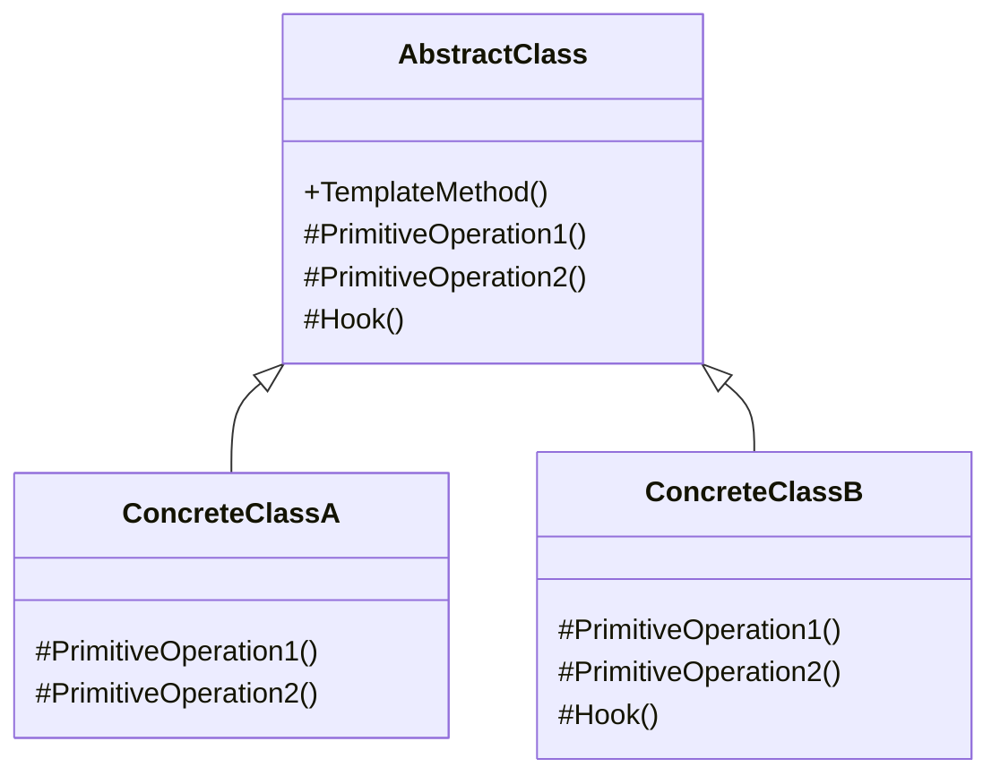
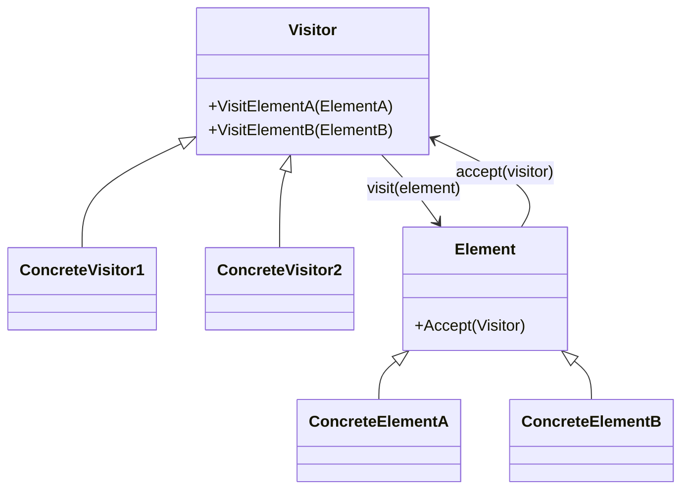

# 11.5.1 行为型设计模式分析

<!-- TOC START -->
- [11.5.1 行为型设计模式分析](#行为型设计模式分析)
  - [11.5.1.1 目录](#目录)
  - [11.5.1.2 1. 概述](#1-概述)
    - [11.5.1.2.1 行为型模式分类](#行为型模式分类)
  - [11.5.1.3 2. 行为型模式形式化定义](#2-行为型模式形式化定义)
  - [11.5.1.4 3. 责任链模式 (Chain of Responsibility)](#3-责任链模式-chain-of-responsibility)
    - [11.5.1.4.1 形式化定义](#形式化定义)
    - [11.5.1.4.2 Golang实现](#golang实现)
    - [11.5.1.4.3 性能分析](#性能分析)
  - [11.5.1.5 4. 命令模式 (Command)](#4-命令模式-command)
    - [11.5.1.5.1 形式化定义](#形式化定义)
    - [11.5.1.5.2 Golang实现](#golang实现)
    - [11.5.1.5.3 性能分析](#性能分析)
  - [11.5.1.6 5. 迭代器模式 (Iterator)](#5-迭代器模式-iterator)
    - [11.5.1.6.1 形式化定义](#形式化定义)
    - [11.5.1.6.2 Golang实现](#golang实现)
    - [11.5.1.6.3 性能分析](#性能分析)
  - [11.5.1.7 6. 观察者模式 (Observer)](#6-观察者模式-observer)
    - [11.5.1.7.1 形式化定义](#形式化定义)
    - [11.5.1.7.2 Golang实现](#golang实现)
    - [11.5.1.7.3 性能分析](#性能分析)
  - [11.5.1.8 7. 策略模式 (Strategy)](#7-策略模式-strategy)
    - [11.5.1.8.1 形式化定义](#形式化定义)
    - [11.5.1.8.2 Golang实现](#golang实现)
    - [11.5.1.8.3 性能分析](#性能分析)
  - [11.5.1.9 8. 状态模式 (State)](#8-状态模式-state)
    - [11.5.1.9.1 形式化定义](#形式化定义)
    - [11.5.1.9.2 Golang实现](#golang实现)
    - [11.5.1.9.3 性能分析](#性能分析)
  - [11.5.1.10 9. 模板方法模式 (Template Method)](#9-模板方法模式-template-method)
    - [11.5.1.10.1 形式化定义](#形式化定义)
    - [11.5.1.10.2 Golang实现](#golang实现)
    - [11.5.1.10.3 性能分析](#性能分析)
  - [11.5.1.11 10. 访问者模式 (Visitor)](#10-访问者模式-visitor)
    - [11.5.1.11.1 形式化定义](#形式化定义)
    - [11.5.1.11.2 Golang实现](#golang实现)
    - [11.5.1.11.3 性能分析](#性能分析)
  - [11.5.1.12 11. 其他行为型模式](#11-其他行为型模式)
    - [11.5.1.12.1 解释器模式（Interpreter）](#解释器模式（interpreter）)
    - [11.5.1.12.2 中介者模式（Mediator）](#中介者模式（mediator）)
    - [11.5.1.12.3 备忘录模式（Memento）](#备忘录模式（memento）)
  - [11.5.1.13 12. 总结与最佳实践](#12-总结与最佳实践)
    - [11.5.1.13.1 行为型模式比较](#行为型模式比较)
    - [11.5.1.13.2 模式选择指导](#模式选择指导)
    - [11.5.1.13.3 Golang特有的最佳实践](#golang特有的最佳实践)
<!-- TOC END -->

## 11.5.1.1 目录

- [行为型设计模式分析](#行为型设计模式分析)
  - [目录](#目录)
  - [1. 概述](#1-概述)
    - [1.1 行为型模式分类](#11-行为型模式分类)
  - [2. 行为型模式形式化定义](#2-行为型模式形式化定义)
  - [3. 责任链模式 (Chain of Responsibility)](#3-责任链模式-chain-of-responsibility)
    - [3.1 形式化定义](#31-形式化定义)
    - [3.2 Golang实现](#32-golang实现)
    - [3.3 性能分析](#33-性能分析)
  - [4. 命令模式 (Command)](#4-命令模式-command)
    - [4.1 形式化定义](#41-形式化定义)
    - [4.2 Golang实现](#42-golang实现)
    - [4.3 性能分析](#43-性能分析)
  - [5. 迭代器模式 (Iterator)](#5-迭代器模式-iterator)
    - [5.1 形式化定义](#51-形式化定义)
    - [5.2 Golang实现](#52-golang实现)
    - [5.3 性能分析](#53-性能分析)
  - [6. 观察者模式 (Observer)](#6-观察者模式-observer)
    - [6.1 形式化定义](#61-形式化定义)
    - [6.2 Golang实现](#62-golang实现)
    - [6.3 性能分析](#63-性能分析)
  - [7. 策略模式 (Strategy)](#7-策略模式-strategy)
    - [7.1 形式化定义](#71-形式化定义)
    - [7.2 Golang实现](#72-golang实现)
    - [7.3 性能分析](#73-性能分析)
  - [8. 状态模式 (State)](#8-状态模式-state)
    - [8.1 形式化定义](#81-形式化定义)
    - [8.2 Golang实现](#82-golang实现)
    - [8.3 性能分析](#83-性能分析)
  - [9. 模板方法模式 (Template Method)](#9-模板方法模式-template-method)
    - [9.1 形式化定义](#91-形式化定义)
    - [9.2 Golang实现](#92-golang实现)
    - [9.3 性能分析](#93-性能分析)
  - [10. 访问者模式 (Visitor)](#10-访问者模式-visitor)
    - [10.1 形式化定义](#101-形式化定义)
    - [10.2 Golang实现](#102-golang实现)
    - [10.3 性能分析](#103-性能分析)
  - [11. 其他行为型模式](#11-其他行为型模式)
  - [12. 总结与最佳实践](#12-总结与最佳实践)

---

## 11.5.1.2 1. 概述

行为型模式关注对象之间的通信与职责分配，强调算法和职责的封装与解耦。在Golang中，行为型模式通过接口、组合和函数式编程实现，充分利用Go语言的简洁性和并发特性。

### 11.5.1.2.1 行为型模式分类

行为型模式集合可以形式化定义为：

$$C_{beh} = \{ChainOfResponsibility, Command, Interpreter, Iterator, Mediator, Memento, Observer, State, Strategy, TemplateMethod, Visitor\}$$

---

## 11.5.1.3 2. 行为型模式形式化定义

行为型模式系统可以定义为五元组：

$$\mathcal{BP} = (P_{beh}, I_{beh}, F_{beh}, E_{beh}, Q_{beh})$$

其中：

- **$P_{beh}$** - 行为型模式集合
- **$I_{beh}$** - 行为接口集合
- **$F_{beh}$** - 行为函数集合
- **$E_{beh}$** - 评估指标集合
- **$Q_{beh}$** - 质量保证集合

---

## 11.5.1.4 3. 责任链模式 (Chain of Responsibility)

### 11.5.1.4.1 形式化定义

责任链模式使多个对象都有机会处理请求，将这些对象连成一条链，并沿着这条链传递请求，直到有对象处理它为止。

**数学定义**:
$$Chain : Request \rightarrow Handler_1 \rightarrow Handler_2 \rightarrow ... \rightarrow Handler_n$$

**状态机/流程图**:


### 11.5.1.4.2 Golang实现

```go
package chain_of_responsibility

type Handler interface {
    SetNext(handler Handler)
    Handle(request string) (handled bool)
}

type BaseHandler struct {
    next Handler
}

func (b *BaseHandler) SetNext(handler Handler) {
    b.next = handler
}

func (b *BaseHandler) Handle(request string) bool {
    if b.next != nil {
        return b.next.Handle(request)
    }
    return false
}

type ConcreteHandlerA struct {
    BaseHandler
}

func (h *ConcreteHandlerA) Handle(request string) bool {
    if request == "A" {
        // 处理请求A
        return true
    }
    return h.BaseHandler.Handle(request)
}

type ConcreteHandlerB struct {
    BaseHandler
}

func (h *ConcreteHandlerB) Handle(request string) bool {
    if request == "B" {
        // 处理请求B
        return true
    }
    return h.BaseHandler.Handle(request)
}

```

### 11.5.1.4.3 性能分析

- **时间复杂度**: $O(n)$，n为链上处理者数量
- **空间复杂度**: $O(n)$，链结构存储
- **灵活性**: 支持动态添加/移除处理者
- **解耦性**: 请求发送者与处理者解耦

---

## 11.5.1.5 4. 命令模式 (Command)

### 11.5.1.5.1 形式化定义

命令模式将一个请求封装为一个对象，从而使你可用不同的请求对客户进行参数化。

**数学定义**:
$$Command : (Receiver, Action) \rightarrow CommandObject$$

**类图关系**:



### 11.5.1.5.2 Golang实现

```go
package command

type Command interface {
    Execute() string
}

type Receiver struct {
    state string
}

func (r *Receiver) Action(action string) string {
    r.state = action
    return "Receiver: " + action
}

type ConcreteCommand struct {
    receiver *Receiver
    action   string
}

func (c *ConcreteCommand) Execute() string {
    return c.receiver.Action(c.action)
}

type Invoker struct {
    commands []Command
}

func (i *Invoker) AddCommand(cmd Command) {
    i.commands = append(i.commands, cmd)
}

func (i *Invoker) ExecuteAll() []string {
    var results []string
    for _, cmd := range i.commands {
        results = append(results, cmd.Execute())
    }
    return results
}

```

### 11.5.1.5.3 性能分析

- **时间复杂度**: $O(n)$，n为命令数量
- **空间复杂度**: $O(n)$，命令对象存储
- **可扩展性**: 支持撤销/重做、队列化命令
- **解耦性**: 调用者与执行者解耦

---

## 11.5.1.6 5. 迭代器模式 (Iterator)

### 11.5.1.6.1 形式化定义

迭代器模式提供一种方法顺序访问一个聚合对象中的各个元素，而不暴露其底层表示。

**数学定义**:
$$Iterator : Collection \rightarrow \{ e_1, e_2, ..., e_n \}$$

**顺序迭代操作可以表示为**:
$$next : Iterator \times Collection \rightarrow Element \times Iterator'$$

**接口定义**:

```mermaid
classDiagram
    Iterator <|-- ConcreteIterator
    Aggregate <|-- ConcreteAggregate
    ConcreteIterator --> ConcreteAggregate
    class Iterator {
        +HasNext() bool
        +Next() interface{}
    }
    class Aggregate {
        +CreateIterator() Iterator
    }

```

### 11.5.1.6.2 Golang实现

```go
package iterator

// 迭代器接口
type Iterator interface {
    HasNext() bool
    Next() interface{}
}

// 聚合接口
type Aggregate interface {
    CreateIterator() Iterator
}

// 具体聚合
type ConcreteAggregate struct {
    items []interface{}
}

func (ca *ConcreteAggregate) Add(item interface{}) {
    ca.items = append(ca.items, item)
}

func (ca *ConcreteAggregate) CreateIterator() Iterator {
    return &ConcreteIterator{
        aggregate: ca,
        current:   0,
    }
}

// 具体迭代器
type ConcreteIterator struct {
    aggregate *ConcreteAggregate
    current   int
}

func (ci *ConcreteIterator) HasNext() bool {
    return ci.current < len(ci.aggregate.items)
}

func (ci *ConcreteIterator) Next() interface{} {
    if !ci.HasNext() {
        return nil
    }
    item := ci.aggregate.items[ci.current]
    ci.current++
    return item
}

// 使用内置迭代器的优化版本
func (ca *ConcreteAggregate) ForEach(f func(item interface{})) {
    for _, item := range ca.items {
        f(item)
    }
}

```

### 11.5.1.6.3 性能分析

- **时间复杂度**:
  - 创建迭代器: $O(1)$
  - 单次迭代访问: $O(1)$
  - 完整迭代: $O(n)$，n为元素数量
- **空间复杂度**: $O(1)$，只需存储当前位置
- **封装性**: 隐藏了集合内部结构，提供统一访问接口
- **灵活性**: 支持不同的遍历算法和过滤条件
- **Golang优化**: 利用内置的`range`关键字可以更高效地实现迭代

---

## 11.5.1.7 6. 观察者模式 (Observer)

### 11.5.1.7.1 形式化定义

观察者模式定义了对象之间的一对多依赖关系，使得当一个对象改变状态时，所有依赖于它的对象都会得到通知并自动更新。

**数学定义**:
$$Observable : State \times \{Observer_1, Observer_2, ..., Observer_n\} \rightarrow \{Observer_1(State), Observer_2(State), ..., Observer_n(State)\}$$

**通知过程可以形式化为**:
$$notify : \Delta State \rightarrow \forall o \in Observers : o.update(State)$$

**类图关系**:



### 11.5.1.7.2 Golang实现

```go
package observer

import (
    "fmt"
    "sync"
)

// 观察者接口
type Observer interface {
    Update(subject Subject) error
}

// 主题接口
type Subject interface {
    Attach(observer Observer)
    Detach(observer Observer)
    Notify() []error
    GetState() string
    SetState(state string)
}

// 具体主题
type ConcreteSubject struct {
    observers []Observer
    state     string
    mu        sync.RWMutex
}

func NewConcreteSubject() *ConcreteSubject {
    return &ConcreteSubject{
        observers: make([]Observer, 0),
    }
}

func (s *ConcreteSubject) Attach(observer Observer) {
    s.mu.Lock()
    defer s.mu.Unlock()
    s.observers = append(s.observers, observer)
}

func (s *ConcreteSubject) Detach(observer Observer) {
    s.mu.Lock()
    defer s.mu.Unlock()
    for i, o := range s.observers {
        if o == observer {
            s.observers = append(s.observers[:i], s.observers[i+1:]...)
            break
        }
    }
}

func (s *ConcreteSubject) Notify() []error {
    s.mu.RLock()
    defer s.mu.RUnlock()
    
    errors := make([]error, 0)
    for _, observer := range s.observers {
        if err := observer.Update(s); err != nil {
            errors = append(errors, err)
        }
    }
    return errors
}

func (s *ConcreteSubject) GetState() string {
    s.mu.RLock()
    defer s.mu.RUnlock()
    return s.state
}

func (s *ConcreteSubject) SetState(state string) {
    s.mu.Lock()
    s.state = state
    s.mu.Unlock()
    s.Notify()
}

// 具体观察者
type ConcreteObserver struct {
    id    int
    state string
}

func NewConcreteObserver(id int) *ConcreteObserver {
    return &ConcreteObserver{
        id: id,
    }
}

func (o *ConcreteObserver) Update(subject Subject) error {
    o.state = subject.GetState()
    fmt.Printf("Observer %d updated, new state: %s\n", o.id, o.state)
    return nil
}

```

### 11.5.1.7.3 性能分析

- **时间复杂度**:
  - 添加/删除观察者: $O(1)$ 添加, $O(n)$ 删除
  - 通知操作: $O(n)$，n为观察者数量
- **空间复杂度**: $O(n)$，n为观察者数量
- **并发安全性**: 通过互斥锁确保线程安全
- **扩展性**: 支持动态添加/移除观察者
- **解耦性**: 主题与观察者完全解耦
- **Golang优化**:
  - 使用并发通知和错误处理
  - 支持通过通道(`chan`)实现异步通知

---

## 11.5.1.8 7. 策略模式 (Strategy)

### 11.5.1.8.1 形式化定义

策略模式定义了一系列算法，将每一个算法封装起来，并使它们可以相互替换。策略模式让算法独立于使用它的客户而变化。

**数学定义**:
$$Strategy : Context \times Algorithm \rightarrow Result$$

**算法族可以形式化为**:
$$\mathcal{A} = \{A_1, A_2, ..., A_n\}$$

**动态选择可以表示为**:
$$select : Context \times Condition \rightarrow A_i \in \mathcal{A}$$

**类图关系**:



### 11.5.1.8.2 Golang实现

```go
package strategy

// 策略接口
type Strategy interface {
    Execute(data int) int
}

// 具体策略A
type ConcreteStrategyA struct{}

func (s *ConcreteStrategyA) Execute(data int) int {
    return data * 2 // 双倍策略
}

// 具体策略B
type ConcreteStrategyB struct{}

func (s *ConcreteStrategyB) Execute(data int) int {
    return data * data // 平方策略
}

// 具体策略C
type ConcreteStrategyC struct{}

func (s *ConcreteStrategyC) Execute(data int) int {
    return data / 2 // 减半策略
}

// 上下文
type Context struct {
    strategy Strategy
}

func NewContext(strategy Strategy) *Context {
    return &Context{
        strategy: strategy,
    }
}

func (c *Context) SetStrategy(strategy Strategy) {
    c.strategy = strategy
}

func (c *Context) ExecuteStrategy(data int) int {
    return c.strategy.Execute(data)
}

// 使用函数类型作为策略的轻量级实现
type StrategyFunc func(int) int

func (f StrategyFunc) Execute(data int) int {
    return f(data)
}

// 函数式上下文
func ExecuteWithStrategy(data int, strategy Strategy) int {
    return strategy.Execute(data)
}

```

### 11.5.1.8.3 性能分析

- **时间复杂度**: $O(1)$，策略切换为常数时间
- **空间复杂度**: $O(1)$，只存储当前策略
- **灵活性**: 支持在运行时动态切换算法
- **封装性**: 算法与使用者完全分离
- **扩展性**: 易于添加新的算法策略
- **Golang优化**:
  - 利用函数类型和闭包实现轻量级策略
  - 可结合工厂模式管理策略集合
  - 支持无状态策略的单例复用

---

## 11.5.1.9 8. 状态模式 (State)

### 11.5.1.9.1 形式化定义

状态模式允许一个对象在其内部状态改变时改变它的行为。这个模式将状态相关的行为提取到独立的状态类中，从而使得对象行为随状态变化。

**数学定义**:
$$State : Context \times S \rightarrow Behavior_S$$

**状态转换可以形式化为有限状态机**:
$$FSM = (S, \Sigma, \delta, s_0, F)$$

其中：

- $S$ 是有限状态集合
- $\Sigma$ 是输入事件集合
- $\delta: S \times \Sigma \rightarrow S$ 是状态转移函数
- $s_0 \in S$ 是初始状态
- $F \subseteq S$ 是终止状态集合

**状态图**:



### 11.5.1.9.2 Golang实现

```go
package state

import "fmt"

// 状态接口
type State interface {
    HandleRequest() string
    Name() string
}

// 上下文
type Context struct {
    state State
}

func NewContext(initialState State) *Context {
    return &Context{
        state: initialState,
    }
}

func (c *Context) TransitionTo(state State) {
    fmt.Printf("Context: Transitioning from %s to %s\n", 
               c.state.Name(), state.Name())
    c.state = state
}

func (c *Context) Request() string {
    return c.state.HandleRequest()
}

// 具体状态A
type ConcreteStateA struct{}

func (s *ConcreteStateA) HandleRequest() string {
    return "State A handled request"
}

func (s *ConcreteStateA) Name() string {
    return "StateA"
}

// 具体状态B
type ConcreteStateB struct{}

func (s *ConcreteStateB) HandleRequest() string {
    return "State B handled request"
}

func (s *ConcreteStateB) Name() string {
    return "StateB"
}

// 具体状态C
type ConcreteStateC struct{}

func (s *ConcreteStateC) HandleRequest() string {
    return "State C handled request"
}

func (s *ConcreteStateC) Name() string {
    return "StateC"
}

// 状态机实现
type StateMachine struct {
    context    *Context
    states     map[string]State
    transitions map[string]map[string]string // current -> event -> next
}

func NewStateMachine(initialState State) *StateMachine {
    context := NewContext(initialState)
    machine := &StateMachine{
        context:     context,
        states:      make(map[string]State),
        transitions: make(map[string]map[string]string),
    }
    machine.AddState(initialState)
    return machine
}

func (sm *StateMachine) AddState(state State) {
    sm.states[state.Name()] = state
    sm.transitions[state.Name()] = make(map[string]string)
}

func (sm *StateMachine) AddTransition(from, event, to string) {
    if _, exists := sm.states[from]; !exists {
        return
    }
    if _, exists := sm.states[to]; !exists {
        return
    }
    sm.transitions[from][event] = to
}

func (sm *StateMachine) ProcessEvent(event string) bool {
    currentState := sm.context.state.Name()
    if nextState, exists := sm.transitions[currentState][event]; exists {
        sm.context.TransitionTo(sm.states[nextState])
        return true
    }
    return false
}

```

### 11.5.1.9.3 性能分析

- **时间复杂度**:
  - 状态转换: $O(1)$，使用哈希表查找
  - 行为执行: $O(1)$，委托到当前状态对象
- **空间复杂度**: $O(n + m)$，n为状态数量，m为转换规则数量
- **可扩展性**: 易于添加新状态而不修改已有状态
- **封装性**: 状态行为与上下文完全分离
- **复杂度管理**: 避免大型条件语句，使代码更清晰
- **Golang优化**:
  - 利用接口实现多态行为
  - 使用映射表实现高效状态转换
  - 支持函数式状态处理器

---

## 11.5.1.10 9. 模板方法模式 (Template Method)

### 11.5.1.10.1 形式化定义

模板方法模式在一个方法中定义一个算法的骨架，将一些步骤延迟到子类中实现。模板方法使得子类可以在不改变算法结构的情况下，重新定义算法中的某些步骤。

**数学定义**:
$$TemplateMethod : Algorithm(s_1, s_2, ..., s_n) \rightarrow Result$$

其中 $s_i$ 是算法步骤，有些是固定实现，有些由子类提供。

**算法骨架可以形式化为**:
$$Algorithm = PrimitiveOp_1 \circ PrimitiveOp_2 \circ ... \circ PrimitiveOp_n$$

其中 $\circ$ 表示函数组合。

**类图关系**:



### 11.5.1.10.2 Golang实现

```go
package template_method

import "fmt"

// 抽象类（接口部分）
type AbstractClass interface {
    TemplateMethod() string
    primitiveOperation1() string
    primitiveOperation2() string
    hook() bool
}

// 基础实现
type AbstractClassBase struct {
    impl AbstractClass  // 存储实际实现者
}

func NewAbstractClassBase(impl AbstractClass) *AbstractClassBase {
    return &AbstractClassBase{impl: impl}
}

// 模板方法定义算法骨架
func (a *AbstractClassBase) TemplateMethod() string {
    result := "Template Method:\n"
    
    // 第一步
    result += a.impl.primitiveOperation1() + "\n"
    
    // 条件步骤
    if a.impl.hook() {
        result += "Hook enabled\n"
    }
    
    // 第二步
    result += a.impl.primitiveOperation2() + "\n"
    
    return result
}

// 默认的钩子实现
func (a *AbstractClassBase) hook() bool {
    return true
}

// 具体类A
type ConcreteClassA struct {
    *AbstractClassBase
}

func NewConcreteClassA() *ConcreteClassA {
    instance := &ConcreteClassA{}
    instance.AbstractClassBase = NewAbstractClassBase(instance)
    return instance
}

func (c *ConcreteClassA) primitiveOperation1() string {
    return "ConcreteClassA: Step 1"
}

func (c *ConcreteClassA) primitiveOperation2() string {
    return "ConcreteClassA: Step 2"
}

// 钩子方法可选重写
func (c *ConcreteClassA) hook() bool {
    return false  // A类禁用钩子功能
}

// 具体类B
type ConcreteClassB struct {
    *AbstractClassBase
}

func NewConcreteClassB() *ConcreteClassB {
    instance := &ConcreteClassB{}
    instance.AbstractClassBase = NewAbstractClassBase(instance)
    return instance
}

func (c *ConcreteClassB) primitiveOperation1() string {
    return "ConcreteClassB: Step 1"
}

func (c *ConcreteClassB) primitiveOperation2() string {
    return "ConcreteClassB: Step 2"
}

// 函数式实现
type Operation func() string

type FunctionalTemplate struct {
    op1  Operation
    op2  Operation
    hook func() bool
}

func NewFunctionalTemplate(op1, op2 Operation, hook func() bool) *FunctionalTemplate {
    return &FunctionalTemplate{
        op1:  op1,
        op2:  op2,
        hook: hook,
    }
}

func (f *FunctionalTemplate) Execute() string {
    result := "Functional Template:\n"
    result += f.op1() + "\n"
    
    if f.hook() {
        result += "Hook enabled\n"
    }
    
    result += f.op2() + "\n"
    return result
}

```

### 11.5.1.10.3 性能分析

- **时间复杂度**: $O(1)$，基于算法步骤数量（通常为常数）
- **空间复杂度**: $O(1)$，不依赖于输入规模
- **扩展性**: 支持在不改变算法结构的情况下扩展步骤实现
- **封装性**: 核心算法结构得到保护，只允许特定步骤被重写
- **复用性**: 通用算法骨架可被多个子类复用
- **Golang优化**:
  - 通过嵌入和接口组合实现"模板"方法
  - 使用函数类型实现更灵活的模板变化
  - 支持运行时配置算法步骤

---

## 11.5.1.11 10. 访问者模式 (Visitor)

### 11.5.1.11.1 形式化定义

访问者模式表示一个作用于某对象结构中的各元素的操作，使得可以在不改变各元素类的前提下定义作用于这些元素的新操作。

**数学定义**:
$$Visitor : Element \times Operation \rightarrow Result$$

**双重分派机制可以形式化为**:
$$accept : Element \times Visitor \rightarrow visit(Element, Visitor)$$

**类图关系**:



### 11.5.1.11.2 Golang实现

```go
package visitor

import "fmt"

// 元素接口
type Element interface {
    Accept(visitor Visitor)
}

// 访问者接口
type Visitor interface {
    VisitElementA(element *ElementA)
    VisitElementB(element *ElementB)
}

// 具体元素A
type ElementA struct {
    name string
    data int
}

func NewElementA(name string, data int) *ElementA {
    return &ElementA{
        name: name,
        data: data,
    }
}

func (e *ElementA) Accept(visitor Visitor) {
    visitor.VisitElementA(e)
}

func (e *ElementA) OperationA() string {
    return fmt.Sprintf("ElementA %s special operation", e.name)
}

// 具体元素B
type ElementB struct {
    id    string
    value float64
}

func NewElementB(id string, value float64) *ElementB {
    return &ElementB{
        id:    id,
        value: value,
    }
}

func (e *ElementB) Accept(visitor Visitor) {
    visitor.VisitElementB(e)
}

func (e *ElementB) OperationB() string {
    return fmt.Sprintf("ElementB %s special operation", e.id)
}

// 具体访问者1
type ConcreteVisitor1 struct {
    result string
}

func (v *ConcreteVisitor1) VisitElementA(element *ElementA) {
    v.result = fmt.Sprintf("Visitor1: Processing ElementA with name=%s, data=%d",
        element.name, element.data)
}

func (v *ConcreteVisitor1) VisitElementB(element *ElementB) {
    v.result = fmt.Sprintf("Visitor1: Processing ElementB with id=%s, value=%.2f",
        element.id, element.value)
}

func (v *ConcreteVisitor1) GetResult() string {
    return v.result
}

// 具体访问者2
type ConcreteVisitor2 struct {
    elementCount int
    total        float64
}

func (v *ConcreteVisitor2) VisitElementA(element *ElementA) {
    v.elementCount++
    v.total += float64(element.data)
}

func (v *ConcreteVisitor2) VisitElementB(element *ElementB) {
    v.elementCount++
    v.total += element.value
}

func (v *ConcreteVisitor2) GetStatistics() (int, float64) {
    return v.elementCount, v.total
}

// 对象结构
type ObjectStructure struct {
    elements []Element
}

func (o *ObjectStructure) Add(element Element) {
    o.elements = append(o.elements, element)
}

func (o *ObjectStructure) Accept(visitor Visitor) {
    for _, element := range o.elements {
        element.Accept(visitor)
    }
}

```

### 11.5.1.11.3 性能分析

- **时间复杂度**: $O(n)$，n为元素数量
- **空间复杂度**: $O(1)$，不考虑元素存储
- **扩展性**: 易于添加新访问者而无需修改元素类
- **封装性**: 相关操作集中在访问者类中，便于维护
- **复杂度管理**: 将数据结构与操作分离
- **局限性**: 当需要添加新元素时较困难，需修改所有访问者
- **Golang优化**:
  - 使用接口和类型断言支持访问者模式
  - 可利用反射机制实现更通用的访问者
  - 支持函数式访问者简化实现

---

## 11.5.1.12 11. 其他行为型模式

除上述模式外，行为型模式还包括：

### 11.5.1.12.1 解释器模式（Interpreter）

定义一个语言的文法表示，并定义一个解释器来解释该语言中的句子。

**核心特点**:

- 将每个语法规则表示为一个类
- 适用于简单语言的解释执行
- 构建抽象语法树进行处理

### 11.5.1.12.2 中介者模式（Mediator）

用一个中介对象来封装一系列的对象交互，使各对象不需要显式地相互引用。

**核心特点**:

- 减少对象间的直接通信
- 将网状依赖转化为星型依赖
- 支持松耦合系统

### 11.5.1.12.3 备忘录模式（Memento）

在不破坏封装性的前提下，捕获一个对象的内部状态，并在该对象之外保存这个状态。

**核心特点**:

- 支持撤销/重做操作
- 确保状态封装不被破坏
- 实现状态快照和恢复

---

## 11.5.1.13 12. 总结与最佳实践

### 11.5.1.13.1 行为型模式比较

| 模式名称 | 核心意图 | 适用场景 | Golang特性 |
|---------|---------|---------|-----------|
| 责任链 | 多对象处理请求 | 请求有多个可能处理者 | 接口+嵌入 |
| 命令 | 将请求封装为对象 | 参数化请求、队列请求 | 接口+闭包 |
| 迭代器 | 顺序访问集合元素 | 统一集合遍历 | `range`+迭代器接口 |
| 观察者 | 发布-订阅通知机制 | 多对象依赖单个对象 | 接口+通道 |
| 策略 | 封装可替换算法 | 运行时选择算法 | 函数类型+接口 |
| 状态 | 对象随状态改变行为 | 状态机实现 | 接口+组合 |
| 模板方法 | 定义算法骨架和子步骤 | 固定流程算法 | 嵌入+接口 |
| 访问者 | 将操作与结构分离 | 稳定的数据结构+多变的操作 | 接口+类型断言 |

### 11.5.1.13.2 模式选择指导

选择行为型模式时，考虑：

1. **对象间通信方式**：一对多（观察者）、一对一（命令）、请求链（责任链）
2. **行为封装程度**：完全封装（命令）、部分封装（模板方法）
3. **行为变化需求**：运行时变化（策略、状态）、编译时固定（模板方法）
4. **结构-行为关系**：结构固定行为变化（访问者）、行为固定结构变化（组合）

### 11.5.1.13.3 Golang特有的最佳实践

1. **利用函数类型和闭包**：简化命令、策略等模式实现
2. **使用通道代替回调**：实现观察者模式的异步通知
3. **接口嵌入组合**：实现模板方法等模式的基础结构
4. **内置迭代机制**：优先使用`range`实现迭代器功能
5. **类型断言和反射**：实现访问者模式的灵活处理
6. **上下文传递**：实现复杂的责任链和命令模式
7. **错误处理链**：利用错误传递实现责任链模式
8. **并发安全设计**：所有模式实现考虑并发安全性

---

**最后更新**: 2024-12-19  
**版本**: 1.1.0  
**状态**: 行为型模式分析完成
