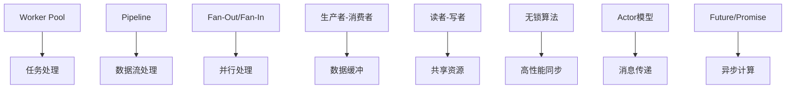

# 并发模式 (Concurrent Patterns)

## 目录

1. [概述](#1-概述)
2. [CSP模型与Golang并发原语](#2-csp模型与golang并发原语)
3. [Worker Pool模式](#3-worker-pool模式)
4. [Pipeline模式](#4-pipeline模式)
5. [Fan-Out/Fan-In模式](#5-fan-outfan-in模式)
6. [生产者-消费者模式](#6-生产者-消费者模式)
7. [读者-写者模式](#7-读者-写者模式)
8. [哲学家进餐问题](#8-哲学家进餐问题)
9. [无锁算法](#9-无锁算法)
10. [Actor模型](#10-actor模型)
11. [Future/Promise模式](#11-futurepromise模式)
12. [模式关系分析](#12-模式关系分析)
13. [性能分析](#13-性能分析)
14. [最佳实践](#14-最佳实践)

## 1. 概述

### 1.1 并发模式定义

并发模式是处理多线程、多进程或分布式系统中并发执行的设计模式。

**形式化定义**：

设 $C$ 为并发模式集合，$T$ 为任务集合，$R$ 为资源集合，则：

$$C = \{c_i | c_i = (Tasks_i, Resources_i, Synchronization_i)\}$$

其中：

- $Tasks_i$ 是并发任务集合
- $Resources_i$ 是共享资源集合
- $Synchronization_i$ 是同步机制

### 1.2 核心原则

1. **CSP模型**：通过通信共享内存，而不是通过共享内存通信
2. **无锁编程**：尽可能避免锁的使用
3. **资源管理**：合理管理并发资源
4. **错误处理**：妥善处理并发错误

### 1.3 分类体系

```text
并发模式
├── 基础模式
│   ├── Worker Pool (工作池)
│   ├── Pipeline (管道)
│   └── Fan-Out/Fan-In (分发/合并)
├── 经典问题
│   ├── 生产者-消费者
│   ├── 读者-写者
│   └── 哲学家进餐
├── 高级模式
│   ├── 无锁算法
│   ├── Actor模型
│   └── Future/Promise
```

## 2. CSP模型与Golang并发原语

### 2.1 CSP模型

**定义**：Communicating Sequential Processes，通过消息传递进行进程间通信。

**数学定义**：

设 $P$ 为进程集合，$C$ 为通道集合，$M$ 为消息集合，则：

$$CSP = (P, C, M, \rightarrow)$$

其中 $\rightarrow$ 表示通信关系。

### 2.2 Golang并发原语

```go
package concurrent

import (
    "fmt"
    "sync"
    "time"
)

// Goroutine 轻量级线程
func basicGoroutine() {
    ch := make(chan string)
    
    go func() {
        time.Sleep(1 * time.Second)
        ch <- "Hello from goroutine"
    }()
    
    msg := <-ch
    fmt.Println(msg)
}

// Channel 通道
type Channel[T any] struct {
    buffer chan T
    closed bool
    mu     sync.RWMutex
}

func NewChannel[T any](capacity int) *Channel[T] {
    return &Channel[T]{
        buffer: make(chan T, capacity),
    }
}

func (c *Channel[T]) Send(value T) error {
    c.mu.RLock()
    if c.closed {
        c.mu.RUnlock()
        return fmt.Errorf("channel closed")
    }
    c.mu.RUnlock()
    
    select {
    case c.buffer <- value:
        return nil
    default:
        return fmt.Errorf("channel full")
    }
}

func (c *Channel[T]) Receive() (T, error) {
    var zero T
    select {
    case value, ok := <-c.buffer:
        if !ok {
            return zero, fmt.Errorf("channel closed")
        }
        return value, nil
    default:
        return zero, fmt.Errorf("no data available")
    }
}

func (c *Channel[T]) Close() error {
    c.mu.Lock()
    defer c.mu.Unlock()
    
    if c.closed {
        return fmt.Errorf("channel already closed")
    }
    
    c.closed = true
    close(c.buffer)
    return nil
}

// Select 多路选择
func selectExample() {
    ch1 := make(chan string)
    ch2 := make(chan string)
    
    go func() {
        time.Sleep(1 * time.Second)
        ch1 <- "from ch1"
    }()
    
    go func() {
        time.Sleep(2 * time.Second)
        ch2 <- "from ch2"
    }()
    
    for i := 0; i < 2; i++ {
        select {
        case msg1 := <-ch1:
            fmt.Println("Received:", msg1)
        case msg2 := <-ch2:
            fmt.Println("Received:", msg2)
        case <-time.After(3 * time.Second):
            fmt.Println("Timeout")
            return
        }
    }
}
```

## 3. Worker Pool模式

### 3.1 形式化定义

**定义**：使用固定数量的工作线程处理任务队列。

**数学定义**：

设 $W$ 为Worker数量，$T$ 为任务集合，$Q$ 为队列，则：

$$WorkerPool = (W, T, Q, Process)$$

其中 $Process: W \times T \rightarrow Result$

### 3.2 Golang实现

```go
package workerpool

import (
    "fmt"
    "sync"
    "time"
)

// Task 任务接口
type Task interface {
    Execute() (interface{}, error)
    GetID() string
}

// Result 任务结果
type Result struct {
    TaskID string
    Data   interface{}
    Error  error
}

// WorkerPool 工作池
type WorkerPool struct {
    workers    int
    jobQueue   chan Task
    resultQueue chan Result
    wg         sync.WaitGroup
    ctx        context.Context
    cancel     context.CancelFunc
}

// NewWorkerPool 创建工作池
func NewWorkerPool(workers int, queueSize int) *WorkerPool {
    ctx, cancel := context.WithCancel(context.Background())
    return &WorkerPool{
        workers:     workers,
        jobQueue:    make(chan Task, queueSize),
        resultQueue: make(chan Result, queueSize),
        ctx:         ctx,
        cancel:      cancel,
    }
}

// Start 启动工作池
func (wp *WorkerPool) Start() {
    for i := 0; i < wp.workers; i++ {
        wp.wg.Add(1)
        go wp.worker(i)
    }
}

// worker 工作线程
func (wp *WorkerPool) worker(id int) {
    defer wp.wg.Done()
    
    for {
        select {
        case <-wp.ctx.Done():
            fmt.Printf("Worker %d: stopping\n", id)
            return
        case task, ok := <-wp.jobQueue:
            if !ok {
                fmt.Printf("Worker %d: job queue closed\n", id)
                return
            }
            
            fmt.Printf("Worker %d: processing task %s\n", id, task.GetID())
            result, err := task.Execute()
            
            wp.resultQueue <- Result{
                TaskID: task.GetID(),
                Data:   result,
                Error:  err,
            }
        }
    }
}

// Submit 提交任务
func (wp *WorkerPool) Submit(task Task) error {
    select {
    case wp.jobQueue <- task:
        return nil
    case <-wp.ctx.Done():
        return fmt.Errorf("worker pool stopped")
    default:
        return fmt.Errorf("job queue full")
    }
}

// Results 获取结果通道
func (wp *WorkerPool) Results() <-chan Result {
    return wp.resultQueue
}

// Stop 停止工作池
func (wp *WorkerPool) Stop() {
    wp.cancel()
    close(wp.jobQueue)
    wp.wg.Wait()
    close(wp.resultQueue)
}

// 具体任务实现
type SimpleTask struct {
    id   string
    data string
}

func NewSimpleTask(id, data string) *SimpleTask {
    return &SimpleTask{id: id, data: data}
}

func (t *SimpleTask) Execute() (interface{}, error) {
    time.Sleep(100 * time.Millisecond)
    return fmt.Sprintf("Processed: %s", t.data), nil
}

func (t *SimpleTask) GetID() string {
    return t.id
}
```

## 4. Pipeline模式

### 4.1 形式化定义

**定义**：将复杂任务分解为多个阶段，每个阶段处理数据并传递给下一阶段。

**数学定义**：

设 $S$ 为阶段集合，$D$ 为数据集合，则：

$$Pipeline = S_1 \circ S_2 \circ ... \circ S_n$$

其中 $\circ$ 表示阶段组合。

### 4.2 Golang实现

```go
package pipeline

import (
    "fmt"
    "sync"
)

// Stage 处理阶段
type Stage[T any] func(<-chan T) <-chan T

// Pipeline 管道
type Pipeline[T any] struct {
    stages []Stage[T]
}

// NewPipeline 创建管道
func NewPipeline[T any](stages ...Stage[T]) *Pipeline[T] {
    return &Pipeline[T]{stages: stages}
}

// Execute 执行管道
func (p *Pipeline[T]) Execute(input <-chan T) <-chan T {
    current := input
    
    for _, stage := range p.stages {
        current = stage(current)
    }
    
    return current
}

// 具体阶段实现
func FilterStage[T any](predicate func(T) bool) Stage[T] {
    return func(input <-chan T) <-chan T {
        output := make(chan T)
        
        go func() {
            defer close(output)
            for value := range input {
                if predicate(value) {
                    output <- value
                }
            }
        }()
        
        return output
    }
}

func TransformStage[T any, R any](transform func(T) R) func(<-chan T) <-chan R {
    return func(input <-chan T) <-chan R {
        output := make(chan R)
        
        go func() {
            defer close(output)
            for value := range input {
                output <- transform(value)
            }
        }()
        
        return output
    }
}

func BatchStage[T any](batchSize int) Stage[T] {
    return func(input <-chan T) <-chan T {
        output := make(chan T)
        
        go func() {
            defer close(output)
            
            batch := make([]T, 0, batchSize)
            for value := range input {
                batch = append(batch, value)
                
                if len(batch) >= batchSize {
                    // 处理批次
                    for _, item := range batch {
                        output <- item
                    }
                    batch = batch[:0]
                }
            }
            
            // 处理剩余项
            for _, item := range batch {
                output <- item
            }
        }()
        
        return output
    }
}

// 使用示例
func ExamplePipeline() {
    input := make(chan int)
    
    // 创建管道：过滤偶数 -> 平方 -> 批次处理
    pipeline := NewPipeline[int](
        FilterStage[int](func(x int) bool { return x%2 == 0 }),
        TransformStage[int, int](func(x int) int { return x * x }),
        BatchStage[int](3),
    )
    
    output := pipeline.Execute(input)
    
    // 发送数据
    go func() {
        for i := 1; i <= 10; i++ {
            input <- i
        }
        close(input)
    }()
    
    // 接收结果
    for result := range output {
        fmt.Printf("Result: %d\n", result)
    }
}
```

## 5. Fan-Out/Fan-In模式

### 5.1 形式化定义

**定义**：Fan-Out将输入分发到多个处理器，Fan-In将多个处理器的输出合并。

**数学定义**：

设 $I$ 为输入，$O$ 为输出，$P$ 为处理器集合，则：

$$FanOut: I \rightarrow P_1, P_2, ..., P_n$$
$$FanIn: P_1, P_2, ..., P_n \rightarrow O$$

### 5.2 Golang实现

```go
package fanout

import (
    "fmt"
    "sync"
    "time"
)

// FanOut 分发模式
func FanOut[T any](input <-chan T, workers int, processor func(T) T) []<-chan T {
    outputs := make([]<-chan T, workers)
    
    for i := 0; i < workers; i++ {
        output := make(chan T)
        outputs[i] = output
        
        go func(id int) {
            defer close(output)
            for value := range input {
                // 模拟处理时间
                time.Sleep(100 * time.Millisecond)
                processed := processor(value)
                output <- processed
                fmt.Printf("Worker %d processed: %v\n", id, processed)
            }
        }(i)
    }
    
    return outputs
}

// FanIn 合并模式
func FanIn[T any](inputs ...<-chan T) <-chan T {
    output := make(chan T)
    var wg sync.WaitGroup
    
    // 为每个输入通道启动一个goroutine
    for _, input := range inputs {
        wg.Add(1)
        go func(ch <-chan T) {
            defer wg.Done()
            for value := range ch {
                output <- value
            }
        }(input)
    }
    
    // 等待所有goroutine完成后关闭输出通道
    go func() {
        wg.Wait()
        close(output)
    }()
    
    return output
}

// 带权重的Fan-Out
func WeightedFanOut[T any](input <-chan T, weights []int, processor func(T) T) []<-chan T {
    if len(weights) == 0 {
        return nil
    }
    
    outputs := make([]<-chan T, len(weights))
    
    for i, weight := range weights {
        output := make(chan T)
        outputs[i] = output
        
        go func(id, weight int) {
            defer close(output)
            for value := range input {
                // 根据权重调整处理时间
                time.Sleep(time.Duration(weight) * 50 * time.Millisecond)
                processed := processor(value)
                output <- processed
                fmt.Printf("Worker %d (weight %d) processed: %v\n", id, weight, processed)
            }
        }(i, weight)
    }
    
    return outputs
}

// 使用示例
func ExampleFanOutFanIn() {
    input := make(chan int)
    
    // Fan-Out: 分发到3个worker
    outputs := FanOut[int](input, 3, func(x int) int {
        return x * x
    })
    
    // Fan-In: 合并结果
    result := FanIn(outputs...)
    
    // 发送数据
    go func() {
        for i := 1; i <= 10; i++ {
            input <- i
        }
        close(input)
    }()
    
    // 接收结果
    for value := range result {
        fmt.Printf("Final result: %d\n", value)
    }
}
```

## 6. 生产者-消费者模式

### 6.1 形式化定义

**定义**：生产者生成数据，消费者处理数据，通过缓冲区解耦。

**数学定义**：

设 $P$ 为生产者，$C$ 为消费者，$B$ 为缓冲区，则：

$$Producer: \emptyset \rightarrow B$$
$$Consumer: B \rightarrow \emptyset$$

### 6.2 Golang实现

```go
package producerconsumer

import (
    "context"
    "fmt"
    "sync"
    "time"
)

// Item 数据项
type Item struct {
    ID   int
    Data string
}

// ProducerConsumer 生产者-消费者系统
type ProducerConsumer struct {
    buffer    chan Item
    wg        sync.WaitGroup
    ctx       context.Context
    cancel    context.CancelFunc
    maxItems  int
}

// NewProducerConsumer 创建生产者-消费者系统
func NewProducerConsumer(bufferSize, maxItems int) *ProducerConsumer {
    ctx, cancel := context.WithCancel(context.Background())
    return &ProducerConsumer{
        buffer:   make(chan Item, bufferSize),
        ctx:      ctx,
        cancel:   cancel,
        maxItems: maxItems,
    }
}

// Producer 生产者
func (pc *ProducerConsumer) Producer(id int) {
    defer pc.wg.Done()
    
    for i := 0; i < pc.maxItems; i++ {
        select {
        case <-pc.ctx.Done():
            fmt.Printf("Producer %d: stopping\n", id)
            return
        case pc.buffer <- Item{ID: i, Data: fmt.Sprintf("data-%d", i)}:
            fmt.Printf("Producer %d: produced item %d\n", id, i)
            time.Sleep(100 * time.Millisecond)
        }
    }
    
    fmt.Printf("Producer %d: finished\n", id)
}

// Consumer 消费者
func (pc *ProducerConsumer) Consumer(id int) {
    defer pc.wg.Done()
    
    for {
        select {
        case <-pc.ctx.Done():
            fmt.Printf("Consumer %d: stopping\n", id)
            return
        case item, ok := <-pc.buffer:
            if !ok {
                fmt.Printf("Consumer %d: channel closed\n", id)
                return
            }
            fmt.Printf("Consumer %d: consumed item %d\n", id, item.ID)
            time.Sleep(200 * time.Millisecond)
        }
    }
}

// Start 启动系统
func (pc *ProducerConsumer) Start(producerCount, consumerCount int) {
    // 启动生产者
    for i := 0; i < producerCount; i++ {
        pc.wg.Add(1)
        go pc.Producer(i)
    }
    
    // 启动消费者
    for i := 0; i < consumerCount; i++ {
        pc.wg.Add(1)
        go pc.Consumer(i)
    }
}

// Stop 停止系统
func (pc *ProducerConsumer) Stop() {
    pc.cancel()
    close(pc.buffer)
    pc.wg.Wait()
}

// 使用示例
func ExampleProducerConsumer() {
    pc := NewProducerConsumer(10, 20)
    pc.Start(2, 3)
    
    // 运行一段时间后停止
    time.Sleep(5 * time.Second)
    pc.Stop()
}
```

## 7. 读者-写者模式

### 7.1 形式化定义

**定义**：允许多个读者同时读取，但写者必须独占访问。

**数学定义**：

设 $R$ 为读者集合，$W$ 为写者集合，$S$ 为共享资源，则：

$$Read: R_1, R_2, ..., R_n \rightarrow S$$
$$Write: W \rightarrow S$$

### 7.2 Golang实现

```go
package readerwriter

import (
    "fmt"
    "sync"
    "time"
)

// SharedResource 共享资源
type SharedResource struct {
    data  string
    mutex sync.RWMutex
}

// NewSharedResource 创建共享资源
func NewSharedResource() *SharedResource {
    return &SharedResource{data: "initial"}
}

// Read 读取数据
func (sr *SharedResource) Read() string {
    sr.mutex.RLock()
    defer sr.mutex.RUnlock()
    return sr.data
}

// Write 写入数据
func (sr *SharedResource) Write(data string) {
    sr.mutex.Lock()
    defer sr.mutex.Unlock()
    sr.data = data
}

// Reader 读者
func Reader(id int, resource *SharedResource, wg *sync.WaitGroup) {
    defer wg.Done()
    
    for i := 0; i < 5; i++ {
        data := resource.Read()
        fmt.Printf("Reader %d: read %s\n", id, data)
        time.Sleep(100 * time.Millisecond)
    }
}

// Writer 写者
func Writer(id int, resource *SharedResource, wg *sync.WaitGroup) {
    defer wg.Done()
    
    for i := 0; i < 3; i++ {
        data := fmt.Sprintf("data-%d-%d", id, i)
        resource.Write(data)
        fmt.Printf("Writer %d: wrote %s\n", id, data)
        time.Sleep(200 * time.Millisecond)
    }
}

// 使用示例
func ExampleReaderWriter() {
    resource := NewSharedResource()
    var wg sync.WaitGroup
    
    // 启动多个读者
    for i := 0; i < 3; i++ {
        wg.Add(1)
        go Reader(i, resource, &wg)
    }
    
    // 启动多个写者
    for i := 0; i < 2; i++ {
        wg.Add(1)
        go Writer(i, resource, &wg)
    }
    
    wg.Wait()
}
```

## 8. 哲学家进餐问题

### 8.1 形式化定义

**定义**：经典同步问题，多个哲学家围坐在圆桌旁，需要两只筷子才能进餐。

**数学定义**：

设 $P$ 为哲学家集合，$F$ 为筷子集合，则：

$$Dining = (P, F, \{(p_i, f_i, f_{i+1}) | i \in [0, n-1]\})$$

### 8.2 Golang实现

```go
package diningphilosophers

import (
    "fmt"
    "sync"
    "time"
)

// Chopstick 筷子
type Chopstick struct {
    id    int
    mutex sync.Mutex
}

// NewChopstick 创建筷子
func NewChopstick(id int) *Chopstick {
    return &Chopstick{id: id}
}

// PickUp 拿起筷子
func (c *Chopstick) PickUp() bool {
    return c.mutex.TryLock()
}

// PutDown 放下筷子
func (c *Chopstick) PutDown() {
    c.mutex.Unlock()
}

// Philosopher 哲学家
type Philosopher struct {
    id        int
    left      *Chopstick
    right     *Chopstick
    eatCount  int
    maxEats   int
    wg        *sync.WaitGroup
}

// NewPhilosopher 创建哲学家
func NewPhilosopher(id int, left, right *Chopstick, maxEats int, wg *sync.WaitGroup) *Philosopher {
    return &Philosopher{
        id:      id,
        left:    left,
        right:   right,
        maxEats: maxEats,
        wg:      wg,
    }
}

// Dine 进餐
func (p *Philosopher) Dine() {
    defer p.wg.Done()
    
    for p.eatCount < p.maxEats {
        p.think()
        if p.eat() {
            p.eatCount++
        }
    }
    
    fmt.Printf("Philosopher %d finished dining\n", p.id)
}

// think 思考
func (p *Philosopher) think() {
    fmt.Printf("Philosopher %d is thinking\n", p.id)
    time.Sleep(100 * time.Millisecond)
}

// eat 进餐
func (p *Philosopher) eat() bool {
    // 尝试拿起左筷子
    if !p.left.PickUp() {
        return false
    }
    
    // 尝试拿起右筷子
    if !p.right.PickUp() {
        p.left.PutDown()
        return false
    }
    
    // 成功拿起两只筷子，开始进餐
    fmt.Printf("Philosopher %d is eating (count: %d)\n", p.id, p.eatCount+1)
    time.Sleep(200 * time.Millisecond)
    
    // 放下筷子
    p.right.PutDown()
    p.left.PutDown()
    
    return true
}

// 使用示例
func ExampleDiningPhilosophers() {
    const numPhilosophers = 5
    const maxEats = 3
    
    // 创建筷子
    chopsticks := make([]*Chopstick, numPhilosophers)
    for i := 0; i < numPhilosophers; i++ {
        chopsticks[i] = NewChopstick(i)
    }
    
    // 创建哲学家
    var wg sync.WaitGroup
    philosophers := make([]*Philosopher, numPhilosophers)
    
    for i := 0; i < numPhilosophers; i++ {
        left := chopsticks[i]
        right := chopsticks[(i+1)%numPhilosophers]
        
        philosophers[i] = NewPhilosopher(i, left, right, maxEats, &wg)
        wg.Add(1)
        go philosophers[i].Dine()
    }
    
    wg.Wait()
    fmt.Println("All philosophers finished dining")
}
```

## 9. 无锁算法

### 9.1 形式化定义

**定义**：不使用锁的并发算法，通过原子操作实现同步。

**数学定义**：

设 $A$ 为原子操作集合，$S$ 为状态集合，则：

$$LockFree = (A, S, \rightarrow)$$

其中 $\rightarrow$ 表示原子状态转换。

### 9.2 Golang实现

```go
package lockfree

import (
    "fmt"
    "sync/atomic"
    "unsafe"
)

// LockFreeStack 无锁栈
type LockFreeStack[T any] struct {
    head unsafe.Pointer
}

// node 栈节点
type node[T any] struct {
    value T
    next  unsafe.Pointer
}

// NewLockFreeStack 创建无锁栈
func NewLockFreeStack[T any]() *LockFreeStack[T] {
    return &LockFreeStack[T]{}
}

// Push 压入元素
func (s *LockFreeStack[T]) Push(value T) {
    newHead := &node[T]{value: value}
    
    for {
        oldHead := atomic.LoadPointer(&s.head)
        newHead.next = oldHead
        
        if atomic.CompareAndSwapPointer(&s.head, oldHead, unsafe.Pointer(newHead)) {
            break
        }
    }
}

// Pop 弹出元素
func (s *LockFreeStack[T]) Pop() (T, bool) {
    for {
        oldHead := atomic.LoadPointer(&s.head)
        if oldHead == nil {
            var zero T
            return zero, false
        }
        
        headNode := (*node[T])(oldHead)
        newHead := headNode.next
        
        if atomic.CompareAndSwapPointer(&s.head, oldHead, newHead) {
            return headNode.value, true
        }
    }
}

// LockFreeQueue 无锁队列
type LockFreeQueue[T any] struct {
    head unsafe.Pointer
    tail unsafe.Pointer
}

// queueNode 队列节点
type queueNode[T any] struct {
    value T
    next  unsafe.Pointer
}

// NewLockFreeQueue 创建无锁队列
func NewLockFreeQueue[T any]() *LockFreeQueue[T] {
    dummy := &queueNode[T]{}
    return &LockFreeQueue[T]{
        head: unsafe.Pointer(dummy),
        tail: unsafe.Pointer(dummy),
    }
}

// Enqueue 入队
func (q *LockFreeQueue[T]) Enqueue(value T) {
    newNode := &queueNode[T]{value: value}
    
    for {
        tail := atomic.LoadPointer(&q.tail)
        tailNode := (*queueNode[T])(tail)
        
        next := atomic.LoadPointer(&tailNode.next)
        if next == nil {
            if atomic.CompareAndSwapPointer(&tailNode.next, nil, unsafe.Pointer(newNode)) {
                atomic.CompareAndSwapPointer(&q.tail, tail, unsafe.Pointer(newNode))
                break
            }
        } else {
            atomic.CompareAndSwapPointer(&q.tail, tail, next)
        }
    }
}

// Dequeue 出队
func (q *LockFreeQueue[T]) Dequeue() (T, bool) {
    for {
        head := atomic.LoadPointer(&q.head)
        headNode := (*queueNode[T])(head)
        
        tail := atomic.LoadPointer(&q.tail)
        next := atomic.LoadPointer(&headNode.next)
        
        if head == tail {
            if next == nil {
                var zero T
                return zero, false
            }
            atomic.CompareAndSwapPointer(&q.tail, tail, next)
        } else {
            if next == nil {
                continue
            }
            
            value := (*queueNode[T])(next).value
            if atomic.CompareAndSwapPointer(&q.head, head, next) {
                return value, true
            }
        }
    }
}

// 使用示例
func ExampleLockFree() {
    // 无锁栈示例
    stack := NewLockFreeStack[int]()
    
    // 并发压入
    for i := 0; i < 10; i++ {
        go func(id int) {
            stack.Push(id)
        }(i)
    }
    
    // 并发弹出
    for i := 0; i < 10; i++ {
        go func() {
            if value, ok := stack.Pop(); ok {
                fmt.Printf("Popped: %d\n", value)
            }
        }()
    }
    
    // 无锁队列示例
    queue := NewLockFreeQueue[string]()
    
    // 并发入队
    for i := 0; i < 5; i++ {
        go func(id int) {
            queue.Enqueue(fmt.Sprintf("item-%d", id))
        }(i)
    }
    
    // 并发出队
    for i := 0; i < 5; i++ {
        go func() {
            if value, ok := queue.Dequeue(); ok {
                fmt.Printf("Dequeued: %s\n", value)
            }
        }()
    }
}
```

## 10. Actor模型

### 10.1 形式化定义

**定义**：Actor是并发计算的基本单位，通过消息传递通信。

**数学定义**：

设 $A$ 为Actor集合，$M$ 为消息集合，$B$ 为行为集合，则：

$$Actor = (A, M, B, \rightarrow)$$

其中 $\rightarrow$ 表示消息传递关系。

### 10.2 Golang实现

```go
package actor

import (
    "fmt"
    "sync"
)

// Message 消息接口
type Message interface {
    GetType() string
}

// Actor Actor接口
type Actor interface {
    Receive(message Message)
    Start()
    Stop()
}

// BaseActor 基础Actor
type BaseActor struct {
    mailbox chan Message
    running bool
    wg      sync.WaitGroup
    handler func(Message)
}

// NewBaseActor 创建基础Actor
func NewBaseActor(handler func(Message)) *BaseActor {
    return &BaseActor{
        mailbox: make(chan Message, 100),
        handler: handler,
    }
}

// Start 启动Actor
func (a *BaseActor) Start() {
    a.running = true
    a.wg.Add(1)
    
    go func() {
        defer a.wg.Done()
        for a.running {
            select {
            case msg := <-a.mailbox:
                a.handler(msg)
            }
        }
    }()
}

// Stop 停止Actor
func (a *BaseActor) Stop() {
    a.running = false
    close(a.mailbox)
    a.wg.Wait()
}

// Send 发送消息
func (a *BaseActor) Send(message Message) {
    if a.running {
        a.mailbox <- message
    }
}

// ActorSystem Actor系统
type ActorSystem struct {
    actors map[string]Actor
    mu     sync.RWMutex
}

// NewActorSystem 创建Actor系统
func NewActorSystem() *ActorSystem {
    return &ActorSystem{
        actors: make(map[string]Actor),
    }
}

// Register 注册Actor
func (as *ActorSystem) Register(name string, actor Actor) {
    as.mu.Lock()
    defer as.mu.Unlock()
    as.actors[name] = actor
    actor.Start()
}

// Send 发送消息给指定Actor
func (as *ActorSystem) Send(actorName string, message Message) {
    as.mu.RLock()
    defer as.mu.RUnlock()
    
    if actor, exists := as.actors[actorName]; exists {
        if baseActor, ok := actor.(*BaseActor); ok {
            baseActor.Send(message)
        }
    }
}

// Stop 停止所有Actor
func (as *ActorSystem) Stop() {
    as.mu.Lock()
    defer as.mu.Unlock()
    
    for _, actor := range as.actors {
        actor.Stop()
    }
}

// 具体消息类型
type GreetMessage struct {
    Name string
}

func (g *GreetMessage) GetType() string {
    return "greet"
}

type ResponseMessage struct {
    Response string
}

func (r *ResponseMessage) GetType() string {
    return "response"
}

// 使用示例
func ExampleActor() {
    system := NewActorSystem()
    
    // 创建Greeter Actor
    greeter := NewBaseActor(func(message Message) {
        switch msg := message.(type) {
        case *GreetMessage:
            fmt.Printf("Greeter received: Hello %s!\n", msg.Name)
            // 可以发送响应消息
        }
    })
    
    // 注册Actor
    system.Register("greeter", greeter)
    
    // 发送消息
    system.Send("greeter", &GreetMessage{Name: "World"})
    
    // 停止系统
    system.Stop()
}
```

## 11. Future/Promise模式

### 11.1 形式化定义

**定义**：Future表示异步计算的结果，Promise用于设置Future的值。

**数学定义**：

设 $F$ 为Future，$P$ 为Promise，$V$ 为值，则：

$$Future = (V, Status)$$
$$Promise: V \rightarrow Future$$

### 11.2 Golang实现

```go
package future

import (
    "fmt"
    "sync"
    "time"
)

// Future Future接口
type Future[T any] interface {
    Get() (T, error)
    GetWithTimeout(timeout time.Duration) (T, error)
    IsDone() bool
    IsCancelled() bool
    Cancel() bool
}

// Promise Promise接口
type Promise[T any] interface {
    Set(value T) error
    SetError(err error) error
    Future() Future[T]
}

// future 具体实现
type future[T any] struct {
    value      T
    err        error
    done       bool
    cancelled  bool
    cond       *sync.Cond
    mu         sync.RWMutex
}

// NewFuture 创建Future
func NewFuture[T any]() Future[T] {
    return &future[T]{
        cond: sync.NewCond(&sync.Mutex{}),
    }
}

// Get 获取结果
func (f *future[T]) Get() (T, error) {
    f.cond.L.Lock()
    defer f.cond.L.Unlock()
    
    for !f.done && !f.cancelled {
        f.cond.Wait()
    }
    
    if f.cancelled {
        var zero T
        return zero, fmt.Errorf("future cancelled")
    }
    
    return f.value, f.err
}

// GetWithTimeout 带超时的获取结果
func (f *future[T]) GetWithTimeout(timeout time.Duration) (T, error) {
    f.cond.L.Lock()
    defer f.cond.L.Unlock()
    
    if f.done {
        return f.value, f.err
    }
    
    if f.cancelled {
        var zero T
        return zero, fmt.Errorf("future cancelled")
    }
    
    // 使用条件变量等待，但添加超时
    done := make(chan struct{})
    go func() {
        f.cond.Wait()
        close(done)
    }()
    
    select {
    case <-done:
        if f.cancelled {
            var zero T
            return zero, fmt.Errorf("future cancelled")
        }
        return f.value, f.err
    case <-time.After(timeout):
        var zero T
        return zero, fmt.Errorf("future timeout")
    }
}

// IsDone 是否完成
func (f *future[T]) IsDone() bool {
    f.mu.RLock()
    defer f.mu.RUnlock()
    return f.done
}

// IsCancelled 是否取消
func (f *future[T]) IsCancelled() bool {
    f.mu.RLock()
    defer f.mu.RUnlock()
    return f.cancelled
}

// Cancel 取消
func (f *future[T]) Cancel() bool {
    f.mu.Lock()
    defer f.mu.Unlock()
    
    if f.done || f.cancelled {
        return false
    }
    
    f.cancelled = true
    f.cond.Broadcast()
    return true
}

// promise 具体实现
type promise[T any] struct {
    future *future[T]
}

// NewPromise 创建Promise
func NewPromise[T any]() Promise[T] {
    f := &future[T]{
        cond: sync.NewCond(&sync.Mutex{}),
    }
    return &promise[T]{future: f}
}

// Set 设置值
func (p *promise[T]) Set(value T) error {
    p.future.mu.Lock()
    defer p.future.mu.Unlock()
    
    if p.future.done || p.future.cancelled {
        return fmt.Errorf("promise already completed")
    }
    
    p.future.value = value
    p.future.done = true
    p.future.cond.Broadcast()
    return nil
}

// SetError 设置错误
func (p *promise[T]) SetError(err error) error {
    p.future.mu.Lock()
    defer p.future.mu.Unlock()
    
    if p.future.done || p.future.cancelled {
        return fmt.Errorf("promise already completed")
    }
    
    p.future.err = err
    p.future.done = true
    p.future.cond.Broadcast()
    return nil
}

// Future 获取Future
func (p *promise[T]) Future() Future[T] {
    return p.future
}

// 使用示例
func ExampleFuturePromise() {
    // 创建Promise
    promise := NewPromise[string]()
    future := promise.Future()
    
    // 异步设置值
    go func() {
        time.Sleep(1 * time.Second)
        promise.Set("Hello, Future!")
    }()
    
    // 获取结果
    result, err := future.Get()
    if err != nil {
        fmt.Printf("Error: %v\n", err)
    } else {
        fmt.Printf("Result: %s\n", result)
    }
    
    // 带超时的获取
    promise2 := NewPromise[int]()
    future2 := promise2.Future()
    
    go func() {
        time.Sleep(2 * time.Second)
        promise2.Set(42)
    }()
    
    result2, err := future2.GetWithTimeout(500 * time.Millisecond)
    if err != nil {
        fmt.Printf("Timeout error: %v\n", err)
    } else {
        fmt.Printf("Result: %d\n", result2)
    }
}
```

## 12. 模式关系分析

### 12.1 模式组合关系



### 12.2 模式选择指南

| 场景 | 推荐模式 | 原因 |
|------|----------|------|
| 任务处理 | Worker Pool | 固定线程池 |
| 数据流处理 | Pipeline | 阶段化处理 |
| 并行计算 | Fan-Out/Fan-In | 分发合并 |
| 数据缓冲 | 生产者-消费者 | 解耦生产消费 |
| 共享资源 | 读者-写者 | 读写分离 |
| 高性能同步 | 无锁算法 | 避免锁开销 |
| 消息传递 | Actor模型 | 封装状态 |
| 异步计算 | Future/Promise | 结果封装 |

## 13. 性能分析

### 13.1 时间复杂度对比

| 模式 | 创建时间 | 执行时间 | 内存占用 | 适用场景 |
|------|----------|----------|----------|----------|
| Worker Pool | O(1) | O(n/w) | O(w+q) | 任务处理 |
| Pipeline | O(1) | O(n*s) | O(s) | 数据流 |
| Fan-Out/Fan-In | O(w) | O(n/w) | O(w) | 并行计算 |
| 生产者-消费者 | O(1) | O(1) | O(b) | 数据缓冲 |
| 读者-写者 | O(1) | O(1) | O(1) | 共享资源 |
| 无锁算法 | O(1) | O(1) | O(1) | 高性能 |
| Actor模型 | O(1) | O(1) | O(a) | 消息传递 |
| Future/Promise | O(1) | O(1) | O(1) | 异步计算 |

### 13.2 性能优化建议

1. **选择合适的模式**：根据具体场景选择最合适的并发模式
2. **避免锁竞争**：优先使用无锁算法和Channel
3. **合理设置缓冲区**：避免缓冲区过大或过小
4. **监控性能指标**：关注吞吐量、延迟、资源使用率

## 14. 最佳实践

### 14.1 设计原则

1. **CSP优先**：优先使用Channel而不是共享内存
2. **避免竞态条件**：使用适当的同步机制
3. **资源管理**：及时释放资源，避免泄漏
4. **错误处理**：妥善处理并发错误

### 14.2 实现建议

1. **使用Context**：支持取消和超时控制
2. **合理使用Goroutine**：避免创建过多Goroutine
3. **内存管理**：注意内存分配和垃圾回收
4. **测试并发**：编写并发测试用例

### 14.3 常见陷阱

1. **Goroutine泄漏**：确保Goroutine能够正确退出
2. **Channel死锁**：避免Channel操作死锁
3. **竞态条件**：使用适当的同步机制
4. **性能问题**：避免过度同步和锁竞争

### 14.4 调试技巧

1. **使用race detector**：检测竞态条件
2. **性能分析**：使用pprof进行性能分析
3. **日志记录**：添加适当的日志记录
4. **单元测试**：编写并发单元测试

---

*本文档提供了Golang并发模式的完整分析，包括形式化定义、实现示例和最佳实践。*

## 参考资料

1. [Go并发编程指南](https://golang.org/doc/effective_go.html#concurrency)
2. [CSP模型论文](https://www.cs.cmu.edu/~crary/819-f09/Hoare78.pdf)
3. [并发编程模式](https://en.wikipedia.org/wiki/Concurrent_programming)
4. [Go内存模型](https://golang.org/ref/mem)
5. [并发数据结构](https://en.wikipedia.org/wiki/Concurrent_data_structure)
