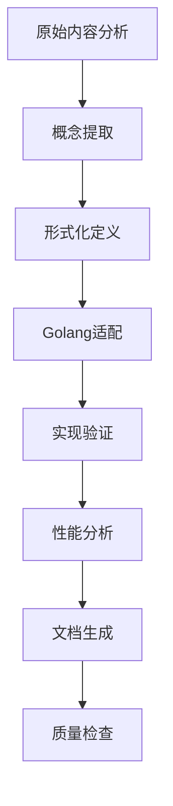

# 设计模式分析框架

## 目录

1. [概述](#1-概述)
2. [分析框架](#2-分析框架)
3. [形式化方法](#3-形式化方法)
4. [分类体系](#4-分类体系)
5. [Golang实现规范](#5-golang实现规范)
6. [质量保证](#6-质量保证)
7. [持续更新](#7-持续更新)

## 1. 概述

### 1.1 设计模式定义

设计模式是软件设计中常见问题的最佳实践解决方案，提供了一套可重用的设计模板。在Golang中，设计模式的应用需要考虑语言特性和并发模型。

**形式化定义**：

设 $P$ 为设计模式集合，$S$ 为软件系统，$C$ 为上下文环境，则设计模式可定义为：

$$P = \{p_i | p_i = (Problem_i, Solution_i, Context_i, Forces_i)\}$$

其中：

- $Problem_i$ 是问题描述
- $Solution_i$ 是解决方案
- $Context_i$ 是应用上下文
- $Forces_i$ 是设计权衡

### 1.2 分析目标

- **系统性梳理**：递归分析所有设计模式内容
- **Golang适配**：将设计模式适配到Golang语言特性
- **形式化重构**：建立严格的数学定义和证明
- **多表征组织**：使用图表、数学表达式、代码示例
- **去重与合并**：避免重复，建立统一分类体系

## 2. 分析框架

### 2.1 分析层次

```text
理念层 (Philosophical Level)
    ↓
形式科学层 (Formal Science Level)
    ↓
理论层 (Theoretical Level)
    ↓
具体科学层 (Concrete Science Level)
    ↓
算法设计层 (Algorithm Design Level)
    ↓
编程实践层 (Programming Practice Level)
```

### 2.2 分析维度

| 维度 | 描述 | 内容 |
|------|------|------|
| **概念维度** | 模式的核心概念和定义 | 形式化定义、数学表达式 |
| **结构维度** | 模式的组成结构 | UML图、类图、时序图 |
| **行为维度** | 模式的动态行为 | 状态图、活动图 |
| **实现维度** | Golang具体实现 | 代码示例、接口设计 |
| **性能维度** | 性能特征和优化 | 复杂度分析、基准测试 |
| **应用维度** | 实际应用场景 | 案例分析、最佳实践 |

### 2.3 分析流程



## 3. 形式化方法

### 3.1 数学建模

#### 3.1.1 模式代数

设 $M$ 为模式集合，定义模式代数：

$$(M, \oplus, \otimes, \circ)$$

其中：

- $\oplus$ 为模式组合操作
- $\otimes$ 为模式变换操作  
- $\circ$ 为模式应用操作

#### 3.1.2 模式关系

定义模式间的关系：

$$R = \{(p_i, p_j, r_{ij}) | p_i, p_j \in P, r_{ij} \in \{inherits, composes, uses\}\}$$

### 3.2 形式化证明

#### 3.2.1 正确性证明

对于每个模式 $p_i$，需要证明：

$$\forall c \in C_i, \exists s \in S_i : \Phi(c, s) \land \Psi(s)$$

其中：

- $\Phi(c, s)$ 表示解决方案 $s$ 满足上下文 $c$ 的需求
- $\Psi(s)$ 表示解决方案 $s$ 的正确性

#### 3.2.2 性能证明

对于性能相关的模式，需要证明：

$$T(n) \in O(f(n)) \land M(n) \in O(g(n))$$

其中 $T(n)$ 和 $M(n)$ 分别为时间复杂度和空间复杂度。

## 4. 分类体系

### 4.1 基础分类

```text
设计模式
├── 创建型模式 (Creational Patterns)
│   ├── 单例模式 (Singleton)
│   ├── 工厂方法模式 (Factory Method)
│   ├── 抽象工厂模式 (Abstract Factory)
│   ├── 建造者模式 (Builder)
│   └── 原型模式 (Prototype)
├── 结构型模式 (Structural Patterns)
│   ├── 适配器模式 (Adapter)
│   ├── 桥接模式 (Bridge)
│   ├── 组合模式 (Composite)
│   ├── 装饰器模式 (Decorator)
│   ├── 外观模式 (Facade)
│   ├── 享元模式 (Flyweight)
│   └── 代理模式 (Proxy)
├── 行为型模式 (Behavioral Patterns)
│   ├── 责任链模式 (Chain of Responsibility)
│   ├── 命令模式 (Command)
│   ├── 解释器模式 (Interpreter)
│   ├── 迭代器模式 (Iterator)
│   ├── 中介者模式 (Mediator)
│   ├── 备忘录模式 (Memento)
│   ├── 观察者模式 (Observer)
│   ├── 状态模式 (State)
│   ├── 策略模式 (Strategy)
│   ├── 模板方法模式 (Template Method)
│   └── 访问者模式 (Visitor)
└── 并发模式 (Concurrent Patterns)
    ├── 活动对象模式 (Active Object)
    ├── 管程模式 (Monitor)
    ├── 线程池模式 (Thread Pool)
    ├── 生产者-消费者模式 (Producer-Consumer)
    ├── 读写锁模式 (Readers-Writer Lock)
    ├── Future/Promise模式
    └── Actor模型
```

### 4.2 高级分类

```text
高级设计模式
├── 分布式模式 (Distributed Patterns)
│   ├── 服务发现 (Service Discovery)
│   ├── 熔断器模式 (Circuit Breaker)
│   ├── API网关 (API Gateway)
│   ├── Saga模式
│   ├── 领导者选举 (Leader Election)
│   ├── 分片/分区 (Sharding/Partitioning)
│   ├── 复制 (Replication)
│   └── 消息队列 (Message Queue)
├── 工作流模式 (Workflow Patterns)
│   ├── 状态机模式 (State Machine)
│   ├── 工作流引擎 (Workflow Engine)
│   ├── 任务队列 (Task Queue)
│   └── 编排vs协同 (Orchestration vs Choreography)
└── 函数式模式 (Functional Patterns)
    ├── 高阶函数 (Higher-Order Functions)
    ├── 函数组合 (Function Composition)
    ├── 柯里化 (Currying)
    ├── 单子模式 (Monad Pattern)
    └── 函子模式 (Functor Pattern)
```

## 5. Golang实现规范

### 5.1 接口设计原则

#### 5.1.1 接口隔离原则

```go
// 好的接口设计
type Reader interface {
    Read(p []byte) (n int, err error)
}

type Writer interface {
    Write(p []byte) (n int, err error)
}

type ReadWriter interface {
    Reader
    Writer
}
```

#### 5.1.2 组合优于继承

```go
// 使用组合而不是继承
type Logger struct {
    writer io.Writer
    level  Level
}

func (l *Logger) Log(message string) {
    // 实现日志记录
}
```

### 5.2 并发安全设计

#### 5.2.1 互斥锁模式

```go
type SafeCounter struct {
    mu    sync.Mutex
    count int
}

func (c *SafeCounter) Increment() {
    c.mu.Lock()
    defer c.mu.Unlock()
    c.count++
}
```

#### 5.2.2 通道模式

```go
type WorkerPool struct {
    workers int
    jobs    chan Job
    results chan Result
}

func (wp *WorkerPool) Start() {
    for i := 0; i < wp.workers; i++ {
        go wp.worker()
    }
}
```

### 5.3 错误处理模式

#### 5.3.1 错误包装

```go
type AppError struct {
    Code    int
    Message string
    Err     error
}

func (e *AppError) Error() string {
    return fmt.Sprintf("code=%d, message=%s: %v", e.Code, e.Message, e.Err)
}

func (e *AppError) Unwrap() error {
    return e.Err
}
```

#### 5.3.2 错误恢复

```go
func (s *Service) ProcessWithRecovery() (result Result, err error) {
    defer func() {
        if r := recover(); r != nil {
            err = fmt.Errorf("panic recovered: %v", r)
        }
    }()
    
    return s.process()
}
```

## 6. 质量保证

### 6.1 代码质量标准

| 标准 | 描述 | 检查项 |
|------|------|--------|
| **可读性** | 代码清晰易懂 | 命名规范、注释完整 |
| **可维护性** | 易于修改和扩展 | 模块化、低耦合 |
| **可测试性** | 易于单元测试 | 依赖注入、接口抽象 |
| **性能** | 满足性能要求 | 复杂度分析、基准测试 |
| **安全性** | 避免安全漏洞 | 输入验证、并发安全 |

### 6.2 文档质量标准

| 标准 | 描述 | 要求 |
|------|------|------|
| **完整性** | 覆盖所有必要内容 | 概念、实现、示例、测试 |
| **准确性** | 信息准确无误 | 代码可运行、理论正确 |
| **一致性** | 术语和格式统一 | 统一的命名和格式规范 |
| **可读性** | 易于理解 | 清晰的逻辑结构、图表辅助 |

### 6.3 验证方法

#### 6.3.1 代码验证

```go
// 单元测试示例
func TestSingletonPattern(t *testing.T) {
    instance1 := GetInstance()
    instance2 := GetInstance()
    
    if instance1 != instance2 {
        t.Error("Singleton pattern failed: instances are not the same")
    }
}
```

#### 6.3.2 性能验证

```go
// 基准测试示例
func BenchmarkPattern(b *testing.B) {
    for i := 0; i < b.N; i++ {
        // 测试模式实现
    }
}
```

## 7. 持续更新

### 7.1 更新机制

- **定期审查**：每月审查一次所有模式实现
- **版本控制**：使用语义化版本控制
- **反馈收集**：收集用户反馈并改进
- **新技术适配**：适配新的Golang特性和库

### 7.2 版本管理

```yaml
version: "1.0.0"
last_updated: "2024-01-01"
patterns:
  - name: "Singleton"
    version: "1.0.0"
    status: "stable"
  - name: "Factory Method"
    version: "1.0.0"
    status: "stable"
```

### 7.3 贡献指南

1. **代码贡献**：遵循Go代码规范
2. **文档贡献**：遵循Markdown规范
3. **测试贡献**：提供完整的测试用例
4. **示例贡献**：提供实用的应用示例

---

*本框架将持续更新，确保设计模式分析的质量和完整性。*
