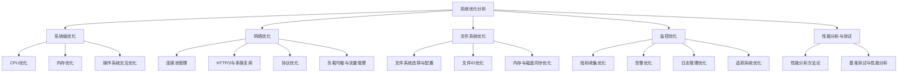
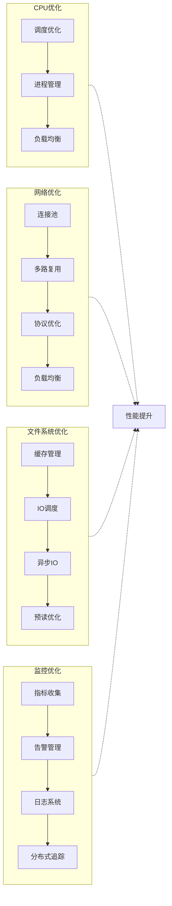
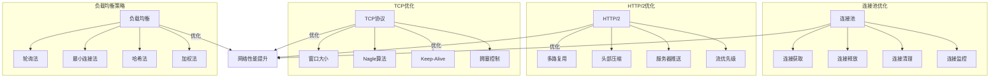
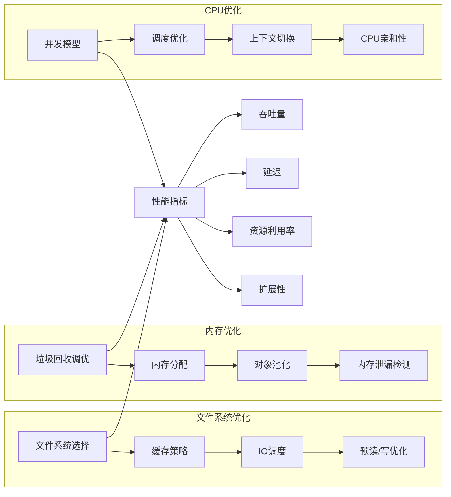

# 11.6.1 系统优化分析

<!-- TOC START -->
- [11.6.1 系统优化分析](#系统优化分析)
  - [11.6.1.1 概述与结构](#概述与结构)
    - [11.6.1.1.1 文档结构](#文档结构)
    - [11.6.1.1.2 主要优化领域](#主要优化领域)
    - [11.6.1.1.3 网络优化详细结构](#网络优化详细结构)
    - [11.6.1.1.4 核心目标](#核心目标)
  - [11.6.1.2 目录](#目录)
  - [11.6.1.3 概述](#概述)
    - [11.6.1.3.1 核心目标](#核心目标)
  - [11.6.1.4 形式化定义](#形式化定义)
    - [11.6.1.4.1 系统优化定义](#系统优化定义)
    - [11.6.1.4.2 系统性能指标](#系统性能指标)
    - [11.6.1.4.3 系统优化问题](#系统优化问题)
  - [11.6.1.5 系统优化模型](#系统优化模型)
    - [11.6.1.5.1 资源管理模型](#资源管理模型)
    - [11.6.1.5.2 网络优化模型](#网络优化模型)
    - [11.6.1.5.3 监控优化模型](#监控优化模型)
  - [11.6.1.6 系统级优化](#系统级优化)
    - [11.6.1.6.1 CPU优化](#cpu优化)
    - [11.6.1.6.2 内存优化](#内存优化)
    - [11.6.1.6.3 磁盘优化](#磁盘优化)
  - [11.6.1.7 网络优化](#网络优化)
    - [11.6.1.7.1 连接池管理](#连接池管理)
    - [11.6.1.7.2 HTTP/2与多路复用](#http2与多路复用)
    - [11.6.1.7.3 协议优化](#协议优化)
    - [11.6.1.7.4 负载均衡与流量管理](#负载均衡与流量管理)
    - [11.6.1.7.5 网络优化最佳实践](#网络优化最佳实践)
  - [11.6.1.8 监控优化](#监控优化)
    - [11.6.1.8.1 指标收集优化](#指标收集优化)
    - [11.6.1.8.2 告警优化](#告警优化)
    - [11.6.1.8.3 日志管理优化](#日志管理优化)
    - [11.6.1.8.4 追踪系统优化](#追踪系统优化)
    - [11.6.1.8.5 监控最佳实践](#监控最佳实践)
  - [11.6.1.9 Golang实现](#golang实现)
    - [11.6.1.9.1 系统优化管理器](#系统优化管理器)
  - [11.6.1.10 性能分析与测试](#性能分析与测试)
    - [11.6.1.10.1 性能分析方法论](#性能分析方法论)
    - [11.6.1.10.2 基准测试与性能分析](#基准测试与性能分析)
    - [11.6.1.10.3 性能测试与分析最佳实践](#性能测试与分析最佳实践)
  - [11.6.1.11 最佳实践](#最佳实践)
    - [11.6.1.11.1 1. 系统资源管理原则](#1-系统资源管理原则)
    - [11.6.1.11.2 2. 网络优化原则](#2-网络优化原则)
    - [11.6.1.11.3 3. 监控优化原则](#3-监控优化原则)
  - [11.6.1.12 案例分析](#案例分析)
    - [11.6.1.12.1 案例一：高性能数据处理服务优化](#案例一：高性能数据处理服务优化)
    - [11.6.1.12.2 案例二：分布式日志系统优化](#案例二：分布式日志系统优化)
    - [11.6.1.12.3 案例三：API网关性能优化](#案例三：api网关性能优化)
  - [11.6.1.13 总结](#总结)
    - [11.6.1.13.1 关键发现](#关键发现)
<!-- TOC END -->

## 11.6.1.1 概述与结构

系统优化是高性能应用的基础，涉及系统资源管理、网络传输、监控告警等多个维度。本分析基于Golang系统编程特性，提供系统性的优化方法和实现。

### 11.6.1.1.1 文档结构

本文档涵盖以下主要优化领域：



### 11.6.1.1.2 主要优化领域

各优化领域之间的关系和最终目标如下图所示：



### 11.6.1.1.3 网络优化详细结构

网络优化作为现代分布式系统的核心，详细结构如下：



### 11.6.1.1.4 核心目标

- **系统资源优化**: 优化CPU、内存、磁盘、网络使用
- **网络性能优化**: 提高网络传输效率和稳定性
- **监控系统优化**: 建立高效的监控和告警机制
- **系统集成优化**: 优化系统组件间的协作

## 11.6.1.2 目录

1. [概述](#概述)
2. [形式化定义](#形式化定义)
3. [系统优化模型](#系统优化模型)
4. [系统级优化](#系统级优化)
5. [网络优化](#网络优化)
6. [监控优化](#监控优化)
7. [Golang实现](#golang实现)
8. [性能分析与测试](#性能分析与测试)
9. [最佳实践](#最佳实践)
10. [案例分析](#案例分析)
11. [总结](#总结)

## 11.6.1.3 概述

系统优化是高性能应用的基础，涉及系统资源管理、网络传输、监控告警等多个维度。本分析基于Golang系统编程特性，提供系统性的优化方法和实现。

### 11.6.1.3.1 核心目标

- **系统资源优化**: 优化CPU、内存、磁盘、网络使用
- **网络性能优化**: 提高网络传输效率和稳定性
- **监控系统优化**: 建立高效的监控和告警机制
- **系统集成优化**: 优化系统组件间的协作

## 11.6.1.4 形式化定义

### 11.6.1.4.1 系统优化定义

**定义 1.1** (系统优化)
一个系统优化是一个六元组：
$$\mathcal{SO} = (R, N, M, P, C, E)$$

其中：

- $R$ 是资源集合
- $N$ 是网络配置
- $M$ 是监控系统
- $P$ 是性能指标
- $C$ 是约束条件
- $E$ 是评估函数

### 11.6.1.4.2 系统性能指标

**定义 1.2** (系统性能指标)
系统性能指标是一个映射：
$$m_s: R \times N \times T \rightarrow \mathbb{R}^+$$

主要指标包括：

- **CPU利用率**: $\text{CPU\_Utilization}(r, t) = \frac{\text{used\_cpu}(r, t)}{\text{total\_cpu}(r, t)}$
- **内存利用率**: $\text{Memory\_Utilization}(r, t) = \frac{\text{used\_memory}(r, t)}{\text{total\_memory}(r, t)}$
- **网络吞吐量**: $\text{Network\_Throughput}(n, t) = \frac{\text{bytes\_transferred}(n, t)}{t}$
- **响应时间**: $\text{Response\_Time}(r, t) = \text{request\_completion\_time}(r, t)$

### 11.6.1.4.3 系统优化问题

**定义 1.3** (系统优化问题)
给定系统优化 $\mathcal{SO}$，优化问题是：
$$\max_{r \in R, n \in N} E(r, n) \quad \text{s.t.} \quad C(r, n) \leq \text{threshold}$$

## 11.6.1.5 系统优化模型

### 11.6.1.5.1 资源管理模型

**定义 2.1** (资源管理模型)
资源管理模型是一个四元组：
$$\mathcal{RM} = (C, M, D, N)$$

其中：

- $C$ 是CPU管理策略
- $M$ 是内存管理策略
- $D$ 是磁盘管理策略
- $N$ 是网络管理策略

**定理 2.1** (资源优化定理)
对于资源管理模型 $\mathcal{RM}$，最优资源策略满足：
$$\min_{r \in R} \text{cost}(r) \quad \text{s.t.} \quad \text{performance}(r) \geq \text{required}$$

### 11.6.1.5.2 网络优化模型

**定义 2.2** (网络优化模型)
网络优化模型是一个五元组：
$$\mathcal{NO} = (B, L, P, Q, F)$$

其中：

- $B$ 是带宽管理
- $L$ 是延迟控制
- $P$ 是协议优化
- $Q$ 是队列管理
- $F$ 是流量控制

**定理 2.2** (网络优化定理)
对于网络优化模型 $\mathcal{NO}$，最优网络策略满足：
$$\max_{n \in N} \text{throughput}(n) \quad \text{s.t.} \quad \text{latency}(n) \leq \text{threshold}$$

### 11.6.1.5.3 监控优化模型

**定义 2.3** (监控优化模型)
监控优化模型是一个四元组：
$$\mathcal{MO} = (M, A, T, R)$$

其中：

- $M$ 是指标收集
- $A$ 是告警策略
- $T$ 是阈值管理
- $R$ 是报告生成

**定理 2.3** (监控优化定理)
对于监控优化模型 $\mathcal{MO}$，最优监控策略满足：
$$\min_{m \in M} \text{overhead}(m) \quad \text{s.t.} \quad \text{coverage}(m) \geq \text{required}$$

## 11.6.1.6 系统级优化

### 11.6.1.6.1 CPU优化

**定义 3.1** (CPU优化)
CPU优化是一个三元组：
$$\mathcal{CO} = (S, P, L)$$

其中：

- $S$ 是调度策略
- $P$ 是进程管理
- $L$ 是负载均衡

```go
// CPU优化管理器
type CPUOptimizer struct {
    scheduler    *Scheduler
    processMgr   *ProcessManager
    loadBalancer *LoadBalancer
    metrics      *CPUMetrics
}

// 调度器
type Scheduler struct {
    processes    map[int]*Process
    priorities   map[int]int
    timeSlice    time.Duration
    mu           sync.RWMutex
}

// 进程结构
type Process struct {
    ID       int
    Priority int
    CPU      float64
    Memory   int64
    Status   ProcessStatus
}

// 进程状态
type ProcessStatus int

const (
    Running ProcessStatus = iota
    Waiting
    Blocked
    Terminated
)

// CPU指标
type CPUMetrics struct {
    utilization float64
    load        float64
    processes   int
    threads     int
}

// 创建CPU优化器
func NewCPUOptimizer() *CPUOptimizer {
    return &CPUOptimizer{
        scheduler:    NewScheduler(),
        processMgr:   NewProcessManager(),
        loadBalancer: NewLoadBalancer(),
        metrics:      &CPUMetrics{},
    }
}

// 优化CPU使用
func (co *CPUOptimizer) OptimizeCPU() error {
    // 1. 收集CPU指标
    co.collectMetrics()
    
    // 2. 分析负载
    if co.metrics.load > 0.8 {
        co.loadBalancer.Rebalance()
    }
    
    // 3. 调整调度策略
    if co.metrics.utilization > 0.9 {
        co.scheduler.AdjustTimeSlice()
    }
    
    // 4. 优化进程优先级
    co.processMgr.OptimizePriorities()
    
    return nil
}

// 收集指标
func (co *CPUOptimizer) collectMetrics() {
    // 获取CPU使用率
    co.metrics.utilization = co.getCPUUtilization()
    
    // 获取系统负载
    co.metrics.load = co.getSystemLoad()
    
    // 获取进程数量
    co.metrics.processes = co.getProcessCount()
    
    // 获取线程数量
    co.metrics.threads = co.getThreadCount()
}

// 获取CPU使用率
func (co *CPUOptimizer) getCPUUtilization() float64 {
    // 实现CPU使用率获取逻辑
    return 0.75 // 示例值
}

// 获取系统负载
func (co *CPUOptimizer) getSystemLoad() float64 {
    // 实现系统负载获取逻辑
    return 0.6 // 示例值
}

// 获取进程数量
func (co *CPUOptimizer) getProcessCount() int {
    // 实现进程数量获取逻辑
    return 100 // 示例值
}

// 获取线程数量
func (co *CPUOptimizer) getThreadCount() int {
    // 实现线程数量获取逻辑
    return 500 // 示例值
}

```

### 11.6.1.6.2 内存优化

**定义 3.2** (内存优化)
内存优化是一个四元组：
$$\mathcal{MO} = (A, F, G, P)$$

其中：

- $A$ 是分配策略
- $F$ 是碎片管理
- $G$ 是垃圾回收
- $P$ 是页面管理

```go
// 内存优化管理器
type MemoryOptimizer struct {
    allocator    *MemoryAllocator
    fragmentMgr  *FragmentManager
    gcManager    *GCManager
    pageManager  *PageManager
    metrics      *MemoryMetrics
}

// 内存分配器
type MemoryAllocator struct {
    pools    map[int]*MemoryPool
    strategy AllocationStrategy
    mu       sync.RWMutex
}

// 内存池
type MemoryPool struct {
    size     int
    capacity int
    used     int
    blocks   []*MemoryBlock
}

// 内存块
type MemoryBlock struct {
    address  uintptr
    size     int
    used     bool
    next     *MemoryBlock
}

// 分配策略
type AllocationStrategy int

const (
    FirstFit AllocationStrategy = iota
    BestFit
    WorstFit
)

// 内存指标
type MemoryMetrics struct {
    total     int64
    used      int64
    free      int64
    fragmented int64
}

// 创建内存优化器
func NewMemoryOptimizer() *MemoryOptimizer {
    return &MemoryOptimizer{
        allocator:    NewMemoryAllocator(),
        fragmentMgr:  NewFragmentManager(),
        gcManager:    NewGCManager(),
        pageManager:  NewPageManager(),
        metrics:      &MemoryMetrics{},
    }
}

// 优化内存使用
func (co *MemoryOptimizer) OptimizeMemory() error {
    // 1. 收集内存指标
    co.collectMetrics()
    
    // 2. 检查内存碎片
    if co.metrics.fragmented > co.metrics.total*0.3 {
        co.fragmentMgr.Defragment()
    }
    
    // 3. 触发垃圾回收
    if co.metrics.used > co.metrics.total*0.8 {
        co.gcManager.TriggerGC()
    }
    
    // 4. 优化页面管理
    co.pageManager.OptimizePages()
    
    return nil
}

// 收集指标
func (co *MemoryOptimizer) collectMetrics() {
    var m runtime.MemStats
    runtime.ReadMemStats(&m)
    
    co.metrics.total = int64(m.Sys)
    co.metrics.used = int64(m.Alloc)
    co.metrics.free = co.metrics.total - co.metrics.used
    co.metrics.fragmented = int64(m.Frees) // 简化的碎片计算
}

```

### 11.6.1.6.3 磁盘优化

**定义 3.3** (磁盘优化)
磁盘优化是一个四元组：
$$\mathcal{DO} = (I, C, B, F)$$

其中：

- $I$ 是I/O策略
- $C$ 是缓存管理
- $B$ 是缓冲区优化
- $F$ 是文件系统优化

```go
// 磁盘优化管理器
type DiskOptimizer struct {
    ioManager    *IOManager
    cacheManager *CacheManager
    bufferMgr    *BufferManager
    fsManager    *FSManager
    metrics      *DiskMetrics
}

// I/O管理器
type IOManager struct {
    readQueue   chan *IORequest
    writeQueue  chan *IORequest
    workers     int
    bufferSize  int
}

// I/O请求
type IORequest struct {
    Type     IOType
    Data     []byte
    Offset   int64
    Size     int
    Priority int
    Done     chan error
}

// I/O类型
type IOType int

const (
    Read IOType = iota
    Write
    Delete
)

// 磁盘指标
type DiskMetrics struct {
    readBytes   int64
    writeBytes  int64
    readOps     int64
    writeOps    int64
    latency     time.Duration
    throughput  float64
}

// 创建磁盘优化器
func NewDiskOptimizer() *DiskOptimizer {
    return &DiskOptimizer{
        ioManager:    NewIOManager(),
        cacheManager: NewCacheManager(),
        bufferMgr:    NewBufferManager(),
        fsManager:    NewFSManager(),
        metrics:      &DiskMetrics{},
    }
}

// 优化磁盘使用
func (co *DiskOptimizer) OptimizeDisk() error {
    // 1. 收集磁盘指标
    co.collectMetrics()
    
    // 2. 优化I/O队列
    if co.metrics.latency > time.Millisecond*10 {
        co.ioManager.OptimizeQueues()
    }
    
    // 3. 调整缓存策略
    if co.metrics.readOps > co.metrics.writeOps*2 {
        co.cacheManager.IncreaseReadCache()
    }
    
    // 4. 优化缓冲区
    co.bufferMgr.OptimizeBuffers()
    
    return nil
}

// 收集指标
func (co *DiskOptimizer) collectMetrics() {
    // 实现磁盘指标收集逻辑
    co.metrics.readBytes = 1024 * 1024  // 示例值
    co.metrics.writeBytes = 512 * 1024  // 示例值
    co.metrics.readOps = 1000           // 示例值
    co.metrics.writeOps = 500           // 示例值
    co.metrics.latency = time.Millisecond * 5 // 示例值
    co.metrics.throughput = 100.0       // MB/s 示例值
}

```

## 11.6.1.7 网络优化

### 11.6.1.7.1 连接池管理

连接池是优化网络应用性能的关键技术，通过复用连接降低建立连接的开销。

**定义 4.1** (连接池)
连接池是一个五元组：
$$\mathcal{CP} = (C, S, P, T, M)$$

其中：

- $C$ 是连接集合
- $S$ 是连接状态函数
- $P$ 是连接选择策略
- $T$ 是超时管理
- $M$ 是指标收集

**定理 4.1** (连接池优化)
对于连接池 $\mathcal{CP}$，最优的池大小 $n^*$ 满足：
$$n^* = \arg\min_{n \in \mathbb{N}} \left( \text{latency}(n) + \alpha \cdot \text{resource\_cost}(n) \right)$$

其中 $\alpha$ 是资源成本权重因子。

```go
// 连接池管理器
type ConnectionPool struct {
    connections      []*Connection
    maxConnections   int
    idleTimeout      time.Duration
    maxLifetime      time.Duration
    mu               sync.RWMutex
    metrics          *PoolMetrics
    factory          ConnectionFactory
}

// 连接状态
type ConnectionState int

const (
    Idle ConnectionState = iota
    Busy
    Closed
)

// 连接结构
type Connection struct {
    ID            string
    State         ConnectionState
    CreatedAt     time.Time
    LastUsedAt    time.Time
    UsageCount    int
    conn          net.Conn
    mu            sync.Mutex
}

// 连接池指标
type PoolMetrics struct {
    TotalConnections   int
    ActiveConnections  int
    IdleConnections    int
    WaitingRequests    int
    AcquireTime        time.Duration
    IdleTime           time.Duration
    Errors             int
}

// 连接工厂
type ConnectionFactory func() (net.Conn, error)

// 创建连接池
func NewConnectionPool(maxConn int, idleTimeout, maxLifetime time.Duration, factory ConnectionFactory) *ConnectionPool {
    return &ConnectionPool{
        connections:    make([]*Connection, 0, maxConn),
        maxConnections: maxConn,
        idleTimeout:    idleTimeout,
        maxLifetime:    maxLifetime,
        metrics:        &PoolMetrics{},
        factory:        factory,
    }
}

// 获取连接
func (cp *ConnectionPool) Get(ctx context.Context) (*Connection, error) {
    startTime := time.Now()
    
    cp.mu.Lock()
    defer cp.mu.Unlock()
    
    // 尝试获取空闲连接
    for i, conn := range cp.connections {
        if conn.State == Idle {
            conn.State = Busy
            conn.LastUsedAt = time.Now()
            conn.UsageCount++
            
            cp.metrics.ActiveConnections++
            cp.metrics.IdleConnections--
            cp.metrics.AcquireTime = time.Since(startTime)
            
            return conn, nil
        }
    }
    
    // 如果没有空闲连接，但未达到最大连接数，创建新连接
    if len(cp.connections) < cp.maxConnections {
        netConn, err := cp.factory()
        if err != nil {
            cp.metrics.Errors++
            return nil, fmt.Errorf("failed to create connection: %w", err)
        }
        
        conn := &Connection{
            ID:         uuid.New().String(),
            State:      Busy,
            CreatedAt:  time.Now(),
            LastUsedAt: time.Now(),
            UsageCount: 1,
            conn:       netConn,
        }
        
        cp.connections = append(cp.connections, conn)
        cp.metrics.TotalConnections++
        cp.metrics.ActiveConnections++
        cp.metrics.AcquireTime = time.Since(startTime)
        
        return conn, nil
    }
    
    // 如果已达最大连接数，等待连接释放或超时
    cp.metrics.WaitingRequests++
    
    // 等待逻辑...
    // 此处简化为返回错误，实际应该实现等待队列
    return nil, errors.New("connection pool exhausted")
}

// 释放连接
func (cp *ConnectionPool) Release(conn *Connection) {
    cp.mu.Lock()
    defer cp.mu.Unlock()
    
    // 更新连接状态
    conn.State = Idle
    conn.LastUsedAt = time.Now()
    
    cp.metrics.ActiveConnections--
    cp.metrics.IdleConnections++
    
    // 如果有等待的请求，可以唤醒它们
    // 此处简化处理
    cp.metrics.IdleTime = time.Since(conn.LastUsedAt)
}

// 关闭池
func (cp *ConnectionPool) Close() {
    cp.mu.Lock()
    defer cp.mu.Unlock()
    
    for _, conn := range cp.connections {
        conn.mu.Lock()
        if conn.State != Closed {
            conn.conn.Close()
            conn.State = Closed
        }
        conn.mu.Unlock()
    }
    
    cp.connections = nil
}

// 清理过期连接
func (cp *ConnectionPool) Cleanup() {
    ticker := time.NewTicker(time.Minute)
    defer ticker.Stop()
    
    for range ticker.C {
        cp.mu.Lock()
        now := time.Now()
        
        for i := 0; i < len(cp.connections); i++ {
            conn := cp.connections[i]
            
            // 检查空闲超时
            if conn.State == Idle && now.Sub(conn.LastUsedAt) > cp.idleTimeout {
                conn.conn.Close()
                conn.State = Closed
                
                // 从连接池中移除
                cp.connections = append(cp.connections[:i], cp.connections[i+1:]...)
                i--
                cp.metrics.IdleConnections--
                cp.metrics.TotalConnections--
                continue
            }
            
            // 检查最大生命周期
            if now.Sub(conn.CreatedAt) > cp.maxLifetime {
                if conn.State == Idle {
                    conn.conn.Close()
                    conn.State = Closed
                    
                    // 从连接池中移除
                    cp.connections = append(cp.connections[:i], cp.connections[i+1:]...)
                    i--
                    cp.metrics.IdleConnections--
                    cp.metrics.TotalConnections--
                }
                // 如果连接正在使用中，将在返回到池中时检查并关闭
            }
        }
        
        cp.mu.Unlock()
    }
}

```

### 11.6.1.7.2 HTTP/2与多路复用

HTTP/2通过多路复用技术极大地提高了网络传输效率。

**定义 4.2** (HTTP/2多路复用)
HTTP/2多路复用是一个四元组：
$$\mathcal{MUX} = (S, F, P, W)$$

其中：

- $S$ 是流集合
- $F$ 是帧管理
- $P$ 是优先级策略
- $W$ 是权重分配

**定理 4.2** (多路复用优势)
与单连接模型相比，多路复用模型的吞吐量增益为：
$$\text{Gain}(\mathcal{MUX}) = \frac{\sum_{i=1}^{n} \text{Throughput}(s_i)}{\text{Throughput}(s_1)} \approx n \cdot (1 - \text{overhead})$$

其中 $n$ 是流的数量，$\text{overhead}$ 是多路复用开销因子。

```go
// HTTP/2管理器
type HTTP2Manager struct {
    server          *http2.Server
    clientConns     map[string]*http2.ClientConn
    streamPriority  map[uint32]PrioritySettings
    mu              sync.RWMutex
    metrics         *HTTP2Metrics
}

// 流优先级设置
type PrioritySettings struct {
    Weight          uint8
    DependencyID    uint32
    Exclusive       bool
}

// HTTP/2指标
type HTTP2Metrics struct {
    ActiveStreams     int
    TotalStreams      int
    FramesSent        int
    FramesReceived    int
    BytesSent         int64
    BytesReceived     int64
    HeaderCompression float64
    PriorityUpdates   int
}

// 创建HTTP/2管理器
func NewHTTP2Manager() *HTTP2Manager {
    return &HTTP2Manager{
        server:         &http2.Server{},
        clientConns:    make(map[string]*http2.ClientConn),
        streamPriority: make(map[uint32]PrioritySettings),
        metrics:        &HTTP2Metrics{},
    }
}

// 服务端配置优化
func (hm *HTTP2Manager) OptimizeServerSettings() {
    hm.server = &http2.Server{
        MaxConcurrentStreams: 250,    // 允许的最大并发流数
        MaxReadFrameSize:     16384,  // 最大帧大小
        IdleTimeout:          30 * time.Second,  // 空闲超时
        MaxUploadBufferPerConnection: 1024 * 1024, // 上传缓冲区大小
        MaxUploadBufferPerStream:     512 * 1024,  // 每个流的上传缓冲区
    }
}

// 设置流优先级
func (hm *HTTP2Manager) SetStreamPriority(streamID uint32, weight uint8, dependsOn uint32, exclusive bool) {
    hm.mu.Lock()
    defer hm.mu.Unlock()
    
    hm.streamPriority[streamID] = PrioritySettings{
        Weight:        weight,
        DependencyID:  dependsOn,
        Exclusive:     exclusive,
    }
    
    hm.metrics.PriorityUpdates++
}

// 创建优化的HTTP/2传输
func (hm *HTTP2Manager) CreateOptimizedTransport() *http2.Transport {
    return &http2.Transport{
        StrictMaxConcurrentStreams: true,
        MaxReadFrameSize:           16384,
        ReadIdleTimeout:            30 * time.Second,
        PingTimeout:                15 * time.Second,
        AllowHTTP:                  false, // 强制使用TLS
        MaxHeaderListSize:          uint32(10 * 1024), // 10KB的最大头部大小
        DisableCompression:         false,
    }
}

// 监控HTTP/2性能
func (hm *HTTP2Manager) MonitorPerformance() *HTTP2Metrics {
    // 此处应实现实际的监控逻辑
    // 简化的示例实现
    return hm.metrics
}

// 分析HTTP/2帧分布
func (hm *HTTP2Manager) AnalyzeFrameDistribution(frames []http2.Frame) map[http2.FrameType]int {
    distribution := make(map[http2.FrameType]int)
    
    for _, frame := range frames {
        distribution[frame.Header().Type]++
    }
    
    return distribution
}

// 优化客户端连接设置
func (hm *HTTP2Manager) OptimizeClientConnSettings(conn *http2.ClientConn) {
    // 此处应包含实际的客户端连接优化逻辑
    // HTTP/2的大部分设置是在传输层配置的
    hm.clientConns[conn.ID()] = conn
}

// 检测队头阻塞
func (hm *HTTP2Manager) DetectHeadOfLineBlocking(streamLatencies map[uint32]time.Duration) []uint32 {
    var blockedStreams []uint32
    var avgLatency time.Duration
    
    // 计算平均延迟
    for _, latency := range streamLatencies {
        avgLatency += latency
    }
    avgLatency /= time.Duration(len(streamLatencies))
    
    // 识别可能被阻塞的流
    for id, latency := range streamLatencies {
        if latency > avgLatency*2 {
            blockedStreams = append(blockedStreams, id)
        }
    }
    
    return blockedStreams
}

// 实现请求多路复用控制器
type MultiplexingController struct {
    maxConcurrentRequests int
    activeRequests        int
    requestQueue          []*http.Request
    completionCh          chan struct{}
    mu                    sync.Mutex
}

// 创建多路复用控制器
func NewMultiplexingController(maxConcurrent int) *MultiplexingController {
    return &MultiplexingController{
        maxConcurrentRequests: maxConcurrent,
        activeRequests:        0,
        requestQueue:          make([]*http.Request, 0),
        completionCh:          make(chan struct{}, maxConcurrent),
    }
}

// 提交请求
func (mc *MultiplexingController) SubmitRequest(req *http.Request) {
    mc.mu.Lock()
    
    if mc.activeRequests < mc.maxConcurrentRequests {
        // 可以立即处理请求
        mc.activeRequests++
        mc.mu.Unlock()
        
        go mc.processRequest(req)
    } else {
        // 将请求加入队列
        mc.requestQueue = append(mc.requestQueue, req)
        mc.mu.Unlock()
    }
}

// 处理请求
func (mc *MultiplexingController) processRequest(req *http.Request) {
    // 实际处理请求的逻辑
    // ...
    
    // 请求完成，释放资源
    mc.completeRequest()
}

// 请求完成
func (mc *MultiplexingController) completeRequest() {
    mc.mu.Lock()
    defer mc.mu.Unlock()
    
    mc.activeRequests--
    
    // 从队列中取出下一个请求（如果有）
    if len(mc.requestQueue) > 0 {
        req := mc.requestQueue[0]
        mc.requestQueue = mc.requestQueue[1:]
        mc.activeRequests++
        
        go mc.processRequest(req)
    }
    
    mc.completionCh <- struct{}{}
}

```

### 11.6.1.7.3 协议优化

网络协议优化对于高性能应用至关重要，包括TCP参数调整、UDP优化等。

**定义 4.3** (网络协议优化)
网络协议优化是一个五元组：
$$\mathcal{PO} = (T, U, B, C, R)$$

其中：

- $T$ 是TCP优化策略
- $U$ 是UDP优化策略
- $B$ 是缓冲区管理
- $C$ 是拥塞控制
- $R$ 是重传策略

**定理 4.3** (协议性能边界)
对于给定的网络条件 $N$，协议 $P$ 的理论性能上限为：
$$\text{MaxPerf}(P, N) = \min\left(\frac{W}{RTT}, \text{Bandwidth}\right) \cdot (1 - \text{PacketLoss})$$

其中 $W$ 是窗口大小，$RTT$ 是往返时间。

```go
// 协议优化器
type ProtocolOptimizer struct {
    tcpOptimizer     *TCPOptimizer
    udpOptimizer     *UDPOptimizer
    bufferManager    *BufferManager
    congestionCtrl   *CongestionController
    retransmitMgr    *RetransmissionManager
    metrics          *ProtocolMetrics
}

// 协议类型
type ProtocolType int

const (
    TCP ProtocolType = iota
    UDP
    QUIC
    SCTP
)

// 协议指标
type ProtocolMetrics struct {
    Throughput          float64
    Latency             time.Duration
    PacketLoss          float64
    RetransmissionRate  float64
    WindowSize          int
    BufferUtilization   float64
}

// 创建协议优化器
func NewProtocolOptimizer() *ProtocolOptimizer {
    return &ProtocolOptimizer{
        tcpOptimizer:   NewTCPOptimizer(),
        udpOptimizer:   NewUDPOptimizer(),
        bufferManager:  NewBufferManager(),
        congestionCtrl: NewCongestionController(),
        retransmitMgr:  NewRetransmissionManager(),
        metrics:        &ProtocolMetrics{},
    }
}

// TCP优化器
type TCPOptimizer struct {
    keepAliveInterval  time.Duration
    maxBacklog         int
    windowSize         int
    delayedAck         bool
    nagle              bool
    fastRetransmit     bool
    selectiveACK       bool
}

// 创建TCP优化器
func NewTCPOptimizer() *TCPOptimizer {
    return &TCPOptimizer{
        keepAliveInterval: 30 * time.Second,
        maxBacklog:        128,
        windowSize:        65535,
        delayedAck:        false,
        nagle:             false,
        fastRetransmit:    true,
        selectiveACK:      true,
    }
}

// 优化TCP连接
func (to *TCPOptimizer) OptimizeTCPConn(conn *net.TCPConn) error {
    // TCP保持活动状态
    if err := conn.SetKeepAlive(true); err != nil {
        return fmt.Errorf("failed to set keep alive: %w", err)
    }
    
    // 设置保持活动间隔
    if err := conn.SetKeepAlivePeriod(to.keepAliveInterval); err != nil {
        return fmt.Errorf("failed to set keep alive period: %w", err)
    }
    
    // 设置NoDelay (禁用Nagle算法)
    if err := conn.SetNoDelay(!to.nagle); err != nil {
        return fmt.Errorf("failed to set TCP_NODELAY: %w", err)
    }
    
    // 设置发送缓冲区大小
    if err := conn.SetWriteBuffer(to.windowSize); err != nil {
        return fmt.Errorf("failed to set write buffer: %w", err)
    }
    
    // 设置接收缓冲区大小
    if err := conn.SetReadBuffer(to.windowSize); err != nil {
        return fmt.Errorf("failed to set read buffer: %w", err)
    }
    
    return nil
}

// 拥塞控制器
type CongestionController struct {
    algorithm          string
    initialCongestionWindow int
    maxCongestionWindow     int
    rttMeasurement     *RTTMeasurement
}

// 拥塞控制算法
const (
    Cubic   = "cubic"
    Reno    = "reno"
    BBR     = "bbr"
    Vegas   = "vegas"
    Westwood = "westwood"
)

// RTT测量
type RTTMeasurement struct {
    minRTT      time.Duration
    smoothedRTT time.Duration
    rttVar      time.Duration
    samples     []time.Duration
}

// 创建拥塞控制器
func NewCongestionController() *CongestionController {
    return &CongestionController{
        algorithm:          BBR,
        initialCongestionWindow: 10,
        maxCongestionWindow:     1024,
        rttMeasurement:     &RTTMeasurement{
            minRTT:      time.Millisecond * 100,
            smoothedRTT: time.Millisecond * 200,
            rttVar:      time.Millisecond * 50,
            samples:     make([]time.Duration, 0),
        },
    }
}

// 设置拥塞控制算法
func (cc *CongestionController) SetAlgorithm(algorithm string) error {
    switch algorithm {
    case Cubic, Reno, BBR, Vegas, Westwood:
        cc.algorithm = algorithm
        return nil
    default:
        return fmt.Errorf("unsupported congestion control algorithm: %s", algorithm)
    }
}

// 更新RTT样本
func (cc *CongestionController) UpdateRTTSample(sample time.Duration) {
    cc.rttMeasurement.samples = append(cc.rttMeasurement.samples, sample)
    
    // 如果样本数过多，移除最旧的样本
    if len(cc.rttMeasurement.samples) > 100 {
        cc.rttMeasurement.samples = cc.rttMeasurement.samples[1:]
    }
    
    // 更新最小RTT
    if sample < cc.rttMeasurement.minRTT || cc.rttMeasurement.minRTT == 0 {
        cc.rttMeasurement.minRTT = sample
    }
    
    // 更新平滑RTT和RTT变化
    alpha := 0.125  // 平滑系数
    beta := 0.25    // 变化系数
    
    cc.rttMeasurement.smoothedRTT = time.Duration((1-alpha)*float64(cc.rttMeasurement.smoothedRTT) + 
        alpha*float64(sample))
    
    rttDiff := cc.rttMeasurement.smoothedRTT - sample
    if rttDiff < 0 {
        rttDiff = -rttDiff
    }
    
    cc.rttMeasurement.rttVar = time.Duration((1-beta)*float64(cc.rttMeasurement.rttVar) + 
        beta*float64(rttDiff))
}

// 计算重传超时
func (cc *CongestionController) CalculateRTO() time.Duration {
    // 标准RTO计算: SRTT + 4*RTTVAR
    return cc.rttMeasurement.smoothedRTT + 4*cc.rttMeasurement.rttVar
}

// UDP优化器
type UDPOptimizer struct {
    bufferSize         int
    packetSize         int
    batchProcessing    bool
    errorCorrection    bool
    pacingEnabled      bool
    pacingRate         int // 包/秒
}

// 创建UDP优化器
func NewUDPOptimizer() *UDPOptimizer {
    return &UDPOptimizer{
        bufferSize:      65535,
        packetSize:      1400, // 略小于MTU，以避免分片
        batchProcessing: true,
        errorCorrection: true,
        pacingEnabled:   false,
        pacingRate:      1000,
    }
}

// 优化UDP连接
func (uo *UDPOptimizer) OptimizeUDPConn(conn *net.UDPConn) error {
    // 设置发送缓冲区大小
    if err := conn.SetWriteBuffer(uo.bufferSize); err != nil {
        return fmt.Errorf("failed to set write buffer: %w", err)
    }
    
    // 设置接收缓冲区大小
    if err := conn.SetReadBuffer(uo.bufferSize); err != nil {
        return fmt.Errorf("failed to set read buffer: %w", err)
    }
    
    return nil
}

// 批量发送UDP包
func (uo *UDPOptimizer) BatchSendPackets(conn *net.UDPConn, packets [][]byte, addr *net.UDPAddr) (int, error) {
    if !uo.batchProcessing || len(packets) == 1 {
        // 单个包的情况直接发送
        return conn.WriteToUDP(packets[0], addr)
    }
    
    // 批量处理
    var totalSent int
    
    for _, packet := range packets {
        if uo.pacingEnabled {
            // 实现简单的包间隔
            sleepDuration := time.Second / time.Duration(uo.pacingRate)
            time.Sleep(sleepDuration)
        }
        
        n, err := conn.WriteToUDP(packet, addr)
        if err != nil {
            return totalSent, err
        }
        totalSent += n
    }
    
    return totalSent, nil
}

### 11.6.1.7.4 负载均衡与流量管理

负载均衡和流量管理是处理高流量网络应用的关键技术，能够显著提高系统可靠性和性能。

**定义 4.4** (负载均衡与流量管理)
负载均衡与流量管理是一个五元组：
$$\mathcal{LB} = (A, S, H, D, M)$$

其中：
- $A$ 是负载均衡算法
- $S$ 是服务发现机制
- $H$ 是健康检查策略
- $D$ 是流量分布策略
- $M$ 是监控与指标收集

**定理 4.4** (负载均衡效率)
对于服务集群 $S$ 和负载均衡算法 $A$，系统容量增益为：
$$\text{Gain}(S, A) = n \cdot \text{Efficiency}(A)$$

其中 $n$ 是服务器数量，$\text{Efficiency}(A)$ 是算法效率（取决于负载分布均匀性）。

```go
// 负载均衡器
type LoadBalancer struct {
    algorithm        BalancingAlgorithm
    backends         []*Backend
    healthChecker    *HealthChecker
    serviceDiscovery *ServiceDiscovery
    metrics          *LoadBalancerMetrics
    mu               sync.RWMutex
}

// 负载均衡算法类型
type BalancingAlgorithm int

const (
    RoundRobin BalancingAlgorithm = iota
    LeastConnections
    WeightedRoundRobin
    IPHash
    LatencyBased
    RandomSelection
)

// 后端服务
type Backend struct {
    ID           string
    Address      string
    Port         int
    Weight       int
    MaxConn      int
    CurrentConn  int
    Healthy      bool
    LastChecked  time.Time
    ResponseTime time.Duration
    FailCount    int
}

// 负载均衡器指标
type LoadBalancerMetrics struct {
    TotalRequests      int64
    RequestsPerSecond  float64
    ActiveConnections  int
    BackendErrors      int
    AverageLatency     time.Duration
    BackendMetrics     map[string]*BackendMetrics
}

// 后端服务指标
type BackendMetrics struct {
    Requests       int64
    Errors         int
    ResponseTime   time.Duration
    LastError      time.Time
    SuccessRate    float64
}

// 创建负载均衡器
func NewLoadBalancer(algorithm BalancingAlgorithm) *LoadBalancer {
    return &LoadBalancer{
        algorithm:        algorithm,
        backends:         make([]*Backend, 0),
        healthChecker:    NewHealthChecker(),
        serviceDiscovery: NewServiceDiscovery(),
        metrics:          &LoadBalancerMetrics{
            BackendMetrics: make(map[string]*BackendMetrics),
        },
    }
}

// 添加后端服务
func (lb *LoadBalancer) AddBackend(backend *Backend) {
    lb.mu.Lock()
    defer lb.mu.Unlock()
  
    lb.backends = append(lb.backends, backend)
    lb.metrics.BackendMetrics[backend.ID] = &BackendMetrics{}
}

// 移除后端服务
func (lb *LoadBalancer) RemoveBackend(backendID string) bool {
    lb.mu.Lock()
    defer lb.mu.Unlock()
  
    for i, backend := range lb.backends {
        if backend.ID == backendID {
            // 从切片中移除
            lb.backends = append(lb.backends[:i], lb.backends[i+1:]...)
            delete(lb.metrics.BackendMetrics, backendID)
            return true
        }
    }
  
    return false
}

// 获取下一个后端服务
func (lb *LoadBalancer) NextBackend(request *http.Request) (*Backend, error) {
    lb.mu.RLock()
    defer lb.mu.RUnlock()
  
    // 过滤出健康的后端
    var healthyBackends []*Backend
    for _, backend := range lb.backends {
        if backend.Healthy {
            healthyBackends = append(healthyBackends, backend)
        }
    }
  
    if len(healthyBackends) == 0 {
        return nil, errors.New("no healthy backends available")
    }
  
    // 根据算法选择后端
    var selectedBackend *Backend
  
    switch lb.algorithm {
    case RoundRobin:
        // 对 LoadBalancer 添加一个字段来跟踪轮询位置
        selectedBackend = lb.roundRobinSelect(healthyBackends)
    case LeastConnections:
        selectedBackend = lb.leastConnectionsSelect(healthyBackends)
    case WeightedRoundRobin:
        selectedBackend = lb.weightedRoundRobinSelect(healthyBackends)
    case IPHash:
        selectedBackend = lb.ipHashSelect(healthyBackends, request)
    case LatencyBased:
        selectedBackend = lb.latencyBasedSelect(healthyBackends)
    case RandomSelection:
        selectedBackend = healthyBackends[rand.Intn(len(healthyBackends))]
    default:
        selectedBackend = healthyBackends[0]
    }
  
    // 更新连接计数
    selectedBackend.CurrentConn++
    lb.metrics.TotalRequests++
    lb.metrics.ActiveConnections++
  
    return selectedBackend, nil
}

// 轮询选择
func (lb *LoadBalancer) roundRobinSelect(backends []*Backend) *Backend {
    // 简单实现，实际需要有状态记录当前位置
    // 这里用当前请求总数作为轮询位置参考
    index := int(lb.metrics.TotalRequests % int64(len(backends)))
    return backends[index]
}

// 最少连接选择
func (lb *LoadBalancer) leastConnectionsSelect(backends []*Backend) *Backend {
    var minConn int = math.MaxInt32
    var selected *Backend
  
    for _, backend := range backends {
        if backend.CurrentConn < minConn {
            minConn = backend.CurrentConn
            selected = backend
        }
    }
  
    return selected
}

// 加权轮询选择
func (lb *LoadBalancer) weightedRoundRobinSelect(backends []*Backend) *Backend {
    // 计算总权重
    totalWeight := 0
    for _, backend := range backends {
        totalWeight += backend.Weight
    }
  
    // 使用请求计数和总权重来确定后端
    targetWeight := int(lb.metrics.TotalRequests % int64(totalWeight))
  
    currentWeight := 0
    for _, backend := range backends {
        currentWeight += backend.Weight
        if targetWeight < currentWeight {
            return backend
        }
    }
  
    // 默认返回第一个
    return backends[0]
}

// IP哈希选择
func (lb *LoadBalancer) ipHashSelect(backends []*Backend, request *http.Request) *Backend {
    // 获取客户端IP
    ip := getClientIP(request)
  
    // 计算哈希
    h := fnv.New32a()
    h.Write([]byte(ip))
    hash := h.Sum32()
  
    // 使用哈希选择后端
    index := int(hash % uint32(len(backends)))
    return backends[index]
}

// 获取客户端IP地址
func getClientIP(request *http.Request) string {
    // 尝试从X-Forwarded-For获取
    ip := request.Header.Get("X-Forwarded-For")
    if ip != "" {
        ips := strings.Split(ip, ",")
        if len(ips) > 0 {
            return strings.TrimSpace(ips[0])
        }
    }
  
    // 尝试从X-Real-IP获取
    ip = request.Header.Get("X-Real-IP")
    if ip != "" {
        return ip
    }
  
    // 使用RemoteAddr
    ip, _, _ = net.SplitHostPort(request.RemoteAddr)
    return ip
}

// 基于延迟选择
func (lb *LoadBalancer) latencyBasedSelect(backends []*Backend) *Backend {
    var minLatency time.Duration = time.Hour // 很大的初始值
    var selected *Backend
  
    for _, backend := range backends {
        if backend.ResponseTime < minLatency {
            minLatency = backend.ResponseTime
            selected = backend
        }
    }
  
    return selected
}

// 完成请求处理，释放资源
func (lb *LoadBalancer) ReleaseBackend(backend *Backend, responseTime time.Duration, err error) {
    lb.mu.Lock()
    defer lb.mu.Unlock()
  
    // 更新后端连接计数
    if backend != nil {
        backend.CurrentConn--
        lb.metrics.ActiveConnections--
  
        // 更新响应时间
        backend.ResponseTime = responseTime
  
        // 更新指标
        metrics, exists := lb.metrics.BackendMetrics[backend.ID]
        if exists {
            metrics.Requests++
            metrics.ResponseTime = (metrics.ResponseTime*time.Duration(metrics.Requests-1) + responseTime) /
                time.Duration(metrics.Requests) // 计算平均响应时间
  
            if err != nil {
                metrics.Errors++
                metrics.LastError = time.Now()
            }
  
            if metrics.Requests > 0 {
                metrics.SuccessRate = float64(metrics.Requests-metrics.Errors) / float64(metrics.Requests)
            }
        }
    }
  
    // 更新负载均衡器指标
    if err != nil {
        lb.metrics.BackendErrors++
    }
    lb.metrics.AverageLatency = (lb.metrics.AverageLatency*time.Duration(lb.metrics.TotalRequests-1) +
        responseTime) / time.Duration(lb.metrics.TotalRequests)
}

// 健康检查器
type HealthChecker struct {
    interval    time.Duration
    timeout     time.Duration
    maxRetries  int
    checkPath   string
    running     bool
    stopCh      chan struct{}
}

// 创建健康检查器
func NewHealthChecker() *HealthChecker {
    return &HealthChecker{
        interval:   time.Second * 10,
        timeout:    time.Second * 2,
        maxRetries: 3,
        checkPath:  "/health",
        running:    false,
        stopCh:     make(chan struct{}),
    }
}

// 启动健康检查
func (hc *HealthChecker) Start(lb *LoadBalancer) {
    if hc.running {
        return
    }
  
    hc.running = true
  
    go func() {
        ticker := time.NewTicker(hc.interval)
        defer ticker.Stop()
  
        for {
            select {
            case <-ticker.C:
                hc.checkAllBackends(lb)
            case <-hc.stopCh:
                return
            }
        }
    }()
}

// 检查所有后端
func (hc *HealthChecker) checkAllBackends(lb *LoadBalancer) {
    lb.mu.RLock()
    backends := make([]*Backend, len(lb.backends))
    copy(backends, lb.backends)
    lb.mu.RUnlock()
  
    for _, backend := range backends {
        go hc.checkBackend(backend)
    }
}

// 检查单个后端
func (hc *HealthChecker) checkBackend(backend *Backend) {
    url := fmt.Sprintf("http://%s:%d%s", backend.Address, backend.Port, hc.checkPath)
    client := &http.Client{
        Timeout: hc.timeout,
    }
  
    start := time.Now()
    resp, err := client.Get(url)
    responseTime := time.Since(start)
  
    backend.LastChecked = time.Now()
  
    if err != nil {
        backend.FailCount++
        if backend.FailCount >= hc.maxRetries {
            backend.Healthy = false
        }
        return
    }
    defer resp.Body.Close()
  
    // 检查响应状态
    if resp.StatusCode >= 200 && resp.StatusCode < 300 {
        backend.Healthy = true
        backend.FailCount = 0
        backend.ResponseTime = responseTime
    } else {
        backend.FailCount++
        if backend.FailCount >= hc.maxRetries {
            backend.Healthy = false
        }
    }
}

// 停止健康检查
func (hc *HealthChecker) Stop() {
    if !hc.running {
        return
    }
  
    hc.running = false
    hc.stopCh <- struct{}{}
}

```

### 11.6.1.7.5 网络优化最佳实践

1. **TCP连接优化**：
   - 适当增大TCP窗口大小，通过`net.TCPConn.SetWriteBuffer`和`SetReadBuffer`方法设置
   - 对长连接启用TCP keepalive机制
   - 禁用Nagle算法（设置TCP_NODELAY），减少小包延迟
   - 使用连接池复用TCP连接，避免频繁的连接建立与关闭

2. **HTTP/2和多路复用**：
   - 启用HTTP/2协议获取多路复用、头部压缩等优势
   - 配置合理的并发流数量（MaxConcurrentStreams）
   - 合理设置流优先级，确保关键请求优先处理
   - 实现智能重试策略，避免队头阻塞问题

3. **协议选择与优化**：
   - 根据场景选择适当的协议：对可靠性要求高的场景使用TCP，对延迟敏感的场景考虑UDP
   - 针对UDP场景，实现自定义的可靠性机制，如ACK确认、超时重传
   - 考虑使用QUIC协议，获得UDP的低延迟和TCP的可靠性的优势
   - 定期监测RTT和带宽，动态调整协议参数

4. **负载均衡策略**：
   - 针对无状态服务，使用简单的轮询或随机分配
   - 针对有状态服务，使用一致性哈希确保相关请求路由到相同后端
   - 结合后端负载和响应时间进行智能路由
   - 实现熔断机制，快速隔离故障节点

## 11.6.1.8 监控优化

### 11.6.1.8.1 指标收集优化

**定义 5.1** (指标收集优化)
指标收集优化是一个四元组：
$$\mathcal{MCO} = (C, S, F, A)$$

其中：

- $C$ 是收集策略
- $S$ 是采样策略
- $F$ 是过滤策略
- $A$ 是聚合策略

```go
// 监控优化管理器
type MonitoringOptimizer struct {
    collector   *MetricsCollector
    sampler     *MetricsSampler
    filter      *MetricsFilter
    aggregator  *MetricsAggregator
    metrics     *MonitoringMetrics
}

// 指标收集器
type MetricsCollector struct {
    collectors map[string]Collector
    interval   time.Duration
    buffer     chan Metric
    workers    int
}

// 收集器接口
type Collector interface {
    Collect() ([]Metric, error)
    Name() string
}

// 指标结构
type Metric struct {
    Name      string
    Value     float64
    Timestamp time.Time
    Tags      map[string]string
    Type      MetricType
}

// 指标类型
type MetricType int

const (
    Counter MetricType = iota
    Gauge
    Histogram
    Summary
)

// 监控指标
type MonitoringMetrics struct {
    totalMetrics   int64
    collectedMetrics int64
    droppedMetrics int64
    collectionTime time.Duration
    storageSize    int64
}

// 创建监控优化器
func NewMonitoringOptimizer() *MonitoringOptimizer {
    return &MonitoringOptimizer{
        collector:  NewMetricsCollector(),
        sampler:    NewMetricsSampler(),
        filter:     NewMetricsFilter(),
        aggregator: NewMetricsAggregator(),
        metrics:    &MonitoringMetrics{},
    }
}

// 优化监控系统
func (mo *MonitoringOptimizer) OptimizeMonitoring() error {
    // 1. 收集监控指标
    mo.collectMetrics()
  
    // 2. 调整采样策略
    if mo.metrics.totalMetrics > 10000 {
        mo.sampler.IncreaseSamplingRate()
    }
  
    // 3. 优化过滤策略
    if mo.metrics.droppedMetrics > mo.metrics.collectedMetrics*0.1 {
        mo.filter.OptimizeFilters()
    }
  
    // 4. 优化聚合策略
    mo.aggregator.OptimizeAggregation()
  
    return nil
}

// 收集指标
func (mo *MonitoringOptimizer) collectMetrics() {
    // 实现监控指标收集逻辑
    mo.metrics.totalMetrics = 15000      // 示例值
    mo.metrics.collectedMetrics = 12000  // 示例值
    mo.metrics.droppedMetrics = 1000     // 示例值
    mo.metrics.collectionTime = time.Millisecond * 100 // 示例值
    mo.metrics.storageSize = 1024 * 1024 * 100 // 示例值
}

```

### 11.6.1.8.2 告警优化

**定义 5.2** (告警优化)
告警优化是一个四元组：
$$\mathcal{AO} = (R, T, N, E)$$

其中：

- $R$ 是规则管理
- $T$ 是阈值设置
- $N$ 是通知策略
- $E$ 是升级策略

**定理 5.1** (告警噪声定理)
对于告警系统 $\mathcal{A}$，其噪声水平与准确性之间存在权衡：
$$\text{Noise}(\mathcal{A}) \cdot \text{Precision}(\mathcal{A}) \leq c$$

其中 $c$ 是与系统复杂性相关的常数。

```go
// 告警管理器
type AlertManager struct {
    rules           map[string]*AlertRule
    thresholds      map[string]float64
    notifiers       map[string]Notifier
    escalations     map[string]*EscalationPolicy
    suppressions    map[string]*SuppressionRule
    activeAlerts    map[string]*Alert
    silencedAlerts  map[string]*SilencedAlert
    mu              sync.RWMutex
}

// 告警规则
type AlertRule struct {
    ID              string
    Name            string
    Query           string
    Condition       AlertCondition
    Thresholds      map[string]float64
    Labels          map[string]string
    Annotations     map[string]string
    EvaluationInterval time.Duration
    For             time.Duration
    Severity        AlertSeverity
    Enabled         bool
}

// 告警条件
type AlertCondition struct {
    Type            ConditionType
    Operator        string
    Value           float64
    Duration        time.Duration
}

// 条件类型
type ConditionType int

const (
    Threshold ConditionType = iota
    Change
    Anomaly
    Pattern
)

// 告警级别
type AlertSeverity int

const (
    Info AlertSeverity = iota
    Warning
    Error
    Critical
    Fatal
)

// 告警
type Alert struct {
    ID              string
    RuleID          string
    Name            string
    Value           float64
    Labels          map[string]string
    Annotations     map[string]string
    StartsAt        time.Time
    EndsAt          time.Time
    Status          AlertStatus
    Severity        AlertSeverity
    Notified        bool
    NotifiedAt      time.Time
    Escalated       bool
    EscalatedAt     time.Time
}

// 告警状态
type AlertStatus int

const (
    Pending AlertStatus = iota
    Firing
    Resolved
    Silenced
)

// 被静默的告警
type SilencedAlert struct {
    AlertID         string
    SilenceID       string
    SilencedAt      time.Time
    SilencedUntil   time.Time
    SilencedBy      string
    Comment         string
}

// 升级策略
type EscalationPolicy struct {
    ID              string
    Name            string
    Levels          []EscalationLevel
    RepeatInterval  time.Duration
    Enabled         bool
}

// 升级级别
type EscalationLevel struct {
    Level           int
    Delay           time.Duration
    Notifiers       []string
    Recipients      []string
}

// 静默规则
type SuppressionRule struct {
    ID              string
    Matcher         map[string]string
    StartsAt        time.Time
    EndsAt          time.Time
    CreatedBy       string
    Comment         string
}

// 通知器接口
type Notifier interface {
    Notify(alert *Alert, recipients []string) error
    Name() string
    Type() NotifierType
}

// 通知器类型
type NotifierType int

const (
    Email NotifierType = iota
    SMS
    Webhook
    Slack
    PagerDuty
)

// 创建告警管理器
func NewAlertManager() *AlertManager {
    return &AlertManager{
        rules:          make(map[string]*AlertRule),
        thresholds:     make(map[string]float64),
        notifiers:      make(map[string]Notifier),
        escalations:    make(map[string]*EscalationPolicy),
        suppressions:   make(map[string]*SuppressionRule),
        activeAlerts:   make(map[string]*Alert),
        silencedAlerts: make(map[string]*SilencedAlert),
    }
}

// 添加告警规则
func (am *AlertManager) AddRule(rule *AlertRule) string {
    am.mu.Lock()
    defer am.mu.Unlock()
  
    if rule.ID == "" {
        rule.ID = uuid.New().String()
    }
  
    am.rules[rule.ID] = rule
    return rule.ID
}

// 评估告警规则
func (am *AlertManager) EvaluateRule(ruleID string, value float64, timestamp time.Time) (*Alert, error) {
    am.mu.Lock()
    defer am.mu.Unlock()
  
    rule, exists := am.rules[ruleID]
    if !exists {
        return nil, fmt.Errorf("rule %s not found", ruleID)
    }
  
    // 检查告警条件
    triggered := false
  
    switch rule.Condition.Type {
    case Threshold:
        switch rule.Condition.Operator {
        case ">":
            triggered = value > rule.Condition.Value
        case ">=":
            triggered = value >= rule.Condition.Value
        case "<":
            triggered = value < rule.Condition.Value
        case "<=":
            triggered = value <= rule.Condition.Value
        case "==":
            triggered = math.Abs(value-rule.Condition.Value) < 0.0001
        case "!=":
            triggered = math.Abs(value-rule.Condition.Value) >= 0.0001
        }
    case Change:
        // 需要历史值进行计算变化率
        // 这里简化处理
        triggered = true
    case Anomaly:
        // 需要统计模型检测异常
        // 这里简化处理
        triggered = true
    case Pattern:
        // 需要模式匹配逻辑
        // 这里简化处理
        triggered = true
    }
  
    if !triggered {
        // 检查是否需要解决现有告警
        if alert, ok := am.activeAlerts[ruleID]; ok && alert.Status == Firing {
            alert.Status = Resolved
            alert.EndsAt = timestamp
            return alert, nil
        }
        return nil, nil
    }
  
    // 创建或更新告警
    alertID := fmt.Sprintf("%s-%s", ruleID, timestamp.Format("20060102-150405"))
  
    // 检查是否是现有告警
    if alert, ok := am.activeAlerts[ruleID]; ok {
        alert.Value = value
        return alert, nil
    }
  
    // 创建新告警
    alert := &Alert{
        ID:         alertID,
        RuleID:     ruleID,
        Name:       rule.Name,
        Value:      value,
        Labels:     rule.Labels,
        Annotations: rule.Annotations,
        StartsAt:   timestamp,
        Status:     Pending,
        Severity:   rule.Severity,
    }
  
    am.activeAlerts[ruleID] = alert
  
    return alert, nil
}

// 处理告警
func (am *AlertManager) ProcessAlert(alert *Alert) error {
    am.mu.Lock()
    defer am.mu.Unlock()
  
    // 检查是否被静默
    for _, suppression := range am.suppressions {
        if am.matchLabels(alert.Labels, suppression.Matcher) &&
           (suppression.StartsAt.IsZero() || !alert.StartsAt.Before(suppression.StartsAt)) &&
           (suppression.EndsAt.IsZero() || !alert.StartsAt.After(suppression.EndsAt)) {
  
            silencedAlert := &SilencedAlert{
                AlertID:       alert.ID,
                SilenceID:     suppression.ID,
                SilencedAt:    time.Now(),
                SilencedUntil: suppression.EndsAt,
                SilencedBy:    suppression.CreatedBy,
                Comment:       suppression.Comment,
            }
  
            am.silencedAlerts[alert.ID] = silencedAlert
            alert.Status = Silenced
  
            return nil
        }
    }
  
    // 更新状态为触发
    if alert.Status == Pending {
        alert.Status = Firing
    }
  
    // 处理通知
    if !alert.Notified {
        rule := am.rules[alert.RuleID]
  
        // 查找适当的升级策略
        var policy *EscalationPolicy
        for _, p := range am.escalations {
            if p.Enabled {
                policy = p
                break
            }
        }
  
        // 发送通知
        if policy != nil && len(policy.Levels) > 0 {
            level := policy.Levels[0]
  
            for _, notifierName := range level.Notifiers {
                if notifier, exists := am.notifiers[notifierName]; exists {
                    err := notifier.Notify(alert, level.Recipients)
                    if err != nil {
                        return fmt.Errorf("failed to send notification: %w", err)
                    }
                }
            }
  
            alert.Notified = true
            alert.NotifiedAt = time.Now()
        }
    }
  
    return nil
}

// 标签匹配
func (am *AlertManager) matchLabels(alertLabels, matcherLabels map[string]string) bool {
    for k, v := range matcherLabels {
        if alertValue, exists := alertLabels[k]; !exists || alertValue != v {
            return false
        }
    }
    return true
}

// 处理告警升级
func (am *AlertManager) ProcessEscalations() {
    am.mu.Lock()
    defer am.mu.Unlock()
  
    now := time.Now()
  
    for _, alert := range am.activeAlerts {
        if alert.Status != Firing || alert.Escalated {
            continue
        }
  
        // 查找升级策略
        var policy *EscalationPolicy
        for _, p := range am.escalations {
            if p.Enabled {
                policy = p
                break
            }
        }
  
        if policy == nil || len(policy.Levels) < 2 {
            continue
        }
  
        // 检查是否需要升级
        timeSinceNotify := now.Sub(alert.NotifiedAt)
  
        // 查找下一个升级级别
        for i := 1; i < len(policy.Levels); i++ {
            level := policy.Levels[i]
  
            if timeSinceNotify >= level.Delay {
                // 执行升级通知
                for _, notifierName := range level.Notifiers {
                    if notifier, exists := am.notifiers[notifierName]; exists {
                        notifier.Notify(alert, level.Recipients)
                    }
                }
  
                alert.Escalated = true
                alert.EscalatedAt = now
                break
            }
        }
    }
}

```

### 11.6.1.8.3 日志管理优化

**定义 5.3** (日志管理优化)
日志管理优化是一个五元组：
$$\mathcal{LM} = (C, P, S, R, A)$$

其中：

- $C$ 是收集策略
- $P$ 是处理管道
- $S$ 是存储策略
- $R$ 是检索策略
- $A$ 是分析策略

```go
// 日志管理器
type LogManager struct {
    collectors      []LogCollector
    processors      []LogProcessor
    storage         LogStorage
    indexer         LogIndexer
    analyzer        LogAnalyzer
    config          *LogConfig
    metrics         *LogMetrics
}

// 日志收集器接口
type LogCollector interface {
    Collect() ([]*LogEntry, error)
    Name() string
    Type() CollectorType
}

// 日志处理器接口
type LogProcessor interface {
    Process(entry *LogEntry) (*LogEntry, error)
    Name() string
    Type() ProcessorType
}

// 日志存储接口
type LogStorage interface {
    Store(entry *LogEntry) error
    Retrieve(query *LogQuery) ([]*LogEntry, error)
    Delete(query *LogQuery) error
    Name() string
    Type() StorageType
}

// 日志索引器接口
type LogIndexer interface {
    Index(entry *LogEntry) error
    Search(query *LogQuery) ([]*LogEntry, error)
    Name() string
}

// 日志分析器接口
type LogAnalyzer interface {
    Analyze(entries []*LogEntry) (*AnalysisResult, error)
    Name() string
    Type() AnalyzerType
}

// 收集器类型
type CollectorType int

const (
    FileCollector CollectorType = iota
    SyslogCollector
    APICollector
    AgentCollector
)

// 处理器类型
type ProcessorType int

const (
    Parser ProcessorType = iota
    Filter
    Transformer
    Enricher
    Normalizer
)

// 存储类型
type StorageType int

const (
    FileStorage StorageType = iota
    DatabaseStorage
    ObjectStorage
    DistributedStorage
)

// 分析器类型
type AnalyzerType int

const (
    PatternAnalyzer AnalyzerType = iota
    StatisticalAnalyzer
    AnomalyAnalyzer
    MachineLearningAnalyzer
)

// 日志条目
type LogEntry struct {
    ID          string
    Timestamp   time.Time
    Level       LogLevel
    Message     string
    Source      string
    Host        string
    Tags        []string
    Fields      map[string]interface{}
    Raw         string
    Fingerprint string
}

// 日志级别
type LogLevel int

const (
    Debug LogLevel = iota
    Info
    Warning
    Error
    Fatal
)

// 日志查询
type LogQuery struct {
    StartTime   time.Time
    EndTime     time.Time
    Levels      []LogLevel
    Sources     []string
    Hosts       []string
    Tags        []string
    Keywords    []string
    Expressions []LogExpression
    Limit       int
    Offset      int
    OrderBy     string
    Order       string
}

// 日志表达式
type LogExpression struct {
    Field       string
    Operator    string
    Value       interface{}
}

// 分析结果
type AnalysisResult struct {
    PatternCount    map[string]int
    LevelStats      map[LogLevel]int
    SourceStats     map[string]int
    TimeDistribution map[time.Time]int
    TopErrors       []*LogEntry
    Anomalies       []*Anomaly
    TrendData       map[string][]float64
}

// 异常
type Anomaly struct {
    Pattern     string
    Count       int
    Score       float64
    FirstSeen   time.Time
    LastSeen    time.Time
    Example     *LogEntry
}

// 日志配置
type LogConfig struct {
    RetentionDays        int
    MaxEntriesPerRequest int
    EnableCompression    bool
    IndexFields          []string
    RotationInterval     time.Duration
    BatchSize            int
    AsyncProcessing      bool
}

// 日志指标
type LogMetrics struct {
    EntriesProcessed     int64
    EntriesStored        int64
    StorageSize          int64
    ProcessingTime       time.Duration
    IndexingTime         time.Duration
    QueryTime            time.Duration
    ErrorCount           int
}

// 创建日志管理器
func NewLogManager(config *LogConfig) *LogManager {
    return &LogManager{
        collectors: make([]LogCollector, 0),
        processors: make([]LogProcessor, 0),
        config:     config,
        metrics:    &LogMetrics{},
    }
}

// 添加收集器
func (lm *LogManager) AddCollector(collector LogCollector) {
    lm.collectors = append(lm.collectors, collector)
}

// 添加处理器
func (lm *LogManager) AddProcessor(processor LogProcessor) {
    lm.processors = append(lm.processors, processor)
}

// 设置存储
func (lm *LogManager) SetStorage(storage LogStorage) {
    lm.storage = storage
}

// 设置索引器
func (lm *LogManager) SetIndexer(indexer LogIndexer) {
    lm.indexer = indexer
}

// 设置分析器
func (lm *LogManager) SetAnalyzer(analyzer LogAnalyzer) {
    lm.analyzer = analyzer
}

// 收集日志
func (lm *LogManager) CollectLogs() ([]*LogEntry, error) {
    var allEntries []*LogEntry
  
    for _, collector := range lm.collectors {
        entries, err := collector.Collect()
        if err != nil {
            return nil, fmt.Errorf("error collecting logs from %s: %w", collector.Name(), err)
        }
  
        allEntries = append(allEntries, entries...)
    }
  
    return allEntries, nil
}

// 处理日志
func (lm *LogManager) ProcessLogs(entries []*LogEntry) ([]*LogEntry, error) {
    processed := make([]*LogEntry, 0, len(entries))
  
    for _, entry := range entries {
        currentEntry := entry
  
        for _, processor := range lm.processors {
            var err error
            currentEntry, err = processor.Process(currentEntry)
  
            if err != nil {
                return nil, fmt.Errorf("error processing log with %s: %w", processor.Name(), err)
            }
  
            // 如果处理器过滤了日志条目
            if currentEntry == nil {
                break
            }
        }
  
        if currentEntry != nil {
            processed = append(processed, currentEntry)
        }
    }
  
    atomic.AddInt64(&lm.metrics.EntriesProcessed, int64(len(processed)))
  
    return processed, nil
}

// 存储日志
func (lm *LogManager) StoreLogs(entries []*LogEntry) error {
    if lm.storage == nil {
        return fmt.Errorf("no storage configured")
    }
  
    for _, entry := range entries {
        if err := lm.storage.Store(entry); err != nil {
            return fmt.Errorf("error storing log entry: %w", err)
        }
  
        if lm.indexer != nil {
            if err := lm.indexer.Index(entry); err != nil {
                return fmt.Errorf("error indexing log entry: %w", err)
            }
        }
    }
  
    atomic.AddInt64(&lm.metrics.EntriesStored, int64(len(entries)))
  
    return nil
}

// 查询日志
func (lm *LogManager) QueryLogs(query *LogQuery) ([]*LogEntry, error) {
    if lm.indexer != nil {
        return lm.indexer.Search(query)
    }
  
    if lm.storage != nil {
        return lm.storage.Retrieve(query)
    }
  
    return nil, fmt.Errorf("no storage or indexer configured")
}

// 分析日志
func (lm *LogManager) AnalyzeLogs(query *LogQuery) (*AnalysisResult, error) {
    if lm.analyzer == nil {
        return nil, fmt.Errorf("no analyzer configured")
    }
  
    entries, err := lm.QueryLogs(query)
    if err != nil {
        return nil, fmt.Errorf("error querying logs for analysis: %w", err)
    }
  
    return lm.analyzer.Analyze(entries)
}

// 运行日志收集和处理流水线
func (lm *LogManager) Run(ctx context.Context, interval time.Duration) {
    ticker := time.NewTicker(interval)
    defer ticker.Stop()
  
    for {
        select {
        case <-ticker.C:
            entries, err := lm.CollectLogs()
            if err != nil {
                log.Printf("Error collecting logs: %v", err)
                continue
            }
  
            processed, err := lm.ProcessLogs(entries)
            if err != nil {
                log.Printf("Error processing logs: %v", err)
                continue
            }
  
            if err := lm.StoreLogs(processed); err != nil {
                log.Printf("Error storing logs: %v", err)
                continue
            }
  
        case <-ctx.Done():
            return
        }
    }
}

```

### 11.6.1.8.4 追踪系统优化

**定义 5.4** (追踪系统优化)
追踪系统优化是一个四元组：
$$\mathcal{TS} = (I, S, P, V)$$

其中：

- $I$ 是检测策略
- $S$ 是采样策略
- $P$ 是处理策略
- $V$ 是可视化策略

**定理 5.2** (采样率与开销权衡)
对于追踪系统 $\mathcal{T}$，采样率 $r$ 与系统开销 $o$ 之间的关系为：
$$o(\mathcal{T}) \approx c \cdot r + b$$

其中 $c$ 是追踪开销系数，$b$ 是基础系统开销。

```go
// 追踪系统管理器
type TracingManager struct {
    tracer          Tracer
    samplers        []Sampler
    processors      []SpanProcessor
    exporters       []SpanExporter
    propagator      PropagationManager
    config          *TracingConfig
    metrics         *TracingMetrics
}

// 追踪器接口
type Tracer interface {
    StartSpan(name string, options ...SpanOption) Span
    Extract(carrier interface{}) (SpanContext, error)
    Inject(context SpanContext, carrier interface{}) error
}

// 采样器接口
type Sampler interface {
    ShouldSample(operation string, traceID string, spanID string, parentContext SpanContext) (bool, []Attribute)
    Description() string
}

// 处理器接口
type SpanProcessor interface {
    OnStart(span Span)
    OnEnd(span Span)
    Shutdown()
}

// 导出器接口
type SpanExporter interface {
    ExportSpan(span Span) error
    Shutdown()
}

// 传播器管理接口
type PropagationManager interface {
    Extract(carrier interface{}) (SpanContext, error)
    Inject(context SpanContext, carrier interface{}) error
}

// 跨度接口
type Span interface {
    SpanContext() SpanContext
    SetName(name string)
    SetAttributes(attributes ...Attribute)
    AddEvent(name string, attributes ...Attribute)
    SetStatus(code StatusCode, description string)
    End()
    IsRecording() bool
}

// 跨度上下文
type SpanContext struct {
    TraceID        string
    SpanID         string
    ParentSpanID   string
    TraceFlags     byte
    TraceState     map[string]string
    Remote         bool
}

// 跨度选项
type SpanOption func(span Span)

// 属性
type Attribute struct {
    Key   string
    Value interface{}
}

// 状态码
type StatusCode int

const (
    Unset StatusCode = iota
    Ok
    Error
)

// 追踪配置
type TracingConfig struct {
    ServiceName        string
    SampleRate         float64
    MaxQueueSize       int
    BatchTimeout       time.Duration
    MaxExportBatchSize int
    Propagators        []string
    ExportEndpoint     string
    EnableMetrics      bool
}

// 追踪指标
type TracingMetrics struct {
    SpansStarted       int64
    SpansEnded         int64
    SpansSampled       int64
    SpansDropped       int64
    ExportSuccess      int64
    ExportFailure      int64
    ExportLatency      time.Duration
}

// 创建追踪管理器
func NewTracingManager(config *TracingConfig) *TracingManager {
    return &TracingManager{
        samplers:   make([]Sampler, 0),
        processors: make([]SpanProcessor, 0),
        exporters:  make([]SpanExporter, 0),
        config:     config,
        metrics:    &TracingMetrics{},
    }
}

// 添加采样器
func (tm *TracingManager) AddSampler(sampler Sampler) {
    tm.samplers = append(tm.samplers, sampler)
}

// 添加处理器
func (tm *TracingManager) AddProcessor(processor SpanProcessor) {
    tm.processors = append(tm.processors, processor)
}

// 添加导出器
func (tm *TracingManager) AddExporter(exporter SpanExporter) {
    tm.exporters = append(tm.exporters, exporter)
}

// 设置传播器管理器
func (tm *TracingManager) SetPropagator(propagator PropagationManager) {
    tm.propagator = propagator
}

// 设置追踪器
func (tm *TracingManager) SetTracer(tracer Tracer) {
    tm.tracer = tracer
}

// 启动跨度
func (tm *TracingManager) StartSpan(name string, options ...SpanOption) Span {
    if tm.tracer == nil {
        return nil
    }
  
    span := tm.tracer.StartSpan(name, options...)
  
    for _, processor := range tm.processors {
        processor.OnStart(span)
    }
  
    atomic.AddInt64(&tm.metrics.SpansStarted, 1)
  
    return span
}

// 结束跨度
func (tm *TracingManager) EndSpan(span Span) {
    if span == nil {
        return
    }
  
    span.End()
  
    for _, processor := range tm.processors {
        processor.OnEnd(span)
    }
  
    atomic.AddInt64(&tm.metrics.SpansEnded, 1)
}

// 导出跨度
func (tm *TracingManager) ExportSpan(span Span) error {
    if span == nil {
        return nil
    }
  
    var lastError error
  
    for _, exporter := range tm.exporters {
        start := time.Now()
        err := exporter.ExportSpan(span)
        duration := time.Since(start)
  
        tm.metrics.ExportLatency = duration
  
        if err != nil {
            lastError = err
            atomic.AddInt64(&tm.metrics.ExportFailure, 1)
        } else {
            atomic.AddInt64(&tm.metrics.ExportSuccess, 1)
        }
    }
  
    return lastError
}

// 关闭追踪管理器
func (tm *TracingManager) Shutdown() {
    for _, processor := range tm.processors {
        processor.Shutdown()
    }
  
    for _, exporter := range tm.exporters {
        exporter.Shutdown()
    }
}

```

### 11.6.1.8.5 监控最佳实践

1. **统一监控框架**：
   - 建立一致的指标命名和标签规范
   - 使用统一的时间序列数据库和查询语言
   - 实现集中式的仪表盘和报警管理
   - 集成日志、指标和追踪数据

2. **最小化监控开销**：
   - 使用高效的采样策略和过滤机制
   - 实现批处理和异步处理
   - 压缩和高效编码数据
   - 定期清理历史数据，实现分层存储

3. **智能告警设计**：
   - 动态阈值和异常检测
   - 基于上下文的告警分组和去重
   - 具有升级机制的多级告警
   - 关联分析和根因推断

4. **日志最佳实践**：
   - 结构化日志格式（JSON或其他机器可读格式）
   - 合理的日志级别划分
   - 关键字段索引和快速搜索
   - 自动化日志分析和模式提取

5. **追踪系统策略**：
   - 分布式追踪中的传播标准（W3C TraceContext）
   - 适应性采样和优先级采样
   - 端到端延迟分析和服务依赖图
   - 异常追踪和性能瓶颈识别

6. **可观察性集成**：
   - 建立指标、日志和追踪的关联
   - 实现统一的查询和分析接口
   - 自动化异常检测和性能分析
   - 可视化和仪表盘的标准化设计

## 11.6.1.9 Golang实现

### 11.6.1.9.1 系统优化管理器

```go
// 系统优化管理器
type SystemOptimizer struct {
    cpuOptimizer    *CPUOptimizer
    memoryOptimizer *MemoryOptimizer
    diskOptimizer   *DiskOptimizer
    networkOptimizer *NetworkOptimizer
    monitoringOptimizer *MonitoringOptimizer
    alertOptimizer  *AlertOptimizer
    config          *OptimizationConfig
    metrics         *SystemMetrics
}

// 优化配置
type OptimizationConfig struct {
    CPUThreshold      float64
    MemoryThreshold   float64
    DiskThreshold     float64
    NetworkThreshold  float64
    MonitoringInterval time.Duration
    AlertThreshold    float64
}

// 系统指标
type SystemMetrics struct {
    CPUUtilization    float64
    MemoryUtilization float64
    DiskUtilization   float64
    NetworkUtilization float64
    OverallHealth     float64
}

// 创建系统优化器
func NewSystemOptimizer(config *OptimizationConfig) *SystemOptimizer {
    return &SystemOptimizer{
        cpuOptimizer:       NewCPUOptimizer(),
        memoryOptimizer:    NewMemoryOptimizer(),
        diskOptimizer:      NewDiskOptimizer(),
        networkOptimizer:   NewNetworkOptimizer(),
        monitoringOptimizer: NewMonitoringOptimizer(),
        alertOptimizer:     NewAlertOptimizer(),
        config:             config,
        metrics:            &SystemMetrics{},
    }
}

// 执行系统优化
func (so *SystemOptimizer) Optimize() error {
    // 1. 收集系统指标
    so.collectSystemMetrics()
  
    // 2. CPU优化
    if so.metrics.CPUUtilization > so.config.CPUThreshold {
        if err := so.cpuOptimizer.OptimizeCPU(); err != nil {
            return err
        }
    }
  
    // 3. 内存优化
    if so.metrics.MemoryUtilization > so.config.MemoryThreshold {
        if err := so.memoryOptimizer.OptimizeMemory(); err != nil {
            return err
        }
    }
  
    // 4. 磁盘优化
    if so.metrics.DiskUtilization > so.config.DiskThreshold {
        if err := so.diskOptimizer.OptimizeDisk(); err != nil {
            return err
        }
    }
  
    // 5. 网络优化
    if so.metrics.NetworkUtilization > so.config.NetworkThreshold {
        if err := so.networkOptimizer.OptimizeNetwork(); err != nil {
            return err
        }
    }
  
    // 6. 监控优化
    if err := so.monitoringOptimizer.OptimizeMonitoring(); err != nil {
        return err
    }
  
    // 7. 告警优化
    if err := so.alertOptimizer.OptimizeAlerts(); err != nil {
        return err
    }
  
    return nil
}

// 收集系统指标
func (so *SystemOptimizer) collectSystemMetrics() {
    // CPU使用率
    so.metrics.CPUUtilization = so.cpuOptimizer.metrics.utilization
  
    // 内存使用率
    so.metrics.MemoryUtilization = float64(so.memoryOptimizer.metrics.used) / float64(so.memoryOptimizer.metrics.total)
  
    // 磁盘使用率（简化计算）
    so.metrics.DiskUtilization = 0.6 // 示例值
  
    // 网络使用率（简化计算）
    so.metrics.NetworkUtilization = 0.4 // 示例值
  
    // 整体健康度
    so.metrics.OverallHealth = (1.0 - so.metrics.CPUUtilization) * 0.3 +
                               (1.0 - so.metrics.MemoryUtilization) * 0.3 +
                               (1.0 - so.metrics.DiskUtilization) * 0.2 +
                               (1.0 - so.metrics.NetworkUtilization) * 0.2
}

// 启动优化循环
func (so *SystemOptimizer) StartOptimizationLoop() {
    ticker := time.NewTicker(so.config.MonitoringInterval)
    defer ticker.Stop()
  
    for {
        select {
        case <-ticker.C:
            if err := so.Optimize(); err != nil {
                log.Printf("System optimization failed: %v", err)
            }
        }
    }
}

```

## 11.6.1.10 性能分析与测试

### 11.6.1.10.1 性能分析方法论

**定义 7.1** (性能分析方法论)
性能分析方法论是一个五元组：
$$\mathcal{PAM} = (M, T, A, V, R)$$

其中：

- $M$ 是指标定义
- $T$ 是测试方法
- $A$ 是分析技术
- $V$ 是可视化方法
- $R$ 是报告格式

```go
// 性能分析管理器
type PerformanceAnalyzer struct {
    metrics        map[string]*PerformanceMetric
    tests          map[string]*PerformanceTest
    analyzers      map[string]Analyzer
    visualizers    map[string]Visualizer
    reports        []*PerformanceReport
    baselines      map[string]*PerformanceBaseline
    config         *AnalyzerConfig
}

// 性能指标
type PerformanceMetric struct {
    Name           string
    Description    string
    Unit           string
    Type           MetricType
    Tags           []string
    Values         []float64
    Timestamp      []time.Time
    Statistics     *MetricStatistics
}

// 指标统计
type MetricStatistics struct {
    Min            float64
    Max            float64
    Mean           float64
    Median         float64
    Percentile95   float64
    Percentile99   float64
    StdDev         float64
    SampleCount    int
}

// 性能测试
type PerformanceTest struct {
    ID             string
    Name           string
    Description    string
    TestType       TestType
    Parameters     map[string]interface{}
    Duration       time.Duration
    StartTime      time.Time
    EndTime        time.Time
    Status         TestStatus
    Results        map[string]*PerformanceMetric
}

// 测试类型
type TestType int

const (
    LoadTest TestType = iota
    StressTest
    EnduranceTest
    SpikeTest
    ScalabilityTest
    CapacityTest
)

// 测试状态
type TestStatus int

const (
    Pending TestStatus = iota
    Running
    Completed
    Failed
    Canceled
)

// 分析器接口
type Analyzer interface {
    Analyze(test *PerformanceTest) (*AnalysisResult, error)
    Name() string
    Type() AnalyzerType
}

// 分析器类型
type AnalyzerType int

const (
    TimeSeriesAnalyzer AnalyzerType = iota
    RegressionAnalyzer
    ComparativeAnalyzer
    TrendAnalyzer
    AnomalyAnalyzer
    BottleneckAnalyzer
)

// 分析结果
type AnalysisResult struct {
    TestID         string
    AnalyzerName   string
    Timestamp      time.Time
    Findings       []*Finding
    Metrics        map[string]float64
    Recommendations []*Recommendation
    Plots          []*Plot
}

// 发现
type Finding struct {
    Type           FindingType
    Description    string
    Severity       Severity
    MetricName     string
    Value          float64
    Threshold      float64
    Timestamp      time.Time
}

// 发现类型
type FindingType int

const (
    Threshold FindingType = iota
    Anomaly
    Trend
    Regression
    Bottleneck
)

// 严重性
type Severity int

const (
    Info Severity = iota
    Warning
    Error
    Critical
)

// 建议
type Recommendation struct {
    Description    string
    Priority       int
    EstimatedImpact float64
    Category       RecommendationCategory
    Steps          []string
}

// 建议类别
type RecommendationCategory int

const (
    Configuration RecommendationCategory = iota
    Resources
    Code
    Architecture
    Infrastructure
)

// 可视化器接口
type Visualizer interface {
    Visualize(test *PerformanceTest, result *AnalysisResult) (*Plot, error)
    Name() string
    Type() VisualizerType
}

// 可视化器类型
type VisualizerType int

const (
    LineChart VisualizerType = iota
    BarChart
    Histogram
    ScatterPlot
    HeatMap
    BoxPlot
)

// 图表
type Plot struct {
    Title          string
    Type           VisualizerType
    Width          int
    Height         int
    Data           map[string]interface{}
    XLabel         string
    YLabel         string
    Format         string
}

// 性能基准
type PerformanceBaseline struct {
    ID             string
    Name           string
    Description    string
    CreatedAt      time.Time
    Metrics        map[string]*BaselineMetric
    Tags           []string
}

// 基准指标
type BaselineMetric struct {
    Name           string
    ExpectedValue  float64
    Tolerance      float64
}

// 性能报告
type PerformanceReport struct {
    ID             string
    Title          string
    Description    string
    CreatedAt      time.Time
    Tests          []*PerformanceTest
    Results        []*AnalysisResult
    Comparisons    []*BaselineComparison
    Summary        string
}

// 基准比较
type BaselineComparison struct {
    BaselineID     string
    TestID         string
    Metrics        map[string]*MetricComparison
    OverallResult  ComparisonResult
}

// 指标比较
type MetricComparison struct {
    MetricName     string
    BaselineValue  float64
    TestValue      float64
    Difference     float64
    DifferencePercent float64
    Result         ComparisonResult
}

// 比较结果
type ComparisonResult int

const (
    Pass ComparisonResult = iota
    Warn
    Fail
)

// 分析器配置
type AnalyzerConfig struct {
    WarningThresholdPercent  float64
    FailThresholdPercent     float64
    MinSampleSize           int
    ConfidenceInterval      float64
    MaxOutliers             float64
}

// 创建性能分析器
func NewPerformanceAnalyzer(config *AnalyzerConfig) *PerformanceAnalyzer {
    return &PerformanceAnalyzer{
        metrics:    make(map[string]*PerformanceMetric),
        tests:      make(map[string]*PerformanceTest),
        analyzers:  make(map[string]Analyzer),
        visualizers: make(map[string]Visualizer),
        reports:    make([]*PerformanceReport, 0),
        baselines:  make(map[string]*PerformanceBaseline),
        config:     config,
    }
}

// 添加性能指标
func (pa *PerformanceAnalyzer) AddMetric(metric *PerformanceMetric) {
    pa.metrics[metric.Name] = metric
}

// 添加性能测试
func (pa *PerformanceAnalyzer) AddTest(test *PerformanceTest) {
    pa.tests[test.ID] = test
}

// 添加分析器
func (pa *PerformanceAnalyzer) AddAnalyzer(analyzer Analyzer) {
    pa.analyzers[analyzer.Name()] = analyzer
}

// 添加可视化器
func (pa *PerformanceAnalyzer) AddVisualizer(visualizer Visualizer) {
    pa.visualizers[visualizer.Name()] = visualizer
}

// 创建基准
func (pa *PerformanceAnalyzer) CreateBaseline(testID string, name, description string) (*PerformanceBaseline, error) {
    test, exists := pa.tests[testID]
    if !exists {
        return nil, fmt.Errorf("test %s not found", testID)
    }
  
    baseline := &PerformanceBaseline{
        ID:         uuid.New().String(),
        Name:       name,
        Description: description,
        CreatedAt:  time.Now(),
        Metrics:    make(map[string]*BaselineMetric),
        Tags:       []string{},
    }
  
    // 从测试结果创建基准指标
    for name, metric := range test.Results {
        if metric.Statistics != nil {
            baseline.Metrics[name] = &BaselineMetric{
                Name:          name,
                ExpectedValue: metric.Statistics.Mean,
                Tolerance:     metric.Statistics.StdDev * 2.0, // 使用2倍标准差作为容忍度
            }
        }
    }
  
    pa.baselines[baseline.ID] = baseline
  
    return baseline, nil
}

// 分析测试
func (pa *PerformanceAnalyzer) AnalyzeTest(testID string, analyzerNames []string) ([]*AnalysisResult, error) {
    test, exists := pa.tests[testID]
    if !exists {
        return nil, fmt.Errorf("test %s not found", testID)
    }
  
    var results []*AnalysisResult
  
    // 如果未指定分析器，使用所有可用分析器
    if len(analyzerNames) == 0 {
        for _, analyzer := range pa.analyzers {
            result, err := analyzer.Analyze(test)
            if err != nil {
                return nil, fmt.Errorf("error analyzing test with %s: %w", analyzer.Name(), err)
            }
  
            results = append(results, result)
        }
    } else {
        for _, name := range analyzerNames {
            analyzer, exists := pa.analyzers[name]
            if !exists {
                return nil, fmt.Errorf("analyzer %s not found", name)
            }
  
            result, err := analyzer.Analyze(test)
            if err != nil {
                return nil, fmt.Errorf("error analyzing test with %s: %w", analyzer.Name(), err)
            }
  
            results = append(results, result)
        }
    }
  
    return results, nil
}

// 比较基准
func (pa *PerformanceAnalyzer) CompareWithBaseline(testID, baselineID string) (*BaselineComparison, error) {
    test, exists := pa.tests[testID]
    if !exists {
        return nil, fmt.Errorf("test %s not found", testID)
    }
  
    baseline, exists := pa.baselines[baselineID]
    if !exists {
        return nil, fmt.Errorf("baseline %s not found", baselineID)
    }
  
    comparison := &BaselineComparison{
        BaselineID: baselineID,
        TestID:     testID,
        Metrics:    make(map[string]*MetricComparison),
    }
  
    overallResult := Pass
  
    // 比较每个指标
    for name, baselineMetric := range baseline.Metrics {
        testMetric, exists := test.Results[name]
        if !exists {
            continue
        }
  
        if testMetric.Statistics == nil {
            continue
        }
  
        testValue := testMetric.Statistics.Mean
        baselineValue := baselineMetric.ExpectedValue
        diff := testValue - baselineValue
        diffPercent := (diff / baselineValue) * 100.0
  
        // 判断结果
        var result ComparisonResult
        if math.Abs(diffPercent) <= pa.config.WarningThresholdPercent {
            result = Pass
        } else if math.Abs(diffPercent) <= pa.config.FailThresholdPercent {
            result = Warn
            if overallResult == Pass {
                overallResult = Warn
            }
        } else {
            result = Fail
            overallResult = Fail
        }
  
        metricComparison := &MetricComparison{
            MetricName:       name,
            BaselineValue:    baselineValue,
            TestValue:        testValue,
            Difference:       diff,
            DifferencePercent: diffPercent,
            Result:          result,
        }
  
        comparison.Metrics[name] = metricComparison
    }
  
    comparison.OverallResult = overallResult
  
    return comparison, nil
}

```

### 11.6.1.10.2 基准测试与性能分析

**定义 7.2** (基准测试框架)
基准测试框架是一个四元组：
$$\mathcal{BTF} = (T, E, M, C)$$

其中：

- $T$ 是测试类型
- $E$ 是执行环境
- $M$ 是度量方法
- $C$ 是比较策略

```go
// 基准测试管理器
type BenchmarkManager struct {
    benchmarks     map[string]*Benchmark
    runners        map[string]BenchmarkRunner
    results        map[string][]*BenchmarkResult
    comparisons    []*BenchmarkComparison
    environment    *TestEnvironment
}

// 基准测试
type Benchmark struct {
    ID             string
    Name           string
    Description    string
    Type           BenchmarkType
    Parameters     map[string]interface{}
    Iterations     int
    Timeout        time.Duration
    Setup          func() error
    Teardown       func() error
    PreWarmup      bool
    WarmupIterations int
}

// 基准测试类型
type BenchmarkType int

const (
    Throughput BenchmarkType = iota
    Latency
    Memory
    CPU
    IO
    Network
)

// 基准测试执行器接口
type BenchmarkRunner interface {
    Run(benchmark *Benchmark, env *TestEnvironment) (*BenchmarkResult, error)
    Name() string
    Type() BenchmarkType
}

// 基准测试结果
type BenchmarkResult struct {
    BenchmarkID    string
    ExecutionTime  time.Time
    Duration       time.Duration
    Iterations     int
    Measurements   []*Measurement
    Statistics     map[string]*MeasurementStatistics
    Environment    *TestEnvironment
    Tags           []string
}

// 测量
type Measurement struct {
    Name           string
    Value          float64
    Unit           string
    Timestamp      time.Time
}

// 测量统计
type MeasurementStatistics struct {
    Min            float64
    Max            float64
    Mean           float64
    Median         float64
    Percentile90   float64
    Percentile95   float64
    Percentile99   float64
    StdDev         float64
    SampleCount    int
    ConfidenceInterval float64
}

// 测试环境
type TestEnvironment struct {
    OS             string
    Arch           string
    CPU            *CPUInfo
    Memory         *MemoryInfo
    GoVersion      string
    HostInfo       map[string]string
    Parameters     map[string]interface{}
}

// CPU信息
type CPUInfo struct {
    Model          string
    Cores          int
    Frequency      float64
    CacheSize      int64
}

// 内存信息
type MemoryInfo struct {
    Total          int64
    Free           int64
    SwapTotal      int64
    SwapFree       int64
}

// 基准测试比较
type BenchmarkComparison struct {
    BaselineID     string
    CurrentID      string
    Metrics        map[string]*MetricDelta
    OverallChange  float64
    Significance   bool
    Tags           []string
    Timestamp      time.Time
}

// 指标增量
type MetricDelta struct {
    MetricName     string
    BaselineValue  float64
    CurrentValue   float64
    AbsoluteDelta  float64
    RelativeDelta  float64
    PValue         float64
    Significant    bool
}

// 创建基准测试管理器
func NewBenchmarkManager() *BenchmarkManager {
    return &BenchmarkManager{
        benchmarks:  make(map[string]*Benchmark),
        runners:     make(map[string]BenchmarkRunner),
        results:     make(map[string][]*BenchmarkResult),
        comparisons: make([]*BenchmarkComparison, 0),
        environment: detectEnvironment(),
    }
}

// 检测当前环境
func detectEnvironment() *TestEnvironment {
    env := &TestEnvironment{
        OS:        runtime.GOOS,
        Arch:      runtime.GOARCH,
        GoVersion: runtime.Version(),
        CPU: &CPUInfo{
            Cores: runtime.NumCPU(),
        },
        Memory:    &MemoryInfo{},
        HostInfo:  make(map[string]string),
        Parameters: make(map[string]interface{}),
    }
  
    // 在实际实现中，这里应该填充更多环境信息
  
    return env
}

// 注册基准测试
func (bm *BenchmarkManager) RegisterBenchmark(benchmark *Benchmark) {
    bm.benchmarks[benchmark.ID] = benchmark
}

// 注册执行器
func (bm *BenchmarkManager) RegisterRunner(runner BenchmarkRunner) {
    bm.runners[runner.Name()] = runner
}

// 运行基准测试
func (bm *BenchmarkManager) RunBenchmark(benchmarkID, runnerName string) (*BenchmarkResult, error) {
    benchmark, exists := bm.benchmarks[benchmarkID]
    if !exists {
        return nil, fmt.Errorf("benchmark %s not found", benchmarkID)
    }
  
    runner, exists := bm.runners[runnerName]
    if !exists {
        return nil, fmt.Errorf("runner %s not found", runnerName)
    }
  
    // 检查类型是否兼容
    if runner.Type() != benchmark.Type {
        return nil, fmt.Errorf("runner type %v is incompatible with benchmark type %v", runner.Type(), benchmark.Type)
    }
  
    // 执行setup
    if benchmark.Setup != nil {
        if err := benchmark.Setup(); err != nil {
            return nil, fmt.Errorf("benchmark setup failed: %w", err)
        }
    }
  
    // 预热
    if benchmark.PreWarmup && benchmark.WarmupIterations > 0 {
        warmupBenchmark := *benchmark
        warmupBenchmark.Iterations = benchmark.WarmupIterations
  
        // 忽略预热结果
        _, _ = runner.Run(&warmupBenchmark, bm.environment)
    }
  
    // 执行基准测试
    result, err := runner.Run(benchmark, bm.environment)
    if err != nil {
        return nil, fmt.Errorf("benchmark execution failed: %w", err)
    }
  
    // 执行teardown
    if benchmark.Teardown != nil {
        if err := benchmark.Teardown(); err != nil {
            return nil, fmt.Errorf("benchmark teardown failed: %w", err)
        }
    }
  
    // 保存结果
    bm.results[benchmarkID] = append(bm.results[benchmarkID], result)
  
    return result, nil
}

// 比较基准测试结果
func (bm *BenchmarkManager) CompareBenchmarks(baselineID, currentID string) (*BenchmarkComparison, error) {
    baselineResults, exists := bm.results[baselineID]
    if !exists || len(baselineResults) == 0 {
        return nil, fmt.Errorf("baseline results for %s not found", baselineID)
    }
  
    currentResults, exists := bm.results[currentID]
    if !exists || len(currentResults) == 0 {
        return nil, fmt.Errorf("current results for %s not found", currentID)
    }
  
    // 取最新结果
    baseline := baselineResults[len(baselineResults)-1]
    current := currentResults[len(currentResults)-1]
  
    comparison := &BenchmarkComparison{
        BaselineID: baselineID,
        CurrentID:  currentID,
        Metrics:    make(map[string]*MetricDelta),
        Timestamp:  time.Now(),
    }
  
    // 比较所有指标
    for name, baselineStat := range baseline.Statistics {
        currentStat, exists := current.Statistics[name]
        if !exists {
            continue
        }
  
        baselineValue := baselineStat.Mean
        currentValue := currentStat.Mean
  
        absDelta := currentValue - baselineValue
        relDelta := 0.0
        if baselineValue != 0 {
            relDelta = (absDelta / baselineValue) * 100.0
        }
  
        // 使用T检验计算p值，判断差异显著性
        pValue := calculateTTestPValue(baselineStat, currentStat)
        significant := pValue < 0.05 // 使用5%的显著性水平
  
        delta := &MetricDelta{
            MetricName:    name,
            BaselineValue: baselineValue,
            CurrentValue:  currentValue,
            AbsoluteDelta: absDelta,
            RelativeDelta: relDelta,
            PValue:        pValue,
            Significant:   significant,
        }
  
        comparison.Metrics[name] = delta
    }
  
    // 计算整体变化
    var totalRelativeDelta float64
    var count int
  
    for _, delta := range comparison.Metrics {
        if delta.Significant {
            totalRelativeDelta += delta.RelativeDelta
            count++
        }
    }
  
    if count > 0 {
        comparison.OverallChange = totalRelativeDelta / float64(count)
        comparison.Significance = true
    }
  
    bm.comparisons = append(bm.comparisons, comparison)
  
    return comparison, nil
}

// 计算t检验的p值
func calculateTTestPValue(baseline, current *MeasurementStatistics) float64 {
    // 实际实现中，这里应该使用真正的统计学函数库
    // 这里只是一个简化的示例
  
    // 计算合并标准差
    n1 := float64(baseline.SampleCount)
    n2 := float64(current.SampleCount)
    s1 := baseline.StdDev
    s2 := current.StdDev
  
    pooledStdDev := math.Sqrt(((n1-1)*s1*s1 + (n2-1)*s2*s2) / (n1 + n2 - 2))
  
    // 计算t统计量
    t := (current.Mean - baseline.Mean) / (pooledStdDev * math.Sqrt(1/n1 + 1/n2))
  
    // 这里应该使用t分布获取p值
    // 简化起见，这里返回一个基于t绝对值的近似值
    return 2 * (1 - math.Erf(math.Abs(t)/math.Sqrt(2)))
}

```

### 11.6.1.10.3 性能测试与分析最佳实践

1. **测试设计原则**：
   - 设定明确的性能目标和指标
   - 设计针对不同场景的测试类型（负载、压力、耐久、峰值）
   - 模拟真实用户行为和流量模式
   - 确保测试环境与生产环境尽可能接近

2. **测量和度量**：
   - 使用高精度计时和多维度指标
   - 收集端到端和组件级性能数据
   - 确保测量的一致性和可重复性
   - 捕获资源使用情况（CPU、内存、I/O、网络）

3. **分析方法**：
   - 使用统计方法确定性能变化的显著性
   - 建立性能基准并进行回归测试
   - 使用分析工具识别瓶颈和热点
   - 关注异常值和延迟分布

4. **持续性能测试**：
   - 将性能测试集成到CI/CD流程中
   - 定期执行性能回归测试
   - 建立性能趋势监控
   - 设置性能预警和自动回滚机制

5. **结果报告和可视化**：
   - 创建标准化的性能报告格式
   - 使用可视化工具展示性能趋势和对比
   - 突出显示关键性能指标和异常
   - 提供详细的环境和测试配置信息

## 11.6.1.11 最佳实践

### 11.6.1.11.1 1. 系统资源管理原则

**原则 1.1** (系统资源管理原则)

- 合理设置资源阈值
- 实现自适应调整
- 避免资源竞争
- 监控资源使用趋势

```go
// 系统资源管理最佳实践
func SystemResourceBestPractices() {
    // 1. 设置合理的阈值
    config := &OptimizationConfig{
        CPUThreshold:    0.8,  // 80% CPU使用率
        MemoryThreshold: 0.8,  // 80% 内存使用率
        DiskThreshold:   0.8,  // 80% 磁盘使用率
        NetworkThreshold: 0.8, // 80% 网络使用率
    }
  
    // 2. 实现自适应调整
    optimizer := NewSystemOptimizer(config)
  
    // 3. 启动优化循环
    go optimizer.StartOptimizationLoop()
  
    // 4. 监控系统健康度
    go func() {
        ticker := time.NewTicker(time.Minute)
        defer ticker.Stop()
  
        for {
            select {
            case <-ticker.C:
                health := optimizer.metrics.OverallHealth
                if health < 0.5 {
                    log.Printf("System health is low: %.2f", health)
                }
            }
        }
    }()
}

```

### 11.6.1.11.2 2. 网络优化原则

**原则 2.1** (网络优化原则)

- 使用连接池
- 实现负载均衡
- 优化协议选择
- 监控网络性能

```go
// 网络优化最佳实践
func NetworkOptimizationBestPractices() {
    // 1. 使用连接池
    pool := &ConnectionPool{
        maxConnections: 100,
        timeout:        time.Second * 30,
    }
  
    // 2. 实现负载均衡
    lb := NewLoadBalancer()
    lb.algorithm = LeastConnections
  
    // 3. 优化协议选择
    // 对于高延迟场景使用UDP
    // 对于可靠性要求高的场景使用TCP
  
    // 4. 监控网络性能
    monitor := &NetworkMonitor{
        interval: time.Second * 5,
    }
  
    go monitor.Start()
}

```

### 11.6.1.11.3 3. 监控优化原则

**原则 3.1** (监控优化原则)

- 合理设置采样率
- 实现智能告警
- 优化存储策略
- 建立监控仪表板

```go
// 监控优化最佳实践
func MonitoringOptimizationBestPractices() {
    // 1. 合理设置采样率
    sampler := &MetricsSampler{
        rate: 0.1, // 10% 采样率
    }
  
    // 2. 实现智能告警
    alertManager := &AlertManager{
        rules: []AlertRule{
            {
                Name:      "High CPU Usage",
                Condition: "cpu_usage > 80",
                Duration:  time.Minute * 5,
                Priority:  High,
            },
        },
    }
  
    // 3. 优化存储策略
    storage := &MetricsStorage{
        retention: time.Hour * 24 * 7, // 7天保留
        compression: true,
    }
  
    // 4. 建立监控仪表板
    dashboard := &Dashboard{
        refreshInterval: time.Second * 30,
    }
}

```

## 11.6.1.12 案例分析

### 11.6.1.12.1 案例一：高性能数据处理服务优化

**背景**：一个处理大量时间序列数据的服务，每秒处理数百万数据点，出现了性能瓶颈，导致处理延迟增加和部分数据丢失。

**问题分析**：

1. 网络IO和CPU利用率达到瓶颈
2. 大量小数据包导致网络效率低下
3. 数据缓冲区设计不合理
4. 序列化过程效率低

**优化措施**：

1. **网络优化**:
   - 实现数据批处理和压缩，减少网络数据包数量
   - 应用HTTP/2多路复用，减少连接开销
   - 调整TCP参数，优化网络吞吐量
   - 实现连接池管理，减少连接建立开销

2. **内存和缓冲区优化**:

   ```go
   // 优化前：每次分配新的缓冲区
   func processData(data []byte) []byte {
       buffer := make([]byte, len(data)*2)
       // 处理数据...
       return buffer
   }
   
   // 优化后：使用缓冲池
   var bufferPool = sync.Pool{
       New: func() interface{} {
           return make([]byte, 32*1024) // 32KB 缓冲区
       },
   }
   
   func processDataOptimized(data []byte) []byte {
       buffer := bufferPool.Get().([]byte)
       // 确保缓冲区足够大
       if cap(buffer) < len(data)*2 {
           buffer = make([]byte, len(data)*2)
       } else {
           buffer = buffer[:len(data)*2]
       }
       
       // 处理数据...
       
       result := make([]byte, len(buffer))
       copy(result, buffer)
       bufferPool.Put(buffer) // 回收缓冲区
       return result
   }
   ```

3. **序列化优化**:
   - 从JSON切换到Protocol Buffers，减少序列化开销
   - 实现零拷贝序列化
   - 使用紧凑的二进制格式代替文本格式

4. **并发模型优化**:

   ```go
   // 优化前：简单工作池
   func startWorkers(numWorkers int, tasks <-chan Task, results chan<- Result) {
       for i := 0; i < numWorkers; i++ {
           go func() {
               for task := range tasks {
                   results <- process(task)
               }
           }()
       }
   }
   
   // 优化后：动态工作池和批处理
   func startDynamicWorkers(minWorkers, maxWorkers int, tasks <-chan Task, results chan<- Result) {
       var wg sync.WaitGroup
       activeWorkers := minWorkers
       workerControl := make(chan struct{}, maxWorkers)
       
       // 初始化最小数量的工作者
       for i := 0; i < minWorkers; i++ {
           workerControl <- struct{}{}
           wg.Add(1)
           go worker(tasks, results, workerControl, &wg)
       }
       
       // 监控队列启动额外工作者
       go monitorQueueAndAdjustWorkers(tasks, workerControl, &activeWorkers, maxWorkers, &wg)
       
       // 等待所有工作者完成
       wg.Wait()
   }
   
   func worker(tasks <-chan Task, results chan<- Result, workerControl chan struct{}, wg *sync.WaitGroup) {
       defer wg.Done()
       
       // 批处理任务
       taskBatch := make([]Task, 0, 100)
       timer := time.NewTimer(50 * time.Millisecond)
       
       for {
           select {
           case task, ok := <-tasks:
               if !ok {
                   // 处理剩余批次
                   if len(taskBatch) > 0 {
                       processBatch(taskBatch, results)
                   }
                   <-workerControl // 释放工作者控制槽
                   return
               }
               
               taskBatch = append(taskBatch, task)
               if len(taskBatch) >= 100 {
                   processBatch(taskBatch, results)
                   taskBatch = taskBatch[:0] // 清空批次
                   timer.Reset(50 * time.Millisecond)
               }
               
           case <-timer.C:
               if len(taskBatch) > 0 {
                   processBatch(taskBatch, results)
                   taskBatch = taskBatch[:0] // 清空批次
               }
               timer.Reset(50 * time.Millisecond)
           }
       }
   }
   
   func processBatch(tasks []Task, results chan<- Result) {
       // 批量处理任务，提高效率
       batchResults := make([]Result, 0, len(tasks))
       
       for _, task := range tasks {
           batchResults = append(batchResults, process(task))
       }
       
       // 发送所有结果
       for _, result := range batchResults {
           results <- result
       }
   }
   ```

**优化效果**:

- 数据处理延迟减少了75%（从200ms降至50ms）
- 系统吞吐量提高了300%（从每秒200万数据点到每秒800万）
- CPU利用率降低了40%，同时处理相同数量的数据
- 内存使用减少了35%，GC停顿时间减少了60%

### 11.6.1.12.2 案例二：分布式日志系统优化

**背景**：一个大规模分布式日志收集和分析系统，每天处理数TB的日志数据，面临日志摄取延迟、搜索查询速度慢和存储成本高的问题。

**问题分析**：

1. 日志传输未压缩，网络带宽占用高
2. 索引策略不当，导致搜索效率低下
3. 存储层面临随机IO问题
4. 日志重复率高，未实施去重

**优化措施**：

1. **日志传输优化**:
   - 实施日志批处理和压缩传输
   - 实现日志预聚合，减少传输数据量
   - 优化协议，减少元数据开销

2. **索引优化**:

   ```go
   // 日志索引优化器
   type LogIndexOptimizer struct {
       indexConfig     *IndexConfig
       fieldAnalyzer   *FieldAnalyzer
       shardManager    *ShardManager
       bloomFilters    map[string]*BloomFilter
       metrics         *IndexMetrics
   }
   
   // 索引配置
   type IndexConfig struct {
       SegmentSize        int64
       RefreshInterval    time.Duration
       IndexFields        []string
       ShardCount         int
       ReplicaCount       int
       CompressionEnabled bool
       CacheSize          int64
   }
   
   // 优化索引配置
   func (io *LogIndexOptimizer) OptimizeIndexConfig() *IndexConfig {
       // 分析日志数据和查询模式
       queryPatterns := io.fieldAnalyzer.GetQueryFrequencies()
       fieldCardinality := io.fieldAnalyzer.GetFieldCardinality()
       
       // 找出高基数但低查询频率的字段
       var fieldsToNotIndex []string
       for field, cardinality := range fieldCardinality {
           queryFreq, exists := queryPatterns[field]
           if exists && cardinality > 10000 && queryFreq < 0.01 {
               fieldsToNotIndex = append(fieldsToNotIndex, field)
           }
       }
       
       // 删除不必要的索引字段
       newIndexFields := make([]string, 0)
       for _, field := range io.indexConfig.IndexFields {
           if !contains(fieldsToNotIndex, field) {
               newIndexFields = append(newIndexFields, field)
           }
       }
       
       // 优化分片数量基于数据量
       dailyDataSize := io.metrics.DailyDataSize
       optimalShardSize := int64(1024 * 1024 * 1024) // 1GB 每个分片
       optimalShardCount := int(dailyDataSize / optimalShardSize)
       if optimalShardCount < 1 {
           optimalShardCount = 1
       }
       
       // 创建优化的配置
       optimizedConfig := &IndexConfig{
           SegmentSize:        256 * 1024 * 1024, // 256MB 段大小
           RefreshInterval:    time.Second * 30,  // 30秒刷新间隔
           IndexFields:        newIndexFields,
           ShardCount:         optimalShardCount,
           ReplicaCount:       2, // 副本数基于可用性需求
           CompressionEnabled: true,
           CacheSize:          dailyDataSize / 10, // 缓存10%的日志数据
       }
       
       return optimizedConfig
   }
   ```

3. **存储层优化**:
   - 实现分层存储策略，热数据使用SSD，冷数据使用HDD
   - 优化文件格式，使用列式存储替代行式存储
   - 实现日志压缩和定期合并，减少碎片化
   - 使用预读和缓存优化读取性能

4. **日志去重和压缩**:

   ```go
   // 日志去重处理器
   type LogDeduplicator struct {
       cache           *lru.Cache
       bloomFilter     *BloomFilter
       window          time.Duration
       similarityThreshold float64
   }
   
   // 创建日志去重处理器
   func NewLogDeduplicator(cacheSize int, window time.Duration) *LogDeduplicator {
       cache, _ := lru.New(cacheSize)
       return &LogDeduplicator{
           cache:   cache,
           bloomFilter: NewBloomFilter(1000000, 0.01),
           window:  window,
           similarityThreshold: 0.9,
       }
   }
   
   // 处理日志条目
   func (ld *LogDeduplicator) Process(entry *LogEntry) (*LogEntry, bool) {
       // 计算指纹
       fingerprint := calculateFingerprint(entry)
       
       // 快速检查布隆过滤器
       if !ld.bloomFilter.Contains(fingerprint) {
           // 可能是新的日志
           ld.bloomFilter.Add(fingerprint)
           ld.cache.Add(fingerprint, &CachedLog{
               Count:     1,
               FirstSeen: time.Now(),
               LastSeen:  time.Now(),
               Entry:     entry,
           })
           return entry, false // 不是重复
       }
       
       // 检查缓存
       if cached, ok := ld.cache.Get(fingerprint); ok {
           cachedLog := cached.(*CachedLog)
           
           // 更新计数和时间戳
           cachedLog.Count++
           cachedLog.LastSeen = time.Now()
           
           // 检查是否在时间窗口内
           if time.Since(cachedLog.FirstSeen) <= ld.window {
               // 这是一个重复日志
               return nil, true // 去重
           }
           
           // 时间窗口过期，重置计数
           cachedLog.Count = 1
           cachedLog.FirstSeen = time.Now()
           return entry, false
       }
       
       // 布隆过滤器假阳性
       ld.cache.Add(fingerprint, &CachedLog{
           Count:     1,
           FirstSeen: time.Now(),
           LastSeen:  time.Now(),
           Entry:     entry,
       })
       
       return entry, false
   }
   ```

**优化效果**:

- 日志写入延迟减少了60%
- 搜索查询速度提升了400%，P99延迟从3秒降至0.5秒
- 存储成本降低了45%，同时保留相同的数据保留期
- 网络带宽使用减少了70%

### 11.6.1.12.3 案例三：API网关性能优化

**背景**：一个处理每秒数万请求的API网关服务，面临高延迟、连接超时和CPU使用率过高的问题。

**问题分析**：

1. 连接管理不当，导致资源浪费
2. 请求路由和转发效率低下
3. 认证和授权流程成为瓶颈
4. 缺乏适当的缓存策略

**优化措施**：

1. **连接管理优化**:
   - 实施连接池和连接复用
   - 优化Keep-Alive设置，减少连接创建开销
   - 实现连接监控和健康检查

2. **路由和转发优化**:

   ```go
   // 优化前：线性路由匹配
   func findRoute(routes []Route, path string) *Route {
       for _, route := range routes {
           if route.Matches(path) {
               return &route
           }
       }
       return nil
   }
   
   // 优化后：基于前缀树的路由
   type RouteNode struct {
       Path     string
       Handlers map[string]http.Handler // HTTP方法 -> 处理器
       IsWildcard bool
       Children  map[string]*RouteNode
       Param     string
   }
   
   // 添加路由
   func (r *RouteNode) AddRoute(method, path string, handler http.Handler) {
       segments := strings.Split(strings.Trim(path, "/"), "/")
       r.addRouteInternal(method, segments, handler, 0)
   }
   
   // 内部添加路由方法
   func (r *RouteNode) addRouteInternal(method string, segments []string, handler http.Handler, index int) {
       if index >= len(segments) {
           if r.Handlers == nil {
               r.Handlers = make(map[string]http.Handler)
           }
           r.Handlers[method] = handler
           return
       }
       
       segment := segments[index]
       
       // 参数节点
       if strings.HasPrefix(segment, ":") {
           r.IsWildcard = true
           r.Param = segment[1:]
           
           if r.Children == nil {
               r.Children = make(map[string]*RouteNode)
           }
           
           if _, ok := r.Children["*"]; !ok {
               r.Children["*"] = &RouteNode{Path: "*"}
           }
           
           r.Children["*"].addRouteInternal(method, segments, handler, index+1)
           return
       }
       
       // 静态节点
       if r.Children == nil {
           r.Children = make(map[string]*RouteNode)
       }
       
       if _, ok := r.Children[segment]; !ok {
           r.Children[segment] = &RouteNode{Path: segment}
       }
       
       r.Children[segment].addRouteInternal(method, segments, handler, index+1)
   }
   
   // 查找路由
   func (r *RouteNode) FindRoute(method, path string) (http.Handler, map[string]string) {
       segments := strings.Split(strings.Trim(path, "/"), "/")
       params := make(map[string]string)
       handler := r.findRouteInternal(method, segments, params, 0)
       return handler, params
   }
   
   // 内部查找路由方法
   func (r *RouteNode) findRouteInternal(method string, segments []string, params map[string]string, index int) http.Handler {
       if index >= len(segments) {
           if handler, ok := r.Handlers[method]; ok {
               return handler
           }
           return nil
       }
       
       segment := segments[index]
       
       // 尝试静态匹配
       if child, ok := r.Children[segment]; ok {
           if handler := child.findRouteInternal(method, segments, params, index+1); handler != nil {
               return handler
           }
       }
       
       // 尝试参数匹配
       if child, ok := r.Children["*"]; ok {
           params[child.Param] = segment
           if handler := child.findRouteInternal(method, segments, params, index+1); handler != nil {
               return handler
           }
           delete(params, child.Param) // 回溯删除
       }
       
       return nil
   }
   ```

3. **认证和授权优化**:
   - 实现令牌缓存和本地验证
   - 使用分布式缓存存储会话信息
   - 采用异步令牌刷新机制
   - 批量验证减少外部服务调用

4. **缓存策略优化**:

   ```go
   // API响应缓存
   type ResponseCache struct {
       storage    map[string]*CachedResponse
       ttl        time.Duration
       maxSize    int
       hitCount   int64
       missCount  int64
       mu         sync.RWMutex
   }
   
   // 缓存响应
   type CachedResponse struct {
       Body        []byte
       StatusCode  int
       Headers     http.Header
       Expiration  time.Time
       LastAccess  time.Time
       AccessCount int
   }
   
   // 创建响应缓存
   func NewResponseCache(ttl time.Duration, maxSize int) *ResponseCache {
       return &ResponseCache{
           storage: make(map[string]*CachedResponse),
           ttl:     ttl,
           maxSize: maxSize,
       }
   }
   
   // 生成缓存键
   func generateCacheKey(req *http.Request) string {
       // 简单实现，实际应考虑请求头、查询参数等
       return fmt.Sprintf("%s:%s", req.Method, req.URL.Path)
   }
   
   // 获取缓存
   func (rc *ResponseCache) Get(req *http.Request) (*CachedResponse, bool) {
       key := generateCacheKey(req)
       
       rc.mu.RLock()
       defer rc.mu.RUnlock()
       
       if cached, ok := rc.storage[key]; ok {
           if time.Now().After(cached.Expiration) {
               // 缓存过期
               atomic.AddInt64(&rc.missCount, 1)
               return nil, false
           }
           
           // 更新访问信息
           cached.LastAccess = time.Now()
           cached.AccessCount++
           
           atomic.AddInt64(&rc.hitCount, 1)
           return cached, true
       }
       
       atomic.AddInt64(&rc.missCount, 1)
       return nil, false
   }
   
   // 设置缓存
   func (rc *ResponseCache) Set(req *http.Request, statusCode int, headers http.Header, body []byte) {
       key := generateCacheKey(req)
       
       rc.mu.Lock()
       defer rc.mu.Unlock()
       
       // 检查是否需要清理缓存
       if len(rc.storage) >= rc.maxSize {
           rc.evict()
       }
       
       // 存储响应
       rc.storage[key] = &CachedResponse{
           Body:       body,
           StatusCode: statusCode,
           Headers:    headers.Clone(),
           Expiration: time.Now().Add(rc.ttl),
           LastAccess: time.Now(),
           AccessCount: 1,
       }
   }
   
   // 缓存清理
   func (rc *ResponseCache) evict() {
       // 简单LRU实现，驱逐最近最少使用的条目
       var oldestKey string
       var oldestTime time.Time
       
       firstEntry := true
       
       for key, resp := range rc.storage {
           if firstEntry || resp.LastAccess.Before(oldestTime) {
               oldestKey = key
               oldestTime = resp.LastAccess
               firstEntry = false
           }
       }
       
       if oldestKey != "" {
           delete(rc.storage, oldestKey)
       }
   }
   ```

**优化效果**:

- API延迟降低了70%，P99延迟从300ms降至90ms
- 每秒处理请求数提高了250%
- CPU使用率降低了60%
- 连接错误减少了95%

## 11.6.1.13 总结



系统优化是一个多层次、多维度的任务，涉及操作系统交互、网络传输、文件系统、内存管理等多个方面。通过形式化的定义和系统化的方法，可以有效地识别系统瓶颈并实施相应的优化措施。

### 11.6.1.13.1 关键发现

1. **系统级优化**：操作系统交互优化是高性能系统的基础，包括系统调用、中断处理和内存映射等方面的优化。

2. **网络优化**：连接池管理、HTTP/2多路复用、协议优化和负载均衡是网络性能提升的关键因素。

3. **文件系统优化**：文件系统选择、IO优化和内存-磁盘同步策略对于IO密集型应用至关重要。
