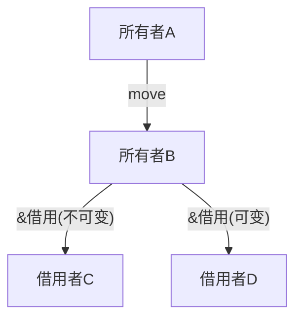
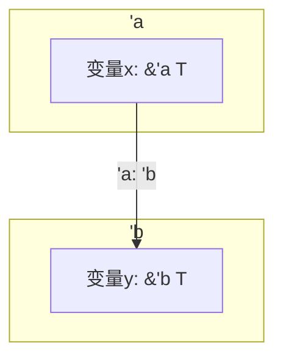

# 11.8.1 01 Rust 编程语言形式化分析

<!-- TOC START -->
- [11.8.1 01 Rust 编程语言形式化分析](#01-rust-编程语言形式化分析)
  - [11.8.1.1 1. 概述](#1-概述)
  - [11.8.1.2 2. Rust 语言核心形式化](#2-rust-语言核心形式化)
    - [11.8.1.2.1 类型系统](#类型系统)
    - [11.8.1.2.2 所有权与借用](#所有权与借用)
    - [11.8.1.2.3 生命周期](#生命周期)
  - [11.8.1.3 3. 关键语言特性与工程语义](#3-关键语言特性与工程语义)
    - [11.8.1.3.1 零成本抽象](#零成本抽象)
    - [11.8.1.3.2 并发模型](#并发模型)
    - [11.8.1.3.3 内存安全](#内存安全)
    - [11.8.1.3.4 模块与包](#模块与包)
  - [11.8.1.4 4. 数学与图示表达](#4-数学与图示表达)
    - [11.8.1.4.1 所有权流图（Mermaid）](#所有权流图（mermaid）)
    - [11.8.1.4.2 生命周期关系](#生命周期关系)
  - [11.8.1.5 5. Golang 对比与架构启示](#5-golang-对比与架构启示)
  - [11.8.1.6 6. 最佳实践与工程建议](#6-最佳实践与工程建议)
  - [11.8.1.7 7. 参考与交叉引用](#7-参考与交叉引用)
<!-- TOC END -->

## 11.8.1.1 1. 概述

本文件系统性梳理 Rust 编程语言的核心语义、类型系统、所有权与生命周期机制，并与 Golang 进行对比，采用数学、代码、图示等多表征方式，强调工程与架构实践。

---

## 11.8.1.2 2. Rust 语言核心形式化

### 11.8.1.2.1 类型系统

**定义** (类型系统):

$\mathcal{T}_{Rust} = (T, S, R, L, C)$

- $T$：类型集合（如 i32, f64, struct, enum, trait, ...）
- $S$：子类型关系
- $R$：引用与借用规则
- $L$：生命周期集合
- $C$：约束集合（trait bound, where 子句等）

**类型示例（Golang对比）**：

```rust
struct Point { x: f64, y: f64 }

```

```go
type Point struct { X float64; Y float64 }

```

### 11.8.1.2.2 所有权与借用

**定义** (所有权系统):

$\mathcal{O} = (O, B, L)$

- $O$：所有者集合
- $B$：借用者集合（可变/不可变）
- $L$：生命周期约束

**核心规则**：

1. 每个值有唯一所有者
2. 可有多个不可变借用或一个可变借用，不能同时存在
3. 所有权转移（move）、复制（copy）、借用（borrow）

**代码示例**：

```rust
let mut s = String::from("hello");
let r1 = &s; // 不可变借用
let r2 = &mut s; // 编译错误：不能同时有可变和不可变借用

```

### 11.8.1.2.3 生命周期

**定义** (生命周期系统):

$\mathcal{L} = (V, S, \prec)$

- $V$：生命周期变量集合
- $S$：作用域集合
- $\prec$：生命周期包含关系（'a: 'b 表示 'a 至少与 'b 一样长）

**示例**：

```rust
fn foo<'a>(x: &'a str) -> &'a str { x }

```

---

## 11.8.1.3 3. 关键语言特性与工程语义

### 11.8.1.3.1 零成本抽象

- 泛型、trait、闭包、迭代器等均为零运行时开销
- 对比 Go：Go 泛型（1.18+）为字节码实例化，Rust为单态化

### 11.8.1.3.2 并发模型

- Rust: Send/Sync trait，线程安全由类型系统静态保证
- Go: goroutine + channel，运行时调度

**Rust 并发示例**：

```rust
use std::thread;
let handle = thread::spawn(|| println!("Hello from thread!"));
handle.join().unwrap();

```

### 11.8.1.3.3 内存安全

- Rust: 编译期静态检查，无GC，RAII
- Go: 垃圾回收，逃逸分析

### 11.8.1.3.4 模块与包

- Rust: crate、mod、pub、use
- Go: package、import、export by capitalization

---

## 11.8.1.4 4. 数学与图示表达

### 11.8.1.4.1 所有权流图（Mermaid）



### 11.8.1.4.2 生命周期关系



---

## 11.8.1.5 5. Golang 对比与架构启示

| 维度         | Rust                         | Go                        |
|--------------|------------------------------|---------------------------|
| 内存管理     | 所有权/借用/生命周期/无GC     | GC/逃逸分析               |
| 并发         | Send/Sync/无数据竞争         | goroutine/channel         |
| 泛型         | 单态化/trait bound           | 字节码实例化/接口         |
| 错误处理     | Result/Option/类型安全       | error接口/多返回值        |
| 包/模块      | crate/mod/可见性强控制       | package/首字母大写导出    |
| 性能         | 零成本抽象/极致优化          | 较高/易用性优先           |

---

## 11.8.1.6 6. 最佳实践与工程建议

1. **优先用不可变借用，减少可变借用范围**
2. **生命周期标注要最小化，优先用编译器推断**
3. **trait bound 明确，避免过度泛型化**
4. **模块边界清晰，接口最小化暴露**
5. **并发场景优先 Send + Sync，避免 unsafe**
6. **与Go集成时，关注 FFI 边界的内存/所有权转移**

---

## 11.8.1.7 7. 参考与交叉引用

- 详见《分布式模式分析》《并发模式分析》《数据结构分析》相关章节
- 交叉参考：Golang 语言分析、类型系统专题、所有权与生命周期专题

---

* 本文件持续更新，确保与工程最佳实践和学术规范一致。*
