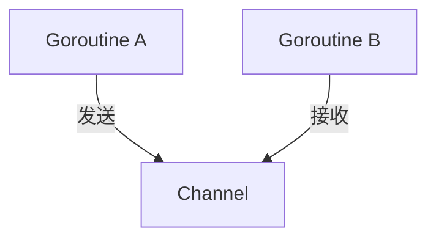
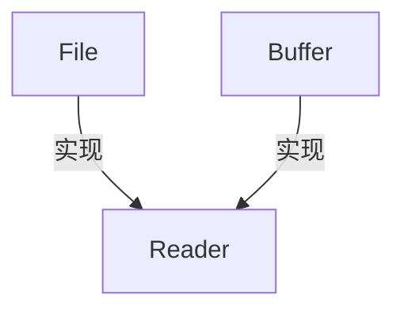

# 11.8.1 02 Golang 编程语言形式化分析

<!-- TOC START -->
- [11.8.1 02 Golang 编程语言形式化分析](#02-golang-编程语言形式化分析)
  - [11.8.1.1 1. 概述](#1-概述)
  - [11.8.1.2 2. Golang 语言核心形式化](#2-golang-语言核心形式化)
    - [11.8.1.2.1 类型系统](#类型系统)
    - [11.8.1.2.2 接口与多态](#接口与多态)
    - [11.8.1.2.3 并发模型](#并发模型)
    - [11.8.1.2.4 内存管理](#内存管理)
    - [11.8.1.2.5 包与模块](#包与模块)
  - [11.8.1.3 3. 关键语言特性与工程语义](#3-关键语言特性与工程语义)
    - [11.8.1.3.1 零值与初始化](#零值与初始化)
    - [11.8.1.3.2 错误处理](#错误处理)
    - [11.8.1.3.3 泛型（Go 1.18+）](#泛型（go-118+）)
    - [11.8.1.3.4 反射与元编程](#反射与元编程)
  - [11.8.1.4 4. 数学与图示表达](#4-数学与图示表达)
    - [11.8.1.4.1 并发通信图（Mermaid）](#并发通信图（mermaid）)
    - [11.8.1.4.2 接口实现关系](#接口实现关系)
  - [11.8.1.5 5. Rust 对比与架构启示](#5-rust-对比与架构启示)
  - [11.8.1.6 6. 最佳实践与工程建议](#6-最佳实践与工程建议)
  - [11.8.1.7 7. 参考与交叉引用](#7-参考与交叉引用)
<!-- TOC END -->


## 11.8.1.1 1. 概述

本文件系统性梳理 Golang 编程语言的核心语义、类型系统、并发模型、内存管理与模块机制，并与 Rust 进行对比，采用数学、代码、图示等多表征方式，强调工程与架构实践。

---

## 11.8.1.2 2. Golang 语言核心形式化

### 11.8.1.2.1 类型系统

**定义** (类型系统):

$\mathcal{T}_{Go} = (T, S, I, C)$

- $T$：类型集合（如 int, float64, struct, interface, ...）
- $S$：子类型/赋值兼容关系
- $I$：接口实现关系（T implements I）
- $C$：约束集合（Go 1.18+ 泛型 type constraint）

**类型示例（Rust对比）**：

```go
type Point struct { X float64; Y float64 }
```

```rust
struct Point { x: f64, y: f64 }
```

### 11.8.1.2.2 接口与多态

**定义** (接口系统):

$\mathcal{I} = (I, M, S)$

- $I$：接口集合
- $M$：方法集合
- $S$：结构体与接口的实现关系

**示例**：

```go
type Reader interface { Read([]byte) (int, error) }
type File struct{}
func (f *File) Read(p []byte) (int, error) { /* ... */ }
```

### 11.8.1.2.3 并发模型

**定义** (CSP 并发模型):

$\mathcal{C}_{Go} = (G, Ch, S, P)$

- $G$：Goroutine 集合
- $Ch$：Channel 集合
- $S$：调度器
- $P$：并发原语（sync.Mutex, sync.WaitGroup, ...）

**核心语义**：

- goroutine: 轻量级线程，由调度器 M:N 映射到系统线程
- channel: 类型安全的通信管道，支持同步/异步

**代码示例**：

```go
ch := make(chan int)
go func() { ch <- 42 }()
fmt.Println(<-ch)
```

### 11.8.1.2.4 内存管理

- Go: 自动垃圾回收（GC），逃逸分析决定堆/栈分配
- Rust: 静态所有权/借用，无GC

**GC 形式化**：

- $GC: M \rightarrow M'$，M为内存状态，GC为标记-清除-压缩等算法

### 11.8.1.2.5 包与模块

- Go: package、import、go.mod、export by capitalization
- Rust: crate、mod、pub、use

**示例**：

```go
package geometry
import "math"
func Distance(p, q Point) float64 { /* ... */ }
```

---

## 11.8.1.3 3. 关键语言特性与工程语义

### 11.8.1.3.1 零值与初始化

- Go 所有类型有零值，避免未初始化错误
- Rust 变量必须初始化

### 11.8.1.3.2 错误处理

- Go: 多返回值 + error 接口
- Rust: Result/Option 类型安全错误处理

**Go 错误处理示例**：

```go
f, err := os.Open("file.txt")
if err != nil { log.Fatal(err) }
```

### 11.8.1.3.3 泛型（Go 1.18+）

- Go: 类型参数，约束 via interface
- Rust: 泛型 + trait bound，单态化

**Go 泛型示例**：

```go
func Map[T any](s []T, f func(T) T) []T { /* ... */ }
```

### 11.8.1.3.4 反射与元编程

- Go: reflect 包，运行时类型信息
- Rust: 宏系统，编译期元编程

---

## 11.8.1.4 4. 数学与图示表达

### 11.8.1.4.1 并发通信图（Mermaid）



### 11.8.1.4.2 接口实现关系



---

## 11.8.1.5 5. Rust 对比与架构启示

| 维度         | Go                          | Rust                         |
|--------------|-----------------------------|------------------------------|
| 内存管理     | GC/逃逸分析                 | 所有权/借用/生命周期/无GC     |
| 并发         | goroutine/channel           | Send/Sync/无数据竞争         |
| 泛型         | 类型参数/接口约束           | 单态化/trait bound           |
| 错误处理     | error接口/多返回值          | Result/Option/类型安全       |
| 包/模块      | package/首字母大写导出      | crate/mod/可见性强控制       |
| 性能         | 较高/易用性优先             | 零成本抽象/极致优化          |

---

## 11.8.1.6 6. 最佳实践与工程建议

1. **接口优先，解耦依赖，便于测试与扩展**
2. **channel 用于通信，sync 包用于同步，避免数据竞争**
3. **错误处理显式，勿忽略 error**
4. **包结构清晰，go.mod 管理依赖**
5. **避免反射滥用，优先类型安全**
6. **泛型约束明确，接口最小化**

---

## 11.8.1.7 7. 参考与交叉引用

- 详见《分布式模式分析》《并发模式分析》《数据结构分析》相关章节
- 交叉参考：Rust 语言分析、类型系统专题、并发与内存管理专题

---

*本文件持续更新，确保与工程最佳实践和学术规范一致。*
