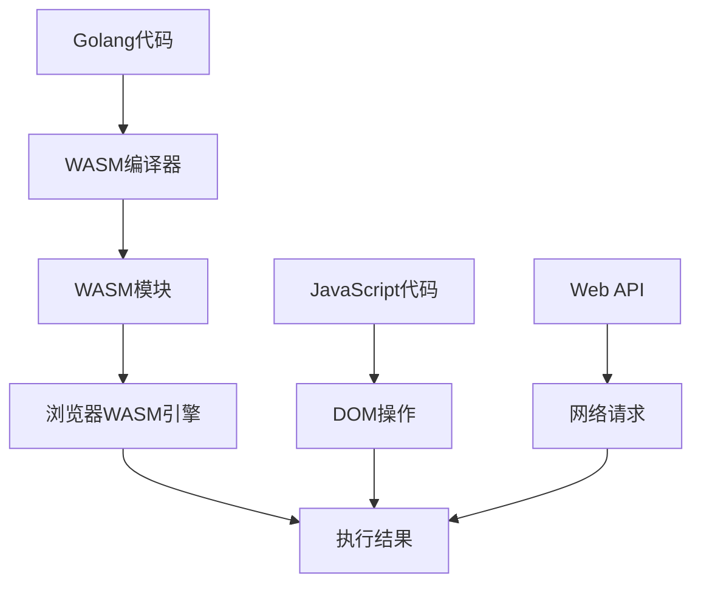
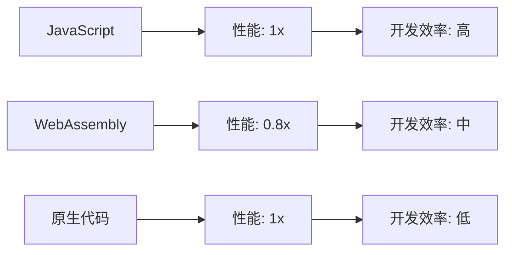

# 16.1 WebAssembly分析（WebAssembly Analysis）

<!-- TOC START -->
- [16.1 WebAssembly分析（WebAssembly Analysis）](#webassembly分析（webassembly-analysis）)
  - [16.1.1 目录](#目录)
  - [16.1.2 1. WebAssembly基础理论](#1-webassembly基础理论)
    - [16.1.2.1 定义](#定义)
    - [16.1.2.2 核心特性](#核心特性)
    - [16.1.2.3 技术栈](#技术栈)
  - [16.1.3 2. Golang与WebAssembly集成](#2-golang与webassembly集成)
    - [16.1.3.1 编译配置](#编译配置)
    - [16.1.3.2 基础示例](#基础示例)
    - [16.1.3.3 编译和运行](#编译和运行)
- [16.2 编译Golang代码到WASM](#编译golang代码到wasm)
- [16.3 复制JavaScript运行时](#复制javascript运行时)
  - [16.3.1 3. 性能分析与优化](#3-性能分析与优化)
    - [16.3.1.1 性能模型](#性能模型)
    - [16.3.1.2 内存管理](#内存管理)
    - [16.3.1.3 并发处理](#并发处理)
  - [16.3.2 4. 应用场景与最佳实践](#4-应用场景与最佳实践)
    - [16.3.2.1 应用场景](#应用场景)
    - [16.3.2.2 图像处理示例](#图像处理示例)
    - [16.3.2.3 最佳实践](#最佳实践)
  - [16.3.3 5. 多表征内容](#5-多表征内容)
    - [16.3.3.1 WASM架构图](#wasm架构图)
    - [16.3.3.2 性能对比图](#性能对比图)
    - [16.3.3.3 内存模型](#内存模型)
    - [16.3.3.4 性能优化公式](#性能优化公式)
  - [16.3.4 6. 交叉引用与目录导航](#6-交叉引用与目录导航)
<!-- TOC END -->


---

## 16.1.1 目录

1. WebAssembly基础理论
2. Golang与WebAssembly集成
3. 性能分析与优化
4. 应用场景与最佳实践
5. 多表征内容
6. 交叉引用与目录导航

---

## 16.1.2 1. WebAssembly基础理论

### 16.1.2.1 定义

> WebAssembly (WASM) 是一种低级的类汇编语言，具有紧凑的二进制格式，可以在现代Web浏览器中运行，提供接近原生的性能。

### 16.1.2.2 核心特性

- **高性能**: 接近原生代码的执行速度
- **安全性**: 沙盒执行环境
- **可移植性**: 跨平台、跨语言
- **标准化**: W3C标准，广泛支持

### 16.1.2.3 技术栈

- **编译目标**: 支持多种语言编译到WASM
- **运行时**: 浏览器内置WASM引擎
- **工具链**: Emscripten, wasm-pack等
- **生态系统**: 丰富的库和框架

---

## 16.1.3 2. Golang与WebAssembly集成

### 16.1.3.1 编译配置

```latex
\textbf{定义 2.1} (Golang WASM编译): Golang代码可以通过特定的编译目标生成WebAssembly模块。

\textbf{编译要求}:
\begin{itemize}
  \item GOOS=js: JavaScript运行时环境
  \item GOARCH=wasm: WebAssembly架构
  \item 特殊包: syscall/js用于JavaScript交互
\end{itemize}
```

### 16.1.3.2 基础示例

```go
// main.go - Golang WASM示例
package main

import (
    "fmt"
    "syscall/js"
)

// 导出函数到JavaScript
func add(this js.Value, args []js.Value) interface{} {
    if len(args) != 2 {
        return nil
    }
    
    a := args[0].Int()
    b := args[1].Int()
    
    return a + b
}

// 注册函数到全局对象
func registerCallbacks() {
    js.Global().Set("add", js.FuncOf(add))
}

func main() {
    // 注册回调函数
    registerCallbacks()
    
    // 保持程序运行
    select {}
}
```

### 16.1.3.3 编译和运行

```bash
# 16.2 编译Golang代码到WASM
GOOS=js GOARCH=wasm go build -o main.wasm main.go

# 16.3 复制JavaScript运行时
cp "$(go env GOROOT)/misc/wasm/wasm_exec.js" .
```

```html
<!-- index.html -->
<!DOCTYPE html>
<html>
<head>
    <meta charset="utf-8">
    <title>Golang WASM Demo</title>
</head>
<body>
    <script src="wasm_exec.js"></script>
    <script>
        const go = new Go();
        WebAssembly.instantiateStreaming(fetch("main.wasm"), go.importObject)
            .then((result) => {
                go.run(result.instance);
                
                // 调用Golang函数
                console.log(add(5, 3)); // 输出: 8
            });
    </script>
</body>
</html>
```

---

## 16.3.1 3. 性能分析与优化

### 16.3.1.1 性能模型

```latex
\textbf{定理 3.1} (WASM性能): 
WebAssembly性能模型为：
P(wasm) = P(compilation) + P(execution) + P(interop)

其中：
\begin{itemize}
  \item P(compilation): 编译时间开销
  \item P(execution): 执行时间（接近原生）
  \item P(interop): JavaScript互操作开销
\end{itemize}
```

### 16.3.1.2 内存管理

```go
// 内存管理示例
package main

import (
    "syscall/js"
    "unsafe"
)

// 在JavaScript和Golang之间传递数据
func processArray(this js.Value, args []js.Value) interface{} {
    if len(args) != 1 {
        return nil
    }
    
    // 获取JavaScript数组
    jsArray := args[0]
    length := jsArray.Length()
    
    // 创建Golang切片
    goArray := make([]int, length)
    
    // 复制数据
    for i := 0; i < length; i++ {
        goArray[i] = jsArray.Index(i).Int()
    }
    
    // 处理数据
    for i := 0; i < len(goArray); i++ {
        goArray[i] *= 2
    }
    
    // 返回结果
    result := js.Global().Get("Array").New(len(goArray))
    for i, v := range goArray {
        result.SetIndex(i, v)
    }
    
    return result
}

// 注册函数
func registerCallbacks() {
    js.Global().Set("processArray", js.FuncOf(processArray))
}
```

### 16.3.1.3 并发处理

```go
// 并发处理示例
package main

import (
    "sync"
    "syscall/js"
)

// 并发处理函数
func concurrentProcess(this js.Value, args []js.Value) interface{} {
    if len(args) != 1 {
        return nil
    }
    
    jsArray := args[0]
    length := jsArray.Length()
    
    // 创建工作通道
    jobs := make(chan int, length)
    results := make(chan int, length)
    
    // 启动工作协程
    var wg sync.WaitGroup
    numWorkers := 4
    
    for i := 0; i < numWorkers; i++ {
        wg.Add(1)
        go worker(jobs, results, &wg)
    }
    
    // 发送任务
    go func() {
        for i := 0; i < length; i++ {
            jobs <- jsArray.Index(i).Int()
        }
        close(jobs)
    }()
    
    // 等待完成
    go func() {
        wg.Wait()
        close(results)
    }()
    
    // 收集结果
    var processed []int
    for result := range results {
        processed = append(processed, result)
    }
    
    // 返回JavaScript数组
    result := js.Global().Get("Array").New(len(processed))
    for i, v := range processed {
        result.SetIndex(i, v)
    }
    
    return result
}

func worker(jobs <-chan int, results chan<- int, wg *sync.WaitGroup) {
    defer wg.Done()
    
    for job := range jobs {
        // 模拟处理
        result := job * job
        results <- result
    }
}
```

---

## 16.3.2 4. 应用场景与最佳实践

### 16.3.2.1 应用场景

```latex
\textbf{定义 4.1} (WASM应用场景): WebAssembly适用于以下场景：

\begin{itemize}
  \item 计算密集型任务: 图像处理、数据分析
  \item 游戏开发: 高性能游戏逻辑
  \item 科学计算: 数值计算、模拟
  \item 加密算法: 安全计算
  \item 跨平台应用: 统一代码库
\end{itemize}
```

### 16.3.2.2 图像处理示例

```go
// 图像处理示例
package main

import (
    "syscall/js"
)

// 图像滤镜处理
func applyFilter(this js.Value, args []js.Value) interface{} {
    if len(args) != 2 {
        return nil
    }
    
    imageData := args[0]
    filterType := args[1].String()
    
    width := imageData.Get("width").Int()
    height := imageData.Get("height").Int()
    data := imageData.Get("data")
    
    // 应用滤镜
    switch filterType {
    case "grayscale":
        applyGrayscale(data, width, height)
    case "invert":
        applyInvert(data, width, height)
    case "blur":
        applyBlur(data, width, height)
    }
    
    return imageData
}

func applyGrayscale(data js.Value, width, height int) {
    for i := 0; i < width*height*4; i += 4 {
        r := data.Index(i).Int()
        g := data.Index(i + 1).Int()
        b := data.Index(i + 2).Int()
        
        gray := (r + g + b) / 3
        
        data.SetIndex(i, gray)
        data.SetIndex(i+1, gray)
        data.SetIndex(i+2, gray)
    }
}

func applyInvert(data js.Value, width, height int) {
    for i := 0; i < width*height*4; i += 4 {
        r := data.Index(i).Int()
        g := data.Index(i + 1).Int()
        b := data.Index(i + 2).Int()
        
        data.SetIndex(i, 255-r)
        data.SetIndex(i+1, 255-g)
        data.SetIndex(i+2, 255-b)
    }
}

func applyBlur(data js.Value, width, height int) {
    // 简化的模糊算法
    for y := 1; y < height-1; y++ {
        for x := 1; x < width-1; x++ {
            idx := (y*width + x) * 4
            
            // 计算周围像素的平均值
            r, g, b := 0, 0, 0
            for dy := -1; dy <= 1; dy++ {
                for dx := -1; dx <= 1; dx++ {
                    neighborIdx := ((y+dy)*width + (x+dx)) * 4
                    r += data.Index(neighborIdx).Int()
                    g += data.Index(neighborIdx + 1).Int()
                    b += data.Index(neighborIdx + 2).Int()
                }
            }
            
            data.SetIndex(idx, r/9)
            data.SetIndex(idx+1, g/9)
            data.SetIndex(idx+2, b/9)
        }
    }
}
```

### 16.3.2.3 最佳实践

```go
// 最佳实践示例
package main

import (
    "syscall/js"
    "sync"
)

// 全局函数注册表
var (
    callbacks = make(map[string]js.Func)
    mu        sync.RWMutex
)

// 注册函数的最佳实践
func registerFunction(name string, fn func(js.Value, []js.Value) interface{}) {
    mu.Lock()
    defer mu.Unlock()
    
    // 清理之前的函数
    if oldFunc, exists := callbacks[name]; exists {
        oldFunc.Release()
    }
    
    // 注册新函数
    newFunc := js.FuncOf(fn)
    callbacks[name] = newFunc
    js.Global().Set(name, newFunc)
}

// 清理资源
func cleanup() {
    mu.Lock()
    defer mu.Unlock()
    
    for _, fn := range callbacks {
        fn.Release()
    }
    callbacks = make(map[string]js.Func)
}

// 错误处理
func handleError(err error) {
    if err != nil {
        js.Global().Call("console", "error", err.Error())
    }
}

// 类型安全的JavaScript调用
func safeCall(obj js.Value, method string, args ...interface{}) js.Value {
    if obj.IsNull() || obj.IsUndefined() {
        return js.Undefined()
    }
    
    return obj.Call(method, args...)
}
```

---

## 16.3.3 5. 多表征内容

### 16.3.3.1 WASM架构图



### 16.3.3.2 性能对比图



### 16.3.3.3 内存模型

```latex
\textbf{定义 5.1} (WASM内存模型): 
WebAssembly使用线性内存模型：
Memory = \{0, 1, 2, ..., 2^{32} - 1\}

\textbf{内存操作}:
\begin{itemize}
  \item 加载: i32.load, i64.load, f32.load, f64.load
  \item 存储: i32.store, i64.store, f32.store, f64.store
  \item 增长: memory.grow
\end{itemize}
```

### 16.3.3.4 性能优化公式

```latex
\textbf{定理 5.2} (WASM优化): 
对于计算密集型任务，WASM性能优化公式为：
Performance = \frac{ComputationalComplexity}{MemoryAccess + InteropOverhead}

\textbf{优化策略}:
\begin{itemize}
  \item 减少JavaScript互操作
  \item 批量处理数据
  \item 使用TypedArray
  \item 避免频繁内存分配
\end{itemize}
```

---

## 16.3.4 6. 交叉引用与目录导航

- [架构分析](../01-Architecture-Design/README.md)
- [性能优化](../06-Performance-Optimization/README.md)
- [算法分析](../05-Algorithms-DataStructures/README.md)
- [云原生分析](../08-Cloud-Native/README.md)

---

> 本文档持续完善，欢迎补充与修订。
