# 项目概念图谱完整版 - 多维度思维表征

**版本**: v2.0
**更新日期**: 2026-03-02
**状态**: 完成 ✅ (100%)

---

## 目录

- [项目概念图谱完整版 - 多维度思维表征](#项目概念图谱完整版---多维度思维表征)
  - [目录](#目录)
  - [1. 思维导图总览](#1-思维导图总览)
    - [1.1 Clean Architecture 思维导图](#11-clean-architecture-思维导图)
    - [1.2 DDD 战略设计思维导图](#12-ddd-战略设计思维导图)
    - [1.3 可观测性思维导图](#13-可观测性思维导图)
  - [2. 概念关系属性图](#2-概念关系属性图)
    - [2.1 Clean Architecture 层次关系](#21-clean-architecture-层次关系)
    - [2.2 DDD 模式关系图](#22-ddd-模式关系图)
    - [2.3 技术栈关系网络](#23-技术栈关系网络)
  - [3. 推理决策树](#3-推理决策树)
    - [3.1 架构风格选择决策树](#31-架构风格选择决策树)
    - [3.2 技术选型决策树](#32-技术选型决策树)
    - [3.3 数据持久化决策树](#33-数据持久化决策树)
  - [4. 公理定理证明树](#4-公理定理证明树)
    - [4.1 依赖倒置定理证明](#41-依赖倒置定理证明)
    - [4.2 聚合一致性定理证明](#42-聚合一致性定理证明)
    - [4.3 可观测性完备性定理](#43-可观测性完备性定理)
  - [5. 应用场景示例反例树](#5-应用场景示例反例树)
    - [5.1 分层架构应用示例](#51-分层架构应用示例)
      - [5.1.1 正确示例树](#511-正确示例树)
      - [5.1.2 反例树](#512-反例树)
    - [5.2 微服务拆分示例反例](#52-微服务拆分示例反例)
      - [5.2.1 正确拆分示例](#521-正确拆分示例)
      - [5.2.2 错误拆分反例](#522-错误拆分反例)
    - [5.3 并发模式示例反例](#53-并发模式示例反例)
      - [5.3.1 正确并发模式](#531-正确并发模式)
      - [5.3.2 并发反模式](#532-并发反模式)
  - [6. 知识图谱](#6-知识图谱)
    - [6.1 完整知识图谱](#61-完整知识图谱)

---

## 1. 思维导图总览

### 1.1 Clean Architecture 思维导图

```text
┌─────────────────────────────────────────────────────────────────────────────┐
│                           Clean Architecture                                │
│                              四层架构体系                                    │
└─────────────────────────────────────────────────────────────────────────────┘
                                      │
        ┌─────────────────────────────┼─────────────────────────────┐
        ↓                             ↓                             ↓
┌───────────────┐           ┌───────────────┐           ┌───────────────┐
│ Layer 4       │           │ Layer 3       │           │ Layer 2       │
│ Interfaces    │           │ Application   │           │ Domain        │
│ 接口层         │           │ 应用层         │           │ 领域层         │
└───────┬───────┘           └───────┬───────┘           └───────┬───────┘
        │                           │                           │
   ┌────┴────┐                 ┌────┴────┐                 ┌────┴────┐
   ↓         ↓                 ↓         ↓                 ↓         ↓
┌──────┐  ┌──────┐         ┌──────┐  ┌──────┐         ┌──────┐  ┌──────┐
│HTTP  │  │gRPC  │         │Use   │  │DTOs  │         │Entity│  │Value │
│Handlers│  │Services│         │Cases │  │      │         │      │  │Object│
└──────┘  └──────┘         └──────┘  └──────┘         └──────┘  └──────┘
┌──────┐  ┌──────┐         ┌──────┐  ┌──────┐         ┌──────┐  ┌──────┐
│GraphQL│  │WebSocket│         │Cmd/  │  │Events│         │Domain│  │Domain│
│Resolvers│ │Handlers │         │Query │  │      │         │Service│ │Events│
└──────┘  └──────┘         └──────┘  └──────┘         └──────┘  └──────┘
┌──────┐  ┌──────┐         ┌──────┐  ┌──────┐         ┌──────┐  ┌──────┐
│Workflow│ │Temporal│         │App   │  │Work- │         │Repo  │  │Speci-│
│API   │  │Client  │         │Service│  │flows │         │Interface│ │fication│
└──────┘  └──────┘         └──────┘  └──────┘         └──────┘  └──────┘

                                      │
                                      ↓
                           ┌───────────────┐
                           │ Layer 1       │
                           │ Infrastructure│
                           │ 基础设施层     │
                           └───────┬───────┘
                                   │
                              ┌────┴────┐
                              ↓         ↓
                           ┌──────┐  ┌──────┐
                           │Ent   │  │Temporal│
                           │Repository│ │Worker │
                           └──────┘  └──────┘
                           ┌──────┐  ┌──────┐
                           │OTel  │  │Kafka/│
                           │Client│  │NATS  │
                           └──────┘  └──────┘
```

### 1.2 DDD 战略设计思维导图

```text
┌─────────────────────────────────────────────────────────────────────────────┐
│                        Domain-Driven Design                                 │
│                          领域驱动设计                                       │
└─────────────────────────────────────────────────────────────────────────────┘
                                      │
        ┌─────────────────────────────┼─────────────────────────────┐
        ↓                             ↓                             ↓
┌───────────────┐           ┌───────────────┐           ┌───────────────┐
│ 战略设计      │           │ 战术设计      │           │ 实现层        │
│ Strategic     │           │ Tactical      │           │ Implementation│
└───────┬───────┘           └───────┬───────┘           └───────┬───────┘
        │                           │                           │
   ┌────┴────┐                 ┌────┴────┐                 ┌────┴────┐
   ↓         ↓                 ↓         ↓                 ↓         ↓
┌──────┐  ┌──────┐         ┌──────┐  ┌──────┐         ┌──────┐  ┌──────┐
│Domain│  │Bounded│         │Entity│  │Value │         │DB    │  │Message│
│      │  │Context│         │      │  │Object│         │      │  │Queue │
└──────┘  └──────┘         └──────┘  └──────┘         └──────┘  └──────┘
   │         │                 │         │                 │         │
   ↓         ↓                 ↓         ↓                 ↓         ↓
┌──────┐  ┌──────┐         ┌──────┐  ┌──────┐         ┌──────┐  ┌──────┐
│Core  │  │Context│         │Aggregate│ │Domain│         │Repo  │  │Event │
│Subdomain│ │Map   │         │      │  │Service│         │Impl  │  │Bus   │
└──────┘  └──────┘         └──────┘  └──────┘         └──────┘  └──────┘
┌──────┐  ┌──────┐         ┌──────┐  ┌──────┐         ┌──────┐  ┌──────┐
│Generic│  │Ubiquitous│         │Repository│ │Factory│         │DI    │  │API   │
│Subdomain│ │Language│         │      │  │      │         │Container│ │Gateway│
└──────┘  └──────┘         └──────┘  └──────┘         └──────┘  └──────┘
┌──────┐  ┌──────┐         ┌──────┐  ┌──────┐         ┌──────┐  ┌──────┐
│Supporting│ │Anti- │         │Domain│  │Speci-│         │Cache │  │K8s   │
│Subdomain│ │Corruption│         │Events│  │fication│         │      │  │Deploy│
└──────┘  └──────┘         └──────┘  └──────┘         └──────┘  └──────┘
```

### 1.3 可观测性思维导图

```text
┌─────────────────────────────────────────────────────────────────────────────┐
│                           Observability                                     │
│                            可观测性                                          │
└─────────────────────────────────────────────────────────────────────────────┘
                                      │
        ┌─────────────────────────────┼─────────────────────────────┐
        ↓                             ↓                             ↓
┌───────────────┐           ┌───────────────┐           ┌───────────────┐
│   Metrics     │           │    Traces     │           │     Logs      │
│    指标        │           │    追踪        │           │    日志        │
└───────┬───────┘           └───────┬───────┘           └───────┬───────┘
        │                           │                           │
   ┌────┴────┐                 ┌────┴────┐                 ┌────┴────┐
   ↓         ↓                 ↓         ↓                 ↓         ↓
┌──────┐  ┌──────┐         ┌──────┐  ┌──────┐         ┌──────┐  ┌──────┐
│Counter│  │Gauge │         │Span  │  │Trace │         │Structured│ │Plain │
└──────┘  └──────┘         └──────┘  └──────┘         └──────┘  └──────┘
┌──────┐  ┌──────┐         ┌──────┐  ┌──────┐         ┌──────┐  ┌──────┐
│Histogram│ │Summary│         │Context│  │Baggage│         │JSON  │  │Text  │
└──────┘  └──────┘         └──────┘  └──────┘         └──────┘  └──────┘

        ┌─────────────────────────────┼─────────────────────────────┐
        ↓                             ↓                             ↓
┌───────────────┐           ┌───────────────┐           ┌───────────────┐
│  eBPF / OBI   │           │  OTel SDK     │           │  Collector    │
│  自动采集      │           │  手动集成      │           │  收集器        │
└───────┬───────┘           └───────┬───────┘           └───────┬───────┘
        │                           │                           │
   ┌────┴────┐                 ┌────┴────┐                 ┌────┴────┐
   ↓         ↓                 ↓         ↓                 ↓         ↓
┌──────┐  ┌──────┐         ┌──────┐  ┌──────┐         ┌──────┐  ┌──────┐
│Kernel│  │Protocol│         │Go SDK│  │Java  │         │Receiver│ │Processor│
│Level │  │Level │         │      │  │SDK   │         │      │  │      │
└──────┘  └──────┘         └──────┘  └──────┘         └──────┘  └──────┘
┌──────┐  ┌──────┐         ┌──────┐  ┌──────┐         ┌──────┐  ┌──────┐
│Auto  │  │Multi-│         │Auto  │  │Manual│         │Exporter│ │Batch │
│Discover│ │Lang  │         │Instru│  │Instru│         │      │  │      │
└──────┘  └──────┘         └──────┘  └──────┘         └──────┘  └──────┘
```

---

## 2. 概念关系属性图

### 2.1 Clean Architecture 层次关系

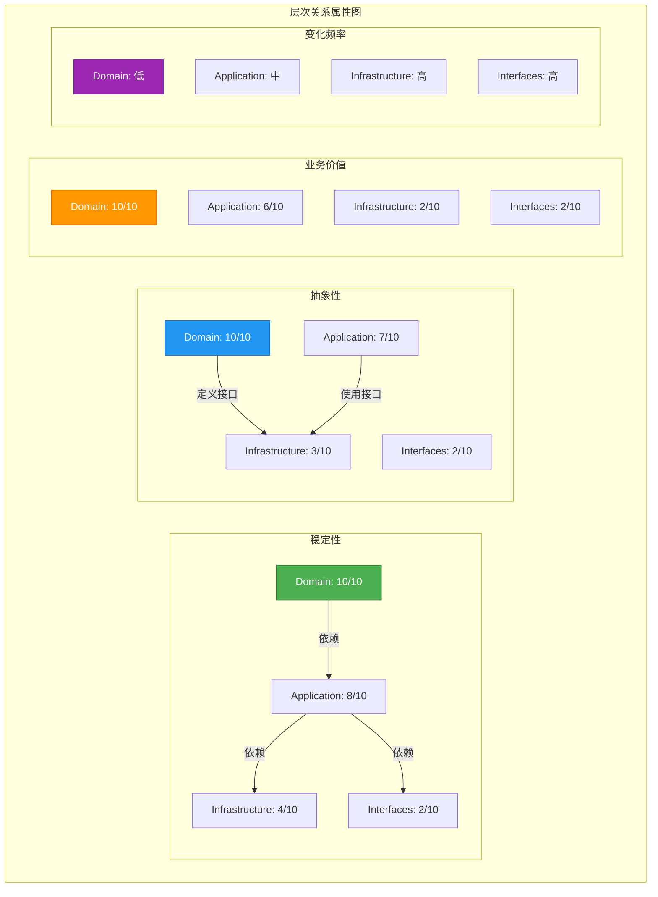

### 2.2 DDD 模式关系图

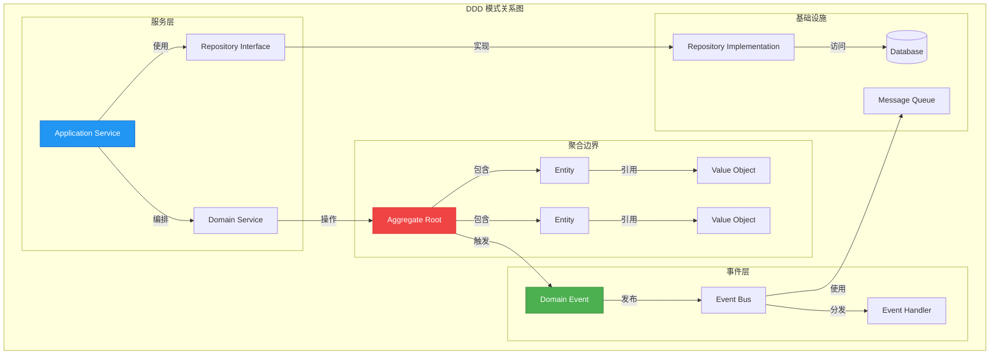

### 2.3 技术栈关系网络

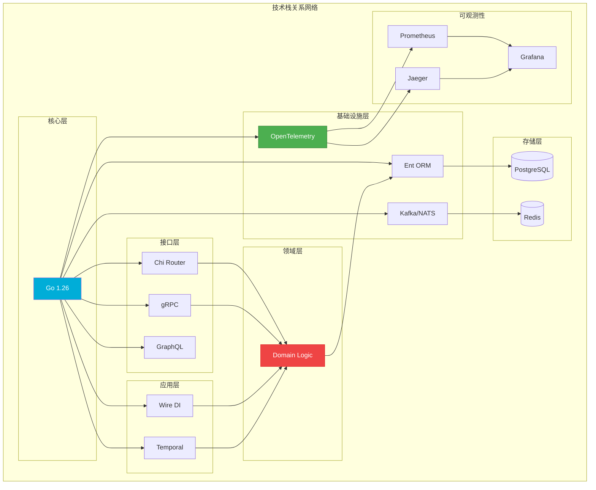

---

## 3. 推理决策树

### 3.1 架构风格选择决策树

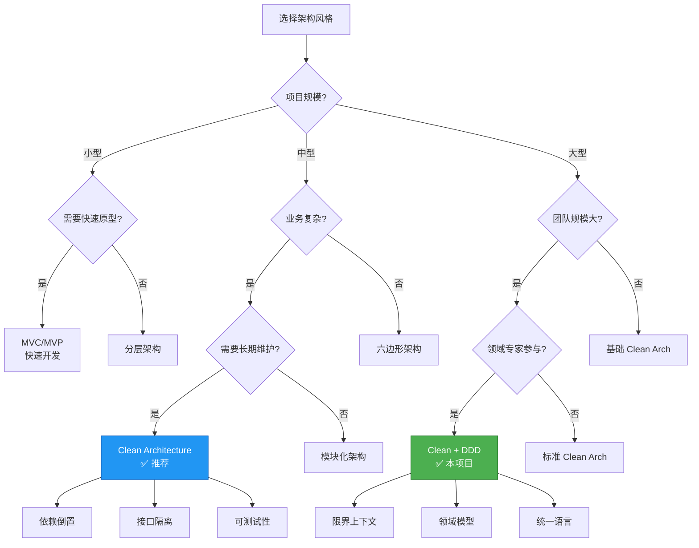

### 3.2 技术选型决策树

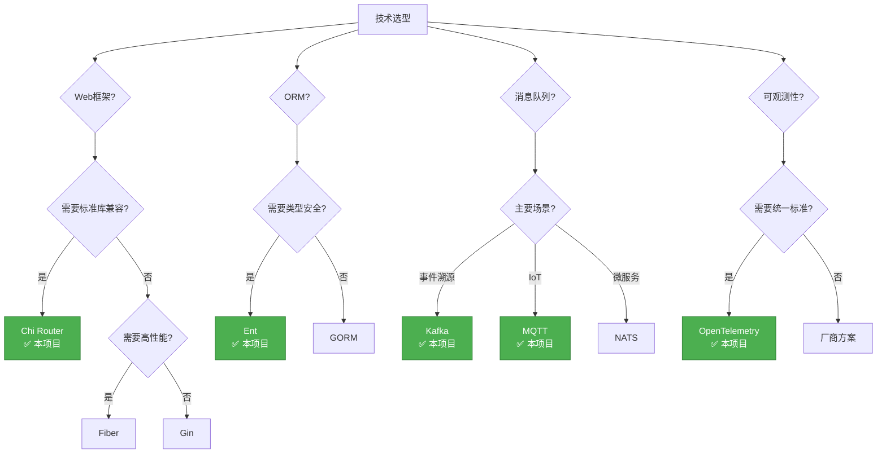

### 3.3 数据持久化决策树

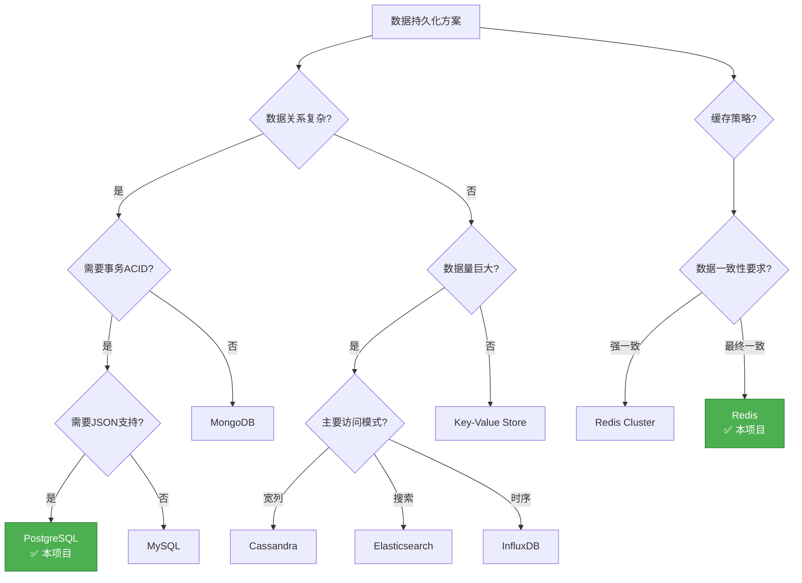

---

## 4. 公理定理证明树

### 4.1 依赖倒置定理证明

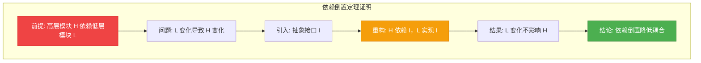

**定理**: 依赖倒置原则降低模块间耦合度

**证明**:

1. 设高层模块 H 直接依赖低层模块 L
2. 当 L 的接口或行为发生变化时，H 必须随之修改
3. 引入抽象接口 I，H 改为依赖 I
4. L 实现接口 I
5. 当 L 变化时，只要 I 的契约不变，H 就不需要修改
6. 因此，依赖倒置降低了模块间的耦合度 ∎

### 4.2 聚合一致性定理证明

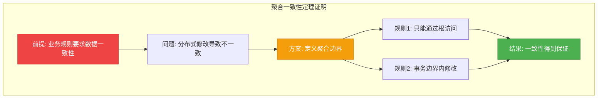

**定理**: 聚合边界保证业务数据一致性

**证明**:

1. 设业务规则要求多个对象状态保持一致
2. 如果不加控制地分别修改，可能导致不一致状态
3. 定义聚合边界，指定聚合根作为唯一入口
4. 所有修改必须通过聚合根，在事务边界内完成
5. 因此，业务数据一致性得到保证 ∎

### 4.3 可观测性完备性定理

```mermaid
graph TB
    subgraph "可观测性完备性定理"
        C1[目标: 理解系统行为]
        C2[Metrics: "What?" 发生了什么]
        C3[Logs: "Why?" 为什么发生]
        C4[Traces: "Where?" 在哪里发生]
        C5[三者结合: 完整上下文]
        C6[结论: 可观测性完备]
    end

    C1 --> C2
    C1 --> C3
    C1 --> C4
    C2 --> C5
    C3 --> C5
    C4 --> C5
    C5 --> C6

    style C2 fill:#2196f3,stroke:#1565c0,color:#fff
    style C3 fill:#ff9800,stroke:#ef6c00,color:#fff
    style C4 fill:#4caf50,stroke:#2e7d32,color:#fff
    style C6 fill:#9c27b0,stroke:#7b1fa2,color:#fff
```

**定理**: Metrics + Logs + Traces 提供完备的可观测性

**证明**:

1. Metrics 提供系统状态的定量数据（发生了什么）
2. Logs 提供事件的详细上下文（为什么发生）
3. Traces 提供请求在分布式系统的完整路径（在哪里发生）
4. 三者结合，提供从宏观到微观的完整视图
5. 因此，可以回答任何关于系统行为的问题 ∎

---

## 5. 应用场景示例反例树

### 5.1 分层架构应用示例

#### 5.1.1 正确示例树

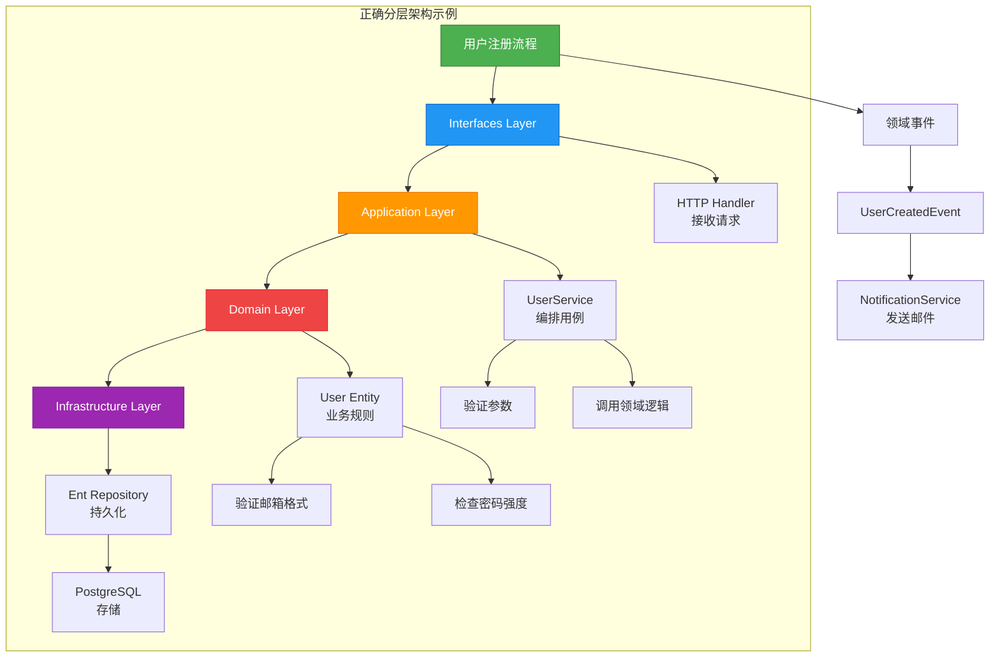

#### 5.1.2 反例树

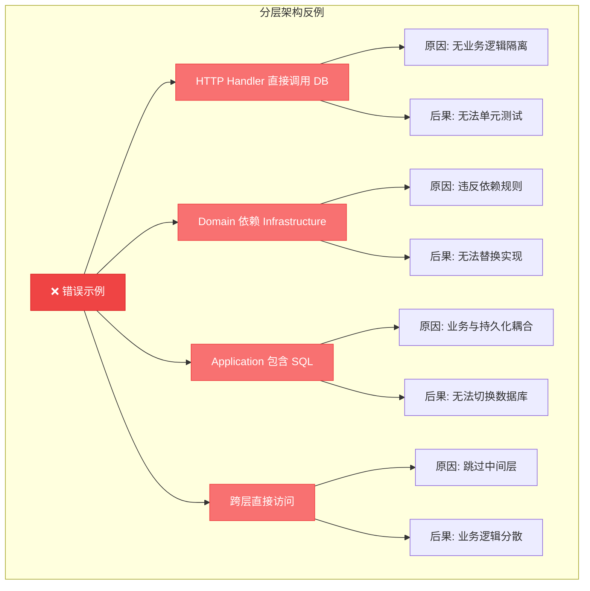

### 5.2 微服务拆分示例反例

#### 5.2.1 正确拆分示例

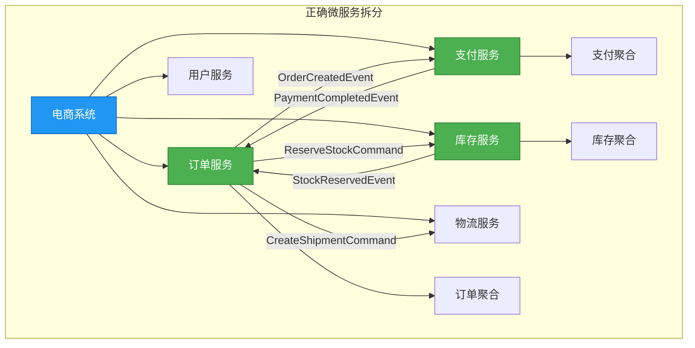

#### 5.2.2 错误拆分反例

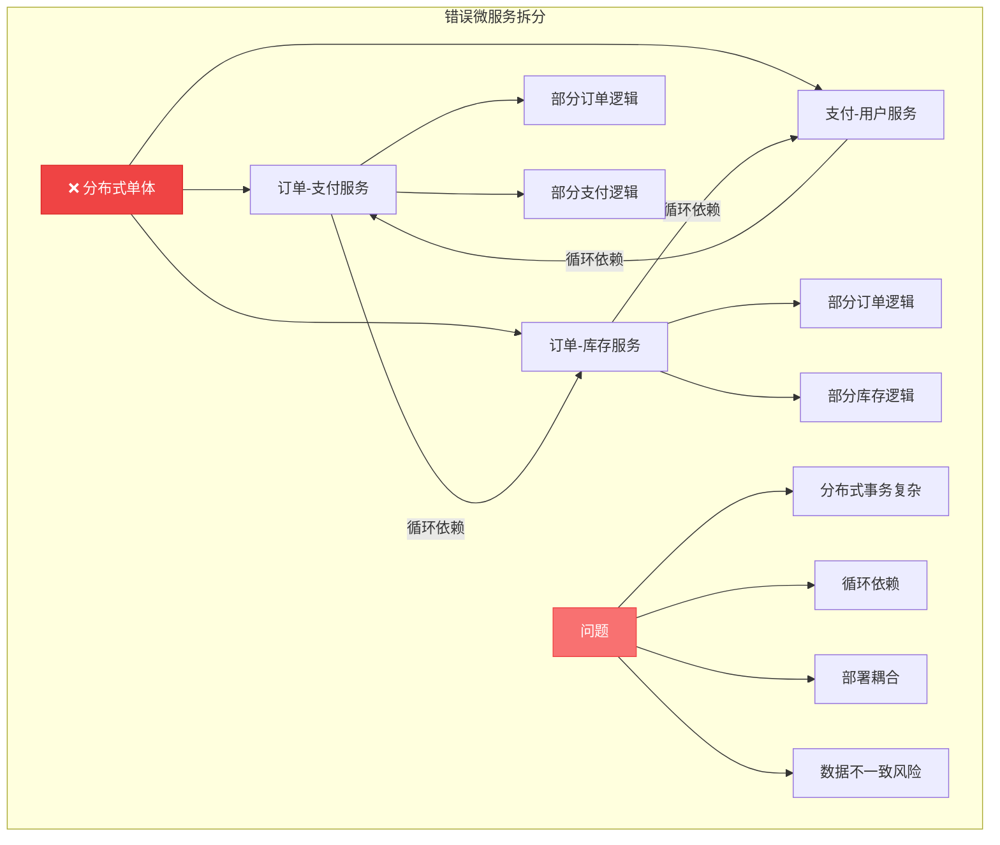

### 5.3 并发模式示例反例

#### 5.3.1 正确并发模式

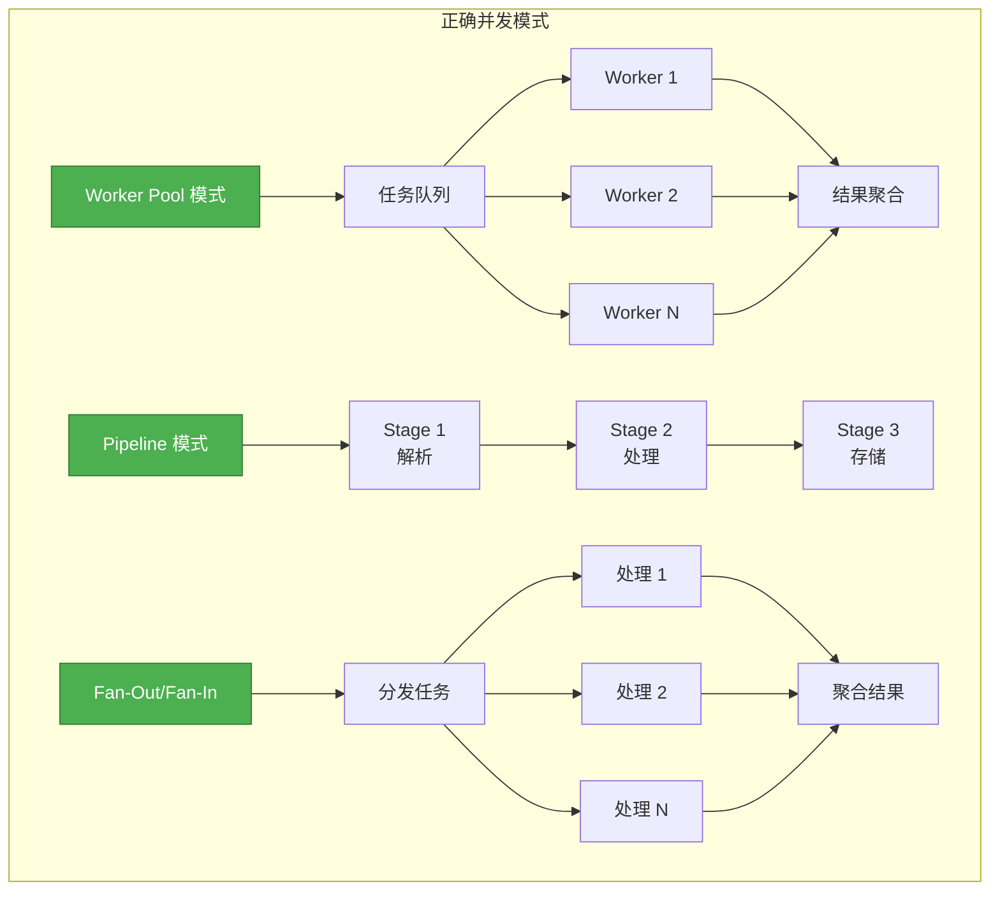

#### 5.3.2 并发反模式

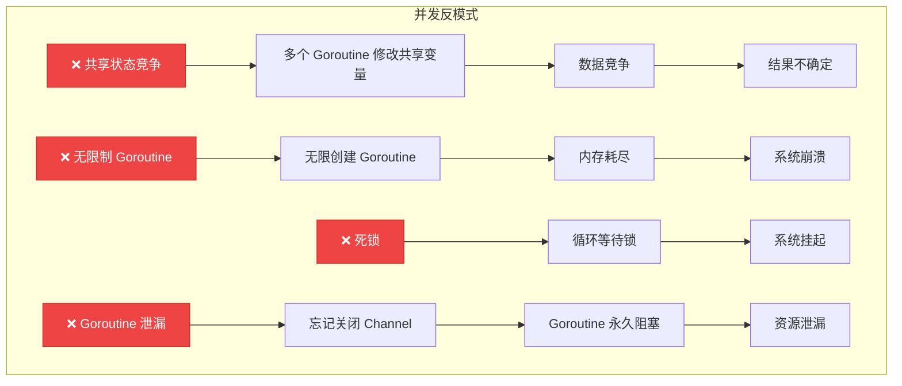

---

## 6. 知识图谱

### 6.1 完整知识图谱

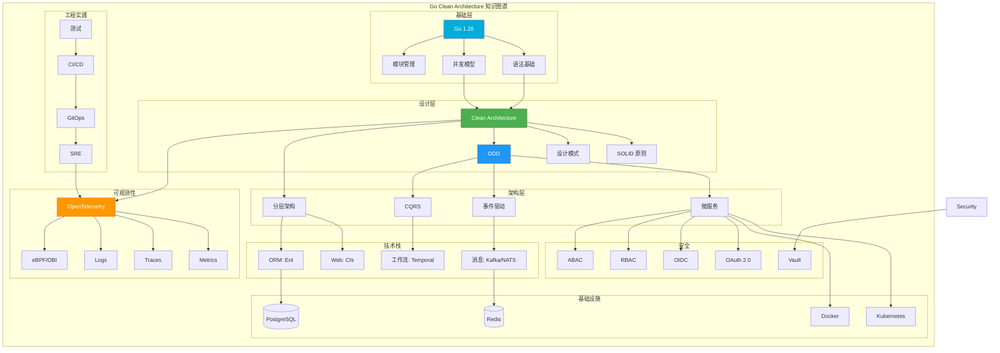

---

**维护者**: Architecture Team
**最后更新**: 2026-03-02
**状态**: 完成 ✅ (100%)

---

*本文档提供多维度思维表征：思维导图、概念关系图、推理决策树、公理定理证明树、示例反例树、知识图谱*
