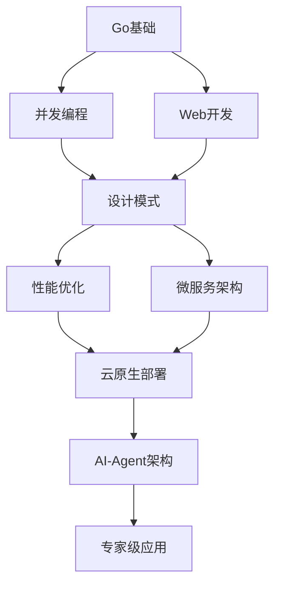

# 📚 文档索引

> **完整的Golang学习路径 | 按难度分级 | 系统化知识体系**

---

## 🎯 快速导航

| 学习阶段 | 推荐时长 | 核心内容 | 开始 |
|---------|---------|---------|------|
| 🌱 **入门** | 1-2周 | Go基础、语法、工具 | [开始学习](#-入门-1-2周) |
| 🌿 **进阶** | 2-4周 | 并发、Web、设计模式 | [开始学习](#-进阶-2-4周) |
| 🌳 **高级** | 4-8周 | 微服务、性能优化 | [开始学习](#-高级-4-8周) |
| 🌲 **专家** | 持续 | 架构、AI-Agent | [开始学习](#-专家-持续学习) |

---

## 🗺️ 学习路径图



---

## 🌱 入门 (1-2周)

### 1. Go语言基础

#### 01-语法基础 ⭐⭐

- [变量与类型](01-Go语言基础/01-语法基础/01-变量与类型.md)
- [控制流程](01-Go语言基础/01-语法基础/02-控制流程.md)
- [函数详解](01-Go语言基础/01-语法基础/03-函数详解.md)
- [数据结构](01-Go语言基础/01-语法基础/04-数据结构.md)
- [错误处理](01-Go语言基础/01-语法基础/05-错误处理.md)

**学习建议**:

- 每天1-2小时
- 配合实践练习
- 完成基础示例

---

## 🌿 进阶 (2-4周)

### 2. 并发编程

#### 02-并发编程 ⭐⭐⭐

- [Goroutine基础](01-Go语言基础/02-并发编程/01-goroutine基础.md)
- [Channel通信](01-Go语言基础/02-并发编程/02-channel通信.md)
- [并发模式](01-Go语言基础/02-并发编程/03-并发模式.md)
- [并发安全](01-Go语言基础/02-并发编程/04-并发安全.md)

**实践项目**:

- [Pipeline模式](../examples/concurrency/pipeline_test.go) - 流式数据处理
- [Worker Pool模式](../examples/concurrency/worker_pool_test.go) - 任务队列

**学习建议**:

- 理解CSP模型
- 实践常见模式
- 注意竞态条件

### 3. Web开发

#### 01-HTTP服务 ⭐⭐⭐

- [基础HTTP服务器](01-HTTP服务/01-基础HTTP服务器.md)
- [路由和中间件](01-HTTP服务/02-路由和中间件.md)
- [请求处理](01-HTTP服务/03-请求处理.md)
- [响应格式化](01-HTTP服务/04-响应格式化.md)
- [错误处理](01-HTTP服务/05-错误处理.md)

---

## 🌳 高级 (4-8周)

### 4. 设计模式

#### 04-设计模式 ⭐⭐⭐⭐

- [创建型模式](04-设计模式/01-创建型模式.md)
- [结构型模式](04-设计模式/02-结构型模式.md)
- [行为型模式](04-设计模式/03-行为型模式.md)
- [Go特定模式](04-设计模式/04-Go特定模式.md)

### 5. 性能优化

#### 05-性能优化 ⭐⭐⭐⭐

- [性能分析工具](05-性能优化/01-性能分析工具.md)
- [内存优化](05-性能优化/02-内存优化.md)
- [并发优化](05-性能优化/03-并发优化.md)
- [算法优化](05-性能优化/04-算法优化.md)

**实践技能**:

- pprof性能分析
- 基准测试编写
- 性能瓶颈识别

### 6. 微服务架构

#### 06-微服务架构 ⭐⭐⭐⭐

- [微服务基础](06-微服务架构/01-微服务基础.md)
- [服务通信](06-微服务架构/02-服务通信.md)
- [服务发现](06-微服务架构/03-服务发现.md)
- [API网关](06-微服务架构/04-API网关.md)

---

## 🌲 专家 (持续学习)

### 7. Go 1.23+现代化特性

#### 02-Go语言现代化 ⭐⭐⭐⭐⭐

##### 核心特性

- [Go 1.23+垃圾收集优化](02-Go语言现代化/01-Go-1.23垃圾收集优化/README.md)
- [Go 1.23+容器感知调度](02-Go语言现代化/02-Go-1.23容器感知调度/README.md)
- [Go 1.23+数据结构优化](02-Go语言现代化/03-Go-1.23数据结构优化/README.md)
- [Go 1.23+ Arena分配器](02-Go语言现代化/04-Go-1.23-Arena分配器/README.md)
- [Go 1.23+弱指针](02-Go语言现代化/05-Go-1.23弱指针/README.md)

##### 工具链增强

- [Go 1.23+工具链增强](02-Go语言现代化/13-Go-1.23工具链增强/README.md)
  - ASan内存检测示例
  - go.mod ignore
  - go doc增强
  
##### 并发和网络

- [Go 1.23+并发和网络](02-Go语言现代化/14-Go-1.23并发和网络/README.md)
  - **WaitGroup.Go()** - [示例](02-Go语言现代化/14-Go-1.23并发和网络/examples/waitgroup_go/)
  - HTTP/3 & QUIC支持
  - testing/synctest

##### 测试体系

- [建立完整测试体系](02-Go语言现代化/10-建立完整测试体系/README.md)
  - 单元测试
  - 集成测试
  - 基准测试

### 8. AI-Agent架构

#### 08-智能化架构集成 ⭐⭐⭐⭐⭐

##### AI-Agent核心

- [AI-Agent架构](02-Go语言现代化/08-智能化架构集成/01-AI-Agent架构/README.md)
  - [DecisionEngine](02-Go语言现代化/08-智能化架构集成/01-AI-Agent架构/core/decision_engine.go) - 决策引擎
  - [LearningEngine](02-Go语言现代化/08-智能化架构集成/01-AI-Agent架构/core/learning_engine.go) - 学习引擎
  - [BaseAgent](02-Go语言现代化/08-智能化架构集成/01-AI-Agent架构/core/agent.go) - 基础代理

**完整示例**: [EXAMPLES.md](../EXAMPLES.md#-ai-agent架构示例)

##### 关键概念

- 多Agent协作
- 共识决策
- 强化学习
- 知识库管理

### 9. 架构专题

#### 11-架构专题 ⭐⭐⭐⭐⭐

- [Clean Architecture](11-架构专题/01-Clean-Architecture.md)
- [Hexagonal Architecture](11-架构专题/02-Hexagonal-Architecture.md)
- [CQRS模式](11-架构专题/03-CQRS模式.md)
- [Event Sourcing](11-架构专题/04-Event-Sourcing.md)

### 10. 可观测性

#### 12-可观测性 ⭐⭐⭐⭐

- [日志管理](12-可观测性/01-日志管理.md)
- [Metrics监控](12-可观测性/02-Metrics监控.md)
- [分布式追踪](12-可观测性/03-分布式追踪.md)
- [告警系统](12-可观测性/04-告警系统.md)

---

## 📦 示例代码

### 🆕 Go 1.23+现代特性示例

| 示例 | 难度 | 测试数 | 位置 |
|------|------|--------|------|
| WaitGroup.Go() | ⭐⭐ | 16 | [查看](02-Go语言现代化/14-Go-1.23并发和网络/examples/waitgroup_go/) |
| ASan内存检测 | ⭐⭐⭐⭐ | - | [查看](02-Go语言现代化/13-Go-1.23工具链增强/examples/asan_memory_leak/) |

### 🎭 并发模式示例

| 示例 | 难度 | 测试数 | 位置 |
|------|------|--------|------|
| Pipeline模式 | ⭐⭐⭐ | 6 | [查看](../examples/concurrency/pipeline_test.go) |
| Worker Pool模式 | ⭐⭐⭐ | 7 | [查看](../examples/concurrency/worker_pool_test.go) |

### 🤖 AI-Agent示例

| 示例 | 难度 | 测试数 | 位置 |
|------|------|--------|------|
| DecisionEngine | ⭐⭐⭐⭐ | 7 | [查看](02-Go语言现代化/08-智能化架构集成/01-AI-Agent架构/core/decision_engine_test.go) |
| LearningEngine | ⭐⭐⭐⭐ | 9 | [查看](02-Go语言现代化/08-智能化架构集成/01-AI-Agent架构/core/learning_engine_test.go) |
| BaseAgent | ⭐⭐⭐⭐⭐ | 2 | [查看](02-Go语言现代化/08-智能化架构集成/01-AI-Agent架构/agent_test.go) |

**完整示例**: 查看 [EXAMPLES.md](../EXAMPLES.md)

---

## 🎓 专题学习

### 按主题分类

#### 并发编程专题

1. [Go语言基础 - 并发编程](01-Go语言基础/02-并发编程/)
2. [并发编程深度](03-并发编程/)
3. [Go 1.23+并发和网络](02-Go语言现代化/14-Go-1.23并发和网络/)
4. [实践示例](../examples/concurrency/)

#### Web开发专题

1. [HTTP服务](01-HTTP服务/)
2. [Web开发](03-Web开发/)
3. [微服务架构](06-微服务架构/)

#### 性能优化专题

1. [性能优化](05-性能优化/)
2. [Go 1.23+垃圾收集优化](02-Go语言现代化/01-Go-1.23垃圾收集优化/)
3. [Go 1.23+数据结构优化](02-Go语言现代化/03-Go-1.23数据结构优化/)
4. [Go 1.23+ Arena分配器](02-Go语言现代化/04-Go-1.23-Arena分配器/)

---

## 📊 学习进度跟踪

### 推荐学习顺序

**第1-2周**: 🌱 入门

```text
□ Go语法基础
□ 基础数据结构
□ 错误处理
□ 完成5个基础练习
```

**第3-4周**: 🌿 并发基础

```text
□ Goroutine和Channel
□ 并发模式
□ Pipeline示例
□ Worker Pool示例
```

**第5-6周**: 🌿 Web开发

```text
□ HTTP服务器
□ 路由和中间件
□ REST API设计
□ 实现简单Web服务
```

**第7-8周**: 🌳 设计模式

```text
□ 创建型模式
□ 结构型模式
□ 行为型模式
□ 应用到实际项目
```

**第9-12周**: 🌳 高级特性

```text
□ 性能优化
□ 微服务架构
□ Go 1.23+现代特性
□ 完成综合项目
```

**第13周+**: 🌲 专家级

```text
□ AI-Agent架构
□ 云原生部署
□ 架构设计
□ 持续实践
```

---

## 🔍 按难度查找

### ⭐⭐ 入门级

- [变量与类型](01-Go语言基础/01-语法基础/01-变量与类型.md)
- [控制流程](01-Go语言基础/01-语法基础/02-控制流程.md)
- [WaitGroup示例](02-Go语言现代化/14-Go-1.23并发和网络/examples/waitgroup_go/)

### ⭐⭐⭐ 进阶级

- [并发编程](01-Go语言基础/02-并发编程/)
- [HTTP服务](01-HTTP服务/)
- [Pipeline模式](../examples/concurrency/pipeline_test.go)
- [Worker Pool模式](../examples/concurrency/worker_pool_test.go)

### ⭐⭐⭐⭐ 高级

- [设计模式](04-设计模式/)
- [性能优化](05-性能优化/)
- [微服务架构](06-微服务架构/)
- [DecisionEngine](02-Go语言现代化/08-智能化架构集成/01-AI-Agent架构/core/decision_engine.go)
- [LearningEngine](02-Go语言现代化/08-智能化架构集成/01-AI-Agent架构/core/learning_engine.go)

### ⭐⭐⭐⭐⭐ 专家级

- [AI-Agent架构](02-Go语言现代化/08-智能化架构集成/01-AI-Agent架构/)
- [架构专题](11-架构专题/)
- [BaseAgent](02-Go语言现代化/08-智能化架构集成/01-AI-Agent架构/core/agent.go)

---

## 📖 文档类型

### 教程文档 (Tutorial)

系统性学习材料，适合从头学习

- [Go语言基础](01-Go语言基础/)
- [并发编程](03-并发编程/)
- [Web开发](03-Web开发/)

### 指南文档 (Guide)

特定主题的深入讲解

- [设计模式](04-设计模式/)
- [性能优化](05-性能优化/)
- [微服务架构](06-微服务架构/)

### 参考文档 (Reference)

API和技术细节

- [Go 1.23+现代特性](02-Go语言现代化/)
- [AI-Agent架构](02-Go语言现代化/08-智能化架构集成/)

### 示例代码 (Examples)

可运行的代码示例

- [并发模式示例](../examples/concurrency/)
- [完整示例集](../EXAMPLES.md)

---

## 🛠️ 实践项目

### 入门项目

1. **命令行工具** (1-2天)
   - 文件处理工具
   - 日志分析器
   - 简单爬虫

2. **HTTP服务器** (2-3天)
   - REST API
   - 文件上传下载
   - 用户认证

### 进阶项目

1. **并发任务处理器** (3-5天)
   - Worker Pool实现
   - 任务队列管理
   - 结果收集

2. **Web应用** (1-2周)
   - 完整CRUD
   - 数据库集成
   - 中间件应用

### 高级项目

1. **微服务系统** (2-4周)
   - 多服务协作
   - 服务发现
   - API网关

2. **AI-Agent应用** (4-8周)
   - 智能决策系统
   - 学习引擎集成
   - 多Agent协作

---

## 📚 扩展资源

### 官方文档

- [Go官方文档](https://go.dev/doc/)
- [Go Blog](https://go.dev/blog/)
- [Go Packages](https://pkg.go.dev/)

### 社区资源

- [Awesome Go](https://awesome-go.com/)
- [Go by Example](https://gobyexample.com/)
- [Go 101](https://go101.org/)

### 项目资源

#### 中文文档

- [快速开始](../QUICK_START.md)
- [贡献指南](../CONTRIBUTING.md)
- [FAQ常见问题](../FAQ.md)
- [示例展示](../EXAMPLES.md)
- [项目报告](../reports/README.md)

#### 英文文档 (English)

- [Quick Start](../QUICK_START_EN.md)
- [Contributing Guide](../CONTRIBUTING_EN.md)
- [FAQ](../FAQ_EN.md)
- [Examples Showcase](../EXAMPLES_EN.md)
- [README (English)](../README_EN.md)

---

## 💡 学习建议

### 学习方法

1. **理论结合实践** - 边学边做
2. **循序渐进** - 不要跳过基础
3. **项目驱动** - 通过项目巩固知识
4. **社区参与** - 阅读优秀代码

### 时间安排

- **每天**: 1-2小时学习
- **每周**: 完成1-2个小示例
- **每月**: 完成1个综合项目

### 常见陷阱

❌ 跳过并发基础  
❌ 忽视错误处理  
❌ 过早优化  
❌ 不写测试

✅ 打好基础  
✅ 规范错误处理  
✅ 先写对再优化  
✅ 测试先行

---

## 🎯 学习目标检查

### 入门阶段 ✓

- [ ] 理解Go基础语法
- [ ] 能写简单程序
- [ ] 掌握基本数据结构
- [ ] 理解错误处理

### 进阶阶段 ✓

- [ ] 理解并发模型
- [ ] 能写HTTP服务
- [ ] 掌握常见模式
- [ ] 会写单元测试

### 高级阶段 ✓

- [ ] 掌握设计模式
- [ ] 能做性能优化
- [ ] 理解微服务架构
- [ ] 会做系统设计

### 专家阶段 ✓

- [ ] 精通Go 1.23+特性
- [ ] 能设计复杂系统
- [ ] 理解AI-Agent架构
- [ ] 能指导他人

---

## 📞 快速参考

### 常用命令

```bash
# 查看文档
cat docs/INDEX.md

# 运行示例
go run examples/concurrency/pipeline.go

# 运行测试
go test ./...

# 查看覆盖率
go test -cover ./...
```

### 重要链接

#### 核心文档

- [项目首页](../README.md) | [English](../README_EN.md)
- [快速开始](../QUICK_START.md) | [English](../QUICK_START_EN.md)
- [示例展示](../EXAMPLES.md) | [English](../EXAMPLES_EN.md)
- [贡献指南](../CONTRIBUTING.md) | [English](../CONTRIBUTING_EN.md)
- [FAQ常见问题](../FAQ.md) | [English](../FAQ_EN.md)

#### 项目资源

- [项目报告](../reports/README.md) - 所有项目报告和分析
- [学习路径](./LEARNING_PATHS.md) - 详细的学习路径指南
- [代码结构](../PROJECT_STRUCTURE_NEW.md) - 项目结构说明
- [变更日志](../CHANGELOG.md) - 版本历史

---

<div align="center">

## 🎉 开始你的Go学习之旅

**选择你的起点，开始探索吧！**

[🌱 入门](#-入门-1-2周) • [🌿 进阶](#-进阶-2-4周) • [🌳 高级](#-高级-4-8周) • [🌲 专家](#-专家-持续学习)

---

**文档维护**: [贡献指南](../CONTRIBUTING.md) | [Contributing Guide (EN)](../CONTRIBUTING_EN.md)  
**最后更新**: 2025-10-19  
**语言**: [中文](#) • [English](../README_EN.md)

Made with ❤️ for Go Learners

</div>
