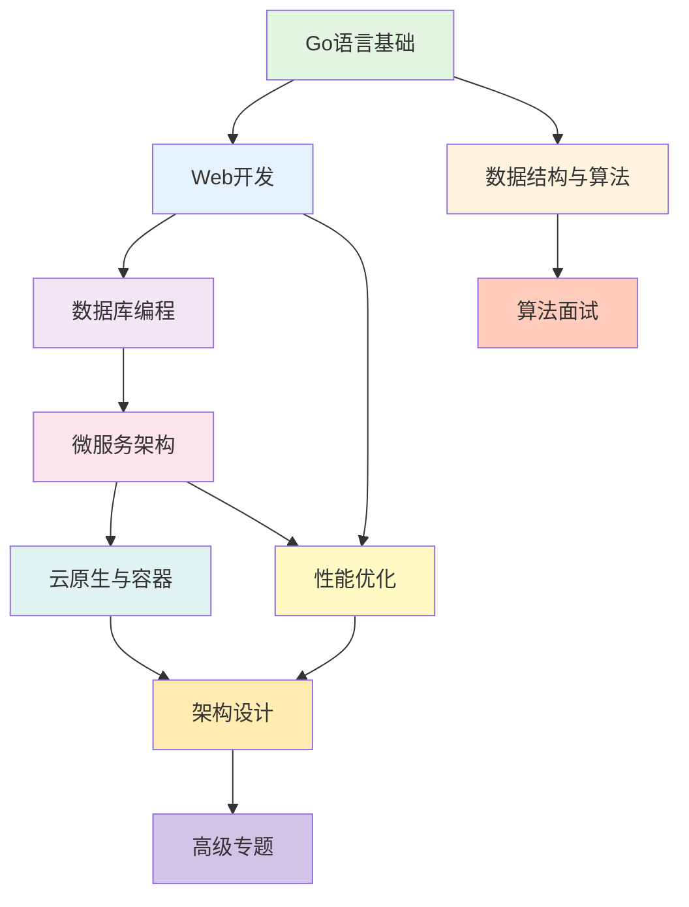

# 🗺️ Go语言学习路径图

> 根据不同目标和基础，为您规划最优学习路径

**版本**: v2.2  
**更新日期**: 2025-10-29  
**适用对象**: 所有Go学习者

---


## 📋 目录


- [🎯 推荐起点](#推荐起点)
- [🆕 最新路径 (2025-10-28)](#最新路径-2025-10-28)
  - [🛠️ 形式化验证工具学习路径](#形式化验证工具学习路径)
- [📑 目录](#目录)
- [学习路径总览](#学习路径总览)
- [零基础入门路径](#零基础入门路径)
  - [🎯 目标](#目标公司)
  - [⏱️ 学习时间](#学习时间)
  - [📚 学习内容](#学习内容2)
    - [Week 1: 语言基础](#week-1-语言基础)
    - [Week 2: 并发编程基础](#week-2-并发编程基础)
    - [Week 3-4: Web开发入门](#week-3-4-web开发入门)
  - [✅ 学习成果](#学习成果2)
- [Web开发路径](#web开发路径)
  - [🎯 目标1](#目标1)
  - [⏱️ 学习时间1](#学习时间1)
  - [📚 学习内容1](#学习内容1)
    - [Phase 1: Web框架深入 (Week 1-2)](#phase-1-web框架深入-week-1-2)
    - [Phase 2: 数据库编程 (Week 3-4)](#phase-2-数据库编程-week-3-4)
    - [Phase 3: 高级特性 (Week 5-6)](#phase-3-高级特性-week-5-6)
    - [Phase 4: 性能与监控 (Week 7-8)](#phase-4-性能与监控-week-7-8)
  - [✅ 学习成果1](#学习成果1)
  - [💼 就业方向](#就业方向2)
- [微服务开发路径](#微服务开发路径)
  - [🎯 目标2](#目标2)
  - [⏱️ 学习时间2](#学习时间2)
  - [📚 学习内容2](#学习内容2)
    - [Phase 1: 微服务基础 (Week 1-2)](#phase-1-微服务基础-week-1-2)
    - [Phase 2: 服务通信 (Week 3-4)](#phase-2-服务通信-week-3-4)
    - [Phase 3: 服务治理 (Week 5-6)](#phase-3-服务治理-week-5-6)
    - [Phase 4: 高级特性 (Week 7-8)](#phase-4-高级特性-week-7-8)
    - [Phase 5: 部署与运维 (Week 9-10)](#phase-5-部署与运维-week-9-10)
    - [Phase 6: 安全与优化 (Week 11-12)](#phase-6-安全与优化-week-11-12)
  - [✅ 学习成果2](#学习成果2)
  - [💼 就业方向2](#就业方向2)
- [云原生路径](#云原生路径)
  - [🎯 目标3](#目标3)
  - [⏱️ 学习时间3](#学习时间3)
  - [📚 学习内容3](#学习内容3)
    - [Phase 1: 容器化 (Week 1-2)](#phase-1-容器化-week-1-2)
    - [Phase 2: Kubernetes (Week 3-5)](#phase-2-kubernetes-week-3-5)
    - [Phase 3: Service Mesh (Week 6-7)](#phase-3-service-mesh-week-6-7)
    - [Phase 4: CI/CD (Week 8-10)](#phase-4-cicd-week-8-10)
  - [✅ 学习成果3](#学习成果3)
  - [💼 就业方向3](#就业方向3)
- [性能优化路径](#性能优化路径)
  - [🎯 目标4](#目标4)
  - [⏱️ 学习时间4](#学习时间4)
  - [📚 学习内容4](#学习内容4)
    - [Phase 1: 性能分析 (Week 1-2)](#phase-1-性能分析-week-1-2)
    - [Phase 2: 优化实践 (Week 3-4)](#phase-2-优化实践-week-3-4)
    - [Phase 3: 避坑指南 (Week 5-6)](#phase-3-避坑指南-week-5-6)
  - [✅ 学习成果4](#学习成果4)
  - [💼 适用场景](#适用场景)
- [算法面试路径](#算法面试路径)
  - [🎯 目标5](#目标5)
  - [⏱️ 学习时间5](#学习时间5)
  - [📚 学习内容5](#学习内容5)
    - [Phase 1: 数据结构 (Week 1-3)](#phase-1-数据结构-week-1-3)
    - [Phase 2: 常用算法 (Week 4-6)](#phase-2-常用算法-week-4-6)
    - [Phase 3: 算法模式 (Week 7-9)](#phase-3-算法模式-week-7-9)
    - [Phase 4: 实战刷题 (Week 10-12)](#phase-4-实战刷题-week-10-12)
  - [✅ 学习成果5](#学习成果5)
  - [💼 目标公司](#目标公司)
- [架构师路径](#架构师路径)
  - [🎯 目标6](#目标6)
  - [⏱️ 学习时间6](#学习时间6)
  - [📚 学习内容6](#学习内容6)
    - [Phase 1: 设计模式 (Week 1-4)](#phase-1-设计模式-week-1-4)
    - [Phase 2: 微服务深化 (Week 5-10)](#phase-2-微服务深化-week-5-10)
    - [Phase 3: 云原生深化 (Week 11-14)](#phase-3-云原生深化-week-11-14)
    - [Phase 4: 性能与稳定性 (Week 15-18)](#phase-4-性能与稳定性-week-15-18)
    - [Phase 5: 高级专题 (Week 19-24)](#phase-5-高级专题-week-19-24)
  - [✅ 学习成果6](#学习成果6)
  - [💼 职业发展](#职业发展)
- [按时间规划](#按时间规划)
  - [📅 4周快速入门](#4周快速入门)
  - [📅 3个月成为Go开发者](#3个月成为go开发者)
  - [📅 6个月进阶](#6个月进阶)
  - [📅 1年成为专家](#1年成为专家)
- [进阶技能树](#进阶技能树)
  - [Level 1: 初级开发者 (0-6个月)](#level-1-初级开发者-0-6个月)
  - [Level 2: 中级开发者 (6-18个月)](#level-2-中级开发者-6-18个月)
  - [Level 3: 高级开发者 (18-36个月)](#level-3-高级开发者-18-36个月)
  - [Level 4: 专家/架构师 (3年+)](#level-4-专家架构师-3年)
- [📚 推荐书籍](#推荐书籍)
  - [入门阶段](#入门阶段)
  - [进阶阶段](#进阶阶段)
  - [高级阶段](#高级阶段)
  - [架构阶段](#架构阶段)
- [🎯 学习建议](#学习建议)
  - [1. 循序渐进](#1.-循序渐进)
  - [2. 动手实践](#2.-动手实践)
  - [3. 持续学习](#3.-持续学习)
  - [4. 社区参与](#4.-社区参与)
- [🔗 相关资源](#相关资源)

## 🎯 推荐起点

在开始学习之前，强烈建议先阅读：

📖 **[Go 1.25.3完整知识体系总览](./00-Go-1.25.3完整知识体系总览-2025.md)** ⭐⭐⭐⭐⭐

这份总览文档将帮助您：
- ✅ 理解Go语言的完整知识体系结构
- ✅ 了解三层架构（语言层/设计层/架构层）
- ✅ 根据目标选择最适合的学习路径
- ✅ 快速定位您需要的学习资源

---

## 🆕 最新路径 (2025-10-28)

### 🛠️ 形式化验证工具学习路径

**目标**: 掌握Go形式化验证工具，提升代码质量

**时间**: 2-4周

**前置要求**: Go基础，了解并发编程

**学习内容**:

**Week 1: 工具使用**:

- Day 1-2: Formal Verifier快速入门
- Day 3-4: Pattern Generator基础使用
- Day 5-7: 实战练习

**Week 2: 并发模式**:

- 经典模式 (Worker Pool, Fan-In/Out, Pipeline)
- 同步模式 (Mutex, WaitGroup, Once等)
- 控制流模式 (Context, Graceful Shutdown)

**Week 3-4: 深入理论**:

- CSP并发模型
- 形式化验证方法
- 编译器优化理论

**快速开始**: [工具集索引](./📚-Go形式化验证工具集-完整文档索引-2025-10-25.md) | [快速参考](./🚀-2025-10-25快速参考指南.md)

---

## 📑 目录

- [🗺️ Go语言学习路径图](#go语言学习路径图)
  - [🆕 最新路径 (2025-10-25)](#-最新路径-2025-10-25)
    - [🛠️ 形式化验证工具学习路径](#形式化验证工具学习路径)
  - [📑 目录](#目录)
  - [学习路径总览](#学习路径总览)
  - [零基础入门路径](#零基础入门路径)
    - [🎯 目标](#目标公司)
    - [⏱️ 学习时间](#学习时间)
    - [📚 学习内容](#学习内容2)
      - [Week 1: 语言基础](#week-1-语言基础)
      - [Week 2: 并发编程基础](#week-2-并发编程基础)
      - [Week 3-4: Web开发入门](#week-3-4-web开发入门)
    - [✅ 学习成果](#学习成果2)
  - [Web开发路径](#web开发路径)
    - [🎯 目标1](#目标1)
    - [⏱️ 学习时间1](#学习时间1)
    - [📚 学习内容1](#学习内容1)
      - [Phase 1: Web框架深入 (Week 1-2)](#phase-1-web框架深入-week-1-2)
      - [Phase 2: 数据库编程 (Week 3-4)](#phase-2-数据库编程-week-3-4)
      - [Phase 3: 高级特性 (Week 5-6)](#phase-3-高级特性-week-5-6)
      - [Phase 4: 性能与监控 (Week 7-8)](#phase-4-性能与监控-week-7-8)
    - [✅ 学习成果1](#学习成果1)
    - [💼 就业方向](#就业方向2)
  - [微服务开发路径](#微服务开发路径)
    - [🎯 目标2](#目标2)
    - [⏱️ 学习时间2](#学习时间2)
    - [📚 学习内容2](#学习内容2)
      - [Phase 1: 微服务基础 (Week 1-2)](#phase-1-微服务基础-week-1-2)
      - [Phase 2: 服务通信 (Week 3-4)](#phase-2-服务通信-week-3-4)
      - [Phase 3: 服务治理 (Week 5-6)](#phase-3-服务治理-week-5-6)
      - [Phase 4: 高级特性 (Week 7-8)](#phase-4-高级特性-week-7-8)
      - [Phase 5: 部署与运维 (Week 9-10)](#phase-5-部署与运维-week-9-10)
      - [Phase 6: 安全与优化 (Week 11-12)](#phase-6-安全与优化-week-11-12)
    - [✅ 学习成果2](#学习成果2)
    - [💼 就业方向2](#就业方向2)
  - [云原生路径](#云原生路径)
    - [🎯 目标3](#目标3)
    - [⏱️ 学习时间3](#学习时间3)
    - [📚 学习内容3](#学习内容3)
      - [Phase 1: 容器化 (Week 1-2)](#phase-1-容器化-week-1-2)
      - [Phase 2: Kubernetes (Week 3-5)](#phase-2-kubernetes-week-3-5)
      - [Phase 3: Service Mesh (Week 6-7)](#phase-3-service-mesh-week-6-7)
      - [Phase 4: CI/CD (Week 8-10)](#phase-4-cicd-week-8-10)
    - [✅ 学习成果3](#学习成果3)
    - [💼 就业方向3](#就业方向3)
  - [性能优化路径](#性能优化路径)
    - [🎯 目标4](#目标4)
    - [⏱️ 学习时间4](#学习时间4)
    - [📚 学习内容4](#学习内容4)
      - [Phase 1: 性能分析 (Week 1-2)](#phase-1-性能分析-week-1-2)
      - [Phase 2: 优化实践 (Week 3-4)](#phase-2-优化实践-week-3-4)
      - [Phase 3: 避坑指南 (Week 5-6)](#phase-3-避坑指南-week-5-6)
    - [✅ 学习成果4](#学习成果4)
    - [💼 适用场景](#适用场景)
  - [算法面试路径](#算法面试路径)
    - [🎯 目标5](#目标5)
    - [⏱️ 学习时间5](#学习时间5)
    - [📚 学习内容5](#学习内容5)
      - [Phase 1: 数据结构 (Week 1-3)](#phase-1-数据结构-week-1-3)
      - [Phase 2: 常用算法 (Week 4-6)](#phase-2-常用算法-week-4-6)
      - [Phase 3: 算法模式 (Week 7-9)](#phase-3-算法模式-week-7-9)
      - [Phase 4: 实战刷题 (Week 10-12)](#phase-4-实战刷题-week-10-12)
    - [✅ 学习成果5](#学习成果5)
    - [💼 目标公司](#目标公司)
  - [架构师路径](#架构师路径)
    - [🎯 目标6](#目标6)
    - [⏱️ 学习时间6](#学习时间6)
    - [📚 学习内容6](#学习内容6)
      - [Phase 1: 设计模式 (Week 1-4)](#phase-1-设计模式-week-1-4)
      - [Phase 2: 微服务深化 (Week 5-10)](#phase-2-微服务深化-week-5-10)
      - [Phase 3: 云原生深化 (Week 11-14)](#phase-3-云原生深化-week-11-14)
      - [Phase 4: 性能与稳定性 (Week 15-18)](#phase-4-性能与稳定性-week-15-18)
      - [Phase 5: 高级专题 (Week 19-24)](#phase-5-高级专题-week-19-24)
    - [✅ 学习成果6](#学习成果6)
    - [💼 职业发展](#职业发展)
  - [按时间规划](#按时间规划)
    - [📅 4周快速入门](#4周快速入门)
    - [📅 3个月成为Go开发者](#3个月成为go开发者)
    - [📅 6个月进阶](#6个月进阶)
    - [📅 1年成为专家](#1年成为专家)
  - [进阶技能树](#进阶技能树)
    - [Level 1: 初级开发者 (0-6个月)](#level-1-初级开发者-0-6个月)
    - [Level 2: 中级开发者 (6-18个月)](#level-2-中级开发者-6-18个月)
    - [Level 3: 高级开发者 (18-36个月)](#level-3-高级开发者-18-36个月)
    - [Level 4: 专家/架构师 (3年+)](#level-4-专家架构师-3年)
  - [📚 推荐书籍](#推荐书籍)
    - [入门阶段](#入门阶段)
    - [进阶阶段](#进阶阶段)
    - [高级阶段](#高级阶段)
    - [架构阶段](#架构阶段)
  - [🎯 学习建议](#学习建议)
    - [1. 循序渐进](#1.-循序渐进)
    - [2. 动手实践](#2.-动手实践)
    - [3. 持续学习](#3.-持续学习)
    - [4. 社区参与](#4.-社区参与)
  - [🔗 相关资源](#相关资源)

---

## 学习路径总览



---

## 零基础入门路径

### 🎯 目标

掌握Go语言基础，能够编写简单的命令行工具和Web应用

### ⏱️ 学习时间

**2-4周** (每天2-3小时)

### 📚 学习内容

#### Week 1: 语言基础

**Day 1-2: 入门**:

- [ ] [Hello World](01-语言基础/01-语法基础/01-Hello-World.md)
- [ ] [变量和常量](01-语言基础/01-语法基础/02-变量和常量.md)
- [ ] [基本数据类型](01-语言基础/01-语法基础/03-基本数据类型.md)
- [ ] **实战**: 编写简单计算器

**Day 3-5: 流程控制**:

- [ ] [流程控制](01-语言基础/01-语法基础/04-流程控制.md)
- [ ] **实战**: 编写猜数字游戏
- [ ] **实战**: 实现简单的待办事项CLI

**Day 6-7: 模块管理**:

- [ ] [Go Modules简介](01-语言基础/03-模块管理/01-Go-Modules简介.md)
- [ ] [go.mod文件](01-语言基础/03-模块管理/02-go-mod文件详解.md)
- [ ] **实战**: 创建自己的Go模块

#### Week 2: 并发编程基础

**Day 1-3: Goroutine和Channel**:

- [ ] [Goroutine基础](01-语言基础/02-并发编程/02-Goroutine基础.md)
- [ ] [Channel基础](01-语言基础/02-并发编程/03-Channel基础.md)
- [ ] **实战**: 并发下载器

**Day 4-5: 同步与上下文**:

- [ ] [select与context](01-语言基础/02-并发编程/05-select与context.md)
- [ ] [sync包](01-语言基础/02-并发编程/06-sync包.md)
- [ ] **实战**: 并发Web爬虫

**Day 6-7: 综合项目**:

- [ ] **项目**: 实现一个简单的HTTP文件服务器
- [ ] **项目**: 命令行工具集合

#### Week 3-4: Web开发入门

**Day 1-3: HTTP基础**:

- [ ] [HTTP协议](03-Web开发/01-HTTP协议.md)
- [ ] [net/http包](03-Web开发/02-net-http包.md)
- [ ] [HTTP服务器](03-Web开发/03-HTTP服务器.md)
- [ ] **实战**: RESTful API服务器

**Day 4-7: Gin框架**:

- [ ] [Gin框架](03-Web开发/04-Gin框架.md)
- [ ] [路由设计](03-Web开发/08-路由设计.md)
- [ ] [参数处理](03-Web开发/09-参数处理.md)
- [ ] **项目**: 完整的Todo API

### ✅ 学习成果

- ✅ 能独立编写Go程序
- ✅ 理解并发编程基础
- ✅ 能构建简单的Web API
- ✅ 掌握Go工具链使用

---

## Web开发路径

### 🎯 目标1

成为全栈Go Web开发者，能够开发生产级Web应用

### ⏱️ 学习时间1

**4-8周** (每天2-3小时，需要入门基础)

### 📚 学习内容1

#### Phase 1: Web框架深入 (Week 1-2)

- [ ] [Gin深度实战](03-Web开发/00-Gin框架深度实战指南.md)
- [ ] [Echo框架](03-Web开发/05-Echo框架.md)
- [ ] [Fiber框架](03-Web开发/06-Fiber框架.md)
- [ ] [中间件模式](03-Web开发/07-中间件模式.md)
- [ ] **实战**: 自定义中间件库

#### Phase 2: 数据库编程 (Week 3-4)

- [ ] [MySQL编程](04-数据库编程/01-MySQL编程.md)
- [ ] [PostgreSQL编程](04-数据库编程/02-PostgreSQL编程.md)
- [ ] [Redis编程](04-数据库编程/03-Redis编程.md)
- [ ] **实战**: 用户系统(注册/登录/权限)

#### Phase 3: 高级特性 (Week 5-6)

- [ ] [认证与授权](03-Web开发/00-Go认证与授权深度实战指南.md)
- [ ] [WebSocket](03-Web开发/12-WebSocket.md)
- [ ] [文件上传](03-Web开发/11-文件上传.md)
- [ ] [安全实践](03-Web开发/14-安全实践.md)
- [ ] **实战**: 实时聊天应用

#### Phase 4: 性能与监控 (Week 7-8)

- [ ] [Web性能优化](03-Web开发/15-性能优化.md)
- [ ] [监控和日志](03-Web开发/16-监控和日志.md)
- [ ] [测试实践](09-工程实践/00-Go测试深度实战指南.md)
- [ ] **项目**: 完整的博客系统

### ✅ 学习成果1

- ✅ 精通主流Web框架
- ✅ 掌握数据库操作
- ✅ 能实现认证授权
- ✅ 具备性能优化能力

### 💼 就业方向

- Go Web后端工程师
- 全栈工程师(Go后端)
- API开发工程师

---

## 微服务开发路径

### 🎯 目标2

构建和维护大规模微服务系统

### ⏱️ 学习时间2

**8-12周** (每天3-4小时，需要Web开发基础)

### 📚 学习内容2

#### Phase 1: 微服务基础 (Week 1-2)

- [ ] [微服务基础](05-微服务架构/01-微服务基础.md)
- [ ] [服务注册与发现](05-微服务架构/02-服务注册与发现.md)
- [ ] [API网关](05-微服务架构/03-API网关.md)
- [ ] **实战**: 3个微服务的系统

#### Phase 2: 服务通信 (Week 3-4)

- [ ] [gRPC深度实战](05-微服务架构/00-gRPC深度实战指南.md)
- [ ] [服务间通信](05-微服务架构/04-服务间通信.md)
- [ ] [消息队列](05-微服务架构/00-消息队列深度实战指南.md)
- [ ] **实战**: gRPC+REST混合架构

#### Phase 3: 服务治理 (Week 5-6)

- [ ] [配置管理](05-微服务架构/05-配置管理.md)
- [ ] [监控与追踪](05-微服务架构/06-监控与追踪.md)
- [ ] [容错处理与熔断](05-微服务架构/07-容错处理与熔断.md)
- [ ] **实战**: 完整的可观测性方案

#### Phase 4: 高级特性 (Week 7-8)

- [ ] [数据一致性与事务](05-微服务架构/08-数据一致性与事务.md)
- [ ] [高性能微服务](05-微服务架构/10-高性能微服务架构.md)
- [ ] [Service Mesh集成](05-微服务架构/12-Service-Mesh集成.md)
- [ ] **实战**: Istio集成

#### Phase 5: 部署与运维 (Week 9-10)

- [ ] [K8s微服务部署](05-微服务架构/11-Kubernetes微服务部署.md)
- [ ] [GitOps持续部署](05-微服务架构/13-GitOps持续部署.md)
- [ ] [多集群服务治理](05-微服务架构/14-多集群服务治理.md)
- [ ] **实战**: 完整的CI/CD流水线

#### Phase 6: 安全与优化 (Week 11-12)

- [ ] [微服务安全最佳实践](05-微服务架构/15-微服务安全最佳实践.md)
- [ ] [性能优化](07-性能优化/)
- [ ] **项目**: 电商微服务系统

### ✅ 学习成果2

- ✅ 掌握微服务架构设计
- ✅ 精通服务治理
- ✅ 能实施DevOps实践
- ✅ 具备大规模系统经验

### 💼 就业方向2

- 微服务架构师
- 后端技术专家
- DevOps工程师
- SRE工程师

---

## 云原生路径

### 🎯 目标3

掌握云原生技术栈，能够在Kubernetes上部署和管理应用

### ⏱️ 学习时间3

**6-10周** (每天3-4小时，需要微服务基础)

### 📚 学习内容3

#### Phase 1: 容器化 (Week 1-2)

- [ ] [容器化基础](06-云原生与容器/01-Go与容器化基础.md)
- [ ] [Dockerfile最佳实践](06-云原生与容器/02-Dockerfile最佳实践.md)
- [ ] **实战**: 多阶段构建优化

#### Phase 2: Kubernetes (Week 3-5)

- [ ] [K8s入门](06-云原生与容器/03-Go与Kubernetes入门.md)
- [ ] [K8s高级特性](06-云原生与容器/04-Kubernetes高级特性.md)
- [ ] **实战**: StatefulSet应用部署

#### Phase 3: Service Mesh (Week 6-7)

- [ ] [服务网格集成](06-云原生与容器/05-服务网格集成.md)
- [ ] [Service Mesh实战](05-微服务架构/12-Service-Mesh集成.md)
- [ ] **实战**: Istio流量管理

#### Phase 4: CI/CD (Week 8-10)

- [ ] [GitOps部署](06-云原生与容器/06-GitOps部署.md)
- [ ] [GitHub Actions](06-云原生与容器/07-GitHub-Actions.md)
- [ ] [GitLab CI](06-云原生与容器/08-GitLab-CI.md)
- [ ] [多环境部署](06-云原生与容器/09-多环境部署.md)
- [ ] **项目**: 完整的云原生应用

### ✅ 学习成果3

- ✅ 掌握容器技术
- ✅ 精通Kubernetes
- ✅ 能使用Service Mesh
- ✅ 具备云原生实践经验

### 💼 就业方向3

- 云原生工程师
- Kubernetes管理员
- 平台工程师
- DevOps专家

---

## 性能优化路径

### 🎯 目标4

成为Go性能优化专家

### ⏱️ 学习时间4

**4-6周** (每天2-3小时，需要Go基础)

### 📚 学习内容4

#### Phase 1: 性能分析 (Week 1-2)

- [ ] [性能分析与pprof](07-性能优化/01-性能分析与pprof.md)
- [ ] [性能基准测试](07-性能优化/08-性能基准测试.md)
- [ ] **实战**: 分析真实项目性能

#### Phase 2: 优化实践 (Week 3-4)

- [ ] [内存优化](07-性能优化/02-内存优化.md)
- [ ] [并发优化](07-性能优化/03-并发优化.md)
- [ ] [网络与I/O优化](07-性能优化/04-网络与I-O优化.md)
- [ ] [GC调优](07-性能优化/05-GC调优.md)
- [ ] **实战**: 优化慢接口

#### Phase 3: 避坑指南 (Week 5-6)

- [ ] [常见性能陷阱](07-性能优化/06-常见性能陷阱.md)
- [ ] [性能优化最佳实践](07-性能优化/07-性能优化最佳实践.md)
- [ ] [开源项目案例](07-性能优化/10-开源项目案例与工程实践.md)
- [ ] **项目**: 性能优化报告

### ✅ 学习成果4

- ✅ 掌握性能分析工具
- ✅ 能定位性能瓶颈
- ✅ 具备优化实战经验
- ✅ 了解常见性能陷阱

### 💼 适用场景

- 高并发系统优化
- 低延迟服务优化
- 内存占用优化
- CPU密集型任务优化

---

## 算法面试路径

### 🎯 目标5

通过大厂算法面试

### ⏱️ 学习时间5

**8-12周** (每天2-3小时)

### 📚 学习内容5

#### Phase 1: 数据结构 (Week 1-3)

- [ ] [数组与切片](02-数据结构与算法/01-基础数据结构.md#%e6%95%b0%e7%bb%84%e4%b8%8e%e5%88%87%e7%89%87)
- [ ] [链表](02-数据结构与算法/01-基础数据结构.md#%e9%93%be%e8%a1%a8)
- [ ] [栈与队列](02-数据结构与算法/01-基础数据结构.md#%e6%a0%88%e4%b8%8e%e9%98%9f%e5%88%97)
- [ ] [哈希表](02-数据结构与算法/01-基础数据结构.md#%e5%93%88%e5%b8%8c%e8%a1%a8)
- [ ] [树](02-数据结构与算法/01-基础数据结构.md#%e6%a0%91)
- [ ] [图](02-数据结构与算法/01-基础数据结构.md#%e5%9b%be)
- [ ] **每天**: 5道LeetCode Easy题目

#### Phase 2: 常用算法 (Week 4-6)

- [ ] [排序算法](02-数据结构与算法/02-常用算法.md#%e6%8e%92%e5%ba%8f%e7%ae%97%e6%b3%95)
- [ ] [查找算法](02-数据结构与算法/02-常用算法.md#%e6%9f%a5%e6%89%be%e7%ae%97%e6%b3%95)
- [ ] [字符串算法](02-数据结构与算法/02-常用算法.md#%e5%ad%97%e7%ac%a6%e4%b8%b2%e7%ae%97%e6%b3%95)
- [ ] [动态规划](02-数据结构与算法/02-常用算法.md#%e5%8a%a8%e6%80%81%e8%a7%84%e5%88%92)
- [ ] [贪心算法](02-数据结构与算法/02-常用算法.md#%e8%b4%aa%e5%bf%83%e7%ae%97%e6%b3%95)
- [ ] [回溯算法](02-数据结构与算法/02-常用算法.md#%e5%9b%9e%e6%ba%af%e7%ae%97%e6%b3%95)
- [ ] **每天**: 3道LeetCode Medium题目

#### Phase 3: 算法模式 (Week 7-9)

- [ ] [双指针](02-数据结构与算法/03-算法模式.md#%e5%8f%8c%e6%8c%87%e9%92%88)
- [ ] [递归与分治](02-数据结构与算法/03-算法模式.md#%e9%80%92%e5%bd%92%e4%b8%8e%e5%88%86%e6%b2%bb)
- [ ] [动态规划模式](02-数据结构与算法/03-算法模式.md#%e5%8a%a8%e6%80%81%e8%a7%84%e5%88%92)
- [ ] [搜索算法](02-数据结构与算法/03-算法模式.md#%e6%90%9c%e7%b4%a2%e7%ae%97%e6%b3%95)
- [ ] [贪心模式](02-数据结构与算法/03-算法模式.md#%e8%b4%aa%e5%bf%83%e7%ae%97%e6%b3%95)
- [ ] [位运算](02-数据结构与算法/03-算法模式.md#%e4%bd%8d%e8%bf%90%e7%ae%97)
- [ ] **每天**: 2道Medium + 1道Hard

#### Phase 4: 实战刷题 (Week 10-12)

- [ ] [LeetCode实战](02-数据结构与算法/04-实战案例.md)
- [ ] **每天**: 根据薄弱环节专项训练
- [ ] **模拟面试**: 每周2次

### ✅ 学习成果5

- ✅ 掌握常用数据结构
- ✅ 熟练使用各类算法
- ✅ 能快速识别算法模式
- ✅ 完成200+道LeetCode

### 💼 目标公司

- 字节跳动
- 腾讯
- 阿里巴巴
- 美团
- 百度

---

## 架构师路径

### 🎯 目标6

成为资深Go架构师

### ⏱️ 学习时间6

**16-24周** (需要多年开发经验)

### 📚 学习内容6

#### Phase 1: 设计模式 (Week 1-4)

- [ ] [创建型模式](08-架构设计/01-创建型模式.md)
- [ ] [结构型模式](08-架构设计/02-结构型模式.md)
- [ ] [行为型模式](08-架构设计/03-行为型模式.md)
- [ ] [并发型模式](08-架构设计/04-并发型模式.md)
- [ ] [分布式型模式](08-架构设计/05-分布式型模式.md)
- [ ] [工作流型模式](08-架构设计/06-工作流型模式.md)
- [ ] **实战**: 重构遗留系统

#### Phase 2: 微服务深化 (Week 5-10)

- [ ] 完成[微服务开发路径](#微服务开发路径)全部内容
- [ ] **项目**: 设计大规模微服务架构

#### Phase 3: 云原生深化 (Week 11-14)

- [ ] 完成[云原生路径](#云原生路径)全部内容
- [ ] **项目**: 云原生平台建设

#### Phase 4: 性能与稳定性 (Week 15-18)

- [ ] 完成[性能优化路径](#性能优化路径)全部内容
- [ ] **项目**: 系统稳定性提升方案

#### Phase 5: 高级专题 (Week 19-24)

- [ ] [高级专题](11-高级专题/README.md)精选学习
- [ ] **重点**: 根据业务方向深入学习
- [ ] **项目**: 技术架构设计文档

### ✅ 学习成果6

- ✅ 掌握各类设计模式
- ✅ 能设计大规模系统
- ✅ 具备技术决策能力
- ✅ 拥有丰富实战经验

### 💼 职业发展

- 技术架构师
- 系统架构师
- 技术VP/CTO
- 技术专家

---

## 按时间规划

### 📅 4周快速入门

**目标**: 能独立开发简单Go程序

- Week 1: [语言基础](01-语言基础/01-语法基础/)
- Week 2: [并发编程](01-语言基础/02-并发编程/)
- Week 3: [HTTP基础](03-Web开发/)
- Week 4: **项目**: Todo CLI + Todo API

### 📅 3个月成为Go开发者

**目标**: 能胜任Go后端开发工作

- Month 1: [入门路径](#零基础入门路径)
- Month 2: [Web开发](03-Web开发/) + [数据库](04-数据库编程/)
- Month 3: [微服务基础](05-微服务架构/) + **项目实战**

### 📅 6个月进阶

**目标**: 成为熟练的Go工程师

- Month 1-2: [Web开发路径](#web开发路径)
- Month 3-4: [微服务路径](#微服务开发路径) (前半部分)
- Month 5: [性能优化](07-性能优化/) + [架构设计](08-架构设计/)
- Month 6: **大型项目**实战

### 📅 1年成为专家

**目标**: Go领域专家

- Month 1-3: 完成[Web开发路径](#web开发路径)
- Month 4-6: 完成[微服务路径](#微服务开发路径)
- Month 7-9: 完成[云原生路径](#云原生路径)
- Month 10-11: [高级专题](11-高级专题/) 深入学习
- Month 12: **开源贡献** + **技术分享**

---

## 进阶技能树

### Level 1: 初级开发者 (0-6个月)

```text
Go基础
├── 语法基础 ✅
├── 并发编程 ✅
└── 模块管理 ✅

Web开发
├── HTTP服务器 ✅
├── Gin框架 ✅
└── 数据库操作 ✅
```

### Level 2: 中级开发者 (6-18个月)

```text
微服务
├── 服务注册发现 ✅
├── gRPC ✅
├── API网关 ✅
└── 服务治理 ✅

性能优化
├── pprof分析 ✅
├── 内存优化 ✅
└── 并发优化 ✅
```

### Level 3: 高级开发者 (18-36个月)

```text
云原生
├── Kubernetes ✅
├── Service Mesh ✅
├── GitOps ✅
└── 可观测性 ✅

架构设计
├── 设计模式 ✅
├── 分布式架构 ✅
└── 高可用设计 ✅
```

### Level 4: 专家/架构师 (3年+)

```text
技术深度
├── 源码分析 ✅
├── 性能极致优化 ✅
└── 技术创新 ✅

技术广度
├── 多领域涉猎 ✅
├── 技术选型 ✅
└── 团队建设 ✅
```

---

## 📚 推荐书籍

### 入门阶段

1. **《Go程序设计语言》** (The Go Programming Language)
2. **《Go语言实战》** (Go in Action)

### 进阶阶段

1. **《Go并发编程实战》**
2. **《Go Web编程》**

### 高级阶段

1. **《Go语言高级编程》**
2. **《微服务设计》** (Building Microservices)

### 架构阶段

1. **《设计数据密集型应用》** (Designing Data-Intensive Applications)
2. **《分布式系统原理》**

---

## 🎯 学习建议

### 1. 循序渐进

- ✅ 不要跳步，打好基础
- ✅ 理论+实践结合
- ✅ 每个阶段都有项目

### 2. 动手实践

- ✅ 每天写代码
- ✅ 完成练习题
- ✅ 参与开源项目

### 3. 持续学习

- ✅ 关注Go官方博客
- ✅ 阅读优秀源码
- ✅ 技术分享

### 4. 社区参与

- ✅ 加入Go社区
- ✅ 参加技术大会
- ✅ 建立技术人脉

---

## 🔗 相关资源

- [技术索引](INDEX.md) - 全部文档索引
- [快速开始](QUICK_START.md) - 快速入门指南
- [常见问题](FAQ.md) - FAQ
- [主README](README.md) - 文档库概览

---

**文档维护**: Documentation Team  
**最后更新**: 2025-10-29  
**文档版本**: v2.0

---

<div align="center">

**🗺️ 选择适合您的学习路径，开启Go语言之旅！**

</div>
