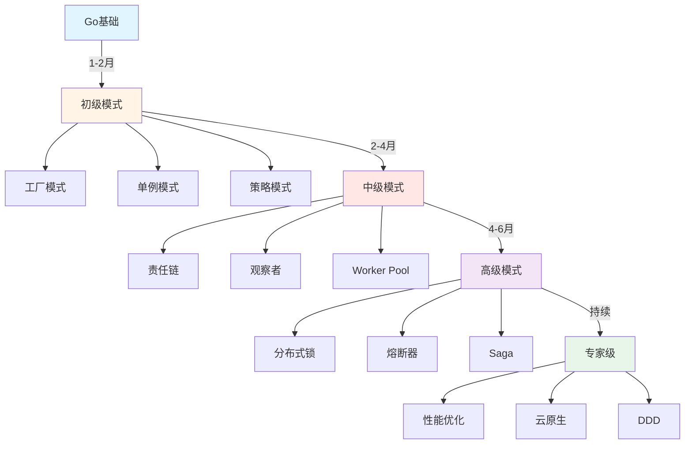

# Go设计模式内容总结与知识体系图谱

**版本**: v1.0
**更新日期**: 2025-10-29
**适用于**: Go 1.23+

---

## 📋 目录

- [1. 1. 内容总结](#1.-1.-内容总结)[2. 2. 知识体系图谱](#2.-2.-知识体系图谱)[3. 3. 学习建议与进阶路线](#3.-3.-学习建议与进阶路线)[4. 4. 参考文献与资源](#4.-4.-参考文献与资源)[5. 5. 六大类模式内容闭环](#5.-5.-六大类模式内容闭环)[6. 6. Go特色与工程价值](#6.-6.-go特色与工程价值)[7. 7. 进阶建议](#7.-7.-进阶建议)[8. 8. 未来趋势](#8.-8.-未来趋势)8. 8. 未来趋势](#8.-未来趋势)

---

## 1. 内容总结

本模块系统梳理了Go设计模式六大类：

- 创建型（单例、工厂、抽象工厂、建造者、原型）
- 结构型（适配器、桥接、组合、装饰器、外观、享元、代理）
- 行为型（策略、观察者、责任链、命令、状态、模板方法、访问者、备忘录、解释器、中介者）
- 并发型（Future、Worker Pool、生产者-消费者、Actor、CSP）
- 分布式型（服务注册发现、熔断器、分布式锁、幂等、Saga等）
- 工作流型（Petri网、事件驱动、补偿事务等）

每类模式均配有理论基础、Go idiomatic实现、工程分析、最佳实践与常见陷阱，兼顾理论深度与工程实用。

## 2. 知识体系图谱

```mermaid
    A["Go设计模式体系"]
    A --> B1["创建型"]
    B1 --> C1["单例"]
    B1 --> C2["工厂"]
    B1 --> C3["抽象工厂"]
    B1 --> C4["建造者"]
    B1 --> C5["原型"]
    A --> B2["结构型"]
    B2 --> D1["适配器"]
    B2 --> D2["桥接"]
    B2 --> D3["组合"]
    B2 --> D4["装饰器"]
    B2 --> D5["外观"]
    B2 --> D6["享元"]
    B2 --> D7["代理"]
    A --> B3["行为型"]
    B3 --> E1["策略"]
    B3 --> E2["观察者"]
    B3 --> E3["责任链"]
    B3 --> E4["命令"]
    B3 --> E5["状态"]
    B3 --> E6["模板方法"]
    B3 --> E7["访问者"]
    B3 --> E8["备忘录"]
    B3 --> E9["解释器"]
    B3 --> E10["中介者"]
    A --> B4["并发型"]
    B4 --> F1["Future"]
    B4 --> F2["Worker Pool"]
    B4 --> F3["生产者-消费者"]
    B4 --> F4["Actor"]
    B4 --> F5["CSP"]
    A --> B5["分布式型"]
    B5 --> G1["服务注册发现"]
    B5 --> G2["熔断器"]
    B5 --> G3["分布式锁"]
    B5 --> G4["幂等"]
    B5 --> G5["Saga"]
    A --> B6["工作流型"]
    B6 --> H1["Petri网"]
    B6 --> H2["事件驱动"]
    B6 --> H3["补偿事务"]
```

## 3. 学习建议与进阶路线

### 初级阶段（1-2个月）

**学习目标**：

- 掌握Go基础语法与特性
- 理解接口与组合的核心思想
- 熟悉基础并发原语（Goroutine、Channel）

**推荐模式**：

1. **工厂模式**：`NewXXX()`函数
2. **单例模式**：`sync.Once`实现
3. **策略模式**：接口+组合
4. **装饰器模式**：函数包装

**实践项目**：

- 实现一个简单的HTTP服务器
- 使用工厂模式管理配置
- 用策略模式实现多种排序算法

**学习资源**：

- Go官方教程：<https://tour.golang.org/>
- Go by Example：<https://gobyexample.com/>
- 本模块基础模式文档

---

### 中级阶段（2-4个月）

**学习目标**：

- 深入理解Go并发模型（G-P-M）
- 掌握常用结构型和行为型模式
- 能够设计和实现中等规模的系统

**推荐模式**：

1. **责任链模式**：中间件链
2. **观察者模式**：事件驱动
3. **适配器模式**：接口适配
4. **代理模式**：RPC客户端
5. **Worker Pool模式**：并发任务处理
6. **Pipeline模式**：流式数据处理

**实践项目**：

- 实现一个Web框架（Gin风格）
- 构建API网关（中间件链+负载均衡）
- 开发任务调度系统（Worker Pool）

**学习资源**：

- 《Go语言高级编程》
- Gin/Echo/Fiber源码阅读
- 本模块中级模式文档

---

### 高级阶段（4-6个月）

**学习目标**：

- 掌握分布式系统设计模式
- 理解云原生架构最佳实践
- 能够解决复杂的工程问题

**推荐模式**：

1. **服务注册与发现**：etcd、Consul
2. **熔断器模式**：Hystrix-go
3. **分布式锁**：Redis、etcd
4. **Saga模式**：分布式事务
5. **CQRS模式**：命令查询分离
6. **Event Sourcing**：事件溯源

**实践项目**：

- 构建微服务架构（gRPC+etcd）
- 实现分布式事务系统（Saga）
- 开发事件驱动系统（Kafka+CQRS）

**学习资源**：

- 《分布式系统模式》
- etcd/gRPC-Go/Go kit源码
- 本模块高级模式文档

---

### 专家阶段（持续学习）

**学习目标**：

- 深入理解Go运行时和编译器
- 掌握系统架构设计的艺术
- 贡献开源项目和社区

**进阶方向**：

1. **性能优化**：GC调优、并发优化、零拷贝
2. **云原生**：Kubernetes Operator、Service Mesh
3. **形式化验证**：TLA+建模、形式化证明
4. **领域驱动设计**：战略设计、战术设计

**实践项目**：

- 开发Kubernetes Operator
- 构建高性能中间件（RPC框架）
- 参与开源项目（etcd、Kubernetes）

**学习资源**：

- Go运行时源码：<https://github.com/golang/go>
- Kubernetes源码：<https://github.com/kubernetes/kubernetes>
- 论文阅读：Raft、Paxos、CAP

---

### 学习路线图（可视化）



---

### 学习方法建议

1. **理论与实践结合**：每学一个模式，必须手写实现
2. **源码阅读**：阅读优秀开源项目的模式应用
3. **项目驱动**：通过实际项目巩固所学
4. **持续重构**：不断优化已有代码，应用新模式
5. **社区交流**：参与Go社区讨论，分享经验

---

### 常见学习误区

❌ **误区1：为模式而模式**

- 不要强行套用模式
- 优先解决问题，再考虑模式

❌ **误区2：忽视Go特性**

- Go不是Java/C++，避免直译OOP模式
- 充分利用接口、组合、并发原语

❌ **误区3：跳过基础**

- 不要急于学习高级模式
- 扎实的基础是进阶的前提

❌ **误区4：缺乏实践**

- 光看不练假把式
- 必须通过项目实践验证理解

✅ **正确做法**：

- 循序渐进，打牢基础
- 理论结合实践
- 多读优秀代码
- 持续重构优化

## 4. 参考文献与资源

- Go官方文档：<https://golang.org/doc/>
- GoF《设计模式》、Head First Design Patterns
- Go设计模式实战：<https://github.com/senghoo/golang-design-pattern>
- Go开源项目导航：<https://github.com/avelino/awesome-go>

## 5. 六大类模式内容闭环

- 创建型、结构型、行为型、并发型、分布式型、工作流型均配备：
  - 理论基础与形式化定义
  - Go idiomatic实现与工程分析
  - 典型代码、测试、性能分析
  - 适用场景、常见陷阱、最佳实践
  - 开源项目案例与业务场景结合

## 6. Go特色与工程价值

- 强调组合优于继承、接口驱动、并发原语、云原生友好
- 关注性能、可维护性、扩展性与工程落地
- 结合Go社区主流项目与实际工程问题

## 7. 进阶建议

- 深入理解Go接口、组合、并发、泛型等新特性
- 多做模式对比与适用性分析，避免"为模式而模式"
- 结合实际业务与开源项目持续实践

## 8. 未来趋势

- 云原生、微服务、服务网格、事件驱动架构下的新型模式
- 自动化、可观测性、韧性设计等工程化新需求

---

详见各模式子模块与知识体系图谱。

---

**文档维护者**: Go Documentation Team
**最后更新**: 2025-10-29
**文档状态**: 完成
**适用版本**: Go 1.25.3+
