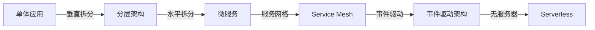

# Go设计模式进阶专题与学习路线图

> **简介**: Go设计模式进阶专题（泛型、并发、分布式、云原生）与完整学习路线图
> **版本**: Go 1.23+  
> **难度**: ⭐⭐⭐⭐⭐  
> **标签**: #设计模式 #进阶专题 #学习路线 #泛型

<!-- TOC START -->
- [Go设计模式进阶专题与学习路线图](#go设计模式进阶专题与学习路线图)
  - [1. 进阶专题](#1-进阶专题)
    - [泛型与设计模式](#泛型与设计模式)
    - [并发/分布式/云原生模式进阶](#并发分布式云原生模式进阶)
    - [设计模式与架构演进](#设计模式与架构演进)
  - [2. 学习路线图](#2-学习路线图)
  - [3. 资源推荐](#3-资源推荐)
<!-- TOC END -->


## 📋 目录


- [1. 进阶专题](#1-进阶专题)
  - [泛型与设计模式](#泛型与设计模式)
    - [泛型工厂模式](#泛型工厂模式)
    - [泛型策略模式](#泛型策略模式)
    - [泛型缓存与装饰器](#泛型缓存与装饰器)
    - [工程建议](#工程建议)
  - [并发/分布式/云原生模式进阶](#并发分布式云原生模式进阶)
    - [高级并发模式](#高级并发模式)
    - [分布式模式实战](#分布式模式实战)
    - [云原生模式](#云原生模式)
    - [工程建议](#工程建议)
  - [设计模式与架构演进](#设计模式与架构演进)
    - [从单体到微服务](#从单体到微服务)
    - [领域驱动设计（DDD）与Go](#领域驱动设计ddd与go)
    - [CQRS与事件溯源](#cqrs与事件溯源)
    - [架构演进中的模式选择](#架构演进中的模式选择)
    - [工程建议](#工程建议)
- [2. 学习路线图](#2-学习路线图)
- [3. 资源推荐](#3-资源推荐)

## 1. 进阶专题

### 泛型与设计模式

Go 1.18+引入泛型，极大丰富了设计模式的类型安全与复用能力。

#### 泛型工厂模式

```go
// 泛型工厂接口
type Factory[T any] interface {
    Create() T
}

// 泛型对象池
type Pool[T any] struct {
    pool sync.Pool
    new  func() T
}

func NewPool[T any](newFunc func() T) *Pool[T] {
    return &Pool[T]{
        pool: sync.Pool{New: func() any { return newFunc() }},
        new:  newFunc,
    }
}

func (p *Pool[T]) Get() T {
    return p.pool.Get().(T)
}

func (p *Pool[T]) Put(x T) {
    p.pool.Put(x)
}

// 使用示例
bufferPool := NewPool(func() *bytes.Buffer { return new(bytes.Buffer) })
buf := bufferPool.Get()
defer bufferPool.Put(buf)
```

#### 泛型策略模式

```go
// 泛型策略接口
type Strategy[T, R any] interface {
    Execute(T) R
}

// 策略上下文
type Context[T, R any] struct {
    strategy Strategy[T, R]
}

func (c *Context[T, R]) SetStrategy(s Strategy[T, R]) {
    c.strategy = s
}

func (c *Context[T, R]) Execute(input T) R {
    return c.strategy.Execute(input)
}

// 示例：排序策略
type SortStrategy[T constraints.Ordered] interface {
    Sort([]T) []T
}

type QuickSort[T constraints.Ordered] struct{}

func (q QuickSort[T]) Sort(arr []T) []T {
    // 快速排序实现
    return arr
}
```

#### 泛型缓存与装饰器

```go
// 泛型LRU缓存
type LRUCache[K comparable, V any] struct {
    capacity int
    cache    map[K]*list.Element
    list     *list.List
}

func NewLRUCache[K comparable, V any](capacity int) *LRUCache[K, V] {
    return &LRUCache[K, V]{
        capacity: capacity,
        cache:    make(map[K]*list.Element),
        list:     list.New(),
    }
}

func (c *LRUCache[K, V]) Get(key K) (V, bool) {
    if elem, ok := c.cache[key]; ok {
        c.list.MoveToFront(elem)
        return elem.Value.(V), true
    }
    var zero V
    return zero, false
}
```

#### 工程建议

- **适度使用泛型**：避免过度抽象，优先使用接口
- **性能考量**：泛型编译时会生成多份代码，注意二进制大小
- **类型约束**：合理使用`comparable`、`constraints.Ordered`等约束
- **与反射对比**：泛型提供编译期类型安全，性能优于反射

---

### 并发/分布式/云原生模式进阶

#### 高级并发模式

**1. 无锁并发数据结构**

```go
import "sync/atomic"

// 无锁队列（简化版）
type LockFreeQueue struct {
    head atomic.Pointer[node]
    tail atomic.Pointer[node]
}

type node struct {
    value any
    next  atomic.Pointer[node]
}

func (q *LockFreeQueue) Enqueue(v any) {
    n := &node{value: v}
    for {
        tail := q.tail.Load()
        next := tail.next.Load()
        if next == nil {
            if tail.next.CompareAndSwap(nil, n) {
                q.tail.CompareAndSwap(tail, n)
                return
            }
        } else {
            q.tail.CompareAndSwap(tail, next)
        }
    }
}
```

**2. Actor模式进阶**

```go
// 支持优先级和超时的Actor
type PriorityActor struct {
    mailbox chan Message
    timeout time.Duration
    handler func(Message)
}

type Message struct {
    Priority int
    Data     any
}

func (a *PriorityActor) Start(ctx context.Context) {
    for {
        select {
        case <-ctx.Done():
            return
        case msg := <-a.mailbox:
            a.handler(msg)
        case <-time.After(a.timeout):
            // 处理超时
        }
    }
}
```

#### 分布式模式实战

**1. Saga模式与分布式事务**

```go
// Saga协调器
type SagaCoordinator struct {
    steps       []SagaStep
    compensates []CompensateFunc
}

type SagaStep func(context.Context) error
type CompensateFunc func(context.Context) error

func (s *SagaCoordinator) Execute(ctx context.Context) error {
    for i, step := range s.steps {
        if err := step(ctx); err != nil {
            // 执行补偿
            for j := i - 1; j >= 0; j-- {
                s.compensates[j](ctx)
            }
            return err
        }
    }
    return nil
}
```

**2. 服务网格集成**

```go
// Istio Sidecar集成示例
type ServiceMeshClient struct {
    client     *http.Client
    traceID    string
    retryPolicy RetryPolicy
}

func (c *ServiceMeshClient) CallWithRetry(ctx context.Context, req *http.Request) (*http.Response, error) {
    // 注入trace header
    req.Header.Set("X-Request-ID", c.traceID)
    req.Header.Set("X-B3-TraceId", c.traceID)
    
    // 熔断与重试
    return c.retryPolicy.Execute(func() (*http.Response, error) {
        return c.client.Do(req.WithContext(ctx))
    })
}
```

#### 云原生模式

**1. Kubernetes Operator模式**

```go
// 自定义CRD控制器
type MyController struct {
    client    kubernetes.Interface
    workqueue workqueue.RateLimitingInterface
}

func (c *MyController) Reconcile(ctx context.Context, req reconcile.Request) (reconcile.Result, error) {
    // 获取CRD实例
    obj := &myv1.MyResource{}
    if err := c.client.Get(ctx, req.NamespacedName, obj); err != nil {
        return reconcile.Result{}, err
    }
    
    // 调谐逻辑：确保实际状态与期望状态一致
    return c.reconcileResource(ctx, obj)
}
```

**2. 微服务可观测性**

```go
import (
    "go.opentelemetry.io/otel"
    "go.opentelemetry.io/otel/trace"
)

// 分布式追踪集成
func handleRequest(ctx context.Context) {
    tracer := otel.Tracer("my-service")
    ctx, span := tracer.Start(ctx, "handleRequest")
    defer span.End()
    
    // 业务逻辑
    span.SetAttributes(attribute.String("user.id", "123"))
    span.AddEvent("processing started")
}
```

#### 工程建议

- **并发**：优先使用Channel和Mutex，谨慎使用atomic和无锁结构
- **分布式**：关注一致性（Raft/Paxos）、幂等、补偿、熔断
- **云原生**：利用Kubernetes CRD、服务网格、可观测性三大支柱
- **性能与可靠性**：引入OpenTelemetry、Prometheus、Jaeger等工具

---

### 设计模式与架构演进

#### 从单体到微服务



#### 领域驱动设计（DDD）与Go

```go
// 聚合根
type Order struct {
    id     OrderID
    items  []OrderItem
    status OrderStatus
    events []DomainEvent
}

// 领域事件
type OrderCreated struct {
    OrderID   OrderID
    Timestamp time.Time
}

// 领域服务
type OrderService struct {
    repo OrderRepository
    bus  EventBus
}

func (s *OrderService) CreateOrder(cmd CreateOrderCommand) error {
    order := NewOrder(cmd)
    order.AddEvent(OrderCreated{OrderID: order.ID()})
    
    if err := s.repo.Save(order); err != nil {
        return err
    }
    
    // 发布领域事件
    for _, event := range order.Events() {
        s.bus.Publish(event)
    }
    return nil
}
```

#### CQRS与事件溯源

```go
// 命令模型（写）
type WriteModel struct {
    eventStore EventStore
}

func (w *WriteModel) Handle(cmd Command) error {
    events := cmd.Execute()
    return w.eventStore.Append(events...)
}

// 查询模型（读）
type ReadModel struct {
    db Database
}

func (r *ReadModel) GetOrderDetail(id OrderID) (*OrderDetail, error) {
    // 从优化的读模型查询
    return r.db.QueryOrderDetail(id)
}
```

#### 架构演进中的模式选择

| 架构阶段 | 核心模式 | Go实现要点 |
|---------|---------|-----------|
| 单体应用 | 分层、工厂、单例 | 接口解耦、依赖注入 |
| 微服务 | 服务注册发现、熔断、限流 | gRPC、etcd、Hystrix-go |
| 事件驱动 | 发布订阅、Saga、CQRS | Kafka、NATS、EventStore |
| Serverless | 函数式、无状态、冷启动优化 | AWS Lambda、减少依赖 |

#### 工程建议

- **渐进式演进**：避免过早优化，根据业务规模选择架构
- **模式组合**：DDD+微服务+事件驱动是成熟组合
- **Go优势**：并发原语、gRPC原生支持、快速编译适合云原生
- **避免陷阱**：微服务不是银弹，小团队慎用

---

## 2. 学习路线图

```mermaid
    A["Go设计模式学习路线"]
    A --> B1["基础原语"]
    B1 --> C1["接口/组合"]
    B1 --> C2["并发原语"]
    A --> B2["经典模式"]
    B2 --> D1["创建型"]
    B2 --> D2["结构型"]
    B2 --> D3["行为型"]
    A --> B3["Go特色模式"]
    B3 --> E1["并发型"]
    B3 --> E2["分布式型"]
    B3 --> E3["工作流型"]
    A --> B4["进阶专题"]
    B4 --> F1["泛型与模式"]
    B4 --> F2["云原生/微服务"]
    B4 --> F3["架构演进"]
```

---

## 3. 资源推荐

- Go官方文档：<https://golang.org/doc/>
- Go设计模式实战：<https://github.com/senghoo/golang-design-pattern>
- Go夜读设计模式专栏：<https://github.com/developer-learning/night-reading-go>
- Go泛型最佳实践：<https://github.com/tkrajina/generic>
- Go开源项目导航：<https://github.com/avelino/awesome-go>
- Go社区与架构专栏：<https://studygolang.com/、https://gocn.vip/>

---

**文档维护者**: Go Documentation Team  
**最后更新**: 2025年10月20日  
**文档状态**: 完成  
**适用版本**: Go 1.25.3+
