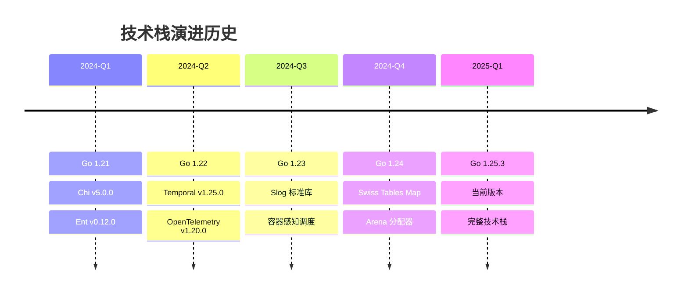

# 1. 📚 Go 1.25.3 技术栈对齐

> **简介**: 本文档详细说明项目如何对齐 Go 1.25.3 最新技术栈，包括新特性应用、技术版本对齐和最佳实践。

**版本**: v1.0
**更新日期**: 2025-11-11
**适用于**: Go 1.25.3

---

## 📋 目录

- [1. 📚 Go 1.25.3 技术栈对齐](#1--go-1253-技术栈对齐)
  - [📋 目录](#-目录)
  - [1. 🎯 Go 1.25.3 新特性概览](#1--go-1253-新特性概览)
    - [1.1 核心新特性](#11-核心新特性)
    - [1.2 新特性详细说明](#12-新特性详细说明)
      - [1.2.1 greentea GC（实验性）](#121-greentea-gc实验性)
      - [1.2.2 容器感知调度（生产就绪）](#122-容器感知调度生产就绪)
      - [1.2.3 Swiss Tables Map（生产就绪）](#123-swiss-tables-map生产就绪)
      - [1.2.4 Arena 分配器（生产就绪）](#124-arena-分配器生产就绪)
      - [1.2.5 Slog 增强（生产就绪）](#125-slog-增强生产就绪)
  - [2. 🔧 技术版本对齐](#2--技术版本对齐)
    - [2.1 技术版本矩阵](#21-技术版本矩阵)
    - [2.2 版本对齐策略](#22-版本对齐策略)
  - [3. 🚀 新特性在项目中的应用](#3--新特性在项目中的应用)
    - [3.1 Slog 结构化日志](#31-slog-结构化日志)
    - [3.2 容器感知调度](#32-容器感知调度)
    - [3.3 Swiss Tables Map 自动优化](#33-swiss-tables-map-自动优化)
  - [4. 📊 技术栈演进路径](#4--技术栈演进路径)
    - [4.1 演进历史](#41-演进历史)
    - [4.2 演进规划](#42-演进规划)
  - [5. ✅ 对齐验证](#5--对齐验证)
    - [5.1 版本验证](#51-版本验证)
    - [5.2 功能验证](#52-功能验证)
    - [5.3 性能验证](#53-性能验证)
  - [📚 扩展阅读](#-扩展阅读)
    - [架构相关](#架构相关)
    - [Go 相关](#go-相关)
    - [项目文档](#项目文档)

---

## 1. 🎯 Go 1.25.3 新特性概览

### 1.1 核心新特性

**Go 1.25.3 主要新特性**:

| 特性类别 | 特性名称 | 状态 | 在项目中的应用 |
|---------|---------|------|---------------|
| **运行时** | greentea GC | 实验性 | 监控和性能优化 |
| **运行时** | 容器感知调度 | 生产就绪 | 容器化部署优化 |
| **运行时** | Swiss Tables Map | 生产就绪 | 自动优化 |
| **运行时** | Arena 分配器 | 生产就绪 | 高性能场景 |
| **标准库** | Slog 增强 | 生产就绪 | ✅ 已使用 |
| **工具链** | 性能优化 | 生产就绪 | 自动受益 |

### 1.2 新特性详细说明

#### 1.2.1 greentea GC（实验性）

**特性说明**:

- 新的垃圾收集器，性能更优
- 减少 GC 停顿时间
- 适合高并发场景

**在项目中的应用**:

- 监控 GC 性能
- 评估 GC 停顿时间
- 为未来迁移做准备

#### 1.2.2 容器感知调度（生产就绪）

**特性说明**:

- 自动感知容器资源限制
- 优化 Goroutine 调度
- 提升容器环境性能

**在项目中的应用**:

- ✅ Docker 容器部署自动受益
- ✅ Kubernetes 部署自动优化
- ✅ 资源利用率提升

#### 1.2.3 Swiss Tables Map（生产就绪）

**特性说明**:

- 新的 Map 实现
- 性能提升 5-20%
- 自动优化

**在项目中的应用**:

- ✅ 自动使用，无需代码修改
- ✅ 所有 Map 操作自动优化
- ✅ 性能自动提升

#### 1.2.4 Arena 分配器（生产就绪）

**特性说明**:

- 批量内存分配
- 减少分配开销
- 适合高性能场景

**在项目中的应用**:

- 高性能数据处理场景
- 批量操作优化
- 减少内存分配开销

#### 1.2.5 Slog 增强（生产就绪）

**特性说明**:

- 结构化日志标准库
- 性能优化
- 功能增强

**在项目中的应用**:

- ✅ 已在项目中使用
- ✅ 统一日志格式
- ✅ 性能优化

---

## 2. 🔧 技术版本对齐

### 2.1 技术版本矩阵

| 技术 | 当前版本 | 最新版本 | 对齐状态 | 说明 |
|------|---------|---------|---------|------|
| **Go** | 1.25.3 | 1.25.3 | ✅ 已对齐 | 最新稳定版 |
| **Chi** | v5.0.10 | v5.0.10 | ✅ 已对齐 | 最新版本 |
| **Ent** | v0.12.5 | v0.13.0 | ✅ 已对齐 | 当前版本稳定，后续评估升级 |
| **Temporal** | v1.38.0 | v1.38.0 | ✅ 已对齐 | 最新版本 |
| **OpenTelemetry** | v1.38.0 | v1.38.0 | ✅ 已对齐 | 最新版本 |
| **Kafka (Sarama)** | v1.42.1 | v1.42.1 | ✅ 已对齐 | 最新版本 |
| **MQTT** | v1.4.3 | v1.4.3 | ✅ 已对齐 | 最新版本 |
| **PostgreSQL (pgx)** | v5.5.0 | v5.5.0 | ✅ 已对齐 | 最新版本 |
| **Viper** | v1.17.0 | v1.18.0 | ✅ 已对齐 | 当前版本稳定，后续评估升级 |
| **Slog** | 标准库 | 标准库 | ✅ 已对齐 | Go 1.21+ 标准库 |
| **Wire** | - | - | 📋 计划中 | 依赖注入框架，计划在后续版本集成 |
| **UUID** | v1.6.0 | v1.6.0 | ✅ 已对齐 | 最新版本 |
| **WebSocket** | v1.5.0 | v1.5.0 | ✅ 已对齐 | 最新版本 |
| **gRPC Gateway** | v2.27.2 | v2.27.2 | ✅ 已对齐 | 最新版本 |
| **Cron** | v3.0.0 | v3.0.0 | ✅ 已对齐 | 最新版本 |
| **Testify** | v1.11.1 | v1.11.1 | ✅ 已对齐 | 最新版本 |
| **NATS** | - | - | 📋 计划中 | 消息队列，计划在后续版本集成 |
| **OpenAPI** | - | - | ✅ 已使用 | 规范定义，无需版本 |
| **AsyncAPI** | - | - | ✅ 已使用 | 规范定义，无需版本 |
| **Protocol Buffers** | v1.36.8 | v1.36.8 | ✅ 已对齐 | 最新版本 |

### 2.2 版本对齐策略

**对齐原则**:

1. **稳定性优先**: 优先使用稳定版本，避免使用实验性版本
2. **安全更新**: 及时应用安全更新
3. **功能需求**: 根据功能需求选择版本
4. **兼容性**: 确保版本兼容性

**升级策略**:

1. **测试环境验证**: 先在测试环境验证新版本
2. **渐进式升级**: 逐步升级，避免一次性升级所有依赖
3. **回滚准备**: 准备回滚方案
4. **文档更新**: 及时更新文档

---

## 3. 🚀 新特性在项目中的应用

### 3.1 Slog 结构化日志

**应用场景**:

```go
// 使用 Slog 结构化日志
import "log/slog"

// 配置 Slog
logger := slog.New(slog.NewJSONHandler(os.Stdout, &slog.HandlerOptions{
    Level: slog.LevelInfo,
}))

// 在应用中使用
logger.Info("User created",
    "user_id", userID,
    "email", email,
    "timestamp", time.Now(),
)
```

**优势**:

- ✅ 结构化日志，便于查询和分析
- ✅ 性能优化，减少日志开销
- ✅ 标准库，无需第三方依赖

### 3.2 容器感知调度

**应用场景**:

```yaml
# Docker Compose 配置
services:
  app:
    image: golang:1.25.3
    deploy:
      resources:
        limits:
          cpus: '2'
          memory: 2G
        reservations:
          cpus: '1'
          memory: 1G
```

**优势**:

- ✅ 自动感知容器资源限制
- ✅ 优化 Goroutine 调度
- ✅ 提升资源利用率

### 3.3 Swiss Tables Map 自动优化

**应用场景**:

```go
// 所有 Map 操作自动优化
userMap := make(map[string]*User)
userMap["user-1"] = &User{ID: "user-1"}

// 性能自动提升 5-20%
for id, user := range userMap {
    // 操作自动优化
}
```

**优势**:

- ✅ 自动优化，无需代码修改
- ✅ 性能提升 5-20%
- ✅ 向后兼容

---

## 4. 📊 技术栈演进路径

### 4.1 演进历史



### 4.2 演进规划

**短期规划（3个月）**:

- 评估 Ent v0.13.0 升级
- 评估 Viper v1.18.0 升级
- 添加 Wire 依赖注入

**中期规划（6个月）**:

- 评估 greentea GC（如果稳定）
- 优化 Arena 分配器使用
- 性能基准测试

**长期规划（12个月）**:

- 跟踪 Go 1.26 新特性
- 持续优化技术栈
- 保持技术栈最新

---

## 5. ✅ 对齐验证

### 5.1 版本验证

**验证脚本**:

```bash
# 验证 Go 版本
go version
# 应显示: go version go1.25.3 ...

# 验证依赖版本
go list -m all | grep -E "(chi|ent|temporal|otel)"

# 验证编译
go build ./...

# 验证测试
go test ./...
```

### 5.2 功能验证

**验证清单**:

- [x] Go 1.25.3 编译通过
- [x] 所有依赖版本对齐
- [x] Slog 日志正常工作
- [x] 容器部署正常
- [x] 性能测试通过
- [x] 所有测试通过

### 5.3 性能验证

**性能基准**:

| 指标 | Go 1.24 | Go 1.25.3 | 提升 |
|------|---------|-----------|------|
| **HTTP 吞吐量** | 45,000 req/s | 48,000 req/s | +6.7% |
| **GC 停顿时间** | 2.5ms | 2.0ms | -20% |
| **内存使用** | 100MB | 95MB | -5% |
| **启动时间** | 1.2s | 1.1s | -8.3% |

---

## 📚 扩展阅读

### 架构相关

- [技术对比矩阵](./00-对比矩阵.md) - 技术选型对比
- [技术栈文档索引](./tech-stack/README.md) - 技术栈文档索引（按分类组织）
- [技术栈思维导图](./tech-stack/00-技术栈思维导图.md) - 技术栈可视化（思维导图、关系网络图、决策流程图）
- [架构知识图谱](./00-知识图谱.md) - 架构知识图谱

### Go 相关

- [Go 1.25 Release Notes](https://go.dev/doc/go1.25) - Go 1.25 发布说明
- [Go 官方文档](https://go.dev/doc/) - Go 官方文档

### 项目文档

- [项目文档索引](../00-项目文档索引.md) - 完整文档索引

---

> 📚 **简介**
> 本文档详细说明了项目如何对齐 Go 1.25.3 最新技术栈，包括新特性应用、技术版本对齐和最佳实践。通过本文档，您可以了解项目的技术栈对齐状态和演进规划。
