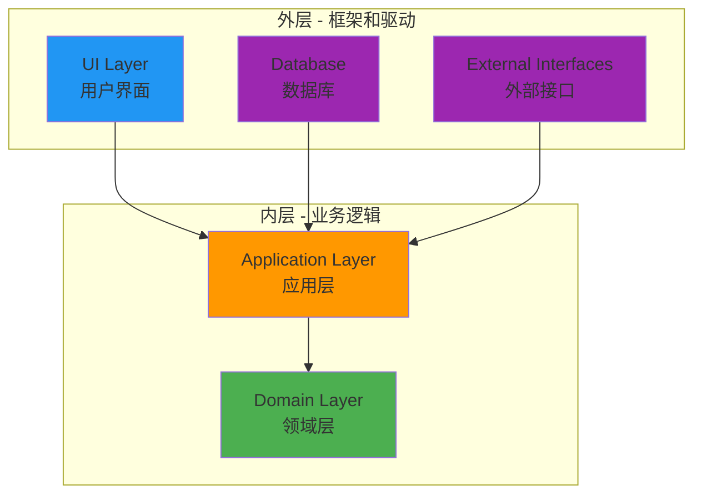
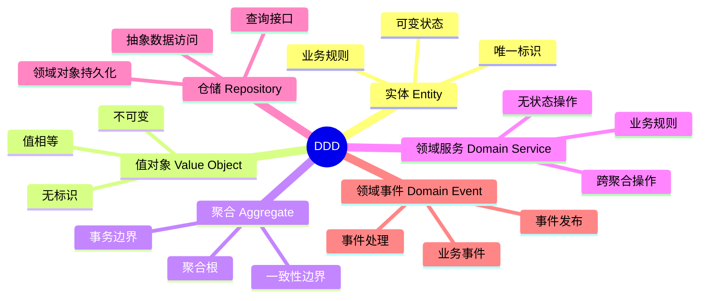

# 项目架构概念定义体系

> **简介**: 本项目架构相关的核心概念定义体系，通过详细的概念解释、设计原理论证和实际应用说明，建立统一的术语体系和知识基础。

**版本**: v1.0
**更新日期**: 2025-11-11
**适用于**: Go 1.25.3

---

## 📋 目录

- [项目架构概念定义体系](#项目架构概念定义体系)
  - [📋 目录](#-目录)
  - [1. 🏗️ 架构概念深度解析](#1-️-架构概念深度解析)
    - [1.1 Clean Architecture（整洁架构）](#11-clean-architecture整洁架构)
      - [1.1.1 定义与核心思想](#111-定义与核心思想)
      - [1.1.2 架构层次结构](#112-架构层次结构)
      - [1.1.3 依赖规则论证](#113-依赖规则论证)
      - [1.1.4 在本项目中的应用](#114-在本项目中的应用)
    - [1.2 Domain-Driven Design (DDD)](#12-domain-driven-design-ddd)
      - [1.2.1 定义与核心思想](#121-定义与核心思想)
      - [1.2.2 DDD 核心概念](#122-ddd-核心概念)
      - [1.2.3 在本项目中的应用](#123-在本项目中的应用)
    - [1.3 依赖倒置原则 (DIP)](#13-依赖倒置原则-dip)
      - [1.3.1 定义与原理](#131-定义与原理)
      - [1.3.2 依赖倒置实现](#132-依赖倒置实现)
    - [1.4 关注点分离 (SoC)](#14-关注点分离-soc)
      - [1.4.1 定义与原理](#141-定义与原理)
      - [1.4.2 在本项目中的应用](#142-在本项目中的应用)
  - [2. 📦 层次概念深度解析](#2--层次概念深度解析)
    - [2.1 Domain Layer（领域层）](#21-domain-layer领域层)
      - [2.1.1 定义与职责](#211-定义与职责)
      - [2.1.2 设计原则论证](#212-设计原则论证)
      - [2.1.3 领域模型设计原则](#213-领域模型设计原则)
    - [2.2 Application Layer（应用层）](#22-application-layer应用层)
      - [2.2.1 定义与职责](#221-定义与职责)
      - [2.2.2 设计原则论证](#222-设计原则论证)
      - [2.2.3 用例编排模式](#223-用例编排模式)
    - [2.3 Infrastructure Layer（基础设施层）](#23-infrastructure-layer基础设施层)
      - [2.3.1 定义与职责](#231-定义与职责)
      - [2.3.2 设计原则论证](#232-设计原则论证)
      - [2.3.3 技术实现模式](#233-技术实现模式)
    - [2.4 Interfaces Layer（接口层）](#24-interfaces-layer接口层)
      - [2.4.1 定义与职责](#241-定义与职责)
      - [2.4.2 设计原则论证](#242-设计原则论证)
      - [2.4.3 协议适配模式](#243-协议适配模式)
  - [3. 🔧 技术概念深度解析](#3--技术概念深度解析)
    - [3.1 Temporal Workflow（工作流）](#31-temporal-workflow工作流)
      - [3.1.1 定义与核心特性](#311-定义与核心特性)
      - [3.1.2 确定性执行原理](#312-确定性执行原理)
      - [3.1.3 在本项目中的应用](#313-在本项目中的应用)
    - [3.2 Temporal Activity（活动）](#32-temporal-activity活动)
      - [3.2.1 定义与核心特性](#321-定义与核心特性)
      - [3.2.2 活动设计原则](#322-活动设计原则)
      - [3.2.3 在本项目中的应用](#323-在本项目中的应用)
    - [3.3 Ent ORM](#33-ent-orm)
      - [3.3.1 定义与核心特性](#331-定义与核心特性)
      - [3.3.2 类型安全优势论证](#332-类型安全优势论证)
      - [3.3.3 在本项目中的应用](#333-在本项目中的应用)
    - [3.4 OpenTelemetry（可观测性）](#34-opentelemetry可观测性)
      - [3.4.1 定义与核心特性](#341-定义与核心特性)
      - [3.4.2 三大支柱说明](#342-三大支柱说明)
      - [3.4.3 在本项目中的应用](#343-在本项目中的应用)
  - [4. 🔄 模式概念深度解析](#4--模式概念深度解析)
    - [4.1 Repository Pattern（仓储模式）](#41-repository-pattern仓储模式)
      - [4.1.1 定义与核心思想](#411-定义与核心思想)
      - [4.1.2 模式结构论证](#412-模式结构论证)
      - [4.1.3 在本项目中的应用](#413-在本项目中的应用)
    - [4.2 Service Pattern（服务模式）](#42-service-pattern服务模式)
      - [4.2.1 定义与核心思想](#421-定义与核心思想)
      - [4.2.2 模式结构论证](#422-模式结构论证)
      - [4.2.3 在本项目中的应用](#423-在本项目中的应用)
    - [4.3 DTO Pattern（数据传输对象模式）](#43-dto-pattern数据传输对象模式)
      - [4.3.1 定义与核心思想](#431-定义与核心思想)
      - [4.3.2 模式结构论证](#432-模式结构论证)
      - [4.3.3 在本项目中的应用](#433-在本项目中的应用)
    - [4.4 Dependency Injection（依赖注入）](#44-dependency-injection依赖注入)
      - [4.4.1 定义与核心思想](#441-定义与核心思想)
      - [4.4.2 模式结构论证](#442-模式结构论证)
      - [4.4.3 在本项目中的应用](#443-在本项目中的应用)
  - [5. 🎯 设计原则深度解析](#5--设计原则深度解析)
    - [5.1 SOLID 原则](#51-solid-原则)
      - [5.1.1 单一职责原则 (SRP)](#511-单一职责原则-srp)
      - [5.1.2 开闭原则 (OCP)](#512-开闭原则-ocp)
      - [5.1.3 里氏替换原则 (LSP)](#513-里氏替换原则-lsp)
      - [5.1.4 接口隔离原则 (ISP)](#514-接口隔离原则-isp)
      - [5.1.5 依赖倒置原则 (DIP)](#515-依赖倒置原则-dip)
    - [5.2 DRY 原则](#52-dry-原则)
    - [5.3 KISS 原则](#53-kiss-原则)
    - [5.4 YAGNI 原则](#54-yagni-原则)
  - [6. 📚 扩展阅读](#6--扩展阅读)
    - [架构相关](#架构相关)
    - [项目文档](#项目文档)

---

## 1. 🏗️ 架构概念深度解析

### 1.1 Clean Architecture（整洁架构）

#### 1.1.1 定义与核心思想

**定义**: Clean Architecture 是由 Robert C. Martin (Uncle Bob) 提出的一种软件架构设计方法，通过分层和依赖规则，将系统分为多个同心圆层次，确保业务逻辑与技术实现分离。

**核心思想**:

- **独立性**: 业务逻辑独立于框架、UI、数据库等外部因素
- **可测试性**: 业务逻辑可以在没有 UI、数据库、Web 服务器的情况下测试
- **独立性**: UI 可以轻松替换，不改变业务逻辑
- **独立性**: 数据库可以轻松替换，不改变业务逻辑
- **独立性**: 业务逻辑不依赖任何外部库

#### 1.1.2 架构层次结构



**层次说明**:

1. **Domain Layer（领域层）** - 最内层
   - 包含业务实体和业务规则
   - 不依赖任何外部因素
   - 最稳定，变化最少

2. **Application Layer（应用层）** - 次内层
   - 包含用例和业务逻辑编排
   - 只依赖 Domain Layer
   - 相对稳定

3. **Infrastructure Layer（基础设施层）** - 外层
   - 包含技术实现细节
   - 实现 Domain Layer 定义的接口
   - 可以频繁变化

4. **Interfaces Layer（接口层）** - 最外层
   - 包含用户界面和外部接口
   - 适配外部协议和格式
   - 可以频繁变化

#### 1.1.3 依赖规则论证

**依赖规则**: 源代码依赖只能指向内层，内层不能依赖外层。

**为什么需要这个规则？**

1. **业务逻辑独立性**:
   - 业务逻辑是系统的核心价值
   - 业务逻辑应该独立于技术实现
   - 技术实现可以变化，但业务逻辑应该稳定

2. **可测试性**:
   - 内层不依赖外层，可以独立测试
   - 可以使用 Mock 对象测试
   - 不需要真实的数据库、网络等

3. **可替换性**:
   - 可以轻松替换技术实现
   - 可以轻松替换用户界面
   - 可以轻松替换数据库

**实际应用示例**:

```go
// ✅ 正确：Application 依赖 Domain 接口
type Service struct {
    repo domain.UserRepository  // 依赖接口
}

// ❌ 错误：Application 依赖 Infrastructure 实现
type Service struct {
    repo *ent.UserRepository  // 依赖具体实现
}
```

#### 1.1.4 在本项目中的应用

**四层架构实现**:

1. **Domain Layer** (`internal/domain/`):
   - 定义 User 实体
   - 定义 Repository 接口
   - 定义领域错误

2. **Application Layer** (`internal/application/`):
   - 实现 User Service
   - 定义 User Workflow
   - 定义 User Activities

3. **Infrastructure Layer** (`internal/infrastructure/`):
   - 实现 Ent Repository
   - 实现 Temporal Client
   - 实现 OpenTelemetry 集成

4. **Interfaces Layer** (`internal/interfaces/`):
   - 实现 HTTP Handlers
   - 实现 Workflow Handlers
   - 处理请求/响应转换

**优势体现**:

- ✅ **业务逻辑独立**: User 实体不依赖 Ent 或 PostgreSQL
- ✅ **可测试性**: 可以 Mock Repository 测试 Service
- ✅ **可替换性**: 可以轻松替换 Ent 为 GORM
- ✅ **可扩展性**: 可以轻松添加新的接口协议

---

### 1.2 Domain-Driven Design (DDD)

#### 1.2.1 定义与核心思想

**定义**: Domain-Driven Design (DDD) 是由 Eric Evans 提出的一种软件开发方法，通过领域模型来表达业务逻辑，将复杂的业务领域分解为多个有界上下文（Bounded Context）。

**核心思想**:

- **领域模型**: 使用领域模型表达业务逻辑
- **通用语言**: 开发团队和业务专家使用相同的语言
- **有界上下文**: 将大系统分解为多个有界上下文
- **领域专家**: 领域专家参与设计过程

#### 1.2.2 DDD 核心概念



**核心概念说明**:

1. **实体 (Entity)**:
   - 有唯一标识的对象
   - 状态可以变化
   - 通过标识判断相等性
   - 示例: User (通过 ID 标识)

2. **值对象 (Value Object)**:
   - 没有唯一标识的对象
   - 状态不可变
   - 通过值判断相等性
   - 示例: Email, Address

3. **聚合 (Aggregate)**:
   - 一组相关对象的集合
   - 有聚合根（Aggregate Root）
   - 保证一致性边界
   - 示例: User 聚合（User 是聚合根）

4. **领域服务 (Domain Service)**:
   - 无状态的服务
   - 处理跨聚合的操作
   - 封装业务规则
   - 示例: EmailValidationService

5. **仓储 (Repository)**:
   - 抽象数据访问
   - 提供领域对象持久化接口
   - 隐藏数据访问细节
   - 示例: UserRepository

6. **领域事件 (Domain Event)**:
   - 表示业务中发生的重要事件
   - 用于解耦和异步处理
   - 示例: UserCreatedEvent

#### 1.2.3 在本项目中的应用

**User 领域模型**:

```go
// 实体 (Entity)
type User struct {
    ID        string    // 唯一标识
    Email     string    // 值对象（可以提取为 Email 值对象）
    Name      string
    CreatedAt time.Time
    UpdatedAt time.Time
}

// 仓储接口 (Repository)
type Repository interface {
    Create(ctx context.Context, user *User) error
    FindByID(ctx context.Context, id string) (*User, error)
    FindByEmail(ctx context.Context, email string) (*User, error)
    Update(ctx context.Context, user *User) error
    Delete(ctx context.Context, id string) error
    List(ctx context.Context, limit, offset int) ([]*User, error)
}

// 领域错误 (Domain Errors)
var (
    ErrUserNotFound      = errors.New("user not found")
    ErrUserAlreadyExists = errors.New("user already exists")
    ErrInvalidEmail      = errors.New("invalid email")
)
```

**DDD 优势体现**:

- ✅ **业务表达**: 代码直接表达业务概念
- ✅ **通用语言**: 使用业务术语命名
- ✅ **领域隔离**: 领域逻辑与技术实现分离
- ✅ **易于理解**: 业务专家可以理解代码

---

### 1.3 依赖倒置原则 (DIP)

#### 1.3.1 定义与原理

**定义**: 依赖倒置原则 (Dependency Inversion Principle, DIP) 是 SOLID 原则之一，规定：

- 高层模块不应该依赖低层模块，两者都应该依赖抽象
- 抽象不应该依赖细节，细节应该依赖抽象

**传统依赖**:

```text
高层模块 → 低层模块
```

- 问题: 高层模块直接依赖低层模块
- 结果: 难以替换低层模块实现

**依赖倒置**:

```text
高层模块 → 抽象接口 ← 低层模块
```

- 优势: 高层模块依赖抽象，低层模块实现抽象
- 结果: 可以轻松替换低层模块实现

#### 1.3.2 依赖倒置实现

**在本项目中的应用**:

```go
// Domain Layer: 定义抽象接口
type UserRepository interface {
    Create(ctx context.Context, user *User) error
    FindByID(ctx context.Context, id string) (*User, error)
}

// Application Layer: 依赖抽象接口
type UserService struct {
    repo domain.UserRepository  // 依赖接口，不依赖具体实现
}

func (s *UserService) CreateUser(ctx context.Context, req CreateUserRequest) (*UserDTO, error) {
    // 使用接口，不关心具体实现
    user := &domain.User{
        Email: req.Email,
        Name:  req.Name,
    }
    return s.repo.Create(ctx, user)
}

// Infrastructure Layer: 实现抽象接口
type EntUserRepository struct {
    client *ent.Client
}

func (r *EntUserRepository) Create(ctx context.Context, user *domain.User) error {
    // 实现接口
    _, err := r.client.User.Create().
        SetEmail(user.Email).
        SetName(user.Name).
        Save(ctx)
    return err
}
```

**依赖倒置优势论证**:

1. **可测试性**:
   - 可以使用 Mock Repository 测试 Service
   - 不需要真实的数据库
   - 测试速度快，隔离性好

2. **可替换性**:
   - 可以轻松替换 Repository 实现
   - 从 Ent 切换到 GORM
   - 从 PostgreSQL 切换到 MySQL

3. **可扩展性**:
   - 可以添加新的 Repository 实现
   - 可以添加缓存层
   - 可以添加分库分表

---

### 1.4 关注点分离 (SoC)

#### 1.4.1 定义与原理

**定义**: 关注点分离 (Separation of Concerns, SoC) 是一种设计原则，将系统分解为不同的部分，每个部分处理一个特定的关注点。

**核心思想**:

- 每个模块只负责一个关注点
- 不同关注点之间解耦
- 便于理解、维护和测试

#### 1.4.2 在本项目中的应用

**关注点分离示例**:

| 关注点 | 负责层次 | 示例 |
|--------|---------|------|
| **协议适配** | Interfaces Layer | HTTP Handler, gRPC Service |
| **用例编排** | Application Layer | User Service, Workflow |
| **业务逻辑** | Domain Layer | User Entity, Business Rules |
| **数据访问** | Infrastructure Layer | Ent Repository, Database |
| **可观测性** | Infrastructure Layer | OpenTelemetry, Logging |

**关注点分离优势论证**:

1. **职责清晰**:
   - 每个层次职责明确
   - 不会出现职责混乱
   - 便于团队协作

2. **易于维护**:
   - 修改一个关注点不影响其他关注点
   - 代码结构清晰
   - 便于定位问题

3. **易于测试**:
   - 可以独立测试每个关注点
   - 测试范围明确
   - 测试用例清晰

---

## 2. 📦 层次概念深度解析

### 2.1 Domain Layer（领域层）

#### 2.1.1 定义与职责

**定义**: Domain Layer 是 Clean Architecture 的核心层，包含业务实体、业务规则和领域逻辑，不依赖任何外部框架或技术实现。

**核心职责**:

1. **定义领域实体**: 表达业务概念和业务对象
2. **定义业务规则**: 封装业务逻辑和业务规则
3. **定义接口**: 定义数据访问和外部服务接口
4. **定义领域错误**: 定义业务相关的错误类型

#### 2.1.2 设计原则论证

**为什么 Domain Layer 不依赖其他层？**

1. **业务逻辑独立性**:
   - 业务逻辑是系统的核心价值
   - 业务逻辑应该独立于技术实现
   - 技术实现可以变化，但业务逻辑应该稳定

2. **可测试性**:
   - 不依赖外部框架，可以独立测试
   - 可以使用简单的单元测试
   - 测试速度快，隔离性好

3. **可移植性**:
   - 可以轻松移植到其他技术栈
   - 可以轻松替换技术实现
   - 业务逻辑不受技术限制

**实际应用示例**:

```go
// Domain Layer: 只包含业务逻辑，不依赖任何外部库
package domain

import (
    "context"
    "errors"
    "time"
)

// 领域实体
type User struct {
    ID        string
    Email     string
    Name      string
    CreatedAt time.Time
    UpdatedAt time.Time
}

// 业务规则：验证邮箱格式
func (u *User) ValidateEmail() error {
    if !isValidEmail(u.Email) {
        return ErrInvalidEmail
    }
    return nil
}

// 业务规则：验证用户名称
func (u *User) ValidateName() error {
    if len(u.Name) < 2 || len(u.Name) > 50 {
        return ErrInvalidName
    }
    return nil
}

// 仓储接口：定义在领域层
type Repository interface {
    Create(ctx context.Context, user *User) error
    FindByID(ctx context.Context, id string) (*User, error)
    FindByEmail(ctx context.Context, email string) (*User, error)
    Update(ctx context.Context, user *User) error
    Delete(ctx context.Context, id string) error
    List(ctx context.Context, limit, offset int) ([]*User, error)
}

// 领域错误：定义在领域层
var (
    ErrUserNotFound      = errors.New("user not found")
    ErrUserAlreadyExists = errors.New("user already exists")
    ErrInvalidEmail      = errors.New("invalid email")
    ErrInvalidName       = errors.New("invalid name")
)
```

#### 2.1.3 领域模型设计原则

**实体设计原则**:

1. **唯一标识**:
   - 每个实体必须有唯一标识
   - 通过标识判断相等性
   - 标识不可变

2. **业务规则封装**:
   - 业务规则封装在实体中
   - 实体负责自己的有效性
   - 避免贫血模型

3. **不可变值对象**:
   - 值对象应该是不可变的
   - 通过值判断相等性
   - 可以提取为独立的值对象

**接口设计原则**:

1. **接口定义在领域层**:
   - 接口表达业务需求
   - 不包含技术细节
   - 稳定，不轻易变化

2. **接口粒度适中**:
   - 不要过于细粒度
   - 不要过于粗粒度
   - 平衡灵活性和复杂度

---

### 2.2 Application Layer（应用层）

#### 2.2.1 定义与职责

**定义**: Application Layer 是 Clean Architecture 的应用层，负责用例编排、业务协调和 DTO 转换，只依赖 Domain Layer。

**核心职责**:

1. **用例编排**: 协调多个领域对象完成复杂用例
2. **业务协调**: 协调不同领域服务
3. **DTO 转换**: 在领域模型和外部接口之间转换
4. **事务管理**: 管理事务边界
5. **工作流定义**: 定义业务流程（Temporal Workflows）

#### 2.2.2 设计原则论证

**为什么 Application Layer 只依赖 Domain Layer？**

1. **业务逻辑隔离**:
   - 应用层不包含业务逻辑
   - 业务逻辑在领域层
   - 应用层只负责编排

2. **技术实现隔离**:
   - 应用层不依赖技术实现
   - 技术实现在基础设施层
   - 可以轻松替换技术实现

3. **可测试性**:
   - 可以 Mock 领域层接口
   - 可以独立测试用例
   - 测试范围明确

**实际应用示例**:

```go
// Application Layer: 用例编排，不包含业务逻辑
package application

import (
    "context"
    "time"

    "github.com/yourusername/golang/internal/domain/user"
)

// 应用服务：编排用例
type UserService struct {
    repo user.Repository  // 只依赖领域层接口
}

// 创建用户用例
func (s *UserService) CreateUser(ctx context.Context, req CreateUserRequest) (*UserDTO, error) {
    // 1. 验证参数（可以委托给领域层）
    if err := validateCreateRequest(req); err != nil {
        return nil, err
    }

    // 2. 检查用户是否已存在（业务规则）
    existing, err := s.repo.FindByEmail(ctx, req.Email)
    if err == nil && existing != nil {
        return nil, user.ErrUserAlreadyExists
    }

    // 3. 创建领域实体
    domainUser := &user.User{
        Email: req.Email,
        Name:  req.Name,
    }

    // 4. 验证领域实体（业务规则在领域层）
    if err := domainUser.ValidateEmail(); err != nil {
        return nil, err
    }
    if err := domainUser.ValidateName(); err != nil {
        return nil, err
    }

    // 5. 持久化（通过领域层接口）
    if err := s.repo.Create(ctx, domainUser); err != nil {
        return nil, err
    }

    // 6. 转换为 DTO（应用层职责）
    return toUserDTO(domainUser), nil
}

// DTO 定义（应用层）
type CreateUserRequest struct {
    Email string `json:"email"`
    Name  string `json:"name"`
}

type UserDTO struct {
    ID        string    `json:"id"`
    Email     string    `json:"email"`
    Name      string    `json:"name"`
    CreatedAt time.Time `json:"created_at"`
    UpdatedAt time.Time `json:"updated_at"`
}

// DTO 转换（应用层职责）
func toUserDTO(u *user.User) *UserDTO {
    return &UserDTO{
        ID:        u.ID,
        Email:     u.Email,
        Name:      u.Name,
        CreatedAt: u.CreatedAt,
        UpdatedAt: u.UpdatedAt,
    }
}
```

#### 2.2.3 用例编排模式

**简单用例**:

- 单个领域对象操作
- 直接调用 Repository
- 示例: 查询用户

**复杂用例**:

- 多个领域对象协调
- 多个 Repository 操作
- 事务管理
- 示例: 创建用户并发送通知

**工作流用例**:

- 长时间运行的业务流程
- 多个步骤协调
- 状态管理
- 示例: 用户注册工作流

---

### 2.3 Infrastructure Layer（基础设施层）

#### 2.3.1 定义与职责

**定义**: Infrastructure Layer 是 Clean Architecture 的基础设施层，负责技术实现细节、外部服务集成和数据访问，实现 Domain Layer 定义的接口。

**核心职责**:

1. **实现仓储接口**: 实现 Domain Layer 定义的 Repository 接口
2. **数据库访问**: 使用 ORM 或数据库驱动访问数据库
3. **外部服务集成**: 集成外部服务（如 Temporal, OpenTelemetry）
4. **技术实现**: 实现技术相关的功能（如日志、配置）

#### 2.3.2 设计原则论证

**为什么 Infrastructure Layer 实现 Domain 接口？**

1. **接口定义在领域层**:
   - 接口表达业务需求
   - 不包含技术细节
   - 稳定，不轻易变化

2. **实现在基础设施层**:
   - 实现包含技术细节
   - 可以使用外部库
   - 可以频繁变化

3. **依赖倒置**:
   - 基础设施层依赖领域层接口
   - 领域层不依赖基础设施层
   - 符合依赖倒置原则

**实际应用示例**:

```go
// Infrastructure Layer: 实现领域层接口
package infrastructure

import (
    "context"
    "fmt"

    "entgo.io/ent/dialect/sql"
    "github.com/google/uuid"

    "github.com/yourusername/golang/internal/domain/user"
    "github.com/yourusername/golang/internal/infrastructure/database/ent"
    entuser "github.com/yourusername/golang/internal/infrastructure/database/ent/user"
)

// 实现领域层 Repository 接口
type UserRepository struct {
    client *ent.Client
}

// 确保实现了接口
var _ user.Repository = (*UserRepository)(nil)

// 创建用户（实现接口）
func (r *UserRepository) Create(ctx context.Context, u *user.User) error {
    id := uuid.New().String()
    entUser, err := r.client.User.
        Create().
        SetID(id).
        SetEmail(u.Email).
        SetName(u.Name).
        Save(ctx)
    if err != nil {
        return fmt.Errorf("failed to create user: %w", err)
    }

    // 更新领域对象
    u.ID = entUser.ID
    u.CreatedAt = entUser.CreatedAt
    u.UpdatedAt = entUser.UpdatedAt
    return nil
}

// 其他方法实现...
```

#### 2.3.3 技术实现模式

**数据访问模式**:

- 使用 ORM（Ent）访问数据库
- 实现 Repository 接口
- 处理数据转换

**外部服务集成模式**:

- 封装外部服务客户端
- 提供统一的接口
- 处理错误和重试

**配置管理模式**:

- 使用 Viper 加载配置
- 提供配置接口
- 支持环境变量

---

### 2.4 Interfaces Layer（接口层）

#### 2.4.1 定义与职责

**定义**: Interfaces Layer 是 Clean Architecture 的接口层，负责外部接口适配、请求处理和响应格式化，调用 Application Layer。

**核心职责**:

1. **协议适配**: 适配不同的外部协议（HTTP, gRPC, GraphQL）
2. **请求处理**: 接收和处理外部请求
3. **响应格式化**: 格式化响应数据
4. **参数验证**: 验证请求参数
5. **错误处理**: 处理错误并格式化错误响应

#### 2.4.2 设计原则论证

**为什么 Interfaces Layer 调用 Application Layer？**

1. **协议隔离**:
   - 接口层隔离协议变化
   - 应用层不关心协议细节
   - 可以轻松添加新协议

2. **职责分离**:
   - 接口层负责协议处理
   - 应用层负责业务编排
   - 职责清晰

3. **可测试性**:
   - 可以 Mock 应用层服务
   - 可以独立测试接口层
   - 测试范围明确

**实际应用示例**:

```go
// Interfaces Layer: 协议适配，调用应用层
package handlers

import (
    "encoding/json"
    "net/http"

    "github.com/go-chi/chi/v5"
    appuser "github.com/yourusername/golang/internal/application/user"
    "github.com/yourusername/golang/pkg/errors"
)

// HTTP Handler：处理 HTTP 请求
type UserHandler struct {
    service appuser.Service  // 调用应用层服务
}

// 创建用户（HTTP 接口）
func (h *UserHandler) CreateUser(w http.ResponseWriter, r *http.Request) {
    // 1. 解析请求（接口层职责）
    var req appuser.CreateUserRequest
    if err := json.NewDecoder(r.Body).Decode(&req); err != nil {
        Error(w, http.StatusBadRequest, errors.NewInvalidInputError("Invalid request body"))
        return
    }

    // 2. 调用应用层服务（接口层职责）
    user, err := h.service.CreateUser(r.Context(), req)
    if err != nil {
        // 3. 处理错误（接口层职责）
        if appErr, ok := err.(*errors.AppError); ok && appErr.Code == errors.ErrCodeConflict {
            Error(w, http.StatusConflict, err)
        } else {
            Error(w, http.StatusInternalServerError, err)
        }
        return
    }

    // 4. 格式化响应（接口层职责）
    Success(w, http.StatusCreated, user)
}
```

#### 2.4.3 协议适配模式

**HTTP 适配**:

- 使用 Chi Router
- 处理 HTTP 请求/响应
- 中间件处理

**gRPC 适配**:

- 使用 Protocol Buffers
- 处理 gRPC 请求/响应
- 错误处理

**GraphQL 适配**:

- 使用 GraphQL Schema
- 处理 GraphQL 查询/变更
- 解析器实现

---

## 3. 🔧 技术概念深度解析

### 3.1 Temporal Workflow（工作流）

#### 3.1.1 定义与核心特性

**定义**: Temporal Workflow 是使用 Temporal 定义的可恢复、可查询的业务流程，通过工作流函数表达业务逻辑的编排。

**核心特性**:

1. **确定性执行**: 工作流函数必须是确定性的
2. **自动持久化**: 工作流状态自动持久化
3. **可恢复性**: 支持故障恢复和重试
4. **可查询性**: 可以查询工作流状态
5. **信号支持**: 支持外部信号触发

#### 3.1.2 确定性执行原理

**为什么工作流必须是确定性的？**

1. **状态恢复**:
   - Temporal 通过重放工作流历史恢复状态
   - 如果工作流不确定，重放结果不一致
   - 确定性保证状态恢复正确

2. **幂等性**:
   - 工作流可以多次执行
   - 确定性保证结果一致
   - 支持故障恢复

**确定性要求**:

```go
// ✅ 正确：使用工作流 API
func UserWorkflow(ctx workflow.Context, input UserWorkflowInput) (UserWorkflowOutput, error) {
    // 使用 workflow.Now() 而不是 time.Now()
    now := workflow.Now(ctx)

    // 使用 workflow.ExecuteActivity() 而不是直接调用
    result := workflow.ExecuteActivity(ctx, Activity, input)

    // 使用 workflow.Sleep() 而不是 time.Sleep()
    workflow.Sleep(ctx, 1*time.Minute)

    return output, nil
}

// ❌ 错误：使用非确定性操作
func UserWorkflow(ctx workflow.Context, input UserWorkflowInput) (UserWorkflowOutput, error) {
    // ❌ 不能使用 time.Now()
    now := time.Now()

    // ❌ 不能使用随机数
    id := rand.Int()

    // ❌ 不能直接调用外部服务
    result := callExternalAPI()

    return output, nil
}
```

#### 3.1.3 在本项目中的应用

**UserWorkflow 实现**:

```go
// Application Layer: 工作流定义
func UserWorkflow(ctx workflow.Context, input UserWorkflowInput) (UserWorkflowOutput, error) {
    // 1. 配置活动选项
    ao := workflow.ActivityOptions{
        StartToCloseTimeout: 30 * time.Second,
        RetryPolicy: &temporal.RetryPolicy{
            InitialInterval:    time.Second,
            BackoffCoefficient: 2.0,
            MaximumInterval:    time.Minute,
            MaximumAttempts:    3,
        },
    }
    ctx = workflow.WithActivityOptions(ctx, ao)

    // 2. 根据操作类型执行不同流程
    switch input.Action {
    case "create":
        return createUserWorkflow(ctx, input)
    case "update":
        return updateUserWorkflow(ctx, input)
    case "delete":
        return deleteUserWorkflow(ctx, input)
    default:
        return UserWorkflowOutput{
            Success: false,
            Message: "unknown action",
        }, fmt.Errorf("unknown action: %s", input.Action)
    }
}
```

**工作流优势论证**:

1. **可靠性**:
   - 自动持久化状态
   - 支持故障恢复
   - 保证至少执行一次

2. **可观测性**:
   - 内置 UI 查看执行历史
   - 支持查询和信号
   - 完整的追踪信息

3. **可扩展性**:
   - 支持水平扩展
   - 多个 Worker 处理任务
   - 支持任务队列分区

---

### 3.2 Temporal Activity（活动）

#### 3.2.1 定义与核心特性

**定义**: Temporal Activity 是工作流中执行的具体业务逻辑单元，可以执行非确定性操作（如调用外部服务、访问数据库）。

**核心特性**:

1. **非确定性**: 可以执行非确定性操作
2. **可重试**: 支持自动重试
3. **可超时**: 支持超时控制
4. **可取消**: 支持取消操作
5. **幂等性**: 应该设计为幂等的

#### 3.2.2 活动设计原则

**幂等性设计**:

```go
// ✅ 正确：幂等活动
func CreateUserActivity(ctx context.Context, email, name string) (string, error) {
    // 1. 检查用户是否已存在（幂等性检查）
    existing, err := userService.GetUserByEmail(ctx, email)
    if err == nil && existing != nil {
        // 用户已存在，返回现有用户 ID（幂等）
        return existing.ID, nil
    }

    // 2. 创建用户
    user, err := userService.CreateUser(ctx, CreateUserRequest{
        Email: email,
        Name:  name,
    })
    if err != nil {
        return "", err
    }

    return user.ID, nil
}

// ❌ 错误：非幂等活动
func CreateUserActivity(ctx context.Context, email, name string) (string, error) {
    // ❌ 没有检查用户是否已存在
    // ❌ 重复调用会创建多个用户
    user, err := userService.CreateUser(ctx, CreateUserRequest{
        Email: email,
        Name:  name,
    })
    return user.ID, err
}
```

**超时和重试配置**:

```go
// 活动选项配置
ao := workflow.ActivityOptions{
    StartToCloseTimeout: 30 * time.Second,  // 活动总超时时间
    ScheduleToCloseTimeout: 1 * time.Minute, // 调度到完成超时
    RetryPolicy: &temporal.RetryPolicy{
        InitialInterval:    time.Second,      // 初始重试间隔
        BackoffCoefficient: 2.0,              // 退避系数
        MaximumInterval:    time.Minute,      // 最大重试间隔
        MaximumAttempts:    3,                // 最大重试次数
    },
}
```

#### 3.2.3 在本项目中的应用

**User Activities 实现**:

```go
// Application Layer: 活动定义
func CreateUserActivity(ctx context.Context, email, name string) (string, error) {
    // 1. 获取 UserService（通过依赖注入）
    userService, ok := GetUserServiceFromContext(ctx)
    if !ok {
        return "", fmt.Errorf("user service not found in context")
    }

    // 2. 创建用户（调用应用层服务）
    user, err := userService.CreateUser(ctx, appuser.CreateUserRequest{
        Email: email,
        Name:  name,
    })
    if err != nil {
        return "", err
    }

    return user.ID, nil
}

func UpdateUserActivity(ctx context.Context, userID, email, name string) error {
    userService, ok := GetUserServiceFromContext(ctx)
    if !ok {
        return fmt.Errorf("user service not found in context")
    }

    _, err := userService.UpdateUser(ctx, userID, appuser.UpdateUserRequest{
        Email: &email,
        Name:  &name,
    })
    return err
}
```

**活动优势论证**:

1. **非确定性操作**:
   - 可以调用外部服务
   - 可以访问数据库
   - 可以执行 I/O 操作

2. **可靠性**:
   - 支持自动重试
   - 支持超时控制
   - 支持故障恢复

3. **可测试性**:
   - 可以独立测试活动
   - 可以 Mock 依赖服务
   - 测试范围明确

---

### 3.3 Ent ORM

#### 3.3.1 定义与核心特性

**定义**: Ent 是 Facebook 开源的类型安全的 ORM 框架，通过代码生成提供类型安全的数据访问。

**核心特性**:

1. **类型安全**: 编译时类型检查
2. **代码生成**: 自动生成类型安全的代码
3. **Schema 定义**: 使用 Go 代码定义 Schema
4. **迁移支持**: 内置迁移工具
5. **查询构建**: 类型安全的查询构建器

#### 3.3.2 类型安全优势论证

**编译时检查 vs 运行时检查**:

```go
// Ent: 编译时检查
user, err := client.User.
    Query().
    Where(user.Email("test@example.com")).  // 编译时检查字段名
    Only(ctx)

// GORM: 运行时检查
var user User
err := db.Where("email = ?", "test@example.com").First(&user).Error
// 字段名错误只能在运行时发现：db.Where("emial = ?", ...)  // 拼写错误
```

**类型安全带来的好处**:

1. **减少 Bug**:
   - 编译时发现类型错误
   - 编译时发现字段名错误
   - 减少运行时错误

2. **提高开发效率**:
   - IDE 自动补全
   - IDE 类型检查
   - 重构支持

3. **降低维护成本**:
   - 减少运行时错误
   - 减少调试时间
   - 提高代码质量

#### 3.3.3 在本项目中的应用

**Ent Schema 定义**:

```go
// Ent Schema: 使用 Go 代码定义
package schema

import (
    "entgo.io/ent"
    "entgo.io/ent/schema/field"
    "entgo.io/ent/schema/index"
    "time"
)

type User struct {
    ent.Schema
}

func (User) Fields() []ent.Field {
    return []ent.Field{
        field.String("id").Unique(),
        field.String("email").Unique(),
        field.String("name"),
        field.Time("created_at").Default(time.Now),
        field.Time("updated_at").Default(time.Now).UpdateDefault(time.Now),
    }
}

func (User) Indexes() []ent.Index {
    return []ent.Index{
        index.Fields("email"),
    }
}
```

**Ent Repository 实现**:

```go
// Infrastructure Layer: 使用 Ent 实现 Repository
type UserRepository struct {
    client *ent.Client
}

func (r *UserRepository) Create(ctx context.Context, u *user.User) error {
    id := uuid.New().String()
    entUser, err := r.client.User.
        Create().
        SetID(id).
        SetEmail(u.Email).      // 类型安全：编译时检查
        SetName(u.Name).        // 类型安全：编译时检查
        Save(ctx)
    if err != nil {
        return fmt.Errorf("failed to create user: %w", err)
    }

    u.ID = entUser.ID
    u.CreatedAt = entUser.CreatedAt
    u.UpdatedAt = entUser.UpdatedAt
    return nil
}
```

---

### 3.4 OpenTelemetry（可观测性）

#### 3.4.1 定义与核心特性

**定义**: OpenTelemetry 是一个开放的可观测性框架，提供统一的 API 和 SDK，用于收集、处理和导出追踪、指标和日志数据。

**核心特性**:

1. **统一标准**: 行业标准，统一接口
2. **三大支柱**: 支持追踪、指标、日志
3. **多语言支持**: 支持多种编程语言
4. **后端无关**: 可以导出到多种后端
5. **自动检测**: 支持自动检测和手动检测

#### 3.4.2 三大支柱说明

**追踪 (Tracing)**:

- 记录请求在系统中的完整路径
- 包含 Span 和 Trace
- 用于问题排查和性能分析

**指标 (Metrics)**:

- 记录系统的数值指标
- 包含 Counter、Gauge、Histogram
- 用于监控和告警

**日志 (Logs)**:

- 记录系统事件和错误
- 结构化日志
- 用于问题排查和审计

#### 3.4.3 在本项目中的应用

**OpenTelemetry 集成**:

```go
// Infrastructure Layer: OpenTelemetry 集成
func InitTracer(endpoint string) (func(context.Context) error, error) {
    exporter, err := otlptracegrpc.New(context.Background(),
        otlptracegrpc.WithEndpoint(endpoint),
        otlptracegrpc.WithInsecure(),
    )
    if err != nil {
        return nil, err
    }

    tp := sdktrace.NewTracerProvider(
        sdktrace.WithBatcher(exporter),
        sdktrace.WithResource(resource.NewWithAttributes(
            semconv.SchemaURL,
            semconv.ServiceNameKey.String("golang-service"),
        )),
    )

    otel.SetTracerProvider(tp)
    return tp.Shutdown, nil
}

// HTTP 中间件: 追踪 HTTP 请求
func TracingMiddleware(next http.Handler) http.Handler {
    return http.HandlerFunc(func(w http.ResponseWriter, r *http.Request) {
        ctx := r.Context()
        propagator := otel.GetTextMapPropagator()
        ctx = propagator.Extract(ctx, propagation.HeaderCarrier(r.Header))

        tr := otel.Tracer("http")
        ctx, span := tr.Start(ctx, r.URL.Path,
            trace.WithAttributes(
                attribute.String("http.method", r.Method),
                attribute.String("http.url", r.URL.String()),
            ),
        )
        defer span.End()

        r = r.WithContext(ctx)
        next.ServeHTTP(w, r)
    })
}
```

**可观测性优势论证**:

1. **问题排查**:
   - 分布式追踪帮助定位问题
   - 日志提供详细信息
   - 指标显示系统状态

2. **性能优化**:
   - 追踪显示性能瓶颈
   - 指标显示系统负载
   - 帮助优化系统性能

3. **运维支持**:
   - 监控系统健康状态
   - 告警异常情况
   - 支持运维决策

---

## 4. 🔄 模式概念深度解析

### 4.1 Repository Pattern（仓储模式）

#### 4.1.1 定义与核心思想

**定义**: Repository Pattern 是一种设计模式，封装数据访问逻辑，提供领域对象访问接口，隐藏数据访问细节。

**核心思想**:

- **抽象数据访问**: 提供统一的数据访问接口
- **隐藏实现细节**: 隐藏数据库、ORM 等实现细节
- **领域对象导向**: 以领域对象为中心，而不是数据表

#### 4.1.2 模式结构论证

**为什么需要 Repository Pattern？**

1. **业务逻辑隔离**:
   - 业务逻辑不依赖数据访问实现
   - 可以轻松替换数据访问实现
   - 符合依赖倒置原则

2. **可测试性**:
   - 可以使用 Mock Repository 测试业务逻辑
   - 不需要真实的数据库
   - 测试速度快，隔离性好

3. **可扩展性**:
   - 可以添加缓存层
   - 可以添加分库分表
   - 可以添加数据验证

**模式实现**:

```go
// Domain Layer: 定义接口
type UserRepository interface {
    Create(ctx context.Context, user *User) error
    FindByID(ctx context.Context, id string) (*User, error)
    FindByEmail(ctx context.Context, email string) (*User, error)
    Update(ctx context.Context, user *User) error
    Delete(ctx context.Context, id string) error
    List(ctx context.Context, limit, offset int) ([]*User, error)
}

// Infrastructure Layer: 实现接口
type EntUserRepository struct {
    client *ent.Client
}

func (r *EntUserRepository) Create(ctx context.Context, user *domain.User) error {
    // Ent 实现细节
    entUser, err := r.client.User.
        Create().
        SetEmail(user.Email).
        SetName(user.Name).
        Save(ctx)
    if err != nil {
        return err
    }

    // 更新领域对象
    user.ID = entUser.ID
    user.CreatedAt = entUser.CreatedAt
    user.UpdatedAt = entUser.UpdatedAt
    return nil
}
```

#### 4.1.3 在本项目中的应用

**Repository 实现模式**:

1. **接口定义在领域层**:
   - 表达业务需求
   - 不包含技术细节
   - 稳定，不轻易变化

2. **实现在基础设施层**:
   - 使用 Ent ORM
   - 处理数据转换
   - 可以频繁变化

3. **依赖注入**:
   - 通过构造函数注入
   - 通过接口使用
   - 便于测试和替换

---

### 4.2 Service Pattern（服务模式）

#### 4.2.1 定义与核心思想

**定义**: Service Pattern 是一种设计模式，封装业务逻辑，协调领域对象，提供用例级别的服务接口。

**核心思想**:

- **用例封装**: 每个方法对应一个用例
- **业务协调**: 协调多个领域对象
- **事务管理**: 管理事务边界
- **DTO 转换**: 隔离领域模型和外部接口

#### 4.2.2 模式结构论证

**为什么需要 Service Pattern？**

1. **用例封装**:
   - 每个用例对应一个方法
   - 用例逻辑集中管理
   - 便于理解和维护

2. **业务协调**:
   - 协调多个领域对象
   - 协调多个 Repository
   - 处理复杂业务逻辑

3. **事务管理**:
   - 在 Service 层管理事务
   - 保证数据一致性
   - 处理事务边界

**模式实现**:

```go
// Application Layer: 服务实现
type UserService struct {
    repo user.Repository
}

// 创建用户用例
func (s *UserService) CreateUser(ctx context.Context, req CreateUserRequest) (*UserDTO, error) {
    // 1. 业务规则检查
    existing, err := s.repo.FindByEmail(ctx, req.Email)
    if err == nil && existing != nil {
        return nil, user.ErrUserAlreadyExists
    }

    // 2. 创建领域实体
    domainUser := &user.User{
        Email: req.Email,
        Name:  req.Name,
    }

    // 3. 验证领域实体
    if err := domainUser.ValidateEmail(); err != nil {
        return nil, err
    }

    // 4. 持久化
    if err := s.repo.Create(ctx, domainUser); err != nil {
        return nil, err
    }

    // 5. 转换为 DTO
    return toUserDTO(domainUser), nil
}
```

#### 4.2.3 在本项目中的应用

**Service 设计原则**:

1. **无状态**:
   - Service 应该是无状态的
   - 不保存状态信息
   - 便于并发和扩展

2. **事务边界**:
   - 在 Service 方法中管理事务
   - 一个方法一个事务
   - 保证数据一致性

3. **错误处理**:
   - 返回领域错误
   - 不直接返回技术错误
   - 错误信息清晰

---

### 4.3 DTO Pattern（数据传输对象模式）

#### 4.3.1 定义与核心思想

**定义**: DTO Pattern 是一种设计模式，在不同层次之间传输数据，隔离领域模型和外部接口。

**核心思想**:

- **层次隔离**: 领域模型不暴露给外部
- **版本兼容**: DTO 和领域模型可以独立演进
- **序列化友好**: DTO 设计考虑序列化需求
- **安全性**: 控制暴露的字段

#### 4.3.2 模式结构论证

**为什么需要 DTO Pattern？**

1. **层次隔离**:
   - 领域模型不暴露给外部
   - 外部变化不影响领域模型
   - 符合封装原则

2. **版本兼容**:
   - DTO 可以独立演进
   - 领域模型可以独立演进
   - 向后兼容性好

3. **安全性**:
   - 控制暴露的字段
   - 隐藏敏感信息
   - 防止信息泄露

**模式实现**:

```go
// Application Layer: DTO 定义
type CreateUserRequest struct {
    Email string `json:"email" validate:"required,email"`
    Name  string `json:"name" validate:"required,min=2,max=50"`
}

type UserDTO struct {
    ID        string    `json:"id"`
    Email     string    `json:"email"`
    Name      string    `json:"name"`
    CreatedAt time.Time `json:"created_at"`
    UpdatedAt time.Time `json:"updated_at"`
    // 注意：不暴露敏感字段，如密码等
}

// DTO 转换
func toUserDTO(u *user.User) *UserDTO {
    return &UserDTO{
        ID:        u.ID,
        Email:     u.Email,
        Name:      u.Name,
        CreatedAt: u.CreatedAt,
        UpdatedAt: u.UpdatedAt,
    }
}

func toDomainUser(dto *CreateUserRequest) *user.User {
    return &user.User{
        Email: dto.Email,
        Name:  dto.Name,
    }
}
```

#### 4.3.3 在本项目中的应用

**DTO 设计原则**:

1. **字段选择**:
   - 只暴露必要的字段
   - 隐藏敏感信息
   - 考虑序列化需求

2. **验证规则**:
   - DTO 包含验证规则
   - 使用验证标签
   - 早期验证，快速失败

3. **转换逻辑**:
   - 转换逻辑在应用层
   - 保持转换逻辑简单
   - 避免循环依赖

---

### 4.4 Dependency Injection（依赖注入）

#### 4.4.1 定义与核心思想

**定义**: Dependency Injection (DI) 是一种设计模式，通过外部注入依赖，而不是在内部创建依赖，实现依赖倒置和可测试性。

**核心思想**:

- **外部注入**: 依赖从外部注入
- **接口依赖**: 依赖接口而不是具体实现
- **可测试性**: 可以注入 Mock 对象测试

#### 4.4.2 模式结构论证

**为什么需要 Dependency Injection？**

1. **依赖倒置**:
   - 依赖接口而不是具体实现
   - 符合依赖倒置原则
   - 可以轻松替换实现

2. **可测试性**:
   - 可以注入 Mock 对象
   - 可以独立测试
   - 测试范围明确

3. **可维护性**:
   - 依赖关系清晰
   - 便于理解和维护
   - 减少耦合

**模式实现**:

```go
// 构造函数注入
type UserService struct {
    repo user.Repository
}

func NewUserService(repo user.Repository) *UserService {
    return &UserService{
        repo: repo,
    }
}

// 使用
repo := infrastructure.NewUserRepository(entClient)
service := application.NewUserService(repo)

// 测试
mockRepo := &MockUserRepository{}
service := application.NewUserService(mockRepo)
```

#### 4.4.3 在本项目中的应用

**依赖注入方式**:

1. **构造函数注入**:
   - 通过构造函数注入依赖
   - 依赖关系明确
   - 便于测试

2. **Context 注入**:
   - 通过 Context 注入依赖
   - 适用于 Temporal Activities
   - 动态注入

3. **Wire 自动注入**:
   - 使用 Google Wire 自动生成注入代码
   - 减少手写代码
   - 类型安全

---

## 5. 🎯 设计原则深度解析

### 5.1 SOLID 原则

#### 5.1.1 单一职责原则 (SRP)

**定义**: 一个类或模块应该只有一个引起它变化的原因。

**在本项目中的应用**:

- **User Handler**: 只负责 HTTP 请求处理
- **User Service**: 只负责业务逻辑编排
- **User Repository**: 只负责数据访问
- **User Entity**: 只负责业务规则

#### 5.1.2 开闭原则 (OCP)

**定义**: 对扩展开放，对修改关闭。

**在本项目中的应用**:

- **Repository 接口**: 可以添加新实现，不需要修改接口
- **Service 接口**: 可以添加新方法，不需要修改现有方法
- **Handler 接口**: 可以添加新端点，不需要修改现有端点

#### 5.1.3 里氏替换原则 (LSP)

**定义**: 子类对象应该可以替换父类对象，而不影响程序的正确性。

**在本项目中的应用**:

- **Repository 实现**: 任何 Repository 实现都可以替换接口
- **Service 实现**: 任何 Service 实现都可以替换接口

#### 5.1.4 接口隔离原则 (ISP)

**定义**: 客户端不应该依赖它不需要的接口。

**在本项目中的应用**:

- **Repository 接口**: 只包含必要的方法
- **Service 接口**: 只包含必要的用例

#### 5.1.5 依赖倒置原则 (DIP)

**定义**: 高层模块不应该依赖低层模块，两者都应该依赖抽象。

**在本项目中的应用**:

- **Service 依赖 Repository 接口**: 不依赖具体实现
- **Handler 依赖 Service 接口**: 不依赖具体实现

---

### 5.2 DRY 原则

**定义**: Don't Repeat Yourself - 不要重复自己。

**在本项目中的应用**:

- **公共代码提取**: 提取公共函数和工具
- **错误处理统一**: 统一的错误处理机制
- **响应格式统一**: 统一的响应格式

---

### 5.3 KISS 原则

**定义**: Keep It Simple, Stupid - 保持简单。

**在本项目中的应用**:

- **简单设计**: 避免过度设计
- **清晰命名**: 使用清晰的命名
- **简单实现**: 优先使用简单实现

---

### 5.4 YAGNI 原则

**定义**: You Aren't Gonna Need It - 你不会需要它。

**在本项目中的应用**:

- **避免过度设计**: 不实现不需要的功能
- **渐进式开发**: 按需添加功能
- **简单优先**: 优先使用简单方案

---

## 6. 📚 扩展阅读

### 架构相关

- [Clean Architecture](./clean-architecture.md) - 架构设计详解
- [领域模型设计](./domain-model.md) - 领域模型设计
- [工作流架构设计](./workflow.md) - 工作流集成架构
- [架构知识图谱](./00-知识图谱.md) - 架构知识图谱
- [技术对比矩阵](./00-对比矩阵.md) - 技术选型对比
- [技术栈文档索引](./tech-stack/README.md) - 第三方技术栈文档索引（按分类组织）
- [技术栈思维导图](./tech-stack/00-技术栈思维导图.md) - 技术栈可视化（思维导图、关系网络图、决策流程图）
- [Go 1.25.3 技术栈对齐](./00-Go-1.25.3技术栈对齐.md) - Go 1.25.3 新特性应用

### 项目文档

- [项目文档索引](../00-项目文档索引.md) - 完整文档索引

---

> 📚 **简介**
> 本文档通过详细的概念解释、设计原理论证和实际应用说明，全面定义了项目架构相关的核心概念。包括架构概念、层次概念、技术概念、模式概念和设计原则的深度解析。通过本文档，可以深入理解项目的架构设计原理和实践方法，建立统一的术语体系和知识基础。
