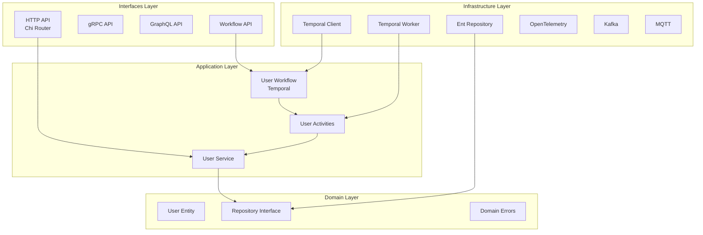
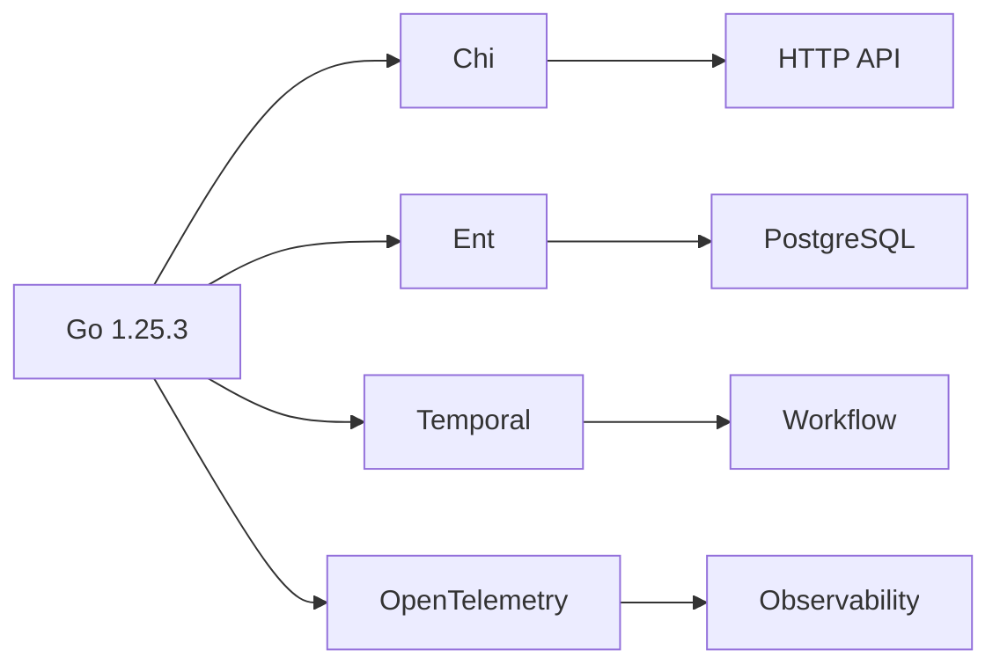
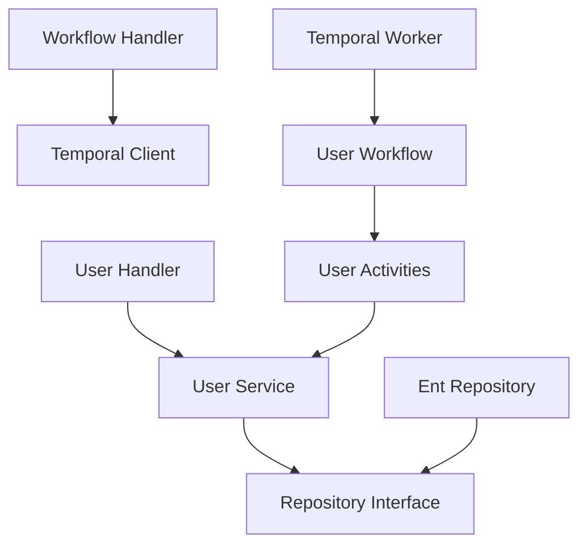

# 项目架构知识图谱

> **简介**: 本项目架构知识图谱，展示架构设计、技术栈和组件关系的完整视图。

**版本**: v1.0
**更新日期**: 2025-11-11
**适用于**: Go 1.25.3

---

## 📋 目录

- [项目架构知识图谱](#项目架构知识图谱)
  - [📋 目录](#-目录)
  - [1. 🎯 架构全景](#1--架构全景)
  - [2. 🏗️ 分层架构](#2-️-分层架构)
  - [3. 🔧 技术栈](#3--技术栈)
  - [4. 🔄 数据流](#4--数据流)
  - [5. 📊 组件关系](#5--组件关系)

---

## 1. 🎯 架构全景



---

## 2. 🏗️ 分层架构

### 2.1 层次关系

```text
┌─────────────────────────────────────┐
│      Interfaces Layer (接口层)       │
│  HTTP, gRPC, GraphQL, Workflow API  │
└──────────────┬──────────────────────┘
               │
┌──────────────▼──────────────────────┐
│    Application Layer (应用层)        │
│  Services, Workflows, Activities    │
└──────────────┬──────────────────────┘
               │
┌──────────────▼──────────────────────┐
│      Domain Layer (领域层)           │
│  Entities, Interfaces, Errors       │
└──────────────┬──────────────────────┘
               │
┌──────────────▼──────────────────────┐
│  Infrastructure Layer (基础设施层)   │
│  Database, Workflow, Observability  │
└─────────────────────────────────────┘
```

### 2.2 层次职责

| 层次 | 职责 | 示例 |
|------|------|------|
| **Interfaces** | 外部接口适配 | HTTP Handler, gRPC Service |
| **Application** | 用例编排 | User Service, Workflow |
| **Domain** | 业务逻辑 | User Entity, Repository Interface |
| **Infrastructure** | 技术实现 | Ent Repository, Temporal Client |

---

## 3. 🔧 技术栈

### 3.1 核心技术

```text
┌─────────────────────────────────────────┐
│            Go 1.25.3                    │
├─────────────────────────────────────────┤
│  Web Framework: Chi                     │
│  ORM: Ent                               │
│  Workflow: Temporal                     │
│  Database: PostgreSQL                   │
│  Observability: OpenTelemetry           │
│  Messaging: Kafka, MQTT                 │
│  API: REST, gRPC, GraphQL               │
└─────────────────────────────────────────┘
```

### 3.2 技术栈关系



---

## 4. 🔄 数据流

### 4.1 HTTP 请求流程

```text
Client Request
    ↓
HTTP Handler (Interfaces)
    ↓
User Service (Application)
    ↓
Repository Interface (Domain)
    ↓
Ent Repository (Infrastructure)
    ↓
PostgreSQL Database
```

### 4.2 工作流执行流程

```text
HTTP Request
    ↓
Workflow Handler (Interfaces)
    ↓
Temporal Client (Infrastructure)
    ↓
Temporal Server
    ↓
Temporal Worker (Infrastructure)
    ↓
User Workflow (Application)
    ↓
User Activities (Application)
    ↓
User Service (Application)
    ↓
Repository (Infrastructure)
```

---

## 5. 📊 组件关系

### 5.1 核心组件

| 组件 | 层次 | 依赖 | 被依赖 |
|------|------|------|--------|
| User Handler | Interfaces | User Service | HTTP Router |
| User Service | Application | Repository Interface | User Handler, Activities |
| User Entity | Domain | 无 | User Service |
| Repository Interface | Domain | 无 | User Service, Ent Repository |
| Ent Repository | Infrastructure | Repository Interface | User Service |
| Temporal Client | Infrastructure | Temporal SDK | Workflow Handler |
| Temporal Worker | Infrastructure | Temporal SDK | Temporal Server |

### 5.2 依赖关系图



---

## 📚 相关文档

- [Clean Architecture](./clean-architecture.md) - 架构设计详解
- [领域模型设计](./domain-model.md) - 领域层设计
- [工作流架构设计](./workflow.md) - 工作流集成

---

> 📚 **简介**
> 本文档提供了项目架构的完整知识图谱，包括分层架构、技术栈、数据流和组件关系。通过本文档，您可以快速理解项目的整体架构设计。
