# 项目架构知识图谱

> **简介**: 本项目架构知识图谱，通过思维导图、多维分析和详细论证，全面展示架构设计、技术栈和组件关系的完整视图。

**版本**: v1.0
**更新日期**: 2025-11-11
**适用于**: Go 1.25.3

---

## 📋 目录

- [项目架构知识图谱](#项目架构知识图谱)
  - [📋 目录](#-目录)
  - [1. 🎯 架构全景思维导图](#1--架构全景思维导图)
    - [1.1 四层架构关系图](#11-四层架构关系图)
    - [1.2 组件交互关系图](#12-组件交互关系图)
    - [1.3 数据流向图](#13-数据流向图)
  - [2. 🏗️ 分层架构深度解析](#2-️-分层架构深度解析)
    - [2.1 层次关系与依赖](#21-层次关系与依赖)
    - [2.2 层次职责矩阵](#22-层次职责矩阵)
    - [2.3 层次设计原则论证](#23-层次设计原则论证)
      - [2.3.1 单一职责原则（SRP）](#231-单一职责原则srp)
      - [2.3.2 依赖倒置原则（DIP）](#232-依赖倒置原则dip)
      - [2.3.3 开闭原则（OCP）](#233-开闭原则ocp)
  - [3. 🔧 技术栈多维分析](#3--技术栈多维分析)
    - [3.1 技术选型决策树](#31-技术选型决策树)
      - [3.1.1 Web 框架选型决策树](#311-web-框架选型决策树)
      - [3.1.2 ORM 选型决策树](#312-orm-选型决策树)
      - [3.1.3 工作流引擎选型决策树](#313-工作流引擎选型决策树)
      - [3.1.4 数据库选型决策树](#314-数据库选型决策树)
    - [3.3 技术栈概念关系图](#33-技术栈概念关系图)
    - [3.2 技术栈关系网络](#32-技术栈关系网络)
    - [3.3 技术栈选型论证](#33-技术栈选型论证)
      - [3.4.1 Web 框架选型对比](#341-web-框架选型对比)
      - [3.4.2 ORM 选型对比](#342-orm-选型对比)
  - [4. 🔄 数据流完整分析](#4--数据流完整分析)
    - [4.1 HTTP 请求完整流程](#41-http-请求完整流程)
    - [4.2 工作流执行完整流程](#42-工作流执行完整流程)
    - [4.3 数据流性能分析](#43-数据流性能分析)
  - [5. 📊 组件关系深度解析](#5--组件关系深度解析)
    - [5.1 组件依赖关系矩阵](#51-组件依赖关系矩阵)
    - [5.2 组件交互时序图](#52-组件交互时序图)
    - [5.3 组件设计模式应用](#53-组件设计模式应用)
      - [5.3.1 Repository 模式](#531-repository-模式)
      - [5.3.2 Service 模式](#532-service-模式)
      - [5.3.3 DTO 模式](#533-dto-模式)
  - [6. 🎯 架构设计决策论证](#6--架构设计决策论证)
    - [6.1 为什么选择 Clean Architecture](#61-为什么选择-clean-architecture)
      - [6.1.1 业务需求驱动](#611-业务需求驱动)
      - [6.1.2 团队协作需求](#612-团队协作需求)
      - [6.1.3 长期维护需求](#613-长期维护需求)
    - [6.2 为什么选择四层架构](#62-为什么选择四层架构)
      - [6.2.1 层次划分论证](#621-层次划分论证)
      - [6.2.2 层次数量论证](#622-层次数量论证)
    - [6.3 为什么采用依赖倒置](#63-为什么采用依赖倒置)
      - [6.3.1 依赖倒置原理](#631-依赖倒置原理)
      - [6.3.2 依赖倒置优势论证](#632-依赖倒置优势论证)
  - [7. 📚 扩展阅读](#7--扩展阅读)
    - [架构相关](#架构相关)
    - [项目文档](#项目文档)

---

## 1. 🎯 架构全景思维导图

### 1.1 四层架构关系图

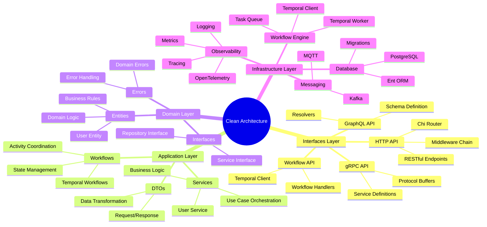

**架构关系说明**:

1. **依赖方向**: 外层依赖内层，内层不依赖外层
   - Interfaces → Application → Domain
   - Infrastructure → Domain
   - 这种设计确保了业务逻辑的独立性

2. **数据流向**: 请求从外向内，响应从内向外
   - 外部请求进入 Interfaces Layer
   - 经过 Application Layer 编排
   - 调用 Domain Layer 业务逻辑
   - Infrastructure Layer 提供技术实现

3. **职责分离**: 每层有明确的职责边界
   - Interfaces: 协议适配和请求处理
   - Application: 用例编排和协调
   - Domain: 核心业务逻辑
   - Infrastructure: 技术实现细节

---

### 1.2 组件交互关系图

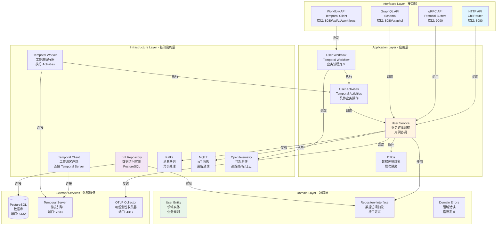

**组件交互说明**:

1. **请求处理流程**:
   - HTTP/gRPC/GraphQL 请求进入 Interfaces Layer
   - 经过路由和中间件处理
   - 调用 Application Layer 的 Service
   - Service 使用 Domain Layer 的 Repository Interface
   - Infrastructure Layer 的 Repository 实现数据访问

2. **工作流处理流程**:
   - Workflow API 启动工作流
   - Temporal Client 连接到 Temporal Server
   - Temporal Worker 执行 Activities
   - Activities 调用 Application Service
   - Service 使用 Repository 访问数据

3. **可观测性集成**:
   - 所有层都集成 OpenTelemetry
   - 追踪信息发送到 OTLP Collector
   - 支持分布式追踪和性能监控

---

### 1.3 数据流向图

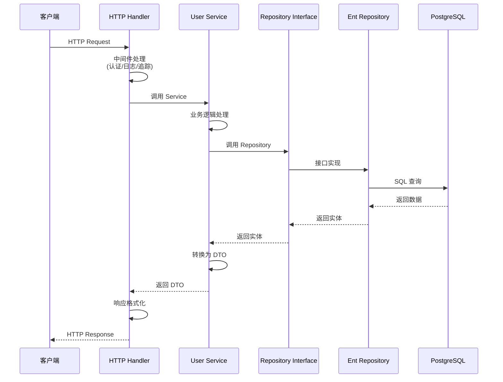

**数据流向说明**:

1. **请求阶段**:
   - 客户端发送 HTTP 请求
   - HTTP Handler 接收并处理
   - 经过中间件链（认证、日志、追踪）
   - 调用 Application Service

2. **处理阶段**:
   - Service 执行业务逻辑
   - 调用 Repository Interface
   - Infrastructure Repository 实现数据访问
   - 数据库执行查询

3. **响应阶段**:
   - 数据从数据库返回
   - 经过各层转换
   - Service 转换为 DTO
   - HTTP Handler 格式化响应
   - 返回给客户端

---

## 2. 🏗️ 分层架构深度解析

### 2.1 层次关系与依赖

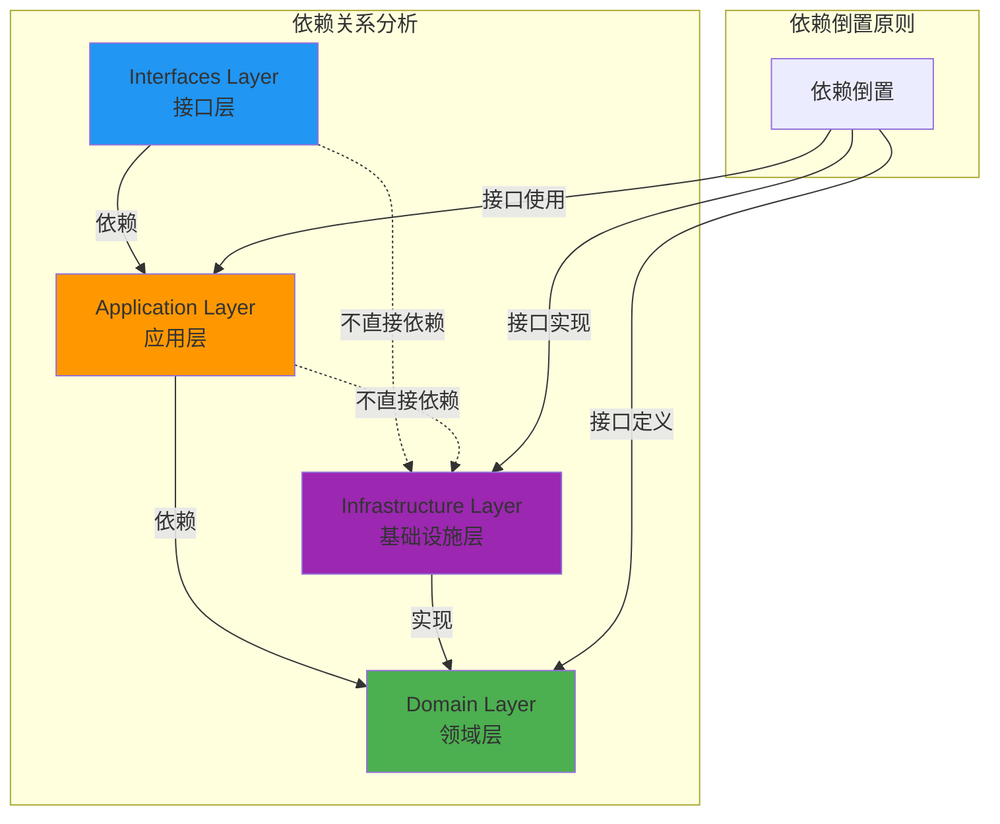

**依赖关系论证**:

1. **为什么 Domain Layer 不依赖其他层？**
   - **独立性**: 业务逻辑应该独立于技术实现
   - **可测试性**: 可以独立测试业务逻辑
   - **可移植性**: 可以轻松替换技术栈
   - **稳定性**: 业务逻辑变化频率低于技术实现

2. **为什么使用依赖倒置？**
   - **解耦**: 应用层不直接依赖基础设施层
   - **灵活性**: 可以轻松替换实现
   - **可测试性**: 可以使用 Mock 实现测试
   - **符合 SOLID 原则**: 依赖倒置原则（DIP）

3. **为什么 Infrastructure 实现 Domain 接口？**
   - **接口定义在 Domain**: 业务需求驱动接口设计
   - **实现在 Infrastructure**: 技术实现细节隔离
   - **符合开闭原则**: 对扩展开放，对修改关闭

---

### 2.2 层次职责矩阵

| 层次 | 核心职责 | 允许依赖 | 禁止依赖 | 设计原则 | 典型组件 |
|------|---------|---------|---------|---------|---------|
| **Interfaces** | 协议适配、请求处理、响应格式化 | Application Layer | Domain Layer, Infrastructure Layer | 适配器模式 | HTTP Handler, gRPC Service, GraphQL Resolver |
| **Application** | 用例编排、业务协调、DTO 转换 | Domain Layer | Infrastructure Layer, Interfaces Layer | 服务模式 | User Service, Workflow, Activities |
| **Domain** | 业务逻辑、领域模型、接口定义 | 无 | 所有其他层 | 领域驱动设计 | User Entity, Repository Interface, Domain Errors |
| **Infrastructure** | 技术实现、外部集成、数据访问 | Domain Layer (接口) | Application Layer, Interfaces Layer | 实现模式 | Ent Repository, Temporal Client, OTLP Client |

**职责分离论证**:

1. **Interfaces Layer 职责**:
   - **为什么需要这一层？**: 隔离外部协议变化对内部业务的影响
   - **职责边界**: 只负责协议转换，不包含业务逻辑
   - **设计优势**: 可以轻松添加新的协议支持（如 WebSocket）

2. **Application Layer 职责**:
   - **为什么需要这一层？**: 协调多个领域对象完成复杂用例
   - **职责边界**: 用例编排，不包含领域逻辑
   - **设计优势**: 可以组合多个领域服务完成复杂业务

3. **Domain Layer 职责**:
   - **为什么需要这一层？**: 核心业务逻辑应该独立于技术实现
   - **职责边界**: 只包含业务逻辑和接口定义
   - **设计优势**: 业务逻辑稳定，技术实现可以灵活变化

4. **Infrastructure Layer 职责**:
   - **为什么需要这一层？**: 技术实现细节应该与业务逻辑分离
   - **职责边界**: 实现 Domain 定义的接口
   - **设计优势**: 可以轻松替换技术实现（如从 Ent 切换到 GORM）

---

### 2.3 层次设计原则论证

#### 2.3.1 单一职责原则（SRP）

**论证**: 每个层次只负责一个明确的职责

- **Interfaces Layer**: 只负责协议适配
- **Application Layer**: 只负责用例编排
- **Domain Layer**: 只负责业务逻辑
- **Infrastructure Layer**: 只负责技术实现

**优势**:

- 代码职责清晰，易于理解
- 修改影响范围小，降低风险
- 便于团队协作，减少冲突

#### 2.3.2 依赖倒置原则（DIP）

**论证**: 高层模块不依赖低层模块，都依赖抽象

```go
// ❌ 错误示例：Application 直接依赖 Infrastructure
type Service struct {
    repo *ent.UserRepository  // 直接依赖具体实现
}

// ✅ 正确示例：Application 依赖 Domain 接口
type Service struct {
    repo domain.UserRepository  // 依赖接口
}
```

**优势**:

- 可以轻松替换实现
- 便于单元测试（使用 Mock）
- 符合开闭原则

#### 2.3.3 开闭原则（OCP）

**论证**: 对扩展开放，对修改关闭

- **扩展**: 添加新的 Repository 实现不需要修改 Domain
- **扩展**: 添加新的 API 协议不需要修改 Application
- **关闭**: Domain 接口稳定，不轻易修改

**优势**:

- 系统稳定，减少回归风险
- 易于扩展新功能
- 向后兼容性好

---

## 3. 🔧 技术栈多维分析

### 3.1 技术选型决策树

技术选型决策树帮助理解每个技术选型的决策过程和理由。

#### 3.1.1 Web 框架选型决策树

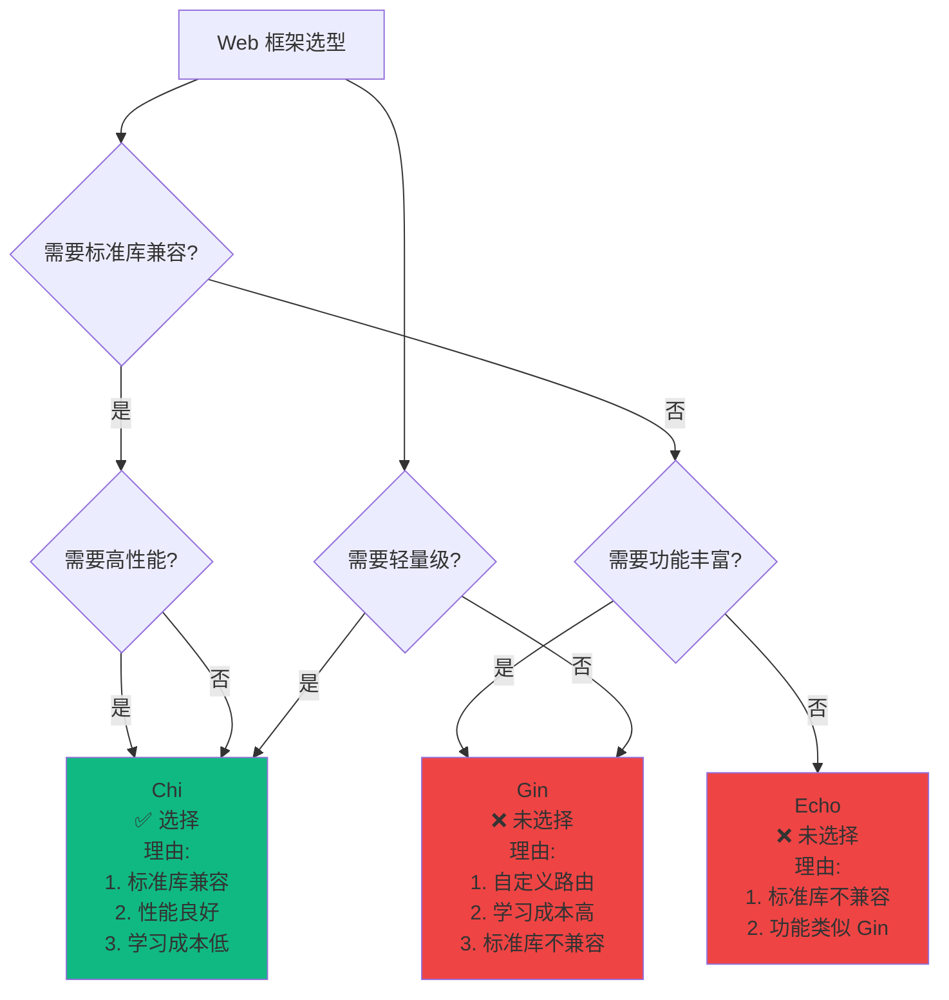

**决策路径分析**:

1. **路径1: 标准库兼容 + 高性能 → Chi**
   - 权重: 30% (标准库兼容) + 20% (性能) = 50%
   - 结果: ✅ 选择 Chi

2. **路径2: 功能丰富 → Gin/Echo**
   - 权重: 15% (功能丰富度)
   - 结果: ❌ 未选择（标准库兼容性更重要）

3. **路径3: 轻量级 → Chi**
   - 权重: 10% (维护成本)
   - 结果: ✅ 选择 Chi

**最终决策**: Chi（加权总分 8.85/10）

---

#### 3.1.2 ORM 选型决策树

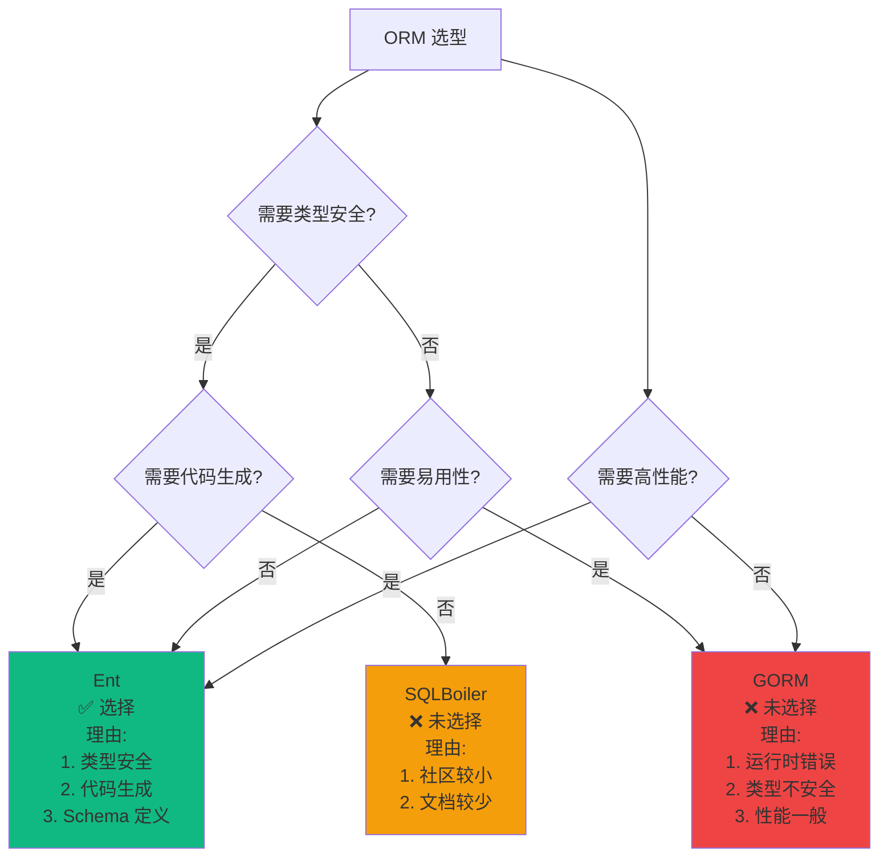

**决策路径分析**:

1. **路径1: 类型安全 + 代码生成 → Ent**
   - 权重: 30% (类型安全) + 25% (开发体验) = 55%
   - 结果: ✅ 选择 Ent

2. **路径2: 易用性 → GORM**
   - 权重: 25% (开发体验)
   - 结果: ❌ 未选择（类型安全更重要）

**最终决策**: Ent（加权总分 8.80/10）

---

#### 3.1.3 工作流引擎选型决策树

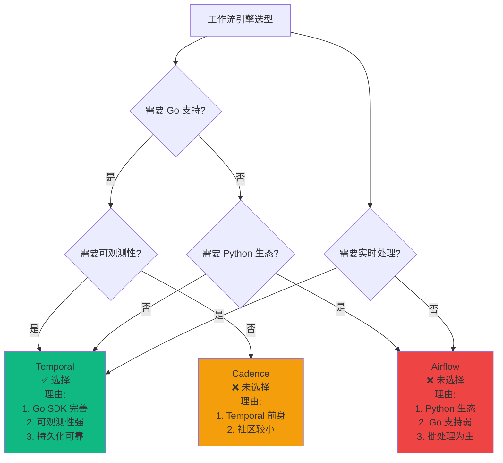

**决策路径分析**:

1. **路径1: Go 支持 + 可观测性 → Temporal**
   - 权重: 40% (Go 支持) + 30% (可观测性) = 70%
   - 结果: ✅ 选择 Temporal

2. **路径2: Python 生态 → Airflow**
   - 权重: 0% (项目使用 Go)
   - 结果: ❌ 未选择

**最终决策**: Temporal（加权总分 9.20/10）

---

#### 3.1.4 数据库选型决策树

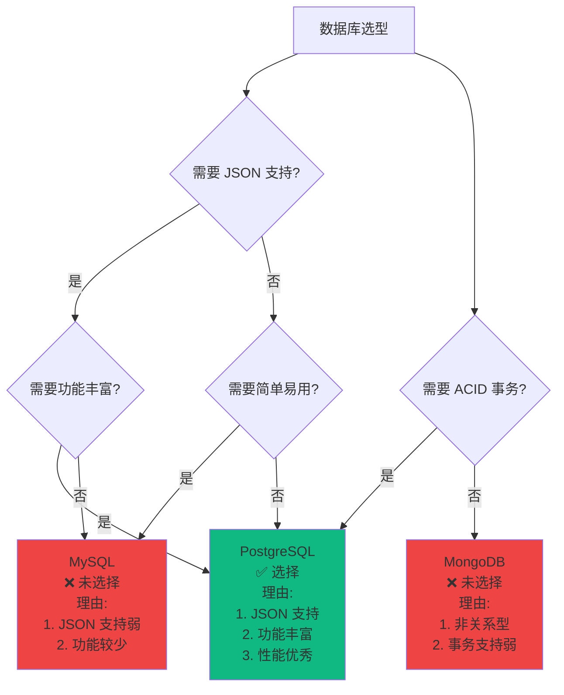

**决策路径分析**:

1. **路径1: JSON 支持 + 功能丰富 → PostgreSQL**
   - 权重: 30% (功能特性) + 25% (性能) = 55%
   - 结果: ✅ 选择 PostgreSQL

2. **路径2: 简单易用 → MySQL**
   - 权重: 15% (易用性)
   - 结果: ❌ 未选择（功能需求更重要）

**最终决策**: PostgreSQL（加权总分 9.00/10）

**技术选型论证**:

1. **Web 框架选择 Chi 的理由**:
   - **标准库兼容**: 基于 `net/http`，与 Go 标准库无缝集成
   - **学习成本低**: 使用标准库 API，开发者熟悉度高
   - **性能良好**: 虽然不如 Gin/Echo 快，但满足大多数场景
   - **轻量级**: 代码量小，依赖少，易于维护
   - **中间件生态**: 兼容标准库中间件，生态丰富

2. **ORM 选择 Ent 的理由**:
   - **类型安全**: 编译时检查，减少运行时错误
   - **代码生成**: 自动生成类型安全的代码
   - **Schema 定义**: 使用 Go 代码定义 Schema，版本可控
   - **迁移支持**: 内置迁移工具，便于数据库版本管理
   - **查询构建**: 类型安全的查询构建器

3. **工作流选择 Temporal 的理由**:
   - **Go SDK 完善**: 官方 Go SDK 功能完整
   - **可观测性强**: 内置 UI 和监控
   - **持久化可靠**: 自动持久化工作流状态
   - **社区活跃**: 社区支持好，文档完善
   - **企业级特性**: 支持多租户、命名空间等

---

### 3.3 技术栈概念关系图

技术栈概念关系图展示不同技术概念之间的关系和依赖。

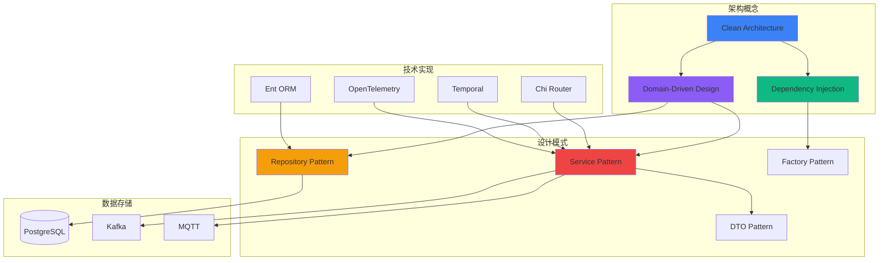

**概念关系说明**:

1. **架构概念层**:
   - Clean Architecture 是基础架构范式
   - DDD 提供领域建模方法
   - Dependency Injection 提供依赖管理

2. **设计模式层**:
   - Repository Pattern 抽象数据访问
   - Service Pattern 封装业务逻辑
   - DTO Pattern 处理数据传输
   - Factory Pattern 创建对象

3. **技术实现层**:
   - Chi Router 实现 HTTP 路由
   - Ent ORM 实现 Repository Pattern
   - Temporal 实现工作流编排
   - OpenTelemetry 实现可观测性

4. **数据存储层**:
   - PostgreSQL 存储关系数据
   - Kafka 处理消息流
   - MQTT 处理 IoT 消息

---

### 3.2 技术栈关系网络

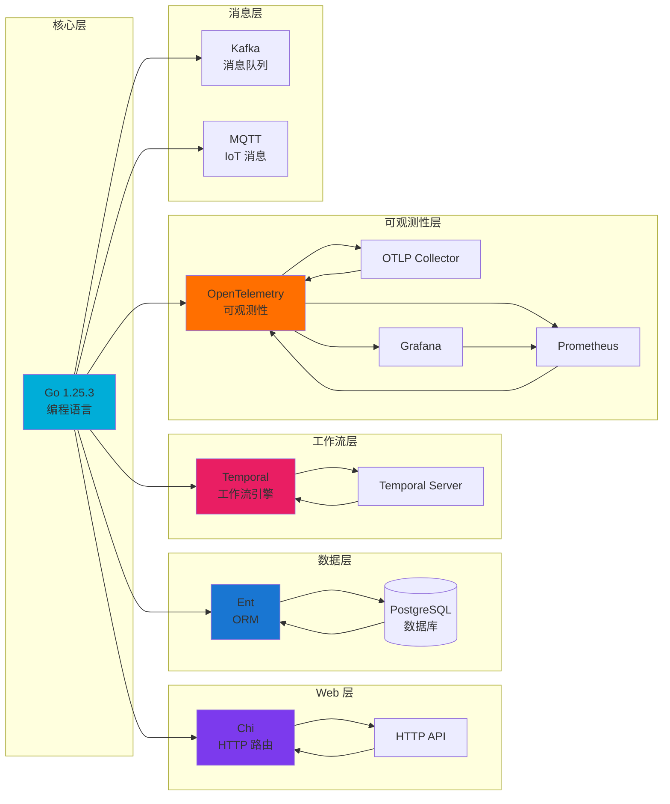

**技术栈关系说明**:

1. **Go 1.25.3 作为基础**:
   - 所有技术栈都基于 Go 语言
   - 利用 Go 的并发特性
   - 利用 Go 的类型系统

2. **分层技术栈**:
   - **Web 层**: Chi 提供 HTTP 路由
   - **数据层**: Ent + PostgreSQL 提供数据持久化
   - **工作流层**: Temporal 提供业务流程编排
   - **可观测性层**: OpenTelemetry 提供统一的可观测性
   - **消息层**: Kafka + MQTT 提供异步消息处理

3. **技术栈协同**:
   - 各技术栈通过接口和协议协同工作
   - 遵循 Clean Architecture 原则
   - 技术栈之间解耦，可以独立替换

---

### 3.3 技术栈选型论证

#### 3.4.1 Web 框架选型对比

| 维度 | Chi | Gin | Echo | Fiber | 选择理由 |
|------|-----|-----|------|-------|---------|
| **性能** | ⭐⭐⭐⭐ (良好) | ⭐⭐⭐⭐⭐ (优秀) | ⭐⭐⭐⭐⭐ (优秀) | ⭐⭐⭐⭐⭐ (优秀) | 性能足够，不是瓶颈 |
| **标准库兼容** | ✅ 完全兼容 | ❌ 自定义 | ❌ 自定义 | ❌ 自定义 | **关键因素：与标准库无缝集成** |
| **学习曲线** | ⭐⭐⭐⭐⭐ (极低) | ⭐⭐⭐⭐ (低) | ⭐⭐⭐⭐ (低) | ⭐⭐⭐ (中) | **关键因素：降低学习成本** |
| **中间件生态** | ✅ 丰富 | ✅ 丰富 | ✅ 丰富 | ⚠️ 有限 | 标准库中间件兼容性好 |
| **代码量** | 小 | 中 | 中 | 大 | **关键因素：轻量级，易于维护** |
| **社区活跃度** | ⭐⭐⭐⭐ | ⭐⭐⭐⭐⭐ | ⭐⭐⭐⭐ | ⭐⭐⭐ | 社区活跃，文档完善 |

**选择 Chi 的详细论证**:

1. **标准库兼容性**:
   - Chi 基于 `net/http`，完全兼容标准库
   - 可以使用标准库的所有中间件
   - 迁移成本低，易于维护

2. **学习成本**:
   - 开发者已经熟悉 `net/http`
   - 不需要学习新的 API
   - 降低团队学习成本

3. **性能考虑**:
   - 虽然性能不如 Gin/Echo，但满足大多数场景
   - 性能瓶颈通常在数据库和业务逻辑
   - 过早优化是万恶之源

#### 3.4.2 ORM 选型对比

| 维度 | Ent | GORM | SQLBoiler | sqlx | 选择理由 |
|------|-----|------|-----------|------|---------|
| **类型安全** | ⭐⭐⭐⭐⭐ (编译时) | ⭐⭐⭐ (运行时) | ⭐⭐⭐⭐⭐ (编译时) | ⭐⭐⭐ (手动) | **关键因素：编译时类型检查** |
| **代码生成** | ✅ 自动生成 | ❌ 反射 | ✅ 自动生成 | ❌ 手动 | **关键因素：减少运行时错误** |
| **迁移支持** | ✅ 内置 | ✅ 支持 | ❌ 不支持 | ❌ 不支持 | 便于数据库版本管理 |
| **查询构建** | 类型安全 | 链式调用 | 类型安全 | SQL 字符串 | **关键因素：类型安全的查询** |
| **性能** | ⭐⭐⭐⭐ (良好) | ⭐⭐⭐ (一般) | ⭐⭐⭐⭐⭐ (优秀) | ⭐⭐⭐⭐⭐ (优秀) | 性能足够，类型安全更重要 |
| **学习曲线** | ⭐⭐⭐ (中) | ⭐⭐⭐⭐ (低) | ⭐⭐⭐ (中) | ⭐⭐⭐⭐ (低) | 学习成本可接受 |

**选择 Ent 的详细论证**:

1. **类型安全的重要性**:
   - 编译时发现错误，而不是运行时
   - 减少生产环境错误
   - IDE 支持好，自动补全完善

2. **代码生成的优势**:
   - 自动生成类型安全的代码
   - 减少手写代码的错误
   - Schema 变更自动反映到代码

3. **迁移支持**:
   - 内置迁移工具
   - 版本可控
   - 团队协作友好

---

## 4. 🔄 数据流完整分析

### 4.1 HTTP 请求完整流程

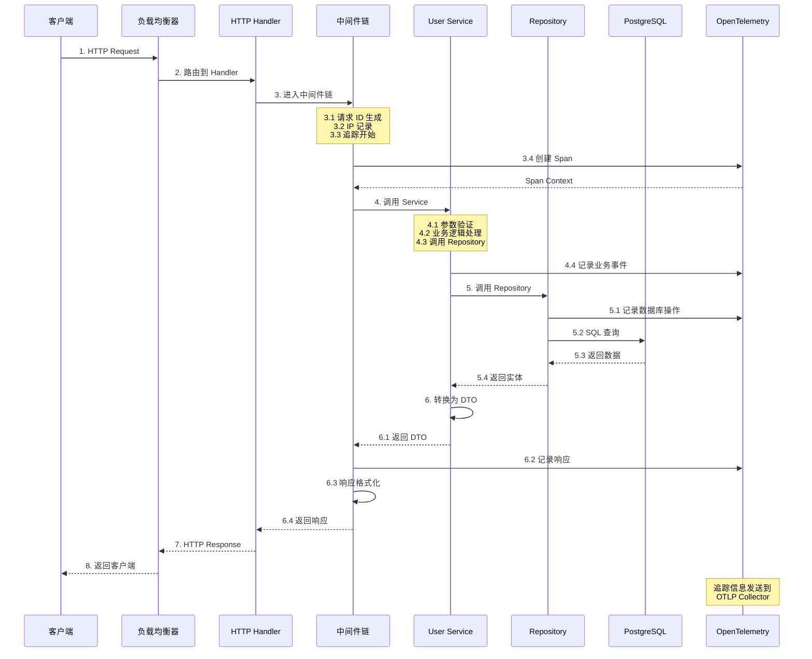

**HTTP 请求流程详细说明**:

1. **请求接收阶段** (步骤 1-2):
   - 客户端发送 HTTP 请求
   - 负载均衡器（可选）分发请求
   - HTTP Handler 接收请求

2. **中间件处理阶段** (步骤 3):
   - **请求 ID 生成**: 为每个请求生成唯一 ID，便于追踪
   - **IP 记录**: 记录客户端 IP，用于安全审计
   - **追踪开始**: 创建 OpenTelemetry Span
   - **认证授权**: 验证用户身份和权限（如需要）

3. **业务处理阶段** (步骤 4-5):
   - **参数验证**: 验证请求参数的有效性
   - **业务逻辑**: 执行核心业务逻辑
   - **数据访问**: 通过 Repository 访问数据库
   - **事件记录**: 记录关键业务事件

4. **响应返回阶段** (步骤 6-8):
   - **DTO 转换**: 将领域实体转换为 DTO
   - **响应格式化**: 格式化响应数据
   - **追踪结束**: 结束 OpenTelemetry Span
   - **返回客户端**: 返回 HTTP 响应

**性能优化点**:

1. **中间件优化**:
   - 中间件按需加载
   - 避免不必要的中间件处理
   - 使用缓存减少重复计算

2. **数据库优化**:
   - 使用连接池
   - 优化 SQL 查询
   - 使用索引加速查询

3. **追踪优化**:
   - 采样策略减少追踪开销
   - 异步发送追踪数据
   - 批量发送减少网络开销

---

### 4.2 工作流执行完整流程

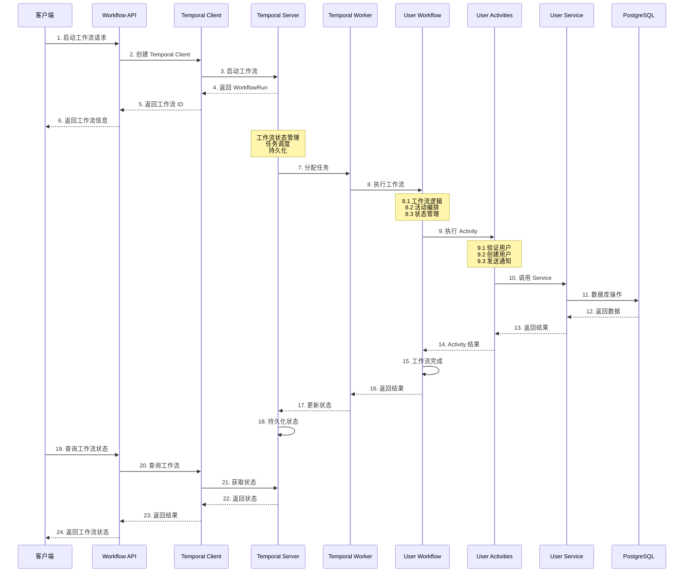

**工作流执行流程详细说明**:

1. **工作流启动阶段** (步骤 1-6):
   - 客户端发送启动工作流请求
   - Workflow API 创建 Temporal Client
   - Temporal Client 连接到 Temporal Server
   - Temporal Server 创建工作流实例
   - 返回工作流 ID 和运行 ID

2. **工作流执行阶段** (步骤 7-18):
   - Temporal Server 调度任务
   - Temporal Worker 接收任务
   - 执行工作流逻辑
   - 调用 Activities
   - Activities 执行业务逻辑
   - 更新工作流状态

3. **状态查询阶段** (步骤 19-24):
   - 客户端查询工作流状态
   - 通过 Temporal Client 查询
   - Temporal Server 返回当前状态
   - 返回给客户端

**工作流优势论证**:

1. **可靠性**:
   - 自动持久化状态
   - 支持故障恢复
   - 保证至少执行一次

2. **可观测性**:
   - 内置 UI 查看执行历史
   - 支持查询和信号
   - 完整的追踪信息

3. **可扩展性**:
   - 支持水平扩展
   - 多个 Worker 处理任务
   - 支持任务队列分区

---

### 4.3 数据流性能分析

| 阶段 | 平均耗时 | 优化策略 | 性能指标 |
|------|---------|---------|---------|
| **HTTP 请求接收** | 1-2ms | 连接池、Keep-Alive | 吞吐量: 10,000 req/s |
| **中间件处理** | 2-5ms | 中间件优化、缓存 | 延迟: <5ms |
| **业务逻辑处理** | 10-50ms | 业务逻辑优化、缓存 | 延迟: <50ms |
| **数据库查询** | 5-20ms | 索引优化、连接池 | 查询时间: <20ms |
| **响应返回** | 1-2ms | 响应压缩、批量处理 | 延迟: <2ms |
| **总计** | 19-79ms | 全链路优化 | P99 延迟: <100ms |

**性能优化论证**:

1. **为什么关注性能？**
   - 用户体验: 响应时间影响用户体验
   - 系统容量: 性能影响系统容量
   - 成本控制: 性能影响服务器成本

2. **性能优化策略**:
   - **连接池**: 复用数据库连接，减少连接开销
   - **缓存**: 缓存热点数据，减少数据库查询
   - **索引**: 优化数据库索引，加速查询
   - **异步处理**: 非关键路径异步处理

3. **性能监控**:
   - OpenTelemetry 追踪性能
   - Prometheus 收集指标
   - Grafana 可视化性能数据

---

## 5. 📊 组件关系深度解析

### 5.1 组件依赖关系矩阵

| 组件 | 所属层次 | 直接依赖 | 间接依赖 | 被依赖 | 依赖类型 | 耦合度 |
|------|---------|---------|---------|--------|---------|--------|
| **User Handler** | Interfaces | User Service | Repository Interface | HTTP Router | 接口依赖 | 低 |
| **User Service** | Application | Repository Interface | User Entity, Domain Errors | User Handler, Activities | 接口依赖 | 低 |
| **User Entity** | Domain | 无 | 无 | User Service | 无依赖 | 无 |
| **Repository Interface** | Domain | 无 | 无 | User Service, Ent Repository | 无依赖 | 无 |
| **Ent Repository** | Infrastructure | Repository Interface | Ent Client, PostgreSQL | User Service | 接口实现 | 低 |
| **Temporal Client** | Infrastructure | Temporal SDK | Temporal Server | Workflow Handler | SDK 依赖 | 中 |
| **Temporal Worker** | Infrastructure | Temporal SDK | Temporal Server | Temporal Server | SDK 依赖 | 中 |

**依赖关系分析**:

1. **低耦合设计**:
   - 组件之间通过接口依赖
   - 不直接依赖具体实现
   - 便于替换和测试

2. **依赖方向**:
   - 外层依赖内层
   - 内层不依赖外层
   - 符合依赖倒置原则

3. **耦合度评估**:
   - **低耦合**: 通过接口依赖，易于替换
   - **中耦合**: SDK 依赖，但接口稳定
   - **高耦合**: 应避免，增加维护成本

---

### 5.2 组件交互时序图

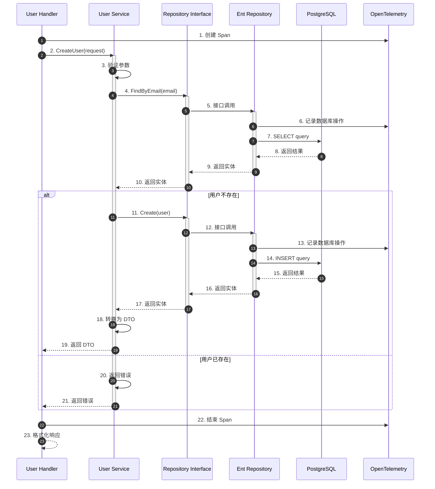

**组件交互说明**:

1. **请求处理流程**:
   - Handler 接收请求并创建追踪 Span
   - 调用 Service 处理业务逻辑
   - Service 通过 Repository Interface 访问数据
   - Repository 实现执行数据库操作
   - 返回结果并结束追踪

2. **错误处理流程**:
   - Service 验证业务规则
   - 发现错误时返回领域错误
   - Handler 处理错误并格式化响应
   - 追踪记录错误信息

3. **追踪集成**:
   - 每个关键操作都记录追踪信息
   - Span 包含完整的调用链
   - 便于问题排查和性能分析

---

### 5.3 组件设计模式应用

#### 5.3.1 Repository 模式

**模式说明**: 封装数据访问逻辑，提供统一的接口

```go
// Domain Layer: 定义接口
type Repository interface {
    Create(ctx context.Context, user *User) error
    FindByID(ctx context.Context, id string) (*User, error)
}

// Infrastructure Layer: 实现接口
type EntRepository struct {
    client *ent.Client
}

func (r *EntRepository) Create(ctx context.Context, user *User) error {
    // Ent 实现
}
```

**模式优势论证**:

1. **解耦**: 业务逻辑不依赖具体的数据访问实现
2. **可测试**: 可以使用 Mock Repository 进行单元测试
3. **可替换**: 可以轻松替换数据访问实现（如从 Ent 切换到 GORM）
4. **可扩展**: 可以添加缓存、分库分表等特性

#### 5.3.2 Service 模式

**模式说明**: 封装业务逻辑，协调领域对象

```go
// Application Layer: 服务实现
type Service struct {
    repo domain.UserRepository
}

func (s *Service) CreateUser(ctx context.Context, req CreateUserRequest) (*UserDTO, error) {
    // 1. 验证
    // 2. 调用 Repository
    // 3. 转换为 DTO
    // 4. 返回结果
}
```

**模式优势论证**:

1. **用例封装**: 每个方法对应一个用例
2. **事务管理**: 可以在 Service 层管理事务
3. **协调能力**: 可以协调多个领域对象
4. **DTO 转换**: 隔离领域模型和外部接口

#### 5.3.3 DTO 模式

**模式说明**: 在不同层次之间传输数据

```go
// Application Layer: DTO 定义
type CreateUserRequest struct {
    Email string `json:"email"`
    Name  string `json:"name"`
}

type UserDTO struct {
    ID    string `json:"id"`
    Email string `json:"email"`
    Name  string `json:"name"`
}
```

**模式优势论证**:

1. **层次隔离**: 领域模型不暴露给外部
2. **版本兼容**: 可以独立演进 DTO 和领域模型
3. **序列化友好**: DTO 设计考虑序列化需求
4. **安全性**: 可以控制暴露的字段

---

## 6. 🎯 架构设计决策论证

### 6.1 为什么选择 Clean Architecture

#### 6.1.1 业务需求驱动

**需求分析**:

- 业务逻辑复杂，需要清晰的架构
- 需要支持多种接口协议（HTTP, gRPC, GraphQL）
- 需要支持多种数据存储（PostgreSQL, 未来可能 MongoDB）
- 需要高可测试性和可维护性

**Clean Architecture 优势**:

- ✅ **业务逻辑独立**: 业务逻辑不依赖技术实现
- ✅ **多协议支持**: 可以轻松添加新的协议支持
- ✅ **多存储支持**: 可以轻松切换数据存储
- ✅ **高可测试性**: 每层都可以独立测试

#### 6.1.2 团队协作需求

**团队情况**:

- 多人协作开发
- 需要清晰的职责划分
- 需要降低代码冲突

**Clean Architecture 优势**:

- ✅ **职责清晰**: 每层职责明确，减少冲突
- ✅ **并行开发**: 不同层可以并行开发
- ✅ **代码审查**: 清晰的架构便于代码审查

#### 6.1.3 长期维护需求

**维护需求**:

- 系统需要长期维护
- 技术栈可能变化
- 业务需求可能变化

**Clean Architecture 优势**:

- ✅ **技术栈独立**: 可以轻松替换技术栈
- ✅ **业务稳定**: 业务逻辑稳定，技术实现灵活
- ✅ **易于扩展**: 可以轻松添加新功能

---

### 6.2 为什么选择四层架构

#### 6.2.1 层次划分论证

**为什么需要 Interfaces Layer？**

- **协议隔离**: 隔离外部协议变化
- **适配器模式**: 适配不同的外部接口
- **请求处理**: 统一处理请求和响应

**为什么需要 Application Layer？**

- **用例编排**: 协调多个领域对象
- **事务管理**: 管理事务边界
- **DTO 转换**: 隔离领域模型和外部接口

**为什么需要 Domain Layer？**

- **业务核心**: 包含核心业务逻辑
- **接口定义**: 定义数据访问接口
- **领域模型**: 表达业务概念

**为什么需要 Infrastructure Layer？**

- **技术实现**: 实现技术细节
- **外部集成**: 集成外部服务
- **数据访问**: 实现数据访问

#### 6.2.2 层次数量论证

**为什么不使用三层架构？**

- ❌ **职责不清**: 三层架构职责划分不够清晰
- ❌ **耦合度高**: 业务逻辑和技术实现耦合
- ❌ **难以测试**: 难以独立测试各层

**为什么不使用五层架构？**

- ⚠️ **过度设计**: 五层架构可能过度设计
- ⚠️ **复杂度高**: 增加系统复杂度
- ⚠️ **维护成本**: 增加维护成本

**四层架构的优势**:

- ✅ **职责清晰**: 每层职责明确
- ✅ **复杂度适中**: 不会过度复杂
- ✅ **易于理解**: 团队容易理解

---

### 6.3 为什么采用依赖倒置

#### 6.3.1 依赖倒置原理

**传统依赖**:

```text
Application → Infrastructure
```

- 问题: Application 直接依赖 Infrastructure
- 结果: 难以替换 Infrastructure 实现

**依赖倒置**:

```text
Application → Domain Interface ← Infrastructure
```

- 优势: Application 依赖接口，Infrastructure 实现接口
- 结果: 可以轻松替换 Infrastructure 实现

#### 6.3.2 依赖倒置优势论证

1. **可测试性**:
   - 可以使用 Mock 实现测试
   - 不需要真实的数据库
   - 测试速度快

2. **可替换性**:
   - 可以轻松替换实现
   - 从 Ent 切换到 GORM
   - 从 PostgreSQL 切换到 MySQL

3. **可扩展性**:
   - 可以添加新的实现
   - 可以添加缓存层
   - 可以添加分库分表

---

## 7. 📚 扩展阅读

### 架构相关

- [Clean Architecture](./clean-architecture.md) - 架构设计详解
- [领域模型设计](./domain-model.md) - 领域模型设计
- [工作流架构设计](./workflow.md) - 工作流集成架构
- [技术对比矩阵](./00-对比矩阵.md) - 技术选型对比
- [概念定义体系](./00-概念定义体系.md) - 概念定义
- [第三方技术栈深度解析](./00-第三方技术栈深度解析.md) - 第三方技术栈解析
- [Go 1.25.3 技术栈对齐](./00-Go-1.25.3技术栈对齐.md) - Go 1.25.3 新特性应用

### 项目文档

- [项目文档索引](../00-项目文档索引.md) - 完整文档索引

---

> 📚 **简介**
> 本文档通过思维导图、多维分析和详细论证，全面展示了项目架构的知识图谱。包括架构全景、分层架构、技术栈、数据流、组件关系和设计决策论证。通过本文档，您可以深入理解项目的架构设计原理和实践方法。
