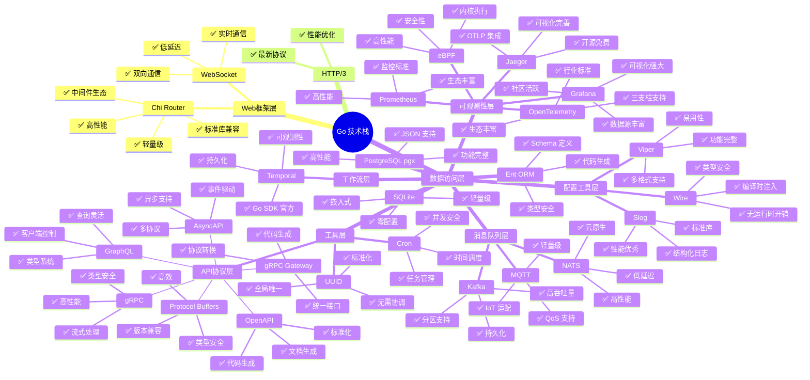
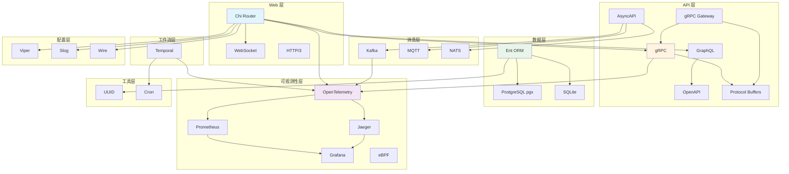
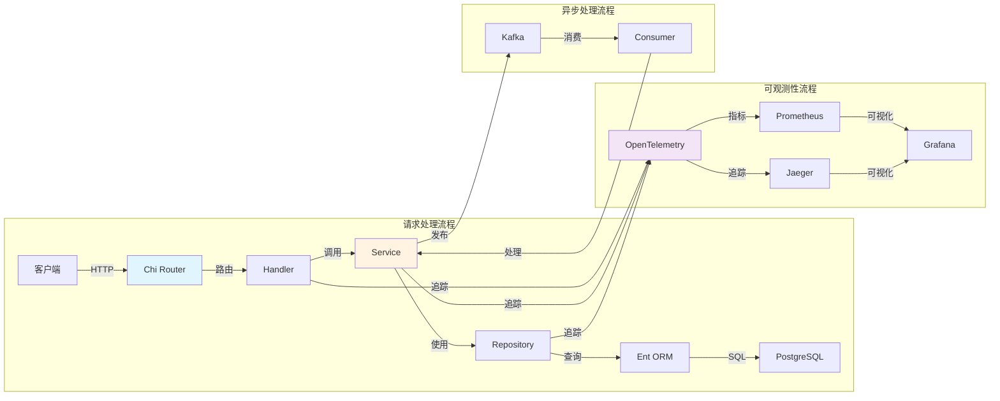
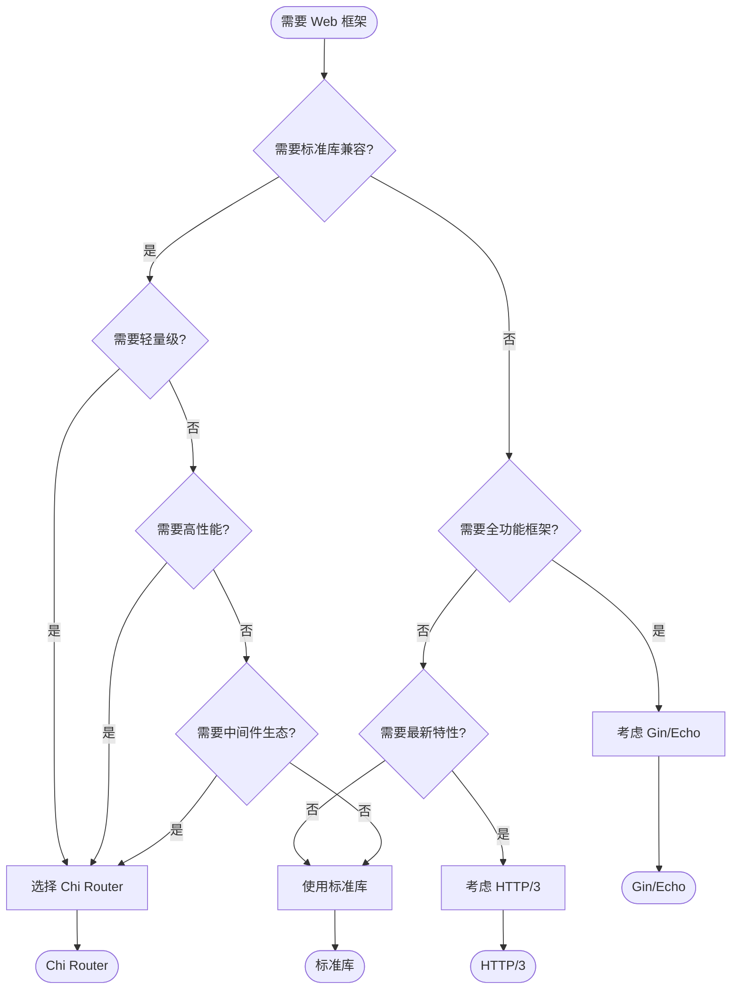
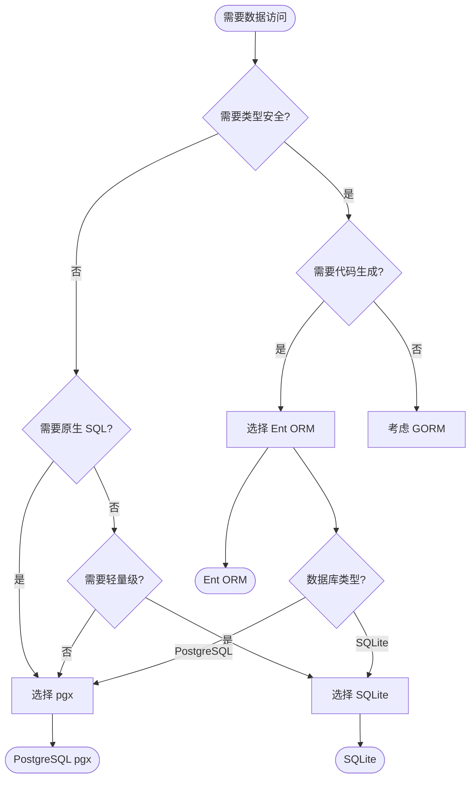
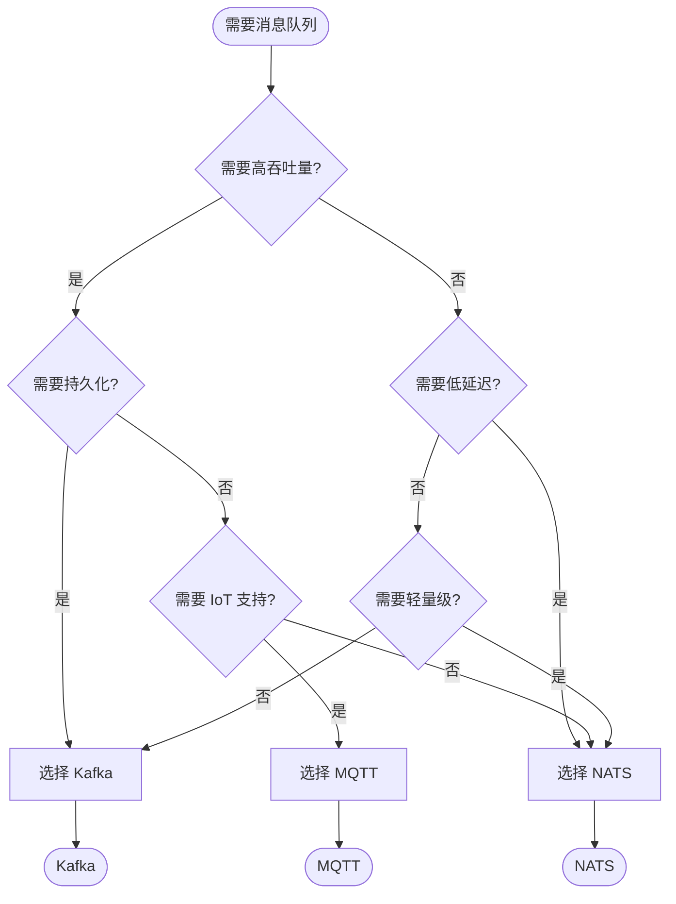
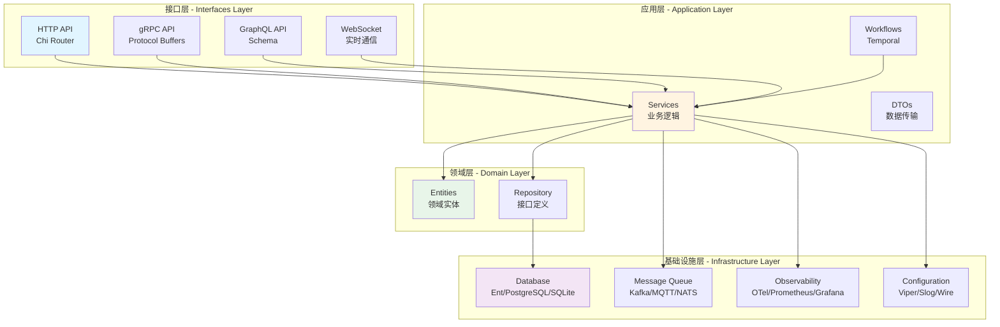
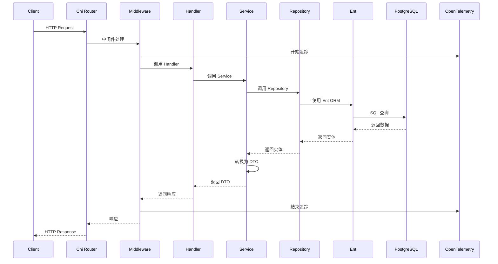
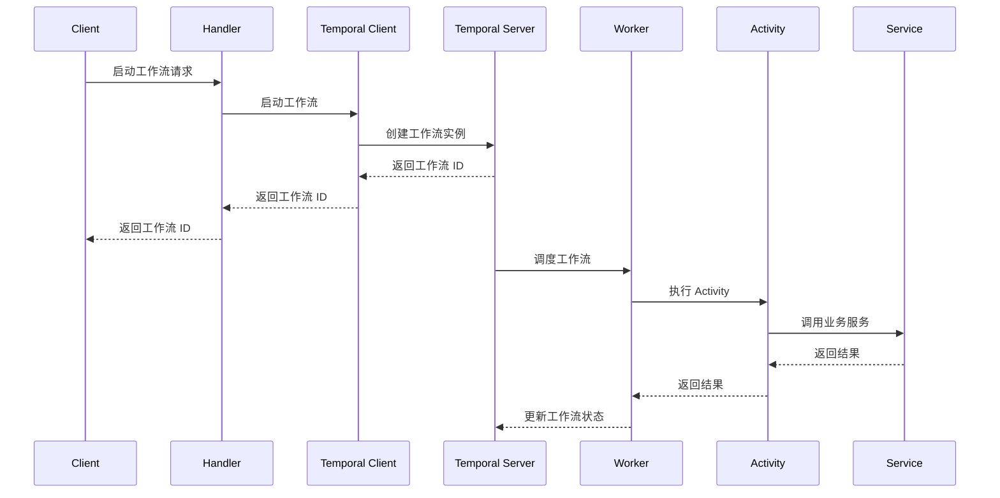

# 技术栈思维导图

> **简介**: 本文档通过思维导图、关系网络图、决策流程图等多种可视化方式，全面展示项目技术栈的完整视图。

**版本**: v1.0
**更新日期**: 2025-11-11
**适用于**: Go 1.25.3

---

## 📋 目录

- [技术栈思维导图](#技术栈思维导图)
  - [📋 目录](#-目录)
  - [1. 🗺️ 技术栈全景思维导图](#1-️-技术栈全景思维导图)
    - [1.1 完整技术栈思维导图](#11-完整技术栈思维导图)
  - [2. 🔗 技术栈关系网络图](#2--技术栈关系网络图)
    - [2.1 技术栈依赖关系图](#21-技术栈依赖关系图)
    - [2.2 技术栈协作关系图](#22-技术栈协作关系图)
  - [3. 🎯 技术栈决策流程图](#3--技术栈决策流程图)
    - [3.1 Web 框架选型决策流程](#31-web-框架选型决策流程)
    - [3.2 数据访问层选型决策流程](#32-数据访问层选型决策流程)
    - [3.3 消息队列选型决策流程](#33-消息队列选型决策流程)
  - [4. 📊 技术栈分层架构图](#4--技术栈分层架构图)
    - [4.1 技术栈分层视图](#41-技术栈分层视图)
  - [5. 🔄 技术栈交互时序图](#5--技术栈交互时序图)
    - [5.1 HTTP 请求处理时序图](#51-http-请求处理时序图)
    - [5.2 工作流执行时序图](#52-工作流执行时序图)
  - [6. 📈 技术栈选型对比矩阵](#6--技术栈选型对比矩阵)
    - [6.1 Web 框架对比](#61-web-框架对比)
    - [6.2 数据访问对比](#62-数据访问对比)
    - [6.3 消息队列对比](#63-消息队列对比)
  - [7. 📚 扩展阅读](#7--扩展阅读)

---

## 1. 🗺️ 技术栈全景思维导图

### 1.1 完整技术栈思维导图

---

## 2. 🔗 技术栈关系网络图

### 2.1 技术栈依赖关系图

### 2.2 技术栈协作关系图

---

## 3. 🎯 技术栈决策流程图

### 3.1 Web 框架选型决策流程

### 3.2 数据访问层选型决策流程

### 3.3 消息队列选型决策流程

---

## 4. 📊 技术栈分层架构图

### 4.1 技术栈分层视图

---

## 5. 🔄 技术栈交互时序图

### 5.1 HTTP 请求处理时序图

### 5.2 工作流执行时序图

---

## 6. 📈 技术栈选型对比矩阵

### 6.1 Web 框架对比

| 特性 | Chi Router | Gin | Echo | 标准库 |
|------|-----------|-----|------|--------|
| 性能 | ⭐⭐⭐⭐ | ⭐⭐⭐⭐⭐ | ⭐⭐⭐⭐ | ⭐⭐⭐⭐⭐ |
| 易用性 | ⭐⭐⭐⭐ | ⭐⭐⭐⭐⭐ | ⭐⭐⭐⭐ | ⭐⭐ |
| 中间件 | ⭐⭐⭐⭐⭐ | ⭐⭐⭐⭐ | ⭐⭐⭐⭐ | ⭐ |
| 标准库兼容 | ⭐⭐⭐⭐⭐ | ⭐⭐ | ⭐⭐ | ⭐⭐⭐⭐⭐ |
| 社区 | ⭐⭐⭐⭐ | ⭐⭐⭐⭐⭐ | ⭐⭐⭐ | ⭐⭐⭐⭐⭐ |

### 6.2 数据访问对比

| 特性 | Ent ORM | GORM | pgx | SQLite |
|------|---------|------|-----|--------|
| 类型安全 | ⭐⭐⭐⭐⭐ | ⭐⭐⭐ | ⭐⭐⭐⭐ | ⭐⭐⭐⭐ |
| 性能 | ⭐⭐⭐⭐ | ⭐⭐⭐ | ⭐⭐⭐⭐⭐ | ⭐⭐⭐⭐ |
| 易用性 | ⭐⭐⭐⭐ | ⭐⭐⭐⭐⭐ | ⭐⭐⭐ | ⭐⭐⭐⭐⭐ |
| 代码生成 | ⭐⭐⭐⭐⭐ | ⭐⭐ | ⭐ | ⭐ |
| 功能完整性 | ⭐⭐⭐⭐ | ⭐⭐⭐⭐⭐ | ⭐⭐⭐⭐ | ⭐⭐⭐ |

### 6.3 消息队列对比

| 特性 | Kafka | MQTT | NATS |
|------|-------|------|------|
| 吞吐量 | ⭐⭐⭐⭐⭐ | ⭐⭐⭐ | ⭐⭐⭐⭐ |
| 延迟 | ⭐⭐⭐ | ⭐⭐⭐⭐ | ⭐⭐⭐⭐⭐ |
| 持久化 | ⭐⭐⭐⭐⭐ | ⭐⭐ | ⭐⭐⭐ |
| 易用性 | ⭐⭐⭐ | ⭐⭐⭐⭐ | ⭐⭐⭐⭐⭐ |
| IoT 支持 | ⭐⭐ | ⭐⭐⭐⭐⭐ | ⭐⭐⭐ |

---

## 7. 📚 扩展阅读

- [技术栈概览](./00-技术栈概览.md)
- [技术栈集成](./01-技术栈集成.md)
- [技术栈选型决策树](./02-技术栈选型决策树.md)
- [技术栈文档索引](./README.md)
- [架构知识图谱](../00-知识图谱.md)

---

> 📚 **简介**
> 本文档通过多种可视化方式全面展示项目技术栈，包括思维导图、关系网络图、决策流程图等。
