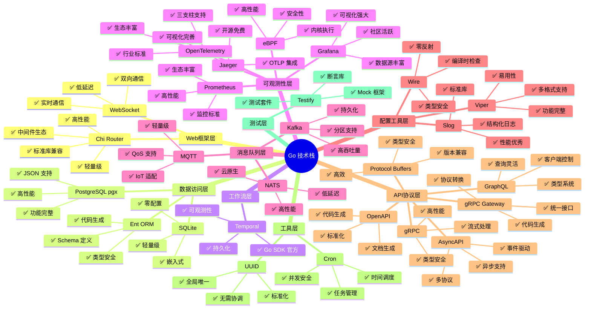

# 技术栈概览

> **简介**: 本文档提供项目技术栈的整体概览，包括技术栈分层和选型原则。

**版本**: v1.0
**更新日期**: 2025-11-11
**适用于**: Go 1.25.3

---

## 📋 目录

- [技术栈概览](#技术栈概览)
  - [📋 目录](#-目录)
  - [1. 技术栈分层](#1-技术栈分层)
  - [2. 技术选型原则](#2-技术选型原则)
  - [3. 扩展阅读](#3-扩展阅读)

---

## 1. 技术栈分层

---

## 2. 技术选型原则

**选型标准**:

1. **成熟度**: 技术必须成熟稳定，有良好的社区支持
2. **Go 支持**: 必须有良好的 Go 语言支持
3. **性能**: 性能满足项目需求
4. **可维护性**: 代码清晰，易于维护
5. **生态系统**: 有丰富的生态系统和工具支持

---

## 3. 扩展阅读

- [技术栈集成](./01-技术栈集成.md) - 技术栈集成架构和最佳实践
- [技术栈选型决策树](./02-技术栈选型决策树.md) - 技术栈选型决策树
- [架构文档索引](../README.md) - 架构文档索引

---

> 📚 **简介**
> 本文档提供了项目技术栈的整体概览，帮助快速了解技术栈的分层和选型原则。
