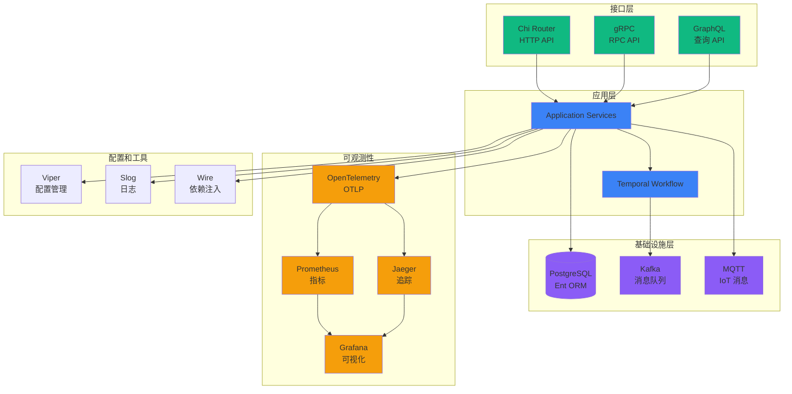

# 技术栈集成

> **简介**: 本文档详细说明项目中各技术栈的集成架构和最佳实践。

**版本**: v1.0
**更新日期**: 2025-11-11
**适用于**: Go 1.25.3

---

## 📋 目录

- [技术栈集成](#技术栈集成)
  - [📋 目录](#-目录)
  - [1. 集成架构](#1-集成架构)
  - [2. 集成最佳实践](#2-集成最佳实践)
    - [2.1 依赖注入最佳实践](#21-依赖注入最佳实践)
    - [2.2 配置管理最佳实践](#22-配置管理最佳实践)
    - [2.3 日志最佳实践](#23-日志最佳实践)
    - [2.4 可观测性最佳实践](#24-可观测性最佳实践)
  - [3. 扩展阅读](#3-扩展阅读)

---

## 1. 集成架构

**技术栈集成架构图**:



---

## 2. 集成最佳实践

### 2.1 依赖注入最佳实践

**使用 Wire 进行依赖注入**:

```go
// wire.go
//go:build wireinject
// +build wireinject

package main

import (
    "github.com/google/wire"
    // ... 导入
)

func InitializeApp() (*App, error) {
    wire.Build(
        // 配置
        config.NewConfig,

        // 数据库
        database.NewClient,
        repository.NewUserRepository,

        // 服务
        service.NewUserService,

        // 处理器
        handler.NewUserHandler,

        // 应用
        NewApp,
    )
    return &App{}, nil
}
```

详细内容请参考: [Wire 依赖注入](./config/wire.md)

### 2.2 配置管理最佳实践

**使用 Viper 管理配置**:

```go
// config/config.go
package config

import (
    "github.com/spf13/viper"
)

func LoadConfig() (*Config, error) {
    viper.SetConfigName("config")
    viper.SetConfigType("yaml")
    viper.AddConfigPath("./configs")
    viper.AddConfigPath(".")

    // 环境变量
    viper.AutomaticEnv()

    // 默认值
    viper.SetDefault("server.port", 8080)

    if err := viper.ReadInConfig(); err != nil {
        return nil, err
    }

    var cfg Config
    if err := viper.Unmarshal(&cfg); err != nil {
        return nil, err
    }

    return &cfg, nil
}
```

详细内容请参考: [Viper 配置管理](./config/viper.md)

### 2.3 日志最佳实践

**使用 Slog 结构化日志**:

```go
// logger/logger.go
package logger

import (
    "log/slog"
    "os"
)

func NewLogger() *slog.Logger {
    opts := &slog.HandlerOptions{
        Level: slog.LevelInfo,
    }

    handler := slog.NewJSONHandler(os.Stdout, opts)
    return slog.New(handler)
}

// 使用
logger.Info("user created",
    "user_id", userID,
    "email", email,
)
```

详细内容请参考: [Slog 日志库](./config/slog.md)

### 2.4 可观测性最佳实践

**集成 OpenTelemetry**:

```go
// observability/tracing.go
package observability

import (
    "go.opentelemetry.io/otel"
    "go.opentelemetry.io/otel/exporters/otlp/otlptrace/otlptracegrpc"
    "go.opentelemetry.io/otel/sdk/trace"
)

func InitTracing(endpoint string) (*trace.TracerProvider, error) {
    exporter, err := otlptracegrpc.New(
        context.Background(),
        otlptracegrpc.WithEndpoint(endpoint),
    )
    if err != nil {
        return nil, err
    }

    tp := trace.NewTracerProvider(
        trace.WithBatcher(exporter),
        trace.WithResource(resource.NewWithAttributes(
            semconv.SchemaURL,
            semconv.ServiceNameKey.String("my-service"),
        )),
    )

    otel.SetTracerProvider(tp)
    return tp, nil
}
```

详细内容请参考: [OpenTelemetry](./observability/opentelemetry.md)

---

## 3. 扩展阅读

- [技术栈概览](./00-技术栈概览.md) - 技术栈概览
- [技术栈选型决策树](./02-技术栈选型决策树.md) - 技术栈选型决策树
- [架构文档索引](../README.md) - 架构文档索引

---

> 📚 **简介**
> 本文档详细说明了项目中各技术栈的集成架构和最佳实践，帮助理解技术栈之间的协作关系。
