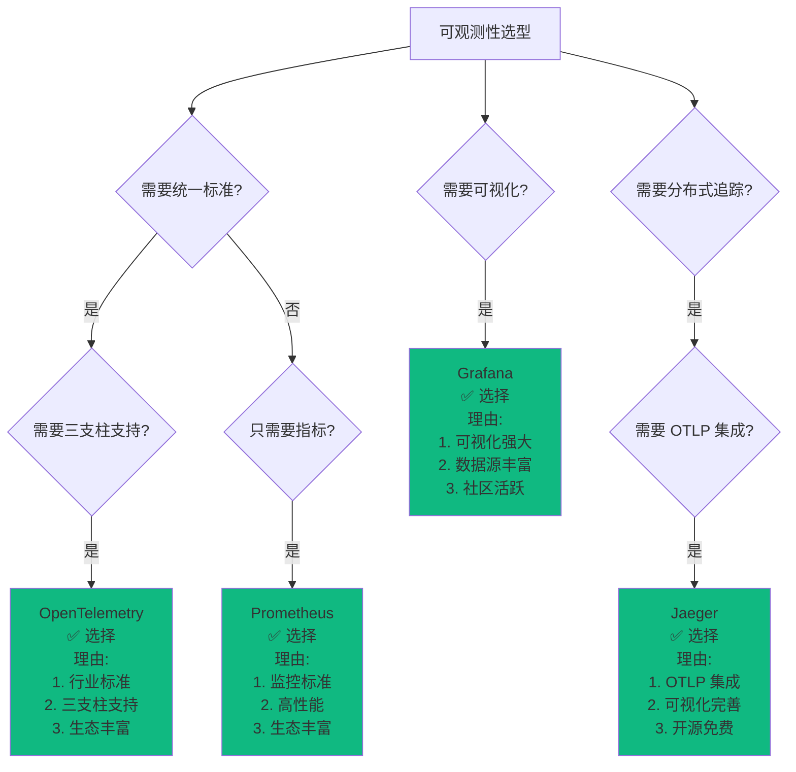
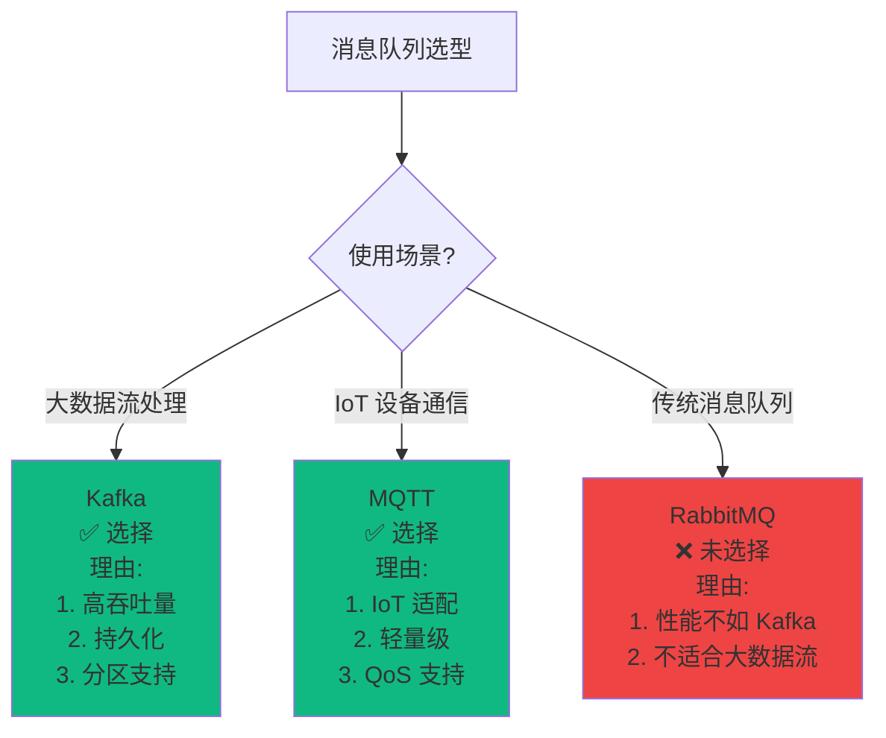
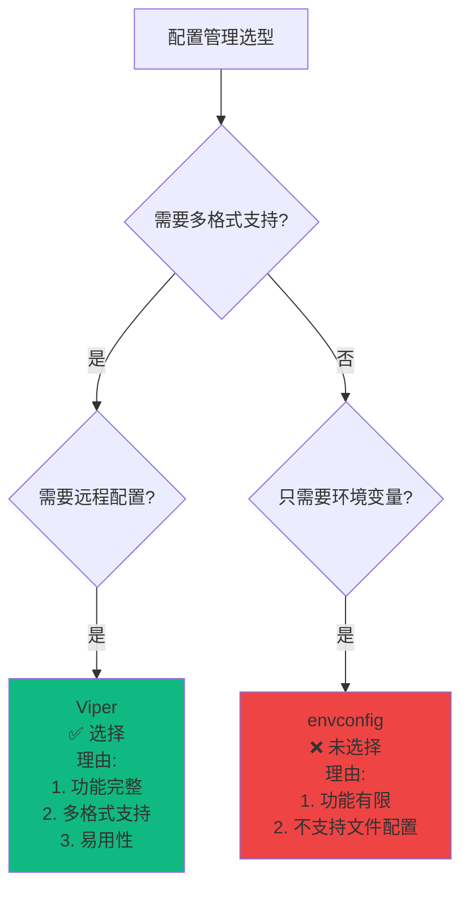
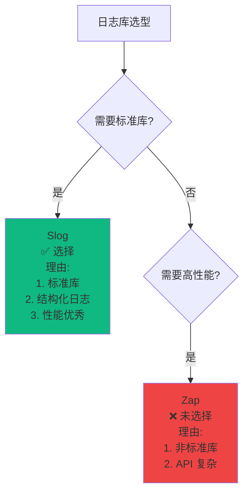
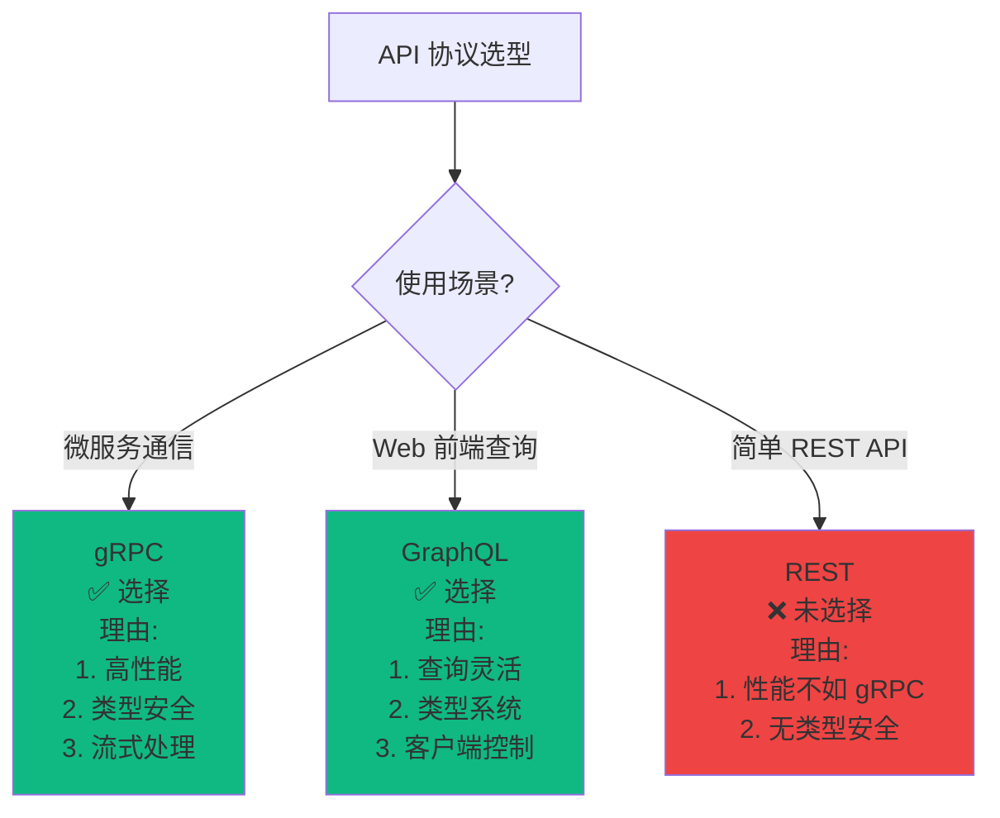

# 技术栈选型决策树

> **简介**: 本文档提供技术栈选型的决策树，帮助理解技术选型的决策过程。

**版本**: v1.0
**更新日期**: 2025-11-11
**适用于**: Go 1.25.3

---

## 📋 目录

- [技术栈选型决策树](#技术栈选型决策树)
  - [📋 目录](#-目录)
  - [1. 可观测性技术栈选型决策树](#1-可观测性技术栈选型决策树)
  - [2. 消息队列选型决策树](#2-消息队列选型决策树)
  - [3. 配置管理选型决策树](#3-配置管理选型决策树)
  - [4. 日志库选型决策树](#4-日志库选型决策树)
  - [5. API 协议选型决策树](#5-api-协议选型决策树)
  - [6. 扩展阅读](#6-扩展阅读)

---

## 1. 可观测性技术栈选型决策树

---

## 2. 消息队列选型决策树

---

## 3. 配置管理选型决策树

---

## 4. 日志库选型决策树

---

## 5. API 协议选型决策树

---

## 6. 扩展阅读

- [技术栈概览](./00-技术栈概览.md) - 技术栈概览
- [技术栈集成](./01-技术栈集成.md) - 技术栈集成架构和最佳实践
- [架构文档索引](../README.md) - 架构文档索引

---

> 📚 **简介**
> 本文档提供了技术栈选型的决策树，帮助理解技术选型的决策过程和理由。
