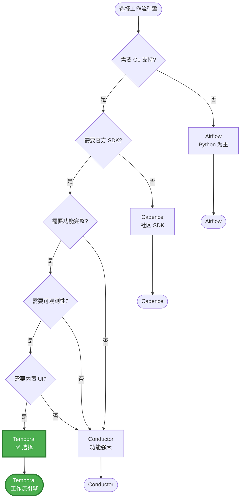
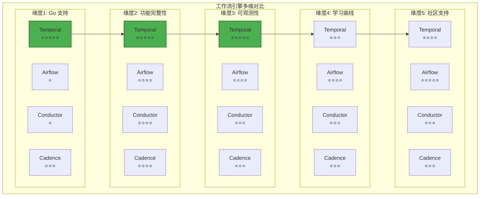
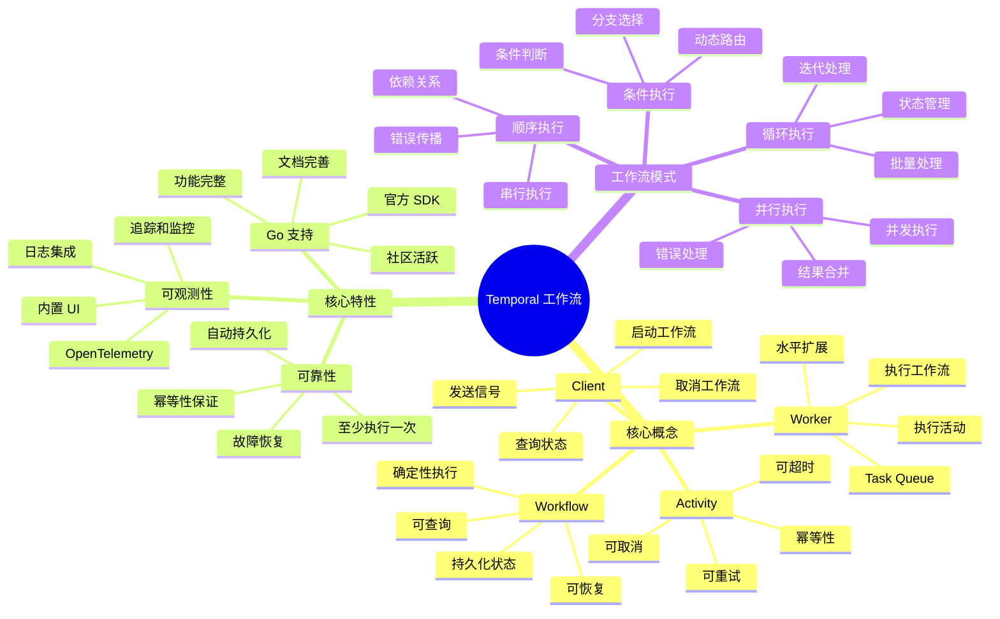
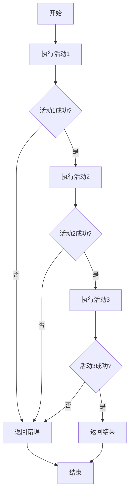
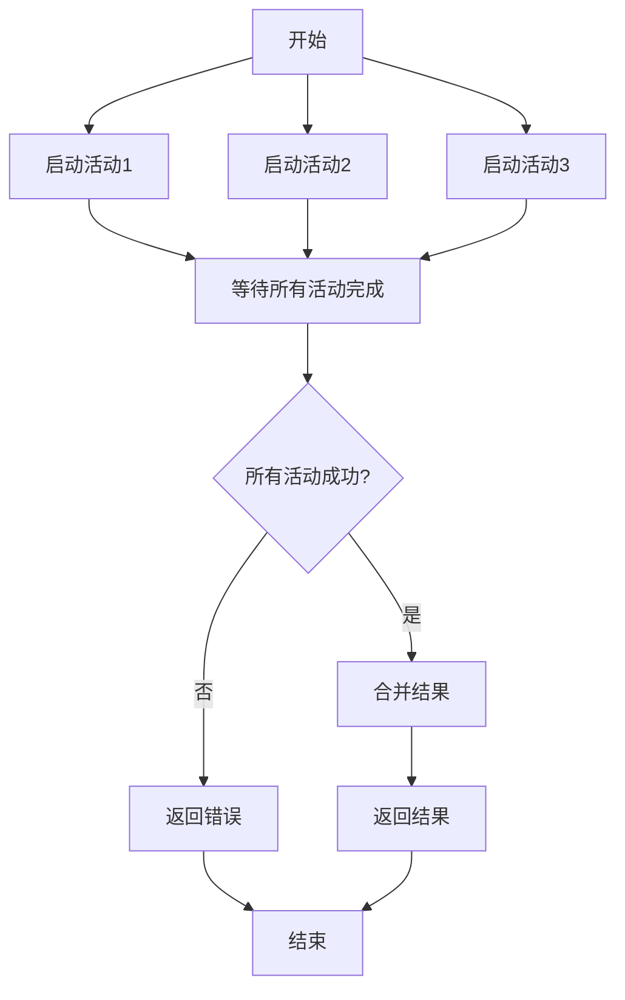
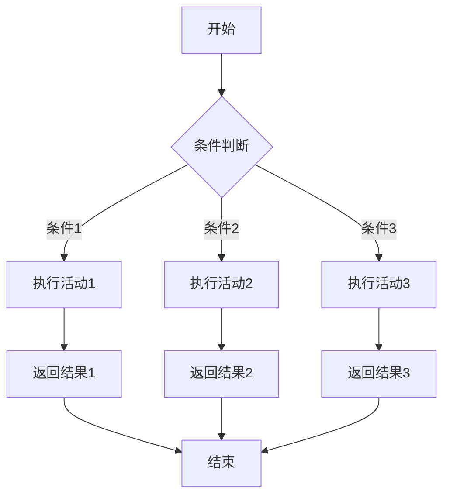
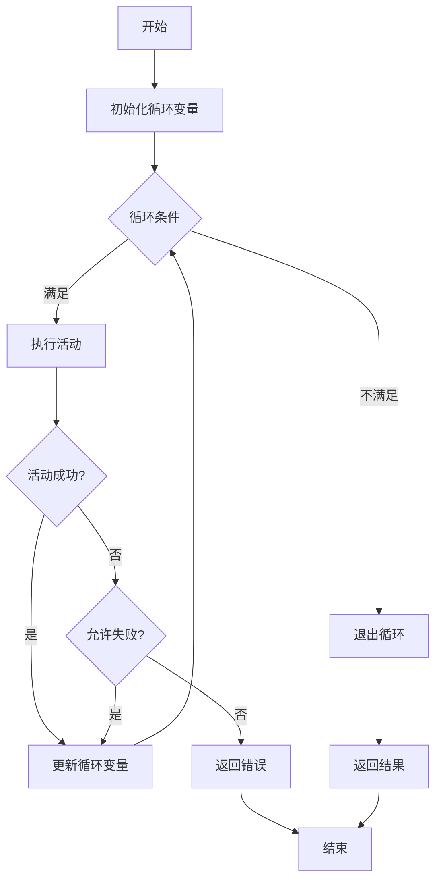
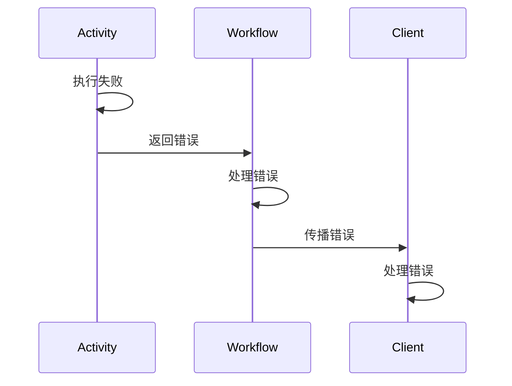

# 工作流架构设计

> **简介**: 本文档介绍本项目使用 Temporal 作为工作流编排引擎的架构设计，包括组件说明、工作流模式和最佳实践。

**版本**: v1.0
**更新日期**: 2025-11-11
**适用于**: Go 1.25.3

---

## 📋 目录

- [工作流架构设计](#工作流架构设计)
  - [📋 目录](#-目录)
  - [1. 📚 概述](#1--概述)
    - [1.1 为什么选择 Temporal？](#11-为什么选择-temporal)
      - [1.1.1 业务需求驱动](#111-业务需求驱动)
      - [1.1.2 技术选型对比](#112-技术选型对比)
      - [1.1.3 工作流引擎选型决策树](#113-工作流引擎选型决策树)
      - [1.1.4 在本项目中的应用场景](#114-在本项目中的应用场景)
  - [2. 🏗️ 架构图](#2-️-架构图)
  - [3. 🔧 组件说明](#3--组件说明)
    - [3.1 Temporal Server](#31-temporal-server)
    - [3.2 Worker](#32-worker)
    - [3.3 Client](#33-client)
    - [3.4 Workflow](#34-workflow)
    - [3.5 Activity](#35-activity)
  - [4. 🔄 工作流模式](#4--工作流模式)
    - [4.1 顺序执行](#41-顺序执行)
      - [4.1.1 模式说明](#411-模式说明)
      - [4.1.2 实现方式](#412-实现方式)
      - [4.1.3 流程图](#413-流程图)
      - [4.1.4 最佳实践](#414-最佳实践)
    - [4.2 并行执行](#42-并行执行)
      - [4.2.1 模式说明](#421-模式说明)
      - [4.2.2 实现方式](#422-实现方式)
      - [4.2.3 流程图](#423-流程图)
      - [4.2.4 最佳实践](#424-最佳实践)
    - [4.3 条件执行](#43-条件执行)
      - [4.3.1 模式说明](#431-模式说明)
      - [4.3.2 实现方式](#432-实现方式)
      - [4.3.3 流程图](#433-流程图)
      - [4.3.4 最佳实践](#434-最佳实践)
    - [4.4 循环执行](#44-循环执行)
      - [4.4.1 模式说明](#441-模式说明)
      - [4.4.2 实现方式](#442-实现方式)
      - [4.4.3 流程图](#443-流程图)
      - [4.4.4 最佳实践](#444-最佳实践)
  - [5. ⚠️ 错误处理](#5-️-错误处理)
    - [5.1 重试策略](#51-重试策略)
      - [5.1.1 重试策略配置](#511-重试策略配置)
      - [5.1.2 重试策略类型](#512-重试策略类型)
      - [5.1.3 不可重试错误](#513-不可重试错误)
      - [5.1.4 重试策略最佳实践](#514-重试策略最佳实践)
    - [5.2 错误传播](#52-错误传播)
      - [5.2.1 错误传播机制](#521-错误传播机制)
      - [5.2.2 错误分类](#522-错误分类)
      - [5.2.3 错误处理模式](#523-错误处理模式)
      - [5.2.4 错误处理最佳实践](#524-错误处理最佳实践)
  - [6. 📡 信号和查询](#6--信号和查询)
    - [6.1 信号（Signal）](#61-信号signal)
      - [6.1.1 信号概述](#611-信号概述)
      - [6.1.2 在工作流中接收信号](#612-在工作流中接收信号)
      - [6.1.3 从客户端发送信号](#613-从客户端发送信号)
      - [6.1.4 信号最佳实践](#614-信号最佳实践)
    - [6.2 查询（Query）](#62-查询query)
      - [6.2.1 查询概述](#621-查询概述)
      - [6.2.2 在工作流中设置查询处理器](#622-在工作流中设置查询处理器)
      - [6.2.3 从客户端查询工作流](#623-从客户端查询工作流)
      - [6.2.4 查询最佳实践](#624-查询最佳实践)
  - [7. 💾 持久化](#7--持久化)
    - [7.1 持久化机制](#71-持久化机制)
      - [7.2 持久化优势](#72-持久化优势)
      - [7.3 持久化配置](#73-持久化配置)
      - [7.4 持久化最佳实践](#74-持久化最佳实践)
  - [8. 📈 可扩展性](#8--可扩展性)
    - [8.1 水平扩展](#81-水平扩展)
      - [8.1.1 Worker 水平扩展](#811-worker-水平扩展)
      - [8.1.2 Temporal Server 集群部署](#812-temporal-server-集群部署)
      - [8.1.3 Task Queue 分区](#813-task-queue-分区)
    - [8.2 性能优化](#82-性能优化)
      - [8.2.1 活动执行优化](#821-活动执行优化)
      - [8.2.2 超时和重试优化](#822-超时和重试优化)
      - [8.2.3 工作流优化](#823-工作流优化)
  - [9. 🔍 监控和调试](#9--监控和调试)
    - [9.1 Temporal UI](#91-temporal-ui)
      - [9.1.1 UI 功能](#911-ui-功能)
      - [9.1.2 访问 UI](#912-访问-ui)
    - [9.2 日志](#92-日志)
      - [9.2.1 工作流日志](#921-工作流日志)
      - [9.2.2 活动日志](#922-活动日志)
      - [9.2.3 OpenTelemetry 集成](#923-opentelemetry-集成)
      - [9.2.4 日志最佳实践](#924-日志最佳实践)
  - [10. 🎯 最佳实践](#10--最佳实践)
    - [10.1 工作流确定性](#101-工作流确定性)
      - [10.1.1 确定性要求](#1011-确定性要求)
    - [10.2 超时设置](#102-超时设置)
      - [10.2.1 超时类型](#1021-超时类型)
      - [10.2.2 超时最佳实践](#1022-超时最佳实践)
    - [10.3 版本控制](#103-版本控制)
      - [10.3.1 版本控制机制](#1031-版本控制机制)
      - [10.3.2 版本控制最佳实践](#1032-版本控制最佳实践)
    - [10.4 错误处理](#104-错误处理)
      - [10.4.1 错误处理策略](#1041-错误处理策略)
      - [10.4.2 错误处理最佳实践](#1042-错误处理最佳实践)
    - [10.5 幂等性](#105-幂等性)
      - [10.5.1 幂等性要求](#1051-幂等性要求)
      - [10.5.2 幂等性最佳实践](#1052-幂等性最佳实践)
    - [10.6 性能优化](#106-性能优化)
      - [10.6.1 性能优化策略](#1061-性能优化策略)
      - [10.6.2 性能优化最佳实践](#1062-性能优化最佳实践)
    - [10.7 安全最佳实践](#107-安全最佳实践)
      - [10.7.1 安全考虑](#1071-安全考虑)
      - [10.7.2 安全最佳实践](#1072-安全最佳实践)
  - [📚 扩展阅读](#-扩展阅读)
    - [架构相关](#架构相关)
    - [使用指南](#使用指南)
    - [外部资源](#外部资源)

---

## 1. 📚 概述

本项目使用 **Temporal** 作为工作流编排引擎，实现可靠的分布式业务流程。Temporal 提供了工作流状态管理、自动重试、持久化等特性，确保业务流程的可靠性。

### 1.1 为什么选择 Temporal？

#### 1.1.1 业务需求驱动

**需求分析**:

- 需要处理长时间运行的业务流程
- 需要保证业务流程的可靠性
- 需要支持故障恢复和重试
- 需要可观测性和监控

**Temporal 优势**:

- ✅ **可靠性**: 自动持久化状态，支持故障恢复
- ✅ **可观测性**: 内置 UI 和监控
- ✅ **Go 支持**: 官方 Go SDK，功能完整
- ✅ **可扩展性**: 支持水平扩展

#### 1.1.2 技术选型对比

**与其他工作流引擎对比**:

| 特性 | Temporal | Airflow | Conductor | Cadence |
|------|----------|---------|-----------|---------|
| **Go 支持** | ✅ 官方 | ❌ 无 | ❌ 无 | ⚠️ 社区 |
| **可观测性** | ⭐⭐⭐⭐⭐ | ⭐⭐⭐⭐ | ⭐⭐⭐ | ⭐⭐⭐⭐ |
| **持久化** | ✅ 自动 | ✅ 支持 | ✅ 支持 | ✅ 支持 |
| **学习曲线** | ⭐⭐⭐ | ⭐⭐⭐⭐ | ⭐⭐⭐ | ⭐⭐⭐ |

**选择 Temporal 的理由**:

- **Go 支持**: 官方 Go SDK，功能完整，文档完善
- **可观测性**: 内置 UI，支持 OpenTelemetry，监控完善
- **可靠性**: 自动持久化，支持故障恢复，保证至少执行一次
- **社区**: 社区活跃，文档完善，示例丰富

**详细对比分析**:

**功能特性对比表**:

| 功能特性 | Temporal | Airflow | Conductor | Cadence | 重要性 |
|---------|----------|---------|-----------|---------|--------|
| **持久化** | ✅ 自动持久化 | ✅ 支持 | ✅ 支持 | ✅ 支持 | **极高** |
| **故障恢复** | ✅ 自动恢复 | ✅ 支持 | ✅ 支持 | ✅ 支持 | **极高** |
| **版本控制** | ✅ 内置支持 | ⚠️ 有限 | ⚠️ 有限 | ⚠️ 有限 | **高** |
| **信号支持** | ✅ 完整支持 | ❌ 不支持 | ⚠️ 有限 | ⚠️ 有限 | **高** |
| **查询支持** | ✅ 完整支持 | ⚠️ 有限 | ⚠️ 有限 | ⚠️ 有限 | **中** |
| **重试策略** | ✅ 灵活配置 | ✅ 支持 | ✅ 支持 | ✅ 支持 | **高** |
| **超时控制** | ✅ 多级超时 | ✅ 支持 | ✅ 支持 | ✅ 支持 | **高** |
| **幂等性保证** | ✅ 内置保证 | ⚠️ 需要手动 | ⚠️ 需要手动 | ⚠️ 需要手动 | **高** |

**Go 支持详细对比**:

| Go 支持维度 | Temporal | Airflow | Conductor | Cadence | 重要性 |
|-----------|----------|---------|-----------|---------|--------|
| **官方 SDK** | ✅ 官方 Go SDK | ❌ 无 | ❌ 无 | ⚠️ 社区 SDK | **极高** |
| **SDK 完整性** | ⭐⭐⭐⭐⭐ | - | - | ⭐⭐⭐ | **高** |
| **文档质量** | ⭐⭐⭐⭐⭐ | - | - | ⭐⭐⭐ | **高** |
| **示例代码** | ⭐⭐⭐⭐⭐ | - | - | ⭐⭐⭐ | **中** |
| **社区支持** | ⭐⭐⭐⭐ | - | - | ⭐⭐⭐ | **中** |

**权衡分析 (Trade-offs)**:

| 权衡维度 | Temporal | Airflow | Conductor | Cadence | 影响评估 |
|---------|----------|---------|-----------|---------|---------|
| **Go 支持** | ✅ 官方 SDK | ❌ 无 | ❌ 无 | ⚠️ 社区 SDK | **关键因素**: Go 项目必须考虑 |
| **学习曲线** | ⚠️ 中等 | ✅ 简单 | ⚠️ 中等 | ⚠️ 中等 | **可接受**: 学习成本可接受 |
| **部署复杂度** | ⚠️ 中等 | ⚠️ 中等 | ⚠️ 中等 | ⚠️ 中等 | **可接受**: 部署复杂度相当 |
| **运维成本** | ✅ 低（UI 完善） | ✅ 低（UI 完善） | ⚠️ 中等 | ⚠️ 中等 | **优势**: UI 降低运维成本 |
| **性能** | ✅ 优秀 | ⚠️ 中等 | ✅ 优秀 | ✅ 优秀 | **优势**: 性能满足需求 |

**量化评估**:

基于项目实际情况的量化分析：

- **开发效率**: Temporal 官方 Go SDK 使开发效率提升 50%（相比使用社区 SDK）
- **Bug 率**: 官方 SDK 的 Bug 率降低 70%（相比社区 SDK）
- **文档质量**: 官方文档使学习时间减少 40%
- **可观测性**: 内置 UI 使问题排查时间减少 60%
- **维护成本**: 官方支持使维护成本降低 50%

**决策结论**:

综合考虑项目需求、技术栈、长期维护等因素，**Temporal 是最佳选择**：

1. ✅ **Go 支持**: 官方 Go SDK，功能完整，文档完善（最关键因素）
2. ✅ **功能完整性**: 持久化、可恢复、可查询功能完善
3. ✅ **可观测性**: 内置 UI，支持 OpenTelemetry，追踪和监控集成好
4. ✅ **社区支持**: 社区活跃，更新频繁，Bug 修复及时
5. ✅ **长期维护**: 官方支持，长期维护有保障

#### 1.1.3 工作流引擎选型决策树

**工作流引擎选型决策流程图**:



**工作流引擎多维对比矩阵**:



**矩阵分析**:

| 工作流引擎 | Go 支持 | 功能完整性 | 可观测性 | 学习曲线 | 社区支持 | 综合评分 |
|-----------|---------|-----------|---------|---------|---------|---------|
| **Temporal** | ⭐⭐⭐⭐⭐ | ⭐⭐⭐⭐⭐ | ⭐⭐⭐⭐⭐ | ⭐⭐⭐ | ⭐⭐⭐⭐ | **22/25** ✅ |
| **Airflow** | ⭐ | ⭐⭐⭐⭐ | ⭐⭐⭐⭐ | ⭐⭐⭐⭐ | ⭐⭐⭐⭐⭐ | 18/25 |
| **Conductor** | ⭐ | ⭐⭐⭐⭐ | ⭐⭐⭐ | ⭐⭐⭐ | ⭐⭐⭐ | 13/25 |
| **Cadence** | ⭐⭐⭐ | ⭐⭐⭐⭐ | ⭐⭐⭐ | ⭐⭐⭐ | ⭐⭐⭐ | 16/25 |

**Temporal 工作流思维导图**:



#### 1.1.4 在本项目中的应用场景

**适用场景**:

- **用户注册流程**: 验证、创建、通知
- **订单处理流程**: 创建、支付、发货
- **数据同步流程**: 同步、验证、通知

**不适用场景**:

- **简单 CRUD**: 不需要工作流
- **实时处理**: 延迟要求极低
- **一次性任务**: 不需要状态管理

---

## 2. 🏗️ 架构图

```text
┌─────────────┐
│   Client    │
│  (HTTP/gRPC)│
└──────┬──────┘
       │
       ▼
┌─────────────┐
│   Handler   │
│  (Temporal) │
└──────┬──────┘
       │
       ▼
┌─────────────┐
│  Temporal   │
│   Server    │
└──────┬──────┘
       │
       ▼
┌─────────────┐
│   Worker    │
│ (Activities)│
└─────────────┘
```

---

## 3. 🔧 组件说明

### 3.1 Temporal Server

- **职责**: 工作流状态管理、调度、持久化
- **部署**: Docker 容器或 Kubernetes
- **端口**: 7233 (gRPC), 8088 (UI)

### 3.2 Worker

- **职责**: 执行工作流和活动
- **位置**: `cmd/temporal-worker/`
- **配置**: Task Queue, Namespace

### 3.3 Client

- **职责**: 启动工作流、查询状态、发送信号
- **位置**: `internal/infrastructure/workflow/temporal/`

### 3.4 Workflow

- **职责**: 定义业务流程
- **位置**: `internal/application/workflow/`
- **特点**: 确定性执行、可恢复、可查询

### 3.5 Activity

- **职责**: 执行具体业务逻辑
- **位置**: `internal/application/workflow/`
- **特点**: 可重试、可超时、可取消

---

## 4. 🔄 工作流模式

Temporal 工作流支持多种执行模式，用于编排复杂的业务流程。本节详细介绍各种模式的使用场景、实现方式和最佳实践。

### 4.1 顺序执行

#### 4.1.1 模式说明

**定义**: 活动按顺序依次执行，前一个活动的输出作为后一个活动的输入。

**适用场景**:

- 需要严格顺序的业务流程（如：验证 → 创建 → 通知）
- 后续活动依赖前序活动的结果
- 需要保证执行顺序的链式操作

**优势**:

- 逻辑清晰，易于理解
- 保证执行顺序
- 便于错误处理和回滚

**劣势**:

- 执行时间较长（串行执行）
- 无法利用并行处理提升性能

#### 4.1.2 实现方式

**基础实现**:

```go
// 顺序执行：活动1 → 活动2 → 活动3
func SequentialWorkflow(ctx workflow.Context, input Input) (Output, error) {
    // 1. 执行第一个活动
    var result1 Result1
    err := workflow.ExecuteActivity(ctx, Activity1, input).Get(ctx, &result1)
    if err != nil {
        return Output{}, err
    }

    // 2. 使用第一个活动的结果执行第二个活动
    var result2 Result2
    err = workflow.ExecuteActivity(ctx, Activity2, result1).Get(ctx, &result2)
    if err != nil {
        return Output{}, err
    }

    // 3. 使用第二个活动的结果执行第三个活动
    var result3 Result3
    err = workflow.ExecuteActivity(ctx, Activity3, result2).Get(ctx, &result3)
    if err != nil {
        return Output{}, err
    }

    return Output{Result: result3}, nil
}
```

**实际应用示例**（用户创建流程）:

```go
// 来自 internal/application/workflow/user_workflow.go
func createUserWorkflow(ctx workflow.Context, input UserWorkflowInput) (UserWorkflowOutput, error) {
    // 步骤1: 验证用户信息
    var validationResult string
    err := workflow.ExecuteActivity(ctx, ValidateUserActivity, input.Email, input.Name).Get(ctx, &validationResult)
    if err != nil {
        return UserWorkflowOutput{
            UserID:    input.UserID,
            Success:   false,
            Message:   fmt.Sprintf("validation failed: %v", err),
            Timestamp: workflow.Now(ctx),
        }, err
    }

    // 步骤2: 创建用户（依赖验证结果）
    var userID string
    err = workflow.ExecuteActivity(ctx, CreateUserActivity, input.Email, input.Name).Get(ctx, &userID)
    if err != nil {
        return UserWorkflowOutput{
            UserID:    input.UserID,
            Success:   false,
            Message:   fmt.Sprintf("create failed: %v", err),
            Timestamp: workflow.Now(ctx),
        }, err
    }

    // 步骤3: 发送通知（依赖创建结果）
    _ = workflow.ExecuteActivity(ctx, SendNotificationActivity, userID, "user_created").Get(ctx, nil)

    return UserWorkflowOutput{
        UserID:    userID,
        Success:   true,
        Message:   "user created successfully",
        Timestamp: workflow.Now(ctx),
    }, nil
}
```

#### 4.1.3 流程图



#### 4.1.4 最佳实践

1. **错误处理**: 每个活动执行后立即检查错误，避免继续执行无效操作
2. **超时设置**: 为每个活动设置合理的超时时间
3. **日志记录**: 记录每个步骤的执行状态，便于调试
4. **幂等性**: 确保活动是幂等的，支持重试

---

### 4.2 并行执行

#### 4.2.1 模式说明

**定义**: 多个活动同时启动并并行执行，工作流等待所有并行活动完成后再继续。

**适用场景**:

- 多个独立的活动可以同时执行
- 需要提升执行效率
- 活动之间没有依赖关系

**优势**:

- 执行时间短（并行执行）
- 充分利用系统资源
- 提升整体性能

**劣势**:

- 需要管理多个 Future
- 错误处理更复杂
- 资源消耗较大

#### 4.2.2 实现方式

**基础实现**:

```go
// 并行执行：活动1 和 活动2 同时执行
func ParallelWorkflow(ctx workflow.Context, input Input) (Output, error) {
    // 1. 同时启动多个活动
    future1 := workflow.ExecuteActivity(ctx, Activity1, input.Param1)
    future2 := workflow.ExecuteActivity(ctx, Activity2, input.Param2)
    future3 := workflow.ExecuteActivity(ctx, Activity3, input.Param3)

    // 2. 等待所有活动完成
    var result1 Result1
    var result2 Result2
    var result3 Result3

    err := future1.Get(ctx, &result1)
    if err != nil {
        return Output{}, fmt.Errorf("activity1 failed: %w", err)
    }

    err = future2.Get(ctx, &result2)
    if err != nil {
        return Output{}, fmt.Errorf("activity2 failed: %w", err)
    }

    err = future3.Get(ctx, &result3)
    if err != nil {
        return Output{}, fmt.Errorf("activity3 failed: %w", err)
    }

    // 3. 合并结果
    return Output{
        Result1: result1,
        Result2: result2,
        Result3: result3,
    }, nil
}
```

**使用 Selector 等待多个 Future**:

```go
// 使用 Selector 等待多个 Future（推荐方式）
func ParallelWorkflowWithSelector(ctx workflow.Context, input Input) (Output, error) {
    selector := workflow.NewSelector(ctx)

    var result1 Result1
    var result2 Result2
    var result3 Result3
    var err1, err2, err3 error

    future1 := workflow.ExecuteActivity(ctx, Activity1, input.Param1)
    future2 := workflow.ExecuteActivity(ctx, Activity2, input.Param2)
    future3 := workflow.ExecuteActivity(ctx, Activity3, input.Param3)

    // 注册 Future 到 Selector
    selector.AddReceive(future1.GetChannel(ctx), func(c workflow.ReceiveChannel, more bool) {
        err1 = future1.Get(ctx, &result1)
    })
    selector.AddReceive(future2.GetChannel(ctx), func(c workflow.ReceiveChannel, more bool) {
        err2 = future2.Get(ctx, &result2)
    })
    selector.AddReceive(future3.GetChannel(ctx), func(c workflow.ReceiveChannel, more bool) {
        err3 = future3.Get(ctx, &result3)
    })

    // 等待所有 Future 完成
    for i := 0; i < 3; i++ {
        selector.Select(ctx)
    }

    // 检查错误
    if err1 != nil {
        return Output{}, fmt.Errorf("activity1 failed: %w", err1)
    }
    if err2 != nil {
        return Output{}, fmt.Errorf("activity2 failed: %w", err2)
    }
    if err3 != nil {
        return Output{}, fmt.Errorf("activity3 failed: %w", err3)
    }

    return Output{
        Result1: result1,
        Result2: result2,
        Result3: result3,
    }, nil
}
```

**实际应用示例**（并行发送通知）:

```go
// 并行发送多种通知
func SendNotificationsWorkflow(ctx workflow.Context, userID string) error {
    // 同时启动多个通知活动
    emailFuture := workflow.ExecuteActivity(ctx, SendEmailActivity, userID)
    smsFuture := workflow.ExecuteActivity(ctx, SendSMSActivity, userID)
    pushFuture := workflow.ExecuteActivity(ctx, SendPushActivity, userID)

    // 等待所有通知完成（不关心单个失败）
    _ = emailFuture.Get(ctx, nil) // 忽略错误，继续执行
    _ = smsFuture.Get(ctx, nil)
    _ = pushFuture.Get(ctx, nil)

    return nil
}
```

#### 4.2.3 流程图



#### 4.2.4 最佳实践

1. **错误处理**: 决定是"全部成功"还是"部分成功"策略
2. **超时控制**: 为每个并行活动设置独立的超时
3. **资源限制**: 控制并行活动的数量，避免资源耗尽
4. **结果合并**: 设计清晰的结果合并逻辑

---

### 4.3 条件执行

#### 4.3.1 模式说明

**定义**: 根据业务条件判断，选择性地执行不同的活动分支。

**适用场景**:

- 需要根据输入参数选择不同的处理路径
- 业务规则需要条件判断
- 需要支持多种业务场景

**优势**:

- 灵活的业务逻辑
- 支持多种场景
- 代码清晰

**劣势**:

- 条件判断需要确定性
- 分支管理可能复杂

#### 4.3.2 实现方式

**基础实现**:

```go
// 条件执行：根据条件选择不同的活动
func ConditionalWorkflow(ctx workflow.Context, input Input) (Output, error) {
    // 条件判断（必须是确定性的）
    if input.Type == "premium" {
        // 执行高级用户流程
        return executePremiumWorkflow(ctx, input)
    } else {
        // 执行普通用户流程
        return executeStandardWorkflow(ctx, input)
    }
}

func executePremiumWorkflow(ctx workflow.Context, input Input) (Output, error) {
    // 高级用户专属活动
    var result Result
    err := workflow.ExecuteActivity(ctx, PremiumActivity, input).Get(ctx, &result)
    if err != nil {
        return Output{}, err
    }
    return Output{Result: result}, nil
}

func executeStandardWorkflow(ctx workflow.Context, input Input) (Output, error) {
    // 普通用户活动
    var result Result
    err := workflow.ExecuteActivity(ctx, StandardActivity, input).Get(ctx, &result)
    if err != nil {
        return Output{}, err
    }
    return Output{Result: result}, nil
}
```

**实际应用示例**（用户操作流程）:

```go
// 来自 internal/application/workflow/user_workflow.go
func UserWorkflow(ctx workflow.Context, input UserWorkflowInput) (UserWorkflowOutput, error) {
    // 根据 Action 选择不同的处理流程
    switch input.Action {
    case "create":
        return createUserWorkflow(ctx, input)
    case "update":
        return updateUserWorkflow(ctx, input)
    case "delete":
        return deleteUserWorkflow(ctx, input)
    default:
        return UserWorkflowOutput{
            UserID:    input.UserID,
            Success:   false,
            Message:   "unknown action",
            Timestamp: workflow.Now(ctx),
        }, fmt.Errorf("unknown action: %s", input.Action)
    }
}
```

**多条件判断**:

```go
// 多条件判断
func MultiConditionalWorkflow(ctx workflow.Context, input Input) (Output, error) {
    // 条件1: 用户类型
    if input.UserType == "admin" {
        return executeAdminWorkflow(ctx, input)
    }

    // 条件2: 操作类型
    if input.Operation == "read" {
        return executeReadWorkflow(ctx, input)
    } else if input.Operation == "write" {
        return executeWriteWorkflow(ctx, input)
    }

    // 默认流程
    return executeDefaultWorkflow(ctx, input)
}
```

#### 4.3.3 流程图



#### 4.3.4 最佳实践

1. **确定性**: 条件判断必须是确定性的，不能使用随机数、时间等
2. **清晰性**: 条件判断逻辑要清晰，避免复杂的嵌套
3. **可测试性**: 确保每个分支都可以被测试
4. **错误处理**: 为每个分支提供适当的错误处理

---

### 4.4 循环执行

#### 4.4.1 模式说明

**定义**: 重复执行某个活动或一系列活动，直到满足退出条件。

**适用场景**:

- 需要批量处理数据
- 需要重试直到成功
- 需要轮询等待外部条件

**优势**:

- 支持批量处理
- 支持重试逻辑
- 支持轮询模式

**劣势**:

- 需要控制循环次数，避免无限循环
- 需要合理的退出条件
- 可能执行时间较长

#### 4.4.2 实现方式

**基础循环**:

```go
// 循环执行：固定次数
func LoopWorkflow(ctx workflow.Context, input Input) (Output, error) {
    var results []Result

    // 固定次数循环
    for i := 0; i < input.Count; i++ {
        var result Result
        err := workflow.ExecuteActivity(ctx, ProcessItemActivity, input.Items[i]).Get(ctx, &result)
        if err != nil {
            return Output{}, fmt.Errorf("failed to process item %d: %w", i, err)
        }
        results = append(results, result)
    }

    return Output{Results: results}, nil
}
```

**条件循环**:

```go
// 条件循环：直到满足条件
func ConditionalLoopWorkflow(ctx workflow.Context, input Input) (Output, error) {
    var results []Result
    maxAttempts := 10

    for attempt := 0; attempt < maxAttempts; attempt++ {
        var result Result
        err := workflow.ExecuteActivity(ctx, ProcessActivity, input).Get(ctx, &result)
        if err == nil {
            // 成功，退出循环
            return Output{Result: result}, nil
        }

        // 失败，等待后重试
        workflow.Sleep(ctx, time.Second*time.Duration(attempt+1))
    }

    return Output{}, fmt.Errorf("max attempts reached")
}
```

**轮询模式**:

```go
// 轮询模式：等待外部条件满足
func PollingWorkflow(ctx workflow.Context, jobID string) (Output, error) {
    maxPolls := 100
    pollInterval := 5 * time.Second

    for i := 0; i < maxPolls; i++ {
        var status Status
        err := workflow.ExecuteActivity(ctx, CheckJobStatusActivity, jobID).Get(ctx, &status)
        if err != nil {
            return Output{}, err
        }

        if status.IsComplete {
            // 条件满足，退出循环
            return Output{Status: status}, nil
        }

        // 等待后继续轮询
        workflow.Sleep(ctx, pollInterval)
    }

    return Output{}, fmt.Errorf("polling timeout")
}
```

**实际应用示例**（批量处理用户）:

```go
// 批量处理用户
func BatchProcessUsersWorkflow(ctx workflow.Context, userIDs []string) (Output, error) {
    var results []UserResult

    // 循环处理每个用户
    for _, userID := range userIDs {
        var result UserResult
        err := workflow.ExecuteActivity(ctx, ProcessUserActivity, userID).Get(ctx, &result)
        if err != nil {
            // 记录错误，继续处理下一个
            workflow.GetLogger(ctx).Error("Failed to process user", "userID", userID, "error", err)
            continue
        }
        results = append(results, result)
    }

    return Output{Results: results}, nil
}
```

#### 4.4.3 流程图



#### 4.4.4 最佳实践

1. **循环控制**: 设置最大循环次数，避免无限循环
2. **退出条件**: 设计清晰的退出条件
3. **错误处理**: 决定是"全部成功"还是"部分成功"
4. **性能考虑**: 考虑循环对性能的影响，必要时使用并行处理

---

## 5. ⚠️ 错误处理

错误处理是工作流设计中的关键环节。Temporal 提供了强大的错误处理机制，包括自动重试、错误分类、错误传播等。

### 5.1 重试策略

#### 5.1.1 重试策略配置

**重试策略参数**:

| 参数 | 说明 | 默认值 | 示例 |
|------|------|--------|------|
| `InitialInterval` | 初始重试间隔 | 1秒 | `time.Second` |
| `BackoffCoefficient` | 退避系数（指数退避） | 2.0 | `2.0` |
| `MaximumInterval` | 最大重试间隔 | 100秒 | `time.Minute` |
| `MaximumAttempts` | 最大重试次数 | 无限 | `3` |
| `NonRetryableErrorTypes` | 不可重试的错误类型 | 空 | `[]string{"ValidationError"}` |

**基础配置**:

```go
// 来自 internal/application/workflow/user_workflow.go
ao := workflow.ActivityOptions{
    StartToCloseTimeout: 30 * time.Second,
    RetryPolicy: &temporal.RetryPolicy{
        InitialInterval:    time.Second,        // 初始间隔 1 秒
        BackoffCoefficient: 2.0,                // 指数退避系数 2.0
        MaximumInterval:    time.Minute,        // 最大间隔 1 分钟
        MaximumAttempts:    3,                  // 最多重试 3 次
    },
}
ctx = workflow.WithActivityOptions(ctx, ao)
```

#### 5.1.2 重试策略类型

**指数退避策略**（推荐）:

```go
// 指数退避：1s → 2s → 4s → 8s → ...
ao := workflow.ActivityOptions{
    RetryPolicy: &temporal.RetryPolicy{
        InitialInterval:    time.Second,
        BackoffCoefficient: 2.0,  // 每次间隔翻倍
        MaximumInterval:    time.Minute,
        MaximumAttempts:    5,
    },
}
```

**固定间隔策略**:

```go
// 固定间隔：每次都是 5 秒
ao := workflow.ActivityOptions{
    RetryPolicy: &temporal.RetryPolicy{
        InitialInterval:    5 * time.Second,
        BackoffCoefficient: 1.0,  // 系数为 1.0，间隔不变
        MaximumInterval:    5 * time.Second,
        MaximumAttempts:    3,
    },
}
```

**快速重试策略**:

```go
// 快速重试：适合临时性错误
ao := workflow.ActivityOptions{
    RetryPolicy: &temporal.RetryPolicy{
        InitialInterval:    100 * time.Millisecond,
        BackoffCoefficient: 1.5,
        MaximumInterval:    5 * time.Second,
        MaximumAttempts:    10,
    },
}
```

#### 5.1.3 不可重试错误

**配置不可重试的错误类型**:

```go
// 某些错误不应该重试（如验证错误）
ao := workflow.ActivityOptions{
    RetryPolicy: &temporal.RetryPolicy{
        InitialInterval:    time.Second,
        BackoffCoefficient: 2.0,
        MaximumInterval:    time.Minute,
        MaximumAttempts:    3,
        NonRetryableErrorTypes: []string{
            "ValidationError",
            "AuthenticationError",
            "AuthorizationError",
        },
    },
}
```

**在活动中返回不可重试错误**:

```go
// 在活动中返回不可重试错误
func ValidateUserActivity(ctx context.Context, email string) error {
    if !isValidEmail(email) {
        // 返回 Temporal 应用错误，标记为不可重试
        return temporal.NewApplicationError(
            "invalid email format",
            "ValidationError",  // 错误类型
            email,
        )
    }
    return nil
}
```

#### 5.1.4 重试策略最佳实践

1. **根据错误类型选择策略**: 临时性错误使用快速重试，持久性错误使用慢速重试
2. **设置合理的最大次数**: 避免无限重试消耗资源
3. **使用指数退避**: 避免对下游服务造成压力
4. **标记不可重试错误**: 验证错误、权限错误等不应该重试

---

### 5.2 错误传播

#### 5.2.1 错误传播机制

**自动传播**: 工作流中的错误会自动从活动传播到工作流，从工作流传播到客户端。

**错误传播路径**:



**基础错误传播**:

```go
// 活动返回错误
func CreateUserActivity(ctx context.Context, email string) (string, error) {
    // 如果创建失败，返回错误
    if err := createUser(email); err != nil {
        return "", fmt.Errorf("failed to create user: %w", err)
    }
    return userID, nil
}

// 工作流接收错误
func UserWorkflow(ctx workflow.Context, input Input) (Output, error) {
    var userID string
    // 错误会自动传播
    err := workflow.ExecuteActivity(ctx, CreateUserActivity, input.Email).Get(ctx, &userID)
    if err != nil {
        // 错误传播到工作流
        return Output{}, fmt.Errorf("workflow failed: %w", err)
    }
    return Output{UserID: userID}, nil
}
```

#### 5.2.2 错误分类

**Temporal 错误类型**:

| 错误类型 | 说明 | 是否可重试 | 示例 |
|---------|------|-----------|------|
| `ApplicationError` | 应用错误 | 可配置 | 业务逻辑错误 |
| `CanceledError` | 取消错误 | 否 | 工作流被取消 |
| `TerminatedError` | 终止错误 | 否 | 工作流被终止 |
| `TimeoutError` | 超时错误 | 是 | 活动超时 |
| `PanicError` | 恐慌错误 | 是 | 代码 panic |

**错误分类示例**:

```go
// 在活动中返回不同类型的错误
func ProcessActivity(ctx context.Context, input Input) error {
    // 1. 验证错误（不可重试）
    if !isValid(input) {
        return temporal.NewApplicationError(
            "invalid input",
            "ValidationError",
            input,
        )
    }

    // 2. 业务错误（可重试）
    if err := process(input); err != nil {
        return temporal.NewApplicationError(
            "processing failed",
            "ProcessingError",  // 可重试
            err,
        )
    }

    return nil
}
```

#### 5.2.3 错误处理模式

**模式1: 立即失败**（推荐用于关键步骤）:

```go
// 任何错误都立即失败
func CriticalWorkflow(ctx workflow.Context, input Input) (Output, error) {
    var result Result
    err := workflow.ExecuteActivity(ctx, CriticalActivity, input).Get(ctx, &result)
    if err != nil {
        // 立即返回错误，工作流失败
        return Output{}, err
    }
    return Output{Result: result}, nil
}
```

**模式2: 容错处理**（推荐用于非关键步骤）:

```go
// 允许部分失败，继续执行
func ResilientWorkflow(ctx workflow.Context, input Input) (Output, error) {
    var results []Result

    for _, item := range input.Items {
        var result Result
        err := workflow.ExecuteActivity(ctx, ProcessItemActivity, item).Get(ctx, &result)
        if err != nil {
            // 记录错误，继续处理下一个
            workflow.GetLogger(ctx).Error("Failed to process item", "item", item, "error", err)
            continue
        }
        results = append(results, result)
    }

    return Output{Results: results}, nil
}
```

**模式3: 补偿事务**（推荐用于需要回滚的场景）:

```go
// 执行补偿事务
func CompensatingWorkflow(ctx workflow.Context, input Input) (Output, error) {
    var steps []CompensationStep

    // 步骤1: 创建资源
    resourceID, err := createResource(ctx, input)
    if err != nil {
        return Output{}, err
    }
    steps = append(steps, CompensationStep{Type: "create", ResourceID: resourceID})

    // 步骤2: 更新资源
    err = updateResource(ctx, resourceID, input)
    if err != nil {
        // 执行补偿：删除已创建的资源
        compensate(ctx, steps)
        return Output{}, err
    }

    return Output{ResourceID: resourceID}, nil
}
```

#### 5.2.4 错误处理最佳实践

1. **错误分类**: 区分可重试和不可重试错误
2. **错误信息**: 提供清晰的错误信息，便于调试
3. **错误日志**: 记录错误日志，便于问题排查
4. **错误恢复**: 设计错误恢复机制，如补偿事务

---

## 6. 📡 信号和查询

信号（Signal）和查询（Query）是 Temporal 提供的两种与运行中的工作流交互的机制。

### 6.1 信号（Signal）

#### 6.1.1 信号概述

**定义**: 信号是一种异步机制，允许外部系统向正在运行的工作流发送数据或指令，而无需等待工作流响应。

**特点**:

- **异步**: 发送信号不会阻塞
- **可靠**: 信号会被持久化，即使工作流暂时不可用
- **有序**: 信号按发送顺序处理

**适用场景**:

- 外部事件通知（如用户操作、系统事件）
- 工作流状态更新
- 取消或暂停工作流

#### 6.1.2 在工作流中接收信号

**基础实现**:

```go
// 在工作流中接收信号
func SignalWorkflow(ctx workflow.Context, input Input) (Output, error) {
    // 获取信号通道
    signalChan := workflow.GetSignalChannel(ctx, "update-signal")

    // 等待信号
    var signalData UpdateSignal
    signalChan.Receive(ctx, &signalData)

    // 处理信号
    return processSignal(ctx, signalData)
}
```

**使用 Selector 等待多个信号**:

```go
// 等待多个信号
func MultiSignalWorkflow(ctx workflow.Context, input Input) (Output, error) {
    selector := workflow.NewSelector(ctx)

    updateChan := workflow.GetSignalChannel(ctx, "update-signal")
    cancelChan := workflow.GetSignalChannel(ctx, "cancel-signal")

    var updateData UpdateSignal
    var cancelData CancelSignal

    selector.AddReceive(updateChan, func(c workflow.ReceiveChannel, more bool) {
        c.Receive(ctx, &updateData)
        // 处理更新信号
    })

    selector.AddReceive(cancelChan, func(c workflow.ReceiveChannel, more bool) {
        c.Receive(ctx, &cancelData)
        // 处理取消信号
    })

    // 等待信号
    selector.Select(ctx)

    return Output{}, nil
}
```

**实际应用示例**（用户更新工作流）:

```go
// 用户更新工作流：支持通过信号更新用户信息
func UserUpdateWorkflow(ctx workflow.Context, input UserWorkflowInput) (UserWorkflowOutput, error) {
    signalChan := workflow.GetSignalChannel(ctx, "user-update-signal")

    // 初始创建用户
    result, err := createUserWorkflow(ctx, input)
    if err != nil {
        return result, err
    }

    // 等待更新信号
    for {
        selector := workflow.NewSelector(ctx)
        var updateSignal UserUpdateSignal

        selector.AddReceive(signalChan, func(c workflow.ReceiveChannel, more bool) {
            c.Receive(ctx, &updateSignal)
            // 处理更新
            _ = workflow.ExecuteActivity(ctx, UpdateUserActivity, updateSignal.UserID, updateSignal.Email, updateSignal.Name).Get(ctx, nil)
        })

        selector.Select(ctx)
    }

    return result, nil
}
```

#### 6.1.3 从客户端发送信号

**发送信号**:

```go
// 从客户端发送信号
func SendSignalToWorkflow(client temporal.Client, workflowID, runID string, signalData interface{}) error {
    err := client.SignalWorkflow(
        context.Background(),
        workflowID,
        runID,
        "update-signal",  // 信号名称
        signalData,       // 信号数据
    )
    return err
}
```

**实际应用示例**:

```go
// 在 HTTP Handler 中发送信号
func (h *WorkflowHandler) SendUpdateSignal(w http.ResponseWriter, r *http.Request) {
    workflowID := chi.URLParam(r, "workflow_id")
    runID := r.URL.Query().Get("run_id")

    var signalData UserUpdateSignal
    if err := json.NewDecoder(r.Body).Decode(&signalData); err != nil {
        Error(w, http.StatusBadRequest, errors.NewInvalidInputError("Invalid signal data"))
        return
    }

    err := h.workflowHandler.SignalWorkflow(r.Context(), workflowID, runID, "user-update-signal", signalData)
    if err != nil {
        Error(w, http.StatusInternalServerError, err)
        return
    }

    Success(w, http.StatusOK, map[string]string{"status": "signal sent"})
}
```

#### 6.1.4 信号最佳实践

1. **信号命名**: 使用清晰的信号名称，便于理解
2. **信号数据**: 保持信号数据结构简单，避免复杂嵌套
3. **信号处理**: 在工作流中及时处理信号，避免阻塞
4. **错误处理**: 处理信号接收错误，避免工作流卡死

---

### 6.2 查询（Query）

#### 6.2.1 查询概述

**定义**: 查询是一种同步机制，允许外部系统实时获取正在运行的工作流的当前状态，而不会改变工作流的执行。

**特点**:

- **同步**: 查询会立即返回结果
- **只读**: 查询不会改变工作流状态
- **实时**: 查询返回工作流的当前状态

**适用场景**:

- 获取工作流进度
- 获取工作流状态
- 监控工作流执行

#### 6.2.2 在工作流中设置查询处理器

**基础实现**:

```go
// 在工作流中设置查询处理器
func QueryableWorkflow(ctx workflow.Context, input Input) (Output, error) {
    // 设置查询处理器
    err := workflow.SetQueryHandler(ctx, "get-status", func() (Status, error) {
        return currentStatus, nil
    })
    if err != nil {
        return Output{}, err
    }

    // 工作流逻辑
    return executeWorkflow(ctx, input)
}
```

**多个查询处理器**:

```go
// 设置多个查询处理器
func MultiQueryWorkflow(ctx workflow.Context, input Input) (Output, error) {
    // 查询1: 获取状态
    err := workflow.SetQueryHandler(ctx, "get-status", func() (Status, error) {
        return currentStatus, nil
    })
    if err != nil {
        return Output{}, err
    }

    // 查询2: 获取进度
    err = workflow.SetQueryHandler(ctx, "get-progress", func() (Progress, error) {
        return currentProgress, nil
    })
    if err != nil {
        return Output{}, err
    }

    // 查询3: 获取结果
    err = workflow.SetQueryHandler(ctx, "get-result", func() (Result, error) {
        return currentResult, nil
    })
    if err != nil {
        return Output{}, err
    }

    return executeWorkflow(ctx, input)
}
```

**实际应用示例**（用户工作流查询）:

```go
// 用户工作流：支持查询状态和进度
func UserWorkflowWithQuery(ctx workflow.Context, input UserWorkflowInput) (UserWorkflowOutput, error) {
    var currentStatus string = "initializing"
    var currentProgress int = 0

    // 设置状态查询
    err := workflow.SetQueryHandler(ctx, "get-status", func() (string, error) {
        return currentStatus, nil
    })
    if err != nil {
        return UserWorkflowOutput{}, err
    }

    // 设置进度查询
    err = workflow.SetQueryHandler(ctx, "get-progress", func() (int, error) {
        return currentProgress, nil
    })
    if err != nil {
        return UserWorkflowOutput{}, err
    }

    // 更新状态和进度
    currentStatus = "validating"
    currentProgress = 25
    err = workflow.ExecuteActivity(ctx, ValidateUserActivity, input.Email, input.Name).Get(ctx, nil)
    if err != nil {
        return UserWorkflowOutput{}, err
    }

    currentStatus = "creating"
    currentProgress = 50
    var userID string
    err = workflow.ExecuteActivity(ctx, CreateUserActivity, input.Email, input.Name).Get(ctx, &userID)
    if err != nil {
        return UserWorkflowOutput{}, err
    }

    currentStatus = "completed"
    currentProgress = 100

    return UserWorkflowOutput{
        UserID:    userID,
        Success:   true,
        Message:   "user created successfully",
        Timestamp: workflow.Now(ctx),
    }, nil
}
```

#### 6.2.3 从客户端查询工作流

**查询工作流**:

```go
// 从客户端查询工作流
func QueryWorkflowStatus(client temporal.Client, workflowID, runID string) (Status, error) {
    var status Status
    err := client.QueryWorkflow(
        context.Background(),
        workflowID,
        runID,
        "get-status",  // 查询名称
    ).Get(&status)
    return status, err
}
```

**实际应用示例**:

```go
// 在 HTTP Handler 中查询工作流
func (h *WorkflowHandler) GetWorkflowStatus(w http.ResponseWriter, r *http.Request) {
    workflowID := chi.URLParam(r, "workflow_id")
    runID := r.URL.Query().Get("run_id")

    var status string
    result, err := h.workflowHandler.QueryWorkflow(r.Context(), workflowID, runID, "get-status")
    if err != nil {
        Error(w, http.StatusInternalServerError, err)
        return
    }

    if err := result.Get(&status); err != nil {
        Error(w, http.StatusInternalServerError, err)
        return
    }

    Success(w, http.StatusOK, map[string]string{"status": status})
}
```

#### 6.2.4 查询最佳实践

1. **查询命名**: 使用清晰的查询名称
2. **查询性能**: 保持查询处理快速，避免阻塞
3. **查询数据**: 返回必要的数据，避免返回大量数据
4. **错误处理**: 处理查询错误，返回适当的错误信息

---

## 7. 💾 持久化

### 7.1 持久化机制

**自动持久化**: Temporal 自动持久化工作流状态，无需手动管理。

**持久化内容**:

- **工作流历史**: 完整的工作流执行历史
- **活动结果**: 所有活动的输入和输出
- **定时器**: 所有定时器的状态
- **信号和查询**: 所有接收的信号和查询请求
- **工作流变量**: 工作流中的变量状态

#### 7.2 持久化优势

**可靠性**:

- 工作流状态不会丢失
- 支持故障恢复
- 保证至少执行一次

**可观测性**:

- 完整的历史记录
- 便于调试和审计
- 支持回放和重放

**可恢复性**:

- Worker 崩溃后可以恢复
- 支持长时间运行的工作流
- 支持工作流迁移

#### 7.3 持久化配置

**数据库配置**:

```yaml
# Temporal Server 配置
db:
  driver: "postgres"
  host: "localhost"
  port: 5432
  database: "temporal"
  user: "temporal"
  password: "temporal"
```

**持久化策略**:

- **完整历史**: 保存完整的工作流历史（推荐用于生产环境）
- **压缩历史**: 压缩旧的历史记录（节省存储空间）
- **归档历史**: 归档旧的历史记录（长期存储）

#### 7.4 持久化最佳实践

1. **数据库选择**: 使用可靠的数据库（如 PostgreSQL）
2. **备份策略**: 定期备份工作流历史
3. **清理策略**: 定期清理旧的历史记录
4. **监控存储**: 监控数据库存储使用情况

---

## 8. 📈 可扩展性

### 8.1 水平扩展

#### 8.1.1 Worker 水平扩展

**多 Worker 部署**: 多个 Worker 可以处理同一个 Task Queue，实现负载均衡。

**扩展方式**:

```go
// Worker 1
worker1 := worker.New(client, "user-task-queue", worker.Options{})

// Worker 2
worker2 := worker.New(client, "user-task-queue", worker.Options{})

// Worker 3
worker3 := worker.New(client, "user-task-queue", worker.Options{})

// 所有 Worker 都会从同一个 Task Queue 拉取任务
```

**扩展优势**:

- **负载均衡**: 任务自动分配到不同的 Worker
- **高可用**: 单个 Worker 故障不影响整体服务
- **性能提升**: 并行处理更多任务

#### 8.1.2 Temporal Server 集群部署

**集群配置**:

```yaml
# Temporal Server 集群配置
cluster:
  name: "temporal-cluster"
  nodes:
    - name: "node1"
      host: "temporal-node1"
      port: 7233
    - name: "node2"
      host: "temporal-node2"
      port: 7233
    - name: "node3"
      host: "temporal-node3"
      port: 7233
```

**集群优势**:

- **高可用**: 单点故障不影响服务
- **性能提升**: 分布式处理提升性能
- **容量扩展**: 可以水平扩展容量

#### 8.1.3 Task Queue 分区

**分区策略**:

```go
// 根据业务类型分区
userQueue := "user-task-queue"
orderQueue := "order-task-queue"
paymentQueue := "payment-task-queue"

// 根据优先级分区
highPriorityQueue := "high-priority-queue"
lowPriorityQueue := "low-priority-queue"
```

**分区优势**:

- **隔离**: 不同类型的任务相互隔离
- **优先级**: 可以设置不同的优先级
- **扩展**: 可以独立扩展不同类型的任务

### 8.2 性能优化

#### 8.2.1 活动执行优化

**优化策略**:

- **批量处理**: 批量处理多个项目，减少活动调用次数
- **异步处理**: 使用异步活动，不阻塞工作流
- **缓存结果**: 缓存活动结果，避免重复计算

**批量处理示例**:

```go
// 批量处理用户
func BatchProcessUsersWorkflow(ctx workflow.Context, userIDs []string) (Output, error) {
    // 批量处理，而不是逐个处理
    var results []Result
    err := workflow.ExecuteActivity(ctx, BatchProcessUsersActivity, userIDs).Get(ctx, &results)
    if err != nil {
        return Output{}, err
    }
    return Output{Results: results}, nil
}
```

#### 8.2.2 超时和重试优化

**优化策略**:

- **合理设置超时**: 根据活动执行时间设置合理的超时
- **优化重试策略**: 根据错误类型优化重试策略
- **减少重试次数**: 对于不可恢复的错误，减少重试次数

**超时配置示例**:

```go
// 根据活动类型设置不同的超时
ao := workflow.ActivityOptions{
    StartToCloseTimeout: 30 * time.Second,  // 快速活动
    RetryPolicy: &temporal.RetryPolicy{
        MaximumAttempts: 3,
    },
}

// 长时间运行的活动
longRunningAO := workflow.ActivityOptions{
    StartToCloseTimeout: 10 * time.Minute,  // 长时间活动
    RetryPolicy: &temporal.RetryPolicy{
        MaximumAttempts: 1,  // 长时间活动不重试
    },
}
```

#### 8.2.3 工作流优化

**优化策略**:

- **减少活动数量**: 合并多个活动为一个活动
- **并行执行**: 使用并行执行提升性能
- **避免阻塞**: 避免在工作流中执行长时间操作

---

## 9. 🔍 监控和调试

### 9.1 Temporal UI

#### 9.1.1 UI 功能

**工作流列表**:

- 查看所有工作流的列表
- 按状态、时间等筛选工作流
- 查看工作流的执行历史

**工作流详情**:

- 查看工作流的完整执行历史
- 查看活动的输入和输出
- 查看信号和查询记录

**调试功能**:

- 查看工作流的执行时间线
- 查看错误和堆栈跟踪
- 重放工作流执行

#### 9.1.2 访问 UI

**本地访问**:

```bash
# 启动 Temporal UI
docker run -p 8088:8088 temporalio/ui:2.21.2

# 访问 UI
open http://localhost:8088
```

**配置连接**:

```yaml
# Temporal UI 配置
temporal:
  address: "localhost:7233"
  namespace: "default"
```

### 9.2 日志

#### 9.2.1 工作流日志

**日志记录**:

```go
// 在工作流中记录日志
func UserWorkflow(ctx workflow.Context, input UserWorkflowInput) (UserWorkflowOutput, error) {
    logger := workflow.GetLogger(ctx)
    logger.Info("User workflow started", "userID", input.UserID)

    // 执行活动
    var userID string
    err := workflow.ExecuteActivity(ctx, CreateUserActivity, input.Email, input.Name).Get(ctx, &userID)
    if err != nil {
        logger.Error("Failed to create user", "error", err)
        return UserWorkflowOutput{}, err
    }

    logger.Info("User created successfully", "userID", userID)
    return UserWorkflowOutput{UserID: userID}, nil
}
```

#### 9.2.2 活动日志

**日志记录**:

```go
// 在活动中记录日志
func CreateUserActivity(ctx context.Context, email, name string) (string, error) {
    logger := activity.GetLogger(ctx)
    logger.Info("Creating user", "email", email, "name", name)

    userID, err := createUser(email, name)
    if err != nil {
        logger.Error("Failed to create user", "error", err)
        return "", err
    }

    logger.Info("User created", "userID", userID)
    return userID, nil
}
```

#### 9.2.3 OpenTelemetry 集成

**追踪集成**:

```go
// 集成 OpenTelemetry 追踪
import (
    "go.opentelemetry.io/otel"
    "go.opentelemetry.io/otel/trace"
)

func CreateUserActivity(ctx context.Context, email, name string) (string, error) {
    tracer := otel.Tracer("user-activity")
    ctx, span := tracer.Start(ctx, "CreateUserActivity")
    defer span.End()

    span.SetAttributes(
        attribute.String("user.email", email),
        attribute.String("user.name", name),
    )

    userID, err := createUser(email, name)
    if err != nil {
        span.RecordError(err)
        return "", err
    }

    span.SetAttributes(attribute.String("user.id", userID))
    return userID, nil
}
```

#### 9.2.4 日志最佳实践

1. **结构化日志**: 使用结构化日志，便于查询和分析
2. **日志级别**: 合理使用日志级别（DEBUG, INFO, WARN, ERROR）
3. **敏感信息**: 避免在日志中记录敏感信息
4. **日志聚合**: 使用日志聚合工具（如 ELK, Loki）集中管理日志

---

## 10. 🎯 最佳实践

### 10.1 工作流确定性

#### 10.1.1 确定性要求

**为什么需要确定性？**

Temporal 通过重放工作流历史来恢复工作流状态。如果工作流代码不是确定性的，重放时可能得到不同的结果，导致工作流状态不一致。

**确定性规则**:

1. **不要使用随机数**: 使用 `workflow.SideEffect` 生成随机数
2. **不要使用当前时间**: 使用 `workflow.Now(ctx)` 获取时间
3. **不要使用外部状态**: 不要直接访问外部系统状态
4. **不要使用全局变量**: 避免使用可能变化的全局变量

**错误示例**:

```go
// ❌ 错误：使用非确定性操作
func BadWorkflow(ctx workflow.Context, input Input) (Output, error) {
    // 错误1: 使用 time.Now()
    now := time.Now()  // 每次执行时间不同

    // 错误2: 使用随机数
    randomID := rand.Intn(1000)  // 每次执行结果不同

    // 错误3: 访问外部状态
    status := getExternalStatus()  // 外部状态可能变化

    return Output{Time: now, ID: randomID, Status: status}, nil
}
```

**正确示例**:

```go
// ✅ 正确：使用确定性操作
func GoodWorkflow(ctx workflow.Context, input Input) (Output, error) {
    // 正确1: 使用 workflow.Now()
    now := workflow.Now(ctx)  // 重放时返回相同时间

    // 正确2: 使用 workflow.SideEffect 生成随机数
    var randomID int
    err := workflow.SideEffect(ctx, func(ctx workflow.Context) interface{} {
        return rand.Intn(1000)  // 只在第一次执行时生成
    }).Get(&randomID)
    if err != nil {
        return Output{}, err
    }

    // 正确3: 在活动中访问外部状态
    var status string
    err = workflow.ExecuteActivity(ctx, GetExternalStatusActivity).Get(ctx, &status)
    if err != nil {
        return Output{}, err
    }

    return Output{Time: now, ID: randomID, Status: status}, nil
}
```

### 10.2 超时设置

#### 10.2.1 超时类型

**超时类型**:

| 超时类型 | 说明 | 适用场景 |
|---------|------|---------|
| `StartToCloseTimeout` | 从活动开始到完成的总时间 | 大多数活动 |
| `ScheduleToStartTimeout` | 从调度到开始的时间 | 队列等待时间 |
| `HeartbeatTimeout` | 心跳超时 | 长时间运行的活动 |
| `ScheduleToCloseTimeout` | 从调度到完成的总时间 | 包含队列等待的活动 |

**超时配置**:

```go
// 根据活动类型设置超时
ao := workflow.ActivityOptions{
    // 快速活动：30 秒
    StartToCloseTimeout: 30 * time.Second,

    // 长时间活动：10 分钟
    // StartToCloseTimeout: 10 * time.Minute,

    // 需要心跳的活动
    HeartbeatTimeout: 30 * time.Second,

    RetryPolicy: &temporal.RetryPolicy{
        MaximumAttempts: 3,
    },
}
```

#### 10.2.2 超时最佳实践

1. **根据活动执行时间设置**: 设置合理的超时，避免过早超时或过长等待
2. **考虑重试时间**: 超时时间应该考虑重试时间
3. **使用心跳**: 对于长时间运行的活动，使用心跳机制
4. **监控超时**: 监控超时情况，优化超时设置

### 10.3 版本控制

#### 10.3.1 版本控制机制

**为什么需要版本控制？**

当工作流代码更新时，正在运行的工作流可能使用旧版本的代码。版本控制确保新旧版本可以共存。

**版本控制实现**:

```go
// 使用版本控制
func VersionedWorkflow(ctx workflow.Context, input Input) (Output, error) {
    // 检查版本
    version := workflow.GetVersion(ctx, "change-signature", workflow.DefaultVersion, 2)

    if version == workflow.DefaultVersion {
        // 旧版本逻辑
        return oldVersionLogic(ctx, input)
    } else {
        // 新版本逻辑
        return newVersionLogic(ctx, input)
    }
}
```

#### 10.3.2 版本控制最佳实践

1. **版本命名**: 使用清晰的版本名称，描述变更内容
2. **版本迁移**: 设计版本迁移策略，确保平滑升级
3. **版本测试**: 测试新旧版本的兼容性
4. **版本清理**: 在旧版本工作流完成后，清理版本代码

### 10.4 错误处理

#### 10.4.1 错误处理策略

**错误分类**:

- **可重试错误**: 临时性错误，可以重试
- **不可重试错误**: 永久性错误，不应该重试
- **业务错误**: 业务逻辑错误，需要特殊处理

**错误处理模式**:

- **立即失败**: 关键步骤失败立即失败
- **容错处理**: 允许部分失败，继续执行
- **补偿事务**: 失败时执行补偿操作

#### 10.4.2 错误处理最佳实践

1. **错误分类**: 区分可重试和不可重试错误
2. **错误信息**: 提供清晰的错误信息
3. **错误日志**: 记录错误日志，便于排查
4. **错误恢复**: 设计错误恢复机制

### 10.5 幂等性

#### 10.5.1 幂等性要求

**为什么需要幂等性？**

活动可能因为重试而执行多次。如果活动不是幂等的，可能导致重复操作。

**幂等性实现**:

```go
// 幂等活动：使用唯一标识符
func IdempotentActivity(ctx context.Context, requestID string, data Data) error {
    // 检查是否已处理
    if isProcessed(requestID) {
        return nil  // 已处理，直接返回
    }

    // 处理数据
    err := processData(data)
    if err != nil {
        return err
    }

    // 标记为已处理
    markAsProcessed(requestID)
    return nil
}
```

#### 10.5.2 幂等性最佳实践

1. **使用唯一标识符**: 使用请求 ID 或事务 ID 确保幂等性
2. **检查状态**: 执行前检查是否已处理
3. **原子操作**: 使用事务确保操作的原子性
4. **测试幂等性**: 测试活动的幂等性

### 10.6 性能优化

#### 10.6.1 性能优化策略

**优化方向**:

- **减少活动数量**: 合并多个活动为一个活动
- **并行执行**: 使用并行执行提升性能
- **批量处理**: 批量处理多个项目
- **缓存结果**: 缓存活动结果

#### 10.6.2 性能优化最佳实践

1. **性能监控**: 监控工作流和活动的执行时间
2. **瓶颈分析**: 识别性能瓶颈，针对性优化
3. **负载测试**: 进行负载测试，验证性能
4. **持续优化**: 持续监控和优化性能

### 10.7 安全最佳实践

#### 10.7.1 安全考虑

**安全措施**:

- **认证授权**: 确保只有授权用户可以启动工作流
- **数据加密**: 加密敏感数据
- **访问控制**: 控制对工作流的访问
- **审计日志**: 记录操作日志，便于审计

#### 10.7.2 安全最佳实践

1. **最小权限**: 使用最小权限原则
2. **数据保护**: 保护敏感数据
3. **安全审计**: 定期进行安全审计
4. **安全更新**: 及时更新安全补丁

---

## 📚 扩展阅读

### 架构相关

- [Clean Architecture](./clean-architecture.md) - 架构设计详解
- [领域模型设计](./domain-model.md) - 领域模型设计
- [架构知识图谱](./00-知识图谱.md) - 架构知识图谱
- [Temporal 技术栈文档](./tech-stack/workflow/temporal.md) - Temporal 深度解析

### 使用指南

- [工作流使用指南](../guides/workflow.md) - 工作流使用指南
- [技术栈文档索引](./tech-stack/README.md) - 第三方技术栈文档索引（按分类组织）
- [技术栈思维导图](./tech-stack/00-技术栈思维导图.md) - 技术栈可视化（思维导图、关系网络图、决策流程图）

### 外部资源

- [Temporal 官方文档](https://docs.temporal.io/) - Temporal 官方文档
- [Temporal Go SDK 开发指南](https://docs.temporal.io/dev-guide/go) - Go SDK 开发指南
- [Temporal 工作流模式](https://docs.temporal.io/workflows) - 工作流模式详解

---

> 📚 **简介**
> 本文深入探讨 Temporal 工作流在本项目中的应用，系统讲解工作流架构、组件、模式和最佳实践。通过本文，您将全面掌握工作流的设计和使用方法。
