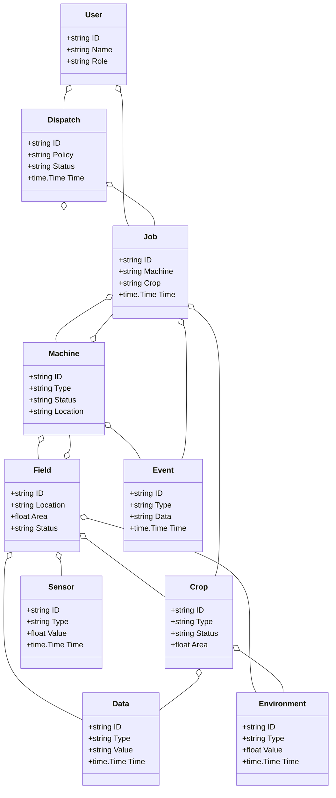
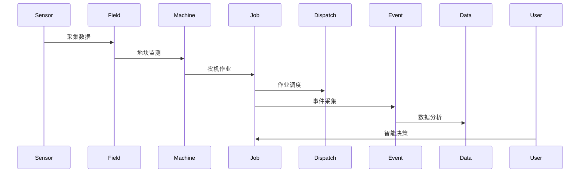
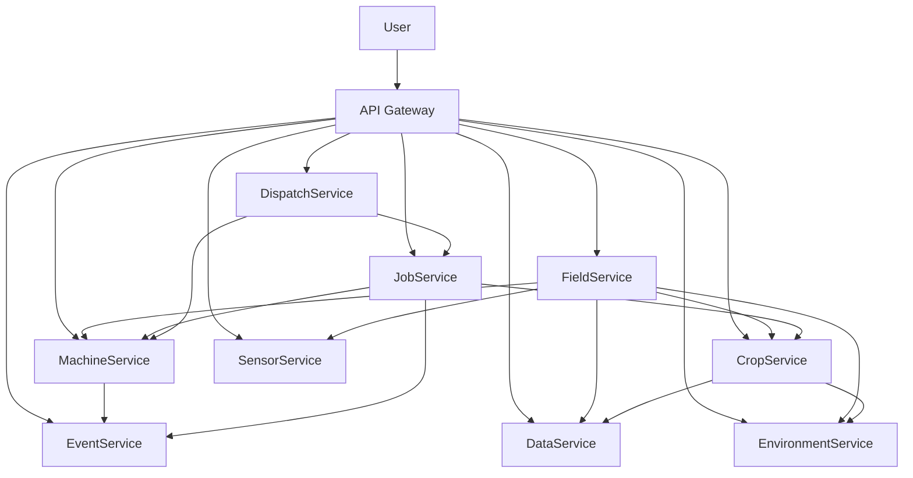

# 农业/智慧农业架构（Golang国际主流实践）

## 目录

1. 农业/智慧农业架构概述
    1.1 国际标准定义
    1.2 发展历程与核心思想
    1.3 典型应用场景
    1.4 与传统农业IT对比
2. 信息概念架构
3. 分布式系统挑战
4. 架构设计解决方案
5. Golang实现范例
6. 形式化建模与证明
7. 参考与外部链接

---

## 1. 农业/智慧农业架构概述

### 1.1 国际标准定义

农业/智慧农业架构是指以精准种植、智能感知、弹性调度、数据驱动为核心，支持农机互联、环境监测、智能决策的分布式系统架构。

- **国际主流参考**：ISO 11783（ISOBUS）、AgGateway、OADA、Open Ag Data Alliance、GS1、AgriTech、FAO。

### 1.2 发展历程与核心思想

- 2000s：农业自动化、农机管理、环境监测。
- 2010s：精准农业、物联网、遥感、数据集成。
- 2020s：AI种植、无人农机、农业大数据、绿色农业。
- 核心思想：精准高效、智能驱动、弹性协同、开放标准、数据赋能。

### 1.3 典型应用场景

- 智能灌溉、农机调度、作物监测、环境感知、无人农场、农业大数据、绿色种植等。

### 1.4 与传统农业IT对比

| 维度         | 传统农业IT         | 智慧农业架构           |
|--------------|-------------------|----------------------|
| 自动化       | 人工、机械         | 智能、无人化          |
| 数据采集     | 手工、离线         | 实时、自动化          |
| 决策         | 经验、规则         | AI驱动、数据决策      |
| 协同         | 单点、割裂         | 多方、弹性、协同      |
| 适用场景     | 农田、单一作物     | 智能农场、全产业链    |

---

## 2. 信息概念架构

### 2.1 领域建模方法

- 采用分层建模（感知层、作业层、平台层、应用层）、UML、ER图。
- 核心实体：农机、作物、地块、传感器、作业、调度、事件、用户、数据、环境。

### 2.2 核心实体与关系

| 实体    | 属性                        | 关系           |
|---------|-----------------------------|----------------|
| 农机    | ID, Type, Status, Location  | 关联作业/地块   |
| 作物    | ID, Type, Status, Area      | 属于地块       |
| 地块    | ID, Location, Area, Status  | 包含作物/农机   |
| 传感器  | ID, Type, Value, Time       | 属于地块/农机   |
| 作业    | ID, Machine, Crop, Time     | 关联农机/作物   |
| 调度    | ID, Policy, Status, Time    | 管理农机/作业   |
| 事件    | ID, Type, Data, Time        | 关联农机/作业   |
| 用户    | ID, Name, Role              | 管理作业/调度   |
| 数据    | ID, Type, Value, Time       | 关联作物/地块   |
| 环境    | ID, Type, Value, Time       | 关联地块/作物   |

#### UML 类图（Mermaid）



### 2.3 典型数据流

1. 传感器采集→地块监测→农机作业→作业调度→事件采集→数据分析→智能决策。

#### 数据流时序图（Mermaid）



### 2.4 Golang 领域模型代码示例

```go
// 农机实体
type Machine struct {
    ID       string
    Type     string
    Status   string
    Location string
}
// 作物实体
type Crop struct {
    ID     string
    Type   string
    Status string
    Area   float64
}
// 地块实体
type Field struct {
    ID       string
    Location string
    Area     float64
    Status   string
}
// 传感器实体
type Sensor struct {
    ID    string
    Type  string
    Value float64
    Time  time.Time
}
// 作业实体
type Job struct {
    ID      string
    Machine string
    Crop    string
    Time    time.Time
}
// 调度实体
type Dispatch struct {
    ID     string
    Policy string
    Status string
    Time   time.Time
}
// 事件实体
type Event struct {
    ID   string
    Type string
    Data string
    Time time.Time
}
// 用户实体
type User struct {
    ID   string
    Name string
    Role string
}
// 数据实体
type Data struct {
    ID    string
    Type  string
    Value string
    Time  time.Time
}
// 环境实体
type Environment struct {
    ID    string
    Type  string
    Value float64
    Time  time.Time
}
```

---

## 3. 分布式系统挑战

### 3.1 弹性与实时性

- 自动扩缩容、毫秒级响应、负载均衡、容灾备份。
- 国际主流：ISOBUS、Kubernetes、Prometheus、云服务。

### 3.2 数据安全与互操作性

- 数据加密、标准协议、互操作、访问控制。
- 国际主流：OADA、TLS、OAuth2、GS1。

### 3.3 可观测性与智能优化

- 全链路追踪、指标采集、AI优化、异常检测。
- 国际主流：OpenTelemetry、Prometheus、AI分析。

---

## 4. 架构设计解决方案

### 4.1 服务解耦与标准接口

- 农机、作物、地块、作业、调度、数据等服务解耦，API网关统一入口。
- 采用REST、gRPC、消息队列等协议，支持异步事件驱动。

### 4.2 智能调度与精准作业

- AI调度、精准作业、自动扩缩容、绿色种植。
- AI推理、Kubernetes、Prometheus。

### 4.3 数据安全与互操作设计

- TLS、OAuth2、数据加密、标准协议、访问审计。

### 4.4 架构图（Mermaid）



### 4.5 Golang代码示例

```go
// 传感器数据采集示例
// ...
// Prometheus 监控
var machineCount = prometheus.NewGauge(prometheus.GaugeOpts{Name: "machine_online_total"})
machineCount.Set(100)
```

---

## 5. Golang实现范例

### 5.1 工程结构示例

```text
agriculture-demo/
├── cmd/
├── internal/
│   ├── machine/
│   ├── crop/
│   ├── field/
│   ├── sensor/
│   ├── job/
│   ├── dispatch/
│   ├── event/
│   ├── data/
│   ├── environment/
├── api/
├── pkg/
├── configs/
├── scripts/
├── build/
└── README.md
```

### 5.2 关键代码片段

// 见4.5

### 5.3 CI/CD 配置（GitHub Actions 示例）

```yaml
name: Go CI
on:
  push:
    branches: [ main ]
jobs:
  build:
    runs-on: ubuntu-latest
    steps:
      - uses: actions/checkout@v3
      - name: Set up Go
        uses: actions/setup-go@v4
        with:
          go-version: '1.21'
      - name: Build
        run: go build ./...
      - name: Test
        run: go test ./...
```

---

## 6. 形式化建模与证明

### 6.1 农机-作业-作物建模

- 农机集合 $M = \{m_1, ..., m_n\}$，作业集合 $J = \{j_1, ..., j_k\}$，作物集合 $C = \{c_1, ..., c_l\}$。
- 调度函数 $f: (m, j, t) \rightarrow c$，数据采集函数 $g: (m, t) \rightarrow a$。

#### 性质1：精准作业性

- 所有农机 $m$ 与作业 $j$，其作物 $c$ 能精准调度。

#### 性质2：数据安全性

- 所有数据 $a$ 满足安全策略 $p$，即 $\forall a, \exists p, p(a) = true$。

### 6.2 符号说明

- $M$：农机集合
- $J$：作业集合
- $C$：作物集合
- $A$：数据集合
- $P$：安全策略集合
- $f$：调度函数
- $g$：数据采集函数

---

## 7. 参考与外部链接

- [ISO 11783 (ISOBUS)](https://www.iso.org/standard/25849.html)
- [AgGateway](https://aggateway.org/)
- [OADA](https://openag.io/)
- [Open Ag Data Alliance](https://openag.io/)
- [GS1](https://www.gs1.org/)
- [FAO](https://www.fao.org/)
- [Prometheus](https://prometheus.io/)
- [OpenTelemetry](https://opentelemetry.io/)
