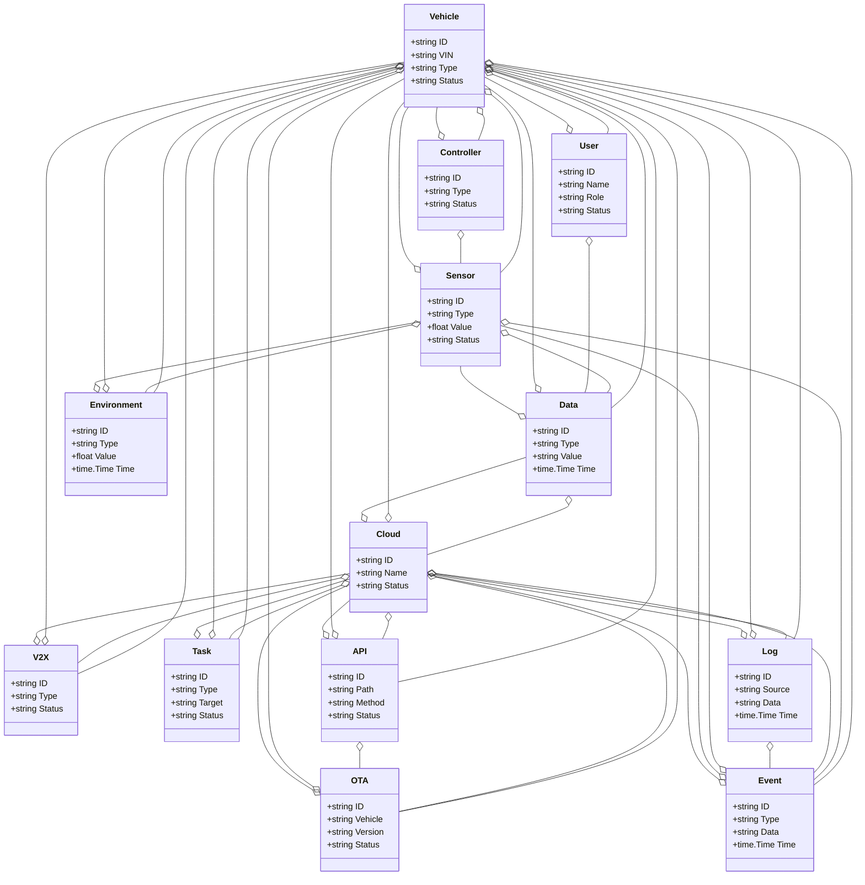
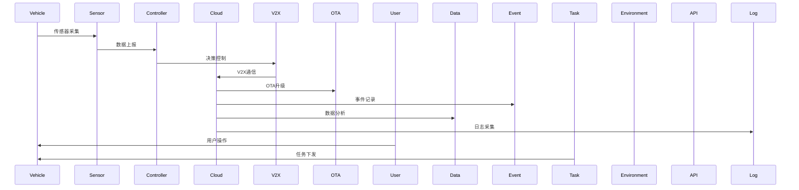
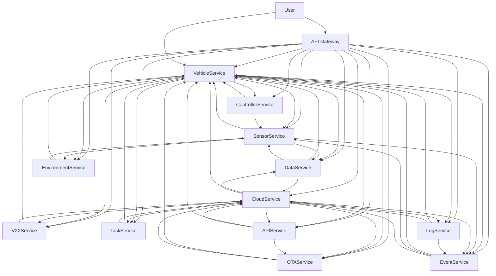

# 汽车/智慧汽车架构（Golang国际主流实践）

## 1. 目录

- [汽车/智慧汽车架构（Golang国际主流实践）](#汽车智慧汽车架构golang国际主流实践)
  - [1. 目录](#1-目录)
  - [2. 汽车/智慧汽车架构概述](#2-汽车智慧汽车架构概述)
    - [2.1 国际标准定义](#21-国际标准定义)
    - [2.2 发展历程与核心思想](#22-发展历程与核心思想)
    - [2.3 典型应用场景](#23-典型应用场景)
    - [2.4 与传统汽车IT对比](#24-与传统汽车it对比)
  - [3. 信息概念架构](#3-信息概念架构)
    - [3.1 领域建模方法](#31-领域建模方法)
    - [3.2 核心实体与关系](#32-核心实体与关系)
      - [3.2.1 UML 类图（Mermaid）](#321-uml-类图mermaid)
    - [3.3 典型数据流](#33-典型数据流)
      - [3.3.1 数据流时序图（Mermaid）](#331-数据流时序图mermaid)
    - [3.4 Golang 领域模型代码示例](#34-golang-领域模型代码示例)
  - [4. 分布式系统挑战](#4-分布式系统挑战)
    - [4.1 弹性与实时性](#41-弹性与实时性)
    - [4.2 数据安全与互操作性](#42-数据安全与互操作性)
    - [4.3 可观测性与智能优化](#43-可观测性与智能优化)
  - [5. 架构设计解决方案](#5-架构设计解决方案)
    - [5.1 服务解耦与标准接口](#51-服务解耦与标准接口)
    - [5.2 智能协同与弹性扩展](#52-智能协同与弹性扩展)
    - [5.3 数据安全与互操作设计](#53-数据安全与互操作设计)
    - [5.4 架构图（Mermaid）](#54-架构图mermaid)
    - [5.5 Golang代码示例](#55-golang代码示例)
  - [6. Golang实现范例](#6-golang实现范例)
    - [6.1 工程结构示例](#61-工程结构示例)
    - [6.2 关键代码片段](#62-关键代码片段)
    - [6.3 CI/CD 配置（GitHub Actions 示例）](#63-cicd-配置github-actions-示例)
  - [7. 形式化建模与证明](#7-形式化建模与证明)
    - [7.1 车辆-传感器-控制器建模](#71-车辆-传感器-控制器建模)
      - [7.1.1 性质1：智能感知性](#711-性质1智能感知性)
      - [7.1.2 性质2：弹性协同性](#712-性质2弹性协同性)
    - [7.2 符号说明](#72-符号说明)
  - [8. 参考与外部链接](#8-参考与外部链接)

---

## 2. 汽车/智慧汽车架构概述

### 2.1 国际标准定义

汽车/智慧汽车架构是指以智能网联、自动驾驶、弹性协同、数据驱动、安全合规为核心，支持车辆、传感器、控制器、云平台、V2X、OTA、数据分析、远程监控等场景的分布式系统架构。

- **国际主流参考**：AUTOSAR、ISO 26262、ISO/SAE 21434、ISO 20077、ISO 20078、ISO 20080、UNECE WP.29、SAE J3016、V2X（IEEE 802.11p/1609、3GPP C-V2X）、OTA（ISO 24089）、OpenAPI、gRPC、OAuth2、OpenID、ISO/IEC 27001、GDPR、OpenTelemetry、Prometheus、Kubernetes、Docker。

### 2.2 发展历程与核心思想

- 2000s：CAN/LIN总线、ECU分布式架构、基础车载信息化。
- 2010s：智能网联、车载以太网、OTA升级、云平台、V2X。
- 2020s：自动驾驶、AI感知、车路协同、全球协同、数据驱动、软件定义汽车。
- 核心思想：智能网联、自动驾驶、弹性协同、数据驱动、安全合规、标准互操作。

### 2.3 典型应用场景

- 智能网联汽车、自动驾驶、车路协同、OTA升级、远程监控、车载大数据、智能座舱、V2X、车队管理等。

### 2.4 与传统汽车IT对比

| 维度         | 传统汽车IT         | 智慧汽车架构           |
|--------------|-------------------|----------------------|
| 架构模式     | 单体、分布式ECU    | 云原生、服务化、弹性   |
| 通信协议     | CAN/LIN、私有协议  | 以太网、V2X、开放API   |
| 智能化       | 规则、人工         | AI驱动、自动驾驶      |
| OTA能力      | 无/有限            | 全车、分层、弹性OTA    |
| 数据采集     | 局部、离线         | 全车、实时、云端       |
| 安全合规     | 静态、被动         | 动态、主动、标准化     |
| 适用场景     | 单车、局部         | 车路云协同、全球协同   |

---

## 3. 信息概念架构

### 3.1 领域建模方法

- 采用分层建模（感知层、控制层、通信层、平台层、应用层）、UML、ER图。
- 核心实体：车辆、传感器、控制器、云平台、V2X、OTA、用户、数据、事件、任务、环境、API、日志。

### 3.2 核心实体与关系

| 实体    | 属性                        | 关系           |
|---------|-----------------------------|----------------|
| 车辆    | ID, VIN, Type, Status       | 关联传感器/控制器/用户/OTA |
| 传感器  | ID, Type, Value, Status     | 关联车辆/数据   |
| 控制器  | ID, Type, Status            | 关联车辆/传感器 |
| 云平台  | ID, Name, Status            | 关联车辆/OTA/V2X/数据 |
| V2X     | ID, Type, Status            | 关联车辆/云平台 |
| OTA     | ID, Vehicle, Version, Status| 关联车辆/云平台 |
| 用户    | ID, Name, Role, Status      | 关联车辆/数据   |
| 数据    | ID, Type, Value, Time       | 关联车辆/传感器/云平台 |
| 事件    | ID, Type, Data, Time        | 关联车辆/传感器/云平台 |
| 任务    | ID, Type, Target, Status    | 关联车辆/云平台 |
| 环境    | ID, Type, Value, Time       | 关联车辆/传感器 |
| API     | ID, Path, Method, Status    | 关联车辆/云平台/OTA |
| 日志    | ID, Source, Data, Time      | 关联车辆/云平台/事件 |

#### 3.2.1 UML 类图（Mermaid）



### 3.3 典型数据流

1. 车辆启动→传感器采集→控制器决策→V2X通信→云平台处理→OTA升级→事件记录→数据分析→日志采集→智能优化。

#### 3.3.1 数据流时序图（Mermaid）



### 3.4 Golang 领域模型代码示例

```go
// 车辆实体
type Vehicle struct {
    ID     string
    VIN    string
    Type   string
    Status string
}
// 传感器实体
type Sensor struct {
    ID     string
    Type   string
    Value  float64
    Status string
}
// 控制器实体
type Controller struct {
    ID     string
    Type   string
    Status string
}
// 云平台实体
type Cloud struct {
    ID     string
    Name   string
    Status string
}
// V2X实体
type V2X struct {
    ID     string
    Type   string
    Status string
}
// OTA实体
type OTA struct {
    ID      string
    Vehicle string
    Version string
    Status  string
}
// 用户实体
type User struct {
    ID     string
    Name   string
    Role   string
    Status string
}
// 数据实体
type Data struct {
    ID    string
    Type  string
    Value string
    Time  time.Time
}
// 事件实体
type Event struct {
    ID   string
    Type string
    Data string
    Time time.Time
}
// 任务实体
type Task struct {
    ID     string
    Type   string
    Target string
    Status string
}
// 环境实体
type Environment struct {
    ID    string
    Type  string
    Value float64
    Time  time.Time
}
// API实体
type API struct {
    ID     string
    Path   string
    Method string
    Status string
}
// 日志实体
type Log struct {
    ID     string
    Source string
    Data   string
    Time   time.Time
}
```

---

## 4. 分布式系统挑战

### 4.1 弹性与实时性

- 自动扩缩容、毫秒级响应、负载均衡、容灾备份、车路云协同。
- 国际主流：Kubernetes、Prometheus、云服务、CDN、V2X、OTA、边缘计算。

### 4.2 数据安全与互操作性

- 数据加密、标准协议、互操作、访问控制、合规治理。
- 国际主流：OAuth2、OpenID、TLS、ISO/IEC 27001、AUTOSAR、ISO 26262、ISO/SAE 21434。

### 4.3 可观测性与智能优化

- 全链路追踪、指标采集、AI优化、异常检测、车载大数据分析。
- 国际主流：OpenTelemetry、Prometheus、AI分析。

---

## 5. 架构设计解决方案

### 5.1 服务解耦与标准接口

- 车辆、传感器、控制器、云平台、V2X、OTA、用户、数据、事件、任务、环境、API、日志等服务解耦，API网关统一入口。
- 采用REST、gRPC、V2X、MQTT、消息队列等协议，支持异步事件驱动。

### 5.2 智能协同与弹性扩展

- AI驱动自动驾驶、弹性协同、自动扩缩容、智能优化。
- AI推理、Kubernetes、Prometheus、V2X、OTA、边缘计算。

### 5.3 数据安全与互操作设计

- TLS、OAuth2、数据加密、标准协议、访问审计、合规治理。

### 5.4 架构图（Mermaid）



### 5.5 Golang代码示例

```go
// 车辆数量Prometheus监控
var vehicleCount = prometheus.NewGauge(prometheus.GaugeOpts{Name: "vehicle_total"})
vehicleCount.Set(1000000)
```

---

## 6. Golang实现范例

### 6.1 工程结构示例

```text
automotive-demo/
├── cmd/
├── internal/
│   ├── vehicle/
│   ├── sensor/
│   ├── controller/
│   ├── cloud/
│   ├── v2x/
│   ├── ota/
│   ├── user/
│   ├── data/
│   ├── event/
│   ├── task/
│   ├── environment/
│   ├── api/
│   ├── log/
├── api/
├── pkg/
├── configs/
├── scripts/
├── build/
└── README.md
```

### 6.2 关键代码片段

// 见4.5

### 6.3 CI/CD 配置（GitHub Actions 示例）

```yaml
name: Go CI
on:
  push:
    branches: [ main ]
jobs:
  build:
    runs-on: ubuntu-latest
    steps:
      - uses: actions/checkout@v3
      - name: Set up Go
        uses: actions/setup-go@v4
        with:
          go-version: '1.21'
      - name: Build
        run: go build ./...
      - name: Test
        run: go test ./...
```

---

## 7. 形式化建模与证明

### 7.1 车辆-传感器-控制器建模

- 车辆集合 $V = \{v_1, ..., v_n\}$，传感器集合 $S = \{s_1, ..., s_k\}$，控制器集合 $C = \{c_1, ..., c_l\}$。
- 感知函数 $f: (v, s) \rightarrow d$，控制函数 $g: (v, c, d) \rightarrow a$。

#### 7.1.1 性质1：智能感知性

- 所有车辆 $v$ 与传感器 $s$，其数据 $d$ 能智能感知。

#### 7.1.2 性质2：弹性协同性

- 所有车辆 $v$、控制器 $c$、数据 $d$，其动作 $a$ 能弹性协同。

### 7.2 符号说明

- $V$：车辆集合
- $S$：传感器集合
- $C$：控制器集合
- $D$：数据集合
- $A$：动作集合
- $f$：感知函数
- $g$：控制函数

---

## 8. 参考与外部链接

- [AUTOSAR](https://www.autosar.org/)
- [ISO 26262](https://www.iso.org/standard/43464.html)
- [ISO/SAE 21434](https://www.iso.org/standard/70918.html)
- [ISO 20077](https://www.iso.org/standard/70916.html)
- [ISO 20078](https://www.iso.org/standard/70917.html)
- [ISO 20080](https://www.iso.org/standard/70919.html)
- [UNECE WP.29](https://unece.org/transport/vehicle-regulations/wp-29)
- [SAE J3016](https://www.sae.org/standards/content/j3016_202104/)
- [V2X](https://www.etsi.org/technologies/v2x)
- [OTA](https://www.iso.org/standard/77610.html)
- [OpenAPI](https://www.openapis.org/)
- [gRPC](https://grpc.io/)
- [OAuth2](https://oauth.net/2/)
- [OpenID](https://openid.net/)
- [ISO/IEC 27001](https://www.iso.org/isoiec-27001-information-security.html)
- [GDPR](https://gdpr.eu/)
- [OpenTelemetry](https://opentelemetry.io/)
- [Prometheus](https://prometheus.io/)
- [Kubernetes](https://kubernetes.io/)
- [Docker](https://www.docker.com/)
