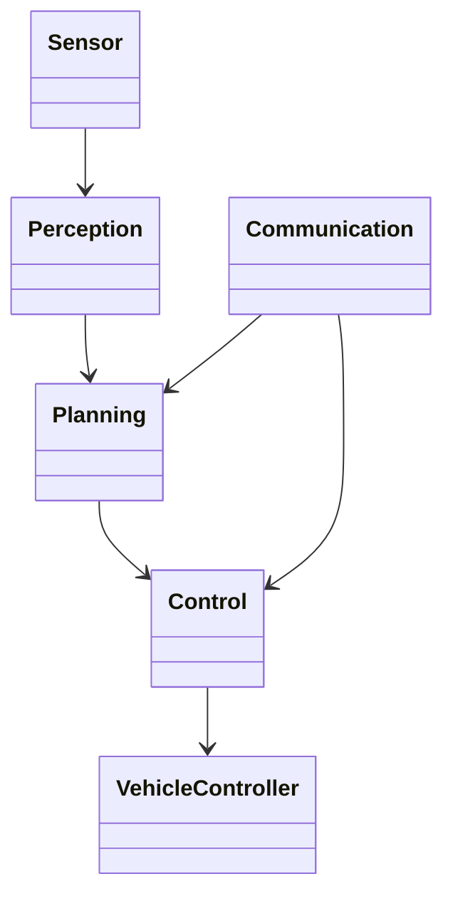
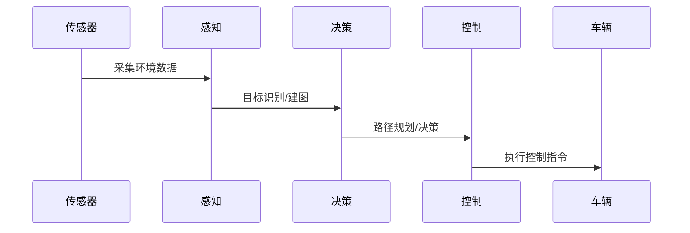
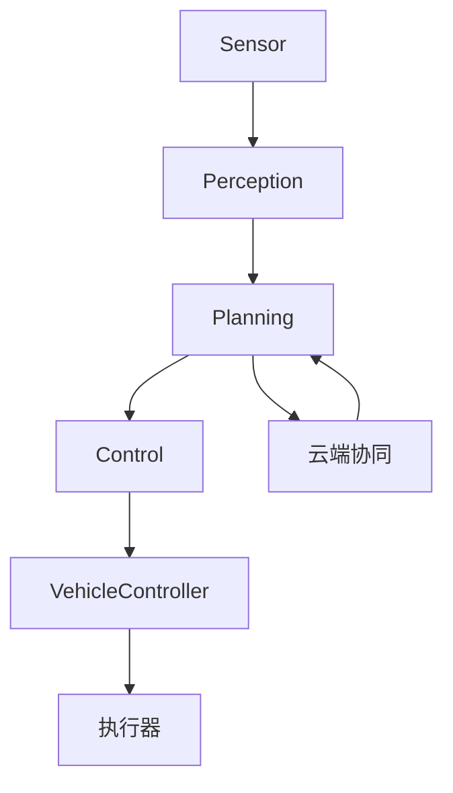

# 自动驾驶架构（Autonomous Driving Architecture）

<!-- TOC START -->
- [1 1 1 1 1 1 1 自动驾驶架构（Autonomous Driving Architecture）](#1-1-1-1-1-1-1-自动驾驶架构（autonomous-driving-architecture）)
  - [1.1 国际标准定义与发展历程](#国际标准定义与发展历程)
  - [1.2 核心思想与典型应用场景](#核心思想与典型应用场景)
  - [1.3 与传统方案对比](#与传统方案对比)
  - [1.4 领域建模（核心实体、关系、UML类图）](#领域建模（核心实体、关系、uml类图）)
  - [1.5 典型数据流与时序图](#典型数据流与时序图)
  - [1.6 Golang领域模型代码示例](#golang领域模型代码示例)
  - [1.7 分布式系统挑战](#分布式系统挑战)
  - [1.8 主流解决方案](#主流解决方案)
  - [1.9 形式化建模与证明](#形式化建模与证明)
  - [1.10 国际权威参考链接](#国际权威参考链接)
<!-- TOC END -->


## 1.1 国际标准定义与发展历程

- 定义：自动驾驶架构指实现车辆自主感知、决策、控制的软硬件系统，遵循ISO 26262、AUTOSAR、OpenADx等国际标准。
- 发展历程：从ADAS到L4/L5级自动驾驶，开源项目如Apollo、Autoware推动行业标准化。

## 1.2 核心思想与典型应用场景

- 核心思想：分层解耦（感知、决策、执行）、高可靠性、实时性、安全冗余。
- 应用场景：Robotaxi、智能公交、物流自动驾驶、无人配送等。

## 1.3 与传统方案对比

| 维度         | 传统汽车电子   | 自动驾驶架构         |
|--------------|--------------|---------------------|
| 控制方式     | 人工/辅助     | 全自动/智能决策     |
| 感知能力     | 低            | 多传感器融合        |
| 决策方式     | 固定逻辑      | AI/深度学习         |
| 安全冗余     | 少            | 多重冗余            |

## 1.4 领域建模（核心实体、关系、UML类图）

- 核心实体：传感器（Sensor）、感知模块、决策模块、执行模块、车辆控制器、通信模块。
- UML类图：



## 1.5 典型数据流与时序图

- 感知-决策-控制时序：



## 1.6 Golang领域模型代码示例

```go
// 传感器、感知、决策、控制等核心结构体
 type Sensor struct {
   Type string
   Data []float64
 }
 type Perception struct {
   Sensors []Sensor
 }
 type Planning struct {
   PerceptionData []float64
 }
 type Control struct {
   PlanningResult []float64
 }
```

## 1.7 分布式系统挑战

- 实时性、数据一致性、系统安全、冗余与容错、OTA升级、车云协同。

## 1.8 主流解决方案

- 架构图（分层解耦，车云协同）：



- 关键代码：Golang实现传感器数据采集、消息队列、决策算法接口。
- CI/CD：自动化测试、仿真平台集成。
- 监控：车载日志、远程诊断、云端监控。

## 1.9 形式化建模与证明

- 数学建模：
  - 感知P: P = f(SensorData)
  - 决策D: D = g(P)
  - 控制C: C = h(D)
- 性质：实时性（∀t, 延迟<阈值），安全性（冗余、故障转移）
- 符号说明：P-感知，D-决策，C-控制，f/g/h-映射函数

## 1.10 国际权威参考链接

- [ISO 26262 Functional Safety](https://www.iso.org/standard/68383.html)
- [AUTOSAR](https://www.autosar.org/)
- [Apollo Open Platform](https://github.com/ApolloAuto/apollo)
- [Autoware](https://www.autoware.org/)
