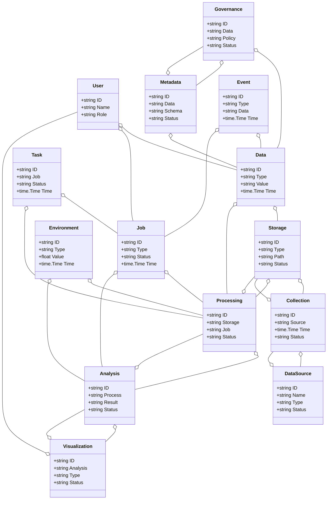
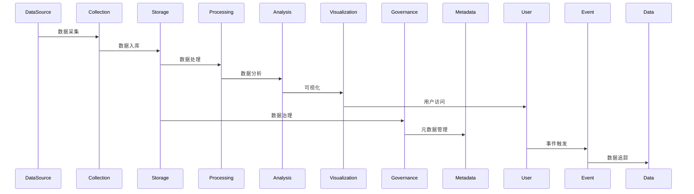
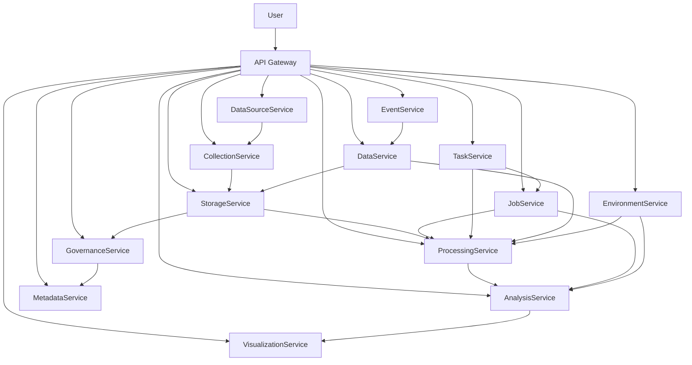

# 大数据分析/智慧大数据架构（Golang国际主流实践）

<!-- TOC START -->
- [1 1 1 1 1 1 1 大数据分析/智慧大数据架构（Golang国际主流实践）](#1-1-1-1-1-1-1-大数据分析智慧大数据架构（golang国际主流实践）)
  - [1.1 目录](#目录)
  - [1.2 1. 大数据分析/智慧大数据架构概述](#1-大数据分析智慧大数据架构概述)
    - [1.2.1 国际标准定义](#国际标准定义)
    - [1.2.2 发展历程与核心思想](#发展历程与核心思想)
    - [1.2.3 典型应用场景](#典型应用场景)
    - [1.2.4 与传统IT对比](#与传统it对比)
  - [1.3 2. 信息概念架构](#2-信息概念架构)
    - [1.3.1 领域建模方法](#领域建模方法)
    - [1.3.2 核心实体与关系](#核心实体与关系)
      - [1.3.2.1 UML 类图（Mermaid）](#uml-类图（mermaid）)
    - [1.3.3 典型数据流](#典型数据流)
      - [1.3.3.1 数据流时序图（Mermaid）](#数据流时序图（mermaid）)
    - [1.3.4 Golang 领域模型代码示例](#golang-领域模型代码示例)
  - [1.4 3. 分布式系统挑战](#3-分布式系统挑战)
    - [1.4.1 弹性与实时性](#弹性与实时性)
    - [1.4.2 数据安全与互操作性](#数据安全与互操作性)
    - [1.4.3 可观测性与智能优化](#可观测性与智能优化)
  - [1.5 4. 架构设计解决方案](#4-架构设计解决方案)
    - [1.5.1 服务解耦与标准接口](#服务解耦与标准接口)
    - [1.5.2 智能分析与弹性协同](#智能分析与弹性协同)
    - [1.5.3 数据安全与互操作设计](#数据安全与互操作设计)
    - [1.5.4 架构图（Mermaid）](#架构图（mermaid）)
    - [1.5.5 Golang代码示例](#golang代码示例)
  - [1.6 5. Golang实现范例](#5-golang实现范例)
    - [1.6.1 工程结构示例](#工程结构示例)
    - [1.6.2 关键代码片段](#关键代码片段)
    - [1.6.3 CI/CD 配置（GitHub Actions 示例）](#cicd-配置（github-actions-示例）)
  - [1.7 6. 形式化建模与证明](#6-形式化建模与证明)
    - [1.7.1 数据流-作业-分析建模](#数据流-作业-分析建模)
      - [1.7.1.1 性质1：弹性扩展性](#性质1：弹性扩展性)
      - [1.7.1.2 性质2：数据安全性](#性质2：数据安全性)
    - [1.7.2 符号说明](#符号说明)
  - [1.8 7. 参考与外部链接](#7-参考与外部链接)
<!-- TOC END -->


## 1.1 目录

1. 大数据分析/智慧大数据架构概述
    1.1 国际标准定义
    1.2 发展历程与核心思想
    1.3 典型应用场景
    1.4 与传统IT对比
2. 信息概念架构
3. 分布式系统挑战
4. 架构设计解决方案
5. Golang实现范例
6. 形式化建模与证明
7. 参考与外部链接

---

## 1.2 1. 大数据分析/智慧大数据架构概述

### 1.2.1 国际标准定义

大数据分析/智慧大数据架构是指以数据驱动、弹性扩展、智能分析、实时处理为核心，支持数据采集、存储、处理、分析、可视化、治理、共享等场景的分布式系统架构。

- **国际主流参考**：NIST Big Data Reference Architecture、ISO/IEC 20546、ISO/IEC 20547、OGC Big Data、Apache Hadoop、Apache Spark、Apache Flink、Kafka、Presto、Delta Lake、Parquet、Arrow、OpenLineage、GDPR、ISO/IEC 27001。

### 1.2.2 发展历程与核心思想

- 2000s：Hadoop生态、批处理、数据湖、NoSQL。
- 2010s：实时流处理、Lambda/Kappa架构、云原生大数据、数据治理、数据可视化。
- 2020s：AI驱动分析、智能数据湖、数据中台、数据共享、数据主权、隐私保护。
- 核心思想：数据驱动、弹性扩展、智能分析、标准互操作、数据安全。

### 1.2.3 典型应用场景

- 智能数据湖、实时分析、数据仓库、数据治理、AI建模、数据可视化、数据共享、数据市场等。

### 1.2.4 与传统IT对比

| 维度         | 传统IT系统         | 智慧大数据架构         |
|--------------|-------------------|----------------------|
| 数据规模     | GB-TB             | PB-EB                |
| 处理模式     | 批量、离线         | 实时、流式、批流融合   |
| 扩展性       | 垂直扩展           | 水平弹性扩展          |
| 智能化       | 规则、人工         | AI驱动、自动优化      |
| 数据治理     | 手工、割裂         | 自动、统一、标准化    |
| 适用场景     | 单一业务           | 多业务、跨域、全球协同 |

---

## 1.3 2. 信息概念架构

### 1.3.1 领域建模方法

- 采用分层建模（采集层、存储层、计算层、分析层、治理层、应用层）、UML、ER图。
- 核心实体：数据源、采集、存储、处理、分析、可视化、治理、元数据、作业、任务、用户、事件、数据、环境。

### 1.3.2 核心实体与关系

| 实体    | 属性                        | 关系           |
|---------|-----------------------------|----------------|
| 数据源  | ID, Name, Type, Status      | 关联采集/存储   |
| 采集    | ID, Source, Time, Status    | 关联数据源/存储 |
| 存储    | ID, Type, Path, Status      | 关联采集/处理   |
| 处理    | ID, Storage, Job, Status    | 关联存储/分析   |
| 分析    | ID, Process, Result, Status | 关联处理/可视化 |
| 可视化  | ID, Analysis, Type, Status  | 关联分析/用户   |
| 治理    | ID, Data, Policy, Status    | 关联数据/元数据 |
| 元数据  | ID, Data, Schema, Status    | 关联数据/治理   |
| 作业    | ID, Type, Status, Time      | 关联处理/分析   |
| 任务    | ID, Job, Status, Time       | 关联作业/处理   |
| 用户    | ID, Name, Role              | 管理数据/作业   |
| 事件    | ID, Type, Data, Time        | 关联数据/作业   |
| 数据    | ID, Type, Value, Time       | 关联存储/处理   |
| 环境    | ID, Type, Value, Time       | 关联处理/分析   |

#### 1.3.2.1 UML 类图（Mermaid）



### 1.3.3 典型数据流

1. 数据采集→存储→处理→分析→可视化→治理→共享→优化。

#### 1.3.3.1 数据流时序图（Mermaid）



### 1.3.4 Golang 领域模型代码示例

```go
// 数据源实体
type DataSource struct {
    ID     string
    Name   string
    Type   string
    Status string
}
// 采集实体
type Collection struct {
    ID     string
    Source string
    Time   time.Time
    Status string
}
// 存储实体
type Storage struct {
    ID     string
    Type   string
    Path   string
    Status string
}
// 处理实体
type Processing struct {
    ID      string
    Storage string
    Job     string
    Status  string
}
// 分析实体
type Analysis struct {
    ID      string
    Process string
    Result  string
    Status  string
}
// 可视化实体
type Visualization struct {
    ID       string
    Analysis string
    Type     string
    Status   string
}
// 治理实体
type Governance struct {
    ID     string
    Data   string
    Policy string
    Status string
}
// 元数据实体
type Metadata struct {
    ID     string
    Data   string
    Schema string
    Status string
}
// 作业实体
type Job struct {
    ID     string
    Type   string
    Status string
    Time   time.Time
}
// 任务实体
type Task struct {
    ID     string
    Job    string
    Status string
    Time   time.Time
}
// 用户实体
type User struct {
    ID   string
    Name string
    Role string
}
// 事件实体
type Event struct {
    ID   string
    Type string
    Data string
    Time time.Time
}
// 数据实体
type Data struct {
    ID    string
    Type  string
    Value string
    Time  time.Time
}
// 环境实体
type Environment struct {
    ID    string
    Type  string
    Value float64
    Time  time.Time
}
```

---

## 1.4 3. 分布式系统挑战

### 1.4.1 弹性与实时性

- 自动扩缩容、毫秒级响应、负载均衡、容灾备份。
- 国际主流：Kubernetes、Prometheus、云服务、CDN、Flink、Spark。

### 1.4.2 数据安全与互操作性

- 数据加密、标准协议、互操作、访问控制、数据主权。
- 国际主流：GDPR、ISO/IEC 27001、OAuth2、OpenID、TLS、OpenLineage。

### 1.4.3 可观测性与智能优化

- 全链路追踪、指标采集、AI优化、异常检测。
- 国际主流：OpenTelemetry、Prometheus、AI分析。

---

## 1.5 4. 架构设计解决方案

### 1.5.1 服务解耦与标准接口

- 数据源、采集、存储、处理、分析、可视化、治理、元数据、作业、任务、数据等服务解耦，API网关统一入口。
- 采用REST、gRPC、消息队列等协议，支持异步事件驱动。

### 1.5.2 智能分析与弹性协同

- AI驱动分析、弹性协同、自动扩缩容、智能优化。
- AI推理、Kubernetes、Prometheus、Flink、Spark。

### 1.5.3 数据安全与互操作设计

- TLS、OAuth2、数据加密、标准协议、访问审计、数据主权。

### 1.5.4 架构图（Mermaid）



### 1.5.5 Golang代码示例

```go
// 数据处理作业Prometheus监控
var jobCount = prometheus.NewGauge(prometheus.GaugeOpts{Name: "job_total"})
jobCount.Set(1000000)
```

---

## 1.6 5. Golang实现范例

### 1.6.1 工程结构示例

```text
bigdata-demo/
├── cmd/
├── internal/
│   ├── datasource/
│   ├── collection/
│   ├── storage/
│   ├── processing/
│   ├── analysis/
│   ├── visualization/
│   ├── governance/
│   ├── metadata/
│   ├── job/
│   ├── task/
│   ├── event/
│   ├── data/
│   ├── environment/
│   ├── user/
├── api/
├── pkg/
├── configs/
├── scripts/
├── build/
└── README.md
```

### 1.6.2 关键代码片段

// 见4.5

### 1.6.3 CI/CD 配置（GitHub Actions 示例）

```yaml
name: Go CI
on:
  push:
    branches: [ main ]
jobs:
  build:
    runs-on: ubuntu-latest
    steps:
      - uses: actions/checkout@v3
      - name: Set up Go
        uses: actions/setup-go@v4
        with:
          go-version: '1.21'
      - name: Build
        run: go build ./...
      - name: Test
        run: go test ./...
```

---

## 1.7 6. 形式化建模与证明

### 1.7.1 数据流-作业-分析建模

- 数据集合 $D = \{d_1, ..., d_n\}$，作业集合 $J = \{j_1, ..., j_k\}$，分析集合 $A = \{a_1, ..., a_l\}$。
- 处理函数 $f: (d, j) \rightarrow a$，数据采集函数 $g: (d, j) \rightarrow r$。

#### 1.7.1.1 性质1：弹性扩展性

- 所有数据 $d$ 与作业 $j$，其分析 $a$ 能弹性扩展。

#### 1.7.1.2 性质2：数据安全性

- 所有数据 $r$ 满足安全策略 $q$，即 $\forall r, \exists q, q(r) = true$。

### 1.7.2 符号说明

- $D$：数据集合
- $J$：作业集合
- $A$：分析集合
- $R$：结果集合
- $Q$：安全策略集合
- $f$：处理函数
- $g$：数据采集函数

---

## 1.8 7. 参考与外部链接

- [NIST Big Data Reference Architecture](https://www.nist.gov/programs-projects/nist-big-data-interoperability-framework)
- [ISO/IEC 20546](https://www.iso.org/standard/69019.html)
- [ISO/IEC 20547](https://www.iso.org/standard/72039.html)
- [OGC Big Data](https://www.ogc.org/standards/bigdata/)
- [Apache Hadoop](https://hadoop.apache.org/)
- [Apache Spark](https://spark.apache.org/)
- [Apache Flink](https://flink.apache.org/)
- [Apache Kafka](https://kafka.apache.org/)
- [Presto](https://prestodb.io/)
- [Delta Lake](https://delta.io/)
- [Parquet](https://parquet.apache.org/)
- [Arrow](https://arrow.apache.org/)
- [OpenLineage](https://openlineage.io/)
- [GDPR](https://gdpr.eu/)
- [ISO/IEC 27001](https://www.iso.org/isoiec-27001-information-security.html)
- [Prometheus](https://prometheus.io/)
- [OpenTelemetry](https://opentelemetry.io/)
