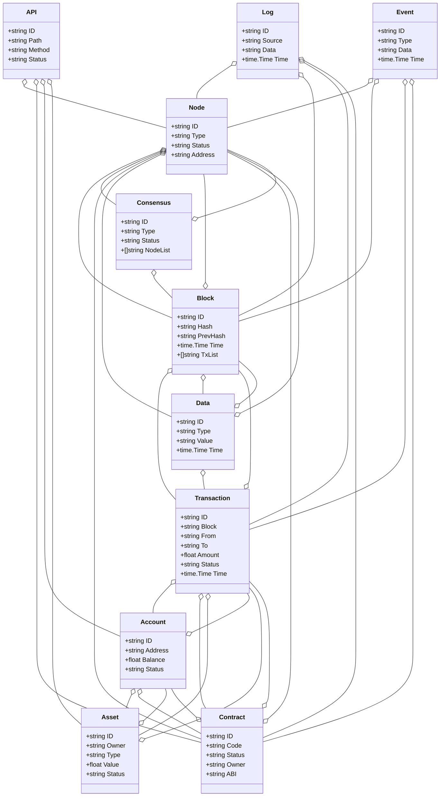
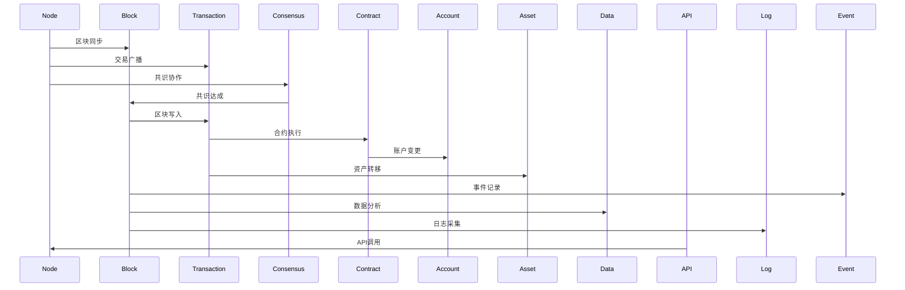
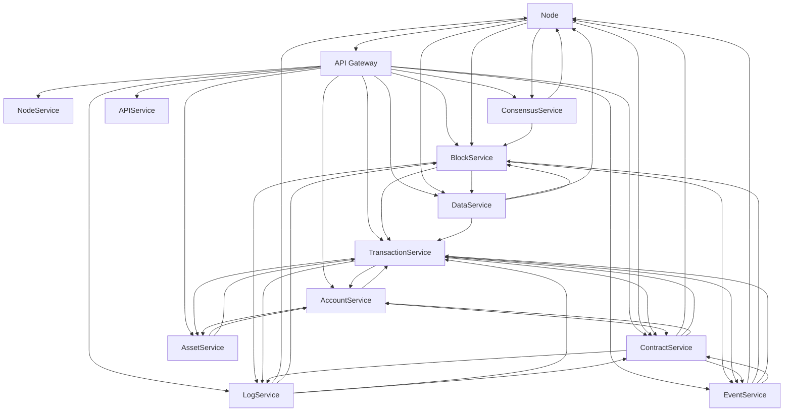

# 1 区块链/智慧区块链架构（Golang国际主流实践）

<!-- TOC START -->
- [1 区块链/智慧区块链架构（Golang国际主流实践）](#1-区块链智慧区块链架构golang国际主流实践)
  - [1.1 目录](#11-目录)
  - [1.2 1. 区块链/智慧区块链架构概述](#12-1-区块链智慧区块链架构概述)
    - [1.2.1 国际标准定义](#121-国际标准定义)
    - [1.2.2 发展历程与核心思想](#122-发展历程与核心思想)
    - [1.2.3 典型应用场景](#123-典型应用场景)
    - [1.2.4 与传统IT对比](#124-与传统it对比)
  - [1.3 2. 信息概念架构](#13-2-信息概念架构)
    - [1.3.1 领域建模方法](#131-领域建模方法)
    - [1.3.2 核心实体与关系](#132-核心实体与关系)
      - [1.3.2.1 UML 类图（Mermaid）](#1321-uml-类图mermaid)
    - [1.3.3 典型数据流](#133-典型数据流)
      - [1.3.3.1 数据流时序图（Mermaid）](#1331-数据流时序图mermaid)
    - [1.3.4 Golang 领域模型代码示例](#134-golang-领域模型代码示例)
  - [1.4 3. 分布式系统挑战](#14-3-分布式系统挑战)
    - [1.4.1 弹性与高可用](#141-弹性与高可用)
    - [1.4.2 数据一致性与安全合规](#142-数据一致性与安全合规)
    - [1.4.3 实时性与可观测性](#143-实时性与可观测性)
  - [1.5 4. 架构设计解决方案](#15-4-架构设计解决方案)
    - [1.5.1 微服务与标准接口](#151-微服务与标准接口)
    - [1.5.2 智能合约与弹性扩展](#152-智能合约与弹性扩展)
    - [1.5.3 数据安全与合规设计](#153-数据安全与合规设计)
    - [1.5.4 架构图（Mermaid）](#154-架构图mermaid)
    - [1.5.5 Golang代码示例](#155-golang代码示例)
  - [1.6 5. Golang实现范例](#16-5-golang实现范例)
    - [1.6.1 工程结构示例](#161-工程结构示例)
    - [1.6.2 关键代码片段](#162-关键代码片段)
    - [1.6.3 CI/CD 配置（GitHub Actions 示例）](#163-cicd-配置github-actions-示例)
  - [1.7 6. 形式化建模与证明](#17-6-形式化建模与证明)
    - [1.7.1 区块-交易-共识建模](#171-区块-交易-共识建模)
      - [1.7.1.1 性质1：最终一致性](#1711-性质1最终一致性)
      - [1.7.1.2 性质2：安全性](#1712-性质2安全性)
    - [1.7.2 符号说明](#172-符号说明)
  - [1.8 7. 参考与外部链接](#18-7-参考与外部链接)
<!-- TOC END -->

## 1.1 目录

1. 区块链/智慧区块链架构概述
    1.1 国际标准定义
    1.2 发展历程与核心思想
    1.3 典型应用场景
    1.4 与传统IT对比
2. 信息概念架构
3. 分布式系统挑战
4. 架构设计解决方案
5. Golang实现范例
6. 形式化建模与证明
7. 参考与外部链接

---

## 1.2 1. 区块链/智慧区块链架构概述

### 1.2.1 国际标准定义

区块链/智慧区块链架构是指以分布式账本、共识机制、智能合约、弹性扩展、安全合规为核心，支持节点、区块、交易、共识、合约、账户、资产、数据、API等场景的现代化系统架构。

- **国际主流参考**：ISO/TC 307、IEEE P2418.5、Ethereum Yellow Paper、Bitcoin Whitepaper、W3C DID、Hyperledger、Corda、Quorum、OpenAPI、gRPC、OAuth2、OpenID、OpenTelemetry、Prometheus、Kubernetes、Docker、ISO/IEC 27001、GDPR。

### 1.2.2 发展历程与核心思想

- 2008：比特币白皮书，去中心化账本、工作量证明。
- 2015：以太坊，智能合约、图灵完备虚拟机、DApp。
- 2017-2020：联盟链、跨链、分片、隐私保护、企业级区块链。
- 2020s：多链协作、分布式身份、零知识证明、可扩展性、合规治理。
- 核心思想：分布式账本、共识机制、智能合约、弹性扩展、安全合规、标准互操作。

### 1.2.3 典型应用场景

- 数字货币、供应链金融、数字身份、资产管理、跨境支付、溯源、防伪、政务、物联网、NFT、DAO、DeFi、Web3。

### 1.2.4 与传统IT对比

| 维度         | 传统IT系统         | 区块链架构             |
|--------------|-------------------|----------------------|
| 架构模式     | 中心化、单体       | 分布式、去中心化、弹性 |
| 数据一致性   | 强一致性           | 最终一致性、共识驱动   |
| 智能化       | 规则、人工         | 智能合约、自动执行    |
| 安全合规     | 访问控制、被动     | 密码学安全、主动合规   |
| 适用场景     | 单域、封闭         | 多域、开放、互操作    |

---

## 1.3 2. 信息概念架构

### 1.3.1 领域建模方法

- 采用分层建模（节点层、账本层、共识层、合约层、应用层）、UML、ER图。
- 核心实体：节点、区块、交易、共识、合约、账户、资产、数据、API、日志、事件。

### 1.3.2 核心实体与关系

| 实体    | 属性                        | 关系           |
|---------|-----------------------------|----------------|
| 节点    | ID, Type, Status, Address   | 关联区块/共识/合约/数据 |
| 区块    | ID, Hash, PrevHash, Time, TxList| 关联节点/交易/数据 |
| 交易    | ID, Block, From, To, Amount, Status, Time| 关联区块/账户/合约/资产 |
| 共识    | ID, Type, Status, NodeList  | 关联节点/区块   |
| 合约    | ID, Code, Status, Owner, ABI| 关联节点/交易/账户 |
| 账户    | ID, Address, Balance, Status| 关联交易/资产/合约 |
| 资产    | ID, Owner, Type, Value, Status| 关联账户/交易 |
| 数据    | ID, Type, Value, Time       | 关联节点/区块/交易 |
| API     | ID, Path, Method, Status    | 关联节点/合约/账户/资产 |
| 日志    | ID, Source, Data, Time      | 关联节点/区块/交易/合约 |
| 事件    | ID, Type, Data, Time        | 关联节点/区块/交易/合约 |

#### 1.3.2.1 UML 类图（Mermaid）



### 1.3.3 典型数据流

1. 节点启动→区块同步→交易广播→共识达成→区块写入→合约执行→事件记录→数据分析→日志采集。

#### 1.3.3.1 数据流时序图（Mermaid）



### 1.3.4 Golang 领域模型代码示例

```go
// 节点实体
type Node struct {
    ID      string
    Type    string
    Status  string
    Address string
}
// 区块实体
type Block struct {
    ID       string
    Hash     string
    PrevHash string
    Time     time.Time
    TxList   []string
}
// 交易实体
type Transaction struct {
    ID     string
    Block  string
    From   string
    To     string
    Amount float64
    Status string
    Time   time.Time
}
// 共识实体
type Consensus struct {
    ID       string
    Type     string
    Status   string
    NodeList []string
}
// 合约实体
type Contract struct {
    ID     string
    Code   string
    Status string
    Owner  string
    ABI    string
}
// 账户实体
type Account struct {
    ID      string
    Address string
    Balance float64
    Status  string
}
// 资产实体
type Asset struct {
    ID     string
    Owner  string
    Type   string
    Value  float64
    Status string
}
// 数据实体
type Data struct {
    ID    string
    Type  string
    Value string
    Time  time.Time
}
// API实体
type API struct {
    ID     string
    Path   string
    Method string
    Status string
}
// 日志实体
type Log struct {
    ID     string
    Source string
    Data   string
    Time   time.Time
}
// 事件实体
type Event struct {
    ID   string
    Type string
    Data string
    Time time.Time
}
```

---

## 1.4 3. 分布式系统挑战

### 1.4.1 弹性与高可用

- 自动扩缩容、容灾备份、全球部署、节点失效恢复、分片扩展。
- 国际主流：Kubernetes、Prometheus、云服务、CDN、微服务、边缘计算。

### 1.4.2 数据一致性与安全合规

- 分布式共识、最终一致性、数据加密、访问控制、合规治理。
- 国际主流：OAuth2、OpenID、ISO/IEC 27001、GDPR、OpenAPI。

### 1.4.3 实时性与可观测性

- 实时同步、全链路追踪、指标采集、异常检测、链上链下数据分析。
- 国际主流：OpenTelemetry、Prometheus、AI分析。

---

## 1.5 4. 架构设计解决方案

### 1.5.1 微服务与标准接口

- 节点、区块、交易、共识、合约、账户、资产、数据、API、日志、事件等服务解耦，API网关统一入口。
- 采用REST、gRPC、消息队列、事件驱动等协议，支持异步事件。

### 1.5.2 智能合约与弹性扩展

- 智能合约驱动、弹性扩缩容、跨链协作、自动化治理。
- 智能合约、Kubernetes、Prometheus、边缘计算。

### 1.5.3 数据安全与合规设计

- TLS、OAuth2、ISO/IEC 27001、GDPR、数据加密、访问审计、合规治理。

### 1.5.4 架构图（Mermaid）



### 1.5.5 Golang代码示例

```go
// 区块高度Prometheus监控
var blockHeight = prometheus.NewGauge(prometheus.GaugeOpts{Name: "block_height"})
blockHeight.Set(1234567)
```

---

## 1.6 5. Golang实现范例

### 1.6.1 工程结构示例

```text
blockchain-demo/
├── cmd/
├── internal/
│   ├── node/
│   ├── block/
│   ├── transaction/
│   ├── consensus/
│   ├── contract/
│   ├── account/
│   ├── asset/
│   ├── data/
│   ├── api/
│   ├── log/
│   ├── event/
├── api/
├── pkg/
├── configs/
├── scripts/
├── build/
└── README.md
```

### 1.6.2 关键代码片段

// 见4.5

### 1.6.3 CI/CD 配置（GitHub Actions 示例）

```yaml
name: Go CI
on:
  push:
    branches: [ main ]
jobs:
  build:
    runs-on: ubuntu-latest
    steps:
      - uses: actions/checkout@v3
      - name: Set up Go
        uses: actions/setup-go@v4
        with:
          go-version: '1.21'
      - name: Build
        run: go build ./...
      - name: Test
        run: go test ./...
```

---

## 1.7 6. 形式化建模与证明

### 1.7.1 区块-交易-共识建模

- 节点集合 $N = \{n_1, ..., n_k\}$，区块集合 $B = \{b_1, ..., b_m\}$，交易集合 $T = \{t_1, ..., t_l\}$，账户集合 $A = \{a_1, ..., a_p\}$。
- 区块生成函数 $f: (n, t) \rightarrow b$，共识函数 $g: (n, b) \rightarrow c$，转账函数 $h: (a, a', v) \rightarrow t$。

#### 1.7.1.1 性质1：最终一致性

- 所有节点 $n$，其区块 $b$ 通过共识 $c$ 达成最终一致。

#### 1.7.1.2 性质2：安全性

- 所有交易 $t$ 满足加密安全、不可抵赖。

### 1.7.2 符号说明

- $N$：节点集合
- $B$：区块集合
- $T$：交易集合
- $A$：账户集合
- $f$：区块生成函数
- $g$：共识函数
- $h$：转账函数

---

## 1.8 7. 参考与外部链接

- [ISO/TC 307](https://www.iso.org/committee/6266604.html)
- [IEEE P2418.5](https://standards.ieee.org/ieee/2418.5/6787/)
- [Ethereum Yellow Paper](https://ethereum.github.io/yellowpaper/paper.pdf)
- [Bitcoin Whitepaper](https://bitcoin.org/bitcoin.pdf)
- [W3C DID](https://www.w3.org/TR/did-core/)
- [Hyperledger](https://www.hyperledger.org/)
- [Corda](https://www.corda.net/)
- [Quorum](https://consensys.net/quorum/)
- [OpenAPI](https://www.openapis.org/)
- [gRPC](https://grpc.io/)
- [OAuth2](https://oauth.net/2/)
- [OpenID](https://openid.net/)
- [OpenTelemetry](https://opentelemetry.io/)
- [Prometheus](https://prometheus.io/)
- [Kubernetes](https://kubernetes.io/)
- [Docker](https://www.docker.com/)
- [ISO/IEC 27001](https://www.iso.org/isoiec-27001-information-security.html)
- [GDPR](https://gdpr.eu/)
