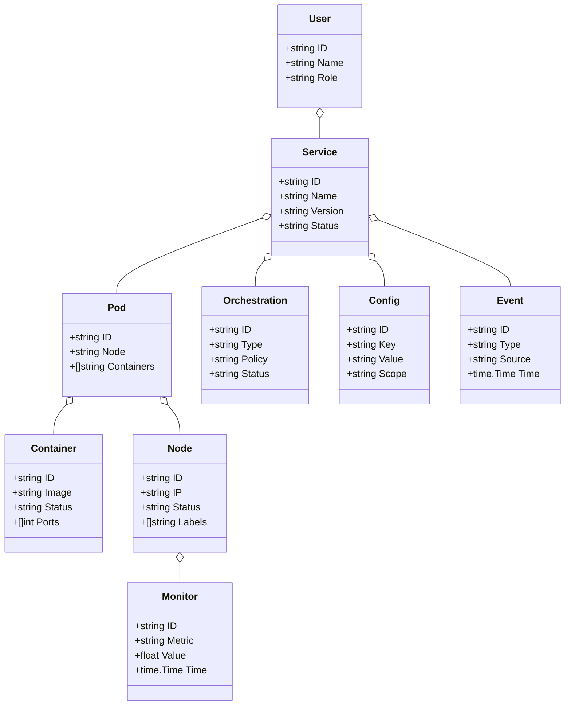
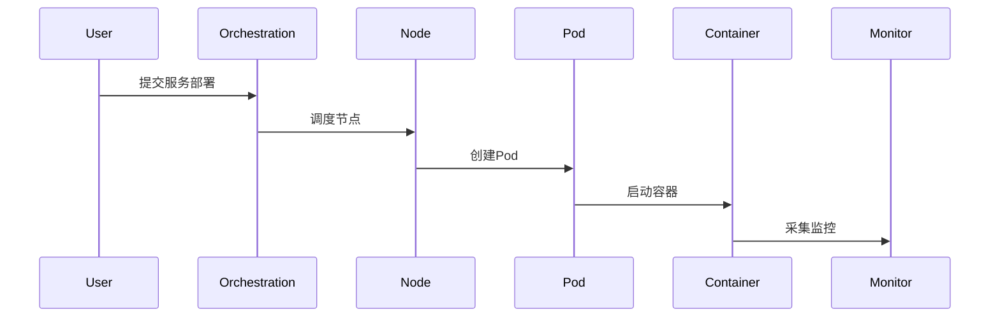
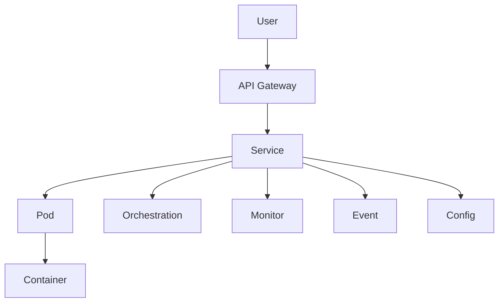

# 云原生架构（Golang国际主流实践）

## 目录

1. 云原生架构概述
    1.1 国际标准定义
    1.2 发展历程与核心思想
    1.3 典型应用场景
    1.4 与传统IT对比
2. 信息概念架构
3. 分布式系统挑战
4. 架构设计解决方案
5. Golang实现范例
6. 形式化建模与证明
7. 参考与外部链接

---

## 1. 云原生架构概述

### 1.1 国际标准定义

云原生（Cloud Native）架构是指以容器、微服务、动态编排、声明式API为核心，支持弹性扩展、自愈、自动化运维的分布式系统架构。

- **国际主流参考**：CNCF定义、Kubernetes、Docker、Service Mesh、CloudEvents、OpenTelemetry。

### 1.2 发展历程与核心思想

- 2010s：虚拟化、容器化、DevOps、微服务兴起。
- 2015s：Kubernetes、Service Mesh、Serverless、CI/CD、声明式基础设施。
- 2020s：多云、混合云、云原生安全、可观测性、GitOps。
- 核心思想：弹性、自动化、解耦、声明式、可观测、持续交付、云无关。

### 1.3 典型应用场景

- SaaS平台、互联网服务、金融云、AI平台、IoT平台、DevOps工具链等。

### 1.4 与传统IT对比

| 维度         | 传统IT架构         | 云原生架构             |
|--------------|-------------------|----------------------|
| 部署方式     | 物理机/虚拟机      | 容器/编排/Serverless  |
| 扩展性       | 静态、人工扩容     | 弹性、自动扩缩容      |
| 运维         | 手工、脚本         | 自动化、声明式        |
| 服务解耦     | 单体/有限          | 微服务、事件驱动      |
| 可观测性     | 日志、有限监控     | 全链路追踪、指标、告警|
| 适用场景     | 企业IT、传统应用   | 云服务、互联网规模    |

---

## 2. 信息概念架构

### 2.1 领域建模方法

- 采用分层建模（应用层、服务层、编排层、基础设施层）、UML、ER图。
- 核心实体：服务、容器、Pod、节点、编排、事件、配置、监控、用户。

### 2.2 核心实体与关系

| 实体    | 属性                        | 关系           |
|---------|-----------------------------|----------------|
| 服务    | ID, Name, Version, Status   | 部署于Pod      |
| 容器    | ID, Image, Status, Ports    | 属于Pod        |
| Pod     | ID, Node, Containers        | 部署于节点     |
| 节点    | ID, IP, Status, Labels      | 承载Pod        |
| 编排    | ID, Type, Policy, Status    | 管理服务/Pod   |
| 事件    | ID, Type, Source, Time      | 关联服务/Pod   |
| 配置    | ID, Key, Value, Scope       | 关联服务/Pod   |
| 监控    | ID, Metric, Value, Time     | 关联服务/节点   |
| 用户    | ID, Name, Role              | 管理服务/编排   |

#### UML 类图（Mermaid）



### 2.3 典型数据流

1. 用户提交服务→编排调度→节点部署Pod→容器启动→服务上线→监控采集→事件通知。

#### 数据流时序图（Mermaid）



### 2.4 Golang 领域模型代码示例

```go
// 服务实体
type Service struct {
    ID      string
    Name    string
    Version string
    Status  string
}
// 容器实体
type Container struct {
    ID     string
    Image  string
    Status string
    Ports  []int
}
// Pod实体
type Pod struct {
    ID         string
    Node       string
    Containers []string
}
// 节点实体
type Node struct {
    ID     string
    IP     string
    Status string
    Labels []string
}
// 编排实体
type Orchestration struct {
    ID     string
    Type   string
    Policy string
    Status string
}
// 事件实体
type Event struct {
    ID     string
    Type   string
    Source string
    Time   time.Time
}
// 配置实体
type Config struct {
    ID    string
    Key   string
    Value string
    Scope string
}
// 监控实体
type Monitor struct {
    ID     string
    Metric string
    Value  float64
    Time   time.Time
}
// 用户实体
type User struct {
    ID   string
    Name string
    Role string
}
```

---

## 3. 分布式系统挑战

### 3.1 弹性与可扩展性

- 自动扩缩容、负载均衡、无状态服务、服务发现。
- 国际主流：Kubernetes HPA、Service Mesh、Ingress、DNS。

### 3.2 服务治理与可观测性

- 服务注册、熔断、限流、链路追踪、指标采集、日志分析。
- 国际主流：Istio、Envoy、OpenTelemetry、Prometheus、Grafana。

### 3.3 安全与多租户

- 网络隔离、身份认证、权限控制、加密、审计。
- 国际主流：RBAC、OIDC、TLS、OPA、Kubernetes NetworkPolicy。

---

## 4. 架构设计解决方案

### 4.1 微服务与容器编排

- 微服务解耦、容器化部署、自动编排、弹性伸缩。
- Kubernetes、Docker、Helm、Operator。

### 4.2 服务网格与可观测性

- 服务网格治理、流量管理、全链路追踪、指标采集。
- Istio、Envoy、OpenTelemetry、Prometheus。

### 4.3 安全与自动化运维

- RBAC、TLS、自动化CI/CD、GitOps、自动修复。

### 4.4 架构图（Mermaid）



### 4.5 Golang代码示例

```go
// Kubernetes API 创建Pod
pod := &v1.Pod{ /* ... */ }
clientset.CoreV1().Pods(namespace).Create(context.TODO(), pod, metav1.CreateOptions{})

// Prometheus 监控采集
var requestCount = prometheus.NewCounter(prometheus.CounterOpts{Name: "http_requests_total"})
requestCount.Inc()
```

---

## 5. Golang实现范例

### 5.1 工程结构示例

```text
cloud-native-demo/
├── cmd/
├── internal/
│   ├── service/
│   ├── container/
│   ├── pod/
│   ├── node/
│   ├── orchestration/
│   ├── event/
│   ├── config/
│   └── monitor/
├── api/
├── pkg/
├── configs/
├── scripts/
├── build/
└── README.md
```

### 5.2 关键代码片段

// 见4.5

### 5.3 CI/CD 配置（GitHub Actions 示例）

```yaml
name: Go CI
on:
  push:
    branches: [ main ]
jobs:
  build:
    runs-on: ubuntu-latest
    steps:
      - uses: actions/checkout@v3
      - name: Set up Go
        uses: actions/setup-go@v4
        with:
          go-version: '1.21'
      - name: Build
        run: go build ./...
      - name: Test
        run: go test ./...
```

---

## 6. 形式化建模与证明

### 6.1 服务与编排建模

- 服务集合 $S = \{s_1, ..., s_n\}$，Pod集合 $P = \{p_1, ..., p_m\}$。
- 编排函数 $f: (s, r) \rightarrow p$，监控函数 $g: (s, t) \rightarrow m$。

#### 性质1：弹性可达性

- 所有服务 $s$，可通过编排自动部署到Pod $p$。

#### 性质2：可观测性

- 所有服务 $s$，其监控指标 $m$ 可被采集。

### 6.2 符号说明

- $S$：服务集合
- $P$：Pod集合
- $f$：编排函数
- $g$：监控函数

---

## 7. 参考与外部链接

- [CNCF](https://www.cncf.io/)
- [Kubernetes](https://kubernetes.io/)
- [Docker](https://www.docker.com/)
- [Istio](https://istio.io/)
- [OpenTelemetry](https://opentelemetry.io/)
- [Prometheus](https://prometheus.io/)
- [Helm](https://helm.sh/)
- [GitOps](https://opengitops.dev/)
