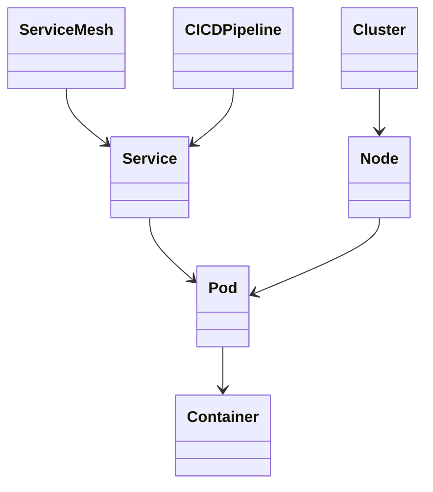
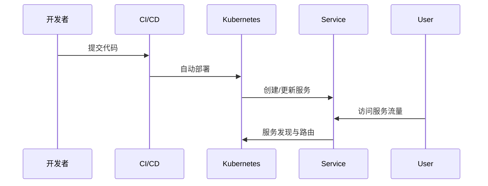
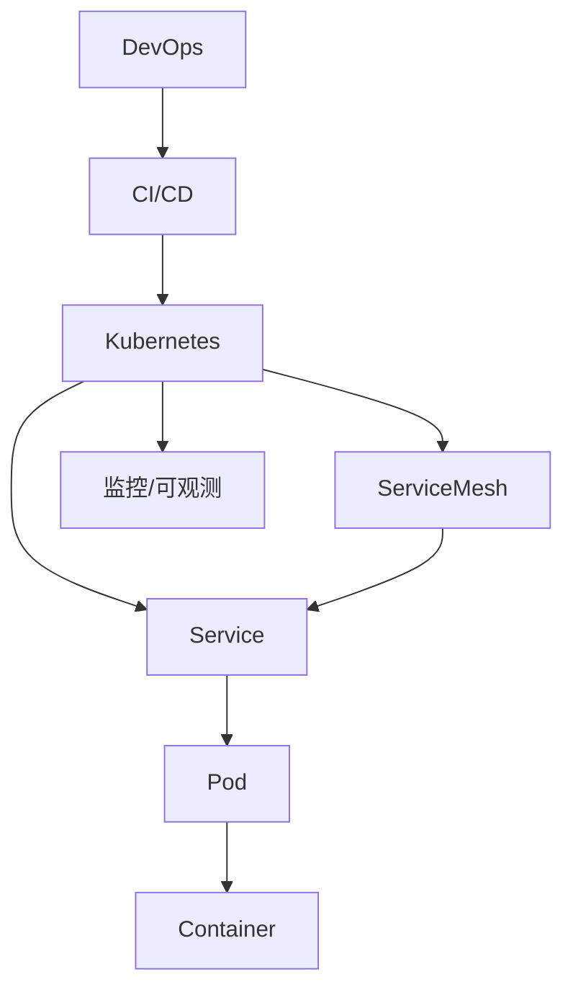

# 云原生架构（Cloud Native Architecture）

<!-- TOC START -->
- [1 1 1 1 1 1 1 云原生架构（Cloud Native Architecture）](#1-1-1-1-1-1-1-云原生架构cloud-native-architecture)
  - [1.1 国际标准定义与发展历程](#11-国际标准定义与发展历程)
  - [1.2 核心思想与典型应用场景](#12-核心思想与典型应用场景)
  - [1.3 与传统方案对比](#13-与传统方案对比)
  - [1.4 领域建模（核心实体、关系、UML类图）](#14-领域建模核心实体关系uml类图)
  - [1.5 典型数据流与时序图](#15-典型数据流与时序图)
  - [1.6 Golang领域模型代码示例](#16-golang领域模型代码示例)
  - [1.7 分布式系统挑战](#17-分布式系统挑战)
  - [1.8 主流解决方案](#18-主流解决方案)
  - [1.9 形式化建模与证明](#19-形式化建模与证明)
  - [1.10 国际权威参考链接](#110-国际权威参考链接)
<!-- TOC END -->

## 1.1 国际标准定义与发展历程

- 定义：云原生（Cloud Native）指利用云计算弹性、分布式、自动化等特性，构建可弹性伸缩、易于管理和持续交付的系统。CNCF（Cloud Native Computing Foundation）定义云原生包括容器、服务网格、微服务、不可变基础设施和声明式API。
- 发展历程：2015年CNCF成立，Kubernetes成为事实标准，云原生理念推动DevOps、微服务、Serverless等技术发展。

## 1.2 核心思想与典型应用场景

- 核心思想：解耦、弹性、自动化、可观测、持续交付。
- 应用场景：大规模分布式系统、互联网平台、金融、电商、AI平台等。

## 1.3 与传统方案对比

| 维度         | 传统架构         | 云原生架构         |
|--------------|----------------|-------------------|
| 部署方式     | 虚拟机/物理机   | 容器/Kubernetes   |
| 扩展性       | 静态/手动       | 弹性/自动化       |
| 交付速度     | 慢              | 快/持续交付       |
| 可观测性     | 弱              | 强                |
| 故障恢复     | 手动            | 自动/自愈         |

## 1.4 领域建模（核心实体、关系、UML类图）

- 核心实体：服务（Service）、容器（Container）、Pod、节点（Node）、集群（Cluster）、服务网格（Service Mesh）、CI/CD流水线。
- UML类图：



## 1.5 典型数据流与时序图

- 服务部署与流量路由时序：



## 1.6 Golang领域模型代码示例

```go
// Service、Pod、Container等核心结构体
 type Container struct {
   Name  string
   Image string
 }
 type Pod struct {
   Name       string
   Containers []Container
 }
 type Service struct {
   Name string
   Pods []Pod
 }
```

## 1.7 分布式系统挑战

- 一致性（CAP）、弹性伸缩、服务发现、配置管理、可观测性（Tracing/Logging/Metrics）、安全（零信任）、多租户。

## 1.8 主流解决方案

- 架构图（Kubernetes为核心，集成Service Mesh、CI/CD、监控）：



- 关键代码：Golang操作Kubernetes API、自动化部署、服务注册与发现。
- CI/CD：Jenkins、GitHub Actions、ArgoCD等。
- 监控：Prometheus、Grafana、OpenTelemetry。

## 1.9 形式化建模与证明

- 数学建模：
  - 集群C = {n1, n2, ..., nn}，Pod集合P = {p1, ..., pm}，服务S = {s1, ..., sk}
  - 服务调度映射：f: S → P
- 性质：弹性伸缩（∀s∈S, ∃p∈P, f(s)=p），高可用（∃多副本）
- 符号说明：C-集群，P-Pod集合，S-服务集合，f-调度函数

## 1.10 国际权威参考链接

- [CNCF Cloud Native Definition](https://github.com/cncf/toc/blob/main/DEFINITION.md)
- [Kubernetes Official Docs](https://kubernetes.io/)
- [Service Mesh Landscape](https://landscape.cncf.io/category=service-mesh)
