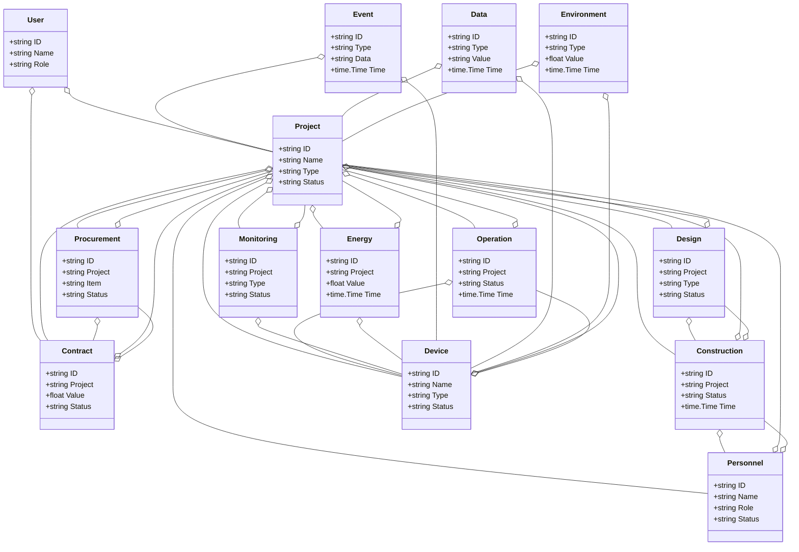
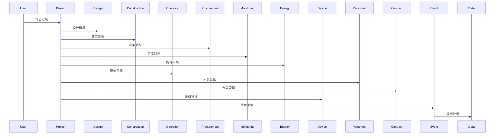
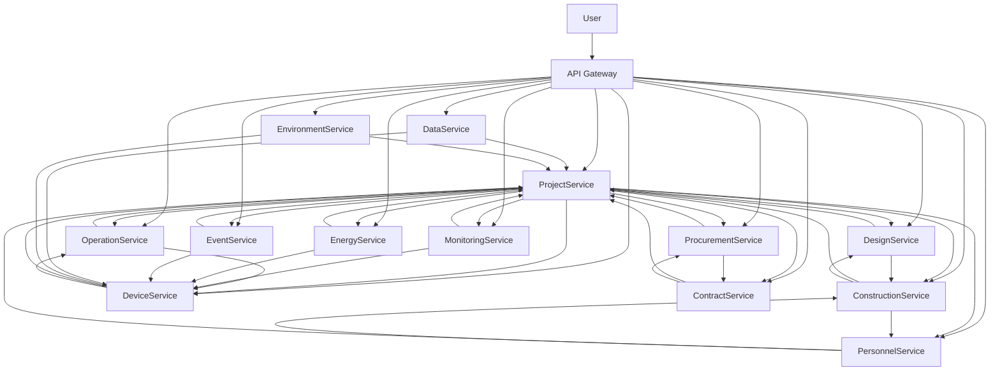

# 建筑业/智慧建筑架构（Golang国际主流实践）

## 1. 目录

- [建筑业/智慧建筑架构（Golang国际主流实践）](#建筑业智慧建筑架构golang国际主流实践)
  - [1. 目录](#1-目录)
  - [2. 建筑业/智慧建筑架构概述](#2-建筑业智慧建筑架构概述)
    - [2.1 国际标准定义](#21-国际标准定义)
    - [2.2 发展历程与核心思想](#22-发展历程与核心思想)
    - [2.3 典型应用场景](#23-典型应用场景)
    - [2.4 与传统建筑IT对比](#24-与传统建筑it对比)
  - [3. 信息概念架构](#3-信息概念架构)
    - [3.1 领域建模方法](#31-领域建模方法)
    - [3.2 核心实体与关系](#32-核心实体与关系)
      - [3.2.1 UML 类图（Mermaid）](#321-uml-类图mermaid)
    - [3.3 典型数据流](#33-典型数据流)
      - [3.3.1 数据流时序图（Mermaid）](#331-数据流时序图mermaid)
    - [3.4 Golang 领域模型代码示例](#34-golang-领域模型代码示例)
  - [4. 分布式系统挑战](#4-分布式系统挑战)
    - [4.1 弹性与实时性](#41-弹性与实时性)
    - [4.2 数据安全与互操作性](#42-数据安全与互操作性)
    - [4.3 可观测性与智能优化](#43-可观测性与智能优化)
  - [5. 架构设计解决方案](#5-架构设计解决方案)
    - [5.1 服务解耦与标准接口](#51-服务解耦与标准接口)
    - [5.2 BIM驱动与智能协同](#52-bim驱动与智能协同)
    - [5.3 数据安全与互操作设计](#53-数据安全与互操作设计)
    - [5.4 架构图（Mermaid）](#54-架构图mermaid)
    - [5.5 Golang代码示例](#55-golang代码示例)
  - [6. Golang实现范例](#6-golang实现范例)
    - [6.1 工程结构示例](#61-工程结构示例)
    - [6.2 关键代码片段](#62-关键代码片段)
    - [6.3 CI/CD 配置（GitHub Actions 示例）](#63-cicd-配置github-actions-示例)
  - [7. 形式化建模与证明](#7-形式化建模与证明)
    - [7.1 项目-设计-施工建模](#71-项目-设计-施工建模)
      - [7.1.1 性质1：智能协同性](#711-性质1智能协同性)
      - [7.1.2 性质2：数据安全性](#712-性质2数据安全性)
    - [7.2 符号说明](#72-符号说明)
  - [8. 参考与外部链接](#8-参考与外部链接)

---

## 2. 建筑业/智慧建筑架构概述

### 2.1 国际标准定义

建筑业/智慧建筑架构是指以BIM（建筑信息模型）、智能协同、弹性管理、数据驱动为核心，支持设计、施工、运维、采购、监控、能耗等场景的分布式系统架构。

- **国际主流参考**：ISO 19650、IFC、buildingSMART、COBie、ISO 16739、ISO 29481、ISO 12006、EN 17412、ISO 41001、ISO 50001。

### 2.2 发展历程与核心思想

- 2000s：CAD、项目管理、信息化施工。
- 2010s：BIM、协同设计、智能监控、数据集成。
- 2020s：数字孪生、智慧工地、全球协同、建筑大数据、绿色建筑。
- 核心思想：BIM驱动、智能协同、弹性管理、开放标准、数据赋能。

### 2.3 典型应用场景

- 智慧工地、BIM协同、智能监控、能耗管理、数字孪生、建筑大数据、绿色建筑等。

### 2.4 与传统建筑IT对比

| 维度         | 传统建筑IT         | 智慧建筑架构           |
|--------------|-------------------|----------------------|
| 服务模式     | 人工、线下         | 智能、自动化          |
| 数据采集     | 手工、离线         | 实时、自动化          |
| 协同         | 单点、割裂         | 多方、弹性、协同      |
| 智能化       | 规则、人工         | BIM驱动、智能分析     |
| 适用场景     | 设计、单一环节     | 全流程、全球协同      |

---

## 3. 信息概念架构

### 3.1 领域建模方法

- 采用分层建模（感知层、服务层、平台层、应用层）、UML、ER图。
- 核心实体：项目、设计、施工、运维、采购、监控、能耗、设备、人员、合同、事件、用户、数据、环境。

### 3.2 核心实体与关系

| 实体    | 属性                        | 关系           |
|---------|-----------------------------|----------------|
| 项目    | ID, Name, Type, Status      | 关联设计/施工   |
| 设计    | ID, Project, Type, Status   | 关联项目/施工   |
| 施工    | ID, Project, Status, Time   | 关联项目/设计   |
| 运维    | ID, Project, Status, Time   | 关联项目/设备   |
| 采购    | ID, Project, Item, Status   | 关联项目/合同   |
| 监控    | ID, Project, Type, Status   | 关联项目/设备   |
| 能耗    | ID, Project, Value, Time    | 关联项目/设备   |
| 设备    | ID, Name, Type, Status      | 关联项目/运维   |
| 人员    | ID, Name, Role, Status      | 关联项目/施工   |
| 合同    | ID, Project, Value, Status  | 关联项目/采购   |
| 事件    | ID, Type, Data, Time        | 关联项目/设备   |
| 用户    | ID, Name, Role              | 管理项目/合同   |
| 数据    | ID, Type, Value, Time       | 关联项目/设备   |
| 环境    | ID, Type, Value, Time       | 关联项目/设备   |

#### 3.2.1 UML 类图（Mermaid）



### 3.3 典型数据流

1. 项目立项→设计建模→施工管理→设备采购→智能监控→能耗采集→运维管理→事件采集→数据分析→智能优化。

#### 3.3.1 数据流时序图（Mermaid）



### 3.4 Golang 领域模型代码示例

```go
// 项目实体
type Project struct {
    ID     string
    Name   string
    Type   string
    Status string
}
// 设计实体
type Design struct {
    ID      string
    Project string
    Type    string
    Status  string
}
// 施工实体
type Construction struct {
    ID      string
    Project string
    Status  string
    Time    time.Time
}
// 运维实体
type Operation struct {
    ID      string
    Project string
    Status  string
    Time    time.Time
}
// 采购实体
type Procurement struct {
    ID      string
    Project string
    Item    string
    Status  string
}
// 监控实体
type Monitoring struct {
    ID      string
    Project string
    Type    string
    Status  string
}
// 能耗实体
type Energy struct {
    ID      string
    Project string
    Value   float64
    Time    time.Time
}
// 设备实体
type Device struct {
    ID     string
    Name   string
    Type   string
    Status string
}
// 人员实体
type Personnel struct {
    ID     string
    Name   string
    Role   string
    Status string
}
// 合同实体
type Contract struct {
    ID      string
    Project string
    Value   float64
    Status  string
}
// 用户实体
type User struct {
    ID   string
    Name string
    Role string
}
// 事件实体
type Event struct {
    ID   string
    Type string
    Data string
    Time time.Time
}
// 数据实体
type Data struct {
    ID    string
    Type  string
    Value string
    Time  time.Time
}
// 环境实体
type Environment struct {
    ID    string
    Type  string
    Value float64
    Time  time.Time
}
```

---

## 4. 分布式系统挑战

### 4.1 弹性与实时性

- 自动扩缩容、毫秒级响应、负载均衡、容灾备份。
- 国际主流：Kubernetes、Prometheus、云服务、CDN。

### 4.2 数据安全与互操作性

- 数据加密、标准协议、互操作、访问控制。
- 国际主流：IFC、OAuth2、OpenID、TLS、COBie。

### 4.3 可观测性与智能优化

- 全链路追踪、指标采集、AI优化、异常检测。
- 国际主流：OpenTelemetry、Prometheus、AI分析。

---

## 5. 架构设计解决方案

### 5.1 服务解耦与标准接口

- 项目、设计、施工、运维、采购、监控、能耗、设备、人员、合同、数据等服务解耦，API网关统一入口。
- 采用REST、gRPC、消息队列等协议，支持异步事件驱动。

### 5.2 BIM驱动与智能协同

- BIM驱动、智能协同、自动扩缩容、智能分析。
- BIM集成、Kubernetes、Prometheus。

### 5.3 数据安全与互操作设计

- TLS、OAuth2、数据加密、标准协议、访问审计。

### 5.4 架构图（Mermaid）



### 5.5 Golang代码示例

```go
// 项目数量Prometheus监控
var projectCount = prometheus.NewGauge(prometheus.GaugeOpts{Name: "project_total"})
projectCount.Set(1000000)
```

---

## 6. Golang实现范例

### 6.1 工程结构示例

```text
construction-demo/
├── cmd/
├── internal/
│   ├── project/
│   ├── design/
│   ├── construction/
│   ├── operation/
│   ├── procurement/
│   ├── monitoring/
│   ├── energy/
│   ├── device/
│   ├── personnel/
│   ├── contract/
│   ├── event/
│   ├── data/
│   ├── environment/
│   ├── user/
├── api/
├── pkg/
├── configs/
├── scripts/
├── build/
└── README.md
```

### 6.2 关键代码片段

// 见4.5

### 6.3 CI/CD 配置（GitHub Actions 示例）

```yaml
name: Go CI
on:
  push:
    branches: [ main ]
jobs:
  build:
    runs-on: ubuntu-latest
    steps:
      - uses: actions/checkout@v3
      - name: Set up Go
        uses: actions/setup-go@v4
        with:
          go-version: '1.21'
      - name: Build
        run: go build ./...
      - name: Test
        run: go test ./...
```

---

## 7. 形式化建模与证明

### 7.1 项目-设计-施工建模

- 项目集合 $P = \{p_1, ..., p_n\}$，设计集合 $D = \{d_1, ..., d_k\}$，施工集合 $C = \{c_1, ..., c_l\}$。
- 协同函数 $f: (p, d, c) \rightarrow s$，数据采集函数 $g: (p, t) \rightarrow a$。

#### 7.1.1 性质1：智能协同性

- 所有项目 $p$ 与设计 $d$，其施工 $c$ 能智能协同。

#### 7.1.2 性质2：数据安全性

- 所有数据 $a$ 满足安全策略 $q$，即 $\forall a, \exists q, q(a) = true$。

### 7.2 符号说明

- $P$：项目集合
- $D$：设计集合
- $C$：施工集合
- $A$：数据集合
- $Q$：安全策略集合
- $f$：协同函数
- $g$：数据采集函数

---

## 8. 参考与外部链接

- [ISO 19650](https://www.iso.org/standard/68078.html)
- [IFC](https://technical.buildingsmart.org/standards/ifc/)
- [buildingSMART](https://www.buildingsmart.org/)
- [COBie](https://www.nibs.org/projects/construction-operations-building-information-exchange-cobie)
- [ISO 16739](https://www.iso.org/standard/70303.html)
- [ISO 29481](https://www.iso.org/standard/55657.html)
- [ISO 12006](https://www.iso.org/standard/51872.html)
- [EN 17412](https://standards.iteh.ai/catalog/standards/cen/6e2e7e2e-2e2e-4e2e-8e2e-2e2e2e2e2e2e/en-17412-1-2020)
- [ISO 41001](https://www.iso.org/standard/68067.html)
- [ISO 50001](https://www.iso.org/iso-50001-energy-management.html)
- [Prometheus](https://prometheus.io/)
- [OpenTelemetry](https://opentelemetry.io/)
