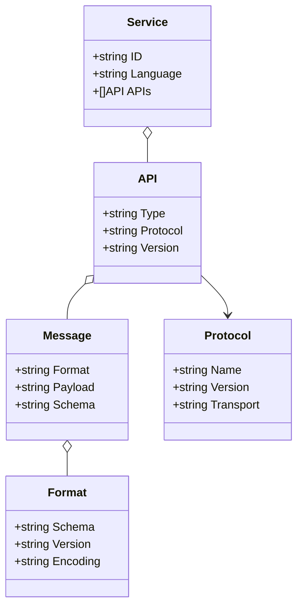
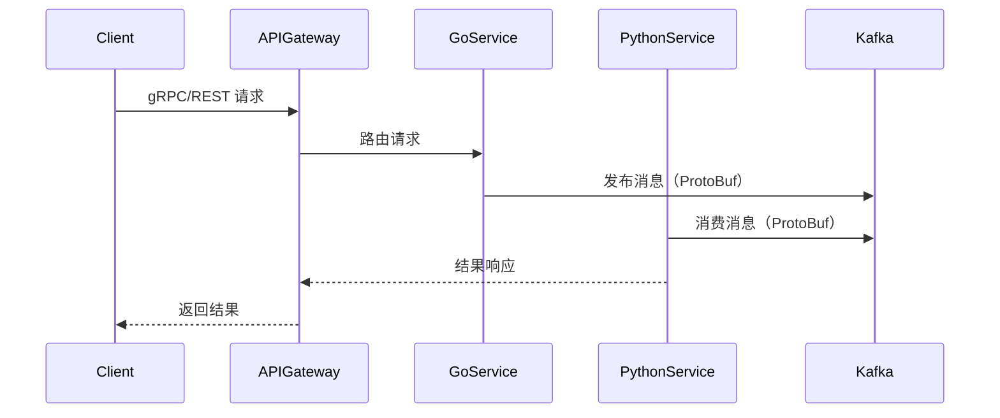

# 1 1 1 1 1 1 1 跨语言集成架构（Golang国际主流实践）

<!-- TOC START -->
- [1 1 1 1 1 1 1 跨语言集成架构（Golang国际主流实践）](#1-1-1-1-1-1-1-跨语言集成架构golang国际主流实践)
  - [1.1 目录](#11-目录)
  - [1.2 1. 跨语言集成架构概述](#12-1-跨语言集成架构概述)
    - [1.2.1 国际标准定义](#121-国际标准定义)
    - [1.2.2 发展历程与核心思想](#122-发展历程与核心思想)
    - [1.2.3 典型应用场景](#123-典型应用场景)
    - [1.2.4 与单语言系统对比](#124-与单语言系统对比)
  - [1.3 2. 信息概念架构](#13-2-信息概念架构)
    - [1.3.1 领域建模方法](#131-领域建模方法)
    - [1.3.2 核心实体与关系](#132-核心实体与关系)
      - [1.3.2.1 UML 类图（Mermaid）](#1321-uml-类图mermaid)
    - [1.3.3 典型数据流](#133-典型数据流)
      - [1.3.3.1 数据流时序图（Mermaid）](#1331-数据流时序图mermaid)
    - [1.3.4 Golang 领域模型代码示例](#134-golang-领域模型代码示例)
  - [1.4 3. 分布式系统挑战](#14-3-分布式系统挑战)
    - [1.4.1 接口标准化](#141-接口标准化)
    - [1.4.2 数据序列化与兼容性](#142-数据序列化与兼容性)
    - [1.4.3 性能与延迟](#143-性能与延迟)
    - [1.4.4 类型系统差异](#144-类型系统差异)
    - [1.4.5 服务发现与治理](#145-服务发现与治理)
    - [1.4.6 安全与认证](#146-安全与认证)
  - [1.5 4. 架构设计解决方案](#15-4-架构设计解决方案)
    - [1.5.1 通信协议与接口](#151-通信协议与接口)
    - [1.5.2 数据格式与序列化](#152-数据格式与序列化)
    - [1.5.3 服务注册与发现](#153-服务注册与发现)
    - [1.5.4 消息队列与事件流](#154-消息队列与事件流)
    - [1.5.5 安全与认证](#155-安全与认证)
    - [1.5.6 案例分析：gRPC+Kafka 跨语言微服务集成](#156-案例分析grpckafka-跨语言微服务集成)
  - [1.6 5. Golang国际主流实现范例](#16-5-golang国际主流实现范例)
    - [1.6.1 工程结构示例](#161-工程结构示例)
    - [1.6.2 关键代码片段](#162-关键代码片段)
      - [1.6.2.1 gRPC 服务定义与实现](#1621-grpc-服务定义与实现)
      - [1.6.2.2 Kafka 消息发布与消费](#1622-kafka-消息发布与消费)
      - [1.6.2.3 Prometheus 监控埋点](#1623-prometheus-监控埋点)
    - [1.6.3 CI/CD 配置（GitHub Actions 示例）](#163-cicd-配置github-actions-示例)
  - [2.1 6. 形式化建模与证明](#21-6-形式化建模与证明)
    - [2.1.1 服务与接口建模](#211-服务与接口建模)
      - [2.1.1.1 性质1：互操作性](#2111-性质1互操作性)
    - [2.1.2 数据一致性与兼容性](#212-数据一致性与兼容性)
    - [2.1.3 CAP定理与跨语言系统](#213-cap定理与跨语言系统)
    - [2.1.4 范畴论视角（可选）](#214-范畴论视角可选)
    - [2.1.5 符号说明](#215-符号说明)
  - [2.2 7. 参考与外部链接](#22-7-参考与外部链接)
<!-- TOC END -->

## 1.1 目录

1. 跨语言集成架构概述
    1.1 国际标准定义
    1.2 发展历程与核心思想
    1.3 典型应用场景
    1.4 与单语言系统对比
2. 信息概念架构
3. 分布式系统挑战
4. 架构设计解决方案
5. Golang国际主流实现范例
6. 形式化建模与证明
7. 参考与外部链接

---

## 1.2 1. 跨语言集成架构概述

### 1.2.1 国际标准定义

跨语言集成架构（Cross-language Integration Architecture）是指在同一系统中，多个编程语言协同工作，通过标准化接口、协议和数据格式实现互操作、资源共享和系统协同。

- **gRPC 官方定义**：
  > gRPC 是一个高性能、开源和通用的远程过程调用（RPC）框架，基于 HTTP/2 协议，支持多语言互通。
  > ——[gRPC Documentation](https://grpc.io/docs/)

- **国际主流协议/工具**：gRPC、Protocol Buffers、OpenAPI/Swagger、Thrift、GraphQL、Apache Arrow、Kafka、NATS。

### 1.2.2 发展历程与核心思想

- **发展历程**：
  - 2000s：Web Service（SOAP、XML-RPC）实现跨语言调用。
  - 2010s：RESTful API、JSON、Protocol Buffers、gRPC、Thrift等推动高效跨语言通信。
  - 2020s：云原生、微服务、数据湖等场景下多语言协作成为主流。

- **核心思想**：
  - 接口标准化：统一IDL（接口描述语言），自动生成多语言代码。
  - 协议兼容性：采用高效、通用的通信协议（gRPC、REST、MQ等）。
  - 数据一致性：标准化数据格式（ProtoBuf、JSON、Arrow等），支持Schema演化。
  - 性能与安全：高效序列化、低延迟通信、统一认证授权。

### 1.2.3 典型应用场景

- 微服务系统中不同服务采用不同语言（如Go、Python、Rust、Java等）。
- 大数据平台、AI/ML流水线、数据湖等多语言协作场景。
- 跨团队、跨组织的系统集成。
- 需要高性能、强一致性、可扩展的异构系统。

### 1.2.4 与单语言系统对比

| 维度         | 单语言系统           | 跨语言集成架构           |
|--------------|---------------------|-------------------------|
| 技术栈       | 单一语言             | 多语言协同              |
| 接口定义     | 语言特定             | 标准IDL/协议            |
| 数据格式     | 语言特定             | 通用格式（ProtoBuf等）  |
| 性能         | 语言本地优化         | 需兼顾序列化/网络开销    |
| 扩展性       | 受限于单一生态       | 可集成多种生态           |
| 适用场景     | 单一团队/业务        | 跨团队/跨领域/大规模系统 |

---

## 1.3 2. 信息概念架构

### 1.3.1 领域建模方法

- 采用接口描述语言（IDL）、协议建模、UML/ER图等。
- 核心实体：服务（Service）、接口（API）、消息（Message）、数据格式（Format）、协议（Protocol）。
- 强调接口标准化、协议兼容性、数据一致性。

### 1.3.2 核心实体与关系

| 实体      | 属性                        | 关系           |
|-----------|-----------------------------|----------------|
| 服务      | ID, Language, API           | 提供/消费接口  |
| 接口      | Type, Protocol, Version     | 服务间通信     |
| 消息      | Format, Payload, Schema     | 传递数据       |
| 数据格式  | Schema, Version, Encoding   | 兼容多语言     |
| 协议      | Name, Version, Transport    | 规范通信       |

#### 1.3.2.1 UML 类图（Mermaid）



### 1.3.3 典型数据流

1. 客户端请求：前端或外部系统通过标准协议（如gRPC/REST）发起请求。
2. API网关转发：统一入口路由到后端多语言服务。
3. 服务间通信：多语言服务通过消息队列、RPC等协议交互。
4. 数据格式转换：协议/格式适配层实现数据序列化与反序列化。

#### 1.3.3.1 数据流时序图（Mermaid）



### 1.3.4 Golang 领域模型代码示例

```go
// 服务实体
type Service struct {
    ID       string
    Language string
    APIs     []API
}
// 接口实体
type API struct {
    Type     string
    Protocol string
    Version  string
}
// 消息实体
type Message struct {
    Format  string
    Payload string
    Schema  string
}
// 数据格式实体
type Format struct {
    Schema   string
    Version  string
    Encoding string
}
// 协议实体
type Protocol struct {
    Name      string
    Version   string
    Transport string
}
```

---

## 1.4 3. 分布式系统挑战

### 1.4.1 接口标准化

- **挑战场景**：多语言服务需统一接口协议，避免接口碎片化。
- **国际主流解决思路**：
  - 采用gRPC、OpenAPI、Thrift等IDL统一接口定义。
  - 自动生成多语言客户端/服务端代码。
- **Golang代码片段**：

```go
// gRPC 服务定义
service UserService {
  rpc GetUser (GetUserRequest) returns (UserResponse);
}
```

### 1.4.2 数据序列化与兼容性

- **挑战场景**：不同语言间数据格式、类型映射、Schema演化。
- **国际主流解决思路**：
  - 使用Protocol Buffers、JSON、Apache Arrow等标准格式。
  - Schema版本管理，兼容性测试。
- **Golang代码片段**：

```go
// ProtoBuf 数据结构
message User {
  string id = 1;
  string name = 2;
}
```

### 1.4.3 性能与延迟

- **挑战场景**：序列化/反序列化开销、网络延迟、协议转换。
- **国际主流解决思路**：
  - 采用高效二进制协议（gRPC/ProtoBuf、Arrow）。
  - 零拷贝、批量处理、连接复用。
- **Golang代码片段**：

```go
// gRPC 客户端调用
conn, _ := grpc.Dial("service:50051", grpc.WithInsecure())
client := pb.NewUserServiceClient(conn)
resp, err := client.GetUser(ctx, &pb.GetUserRequest{Id: "123"})
```

### 1.4.4 类型系统差异

- **挑战场景**：不同语言类型映射、空值处理、泛型/枚举兼容。
- **国际主流解决思路**：
  - IDL支持类型映射，自动生成代码。
  - 明确空值、默认值、枚举等兼容策略。
- **Golang代码片段**：

```go
// ProtoBuf 枚举
enum Status {
  UNKNOWN = 0;
  ACTIVE = 1;
  INACTIVE = 2;
}
```

### 1.4.5 服务发现与治理

- **挑战场景**：多语言服务注册、发现、负载均衡。
- **国际主流解决思路**：
  - Consul、etcd、Kubernetes Service Registry。
  - 服务网格（Istio、Linkerd）统一治理。
- **Golang代码片段**：

```go
// Consul 服务注册
import consulapi "github.com/hashicorp/consul/api"
client, _ := consulapi.NewClient(consulapi.DefaultConfig())
reg := &consulapi.AgentServiceRegistration{Name: "user-service", Address: "127.0.0.1", Port: 8080}
client.Agent().ServiceRegister(reg)
```

### 1.4.6 安全与认证

- **挑战场景**：多语言服务统一认证、授权、加密。
- **国际主流解决思路**：
  - OAuth2、OpenID Connect、JWT等标准协议。
  - API网关统一认证、TLS加密。
- **Golang代码片段**：

```go
// JWT 认证中间件
import "github.com/dgrijalva/jwt-go"
func AuthMiddleware(next http.Handler) http.Handler {
    return http.HandlerFunc(func(w http.ResponseWriter, r *http.Request) {
        tokenStr := r.Header.Get("Authorization")
        _, err := jwt.Parse(tokenStr, func(token *jwt.Token) (interface{}, error) {
            return []byte("secret"), nil
        })
        if err != nil {
            http.Error(w, "Unauthorized", http.StatusUnauthorized)
            return
        }
        next.ServeHTTP(w, r)
    })
}
```

---

## 1.5 4. 架构设计解决方案

### 1.5.1 通信协议与接口

- **设计原则**：统一IDL、自动生成多语言代码、强类型接口。
- **主流协议**：gRPC（ProtoBuf）、REST（OpenAPI）、Thrift、GraphQL。
- **Golang代码示例**：

```go
// gRPC 服务端实现
import "google.golang.org/grpc"
import pb "github.com/yourorg/yourproto"

func (s *UserService) GetUser(ctx context.Context, req *pb.GetUserRequest) (*pb.UserResponse, error) {
    // ...
}
```

### 1.5.2 数据格式与序列化

- **设计原则**：高效、通用、可扩展、支持Schema演化。
- **主流格式**：Protocol Buffers、JSON、Apache Arrow、Avro、Parquet。
- **Golang代码示例**：

```go
// ProtoBuf 序列化
user := &pb.User{Id: "123", Name: "Alice"}
data, _ := proto.Marshal(user)
```

### 1.5.3 服务注册与发现

- **设计原则**：自动注册、健康检查、负载均衡、跨语言兼容。
- **主流方案**：Consul、etcd、Kubernetes Service Registry。
- **Golang代码示例**：

```go
// etcd 服务注册
import clientv3 "go.etcd.io/etcd/client/v3"
cli, _ := clientv3.New(clientv3.Config{Endpoints: []string{"localhost:2379"}})
cli.Put(context.Background(), "/services/user/instance1", "127.0.0.1:8080")
```

### 1.5.4 消息队列与事件流

- **设计原则**：高吞吐、低延迟、跨语言兼容、幂等消费。
- **主流队列**：Kafka、NATS、RabbitMQ。
- **Golang代码示例**：

```go
// Kafka 消息发布
import "github.com/segmentio/kafka-go"
writer := kafka.NewWriter(kafka.WriterConfig{Brokers: []string{"localhost:9092"}, Topic: "events"})
writer.WriteMessages(context.Background(), kafka.Message{Value: []byte("event data")})
```

### 1.5.5 安全与认证

- **设计原则**：统一认证、授权、加密、审计。
- **主流方案**：OAuth2、OpenID Connect、JWT、API网关。
- **Golang代码示例**：

```go
// OAuth2 客户端
import "golang.org/x/oauth2"
conf := &oauth2.Config{ClientID: "id", ClientSecret: "secret", Endpoint: oauth2.Endpoint{TokenURL: "https://provider.com/token"}}
token, err := conf.PasswordCredentialsToken(ctx, "user", "pass")
```

### 1.5.6 案例分析：gRPC+Kafka 跨语言微服务集成

- **背景**：Go、Python、Java等多语言服务通过gRPC接口和Kafka消息队列协作。
- **关键实践**：
  - 统一ProtoBuf接口定义，自动生成多语言代码。
  - Kafka实现异步事件流，解耦服务。
  - Consul/etcd注册发现，API网关统一入口。
- **参考链接**：[gRPC Docs](https://grpc.io/docs/), [Kafka Docs](https://kafka.apache.org/)

---

## 1.6 5. Golang国际主流实现范例

### 1.6.1 工程结构示例

```text
crosslang-demo/
├── cmd/                # 主程序入口
├── internal/           # 业务逻辑
│   ├── user/
│   ├── order/
│   └── common/
├── api/                # gRPC/REST API 定义
├── proto/              # ProtoBuf/IDL文件
├── pkg/                # 可复用组件
├── configs/            # 配置文件
├── scripts/            # 部署与运维脚本
├── build/              # Dockerfile、CI/CD配置
└── README.md
```

### 1.6.2 关键代码片段

#### 1.6.2.1 gRPC 服务定义与实现

```proto
// proto/user.proto
syntax = "proto3";
package api;

service UserService {
  rpc GetUser (GetUserRequest) returns (UserResponse);
}

message GetUserRequest {
  string id = 1;
}
message UserResponse {
  string id = 1;
  string name = 2;
}
```

```go
// internal/user/service.go
import pb "github.com/yourorg/crosslang-demo/api"

type UserService struct{}

func (s *UserService) GetUser(ctx context.Context, req *pb.GetUserRequest) (*pb.UserResponse, error) {
    // 业务逻辑...
    return &pb.UserResponse{Id: req.Id, Name: "Alice"}, nil
}
```

#### 1.6.2.2 Kafka 消息发布与消费

```go
import "github.com/segmentio/kafka-go"
// 发布事件
writer := kafka.NewWriter(kafka.WriterConfig{Brokers: []string{"localhost:9092"}, Topic: "user-events"})
writer.WriteMessages(context.Background(), kafka.Message{Value: []byte("UserCreated")})
// 消费事件
reader := kafka.NewReader(kafka.ReaderConfig{Brokers: []string{"localhost:9092"}, Topic: "user-events", GroupID: "user-group"})
msg, _ := reader.ReadMessage(context.Background())
processEvent(msg.Value)
```

#### 1.6.2.3 Prometheus 监控埋点

```go
import "github.com/prometheus/client_golang/prometheus"
var userCount = prometheus.NewCounter(prometheus.CounterOpts{Name: "user_created_total"})
userCount.Inc()
```

### 1.6.3 CI/CD 配置（GitHub Actions 示例）

```yaml
# 2 2 2 2 2 2 2 .github/workflows/ci.yml
name: Go CI
on:
  push:
    branches: [ main ]
jobs:
  build:
    runs-on: ubuntu-latest
    steps:
      - uses: actions/checkout@v3
      - name: Set up Go
        uses: actions/setup-go@v4
        with:
          go-version: '1.21'
      - name: Build
        run: go build ./...
      - name: Test
        run: go test ./...
```

---

## 2.1 6. 形式化建模与证明

### 2.1.1 服务与接口建模

- 设 $S = \{s_1, s_2, ..., s_n\}$ 为服务集合，$I = \{i_1, i_2, ..., i_m\}$ 为接口集合。
- 每个服务 $s_i$ 通过接口 $i_j$ 提供/消费功能，$F = \{f_1, f_2, ..., f_k\}$ 为数据格式集合。
- 通信建模为 $C: (s_i, s_j, i_k, f_l) \rightarrow msg$。

#### 2.1.1.1 性质1：互操作性

- 若 $i_k$ 遵循统一协议，$f_l$ 支持多语言序列化，则 $s_i, s_j$ 可互操作。
- **证明思路**：IDL自动生成多语言代码，协议/格式标准化，保证兼容。

### 2.1.2 数据一致性与兼容性

- 设 $D$ 为数据集合，$g: (d, f) \rightarrow d'$ 为格式转换函数。
- **一致性定义**：$\forall d \in D, \forall f, \exists d', g(d, f) = d'$，数据在多语言间可无损转换。
- **证明思路**：标准格式（ProtoBuf/Arrow）支持Schema演化与兼容。

### 2.1.3 CAP定理与跨语言系统

- 跨语言系统需在一致性（C）、可用性（A）、分区容忍性（P）间权衡。
- 多采用最终一致性与幂等处理提升可用性。

### 2.1.4 范畴论视角（可选）

- 服务为对象，接口/协议为态射，系统为范畴 $\mathcal{C}$。
- 组合律与单位元同前述建模。

### 2.1.5 符号说明

- $S$：服务集合
- $I$：接口集合
- $F$：数据格式集合
- $C$：通信函数
- $D$：数据集合
- $g$：格式转换函数

---

## 2.2 7. 参考与外部链接

- [gRPC 官方](https://grpc.io/)
- [Protocol Buffers](https://developers.google.com/protocol-buffers)
- [OpenAPI 规范](https://swagger.io/specification/)
- [Apache Thrift](https://thrift.apache.org/)
- [GraphQL 官方](https://graphql.org/)
- [Apache Arrow](https://arrow.apache.org/)
- [Kafka 官方](https://kafka.apache.org/)
- [NATS 官方](https://nats.io/)
- [Consul](https://www.consul.io/)
- [OAuth2 规范](https://oauth.net/2/)
- [OpenID Connect](https://openid.net/connect/)
