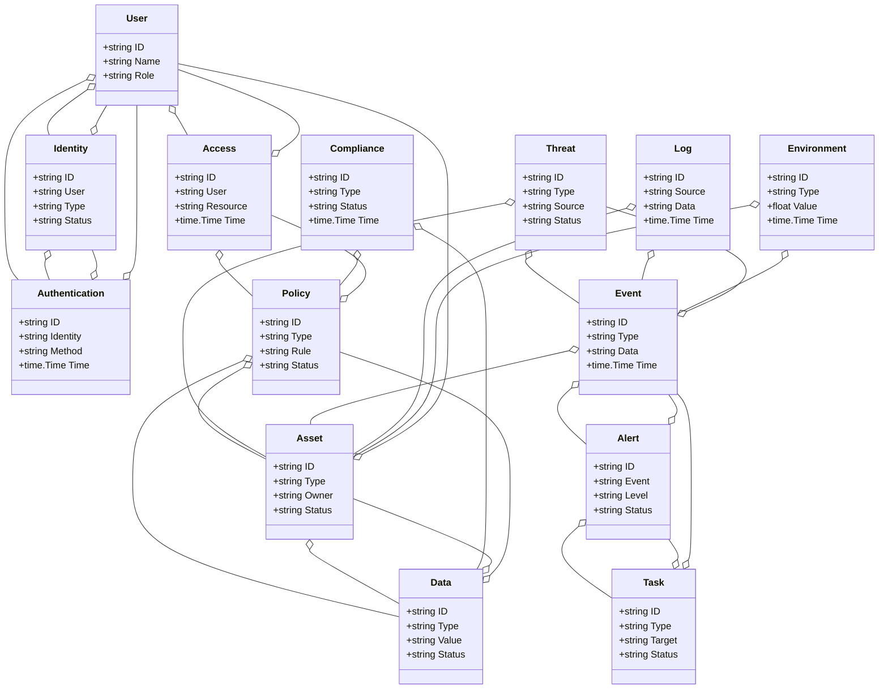
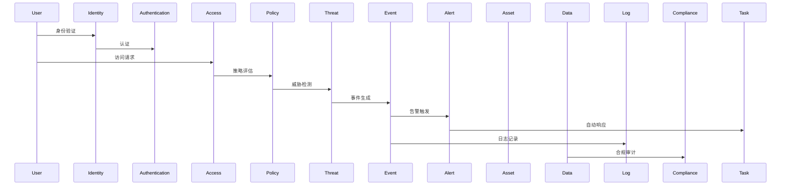
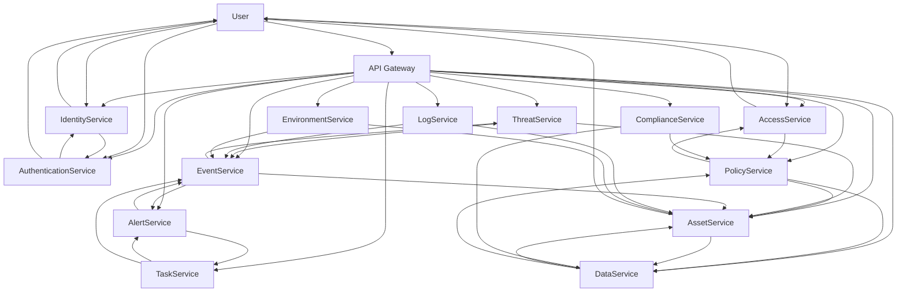

# 网络安全/智慧安全架构（Golang国际主流实践）

## 1. 目录

<!-- TOC START -->
- [网络安全/智慧安全架构（Golang国际主流实践）](#网络安全智慧安全架构golang国际主流实践)
  - [1. 目录](#1-目录)
  - [2. 网络安全/智慧安全架构概述](#2-网络安全智慧安全架构概述)
    - [2.1 国际标准定义](#21-国际标准定义)
    - [2.2 发展历程与核心思想](#22-发展历程与核心思想)
    - [2.3 典型应用场景](#23-典型应用场景)
    - [2.4 与传统IT安全对比](#24-与传统it安全对比)
  - [3. 信息概念架构](#3-信息概念架构)
    - [3.1 领域建模方法](#31-领域建模方法)
    - [3.2 核心实体与关系](#32-核心实体与关系)
      - [3.2.1 UML 类图（Mermaid）](#321-uml-类图mermaid)
    - [3.3 典型数据流](#33-典型数据流)
      - [3.3.1 数据流时序图（Mermaid）](#331-数据流时序图mermaid)
    - [3.4 Golang 领域模型代码示例](#34-golang-领域模型代码示例)
  - [4. 分布式系统挑战](#4-分布式系统挑战)
    - [4.1 弹性与实时性](#41-弹性与实时性)
    - [4.2 数据安全与互操作性](#42-数据安全与互操作性)
    - [4.3 可观测性与智能优化](#43-可观测性与智能优化)
  - [5. 架构设计解决方案](#5-架构设计解决方案)
    - [5.1 服务解耦与标准接口](#51-服务解耦与标准接口)
    - [5.2 智能防御与弹性响应](#52-智能防御与弹性响应)
    - [5.3 数据安全与互操作设计](#53-数据安全与互操作设计)
    - [5.4 架构图（Mermaid）](#54-架构图mermaid)
    - [5.5 Golang代码示例](#55-golang代码示例)
  - [6. Golang实现范例](#6-golang实现范例)
    - [6.1 工程结构示例](#61-工程结构示例)
    - [6.2 关键代码片段](#62-关键代码片段)
    - [6.3 CI/CD 配置（GitHub Actions 示例）](#63-cicd-配置github-actions-示例)
  - [7. 形式化建模与证明](#7-形式化建模与证明)
    - [7.1 用户-身份-策略建模](#71-用户-身份-策略建模)
      - [7.1.1 性质1：零信任安全性](#711-性质1零信任安全性)
      - [7.1.2 性质2：合规性](#712-性质2合规性)
    - [7.2 符号说明](#72-符号说明)
  - [8. 参考与外部链接](#8-参考与外部链接)
<!-- TOC END -->

---

## 2. 网络安全/智慧安全架构概述

### 2.1 国际标准定义

网络安全/智慧安全架构是指以主动防御、弹性响应、零信任、自动化、智能分析为核心，支持身份认证、访问控制、威胁检测、数据保护、合规治理、可观测性等场景的分布式系统架构。

- **国际主流参考**：ISO/IEC 27001、NIST Cybersecurity Framework、ISO/IEC 27002、ISO/IEC 27017、ISO/IEC 27018、NIST SP 800-53、CIS Controls、MITRE ATT&CK、OWASP、Zero Trust Architecture（NIST SP 800-207）、SOC 2、GDPR、PCI DSS、FIDO2、OAuth2、OpenID、TLS、Open Policy Agent、OpenTelemetry。

### 2.2 发展历程与核心思想

- 2000s：防火墙、入侵检测、VPN、传统安全运维。
- 2010s：云安全、身份管理、威胁情报、自动化响应、合规治理。
- 2020s：零信任、AI安全、自动化编排、全链路可观测、全球协同。
- 核心思想：主动防御、弹性响应、零信任、自动化、智能分析、标准合规。

### 2.3 典型应用场景

- 零信任安全、云安全、身份认证、访问控制、威胁检测、数据保护、合规治理、自动化响应、全链路可观测等。

### 2.4 与传统IT安全对比

| 维度         | 传统IT安全         | 智慧安全架构           |
|--------------|-------------------|----------------------|
| 防御模式     | 被动、边界防御     | 主动、零信任、纵深防御 |
| 响应方式     | 手工、滞后         | 自动化、弹性、实时     |
| 身份认证     | 静态、单点         | 动态、多因子、持续认证 |
| 威胁检测     | 签名、规则         | 行为、AI、威胁情报     |
| 合规治理     | 静态、手工         | 自动、标准、持续       |
| 可观测性     | 局部、被动         | 全链路、主动、智能     |
| 适用场景     | 单一网络           | 多云、全球、弹性协同   |

---

## 3. 信息概念架构

### 3.1 领域建模方法

- 采用分层建模（边界层、身份层、策略层、检测层、响应层、治理层）、UML、ER图。
- 核心实体：用户、身份、认证、访问、策略、威胁、事件、告警、资产、数据、日志、合规、任务、环境。

### 3.2 核心实体与关系

| 实体    | 属性                        | 关系           |
|---------|-----------------------------|----------------|
| 用户    | ID, Name, Role              | 关联身份/认证/访问 |
| 身份    | ID, User, Type, Status      | 关联用户/认证   |
| 认证    | ID, Identity, Method, Time  | 关联身份/用户   |
| 访问    | ID, User, Resource, Time    | 关联用户/策略   |
| 策略    | ID, Type, Rule, Status      | 关联访问/资产/数据 |
| 威胁    | ID, Type, Source, Status    | 关联事件/资产   |
| 事件    | ID, Type, Data, Time        | 关联威胁/告警/资产 |
| 告警    | ID, Event, Level, Status    | 关联事件/任务   |
| 资产    | ID, Type, Owner, Status     | 关联数据/用户   |
| 数据    | ID, Type, Value, Status     | 关联资产/策略   |
| 日志    | ID, Source, Data, Time      | 关联事件/资产   |
| 合规    | ID, Type, Status, Time      | 关联数据/策略   |
| 任务    | ID, Type, Target, Status    | 关联告警/事件   |
| 环境    | ID, Type, Value, Time       | 关联资产/事件   |

#### 3.2.1 UML 类图（Mermaid）



### 3.3 典型数据流

1. 用户认证→访问请求→策略评估→威胁检测→事件生成→告警触发→自动响应→日志记录→合规审计→智能优化。

#### 3.3.1 数据流时序图（Mermaid）



### 3.4 Golang 领域模型代码示例

```go
// 用户实体
type User struct {
    ID   string
    Name string
    Role string
}
// 身份实体
type Identity struct {
    ID     string
    User   string
    Type   string
    Status string
}
// 认证实体
type Authentication struct {
    ID       string
    Identity string
    Method   string
    Time     time.Time
}
// 访问实体
type Access struct {
    ID       string
    User     string
    Resource string
    Time     time.Time
}
// 策略实体
type Policy struct {
    ID     string
    Type   string
    Rule   string
    Status string
}
// 威胁实体
type Threat struct {
    ID     string
    Type   string
    Source string
    Status string
}
// 事件实体
type Event struct {
    ID   string
    Type string
    Data string
    Time time.Time
}
// 告警实体
type Alert struct {
    ID     string
    Event  string
    Level  string
    Status string
}
// 资产实体
type Asset struct {
    ID     string
    Type   string
    Owner  string
    Status string
}
// 数据实体
type Data struct {
    ID     string
    Type   string
    Value  string
    Status string
}
// 日志实体
type Log struct {
    ID     string
    Source string
    Data   string
    Time   time.Time
}
// 合规实体
type Compliance struct {
    ID     string
    Type   string
    Status string
    Time   time.Time
}
// 任务实体
type Task struct {
    ID     string
    Type   string
    Target string
    Status string
}
// 环境实体
type Environment struct {
    ID    string
    Type  string
    Value float64
    Time  time.Time
}
```

---

## 4. 分布式系统挑战

### 4.1 弹性与实时性

- 自动扩缩容、毫秒级响应、负载均衡、容灾备份、自动化响应。
- 国际主流：Kubernetes、Prometheus、云服务、CDN、SOAR、SIEM。

### 4.2 数据安全与互操作性

- 数据加密、标准协议、互操作、访问控制、零信任、合规治理。
- 国际主流：OAuth2、OpenID、TLS、ISO/IEC 27001、Zero Trust、Open Policy Agent、FIDO2。

### 4.3 可观测性与智能优化

- 全链路追踪、指标采集、AI优化、异常检测、威胁情报。
- 国际主流：OpenTelemetry、Prometheus、MITRE ATT&CK、AI分析。

---

## 5. 架构设计解决方案

### 5.1 服务解耦与标准接口

- 用户、身份、认证、访问、策略、威胁、事件、告警、资产、数据、日志、合规、任务等服务解耦，API网关统一入口。
- 采用REST、gRPC、消息队列等协议，支持异步事件驱动。

### 5.2 智能防御与弹性响应

- AI驱动威胁检测、弹性响应、自动化编排、智能分析。
- SOAR、SIEM、Kubernetes、Prometheus、Open Policy Agent。

### 5.3 数据安全与互操作设计

- TLS、OAuth2、数据加密、标准协议、访问审计、零信任、合规治理。

### 5.4 架构图（Mermaid）



### 5.5 Golang代码示例

```go
// 告警数量Prometheus监控
var alertCount = prometheus.NewGauge(prometheus.GaugeOpts{Name: "alert_total"})
alertCount.Set(1000000)
```

---

## 6. Golang实现范例

### 6.1 工程结构示例

```text
cybersecurity-demo/
├── cmd/
├── internal/
│   ├── user/
│   ├── identity/
│   ├── authentication/
│   ├── access/
│   ├── policy/
│   ├── threat/
│   ├── event/
│   ├── alert/
│   ├── asset/
│   ├── data/
│   ├── log/
│   ├── compliance/
│   ├── task/
│   ├── environment/
├── api/
├── pkg/
├── configs/
├── scripts/
├── build/
└── README.md
```

### 6.2 关键代码片段

// 见4.5

### 6.3 CI/CD 配置（GitHub Actions 示例）

```yaml
name: Go CI
on:
  push:
    branches: [ main ]
jobs:
  build:
    runs-on: ubuntu-latest
    steps:
      - uses: actions/checkout@v3
      - name: Set up Go
        uses: actions/setup-go@v4
        with:
          go-version: '1.21'
      - name: Build
        run: go build ./...
      - name: Test
        run: go test ./...
```

---

## 7. 形式化建模与证明

### 7.1 用户-身份-策略建模

- 用户集合 $U = \{u_1, ..., u_n\}$，身份集合 $I = \{i_1, ..., i_k\}$，策略集合 $P = \{p_1, ..., p_l\}$。
- 认证函数 $f: (u, i) \rightarrow a$，策略评估函数 $g: (u, p) \rightarrow r$。

#### 7.1.1 性质1：零信任安全性

- 所有用户 $u$ 与身份 $i$，其认证 $a$ 满足零信任安全。

#### 7.1.2 性质2：合规性

- 所有策略评估结果 $r$ 满足合规策略 $q$，即 $\forall r, \exists q, q(r) = true$。

### 7.2 符号说明

- $U$：用户集合
- $I$：身份集合
- $P$：策略集合
- $A$：认证集合
- $R$：策略评估结果集合
- $Q$：合规策略集合
- $f$：认证函数
- $g$：策略评估函数

---

## 8. 参考与外部链接

- [ISO/IEC 27001](https://www.iso.org/isoiec-27001-information-security.html)
- [NIST Cybersecurity Framework](https://www.nist.gov/cyberframework)
- [ISO/IEC 27002](https://www.iso.org/standard/54533.html)
- [ISO/IEC 27017](https://www.iso.org/standard/43757.html)
- [ISO/IEC 27018](https://www.iso.org/standard/61498.html)
- [NIST SP 800-53](https://csrc.nist.gov/publications/detail/sp/800-53/rev-5/final)
- [CIS Controls](https://www.cisecurity.org/controls/)
- [MITRE ATT&CK](https://attack.mitre.org/)
- [OWASP](https://owasp.org/)
- [Zero Trust Architecture](https://csrc.nist.gov/publications/detail/sp/800-207/final)
- [SOC 2](https://www.aicpa.org/resources/article/soc-2-report)
- [GDPR](https://gdpr.eu/)
- [PCI DSS](https://www.pcisecuritystandards.org/)
- [FIDO2](https://fidoalliance.org/fido2/)
- [OAuth2](https://oauth.net/2/)
- [OpenID](https://openid.net/)
- [TLS](https://datatracker.ietf.org/wg/tls/documents/)
- [Open Policy Agent](https://www.openpolicyagent.org/)
- [OpenTelemetry](https://opentelemetry.io/)
