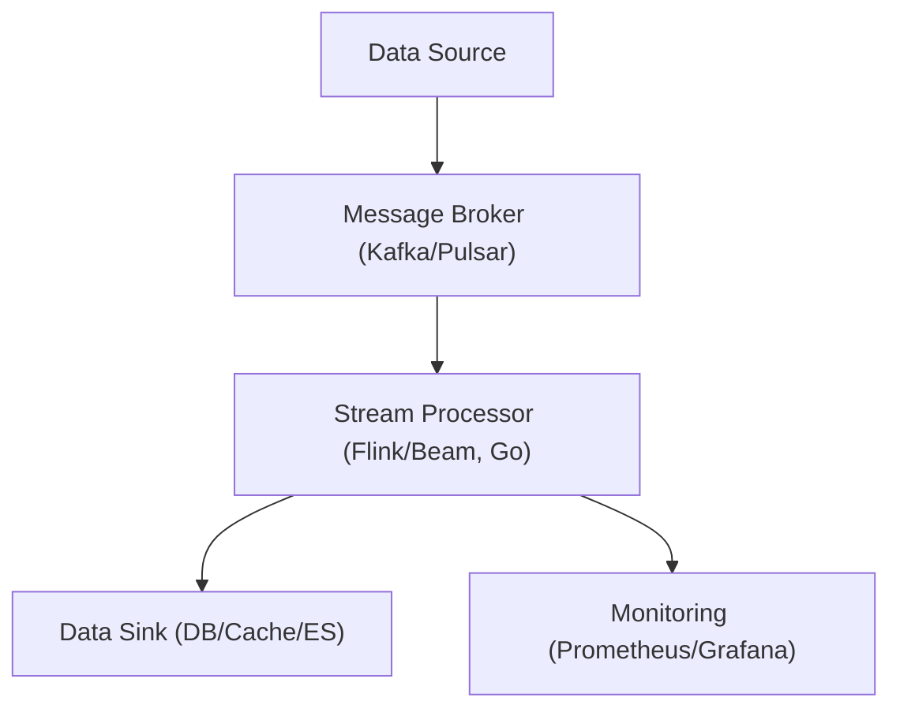
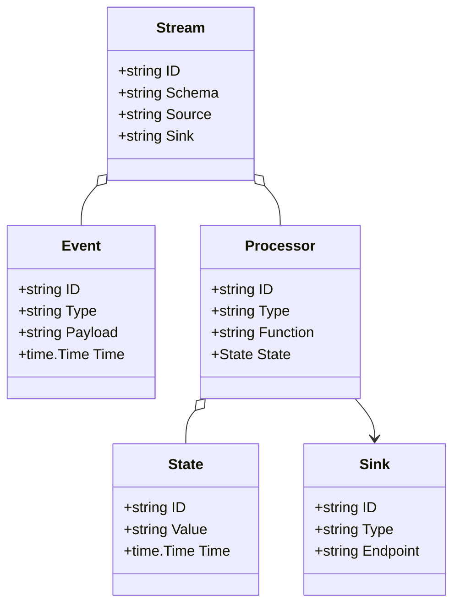
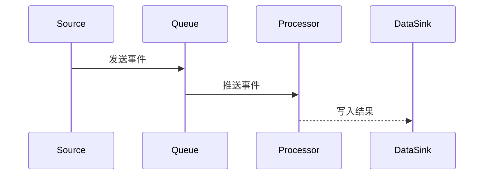

# 数据流架构（Golang国际主流实践）

## 目录

1. 数据流架构概述
    1.1 国际标准定义
    1.2 发展历程与核心思想
    1.3 典型应用场景
    1.4 与传统批处理/流处理系统对比
2. 信息概念架构
3. 分布式系统挑战
4. 架构设计解决方案
5. Golang国际主流实现范例
6. 形式化建模与证明
7. 参考与外部链接

---

## 1. 数据流架构概述

### 1.1 国际标准定义

数据流架构（Dataflow Architecture）是一种专注于大规模数据实时/准实时处理与分析的系统架构。其核心思想是将数据以流（Stream）为单位进行持续处理，强调高吞吐、低延迟、弹性伸缩与容错。

- **Apache Flink 定义**：
  > 数据流处理是一种持续处理无界或有界数据流的计算范式，强调事件驱动、低延迟和高吞吐。
  > ——[Flink Documentation](https://nightlies.apache.org/flink/flink-docs-release-1.17/docs/concepts/overview/)

- **国际主流引擎**：Apache Kafka、Flink、Beam、Pulsar、Google Dataflow、Confluent Platform。

### 1.2 发展历程与核心思想

- **发展历程**：
  - 2000s：批处理（Hadoop）为主，流处理需求逐步显现。
  - 2010s：Kafka、Storm、Flink等流处理引擎兴起，推动实时数据处理普及。
  - 2020s：云原生、Serverless、事件驱动架构推动流处理与大数据平台深度融合。

- **核心思想**：
  - 持续处理：数据流无终点，系统需持续运行。
  - 状态管理：有状态流处理，支持快照、恢复、容错。
  - 事件驱动：以事件为中心，支持复杂事件处理（CEP）。
  - 弹性伸缩：自动扩缩容，适应流量波动。
  - 端到端一致性：保证数据不丢失、顺序可控。

### 1.3 典型应用场景

- 日志分析、监控告警、实时推荐、金融风控、IoT数据采集、在线ETL、数据湖入湖等。
- 需要高吞吐、低延迟、弹性伸缩的数据处理场景。

### 1.4 与传统批处理/流处理系统对比

| 维度         | 传统批处理系统      | 现代数据流架构           |
|--------------|-------------------|-------------------------|
| 数据模型     | 静态批量文件       | 持续数据流/事件         |
| 处理方式     | 定时批量处理       | 实时/准实时持续处理     |
| 状态管理     | 弱/无状态          | 强状态管理、快照恢复    |
| 容错能力     | 失败需重跑         | 自动重试、断点续跑      |
| 扩展性       | 静态、手动扩展     | 云原生、自动弹性伸缩    |
| 一致性保障   | 事务/幂等性弱      | 端到端一致性、幂等性    |
| 适用场景     | 离线分析、报表     | 实时分析、在线决策      |

**国际主流参考**：Apache Kafka、Apache Flink、Apache Beam、Apache Pulsar、Google Dataflow、Confluent Platform 等。



---

## 2. 信息概念架构

### 2.1 领域建模方法

- 采用流处理建模（Stream Processing）、事件驱动建模（Event-Driven）、UML/ER图等。
- 核心实体：数据流（Stream）、事件（Event）、处理器（Processor）、存储（Sink/Source）、状态（State）。
- 强调流的有向性、处理器的状态管理、事件的时序性。

### 2.2 核心实体与关系

| 实体      | 属性                        | 关系           |
|-----------|-----------------------------|----------------|
| 数据流    | ID, Schema, Source, Sink    | 包含事件       |
| 事件      | ID, Type, Payload, Time     | 属于数据流     |
| 处理器    | ID, Type, Function, State   | 消费/处理事件  |
| 存储      | ID, Type, Endpoint          | 存储处理结果   |
| 状态      | ID, Value, Time             | 关联处理器     |

#### UML 类图（Mermaid）



### 2.3 典型数据流

1. 数据采集：数据源（如IoT设备、日志系统）产生事件流。
2. 流入消息队列：Kafka/Pulsar等作为高吞吐消息中间件。
3. 实时处理：Flink/Beam等流处理引擎消费事件，执行过滤、聚合、窗口计算等。
4. 结果存储：处理结果写入数据库、缓存、ES等。

#### 数据流时序图（Mermaid）



### 2.4 Golang 领域模型代码示例

```go
// 数据流实体
type Stream struct {
    ID     string
    Schema string
    Source string
    Sink   string
}
// 事件实体
type Event struct {
    ID      string
    Type    string
    Payload string
    Time    time.Time
}
// 处理器实体
type Processor struct {
    ID       string
    Type     string
    Function string
    State    State
}
// 存储实体
type Sink struct {
    ID       string
    Type     string
    Endpoint string
}
// 状态实体
type State struct {
    ID    string
    Value string
    Time  time.Time
}
```

---

## 3. 分布式系统挑战

### 3.1 高吞吐与低延迟

- **挑战场景**：大规模并发数据流，毫秒级延迟需求。
- **国际主流解决思路**：
  - Kafka/Pulsar等高吞吐消息队列，分区并行处理。
  - 流处理引擎（Flink/Beam）支持事件时间、乱序处理、窗口机制。
  - 零拷贝、批量处理、背压控制。
- **Golang代码片段**：

```go
// Kafka 消费批量处理
for {
    msgs, err := reader.FetchMessageBatch(ctx, batchSize)
    for _, m := range msgs {
        process(m.Value)
    }
}
```

### 3.2 弹性伸缩

- **挑战场景**：流量波动、节点动态扩缩容。
- **国际主流解决思路**：
  - Kubernetes自动扩缩容（HPA）、Flink动态分区、无状态Worker。
  - 分布式协调（Zookeeper、etcd）管理Worker池。
- **Golang代码片段**：

```go
// Worker池动态扩容伪代码
for i := 0; i < desiredWorkers; i++ {
    go startWorker()
}
```

### 3.3 容错与恢复

- **挑战场景**：节点故障、消息丢失、处理失败。
- **国际主流解决思路**：
  - Kafka/Pulsar持久化、Flink检查点/快照、Exactly-once语义。
  - 自动重试、幂等处理、死信队列（DLQ）。
- **Golang代码片段**：

```go
// 幂等处理示例
if !isProcessed(event.ID) {
    process(event)
    markProcessed(event.ID)
}
```

### 3.4 状态管理与一致性

- **挑战场景**：有状态流处理、状态快照、端到端一致性。
- **国际主流解决思路**：
  - Flink/Beam支持状态快照、恢复、Exactly-once。
  - 端到端一致性协议、幂等Sink、事务性写入。
- **Golang代码片段**：

```go
// 状态快照伪代码
func Snapshot(state State) error {
    return storage.Save(state)
}
```

### 3.5 可观测性与监控

- **挑战场景**：流处理链路追踪、性能瓶颈、异常告警。
- **国际主流解决思路**：
  - Prometheus+Grafana采集指标，OpenTelemetry链路追踪。
  - 日志聚合（ELK、Loki）、分布式追踪（Jaeger、Zipkin）。
- **Golang代码片段**：

```go
// Prometheus 指标埋点
import "github.com/prometheus/client_golang/prometheus"
var eventCount = prometheus.NewCounter(prometheus.CounterOpts{Name: "dataflow_event_total"})
eventCount.Inc()
```

---

## 4. 架构设计解决方案

### 4.1 消息队列与数据采集

- **设计原则**：高吞吐、持久化、分区、可扩展。
- **主流队列**：Kafka、Pulsar、RabbitMQ。
- **Golang代码示例**：

```go
// Kafka 生产者
writer := kafka.NewWriter(kafka.WriterConfig{Brokers: []string{"localhost:9092"}, Topic: "events"})
writer.WriteMessages(context.Background(), kafka.Message{Value: []byte("event data")})
```

### 4.2 流处理引擎

- **设计原则**：事件驱动、窗口计算、状态管理、Exactly-once。
- **主流引擎**：Flink、Beam、Benthos、Confluent Kafka Streams。
- **Golang代码示例**：

```go
// 简单流处理器接口
 type Processor interface {
     Process(ctx context.Context, data Event) ([]Event, error)
 }
```

### 4.3 状态管理与一致性

- **设计原则**：快照、检查点、端到端一致性、幂等Sink。
- **主流方案**：Flink状态后端、事务性写入、Exactly-once Sink。
- **Golang代码示例**：

```go
// 状态快照保存
func SaveSnapshot(state *State) error {
    return storage.Save(state)
}
```

### 4.4 可观测性与监控

- **设计原则**：全链路追踪、指标采集、自动告警。
- **主流工具**：Prometheus、Grafana、OpenTelemetry、Jaeger、Loki。
- **Golang代码示例**：

```go
// OpenTelemetry 链路追踪
import "go.opentelemetry.io/otel"
tracer := otel.Tracer("dataflow-service")
ctx, span := tracer.Start(context.Background(), "ProcessEvent")
defer span.End()
```

### 4.5 案例分析：Flink 实时数据流平台

- **背景**：Flink 支持大规模实时流处理，广泛应用于金融、广告、IoT等。
- **关键实践**：
  - 事件时间、窗口计算、状态快照、Exactly-once。
  - 与Kafka/Pulsar集成，端到端一致性。
- **参考链接**：[Flink Docs](https://nightlies.apache.org/flink/flink-docs-release-1.17/)

---

## 5. Golang国际主流实现范例

### 5.1 工程结构示例

```text
dataflow-demo/
├── cmd/                # 主程序入口
├── internal/           # 业务逻辑
│   ├── stream/
│   ├── processor/
│   └── sink/
├── api/                # gRPC/REST API 定义
├── pkg/                # 可复用组件
├── configs/            # 配置文件
├── scripts/            # 部署与运维脚本
├── build/              # Dockerfile、CI/CD配置
└── README.md
```

### 5.2 关键代码片段

#### Kafka 消费与处理

```go
import "github.com/segmentio/kafka-go"
reader := kafka.NewReader(kafka.ReaderConfig{Brokers: []string{"localhost:9092"}, Topic: "events", GroupID: "dataflow-group"})
for {
    m, err := reader.ReadMessage(context.Background())
    if err != nil {
        break
    }
    process(m.Value)
}
```

#### 流处理器接口

```go
type Processor interface {
    Process(ctx context.Context, data Event) ([]Event, error)
}
```

#### Prometheus 监控埋点

```go
import "github.com/prometheus/client_golang/prometheus"
var eventCount = prometheus.NewCounter(prometheus.CounterOpts{Name: "dataflow_event_total"})
eventCount.Inc()
```

### 5.3 CI/CD 配置（GitHub Actions 示例）

```yaml
# .github/workflows/ci.yml
name: Go CI
on:
  push:
    branches: [ main ]
jobs:
  build:
    runs-on: ubuntu-latest
    steps:
      - uses: actions/checkout@v3
      - name: Set up Go
        uses: actions/setup-go@v4
        with:
          go-version: '1.21'
      - name: Build
        run: go build ./...
      - name: Test
        run: go test ./...
```

---

## 6. 形式化建模与证明

### 6.1 数据流与处理建模

- 设 $D = \{d_1, d_2, ..., d_n\}$ 为数据流集合，$E = \{e_1, e_2, ..., e_m\}$ 为事件集合。
- 每个数据流 $d_i$ 是有向图 $G_i = (E_i, P_i)$，$E_i$ 为事件节点，$P_i$ 为处理器节点。
- 处理链建模为有向无环图（DAG），保证无循环依赖。

#### 性质1：可达性与终止性

- 若 $G_i$ 连通且无环，则所有事件最终可达终止节点。
- **证明思路**：DAG 拓扑排序保证事件处理顺序，所有事件最终被处理。

### 6.2 状态一致性与端到端语义

- 设 $S$ 为状态空间，$f: (d, e, p) \rightarrow s$ 为状态转移函数。
- **Exactly-once 定义**：每个事件 $e$ 在数据流 $d$ 中被处理且仅被处理一次。
- **证明思路**：
  1. 事件唯一ID，处理器幂等，状态快照。
  2. 端到端一致性协议，事务性Sink。
  3. 因此，系统保证Exactly-once语义。

### 6.3 CAP定理与流处理系统

- 流处理系统需在一致性（C）、可用性（A）、分区容忍性（P）间权衡。
- 多采用最终一致性与幂等处理提升可用性。

### 6.4 范畴论视角（可选）

- 数据流视为对象，处理器为态射，系统为范畴 $\mathcal{C}$。
- 组合律与单位元同前述建模。

### 6.5 符号说明

- $D$：数据流集合
- $E$：事件集合
- $G_i$：第 $i$ 个数据流的处理链图
- $P_i$：处理器节点集合
- $S$：状态空间
- $f$：状态转移函数

---

## 7. 参考与外部链接

- [Apache Kafka](https://kafka.apache.org/)
- [Apache Flink](https://flink.apache.org/)
- [Apache Beam](https://beam.apache.org/)
- [Apache Pulsar](https://pulsar.apache.org/)
- [Google Dataflow](https://cloud.google.com/dataflow)
- [Confluent Platform](https://www.confluent.io/)
- [Benthos](https://www.benthos.dev/)
- [Prometheus](https://prometheus.io/)
- [OpenTelemetry](https://opentelemetry.io/)
