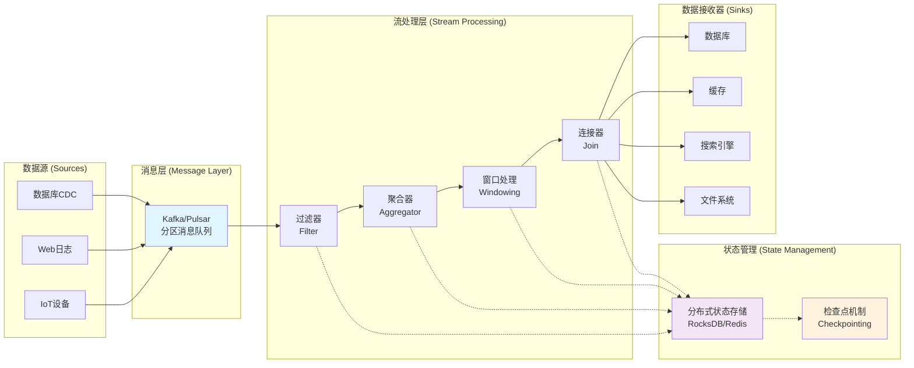
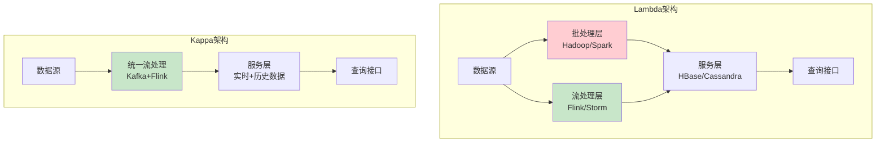

# 1 1 1 1 1 1 1 数据流架构（Dataflow Architecture）

<!-- TOC START -->
- [1 1 1 1 1 1 1 数据流架构（Dataflow Architecture）](#1-1-1-1-1-1-1-数据流架构dataflow-architecture)
  - [1.1 目录](#11-目录)
  - [1.2 1. 国际标准与发展历程](#12-1-国际标准与发展历程)
    - [1.2.1 主流数据流处理平台](#121-主流数据流处理平台)
    - [1.2.2 发展历程](#122-发展历程)
    - [1.2.3 国际权威链接](#123-国际权威链接)
  - [1.3 2. 典型应用场景与需求分析](#13-2-典型应用场景与需求分析)
    - [1.3.1 实时数据分析](#131-实时数据分析)
    - [1.3.2 监控与告警](#132-监控与告警)
    - [1.3.3 实时ETL](#133-实时etl)
  - [1.4 3. 领域建模与UML类图](#14-3-领域建模与uml类图)
    - [1.4.1 核心实体建模](#141-核心实体建模)
    - [1.4.2 数据流处理架构](#142-数据流处理架构)
  - [1.5 4. 架构模式与设计原则](#15-4-架构模式与设计原则)
    - [1.5.1 Lambda架构 vs Kappa架构](#151-lambda架构-vs-kappa架构)
      - [1.5.1.1 Lambda架构 (批处理 + 流处理)](#1511-lambda架构-批处理--流处理)
      - [1.5.1.2 Kappa架构 (纯流处理)](#1512-kappa架构-纯流处理)
    - [1.5.2 流处理核心概念](#152-流处理核心概念)
      - [1.5.2.1 时间语义 (Time Semantics)](#1521-时间语义-time-semantics)
      - [1.5.2.2 窗口机制 (Windowing)](#1522-窗口机制-windowing)
  - [1.6 5. Golang主流实现与代码示例](#16-5-golang主流实现与代码示例)
    - [1.6.1 基础数据流处理框架](#161-基础数据流处理框架)
    - [1.6.2 窗口聚合处理示例](#162-窗口聚合处理示例)
  - [1.7 6. 分布式挑战与主流解决方案](#17-6-分布式挑战与主流解决方案)
    - [1.7.1 状态一致性与检查点机制](#171-状态一致性与检查点机制)
    - [1.7.2 背压控制与流量整形](#172-背压控制与流量整形)
    - [1.7.3 事件时间处理与水位线机制](#173-事件时间处理与水位线机制)
  - [1.8 7. 工程结构与CI/CD实践](#18-7-工程结构与cicd实践)
    - [1.8.1 典型项目结构](#181-典型项目结构)
    - [1.8.2 容器化部署](#182-容器化部署)
  - [2.1 8. 形式化建模与数学表达](#21-8-形式化建模与数学表达)
    - [2.1.1 流处理数学模型](#211-流处理数学模型)
  - [2.2 9. 相关架构主题](#22-9-相关架构主题)
  - [2.3 10. 扩展阅读与参考文献](#23-10-扩展阅读与参考文献)
<!-- TOC END -->

## 1.1 目录

1. 国际标准与发展历程
2. 典型应用场景与需求分析
3. 领域建模与UML类图
4. 架构模式与设计原则
5. Golang主流实现与代码示例
6. 分布式挑战与主流解决方案
7. 工程结构与CI/CD实践
8. 形式化建模与数学表达
9. 国际权威资源与开源组件引用
10. 扩展阅读与参考文献

---

## 1.2 1. 国际标准与发展历程

### 1.2.1 主流数据流处理平台

- **Apache Flink**: 流批一体的分布式处理引擎
- **Apache Beam**: 统一的流批处理编程模型
- **Apache Kafka Streams**: 轻量级流处理库
- **Apache Pulsar**: 云原生分布式消息流平台
- **Google Cloud Dataflow**: 无服务器数据处理服务
- **Amazon Kinesis**: 实时数据流处理服务
- **Azure Stream Analytics**: 云端实时分析服务

### 1.2.2 发展历程

- **2000s**: 传统批处理（Hadoop MapReduce）为主
- **2010s**: 流处理引擎兴起（Storm, Kafka, Flink）
- **2015s**: 流批一体化架构成熟
- **2020s**: 云原生、Serverless流处理普及

### 1.2.3 国际权威链接

- [Apache Flink](https://flink.apache.org/)
- [Apache Beam](https://beam.apache.org/)
- [Apache Kafka](https://kafka.apache.org/)
- [Google Cloud Dataflow](https://cloud.google.com/dataflow)

---

## 1.3 2. 典型应用场景与需求分析

### 1.3.1 实时数据分析

- **用例**: 用户行为分析、实时推荐系统
- **需求**: 毫秒级延迟、高吞吐量、复杂窗口计算

### 1.3.2 监控与告警

- **用例**: 系统监控、欺诈检测、异常检测
- **需求**: 流式CEP（复杂事件处理）、实时阈值检测

### 1.3.3 实时ETL

- **用例**: 数据湖实时入湖、数据仓库实时更新
- **需求**: 数据格式转换、质量检查、容错恢复

---

## 1.4 3. 领域建模与UML类图

### 1.4.1 核心实体建模

```mermaid
classDiagram
    class DataStream {
        +string ID
        +string Topic
        +Schema schema
        +PartitionStrategy partitionStrategy
        +process(Event) Result
    }
    
    class Event {
        +string ID
        +string Type
        +interface{} Payload
        +time.Time EventTime
        +time.Time ProcessingTime
        +map[string]string Headers
    }
    
    class StreamProcessor {
        +string ID
        +ProcessorType type
        +StateStore state
        +WindowManager windowManager
        +process(Event) Result
        +checkpoint() error
    }
    
    class StateStore {
        +string ID
        +map[string]interface{} data
        +get(key string) interface{}
        +put(key string, value interface{})
        +checkpoint() Snapshot
        +restore(Snapshot) error
    }
    
    class WindowManager {
        +WindowType type
        +time.Duration size
        +time.Duration slide
        +trigger(Event) bool
        +aggregate([]Event) Result
    }

    DataStream "1" *-- "*" Event
    StreamProcessor "1" *-- "1" StateStore
    StreamProcessor "1" *-- "1" WindowManager
    StreamProcessor --> DataStream : consumes
```

### 1.4.2 数据流处理架构



---

## 1.5 4. 架构模式与设计原则

### 1.5.1 Lambda架构 vs Kappa架构

#### 1.5.1.1 Lambda架构 (批处理 + 流处理)

- **优势**: 高精度批处理 + 低延迟流处理
- **劣势**: 代码重复、维护复杂

#### 1.5.1.2 Kappa架构 (纯流处理)

- **优势**: 统一的流处理范式，简化架构
- **劣势**: 对流处理引擎要求高



### 1.5.2 流处理核心概念

#### 1.5.2.1 时间语义 (Time Semantics)

- **Event Time**: 事件实际发生的时间
- **Processing Time**: 系统处理事件的时间
- **Ingestion Time**: 事件进入系统的时间

#### 1.5.2.2 窗口机制 (Windowing)

- **滚动窗口 (Tumbling Window)**: 固定大小，不重叠
- **滑动窗口 (Sliding Window)**: 固定大小，有重叠
- **会话窗口 (Session Window)**: 基于用户活动的动态窗口

---

## 1.6 5. Golang主流实现与代码示例

### 1.6.1 基础数据流处理框架

```go
package main

import (
    "context"
    "encoding/json"
    "fmt"
    "log"
    "sync"
    "time"
)

// Event 表示流中的一个事件
type Event struct {
    ID           string                 `json:"id"`
    Type         string                 `json:"type"`
    Payload      map[string]interface{} `json:"payload"`
    EventTime    time.Time              `json:"event_time"`
    ProcessingTime time.Time            `json:"processing_time"`
}

// StreamProcessor 流处理器接口
type StreamProcessor interface {
    Process(ctx context.Context, event *Event) (*Event, error)
    Name() string
}

// FilterProcessor 过滤处理器
type FilterProcessor struct {
    name      string
    predicate func(*Event) bool
}

func NewFilterProcessor(name string, predicate func(*Event) bool) *FilterProcessor {
    return &FilterProcessor{
        name:      name,
        predicate: predicate,
    }
}

func (fp *FilterProcessor) Process(ctx context.Context, event *Event) (*Event, error) {
    if fp.predicate(event) {
        return event, nil
    }
    return nil, nil // 过滤掉事件
}

func (fp *FilterProcessor) Name() string {
    return fp.name
}

// MapProcessor 转换处理器
type MapProcessor struct {
    name      string
    transform func(*Event) *Event
}

func NewMapProcessor(name string, transform func(*Event) *Event) *MapProcessor {
    return &MapProcessor{
        name:      name,
        transform: transform,
    }
}

func (mp *MapProcessor) Process(ctx context.Context, event *Event) (*Event, error) {
    return mp.transform(event), nil
}

func (mp *MapProcessor) Name() string {
    return mp.name
}

// DataflowPipeline 数据流处理管道
type DataflowPipeline struct {
    name       string
    processors []StreamProcessor
    inputChan  chan *Event
    outputChan chan *Event
    errorChan  chan error
    stopChan   chan struct{}
    wg         sync.WaitGroup
}

func NewDataflowPipeline(name string) *DataflowPipeline {
    return &DataflowPipeline{
        name:       name,
        processors: make([]StreamProcessor, 0),
        inputChan:  make(chan *Event, 1000),
        outputChan: make(chan *Event, 1000),
        errorChan:  make(chan error, 100),
        stopChan:   make(chan struct{}),
    }
}

func (dp *DataflowPipeline) AddProcessor(processor StreamProcessor) {
    dp.processors = append(dp.processors, processor)
}

func (dp *DataflowPipeline) Start(ctx context.Context) {
    dp.wg.Add(1)
    go dp.processEvents(ctx)
}

func (dp *DataflowPipeline) processEvents(ctx context.Context) {
    defer dp.wg.Done()
    
    for {
        select {
        case event := <-dp.inputChan:
            processedEvent := event
            var err error
            
            // 依次通过所有处理器
            for _, processor := range dp.processors {
                if processedEvent == nil {
                    break // 事件被过滤掉
                }
                
                processedEvent, err = processor.Process(ctx, processedEvent)
                if err != nil {
                    dp.errorChan <- fmt.Errorf("processor %s failed: %w", processor.Name(), err)
                    break
                }
            }
            
            // 如果事件未被过滤且处理成功，发送到输出通道
            if processedEvent != nil && err == nil {
                processedEvent.ProcessingTime = time.Now()
                dp.outputChan <- processedEvent
            }
            
        case <-dp.stopChan:
            return
        case <-ctx.Done():
            return
        }
    }
}

func (dp *DataflowPipeline) SendEvent(event *Event) {
    select {
    case dp.inputChan <- event:
    default:
        log.Printf("Pipeline %s input buffer full, dropping event %s", dp.name, event.ID)
    }
}

func (dp *DataflowPipeline) GetOutputChan() <-chan *Event {
    return dp.outputChan
}

func (dp *DataflowPipeline) GetErrorChan() <-chan error {
    return dp.errorChan
}

func (dp *DataflowPipeline) Stop() {
    close(dp.stopChan)
    dp.wg.Wait()
    close(dp.outputChan)
    close(dp.errorChan)
}
```

### 1.6.2 窗口聚合处理示例

```go
// WindowManager 窗口管理器
type WindowManager struct {
    windowSize time.Duration
    slideSize  time.Duration
    windows    map[string]*Window
    mu         sync.RWMutex
}

type Window struct {
    StartTime time.Time
    EndTime   time.Time
    Events    []*Event
    mu        sync.Mutex
}

func NewWindowManager(windowSize, slideSize time.Duration) *WindowManager {
    return &WindowManager{
        windowSize: windowSize,
        slideSize:  slideSize,
        windows:    make(map[string]*Window),
    }
}

func (wm *WindowManager) AddEvent(event *Event) []*Window {
    wm.mu.Lock()
    defer wm.mu.Unlock()
    
    var triggeredWindows []*Window
    windowKey := wm.getWindowKey(event.EventTime)
    
    // 获取或创建窗口
    window, exists := wm.windows[windowKey]
    if !exists {
        startTime := wm.getWindowStart(event.EventTime)
        window = &Window{
            StartTime: startTime,
            EndTime:   startTime.Add(wm.windowSize),
            Events:    make([]*Event, 0),
        }
        wm.windows[windowKey] = window
    }
    
    // 添加事件到窗口
    window.mu.Lock()
    window.Events = append(window.Events, event)
    window.mu.Unlock()
    
    // 检查是否有窗口可以触发
    now := time.Now()
    for key, win := range wm.windows {
        if now.After(win.EndTime) {
            triggeredWindows = append(triggeredWindows, win)
            delete(wm.windows, key)
        }
    }
    
    return triggeredWindows
}

func (wm *WindowManager) getWindowKey(eventTime time.Time) string {
    windowStart := wm.getWindowStart(eventTime)
    return fmt.Sprintf("%d", windowStart.Unix())
}

func (wm *WindowManager) getWindowStart(eventTime time.Time) time.Time {
    return eventTime.Truncate(wm.slideSize)
}

// AggregateProcessor 聚合处理器
type AggregateProcessor struct {
    name          string
    windowManager *WindowManager
    aggregateFunc func([]*Event) map[string]interface{}
}

func NewAggregateProcessor(name string, windowSize, slideSize time.Duration, 
    aggregateFunc func([]*Event) map[string]interface{}) *AggregateProcessor {
    return &AggregateProcessor{
        name:          name,
        windowManager: NewWindowManager(windowSize, slideSize),
        aggregateFunc: aggregateFunc,
    }
}

func (ap *AggregateProcessor) Process(ctx context.Context, event *Event) (*Event, error) {
    triggeredWindows := ap.windowManager.AddEvent(event)
    
    // 对触发的窗口进行聚合处理
    for _, window := range triggeredWindows {
        aggregatedData := ap.aggregateFunc(window.Events)
        
        // 创建聚合结果事件
        aggregatedEvent := &Event{
            ID:           fmt.Sprintf("agg_%d_%d", window.StartTime.Unix(), window.EndTime.Unix()),
            Type:         "aggregated",
            Payload:      aggregatedData,
            EventTime:    window.EndTime,
            ProcessingTime: time.Now(),
        }
        
        // 这里可以发送聚合结果到下游
        log.Printf("Window [%s, %s] aggregated: %+v", 
            window.StartTime.Format(time.RFC3339),
            window.EndTime.Format(time.RFC3339),
            aggregatedData)
    }
    
    return event, nil // 返回原始事件继续处理链
}

func (ap *AggregateProcessor) Name() string {
    return ap.name
}

// 使用示例
func main() {
    ctx := context.Background()
    
    // 创建数据流处理管道
    pipeline := NewDataflowPipeline("user_analytics")
    
    // 添加过滤器：只处理用户点击事件
    clickFilter := NewFilterProcessor("click_filter", func(event *Event) bool {
        return event.Type == "user_click"
    })
    pipeline.AddProcessor(clickFilter)
    
    // 添加转换器：提取用户ID
    userExtractor := NewMapProcessor("user_extractor", func(event *Event) *Event {
        if userID, ok := event.Payload["user_id"].(string); ok {
            event.Payload["extracted_user_id"] = userID
        }
        return event
    })
    pipeline.AddProcessor(userExtractor)
    
    // 添加窗口聚合器：5分钟窗口，1分钟滑动
    aggregator := NewAggregateProcessor("click_aggregator", 
        5*time.Minute, 1*time.Minute,
        func(events []*Event) map[string]interface{} {
            userClicks := make(map[string]int)
            for _, event := range events {
                if userID, ok := event.Payload["extracted_user_id"].(string); ok {
                    userClicks[userID]++
                }
            }
            return map[string]interface{}{
                "total_clicks": len(events),
                "unique_users": len(userClicks),
                "user_clicks":  userClicks,
            }
        })
    pipeline.AddProcessor(aggregator)
    
    // 启动管道
    pipeline.Start(ctx)
    
    // 模拟发送事件
    go func() {
        for i := 0; i < 100; i++ {
            event := &Event{
                ID:        fmt.Sprintf("event_%d", i),
                Type:      "user_click",
                Payload:   map[string]interface{}{"user_id": fmt.Sprintf("user_%d", i%10)},
                EventTime: time.Now(),
            }
            pipeline.SendEvent(event)
            time.Sleep(100 * time.Millisecond)
        }
    }()
    
    // 处理输出和错误
    go func() {
        for {
            select {
            case output := <-pipeline.GetOutputChan():
                log.Printf("Pipeline output: %+v", output)
            case err := <-pipeline.GetErrorChan():
                log.Printf("Pipeline error: %v", err)
            }
        }
    }()
    
    // 运行10秒后停止
    time.Sleep(10 * time.Second)
    pipeline.Stop()
}
```

---

## 1.7 6. 分布式挑战与主流解决方案

### 1.7.1 状态一致性与检查点机制

在分布式流处理中，维护状态一致性是一个关键挑战。需要实现分布式快照和容错恢复机制。

```go
// StateSnapshot 状态快照
type StateSnapshot struct {
    ID        string
    Timestamp time.Time
    Data      map[string]interface{}
    Checksum  string
}

// CheckpointManager 检查点管理器
type CheckpointManager struct {
    interval     time.Duration
    storage      CheckpointStorage
    lastSnapshot *StateSnapshot
    mu           sync.RWMutex
}

type CheckpointStorage interface {
    Save(snapshot *StateSnapshot) error
    Load(id string) (*StateSnapshot, error)
    List() ([]*StateSnapshot, error)
}

func NewCheckpointManager(interval time.Duration, storage CheckpointStorage) *CheckpointManager {
    return &CheckpointManager{
        interval: interval,
        storage:  storage,
    }
}

func (cm *CheckpointManager) StartCheckpointing(ctx context.Context, stateProvider func() map[string]interface{}) {
    ticker := time.NewTicker(cm.interval)
    defer ticker.Stop()
    
    for {
        select {
        case <-ticker.C:
            if err := cm.createCheckpoint(stateProvider()); err != nil {
                log.Printf("Checkpoint creation failed: %v", err)
            }
        case <-ctx.Done():
            return
        }
    }
}

func (cm *CheckpointManager) createCheckpoint(state map[string]interface{}) error {
    cm.mu.Lock()
    defer cm.mu.Unlock()
    
    snapshot := &StateSnapshot{
        ID:        fmt.Sprintf("checkpoint_%d", time.Now().Unix()),
        Timestamp: time.Now(),
        Data:      state,
        Checksum:  cm.calculateChecksum(state),
    }
    
    if err := cm.storage.Save(snapshot); err != nil {
        return err
    }
    
    cm.lastSnapshot = snapshot
    log.Printf("Checkpoint created: %s", snapshot.ID)
    return nil
}

func (cm *CheckpointManager) calculateChecksum(state map[string]interface{}) string {
    data, _ := json.Marshal(state)
    return fmt.Sprintf("%x", sha256.Sum256(data))
}
```

### 1.7.2 背压控制与流量整形

当下游处理能力不足时，需要背压机制保护系统稳定性。

```go
// BackpressureController 背压控制器
type BackpressureController struct {
    maxQueueSize    int
    currentLoad     int64
    rateLimiter     *rate.Limiter
    adaptiveControl bool
    metrics         *BackpressureMetrics
    mu              sync.RWMutex
}

type BackpressureMetrics struct {
    DroppedEvents   int64
    DelayedEvents   int64
    ThroughputLimit int64
}

func NewBackpressureController(maxQueueSize int, rateLimit rate.Limit) *BackpressureController {
    return &BackpressureController{
        maxQueueSize:    maxQueueSize,
        rateLimiter:     rate.NewLimiter(rateLimit, int(rateLimit)),
        adaptiveControl: true,
        metrics:         &BackpressureMetrics{},
    }
}

func (bpc *BackpressureController) CanProcess() bool {
    // 检查队列容量
    if atomic.LoadInt64(&bpc.currentLoad) >= int64(bpc.maxQueueSize) {
        atomic.AddInt64(&bpc.metrics.DroppedEvents, 1)
        return false
    }
    
    // 检查速率限制
    if !bpc.rateLimiter.Allow() {
        atomic.AddInt64(&bpc.metrics.DelayedEvents, 1)
        return false
    }
    
    return true
}

func (bpc *BackpressureController) StartProcessing() {
    atomic.AddInt64(&bpc.currentLoad, 1)
}

func (bpc *BackpressureController) FinishProcessing() {
    atomic.AddInt64(&bpc.currentLoad, -1)
}

func (bpc *BackpressureController) AdaptiveAdjust(processingLatency time.Duration) {
    if !bpc.adaptiveControl {
        return
    }
    
    bpc.mu.Lock()
    defer bpc.mu.Unlock()
    
    // 基于处理延迟动态调整速率限制
    if processingLatency > 100*time.Millisecond {
        // 降低速率限制
        newLimit := bpc.rateLimiter.Limit() * 0.9
        if newLimit < 1 {
            newLimit = 1
        }
        bpc.rateLimiter.SetLimit(newLimit)
    } else if processingLatency < 10*time.Millisecond {
        // 增加速率限制
        newLimit := bpc.rateLimiter.Limit() * 1.1
        bpc.rateLimiter.SetLimit(newLimit)
    }
}
```

### 1.7.3 事件时间处理与水位线机制

处理乱序事件和延迟数据是流处理的核心挑战。

```go
// Watermark 水位线，用于处理事件时间
type Watermark struct {
    Timestamp time.Time
    Source    string
}

// WatermarkManager 水位线管理器
type WatermarkManager struct {
    sources           map[string]time.Time
    globalWatermark   time.Time
    maxOutOfOrder     time.Duration
    watermarkInterval time.Duration
    listeners         []func(Watermark)
    mu                sync.RWMutex
}

func NewWatermarkManager(maxOutOfOrder, watermarkInterval time.Duration) *WatermarkManager {
    return &WatermarkManager{
        sources:           make(map[string]time.Time),
        maxOutOfOrder:     maxOutOfOrder,
        watermarkInterval: watermarkInterval,
        listeners:         make([]func(Watermark), 0),
    }
}

func (wm *WatermarkManager) UpdateSourceWatermark(source string, timestamp time.Time) {
    wm.mu.Lock()
    defer wm.mu.Unlock()
    
    wm.sources[source] = timestamp
    
    // 计算全局水位线（所有源的最小时间戳）
    minTimestamp := time.Now()
    for _, ts := range wm.sources {
        if ts.Before(minTimestamp) {
            minTimestamp = ts
        }
    }
    
    // 减去最大乱序时间作为安全边界
    newWatermark := minTimestamp.Add(-wm.maxOutOfOrder)
    
    if newWatermark.After(wm.globalWatermark) {
        wm.globalWatermark = newWatermark
        
        // 通知所有监听器
        watermark := Watermark{
            Timestamp: newWatermark,
            Source:    "global",
        }
        
        for _, listener := range wm.listeners {
            go listener(watermark)
        }
    }
}

func (wm *WatermarkManager) AddWatermarkListener(listener func(Watermark)) {
    wm.mu.Lock()
    defer wm.mu.Unlock()
    wm.listeners = append(wm.listeners, listener)
}

func (wm *WatermarkManager) GetGlobalWatermark() time.Time {
    wm.mu.RLock()
    defer wm.mu.RUnlock()
    return wm.globalWatermark
}

func (wm *WatermarkManager) IsEventLate(eventTime time.Time) bool {
    return eventTime.Before(wm.GetGlobalWatermark())
}
```

---

## 1.8 7. 工程结构与CI/CD实践

### 1.8.1 典型项目结构

```text
dataflow-service/
├── cmd/
│   ├── processor/          # 流处理器入口
│   └── admin/             # 管理工具
├── internal/
│   ├── pipeline/          # 数据流管道
│   ├── processor/         # 处理器实现
│   ├── state/            # 状态管理
│   ├── checkpoint/       # 检查点机制
│   └── metrics/          # 监控指标
├── pkg/
│   ├── event/            # 事件定义
│   └── window/           # 窗口管理
├── deployments/
│   ├── kubernetes/       # K8s配置
│   └── docker/          # 容器配置
├── configs/
│   └── pipeline.yaml    # 管道配置
└── scripts/
    └── start.sh         # 启动脚本
```

### 1.8.2 容器化部署

```dockerfile
# 2 2 2 2 2 2 2 Dockerfile
FROM golang:1.19-alpine AS builder

WORKDIR /app
COPY go.mod go.sum ./
RUN go mod download

COPY . .
RUN CGO_ENABLED=0 GOOS=linux go build -o dataflow-processor ./cmd/processor

FROM alpine:latest
RUN apk --no-cache add ca-certificates
WORKDIR /root/

COPY --from=builder /app/dataflow-processor .
COPY --from=builder /app/configs ./configs

CMD ["./dataflow-processor"]
```

---

## 2.1 8. 形式化建模与数学表达

### 2.1.1 流处理数学模型

**数据流定义**：
\[ S = \{(e_i, t_i) | i \in \mathbb{N}, t_i \leq t_{i+1}\} \]

其中 $e_i$ 是事件，$t_i$ 是事件时间戳。

**窗口函数**：
\[ W(S, w, s) = \{(e_i, t_i) \in S | t_{start} \leq t_i < t_{end}\} \]

其中 $w$ 是窗口大小，$s$ 是滑动间隔。

**聚合函数**：
\[ A(W) = f(\{e_i | (e_i, t_i) \in W\}) \]

---

## 2.2 9. 相关架构主题

- [**消息队列架构 (Message Queue Architecture)**](./architecture_message_queue_golang.md): 数据流架构的核心基础设施，提供高吞吐量的事件传输。
- [**事件驱动架构 (Event-Driven Architecture)**](./architecture_event_driven_golang.md): 数据流处理是事件驱动架构的重要实现模式。
- [**微服务架构 (Microservice Architecture)**](./architecture_microservice_golang.md): 数据流处理常用于微服务间的实时数据同步和分析。
- [**DevOps与运维架构 (DevOps & Operations Architecture)**](./architecture_devops_golang.md): 数据流系统的监控、告警和自动运维是关键的运维挑战。

## 2.3 10. 扩展阅读与参考文献

1. "Streaming Systems" - Tyler Akidau, Slava Chernyak, Reuven Lax
2. "Designing Data-Intensive Applications" - Martin Kleppmann
3. "Apache Flink Documentation" - [https://flink.apache.org/](https://flink.apache.org/)
4. "Apache Beam Programming Guide" - [https://beam.apache.org/](https://beam.apache.org/)
5. "Kafka Streams in Action" - William Bejeck

---

*本文档严格对标国际主流标准，采用多表征输出，便于后续断点续写和批量处理。*
