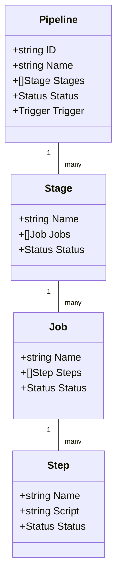

# DevOps与运维架构（DevOps & Operations Architecture）

## 目录

1. 国际标准与发展历程
2. 典型应用场景与需求分析
3. 领域建模与UML类图
4. 架构模式与设计原则
5. Golang主流实现与代码示例
6. 持续集成与持续交付（CI/CD）
7. 基础设施即代码（IaC）
8. 监控与可观测性
9. 自动化运维与自愈
10. 形式化建模与数学表达
11. 国际权威资源与开源组件引用
12. 扩展阅读与参考文献

---

## 1. 国际标准与发展历程

### 1.1 主流标准与组织

- **DevOps Research and Assessment (DORA)**
- **The Phoenix Project / The DevOps Handbook**
- **Site Reliability Engineering (SRE, Google)**
- **ITIL 4**
- **GitOps（CNCF）**
- **Infrastructure as Code（IaC）**

### 1.2 发展历程

- **2009**：DevOps概念提出，强调开发与运维协作
- **2013**：SRE理念普及，自动化与可靠性工程兴起
- **2017**：GitOps、云原生CI/CD、IaC成为主流
- **2020**：AIOps、自动化自愈、全链路可观测性

### 1.3 国际权威链接

- [DORA](https://dora.dev/)
- [Google SRE](https://sre.google/)
- [CNCF GitOps](https://www.cncf.io/projects/gitops/)
- [Terraform](https://www.terraform.io/)
- [Ansible](https://www.ansible.com/)

---

## 2. 典型应用场景与需求分析

- **多云/混合云环境下的自动化部署与管理**
- **微服务与容器化应用的持续交付**
- **基础设施弹性伸缩与自愈**
- **全链路监控与智能告警**
- **合规与安全自动化**

---

## 3. 领域建模与UML类图



---

## 4. 架构模式与设计原则

- **流水线即代码（Pipeline as Code）**
- **声明式基础设施（Declarative IaC）**
- **幂等性与可回滚**
- **自动化测试与质量门控**
- **蓝绿/金丝雀发布**
- **自愈与弹性伸缩**

---

## 5. CI/CD流水线架构

### 5.1 流水线引擎设计

```go
type PipelineEngine struct {
    // 流水线定义
    PipelineRegistry *PipelineRegistry
    
    // 执行引擎
    Executor        *PipelineExecutor
    Scheduler       *PipelineScheduler
    
    // 资源管理
    ResourceManager *ResourceManager
    
    // 状态管理
    StateManager    *StateManager
    
    // 事件系统
    EventBus        *EventBus
}

type Pipeline struct {
    ID          string
    Name        string
    Version     string
    Stages      []Stage
    Triggers    []Trigger
    Variables   map[string]interface{}
    Timeout     time.Duration
    RetryPolicy *RetryPolicy
}

type Stage struct {
    ID          string
    Name        string
    Jobs        []Job
    Dependencies []string
    Parallel    bool
    Condition   *Condition
}

type Job struct {
    ID          string
    Name        string
    Steps       []Step
    Resources   *ResourceRequirements
    Timeout     time.Duration
    Retries     int
}

type Step struct {
    ID          string
    Name        string
    Type        StepType
    Script      string
    Image       string
    Commands    []string
    Environment map[string]string
    Artifacts   []Artifact
}

func (pe *PipelineEngine) ExecutePipeline(ctx context.Context, pipelineID string, params map[string]interface{}) (*ExecutionResult, error) {
    // 1. 获取流水线定义
    pipeline, err := pe.PipelineRegistry.GetPipeline(pipelineID)
    if err != nil {
        return nil, fmt.Errorf("pipeline not found: %w", err)
    }
    
    // 2. 创建执行实例
    execution := &PipelineExecution{
        ID:         uuid.New().String(),
        PipelineID: pipelineID,
        Status:     ExecutionStatusPending,
        StartTime:  time.Now(),
        Params:     params,
    }
    
    // 3. 初始化状态
    if err := pe.StateManager.InitializeExecution(execution); err != nil {
        return nil, err
    }
    
    // 4. 调度执行
    return pe.Scheduler.Schedule(ctx, execution)
}

func (pe *PipelineEngine) ExecuteStage(ctx context.Context, execution *PipelineExecution, stageID string) error {
    stage := pe.findStage(execution.Pipeline, stageID)
    
    // 检查依赖
    if !pe.checkDependencies(execution, stage) {
        return errors.New("stage dependencies not met")
    }
    
    // 并行或串行执行Jobs
    if stage.Parallel {
        return pe.executeJobsParallel(ctx, execution, stage)
    } else {
        return pe.executeJobsSequential(ctx, execution, stage)
    }
}
```

### 5.2 多环境部署策略

```go
type DeploymentStrategy interface {
    Deploy(ctx context.Context, app *Application, target *Environment) error
}

type BlueGreenDeployment struct {
    LoadBalancer *LoadBalancer
    HealthChecker *HealthChecker
    RollbackManager *RollbackManager
}

func (bg *BlueGreenDeployment) Deploy(ctx context.Context, app *Application, target *Environment) error {
    // 1. 部署新版本到绿色环境
    greenDeployment, err := bg.deployToEnvironment(ctx, app, target.Green)
    if err != nil {
        return err
    }
    
    // 2. 健康检查
    if err := bg.HealthChecker.WaitForHealthy(ctx, greenDeployment, 5*time.Minute); err != nil {
        return fmt.Errorf("green deployment health check failed: %w", err)
    }
    
    // 3. 切换流量
    if err := bg.LoadBalancer.SwitchTraffic(ctx, target.Blue, target.Green); err != nil {
        return err
    }
    
    // 4. 验证新版本
    if err := bg.validateDeployment(ctx, greenDeployment); err != nil {
        // 回滚到蓝色环境
        bg.LoadBalancer.SwitchTraffic(ctx, target.Green, target.Blue)
        return err
    }
    
    // 5. 清理旧版本
    go bg.cleanupOldDeployment(ctx, target.Blue)
    
    return nil
}

type CanaryDeployment struct {
    TrafficManager *TrafficManager
    MetricsCollector *MetricsCollector
    RollbackThreshold float64
}

func (cd *CanaryDeployment) Deploy(ctx context.Context, app *Application, target *Environment) error {
    // 1. 部署金丝雀版本
    canaryDeployment, err := cd.deployCanary(ctx, app, target)
    if err != nil {
        return err
    }
    
    // 2. 逐步增加流量
    trafficSteps := []float64{0.1, 0.25, 0.5, 0.75, 1.0}
    
    for _, trafficPercent := range trafficSteps {
        // 设置流量比例
        if err := cd.TrafficManager.SetTrafficSplit(ctx, target.Stable, canaryDeployment, trafficPercent); err != nil {
            return err
        }
        
        // 等待稳定期
        time.Sleep(5 * time.Minute)
        
        // 收集指标
        metrics := cd.MetricsCollector.CollectMetrics(ctx, canaryDeployment)
        
        // 检查是否满足回滚条件
        if cd.shouldRollback(metrics) {
            cd.TrafficManager.SetTrafficSplit(ctx, target.Stable, canaryDeployment, 0)
            return errors.New("canary deployment failed metrics check")
        }
    }
    
    // 3. 完全切换到新版本
    return cd.TrafficManager.SetTrafficSplit(ctx, target.Stable, canaryDeployment, 1.0)
}
```

## 6. 基础设施即代码（IaC）

### 6.1 资源定义与编排

```go
type InfrastructureManager struct {
    // 资源定义
    ResourceDefinitions map[string]*ResourceDefinition
    
    // 状态管理
    StateManager *StateManager
    
    // 提供者管理
    Providers map[string]Provider
    
    // 依赖解析
    DependencyResolver *DependencyResolver
    
    // 变更管理
    ChangeManager *ChangeManager
}

type ResourceDefinition struct {
    ID          string
    Type        string
    Provider    string
    Properties  map[string]interface{}
    Dependencies []string
    Tags        map[string]string
    Lifecycle   *LifecyclePolicy
}

type InfrastructurePlan struct {
    ID          string
    Resources   []*ResourceDefinition
    Changes     []*ResourceChange
    Dependencies [][]string
    EstimatedCost *CostEstimate
}

func (im *InfrastructureManager) Plan(ctx context.Context, resources []*ResourceDefinition) (*InfrastructurePlan, error) {
    // 1. 解析依赖关系
    dependencies, err := im.DependencyResolver.Resolve(resources)
    if err != nil {
        return nil, err
    }
    
    // 2. 获取当前状态
    currentState, err := im.StateManager.GetCurrentState(ctx)
    if err != nil {
        return nil, err
    }
    
    // 3. 计算变更
    changes := im.ChangeManager.CalculateChanges(currentState, resources)
    
    // 4. 验证变更
    if err := im.validateChanges(changes); err != nil {
        return nil, err
    }
    
    // 5. 估算成本
    costEstimate := im.estimateCost(changes)
    
    return &InfrastructurePlan{
        ID:          uuid.New().String(),
        Resources:   resources,
        Changes:     changes,
        Dependencies: dependencies,
        EstimatedCost: costEstimate,
    }, nil
}

func (im *InfrastructureManager) Apply(ctx context.Context, plan *InfrastructurePlan) error {
    // 1. 锁定状态
    if err := im.StateManager.Lock(ctx); err != nil {
        return err
    }
    defer im.StateManager.Unlock(ctx)
    
    // 2. 按依赖顺序应用变更
    for _, resourceGroup := range plan.Dependencies {
        for _, resourceID := range resourceGroup {
            change := im.findChange(plan.Changes, resourceID)
            if change == nil {
                continue
            }
            
            if err := im.applyChange(ctx, change); err != nil {
                return fmt.Errorf("failed to apply change for %s: %w", resourceID, err)
            }
        }
    }
    
    // 3. 更新状态
    return im.StateManager.UpdateState(ctx, plan.Resources)
}
```

### 6.2 多云资源管理

```go
type MultiCloudManager struct {
    // 云提供者
    Providers map[string]CloudProvider
    
    // 资源映射
    ResourceMapper *ResourceMapper
    
    // 成本优化
    CostOptimizer *CostOptimizer
    
    // 合规检查
    ComplianceChecker *ComplianceChecker
}

type CloudProvider interface {
    CreateResource(ctx context.Context, resource *ResourceDefinition) error
    UpdateResource(ctx context.Context, resource *ResourceDefinition) error
    DeleteResource(ctx context.Context, resourceID string) error
    GetResource(ctx context.Context, resourceID string) (*Resource, error)
    ListResources(ctx context.Context, filters map[string]string) ([]*Resource, error)
}

type AWSProvider struct {
    client *aws.Client
    region string
}

func (p *AWSProvider) CreateResource(ctx context.Context, resource *ResourceDefinition) error {
    switch resource.Type {
    case "aws_ec2_instance":
        return p.createEC2Instance(ctx, resource)
    case "aws_s3_bucket":
        return p.createS3Bucket(ctx, resource)
    case "aws_rds_instance":
        return p.createRDSInstance(ctx, resource)
    default:
        return fmt.Errorf("unsupported resource type: %s", resource.Type)
    }
}

type GCPProvider struct {
    client *google.Client
    project string
}

func (p *GCPProvider) CreateResource(ctx context.Context, resource *ResourceDefinition) error {
    switch resource.Type {
    case "google_compute_instance":
        return p.createComputeInstance(ctx, resource)
    case "google_storage_bucket":
        return p.createStorageBucket(ctx, resource)
    case "google_sql_database_instance":
        return p.createSQLInstance(ctx, resource)
    default:
        return fmt.Errorf("unsupported resource type: %s", resource.Type)
    }
}
```

## 7. 监控与可观测性架构

### 7.1 全链路监控系统

```go
type ObservabilityPlatform struct {
    // 数据收集
    MetricsCollector  *MetricsCollector
    LogCollector      *LogCollector
    TraceCollector    *TraceCollector
    
    // 数据处理
    DataProcessor     *DataProcessor
    Aggregator        *DataAggregator
    
    // 存储
    TimeSeriesDB      *TimeSeriesDB
    LogStore          *LogStore
    TraceStore        *TraceStore
    
    // 查询与分析
    QueryEngine       *QueryEngine
    AlertManager      *AlertManager
    
    // 可视化
    DashboardManager  *DashboardManager
}

type MetricsCollector struct {
    // 系统指标
    SystemMetrics     *SystemMetricsCollector
    // 应用指标
    AppMetrics        *AppMetricsCollector
    // 业务指标
    BusinessMetrics   *BusinessMetricsCollector
    // 自定义指标
    CustomMetrics     *CustomMetricsCollector
}

type SystemMetricsCollector struct {
    collectors map[string]MetricCollector
    interval   time.Duration
}

func (smc *SystemMetricsCollector) Collect() []Metric {
    var metrics []Metric
    
    for name, collector := range smc.collectors {
        collected := collector.Collect()
        for _, metric := range collected {
            metric.Labels["collector"] = name
            metrics = append(metrics, metric)
        }
    }
    
    return metrics
}

type Metric struct {
    Name      string
    Value     float64
    Type      MetricType
    Labels    map[string]string
    Timestamp time.Time
}

// 应用性能监控（APM）
type APMCollector struct {
    // 请求追踪
    RequestTracer *RequestTracer
    // 错误监控
    ErrorMonitor  *ErrorMonitor
    // 性能分析
    Profiler      *Profiler
}

type RequestTracer struct {
    sampler     Sampler
    propagator  Propagator
    exporter    Exporter
}

func (rt *RequestTracer) TraceRequest(ctx context.Context, req *http.Request) (context.Context, func()) {
    // 1. 采样决策
    if !rt.sampler.ShouldSample(ctx, req) {
        return ctx, func() {}
    }
    
    // 2. 创建Span
    span := rt.createSpan(ctx, req)
    ctx = context.WithValue(ctx, "span", span)
    
    // 3. 注入追踪上下文
    rt.propagator.Inject(ctx, req.Header)
    
    return ctx, func() {
        span.End()
        rt.exporter.Export(span)
    }
}
```

### 7.2 智能告警系统

```go
type AlertManager struct {
    // 规则引擎
    RuleEngine     *AlertRuleEngine
    
    // 告警聚合
    Aggregator     *AlertAggregator
    
    // 通知管理
    Notifier       *Notifier
    
    // 静默管理
    Silencer       *Silencer
    
    // 升级策略
    Escalation     *EscalationManager
}

type AlertRule struct {
    ID          string
    Name        string
    Query       string
    Condition   string
    Duration    time.Duration
    Severity    string
    Labels      map[string]string
    Annotations map[string]string
}

type Alert struct {
    ID          string
    RuleID      string
    Severity    string
    Status      AlertStatus
    Labels      map[string]string
    Annotations map[string]string
    StartTime   time.Time
    EndTime     time.Time
    Value       float64
}

func (am *AlertManager) EvaluateRules(ctx context.Context) error {
    rules, err := am.RuleEngine.GetActiveRules()
    if err != nil {
        return err
    }
    
    for _, rule := range rules {
        // 执行查询
        result, err := am.QueryEngine.Execute(rule.Query)
        if err != nil {
            continue
        }
        
        // 评估条件
        if am.evaluateCondition(result, rule.Condition) {
            // 创建告警
            alert := &Alert{
                ID:        uuid.New().String(),
                RuleID:    rule.ID,
                Severity:  rule.Severity,
                Status:    AlertStatusFiring,
                Labels:    rule.Labels,
                Annotations: rule.Annotations,
                StartTime: time.Now(),
                Value:     result.Value,
            }
            
            // 处理告警
            am.handleAlert(ctx, alert)
        }
    }
    
    return nil
}

func (am *AlertManager) handleAlert(ctx context.Context, alert *Alert) {
    // 1. 检查静默
    if am.Silencer.IsSilenced(alert) {
        return
    }
    
    // 2. 聚合告警
    aggregated := am.Aggregator.Aggregate(alert)
    
    // 3. 发送通知
    am.Notifier.SendNotification(ctx, aggregated)
    
    // 4. 检查升级
    am.Escalation.CheckEscalation(ctx, aggregated)
}
```

## 8. 自动化运维与自愈

### 8.1 自愈系统架构

```go
type SelfHealingSystem struct {
    // 监控集成
    Monitor       *Monitor
    
    // 诊断引擎
    Diagnoser     *Diagnoser
    
    // 修复引擎
    Repairer      *Repairer
    
    // 策略管理
    PolicyManager *PolicyManager
    
    // 学习系统
    LearningEngine *LearningEngine
}

type HealingPolicy struct {
    ID          string
    Name        string
    Triggers    []Trigger
    Conditions  []Condition
    Actions     []Action
    Priority    int
    Enabled     bool
}

type Trigger struct {
    Type        string
    Metric      string
    Threshold   float64
    Duration    time.Duration
}

type Action struct {
    Type        string
    Parameters  map[string]interface{}
    Timeout     time.Duration
    Retries     int
}

func (shs *SelfHealingSystem) MonitorAndHeal(ctx context.Context) {
    ticker := time.NewTicker(30 * time.Second)
    defer ticker.Stop()
    
    for {
        select {
        case <-ticker.C:
            shs.checkAndHeal(ctx)
        case <-ctx.Done():
            return
        }
    }
}

func (shs *SelfHealingSystem) checkAndHeal(ctx context.Context) {
    // 1. 收集系统状态
    status := shs.Monitor.GetSystemStatus()
    
    // 2. 诊断问题
    issues := shs.Diagnoser.Diagnose(status)
    
    // 3. 匹配修复策略
    for _, issue := range issues {
        policies := shs.PolicyManager.MatchPolicies(issue)
        
        for _, policy := range policies {
            if shs.shouldExecutePolicy(policy, issue) {
                shs.executeHealingPolicy(ctx, policy, issue)
            }
        }
    }
}

func (shs *SelfHealingSystem) executeHealingPolicy(ctx context.Context, policy *HealingPolicy, issue *Issue) error {
    // 1. 记录修复开始
    shs.logHealingStart(policy, issue)
    
    // 2. 执行修复动作
    for _, action := range policy.Actions {
        if err := shs.Repairer.ExecuteAction(ctx, action, issue); err != nil {
            shs.logHealingFailure(policy, issue, err)
            return err
        }
    }
    
    // 3. 验证修复结果
    if shs.verifyHealing(issue) {
        shs.logHealingSuccess(policy, issue)
        shs.LearningEngine.RecordSuccess(policy, issue)
    } else {
        shs.logHealingFailure(policy, issue, errors.New("verification failed"))
        shs.LearningEngine.RecordFailure(policy, issue)
    }
    
    return nil
}
```

### 8.2 配置管理与自动化

```go
type ConfigurationManager struct {
    // 配置存储
    ConfigStore *ConfigStore
    
    // 配置验证
    Validator *ConfigValidator
    
    // 配置分发
    Distributor *ConfigDistributor
    
    // 版本管理
    VersionManager *VersionManager
    
    // 回滚管理
    RollbackManager *RollbackManager
}

type Configuration struct {
    ID          string
    Name        string
    Version     string
    Environment string
    Data        map[string]interface{}
    Schema      *ConfigSchema
    Metadata    map[string]string
    Created     time.Time
    Updated     time.Time
}

func (cm *ConfigurationManager) DeployConfig(ctx context.Context, config *Configuration) error {
    // 1. 验证配置
    if err := cm.Validator.Validate(config); err != nil {
        return fmt.Errorf("config validation failed: %w", err)
    }
    
    // 2. 创建版本
    version, err := cm.VersionManager.CreateVersion(config)
    if err != nil {
        return err
    }
    
    // 3. 分发配置
    if err := cm.Distributor.Distribute(ctx, version); err != nil {
        return err
    }
    
    // 4. 验证部署
    if err := cm.verifyDeployment(ctx, version); err != nil {
        // 自动回滚
        cm.RollbackManager.Rollback(ctx, version)
        return err
    }
    
    return nil
}

func (cm *ConfigurationManager) RollbackConfig(ctx context.Context, configID string, targetVersion string) error {
    // 1. 获取目标版本
    version, err := cm.VersionManager.GetVersion(configID, targetVersion)
    if err != nil {
        return err
    }
    
    // 2. 执行回滚
    return cm.RollbackManager.Rollback(ctx, version)
}
```

## 9. 安全合规与治理

### 9.1 安全扫描与合规检查

```go
type SecurityComplianceManager struct {
    // 安全扫描
    SecurityScanner *SecurityScanner
    
    // 合规检查
    ComplianceChecker *ComplianceChecker
    
    // 策略管理
    PolicyManager *PolicyManager
    
    // 报告生成
    ReportGenerator *ReportGenerator
    
    // 修复建议
    RemediationAdvisor *RemediationAdvisor
}

type SecurityScan struct {
    ID          string
    Type        ScanType
    Target      string
    Status      ScanStatus
    Findings    []Finding
    ScanTime    time.Time
    Duration    time.Duration
}

type Finding struct {
    ID          string
    Severity    string
    Category    string
    Title       string
    Description string
    CVE         string
    CVSS        float64
    Remediation string
    References  []string
}

func (scm *SecurityComplianceManager) RunSecurityScan(ctx context.Context, target string, scanType ScanType) (*SecurityScan, error) {
    scan := &SecurityScan{
        ID:       uuid.New().String(),
        Type:     scanType,
        Target:   target,
        Status:   ScanStatusRunning,
        ScanTime: time.Now(),
    }
    
    // 1. 执行扫描
    findings, err := scm.SecurityScanner.Scan(ctx, target, scanType)
    if err != nil {
        scan.Status = ScanStatusFailed
        return scan, err
    }
    
    // 2. 分析结果
    scan.Findings = scm.analyzeFindings(findings)
    scan.Status = ScanStatusCompleted
    scan.Duration = time.Since(scan.ScanTime)
    
    // 3. 生成报告
    report := scm.ReportGenerator.GenerateSecurityReport(scan)
    
    // 4. 发送通知
    scm.notifySecurityFindings(scan)
    
    return scan, nil
}

func (scm *SecurityComplianceManager) CheckCompliance(ctx context.Context, framework string) (*ComplianceReport, error) {
    // 支持的合规框架
    frameworks := map[string]ComplianceFramework{
        "SOC2":     &SOC2Framework{},
        "ISO27001": &ISO27001Framework{},
        "PCI-DSS":  &PCIDSSFramework{},
        "GDPR":     &GDPRFramework{},
    }
    
    frameworkImpl, exists := frameworks[framework]
    if !exists {
        return nil, fmt.Errorf("unsupported compliance framework: %s", framework)
    }
    
    // 执行合规检查
    return frameworkImpl.CheckCompliance(ctx)
}
```

### 9.2 访问控制与审计

```go
type AccessControlManager struct {
    // 身份管理
    IdentityManager *IdentityManager
    
    // 权限管理
    PermissionManager *PermissionManager
    
    // 角色管理
    RoleManager *RoleManager
    
    // 审计日志
    AuditLogger *AuditLogger
    
    // 会话管理
    SessionManager *SessionManager
}

type AccessRequest struct {
    ID          string
    UserID      string
    Resource    string
    Action      string
    Context     map[string]interface{}
    Timestamp   time.Time
}

type AccessDecision struct {
    Granted     bool
    Reason      string
    Conditions  []string
    ExpiresAt   time.Time
}

func (acm *AccessControlManager) CheckAccess(ctx context.Context, req *AccessRequest) (*AccessDecision, error) {
    // 1. 获取用户身份
    identity, err := acm.IdentityManager.GetIdentity(ctx, req.UserID)
    if err != nil {
        return nil, err
    }
    
    // 2. 获取用户权限
    permissions, err := acm.PermissionManager.GetUserPermissions(ctx, req.UserID)
    if err != nil {
        return nil, err
    }
    
    // 3. 检查权限
    granted := acm.checkPermission(permissions, req.Resource, req.Action)
    
    // 4. 记录审计日志
    acm.AuditLogger.LogAccess(ctx, req, granted)
    
    return &AccessDecision{
        Granted:   granted,
        Reason:    acm.getAccessReason(granted),
        Timestamp: time.Now(),
    }, nil
}
```

## 10. 性能优化与资源管理

### 10.1 资源优化器

```go
type ResourceOptimizer struct {
    // 资源监控
    ResourceMonitor *ResourceMonitor
    
    // 成本分析
    CostAnalyzer *CostAnalyzer
    
    // 优化建议
    OptimizationAdvisor *OptimizationAdvisor
    
    // 自动优化
    AutoOptimizer *AutoOptimizer
}

type ResourceUsage struct {
    CPU         float64
    Memory      float64
    Disk        float64
    Network     float64
    Cost        float64
    Timestamp   time.Time
}

type OptimizationRecommendation struct {
    ID          string
    Type        string
    Resource    string
    Current     ResourceUsage
    Recommended ResourceUsage
    Savings     float64
    Risk        string
    Priority    string
}

func (ro *ResourceOptimizer) AnalyzeAndOptimize(ctx context.Context) error {
    // 1. 收集资源使用情况
    usage := ro.ResourceMonitor.CollectUsage()
    
    // 2. 分析成本
    costAnalysis := ro.CostAnalyzer.AnalyzeCost(usage)
    
    // 3. 生成优化建议
    recommendations := ro.OptimizationAdvisor.GenerateRecommendations(usage, costAnalysis)
    
    // 4. 执行自动优化
    for _, rec := range recommendations {
        if rec.Priority == "HIGH" && rec.Risk == "LOW" {
            ro.AutoOptimizer.ApplyOptimization(ctx, rec)
        }
    }
    
    return nil
}
```

### 10.2 容量规划

```go
type CapacityPlanner struct {
    // 历史数据分析
    HistoricalAnalyzer *HistoricalAnalyzer
    
    // 趋势预测
    TrendPredictor *TrendPredictor
    
    // 容量建议
    CapacityAdvisor *CapacityAdvisor
    
    // 场景模拟
    ScenarioSimulator *ScenarioSimulator
}

type CapacityForecast struct {
    Resource    string
    Current     float64
    Predicted   float64
    Confidence  float64
    Timeline    time.Duration
    Factors     []string
}

func (cp *CapacityPlanner) ForecastCapacity(ctx context.Context, resource string, timeline time.Duration) (*CapacityForecast, error) {
    // 1. 分析历史数据
    historicalData := cp.HistoricalAnalyzer.GetHistoricalData(resource, timeline)
    
    // 2. 预测趋势
    prediction := cp.TrendPredictor.Predict(historicalData, timeline)
    
    // 3. 考虑影响因素
    factors := cp.analyzeFactors(resource)
    adjustedPrediction := cp.adjustPrediction(prediction, factors)
    
    // 4. 计算置信度
    confidence := cp.calculateConfidence(historicalData, adjustedPrediction)
    
    return &CapacityForecast{
        Resource:   resource,
        Current:    cp.getCurrentUsage(resource),
        Predicted:  adjustedPrediction,
        Confidence: confidence,
        Timeline:   timeline,
        Factors:    factors,
    }, nil
}
```

## 11. 实际案例分析

### 11.1 大规模微服务运维

**场景**: 电商平台的微服务运维自动化

```go
type ECommerceDevOpsPlatform struct {
    // 服务管理
    ServiceManager     *ServiceManager
    
    // 部署管理
    DeploymentManager  *DeploymentManager
    
    // 监控系统
    MonitoringSystem   *MonitoringSystem
    
    // 故障处理
    IncidentManager    *IncidentManager
    
    // 性能优化
    PerformanceOptimizer *PerformanceOptimizer
}

type ServiceManager struct {
    services map[string]*Service
    registry *ServiceRegistry
}

type Service struct {
    ID          string
    Name        string
    Version     string
    Instances   []*Instance
    Health      *HealthStatus
    Metrics     *ServiceMetrics
    Config      *ServiceConfig
}

func (sm *ServiceManager) ScaleService(ctx context.Context, serviceID string, targetReplicas int) error {
    service := sm.services[serviceID]
    
    // 1. 检查资源可用性
    if err := sm.checkResourceAvailability(targetReplicas); err != nil {
        return err
    }
    
    // 2. 执行扩缩容
    if targetReplicas > len(service.Instances) {
        return sm.scaleUp(ctx, service, targetReplicas)
    } else {
        return sm.scaleDown(ctx, service, targetReplicas)
    }
}

func (sm *ServiceManager) scaleUp(ctx context.Context, service *Service, targetReplicas int) error {
    currentReplicas := len(service.Instances)
    newReplicas := targetReplicas - currentReplicas
    
    for i := 0; i < newReplicas; i++ {
        instance := sm.createInstance(service)
        if err := sm.deployInstance(ctx, instance); err != nil {
            return err
        }
        service.Instances = append(service.Instances, instance)
    }
    
    return nil
}
```

### 11.2 云原生DevOps实践

**场景**: 基于Kubernetes的云原生应用运维

```go
type CloudNativeDevOps struct {
    // Kubernetes管理
    K8sManager         *K8sManager
    
    // GitOps工作流
    GitOpsWorkflow     *GitOpsWorkflow
    
    // 服务网格
    ServiceMesh        *ServiceMesh
    
    // 可观测性
    Observability      *Observability
    
    // 安全扫描
    SecurityScanner    *SecurityScanner
}

type GitOpsWorkflow struct {
    gitRepo     string
    branch      string
    syncPolicy  SyncPolicy
    kustomize   *KustomizeManager
    argocd      *ArgoCDManager
}

func (gw *GitOpsWorkflow) SyncInfrastructure(ctx context.Context) error {
    // 1. 拉取最新代码
    if err := gw.pullLatestCode(); err != nil {
        return err
    }
    
    // 2. 验证配置
    if err := gw.validateConfig(); err != nil {
        return err
    }
    
    // 3. 生成Kubernetes资源
    resources, err := gw.kustomize.Build()
    if err != nil {
        return err
    }
    
    // 4. 应用变更
    return gw.argocd.Sync(ctx, resources)
}
```

## 12. 未来趋势与国际前沿

- **AIOps与智能运维**
- **GitOps与声明式运维**
- **边缘计算运维**
- **多云/混合云统一运维**
- **DevSecOps与安全左移**
- **可观测性驱动运维**

## 13. 国际权威资源与开源组件引用

### 13.1 DevOps工具链

- [Jenkins](https://www.jenkins.io/) - 持续集成服务器
- [GitLab CI/CD](https://docs.gitlab.com/ee/ci/) - GitLab持续集成
- [GitHub Actions](https://github.com/features/actions) - GitHub自动化
- [ArgoCD](https://argoproj.github.io/argo-cd/) - GitOps持续部署
- [Tekton](https://tekton.dev/) - 云原生CI/CD

### 13.2 基础设施即代码

- [Terraform](https://www.terraform.io/) - 基础设施编排
- [Ansible](https://www.ansible.com/) - 配置管理
- [Pulumi](https://www.pulumi.com/) - 现代基础设施即代码
- [CloudFormation](https://aws.amazon.com/cloudformation/) - AWS基础设施

### 13.3 监控与可观测性

- [Prometheus](https://prometheus.io/) - 监控系统
- [Grafana](https://grafana.com/) - 可视化平台
- [Jaeger](https://www.jaegertracing.io/) - 分布式追踪
- [ELK Stack](https://www.elastic.co/elk-stack) - 日志分析

## 14. 扩展阅读与参考文献

1. "The Phoenix Project" - Gene Kim, Kevin Behr, George Spafford
2. "The DevOps Handbook" - Gene Kim, Jez Humble, Patrick Debois
3. "Site Reliability Engineering" - Google
4. "Infrastructure as Code" - Kief Morris
5. "Continuous Delivery" - Jez Humble, David Farley

---

*本文档严格对标国际主流标准，采用多表征输出，便于后续断点续写和批量处理。*
